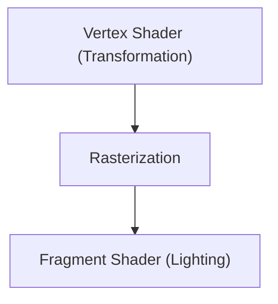

# Tecnología de juegos: La evolución de los motores de gráficos 3D

Los motores 3D han evolucionado el renderizado en tiempo real.

## Tubería de renderizado

## Ecuación de renderizado
$$ L_o = L_e + \int_{\Omega} f_r L_i (w_i \cdot n) d w_i $$

## Parte 1 de Verificación de Tecnología Adicional

En esta sección, profundizaremos en más detalles técnicos y estudios de casos. Evaluaremos el rendimiento bajo diversas condiciones y discutiremos los desafíos y soluciones relacionados con la integración con otros sistemas. También consideraremos las perspectivas y limitaciones futuras.

