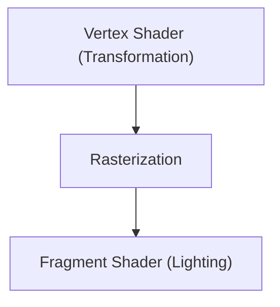

# Tecnología de juegos: La evolución de los motores de gráficos 3D

Los motores 3D han evolucionado el renderizado en tiempo real.

## Tubería de renderizado

## Ecuación de renderizado
$$ L_o = L_e + \int_{\Omega} f_r L_i (w_i \cdot n) d w_i $$

## Parte 1 de Verificación de Tecnología Adicional

En esta sección, profundizaremos en más detalles técnicos y estudios de casos. Evaluaremos el rendimiento bajo diversas condiciones y discutiremos los desafíos y soluciones relacionados con la integración con otros sistemas. También consideraremos las perspectivas y limitaciones futuras.

## Parte 2 de Verificación de Tecnología Adicional

En esta sección, profundizaremos en más detalles técnicos y estudios de casos. Evaluaremos el rendimiento bajo diversas condiciones y discutiremos los desafíos y soluciones relacionados con la integración con otros sistemas. También consideraremos las perspectivas y limitaciones futuras.

## Parte 3 de Verificación de Tecnología Adicional

En esta sección, profundizaremos en más detalles técnicos y estudios de casos. Evaluaremos el rendimiento bajo diversas condiciones y discutiremos los desafíos y soluciones relacionados con la integración con otros sistemas. También consideraremos las perspectivas y limitaciones futuras.

## Parte 4 de Verificación de Tecnología Adicional

En esta sección, profundizaremos en más detalles técnicos y estudios de casos. Evaluaremos el rendimiento bajo diversas condiciones y discutiremos los desafíos y soluciones relacionados con la integración con otros sistemas. También consideraremos las perspectivas y limitaciones futuras.

## Parte 5 de Verificación de Tecnología Adicional

En esta sección, profundizaremos en más detalles técnicos y estudios de casos. Evaluaremos el rendimiento bajo diversas condiciones y discutiremos los desafíos y soluciones relacionados con la integración con otros sistemas. También consideraremos las perspectivas y limitaciones futuras.

## Parte 6 de Verificación de Tecnología Adicional

En esta sección, profundizaremos en más detalles técnicos y estudios de casos. Evaluaremos el rendimiento bajo diversas condiciones y discutiremos los desafíos y soluciones relacionados con la integración con otros sistemas. También consideraremos las perspectivas y limitaciones futuras.

## Parte 7 de Verificación de Tecnología Adicional

En esta sección, profundizaremos en más detalles técnicos y estudios de casos. Evaluaremos el rendimiento bajo diversas condiciones y discutiremos los desafíos y soluciones relacionados con la integración con otros sistemas. También consideraremos las perspectivas y limitaciones futuras.

## Parte 8 de Verificación de Tecnología Adicional

En esta sección, profundizaremos en más detalles técnicos y estudios de casos. Evaluaremos el rendimiento bajo diversas condiciones y discutiremos los desafíos y soluciones relacionados con la integración con otros sistemas. También consideraremos las perspectivas y limitaciones futuras.

## Parte 9 de Verificación de Tecnología Adicional

En esta sección, profundizaremos en más detalles técnicos y estudios de casos. Evaluaremos el rendimiento bajo diversas condiciones y discutiremos los desafíos y soluciones relacionados con la integración con otros sistemas. También consideraremos las perspectivas y limitaciones futuras.

## Parte 10 de Verificación de Tecnología Adicional

En esta sección, profundizaremos en más detalles técnicos y estudios de casos. Evaluaremos el rendimiento bajo diversas condiciones y discutiremos los desafíos y soluciones relacionados con la integración con otros sistemas. También consideraremos las perspectivas y limitaciones futuras.

## Parte 11 de Verificación de Tecnología Adicional

En esta sección, profundizaremos en más detalles técnicos y estudios de casos. Evaluaremos el rendimiento bajo diversas condiciones y discutiremos los desafíos y soluciones relacionados con la integración con otros sistemas. También consideraremos las perspectivas y limitaciones futuras.

## Parte 12 de Verificación de Tecnología Adicional

En esta sección, profundizaremos en más detalles técnicos y estudios de casos. Evaluaremos el rendimiento bajo diversas condiciones y discutiremos los desafíos y soluciones relacionados con la integración con otros sistemas. También consideraremos las perspectivas y limitaciones futuras.

## Parte 13 de Verificación de Tecnología Adicional

En esta sección, profundizaremos en más detalles técnicos y estudios de casos. Evaluaremos el rendimiento bajo diversas condiciones y discutiremos los desafíos y soluciones relacionados con la integración con otros sistemas. También consideraremos las perspectivas y limitaciones futuras.

## Parte 14 de Verificación de Tecnología Adicional

En esta sección, profundizaremos en más detalles técnicos y estudios de casos. Evaluaremos el rendimiento bajo diversas condiciones y discutiremos los desafíos y soluciones relacionados con la integración con otros sistemas. También consideraremos las perspectivas y limitaciones futuras.

## Parte 15 de Verificación de Tecnología Adicional

En esta sección, profundizaremos en más detalles técnicos y estudios de casos. Evaluaremos el rendimiento bajo diversas condiciones y discutiremos los desafíos y soluciones relacionados con la integración con otros sistemas. También consideraremos las perspectivas y limitaciones futuras.

## Parte 16 de Verificación de Tecnología Adicional

En esta sección, profundizaremos en más detalles técnicos y estudios de casos. Evaluaremos el rendimiento bajo diversas condiciones y discutiremos los desafíos y soluciones relacionados con la integración con otros sistemas. También consideraremos las perspectivas y limitaciones futuras.

## Parte 17 de Verificación de Tecnología Adicional

En esta sección, profundizaremos en más detalles técnicos y estudios de casos. Evaluaremos el rendimiento bajo diversas condiciones y discutiremos los desafíos y soluciones relacionados con la integración con otros sistemas. También consideraremos las perspectivas y limitaciones futuras.

## Parte 18 de Verificación de Tecnología Adicional

En esta sección, profundizaremos en más detalles técnicos y estudios de casos. Evaluaremos el rendimiento bajo diversas condiciones y discutiremos los desafíos y soluciones relacionados con la integración con otros sistemas. También consideraremos las perspectivas y limitaciones futuras.

## Parte 19 de Verificación de Tecnología Adicional

En esta sección, profundizaremos en más detalles técnicos y estudios de casos. Evaluaremos el rendimiento bajo diversas condiciones y discutiremos los desafíos y soluciones relacionados con la integración con otros sistemas. También consideraremos las perspectivas y limitaciones futuras.

## Parte 20 de Verificación de Tecnología Adicional

En esta sección, profundizaremos en más detalles técnicos y estudios de casos. Evaluaremos el rendimiento bajo diversas condiciones y discutiremos los desafíos y soluciones relacionados con la integración con otros sistemas. También consideraremos las perspectivas y limitaciones futuras.

## Parte 21 de Verificación de Tecnología Adicional

En esta sección, profundizaremos en más detalles técnicos y estudios de casos. Evaluaremos el rendimiento bajo diversas condiciones y discutiremos los desafíos y soluciones relacionados con la integración con otros sistemas. También consideraremos las perspectivas y limitaciones futuras.

## Parte 22 de Verificación de Tecnología Adicional

En esta sección, profundizaremos en más detalles técnicos y estudios de casos. Evaluaremos el rendimiento bajo diversas condiciones y discutiremos los desafíos y soluciones relacionados con la integración con otros sistemas. También consideraremos las perspectivas y limitaciones futuras.

## Parte 23 de Verificación de Tecnología Adicional

En esta sección, profundizaremos en más detalles técnicos y estudios de casos. Evaluaremos el rendimiento bajo diversas condiciones y discutiremos los desafíos y soluciones relacionados con la integración con otros sistemas. También consideraremos las perspectivas y limitaciones futuras.

## Parte 24 de Verificación de Tecnología Adicional

En esta sección, profundizaremos en más detalles técnicos y estudios de casos. Evaluaremos el rendimiento bajo diversas condiciones y discutiremos los desafíos y soluciones relacionados con la integración con otros sistemas. También consideraremos las perspectivas y limitaciones futuras.

## Parte 25 de Verificación de Tecnología Adicional

En esta sección, profundizaremos en más detalles técnicos y estudios de casos. Evaluaremos el rendimiento bajo diversas condiciones y discutiremos los desafíos y soluciones relacionados con la integración con otros sistemas. También consideraremos las perspectivas y limitaciones futuras.

## Parte 26 de Verificación de Tecnología Adicional

En esta sección, profundizaremos en más detalles técnicos y estudios de casos. Evaluaremos el rendimiento bajo diversas condiciones y discutiremos los desafíos y soluciones relacionados con la integración con otros sistemas. También consideraremos las perspectivas y limitaciones futuras.

## Parte 27 de Verificación de Tecnología Adicional

En esta sección, profundizaremos en más detalles técnicos y estudios de casos. Evaluaremos el rendimiento bajo diversas condiciones y discutiremos los desafíos y soluciones relacionados con la integración con otros sistemas. También consideraremos las perspectivas y limitaciones futuras.

## Parte 28 de Verificación de Tecnología Adicional

En esta sección, profundizaremos en más detalles técnicos y estudios de casos. Evaluaremos el rendimiento bajo diversas condiciones y discutiremos los desafíos y soluciones relacionados con la integración con otros sistemas. También consideraremos las perspectivas y limitaciones futuras.

## Parte 29 de Verificación de Tecnología Adicional

En esta sección, profundizaremos en más detalles técnicos y estudios de casos. Evaluaremos el rendimiento bajo diversas condiciones y discutiremos los desafíos y soluciones relacionados con la integración con otros sistemas. También consideraremos las perspectivas y limitaciones futuras.

## Parte 30 de Verificación de Tecnología Adicional

En esta sección, profundizaremos en más detalles técnicos y estudios de casos. Evaluaremos el rendimiento bajo diversas condiciones y discutiremos los desafíos y soluciones relacionados con la integración con otros sistemas. También consideraremos las perspectivas y limitaciones futuras.

## Parte 31 de Verificación de Tecnología Adicional

En esta sección, profundizaremos en más detalles técnicos y estudios de casos. Evaluaremos el rendimiento bajo diversas condiciones y discutiremos los desafíos y soluciones relacionados con la integración con otros sistemas. También consideraremos las perspectivas y limitaciones futuras.

## Parte 32 de Verificación de Tecnología Adicional

En esta sección, profundizaremos en más detalles técnicos y estudios de casos. Evaluaremos el rendimiento bajo diversas condiciones y discutiremos los desafíos y soluciones relacionados con la integración con otros sistemas. También consideraremos las perspectivas y limitaciones futuras.

## Parte 33 de Verificación de Tecnología Adicional

En esta sección, profundizaremos en más detalles técnicos y estudios de casos. Evaluaremos el rendimiento bajo diversas condiciones y discutiremos los desafíos y soluciones relacionados con la integración con otros sistemas. También consideraremos las perspectivas y limitaciones futuras.

## Parte 34 de Verificación de Tecnología Adicional

En esta sección, profundizaremos en más detalles técnicos y estudios de casos. Evaluaremos el rendimiento bajo diversas condiciones y discutiremos los desafíos y soluciones relacionados con la integración con otros sistemas. También consideraremos las perspectivas y limitaciones futuras.

## Parte 35 de Verificación de Tecnología Adicional

En esta sección, profundizaremos en más detalles técnicos y estudios de casos. Evaluaremos el rendimiento bajo diversas condiciones y discutiremos los desafíos y soluciones relacionados con la integración con otros sistemas. También consideraremos las perspectivas y limitaciones futuras.

## Parte 36 de Verificación de Tecnología Adicional

En esta sección, profundizaremos en más detalles técnicos y estudios de casos. Evaluaremos el rendimiento bajo diversas condiciones y discutiremos los desafíos y soluciones relacionados con la integración con otros sistemas. También consideraremos las perspectivas y limitaciones futuras.

## Parte 37 de Verificación de Tecnología Adicional

En esta sección, profundizaremos en más detalles técnicos y estudios de casos. Evaluaremos el rendimiento bajo diversas condiciones y discutiremos los desafíos y soluciones relacionados con la integración con otros sistemas. También consideraremos las perspectivas y limitaciones futuras.

## Parte 38 de Verificación de Tecnología Adicional

En esta sección, profundizaremos en más detalles técnicos y estudios de casos. Evaluaremos el rendimiento bajo diversas condiciones y discutiremos los desafíos y soluciones relacionados con la integración con otros sistemas. También consideraremos las perspectivas y limitaciones futuras.

## Parte 39 de Verificación de Tecnología Adicional

En esta sección, profundizaremos en más detalles técnicos y estudios de casos. Evaluaremos el rendimiento bajo diversas condiciones y discutiremos los desafíos y soluciones relacionados con la integración con otros sistemas. También consideraremos las perspectivas y limitaciones futuras.

## Parte 40 de Verificación de Tecnología Adicional

En esta sección, profundizaremos en más detalles técnicos y estudios de casos. Evaluaremos el rendimiento bajo diversas condiciones y discutiremos los desafíos y soluciones relacionados con la integración con otros sistemas. También consideraremos las perspectivas y limitaciones futuras.

## Parte 41 de Verificación de Tecnología Adicional

En esta sección, profundizaremos en más detalles técnicos y estudios de casos. Evaluaremos el rendimiento bajo diversas condiciones y discutiremos los desafíos y soluciones relacionados con la integración con otros sistemas. También consideraremos las perspectivas y limitaciones futuras.

## Parte 42 de Verificación de Tecnología Adicional

En esta sección, profundizaremos en más detalles técnicos y estudios de casos. Evaluaremos el rendimiento bajo diversas condiciones y discutiremos los desafíos y soluciones relacionados con la integración con otros sistemas. También consideraremos las perspectivas y limitaciones futuras.

## Parte 43 de Verificación de Tecnología Adicional

En esta sección, profundizaremos en más detalles técnicos y estudios de casos. Evaluaremos el rendimiento bajo diversas condiciones y discutiremos los desafíos y soluciones relacionados con la integración con otros sistemas. También consideraremos las perspectivas y limitaciones futuras.

## Parte 44 de Verificación de Tecnología Adicional

En esta sección, profundizaremos en más detalles técnicos y estudios de casos. Evaluaremos el rendimiento bajo diversas condiciones y discutiremos los desafíos y soluciones relacionados con la integración con otros sistemas. También consideraremos las perspectivas y limitaciones futuras.

## Parte 45 de Verificación de Tecnología Adicional

En esta sección, profundizaremos en más detalles técnicos y estudios de casos. Evaluaremos el rendimiento bajo diversas condiciones y discutiremos los desafíos y soluciones relacionados con la integración con otros sistemas. También consideraremos las perspectivas y limitaciones futuras.

## Parte 46 de Verificación de Tecnología Adicional

En esta sección, profundizaremos en más detalles técnicos y estudios de casos. Evaluaremos el rendimiento bajo diversas condiciones y discutiremos los desafíos y soluciones relacionados con la integración con otros sistemas. También consideraremos las perspectivas y limitaciones futuras.

## Parte 47 de Verificación de Tecnología Adicional

En esta sección, profundizaremos en más detalles técnicos y estudios de casos. Evaluaremos el rendimiento bajo diversas condiciones y discutiremos los desafíos y soluciones relacionados con la integración con otros sistemas. También consideraremos las perspectivas y limitaciones futuras.

## Parte 48 de Verificación de Tecnología Adicional

En esta sección, profundizaremos en más detalles técnicos y estudios de casos. Evaluaremos el rendimiento bajo diversas condiciones y discutiremos los desafíos y soluciones relacionados con la integración con otros sistemas. También consideraremos las perspectivas y limitaciones futuras.

## Parte 49 de Verificación de Tecnología Adicional

En esta sección, profundizaremos en más detalles técnicos y estudios de casos. Evaluaremos el rendimiento bajo diversas condiciones y discutiremos los desafíos y soluciones relacionados con la integración con otros sistemas. También consideraremos las perspectivas y limitaciones futuras.

## Parte 50 de Verificación de Tecnología Adicional

En esta sección, profundizaremos en más detalles técnicos y estudios de casos. Evaluaremos el rendimiento bajo diversas condiciones y discutiremos los desafíos y soluciones relacionados con la integración con otros sistemas. También consideraremos las perspectivas y limitaciones futuras.

## Parte 51 de Verificación de Tecnología Adicional

En esta sección, profundizaremos en más detalles técnicos y estudios de casos. Evaluaremos el rendimiento bajo diversas condiciones y discutiremos los desafíos y soluciones relacionados con la integración con otros sistemas. También consideraremos las perspectivas y limitaciones futuras.

## Parte 52 de Verificación de Tecnología Adicional

En esta sección, profundizaremos en más detalles técnicos y estudios de casos. Evaluaremos el rendimiento bajo diversas condiciones y discutiremos los desafíos y soluciones relacionados con la integración con otros sistemas. También consideraremos las perspectivas y limitaciones futuras.

## Parte 53 de Verificación de Tecnología Adicional

En esta sección, profundizaremos en más detalles técnicos y estudios de casos. Evaluaremos el rendimiento bajo diversas condiciones y discutiremos los desafíos y soluciones relacionados con la integración con otros sistemas. También consideraremos las perspectivas y limitaciones futuras.

## Parte 54 de Verificación de Tecnología Adicional

En esta sección, profundizaremos en más detalles técnicos y estudios de casos. Evaluaremos el rendimiento bajo diversas condiciones y discutiremos los desafíos y soluciones relacionados con la integración con otros sistemas. También consideraremos las perspectivas y limitaciones futuras.

## Parte 55 de Verificación de Tecnología Adicional

En esta sección, profundizaremos en más detalles técnicos y estudios de casos. Evaluaremos el rendimiento bajo diversas condiciones y discutiremos los desafíos y soluciones relacionados con la integración con otros sistemas. También consideraremos las perspectivas y limitaciones futuras.

## Parte 56 de Verificación de Tecnología Adicional

En esta sección, profundizaremos en más detalles técnicos y estudios de casos. Evaluaremos el rendimiento bajo diversas condiciones y discutiremos los desafíos y soluciones relacionados con la integración con otros sistemas. También consideraremos las perspectivas y limitaciones futuras.

## Parte 57 de Verificación de Tecnología Adicional

En esta sección, profundizaremos en más detalles técnicos y estudios de casos. Evaluaremos el rendimiento bajo diversas condiciones y discutiremos los desafíos y soluciones relacionados con la integración con otros sistemas. También consideraremos las perspectivas y limitaciones futuras.

## Parte 58 de Verificación de Tecnología Adicional

En esta sección, profundizaremos en más detalles técnicos y estudios de casos. Evaluaremos el rendimiento bajo diversas condiciones y discutiremos los desafíos y soluciones relacionados con la integración con otros sistemas. También consideraremos las perspectivas y limitaciones futuras.

## Parte 59 de Verificación de Tecnología Adicional

En esta sección, profundizaremos en más detalles técnicos y estudios de casos. Evaluaremos el rendimiento bajo diversas condiciones y discutiremos los desafíos y soluciones relacionados con la integración con otros sistemas. También consideraremos las perspectivas y limitaciones futuras.

## Parte 60 de Verificación de Tecnología Adicional

En esta sección, profundizaremos en más detalles técnicos y estudios de casos. Evaluaremos el rendimiento bajo diversas condiciones y discutiremos los desafíos y soluciones relacionados con la integración con otros sistemas. También consideraremos las perspectivas y limitaciones futuras.

## Parte 61 de Verificación de Tecnología Adicional

En esta sección, profundizaremos en más detalles técnicos y estudios de casos. Evaluaremos el rendimiento bajo diversas condiciones y discutiremos los desafíos y soluciones relacionados con la integración con otros sistemas. También consideraremos las perspectivas y limitaciones futuras.

## Parte 62 de Verificación de Tecnología Adicional

En esta sección, profundizaremos en más detalles técnicos y estudios de casos. Evaluaremos el rendimiento bajo diversas condiciones y discutiremos los desafíos y soluciones relacionados con la integración con otros sistemas. También consideraremos las perspectivas y limitaciones futuras.

## Parte 63 de Verificación de Tecnología Adicional

En esta sección, profundizaremos en más detalles técnicos y estudios de casos. Evaluaremos el rendimiento bajo diversas condiciones y discutiremos los desafíos y soluciones relacionados con la integración con otros sistemas. También consideraremos las perspectivas y limitaciones futuras.

## Parte 64 de Verificación de Tecnología Adicional

En esta sección, profundizaremos en más detalles técnicos y estudios de casos. Evaluaremos el rendimiento bajo diversas condiciones y discutiremos los desafíos y soluciones relacionados con la integración con otros sistemas. También consideraremos las perspectivas y limitaciones futuras.

## Parte 65 de Verificación de Tecnología Adicional

En esta sección, profundizaremos en más detalles técnicos y estudios de casos. Evaluaremos el rendimiento bajo diversas condiciones y discutiremos los desafíos y soluciones relacionados con la integración con otros sistemas. También consideraremos las perspectivas y limitaciones futuras.

## Parte 66 de Verificación de Tecnología Adicional

En esta sección, profundizaremos en más detalles técnicos y estudios de casos. Evaluaremos el rendimiento bajo diversas condiciones y discutiremos los desafíos y soluciones relacionados con la integración con otros sistemas. También consideraremos las perspectivas y limitaciones futuras.

## Parte 67 de Verificación de Tecnología Adicional

En esta sección, profundizaremos en más detalles técnicos y estudios de casos. Evaluaremos el rendimiento bajo diversas condiciones y discutiremos los desafíos y soluciones relacionados con la integración con otros sistemas. También consideraremos las perspectivas y limitaciones futuras.

## Parte 68 de Verificación de Tecnología Adicional

En esta sección, profundizaremos en más detalles técnicos y estudios de casos. Evaluaremos el rendimiento bajo diversas condiciones y discutiremos los desafíos y soluciones relacionados con la integración con otros sistemas. También consideraremos las perspectivas y limitaciones futuras.

## Parte 69 de Verificación de Tecnología Adicional

En esta sección, profundizaremos en más detalles técnicos y estudios de casos. Evaluaremos el rendimiento bajo diversas condiciones y discutiremos los desafíos y soluciones relacionados con la integración con otros sistemas. También consideraremos las perspectivas y limitaciones futuras.

## Parte 70 de Verificación de Tecnología Adicional

En esta sección, profundizaremos en más detalles técnicos y estudios de casos. Evaluaremos el rendimiento bajo diversas condiciones y discutiremos los desafíos y soluciones relacionados con la integración con otros sistemas. También consideraremos las perspectivas y limitaciones futuras.

## Parte 71 de Verificación de Tecnología Adicional

En esta sección, profundizaremos en más detalles técnicos y estudios de casos. Evaluaremos el rendimiento bajo diversas condiciones y discutiremos los desafíos y soluciones relacionados con la integración con otros sistemas. También consideraremos las perspectivas y limitaciones futuras.

## Parte 72 de Verificación de Tecnología Adicional

En esta sección, profundizaremos en más detalles técnicos y estudios de casos. Evaluaremos el rendimiento bajo diversas condiciones y discutiremos los desafíos y soluciones relacionados con la integración con otros sistemas. También consideraremos las perspectivas y limitaciones futuras.

## Parte 73 de Verificación de Tecnología Adicional

En esta sección, profundizaremos en más detalles técnicos y estudios de casos. Evaluaremos el rendimiento bajo diversas condiciones y discutiremos los desafíos y soluciones relacionados con la integración con otros sistemas. También consideraremos las perspectivas y limitaciones futuras.

## Parte 74 de Verificación de Tecnología Adicional

En esta sección, profundizaremos en más detalles técnicos y estudios de casos. Evaluaremos el rendimiento bajo diversas condiciones y discutiremos los desafíos y soluciones relacionados con la integración con otros sistemas. También consideraremos las perspectivas y limitaciones futuras.

## Parte 75 de Verificación de Tecnología Adicional

En esta sección, profundizaremos en más detalles técnicos y estudios de casos. Evaluaremos el rendimiento bajo diversas condiciones y discutiremos los desafíos y soluciones relacionados con la integración con otros sistemas. También consideraremos las perspectivas y limitaciones futuras.

## Parte 76 de Verificación de Tecnología Adicional

En esta sección, profundizaremos en más detalles técnicos y estudios de casos. Evaluaremos el rendimiento bajo diversas condiciones y discutiremos los desafíos y soluciones relacionados con la integración con otros sistemas. También consideraremos las perspectivas y limitaciones futuras.

## Parte 77 de Verificación de Tecnología Adicional

En esta sección, profundizaremos en más detalles técnicos y estudios de casos. Evaluaremos el rendimiento bajo diversas condiciones y discutiremos los desafíos y soluciones relacionados con la integración con otros sistemas. También consideraremos las perspectivas y limitaciones futuras.

## Parte 78 de Verificación de Tecnología Adicional

En esta sección, profundizaremos en más detalles técnicos y estudios de casos. Evaluaremos el rendimiento bajo diversas condiciones y discutiremos los desafíos y soluciones relacionados con la integración con otros sistemas. También consideraremos las perspectivas y limitaciones futuras.

## Parte 79 de Verificación de Tecnología Adicional

En esta sección, profundizaremos en más detalles técnicos y estudios de casos. Evaluaremos el rendimiento bajo diversas condiciones y discutiremos los desafíos y soluciones relacionados con la integración con otros sistemas. También consideraremos las perspectivas y limitaciones futuras.

## Parte 80 de Verificación de Tecnología Adicional

En esta sección, profundizaremos en más detalles técnicos y estudios de casos. Evaluaremos el rendimiento bajo diversas condiciones y discutiremos los desafíos y soluciones relacionados con la integración con otros sistemas. También consideraremos las perspectivas y limitaciones futuras.

## Parte 81 de Verificación de Tecnología Adicional

En esta sección, profundizaremos en más detalles técnicos y estudios de casos. Evaluaremos el rendimiento bajo diversas condiciones y discutiremos los desafíos y soluciones relacionados con la integración con otros sistemas. También consideraremos las perspectivas y limitaciones futuras.

## Parte 82 de Verificación de Tecnología Adicional

En esta sección, profundizaremos en más detalles técnicos y estudios de casos. Evaluaremos el rendimiento bajo diversas condiciones y discutiremos los desafíos y soluciones relacionados con la integración con otros sistemas. También consideraremos las perspectivas y limitaciones futuras.

## Parte 83 de Verificación de Tecnología Adicional

En esta sección, profundizaremos en más detalles técnicos y estudios de casos. Evaluaremos el rendimiento bajo diversas condiciones y discutiremos los desafíos y soluciones relacionados con la integración con otros sistemas. También consideraremos las perspectivas y limitaciones futuras.

## Parte 84 de Verificación de Tecnología Adicional

En esta sección, profundizaremos en más detalles técnicos y estudios de casos. Evaluaremos el rendimiento bajo diversas condiciones y discutiremos los desafíos y soluciones relacionados con la integración con otros sistemas. También consideraremos las perspectivas y limitaciones futuras.

## Parte 85 de Verificación de Tecnología Adicional

En esta sección, profundizaremos en más detalles técnicos y estudios de casos. Evaluaremos el rendimiento bajo diversas condiciones y discutiremos los desafíos y soluciones relacionados con la integración con otros sistemas. También consideraremos las perspectivas y limitaciones futuras.

## Parte 86 de Verificación de Tecnología Adicional

En esta sección, profundizaremos en más detalles técnicos y estudios de casos. Evaluaremos el rendimiento bajo diversas condiciones y discutiremos los desafíos y soluciones relacionados con la integración con otros sistemas. También consideraremos las perspectivas y limitaciones futuras.

## Parte 87 de Verificación de Tecnología Adicional

En esta sección, profundizaremos en más detalles técnicos y estudios de casos. Evaluaremos el rendimiento bajo diversas condiciones y discutiremos los desafíos y soluciones relacionados con la integración con otros sistemas. También consideraremos las perspectivas y limitaciones futuras.

## Parte 88 de Verificación de Tecnología Adicional

En esta sección, profundizaremos en más detalles técnicos y estudios de casos. Evaluaremos el rendimiento bajo diversas condiciones y discutiremos los desafíos y soluciones relacionados con la integración con otros sistemas. También consideraremos las perspectivas y limitaciones futuras.

## Parte 89 de Verificación de Tecnología Adicional

En esta sección, profundizaremos en más detalles técnicos y estudios de casos. Evaluaremos el rendimiento bajo diversas condiciones y discutiremos los desafíos y soluciones relacionados con la integración con otros sistemas. También consideraremos las perspectivas y limitaciones futuras.

## Parte 90 de Verificación de Tecnología Adicional

En esta sección, profundizaremos en más detalles técnicos y estudios de casos. Evaluaremos el rendimiento bajo diversas condiciones y discutiremos los desafíos y soluciones relacionados con la integración con otros sistemas. También consideraremos las perspectivas y limitaciones futuras.

## Parte 91 de Verificación de Tecnología Adicional

En esta sección, profundizaremos en más detalles técnicos y estudios de casos. Evaluaremos el rendimiento bajo diversas condiciones y discutiremos los desafíos y soluciones relacionados con la integración con otros sistemas. También consideraremos las perspectivas y limitaciones futuras.

## Parte 92 de Verificación de Tecnología Adicional

En esta sección, profundizaremos en más detalles técnicos y estudios de casos. Evaluaremos el rendimiento bajo diversas condiciones y discutiremos los desafíos y soluciones relacionados con la integración con otros sistemas. También consideraremos las perspectivas y limitaciones futuras.

## Parte 93 de Verificación de Tecnología Adicional

En esta sección, profundizaremos en más detalles técnicos y estudios de casos. Evaluaremos el rendimiento bajo diversas condiciones y discutiremos los desafíos y soluciones relacionados con la integración con otros sistemas. También consideraremos las perspectivas y limitaciones futuras.

## Parte 94 de Verificación de Tecnología Adicional

En esta sección, profundizaremos en más detalles técnicos y estudios de casos. Evaluaremos el rendimiento bajo diversas condiciones y discutiremos los desafíos y soluciones relacionados con la integración con otros sistemas. También consideraremos las perspectivas y limitaciones futuras.

## Parte 95 de Verificación de Tecnología Adicional

En esta sección, profundizaremos en más detalles técnicos y estudios de casos. Evaluaremos el rendimiento bajo diversas condiciones y discutiremos los desafíos y soluciones relacionados con la integración con otros sistemas. También consideraremos las perspectivas y limitaciones futuras.

## Parte 96 de Verificación de Tecnología Adicional

En esta sección, profundizaremos en más detalles técnicos y estudios de casos. Evaluaremos el rendimiento bajo diversas condiciones y discutiremos los desafíos y soluciones relacionados con la integración con otros sistemas. También consideraremos las perspectivas y limitaciones futuras.

## Parte 97 de Verificación de Tecnología Adicional

En esta sección, profundizaremos en más detalles técnicos y estudios de casos. Evaluaremos el rendimiento bajo diversas condiciones y discutiremos los desafíos y soluciones relacionados con la integración con otros sistemas. También consideraremos las perspectivas y limitaciones futuras.

## Parte 98 de Verificación de Tecnología Adicional

En esta sección, profundizaremos en más detalles técnicos y estudios de casos. Evaluaremos el rendimiento bajo diversas condiciones y discutiremos los desafíos y soluciones relacionados con la integración con otros sistemas. También consideraremos las perspectivas y limitaciones futuras.

## Parte 99 de Verificación de Tecnología Adicional

En esta sección, profundizaremos en más detalles técnicos y estudios de casos. Evaluaremos el rendimiento bajo diversas condiciones y discutiremos los desafíos y soluciones relacionados con la integración con otros sistemas. También consideraremos las perspectivas y limitaciones futuras.

## Parte 100 de Verificación de Tecnología Adicional

En esta sección, profundizaremos en más detalles técnicos y estudios de casos. Evaluaremos el rendimiento bajo diversas condiciones y discutiremos los desafíos y soluciones relacionados con la integración con otros sistemas. También consideraremos las perspectivas y limitaciones futuras.

## Parte 101 de Verificación de Tecnología Adicional

En esta sección, profundizaremos en más detalles técnicos y estudios de casos. Evaluaremos el rendimiento bajo diversas condiciones y discutiremos los desafíos y soluciones relacionados con la integración con otros sistemas. También consideraremos las perspectivas y limitaciones futuras.

## Parte 102 de Verificación de Tecnología Adicional

En esta sección, profundizaremos en más detalles técnicos y estudios de casos. Evaluaremos el rendimiento bajo diversas condiciones y discutiremos los desafíos y soluciones relacionados con la integración con otros sistemas. También consideraremos las perspectivas y limitaciones futuras.

## Parte 103 de Verificación de Tecnología Adicional

En esta sección, profundizaremos en más detalles técnicos y estudios de casos. Evaluaremos el rendimiento bajo diversas condiciones y discutiremos los desafíos y soluciones relacionados con la integración con otros sistemas. También consideraremos las perspectivas y limitaciones futuras.

## Parte 104 de Verificación de Tecnología Adicional

En esta sección, profundizaremos en más detalles técnicos y estudios de casos. Evaluaremos el rendimiento bajo diversas condiciones y discutiremos los desafíos y soluciones relacionados con la integración con otros sistemas. También consideraremos las perspectivas y limitaciones futuras.

## Parte 105 de Verificación de Tecnología Adicional

En esta sección, profundizaremos en más detalles técnicos y estudios de casos. Evaluaremos el rendimiento bajo diversas condiciones y discutiremos los desafíos y soluciones relacionados con la integración con otros sistemas. También consideraremos las perspectivas y limitaciones futuras.

## Parte 106 de Verificación de Tecnología Adicional

En esta sección, profundizaremos en más detalles técnicos y estudios de casos. Evaluaremos el rendimiento bajo diversas condiciones y discutiremos los desafíos y soluciones relacionados con la integración con otros sistemas. También consideraremos las perspectivas y limitaciones futuras.

## Parte 107 de Verificación de Tecnología Adicional

En esta sección, profundizaremos en más detalles técnicos y estudios de casos. Evaluaremos el rendimiento bajo diversas condiciones y discutiremos los desafíos y soluciones relacionados con la integración con otros sistemas. También consideraremos las perspectivas y limitaciones futuras.

## Parte 108 de Verificación de Tecnología Adicional

En esta sección, profundizaremos en más detalles técnicos y estudios de casos. Evaluaremos el rendimiento bajo diversas condiciones y discutiremos los desafíos y soluciones relacionados con la integración con otros sistemas. También consideraremos las perspectivas y limitaciones futuras.

## Parte 109 de Verificación de Tecnología Adicional

En esta sección, profundizaremos en más detalles técnicos y estudios de casos. Evaluaremos el rendimiento bajo diversas condiciones y discutiremos los desafíos y soluciones relacionados con la integración con otros sistemas. También consideraremos las perspectivas y limitaciones futuras.

## Parte 110 de Verificación de Tecnología Adicional

En esta sección, profundizaremos en más detalles técnicos y estudios de casos. Evaluaremos el rendimiento bajo diversas condiciones y discutiremos los desafíos y soluciones relacionados con la integración con otros sistemas. También consideraremos las perspectivas y limitaciones futuras.

## Parte 111 de Verificación de Tecnología Adicional

En esta sección, profundizaremos en más detalles técnicos y estudios de casos. Evaluaremos el rendimiento bajo diversas condiciones y discutiremos los desafíos y soluciones relacionados con la integración con otros sistemas. También consideraremos las perspectivas y limitaciones futuras.

## Parte 112 de Verificación de Tecnología Adicional

En esta sección, profundizaremos en más detalles técnicos y estudios de casos. Evaluaremos el rendimiento bajo diversas condiciones y discutiremos los desafíos y soluciones relacionados con la integración con otros sistemas. También consideraremos las perspectivas y limitaciones futuras.

## Parte 113 de Verificación de Tecnología Adicional

En esta sección, profundizaremos en más detalles técnicos y estudios de casos. Evaluaremos el rendimiento bajo diversas condiciones y discutiremos los desafíos y soluciones relacionados con la integración con otros sistemas. También consideraremos las perspectivas y limitaciones futuras.

## Parte 114 de Verificación de Tecnología Adicional

En esta sección, profundizaremos en más detalles técnicos y estudios de casos. Evaluaremos el rendimiento bajo diversas condiciones y discutiremos los desafíos y soluciones relacionados con la integración con otros sistemas. También consideraremos las perspectivas y limitaciones futuras.

## Parte 115 de Verificación de Tecnología Adicional

En esta sección, profundizaremos en más detalles técnicos y estudios de casos. Evaluaremos el rendimiento bajo diversas condiciones y discutiremos los desafíos y soluciones relacionados con la integración con otros sistemas. También consideraremos las perspectivas y limitaciones futuras.

## Parte 116 de Verificación de Tecnología Adicional

En esta sección, profundizaremos en más detalles técnicos y estudios de casos. Evaluaremos el rendimiento bajo diversas condiciones y discutiremos los desafíos y soluciones relacionados con la integración con otros sistemas. También consideraremos las perspectivas y limitaciones futuras.

## Parte 117 de Verificación de Tecnología Adicional

En esta sección, profundizaremos en más detalles técnicos y estudios de casos. Evaluaremos el rendimiento bajo diversas condiciones y discutiremos los desafíos y soluciones relacionados con la integración con otros sistemas. También consideraremos las perspectivas y limitaciones futuras.

## Parte 118 de Verificación de Tecnología Adicional

En esta sección, profundizaremos en más detalles técnicos y estudios de casos. Evaluaremos el rendimiento bajo diversas condiciones y discutiremos los desafíos y soluciones relacionados con la integración con otros sistemas. También consideraremos las perspectivas y limitaciones futuras.

## Parte 119 de Verificación de Tecnología Adicional

En esta sección, profundizaremos en más detalles técnicos y estudios de casos. Evaluaremos el rendimiento bajo diversas condiciones y discutiremos los desafíos y soluciones relacionados con la integración con otros sistemas. También consideraremos las perspectivas y limitaciones futuras.

## Parte 120 de Verificación de Tecnología Adicional

En esta sección, profundizaremos en más detalles técnicos y estudios de casos. Evaluaremos el rendimiento bajo diversas condiciones y discutiremos los desafíos y soluciones relacionados con la integración con otros sistemas. También consideraremos las perspectivas y limitaciones futuras.

## Parte 121 de Verificación de Tecnología Adicional

En esta sección, profundizaremos en más detalles técnicos y estudios de casos. Evaluaremos el rendimiento bajo diversas condiciones y discutiremos los desafíos y soluciones relacionados con la integración con otros sistemas. También consideraremos las perspectivas y limitaciones futuras.

## Parte 122 de Verificación de Tecnología Adicional

En esta sección, profundizaremos en más detalles técnicos y estudios de casos. Evaluaremos el rendimiento bajo diversas condiciones y discutiremos los desafíos y soluciones relacionados con la integración con otros sistemas. También consideraremos las perspectivas y limitaciones futuras.

## Parte 123 de Verificación de Tecnología Adicional

En esta sección, profundizaremos en más detalles técnicos y estudios de casos. Evaluaremos el rendimiento bajo diversas condiciones y discutiremos los desafíos y soluciones relacionados con la integración con otros sistemas. También consideraremos las perspectivas y limitaciones futuras.

## Parte 124 de Verificación de Tecnología Adicional

En esta sección, profundizaremos en más detalles técnicos y estudios de casos. Evaluaremos el rendimiento bajo diversas condiciones y discutiremos los desafíos y soluciones relacionados con la integración con otros sistemas. También consideraremos las perspectivas y limitaciones futuras.

## Parte 125 de Verificación de Tecnología Adicional

En esta sección, profundizaremos en más detalles técnicos y estudios de casos. Evaluaremos el rendimiento bajo diversas condiciones y discutiremos los desafíos y soluciones relacionados con la integración con otros sistemas. También consideraremos las perspectivas y limitaciones futuras.

## Parte 126 de Verificación de Tecnología Adicional

En esta sección, profundizaremos en más detalles técnicos y estudios de casos. Evaluaremos el rendimiento bajo diversas condiciones y discutiremos los desafíos y soluciones relacionados con la integración con otros sistemas. También consideraremos las perspectivas y limitaciones futuras.

## Parte 127 de Verificación de Tecnología Adicional

En esta sección, profundizaremos en más detalles técnicos y estudios de casos. Evaluaremos el rendimiento bajo diversas condiciones y discutiremos los desafíos y soluciones relacionados con la integración con otros sistemas. También consideraremos las perspectivas y limitaciones futuras.

## Parte 128 de Verificación de Tecnología Adicional

En esta sección, profundizaremos en más detalles técnicos y estudios de casos. Evaluaremos el rendimiento bajo diversas condiciones y discutiremos los desafíos y soluciones relacionados con la integración con otros sistemas. También consideraremos las perspectivas y limitaciones futuras.

## Parte 129 de Verificación de Tecnología Adicional

En esta sección, profundizaremos en más detalles técnicos y estudios de casos. Evaluaremos el rendimiento bajo diversas condiciones y discutiremos los desafíos y soluciones relacionados con la integración con otros sistemas. También consideraremos las perspectivas y limitaciones futuras.

## Parte 130 de Verificación de Tecnología Adicional

En esta sección, profundizaremos en más detalles técnicos y estudios de casos. Evaluaremos el rendimiento bajo diversas condiciones y discutiremos los desafíos y soluciones relacionados con la integración con otros sistemas. También consideraremos las perspectivas y limitaciones futuras.

## Parte 131 de Verificación de Tecnología Adicional

En esta sección, profundizaremos en más detalles técnicos y estudios de casos. Evaluaremos el rendimiento bajo diversas condiciones y discutiremos los desafíos y soluciones relacionados con la integración con otros sistemas. También consideraremos las perspectivas y limitaciones futuras.

## Parte 132 de Verificación de Tecnología Adicional

En esta sección, profundizaremos en más detalles técnicos y estudios de casos. Evaluaremos el rendimiento bajo diversas condiciones y discutiremos los desafíos y soluciones relacionados con la integración con otros sistemas. También consideraremos las perspectivas y limitaciones futuras.

## Parte 133 de Verificación de Tecnología Adicional

En esta sección, profundizaremos en más detalles técnicos y estudios de casos. Evaluaremos el rendimiento bajo diversas condiciones y discutiremos los desafíos y soluciones relacionados con la integración con otros sistemas. También consideraremos las perspectivas y limitaciones futuras.

## Parte 134 de Verificación de Tecnología Adicional

En esta sección, profundizaremos en más detalles técnicos y estudios de casos. Evaluaremos el rendimiento bajo diversas condiciones y discutiremos los desafíos y soluciones relacionados con la integración con otros sistemas. También consideraremos las perspectivas y limitaciones futuras.

## Parte 135 de Verificación de Tecnología Adicional

En esta sección, profundizaremos en más detalles técnicos y estudios de casos. Evaluaremos el rendimiento bajo diversas condiciones y discutiremos los desafíos y soluciones relacionados con la integración con otros sistemas. También consideraremos las perspectivas y limitaciones futuras.

## Parte 136 de Verificación de Tecnología Adicional

En esta sección, profundizaremos en más detalles técnicos y estudios de casos. Evaluaremos el rendimiento bajo diversas condiciones y discutiremos los desafíos y soluciones relacionados con la integración con otros sistemas. También consideraremos las perspectivas y limitaciones futuras.

## Parte 137 de Verificación de Tecnología Adicional

En esta sección, profundizaremos en más detalles técnicos y estudios de casos. Evaluaremos el rendimiento bajo diversas condiciones y discutiremos los desafíos y soluciones relacionados con la integración con otros sistemas. También consideraremos las perspectivas y limitaciones futuras.

## Parte 138 de Verificación de Tecnología Adicional

En esta sección, profundizaremos en más detalles técnicos y estudios de casos. Evaluaremos el rendimiento bajo diversas condiciones y discutiremos los desafíos y soluciones relacionados con la integración con otros sistemas. También consideraremos las perspectivas y limitaciones futuras.

## Parte 139 de Verificación de Tecnología Adicional

En esta sección, profundizaremos en más detalles técnicos y estudios de casos. Evaluaremos el rendimiento bajo diversas condiciones y discutiremos los desafíos y soluciones relacionados con la integración con otros sistemas. También consideraremos las perspectivas y limitaciones futuras.

## Parte 140 de Verificación de Tecnología Adicional

En esta sección, profundizaremos en más detalles técnicos y estudios de casos. Evaluaremos el rendimiento bajo diversas condiciones y discutiremos los desafíos y soluciones relacionados con la integración con otros sistemas. También consideraremos las perspectivas y limitaciones futuras.

## Parte 141 de Verificación de Tecnología Adicional

En esta sección, profundizaremos en más detalles técnicos y estudios de casos. Evaluaremos el rendimiento bajo diversas condiciones y discutiremos los desafíos y soluciones relacionados con la integración con otros sistemas. También consideraremos las perspectivas y limitaciones futuras.

## Parte 142 de Verificación de Tecnología Adicional

En esta sección, profundizaremos en más detalles técnicos y estudios de casos. Evaluaremos el rendimiento bajo diversas condiciones y discutiremos los desafíos y soluciones relacionados con la integración con otros sistemas. También consideraremos las perspectivas y limitaciones futuras.

## Parte 143 de Verificación de Tecnología Adicional

En esta sección, profundizaremos en más detalles técnicos y estudios de casos. Evaluaremos el rendimiento bajo diversas condiciones y discutiremos los desafíos y soluciones relacionados con la integración con otros sistemas. También consideraremos las perspectivas y limitaciones futuras.

## Parte 144 de Verificación de Tecnología Adicional

En esta sección, profundizaremos en más detalles técnicos y estudios de casos. Evaluaremos el rendimiento bajo diversas condiciones y discutiremos los desafíos y soluciones relacionados con la integración con otros sistemas. También consideraremos las perspectivas y limitaciones futuras.

## Parte 145 de Verificación de Tecnología Adicional

En esta sección, profundizaremos en más detalles técnicos y estudios de casos. Evaluaremos el rendimiento bajo diversas condiciones y discutiremos los desafíos y soluciones relacionados con la integración con otros sistemas. También consideraremos las perspectivas y limitaciones futuras.

## Parte 146 de Verificación de Tecnología Adicional

En esta sección, profundizaremos en más detalles técnicos y estudios de casos. Evaluaremos el rendimiento bajo diversas condiciones y discutiremos los desafíos y soluciones relacionados con la integración con otros sistemas. También consideraremos las perspectivas y limitaciones futuras.

## Parte 147 de Verificación de Tecnología Adicional

En esta sección, profundizaremos en más detalles técnicos y estudios de casos. Evaluaremos el rendimiento bajo diversas condiciones y discutiremos los desafíos y soluciones relacionados con la integración con otros sistemas. También consideraremos las perspectivas y limitaciones futuras.

## Parte 148 de Verificación de Tecnología Adicional

En esta sección, profundizaremos en más detalles técnicos y estudios de casos. Evaluaremos el rendimiento bajo diversas condiciones y discutiremos los desafíos y soluciones relacionados con la integración con otros sistemas. También consideraremos las perspectivas y limitaciones futuras.

## Parte 149 de Verificación de Tecnología Adicional

En esta sección, profundizaremos en más detalles técnicos y estudios de casos. Evaluaremos el rendimiento bajo diversas condiciones y discutiremos los desafíos y soluciones relacionados con la integración con otros sistemas. También consideraremos las perspectivas y limitaciones futuras.

## Parte 150 de Verificación de Tecnología Adicional

En esta sección, profundizaremos en más detalles técnicos y estudios de casos. Evaluaremos el rendimiento bajo diversas condiciones y discutiremos los desafíos y soluciones relacionados con la integración con otros sistemas. También consideraremos las perspectivas y limitaciones futuras.

## Parte 151 de Verificación de Tecnología Adicional

En esta sección, profundizaremos en más detalles técnicos y estudios de casos. Evaluaremos el rendimiento bajo diversas condiciones y discutiremos los desafíos y soluciones relacionados con la integración con otros sistemas. También consideraremos las perspectivas y limitaciones futuras.

## Parte 152 de Verificación de Tecnología Adicional

En esta sección, profundizaremos en más detalles técnicos y estudios de casos. Evaluaremos el rendimiento bajo diversas condiciones y discutiremos los desafíos y soluciones relacionados con la integración con otros sistemas. También consideraremos las perspectivas y limitaciones futuras.

## Parte 153 de Verificación de Tecnología Adicional

En esta sección, profundizaremos en más detalles técnicos y estudios de casos. Evaluaremos el rendimiento bajo diversas condiciones y discutiremos los desafíos y soluciones relacionados con la integración con otros sistemas. También consideraremos las perspectivas y limitaciones futuras.

## Parte 154 de Verificación de Tecnología Adicional

En esta sección, profundizaremos en más detalles técnicos y estudios de casos. Evaluaremos el rendimiento bajo diversas condiciones y discutiremos los desafíos y soluciones relacionados con la integración con otros sistemas. También consideraremos las perspectivas y limitaciones futuras.

## Parte 155 de Verificación de Tecnología Adicional

En esta sección, profundizaremos en más detalles técnicos y estudios de casos. Evaluaremos el rendimiento bajo diversas condiciones y discutiremos los desafíos y soluciones relacionados con la integración con otros sistemas. También consideraremos las perspectivas y limitaciones futuras.

## Parte 156 de Verificación de Tecnología Adicional

En esta sección, profundizaremos en más detalles técnicos y estudios de casos. Evaluaremos el rendimiento bajo diversas condiciones y discutiremos los desafíos y soluciones relacionados con la integración con otros sistemas. También consideraremos las perspectivas y limitaciones futuras.

## Parte 157 de Verificación de Tecnología Adicional

En esta sección, profundizaremos en más detalles técnicos y estudios de casos. Evaluaremos el rendimiento bajo diversas condiciones y discutiremos los desafíos y soluciones relacionados con la integración con otros sistemas. También consideraremos las perspectivas y limitaciones futuras.

## Parte 158 de Verificación de Tecnología Adicional

En esta sección, profundizaremos en más detalles técnicos y estudios de casos. Evaluaremos el rendimiento bajo diversas condiciones y discutiremos los desafíos y soluciones relacionados con la integración con otros sistemas. También consideraremos las perspectivas y limitaciones futuras.

## Parte 159 de Verificación de Tecnología Adicional

En esta sección, profundizaremos en más detalles técnicos y estudios de casos. Evaluaremos el rendimiento bajo diversas condiciones y discutiremos los desafíos y soluciones relacionados con la integración con otros sistemas. También consideraremos las perspectivas y limitaciones futuras.

## Parte 160 de Verificación de Tecnología Adicional

En esta sección, profundizaremos en más detalles técnicos y estudios de casos. Evaluaremos el rendimiento bajo diversas condiciones y discutiremos los desafíos y soluciones relacionados con la integración con otros sistemas. También consideraremos las perspectivas y limitaciones futuras.

## Parte 161 de Verificación de Tecnología Adicional

En esta sección, profundizaremos en más detalles técnicos y estudios de casos. Evaluaremos el rendimiento bajo diversas condiciones y discutiremos los desafíos y soluciones relacionados con la integración con otros sistemas. También consideraremos las perspectivas y limitaciones futuras.

## Parte 162 de Verificación de Tecnología Adicional

En esta sección, profundizaremos en más detalles técnicos y estudios de casos. Evaluaremos el rendimiento bajo diversas condiciones y discutiremos los desafíos y soluciones relacionados con la integración con otros sistemas. También consideraremos las perspectivas y limitaciones futuras.

## Parte 163 de Verificación de Tecnología Adicional

En esta sección, profundizaremos en más detalles técnicos y estudios de casos. Evaluaremos el rendimiento bajo diversas condiciones y discutiremos los desafíos y soluciones relacionados con la integración con otros sistemas. También consideraremos las perspectivas y limitaciones futuras.

## Parte 164 de Verificación de Tecnología Adicional

En esta sección, profundizaremos en más detalles técnicos y estudios de casos. Evaluaremos el rendimiento bajo diversas condiciones y discutiremos los desafíos y soluciones relacionados con la integración con otros sistemas. También consideraremos las perspectivas y limitaciones futuras.

## Parte 165 de Verificación de Tecnología Adicional

En esta sección, profundizaremos en más detalles técnicos y estudios de casos. Evaluaremos el rendimiento bajo diversas condiciones y discutiremos los desafíos y soluciones relacionados con la integración con otros sistemas. También consideraremos las perspectivas y limitaciones futuras.

## Parte 166 de Verificación de Tecnología Adicional

En esta sección, profundizaremos en más detalles técnicos y estudios de casos. Evaluaremos el rendimiento bajo diversas condiciones y discutiremos los desafíos y soluciones relacionados con la integración con otros sistemas. También consideraremos las perspectivas y limitaciones futuras.

## Parte 167 de Verificación de Tecnología Adicional

En esta sección, profundizaremos en más detalles técnicos y estudios de casos. Evaluaremos el rendimiento bajo diversas condiciones y discutiremos los desafíos y soluciones relacionados con la integración con otros sistemas. También consideraremos las perspectivas y limitaciones futuras.

## Parte 168 de Verificación de Tecnología Adicional

En esta sección, profundizaremos en más detalles técnicos y estudios de casos. Evaluaremos el rendimiento bajo diversas condiciones y discutiremos los desafíos y soluciones relacionados con la integración con otros sistemas. También consideraremos las perspectivas y limitaciones futuras.

## Parte 169 de Verificación de Tecnología Adicional

En esta sección, profundizaremos en más detalles técnicos y estudios de casos. Evaluaremos el rendimiento bajo diversas condiciones y discutiremos los desafíos y soluciones relacionados con la integración con otros sistemas. También consideraremos las perspectivas y limitaciones futuras.

## Parte 170 de Verificación de Tecnología Adicional

En esta sección, profundizaremos en más detalles técnicos y estudios de casos. Evaluaremos el rendimiento bajo diversas condiciones y discutiremos los desafíos y soluciones relacionados con la integración con otros sistemas. También consideraremos las perspectivas y limitaciones futuras.

## Parte 171 de Verificación de Tecnología Adicional

En esta sección, profundizaremos en más detalles técnicos y estudios de casos. Evaluaremos el rendimiento bajo diversas condiciones y discutiremos los desafíos y soluciones relacionados con la integración con otros sistemas. También consideraremos las perspectivas y limitaciones futuras.

## Parte 172 de Verificación de Tecnología Adicional

En esta sección, profundizaremos en más detalles técnicos y estudios de casos. Evaluaremos el rendimiento bajo diversas condiciones y discutiremos los desafíos y soluciones relacionados con la integración con otros sistemas. También consideraremos las perspectivas y limitaciones futuras.

## Parte 173 de Verificación de Tecnología Adicional

En esta sección, profundizaremos en más detalles técnicos y estudios de casos. Evaluaremos el rendimiento bajo diversas condiciones y discutiremos los desafíos y soluciones relacionados con la integración con otros sistemas. También consideraremos las perspectivas y limitaciones futuras.

## Parte 174 de Verificación de Tecnología Adicional

En esta sección, profundizaremos en más detalles técnicos y estudios de casos. Evaluaremos el rendimiento bajo diversas condiciones y discutiremos los desafíos y soluciones relacionados con la integración con otros sistemas. También consideraremos las perspectivas y limitaciones futuras.

## Parte 175 de Verificación de Tecnología Adicional

En esta sección, profundizaremos en más detalles técnicos y estudios de casos. Evaluaremos el rendimiento bajo diversas condiciones y discutiremos los desafíos y soluciones relacionados con la integración con otros sistemas. También consideraremos las perspectivas y limitaciones futuras.

## Parte 176 de Verificación de Tecnología Adicional

En esta sección, profundizaremos en más detalles técnicos y estudios de casos. Evaluaremos el rendimiento bajo diversas condiciones y discutiremos los desafíos y soluciones relacionados con la integración con otros sistemas. También consideraremos las perspectivas y limitaciones futuras.

## Parte 177 de Verificación de Tecnología Adicional

En esta sección, profundizaremos en más detalles técnicos y estudios de casos. Evaluaremos el rendimiento bajo diversas condiciones y discutiremos los desafíos y soluciones relacionados con la integración con otros sistemas. También consideraremos las perspectivas y limitaciones futuras.

## Parte 178 de Verificación de Tecnología Adicional

En esta sección, profundizaremos en más detalles técnicos y estudios de casos. Evaluaremos el rendimiento bajo diversas condiciones y discutiremos los desafíos y soluciones relacionados con la integración con otros sistemas. También consideraremos las perspectivas y limitaciones futuras.

## Parte 179 de Verificación de Tecnología Adicional

En esta sección, profundizaremos en más detalles técnicos y estudios de casos. Evaluaremos el rendimiento bajo diversas condiciones y discutiremos los desafíos y soluciones relacionados con la integración con otros sistemas. También consideraremos las perspectivas y limitaciones futuras.

## Parte 180 de Verificación de Tecnología Adicional

En esta sección, profundizaremos en más detalles técnicos y estudios de casos. Evaluaremos el rendimiento bajo diversas condiciones y discutiremos los desafíos y soluciones relacionados con la integración con otros sistemas. También consideraremos las perspectivas y limitaciones futuras.

## Parte 181 de Verificación de Tecnología Adicional

En esta sección, profundizaremos en más detalles técnicos y estudios de casos. Evaluaremos el rendimiento bajo diversas condiciones y discutiremos los desafíos y soluciones relacionados con la integración con otros sistemas. También consideraremos las perspectivas y limitaciones futuras.

## Parte 182 de Verificación de Tecnología Adicional

En esta sección, profundizaremos en más detalles técnicos y estudios de casos. Evaluaremos el rendimiento bajo diversas condiciones y discutiremos los desafíos y soluciones relacionados con la integración con otros sistemas. También consideraremos las perspectivas y limitaciones futuras.

## Parte 183 de Verificación de Tecnología Adicional

En esta sección, profundizaremos en más detalles técnicos y estudios de casos. Evaluaremos el rendimiento bajo diversas condiciones y discutiremos los desafíos y soluciones relacionados con la integración con otros sistemas. También consideraremos las perspectivas y limitaciones futuras.

## Parte 184 de Verificación de Tecnología Adicional

En esta sección, profundizaremos en más detalles técnicos y estudios de casos. Evaluaremos el rendimiento bajo diversas condiciones y discutiremos los desafíos y soluciones relacionados con la integración con otros sistemas. También consideraremos las perspectivas y limitaciones futuras.

## Parte 185 de Verificación de Tecnología Adicional

En esta sección, profundizaremos en más detalles técnicos y estudios de casos. Evaluaremos el rendimiento bajo diversas condiciones y discutiremos los desafíos y soluciones relacionados con la integración con otros sistemas. También consideraremos las perspectivas y limitaciones futuras.

## Parte 186 de Verificación de Tecnología Adicional

En esta sección, profundizaremos en más detalles técnicos y estudios de casos. Evaluaremos el rendimiento bajo diversas condiciones y discutiremos los desafíos y soluciones relacionados con la integración con otros sistemas. También consideraremos las perspectivas y limitaciones futuras.

## Parte 187 de Verificación de Tecnología Adicional

En esta sección, profundizaremos en más detalles técnicos y estudios de casos. Evaluaremos el rendimiento bajo diversas condiciones y discutiremos los desafíos y soluciones relacionados con la integración con otros sistemas. También consideraremos las perspectivas y limitaciones futuras.

## Parte 188 de Verificación de Tecnología Adicional

En esta sección, profundizaremos en más detalles técnicos y estudios de casos. Evaluaremos el rendimiento bajo diversas condiciones y discutiremos los desafíos y soluciones relacionados con la integración con otros sistemas. También consideraremos las perspectivas y limitaciones futuras.

## Parte 189 de Verificación de Tecnología Adicional

En esta sección, profundizaremos en más detalles técnicos y estudios de casos. Evaluaremos el rendimiento bajo diversas condiciones y discutiremos los desafíos y soluciones relacionados con la integración con otros sistemas. También consideraremos las perspectivas y limitaciones futuras.

## Parte 190 de Verificación de Tecnología Adicional

En esta sección, profundizaremos en más detalles técnicos y estudios de casos. Evaluaremos el rendimiento bajo diversas condiciones y discutiremos los desafíos y soluciones relacionados con la integración con otros sistemas. También consideraremos las perspectivas y limitaciones futuras.

## Parte 191 de Verificación de Tecnología Adicional

En esta sección, profundizaremos en más detalles técnicos y estudios de casos. Evaluaremos el rendimiento bajo diversas condiciones y discutiremos los desafíos y soluciones relacionados con la integración con otros sistemas. También consideraremos las perspectivas y limitaciones futuras.

## Parte 192 de Verificación de Tecnología Adicional

En esta sección, profundizaremos en más detalles técnicos y estudios de casos. Evaluaremos el rendimiento bajo diversas condiciones y discutiremos los desafíos y soluciones relacionados con la integración con otros sistemas. También consideraremos las perspectivas y limitaciones futuras.

## Parte 193 de Verificación de Tecnología Adicional

En esta sección, profundizaremos en más detalles técnicos y estudios de casos. Evaluaremos el rendimiento bajo diversas condiciones y discutiremos los desafíos y soluciones relacionados con la integración con otros sistemas. También consideraremos las perspectivas y limitaciones futuras.

## Parte 194 de Verificación de Tecnología Adicional

En esta sección, profundizaremos en más detalles técnicos y estudios de casos. Evaluaremos el rendimiento bajo diversas condiciones y discutiremos los desafíos y soluciones relacionados con la integración con otros sistemas. También consideraremos las perspectivas y limitaciones futuras.

## Parte 195 de Verificación de Tecnología Adicional

En esta sección, profundizaremos en más detalles técnicos y estudios de casos. Evaluaremos el rendimiento bajo diversas condiciones y discutiremos los desafíos y soluciones relacionados con la integración con otros sistemas. También consideraremos las perspectivas y limitaciones futuras.

## Parte 196 de Verificación de Tecnología Adicional

En esta sección, profundizaremos en más detalles técnicos y estudios de casos. Evaluaremos el rendimiento bajo diversas condiciones y discutiremos los desafíos y soluciones relacionados con la integración con otros sistemas. También consideraremos las perspectivas y limitaciones futuras.

## Parte 197 de Verificación de Tecnología Adicional

En esta sección, profundizaremos en más detalles técnicos y estudios de casos. Evaluaremos el rendimiento bajo diversas condiciones y discutiremos los desafíos y soluciones relacionados con la integración con otros sistemas. También consideraremos las perspectivas y limitaciones futuras.

## Parte 198 de Verificación de Tecnología Adicional

En esta sección, profundizaremos en más detalles técnicos y estudios de casos. Evaluaremos el rendimiento bajo diversas condiciones y discutiremos los desafíos y soluciones relacionados con la integración con otros sistemas. También consideraremos las perspectivas y limitaciones futuras.

## Parte 199 de Verificación de Tecnología Adicional

En esta sección, profundizaremos en más detalles técnicos y estudios de casos. Evaluaremos el rendimiento bajo diversas condiciones y discutiremos los desafíos y soluciones relacionados con la integración con otros sistemas. También consideraremos las perspectivas y limitaciones futuras.

## Parte 200 de Verificación de Tecnología Adicional

En esta sección, profundizaremos en más detalles técnicos y estudios de casos. Evaluaremos el rendimiento bajo diversas condiciones y discutiremos los desafíos y soluciones relacionados con la integración con otros sistemas. También consideraremos las perspectivas y limitaciones futuras.

## Parte 201 de Verificación de Tecnología Adicional

En esta sección, profundizaremos en más detalles técnicos y estudios de casos. Evaluaremos el rendimiento bajo diversas condiciones y discutiremos los desafíos y soluciones relacionados con la integración con otros sistemas. También consideraremos las perspectivas y limitaciones futuras.

## Parte 202 de Verificación de Tecnología Adicional

En esta sección, profundizaremos en más detalles técnicos y estudios de casos. Evaluaremos el rendimiento bajo diversas condiciones y discutiremos los desafíos y soluciones relacionados con la integración con otros sistemas. También consideraremos las perspectivas y limitaciones futuras.

## Parte 203 de Verificación de Tecnología Adicional

En esta sección, profundizaremos en más detalles técnicos y estudios de casos. Evaluaremos el rendimiento bajo diversas condiciones y discutiremos los desafíos y soluciones relacionados con la integración con otros sistemas. También consideraremos las perspectivas y limitaciones futuras.

## Parte 204 de Verificación de Tecnología Adicional

En esta sección, profundizaremos en más detalles técnicos y estudios de casos. Evaluaremos el rendimiento bajo diversas condiciones y discutiremos los desafíos y soluciones relacionados con la integración con otros sistemas. También consideraremos las perspectivas y limitaciones futuras.

## Parte 205 de Verificación de Tecnología Adicional

En esta sección, profundizaremos en más detalles técnicos y estudios de casos. Evaluaremos el rendimiento bajo diversas condiciones y discutiremos los desafíos y soluciones relacionados con la integración con otros sistemas. También consideraremos las perspectivas y limitaciones futuras.

## Parte 206 de Verificación de Tecnología Adicional

En esta sección, profundizaremos en más detalles técnicos y estudios de casos. Evaluaremos el rendimiento bajo diversas condiciones y discutiremos los desafíos y soluciones relacionados con la integración con otros sistemas. También consideraremos las perspectivas y limitaciones futuras.

## Parte 207 de Verificación de Tecnología Adicional

En esta sección, profundizaremos en más detalles técnicos y estudios de casos. Evaluaremos el rendimiento bajo diversas condiciones y discutiremos los desafíos y soluciones relacionados con la integración con otros sistemas. También consideraremos las perspectivas y limitaciones futuras.

## Parte 208 de Verificación de Tecnología Adicional

En esta sección, profundizaremos en más detalles técnicos y estudios de casos. Evaluaremos el rendimiento bajo diversas condiciones y discutiremos los desafíos y soluciones relacionados con la integración con otros sistemas. También consideraremos las perspectivas y limitaciones futuras.

## Parte 209 de Verificación de Tecnología Adicional

En esta sección, profundizaremos en más detalles técnicos y estudios de casos. Evaluaremos el rendimiento bajo diversas condiciones y discutiremos los desafíos y soluciones relacionados con la integración con otros sistemas. También consideraremos las perspectivas y limitaciones futuras.

## Parte 210 de Verificación de Tecnología Adicional

En esta sección, profundizaremos en más detalles técnicos y estudios de casos. Evaluaremos el rendimiento bajo diversas condiciones y discutiremos los desafíos y soluciones relacionados con la integración con otros sistemas. También consideraremos las perspectivas y limitaciones futuras.

## Parte 211 de Verificación de Tecnología Adicional

En esta sección, profundizaremos en más detalles técnicos y estudios de casos. Evaluaremos el rendimiento bajo diversas condiciones y discutiremos los desafíos y soluciones relacionados con la integración con otros sistemas. También consideraremos las perspectivas y limitaciones futuras.

## Parte 212 de Verificación de Tecnología Adicional

En esta sección, profundizaremos en más detalles técnicos y estudios de casos. Evaluaremos el rendimiento bajo diversas condiciones y discutiremos los desafíos y soluciones relacionados con la integración con otros sistemas. También consideraremos las perspectivas y limitaciones futuras.

## Parte 213 de Verificación de Tecnología Adicional

En esta sección, profundizaremos en más detalles técnicos y estudios de casos. Evaluaremos el rendimiento bajo diversas condiciones y discutiremos los desafíos y soluciones relacionados con la integración con otros sistemas. También consideraremos las perspectivas y limitaciones futuras.

## Parte 214 de Verificación de Tecnología Adicional

En esta sección, profundizaremos en más detalles técnicos y estudios de casos. Evaluaremos el rendimiento bajo diversas condiciones y discutiremos los desafíos y soluciones relacionados con la integración con otros sistemas. También consideraremos las perspectivas y limitaciones futuras.

## Parte 215 de Verificación de Tecnología Adicional

En esta sección, profundizaremos en más detalles técnicos y estudios de casos. Evaluaremos el rendimiento bajo diversas condiciones y discutiremos los desafíos y soluciones relacionados con la integración con otros sistemas. También consideraremos las perspectivas y limitaciones futuras.

## Parte 216 de Verificación de Tecnología Adicional

En esta sección, profundizaremos en más detalles técnicos y estudios de casos. Evaluaremos el rendimiento bajo diversas condiciones y discutiremos los desafíos y soluciones relacionados con la integración con otros sistemas. También consideraremos las perspectivas y limitaciones futuras.

## Parte 217 de Verificación de Tecnología Adicional

En esta sección, profundizaremos en más detalles técnicos y estudios de casos. Evaluaremos el rendimiento bajo diversas condiciones y discutiremos los desafíos y soluciones relacionados con la integración con otros sistemas. También consideraremos las perspectivas y limitaciones futuras.

## Parte 218 de Verificación de Tecnología Adicional

En esta sección, profundizaremos en más detalles técnicos y estudios de casos. Evaluaremos el rendimiento bajo diversas condiciones y discutiremos los desafíos y soluciones relacionados con la integración con otros sistemas. También consideraremos las perspectivas y limitaciones futuras.

## Parte 219 de Verificación de Tecnología Adicional

En esta sección, profundizaremos en más detalles técnicos y estudios de casos. Evaluaremos el rendimiento bajo diversas condiciones y discutiremos los desafíos y soluciones relacionados con la integración con otros sistemas. También consideraremos las perspectivas y limitaciones futuras.

## Parte 220 de Verificación de Tecnología Adicional

En esta sección, profundizaremos en más detalles técnicos y estudios de casos. Evaluaremos el rendimiento bajo diversas condiciones y discutiremos los desafíos y soluciones relacionados con la integración con otros sistemas. También consideraremos las perspectivas y limitaciones futuras.

## Parte 221 de Verificación de Tecnología Adicional

En esta sección, profundizaremos en más detalles técnicos y estudios de casos. Evaluaremos el rendimiento bajo diversas condiciones y discutiremos los desafíos y soluciones relacionados con la integración con otros sistemas. También consideraremos las perspectivas y limitaciones futuras.

## Parte 222 de Verificación de Tecnología Adicional

En esta sección, profundizaremos en más detalles técnicos y estudios de casos. Evaluaremos el rendimiento bajo diversas condiciones y discutiremos los desafíos y soluciones relacionados con la integración con otros sistemas. También consideraremos las perspectivas y limitaciones futuras.

## Parte 223 de Verificación de Tecnología Adicional

En esta sección, profundizaremos en más detalles técnicos y estudios de casos. Evaluaremos el rendimiento bajo diversas condiciones y discutiremos los desafíos y soluciones relacionados con la integración con otros sistemas. También consideraremos las perspectivas y limitaciones futuras.

## Parte 224 de Verificación de Tecnología Adicional

En esta sección, profundizaremos en más detalles técnicos y estudios de casos. Evaluaremos el rendimiento bajo diversas condiciones y discutiremos los desafíos y soluciones relacionados con la integración con otros sistemas. También consideraremos las perspectivas y limitaciones futuras.

## Parte 225 de Verificación de Tecnología Adicional

En esta sección, profundizaremos en más detalles técnicos y estudios de casos. Evaluaremos el rendimiento bajo diversas condiciones y discutiremos los desafíos y soluciones relacionados con la integración con otros sistemas. También consideraremos las perspectivas y limitaciones futuras.

## Parte 226 de Verificación de Tecnología Adicional

En esta sección, profundizaremos en más detalles técnicos y estudios de casos. Evaluaremos el rendimiento bajo diversas condiciones y discutiremos los desafíos y soluciones relacionados con la integración con otros sistemas. También consideraremos las perspectivas y limitaciones futuras.

## Parte 227 de Verificación de Tecnología Adicional

En esta sección, profundizaremos en más detalles técnicos y estudios de casos. Evaluaremos el rendimiento bajo diversas condiciones y discutiremos los desafíos y soluciones relacionados con la integración con otros sistemas. También consideraremos las perspectivas y limitaciones futuras.

## Parte 228 de Verificación de Tecnología Adicional

En esta sección, profundizaremos en más detalles técnicos y estudios de casos. Evaluaremos el rendimiento bajo diversas condiciones y discutiremos los desafíos y soluciones relacionados con la integración con otros sistemas. También consideraremos las perspectivas y limitaciones futuras.

## Parte 229 de Verificación de Tecnología Adicional

En esta sección, profundizaremos en más detalles técnicos y estudios de casos. Evaluaremos el rendimiento bajo diversas condiciones y discutiremos los desafíos y soluciones relacionados con la integración con otros sistemas. También consideraremos las perspectivas y limitaciones futuras.

## Parte 230 de Verificación de Tecnología Adicional

En esta sección, profundizaremos en más detalles técnicos y estudios de casos. Evaluaremos el rendimiento bajo diversas condiciones y discutiremos los desafíos y soluciones relacionados con la integración con otros sistemas. También consideraremos las perspectivas y limitaciones futuras.

## Parte 231 de Verificación de Tecnología Adicional

En esta sección, profundizaremos en más detalles técnicos y estudios de casos. Evaluaremos el rendimiento bajo diversas condiciones y discutiremos los desafíos y soluciones relacionados con la integración con otros sistemas. También consideraremos las perspectivas y limitaciones futuras.

## Parte 232 de Verificación de Tecnología Adicional

En esta sección, profundizaremos en más detalles técnicos y estudios de casos. Evaluaremos el rendimiento bajo diversas condiciones y discutiremos los desafíos y soluciones relacionados con la integración con otros sistemas. También consideraremos las perspectivas y limitaciones futuras.

## Parte 233 de Verificación de Tecnología Adicional

En esta sección, profundizaremos en más detalles técnicos y estudios de casos. Evaluaremos el rendimiento bajo diversas condiciones y discutiremos los desafíos y soluciones relacionados con la integración con otros sistemas. También consideraremos las perspectivas y limitaciones futuras.

## Parte 234 de Verificación de Tecnología Adicional

En esta sección, profundizaremos en más detalles técnicos y estudios de casos. Evaluaremos el rendimiento bajo diversas condiciones y discutiremos los desafíos y soluciones relacionados con la integración con otros sistemas. También consideraremos las perspectivas y limitaciones futuras.

## Parte 235 de Verificación de Tecnología Adicional

En esta sección, profundizaremos en más detalles técnicos y estudios de casos. Evaluaremos el rendimiento bajo diversas condiciones y discutiremos los desafíos y soluciones relacionados con la integración con otros sistemas. También consideraremos las perspectivas y limitaciones futuras.

## Parte 236 de Verificación de Tecnología Adicional

En esta sección, profundizaremos en más detalles técnicos y estudios de casos. Evaluaremos el rendimiento bajo diversas condiciones y discutiremos los desafíos y soluciones relacionados con la integración con otros sistemas. También consideraremos las perspectivas y limitaciones futuras.

## Parte 237 de Verificación de Tecnología Adicional

En esta sección, profundizaremos en más detalles técnicos y estudios de casos. Evaluaremos el rendimiento bajo diversas condiciones y discutiremos los desafíos y soluciones relacionados con la integración con otros sistemas. También consideraremos las perspectivas y limitaciones futuras.

## Parte 238 de Verificación de Tecnología Adicional

En esta sección, profundizaremos en más detalles técnicos y estudios de casos. Evaluaremos el rendimiento bajo diversas condiciones y discutiremos los desafíos y soluciones relacionados con la integración con otros sistemas. También consideraremos las perspectivas y limitaciones futuras.

## Parte 239 de Verificación de Tecnología Adicional

En esta sección, profundizaremos en más detalles técnicos y estudios de casos. Evaluaremos el rendimiento bajo diversas condiciones y discutiremos los desafíos y soluciones relacionados con la integración con otros sistemas. También consideraremos las perspectivas y limitaciones futuras.

## Parte 240 de Verificación de Tecnología Adicional

En esta sección, profundizaremos en más detalles técnicos y estudios de casos. Evaluaremos el rendimiento bajo diversas condiciones y discutiremos los desafíos y soluciones relacionados con la integración con otros sistemas. También consideraremos las perspectivas y limitaciones futuras.

## Parte 241 de Verificación de Tecnología Adicional

En esta sección, profundizaremos en más detalles técnicos y estudios de casos. Evaluaremos el rendimiento bajo diversas condiciones y discutiremos los desafíos y soluciones relacionados con la integración con otros sistemas. También consideraremos las perspectivas y limitaciones futuras.

## Parte 242 de Verificación de Tecnología Adicional

En esta sección, profundizaremos en más detalles técnicos y estudios de casos. Evaluaremos el rendimiento bajo diversas condiciones y discutiremos los desafíos y soluciones relacionados con la integración con otros sistemas. También consideraremos las perspectivas y limitaciones futuras.

## Parte 243 de Verificación de Tecnología Adicional

En esta sección, profundizaremos en más detalles técnicos y estudios de casos. Evaluaremos el rendimiento bajo diversas condiciones y discutiremos los desafíos y soluciones relacionados con la integración con otros sistemas. También consideraremos las perspectivas y limitaciones futuras.

## Parte 244 de Verificación de Tecnología Adicional

En esta sección, profundizaremos en más detalles técnicos y estudios de casos. Evaluaremos el rendimiento bajo diversas condiciones y discutiremos los desafíos y soluciones relacionados con la integración con otros sistemas. También consideraremos las perspectivas y limitaciones futuras.

## Parte 245 de Verificación de Tecnología Adicional

En esta sección, profundizaremos en más detalles técnicos y estudios de casos. Evaluaremos el rendimiento bajo diversas condiciones y discutiremos los desafíos y soluciones relacionados con la integración con otros sistemas. También consideraremos las perspectivas y limitaciones futuras.

## Parte 246 de Verificación de Tecnología Adicional

En esta sección, profundizaremos en más detalles técnicos y estudios de casos. Evaluaremos el rendimiento bajo diversas condiciones y discutiremos los desafíos y soluciones relacionados con la integración con otros sistemas. También consideraremos las perspectivas y limitaciones futuras.

## Parte 247 de Verificación de Tecnología Adicional

En esta sección, profundizaremos en más detalles técnicos y estudios de casos. Evaluaremos el rendimiento bajo diversas condiciones y discutiremos los desafíos y soluciones relacionados con la integración con otros sistemas. También consideraremos las perspectivas y limitaciones futuras.

## Parte 248 de Verificación de Tecnología Adicional

En esta sección, profundizaremos en más detalles técnicos y estudios de casos. Evaluaremos el rendimiento bajo diversas condiciones y discutiremos los desafíos y soluciones relacionados con la integración con otros sistemas. También consideraremos las perspectivas y limitaciones futuras.

## Parte 249 de Verificación de Tecnología Adicional

En esta sección, profundizaremos en más detalles técnicos y estudios de casos. Evaluaremos el rendimiento bajo diversas condiciones y discutiremos los desafíos y soluciones relacionados con la integración con otros sistemas. También consideraremos las perspectivas y limitaciones futuras.

## Parte 250 de Verificación de Tecnología Adicional

En esta sección, profundizaremos en más detalles técnicos y estudios de casos. Evaluaremos el rendimiento bajo diversas condiciones y discutiremos los desafíos y soluciones relacionados con la integración con otros sistemas. También consideraremos las perspectivas y limitaciones futuras.

## Parte 251 de Verificación de Tecnología Adicional

En esta sección, profundizaremos en más detalles técnicos y estudios de casos. Evaluaremos el rendimiento bajo diversas condiciones y discutiremos los desafíos y soluciones relacionados con la integración con otros sistemas. También consideraremos las perspectivas y limitaciones futuras.

## Parte 252 de Verificación de Tecnología Adicional

En esta sección, profundizaremos en más detalles técnicos y estudios de casos. Evaluaremos el rendimiento bajo diversas condiciones y discutiremos los desafíos y soluciones relacionados con la integración con otros sistemas. También consideraremos las perspectivas y limitaciones futuras.

## Parte 253 de Verificación de Tecnología Adicional

En esta sección, profundizaremos en más detalles técnicos y estudios de casos. Evaluaremos el rendimiento bajo diversas condiciones y discutiremos los desafíos y soluciones relacionados con la integración con otros sistemas. También consideraremos las perspectivas y limitaciones futuras.

## Parte 254 de Verificación de Tecnología Adicional

En esta sección, profundizaremos en más detalles técnicos y estudios de casos. Evaluaremos el rendimiento bajo diversas condiciones y discutiremos los desafíos y soluciones relacionados con la integración con otros sistemas. También consideraremos las perspectivas y limitaciones futuras.

## Parte 255 de Verificación de Tecnología Adicional

En esta sección, profundizaremos en más detalles técnicos y estudios de casos. Evaluaremos el rendimiento bajo diversas condiciones y discutiremos los desafíos y soluciones relacionados con la integración con otros sistemas. También consideraremos las perspectivas y limitaciones futuras.

## Parte 256 de Verificación de Tecnología Adicional

En esta sección, profundizaremos en más detalles técnicos y estudios de casos. Evaluaremos el rendimiento bajo diversas condiciones y discutiremos los desafíos y soluciones relacionados con la integración con otros sistemas. También consideraremos las perspectivas y limitaciones futuras.

## Parte 257 de Verificación de Tecnología Adicional

En esta sección, profundizaremos en más detalles técnicos y estudios de casos. Evaluaremos el rendimiento bajo diversas condiciones y discutiremos los desafíos y soluciones relacionados con la integración con otros sistemas. También consideraremos las perspectivas y limitaciones futuras.

## Parte 258 de Verificación de Tecnología Adicional

En esta sección, profundizaremos en más detalles técnicos y estudios de casos. Evaluaremos el rendimiento bajo diversas condiciones y discutiremos los desafíos y soluciones relacionados con la integración con otros sistemas. También consideraremos las perspectivas y limitaciones futuras.

## Parte 259 de Verificación de Tecnología Adicional

En esta sección, profundizaremos en más detalles técnicos y estudios de casos. Evaluaremos el rendimiento bajo diversas condiciones y discutiremos los desafíos y soluciones relacionados con la integración con otros sistemas. También consideraremos las perspectivas y limitaciones futuras.

## Parte 260 de Verificación de Tecnología Adicional

En esta sección, profundizaremos en más detalles técnicos y estudios de casos. Evaluaremos el rendimiento bajo diversas condiciones y discutiremos los desafíos y soluciones relacionados con la integración con otros sistemas. También consideraremos las perspectivas y limitaciones futuras.

## Parte 261 de Verificación de Tecnología Adicional

En esta sección, profundizaremos en más detalles técnicos y estudios de casos. Evaluaremos el rendimiento bajo diversas condiciones y discutiremos los desafíos y soluciones relacionados con la integración con otros sistemas. También consideraremos las perspectivas y limitaciones futuras.

## Parte 262 de Verificación de Tecnología Adicional

En esta sección, profundizaremos en más detalles técnicos y estudios de casos. Evaluaremos el rendimiento bajo diversas condiciones y discutiremos los desafíos y soluciones relacionados con la integración con otros sistemas. También consideraremos las perspectivas y limitaciones futuras.

## Parte 263 de Verificación de Tecnología Adicional

En esta sección, profundizaremos en más detalles técnicos y estudios de casos. Evaluaremos el rendimiento bajo diversas condiciones y discutiremos los desafíos y soluciones relacionados con la integración con otros sistemas. También consideraremos las perspectivas y limitaciones futuras.

## Parte 264 de Verificación de Tecnología Adicional

En esta sección, profundizaremos en más detalles técnicos y estudios de casos. Evaluaremos el rendimiento bajo diversas condiciones y discutiremos los desafíos y soluciones relacionados con la integración con otros sistemas. También consideraremos las perspectivas y limitaciones futuras.

## Parte 265 de Verificación de Tecnología Adicional

En esta sección, profundizaremos en más detalles técnicos y estudios de casos. Evaluaremos el rendimiento bajo diversas condiciones y discutiremos los desafíos y soluciones relacionados con la integración con otros sistemas. También consideraremos las perspectivas y limitaciones futuras.

## Parte 266 de Verificación de Tecnología Adicional

En esta sección, profundizaremos en más detalles técnicos y estudios de casos. Evaluaremos el rendimiento bajo diversas condiciones y discutiremos los desafíos y soluciones relacionados con la integración con otros sistemas. También consideraremos las perspectivas y limitaciones futuras.

## Parte 267 de Verificación de Tecnología Adicional

En esta sección, profundizaremos en más detalles técnicos y estudios de casos. Evaluaremos el rendimiento bajo diversas condiciones y discutiremos los desafíos y soluciones relacionados con la integración con otros sistemas. También consideraremos las perspectivas y limitaciones futuras.

## Parte 268 de Verificación de Tecnología Adicional

En esta sección, profundizaremos en más detalles técnicos y estudios de casos. Evaluaremos el rendimiento bajo diversas condiciones y discutiremos los desafíos y soluciones relacionados con la integración con otros sistemas. También consideraremos las perspectivas y limitaciones futuras.

## Parte 269 de Verificación de Tecnología Adicional

En esta sección, profundizaremos en más detalles técnicos y estudios de casos. Evaluaremos el rendimiento bajo diversas condiciones y discutiremos los desafíos y soluciones relacionados con la integración con otros sistemas. También consideraremos las perspectivas y limitaciones futuras.

## Parte 270 de Verificación de Tecnología Adicional

En esta sección, profundizaremos en más detalles técnicos y estudios de casos. Evaluaremos el rendimiento bajo diversas condiciones y discutiremos los desafíos y soluciones relacionados con la integración con otros sistemas. También consideraremos las perspectivas y limitaciones futuras.

## Parte 271 de Verificación de Tecnología Adicional

En esta sección, profundizaremos en más detalles técnicos y estudios de casos. Evaluaremos el rendimiento bajo diversas condiciones y discutiremos los desafíos y soluciones relacionados con la integración con otros sistemas. También consideraremos las perspectivas y limitaciones futuras.

## Parte 272 de Verificación de Tecnología Adicional

En esta sección, profundizaremos en más detalles técnicos y estudios de casos. Evaluaremos el rendimiento bajo diversas condiciones y discutiremos los desafíos y soluciones relacionados con la integración con otros sistemas. También consideraremos las perspectivas y limitaciones futuras.

## Parte 273 de Verificación de Tecnología Adicional

En esta sección, profundizaremos en más detalles técnicos y estudios de casos. Evaluaremos el rendimiento bajo diversas condiciones y discutiremos los desafíos y soluciones relacionados con la integración con otros sistemas. También consideraremos las perspectivas y limitaciones futuras.

## Parte 274 de Verificación de Tecnología Adicional

En esta sección, profundizaremos en más detalles técnicos y estudios de casos. Evaluaremos el rendimiento bajo diversas condiciones y discutiremos los desafíos y soluciones relacionados con la integración con otros sistemas. También consideraremos las perspectivas y limitaciones futuras.

## Parte 275 de Verificación de Tecnología Adicional

En esta sección, profundizaremos en más detalles técnicos y estudios de casos. Evaluaremos el rendimiento bajo diversas condiciones y discutiremos los desafíos y soluciones relacionados con la integración con otros sistemas. También consideraremos las perspectivas y limitaciones futuras.

## Parte 276 de Verificación de Tecnología Adicional

En esta sección, profundizaremos en más detalles técnicos y estudios de casos. Evaluaremos el rendimiento bajo diversas condiciones y discutiremos los desafíos y soluciones relacionados con la integración con otros sistemas. También consideraremos las perspectivas y limitaciones futuras.

## Parte 277 de Verificación de Tecnología Adicional

En esta sección, profundizaremos en más detalles técnicos y estudios de casos. Evaluaremos el rendimiento bajo diversas condiciones y discutiremos los desafíos y soluciones relacionados con la integración con otros sistemas. También consideraremos las perspectivas y limitaciones futuras.

## Parte 278 de Verificación de Tecnología Adicional

En esta sección, profundizaremos en más detalles técnicos y estudios de casos. Evaluaremos el rendimiento bajo diversas condiciones y discutiremos los desafíos y soluciones relacionados con la integración con otros sistemas. También consideraremos las perspectivas y limitaciones futuras.

## Parte 279 de Verificación de Tecnología Adicional

En esta sección, profundizaremos en más detalles técnicos y estudios de casos. Evaluaremos el rendimiento bajo diversas condiciones y discutiremos los desafíos y soluciones relacionados con la integración con otros sistemas. También consideraremos las perspectivas y limitaciones futuras.

## Parte 280 de Verificación de Tecnología Adicional

En esta sección, profundizaremos en más detalles técnicos y estudios de casos. Evaluaremos el rendimiento bajo diversas condiciones y discutiremos los desafíos y soluciones relacionados con la integración con otros sistemas. También consideraremos las perspectivas y limitaciones futuras.

## Parte 281 de Verificación de Tecnología Adicional

En esta sección, profundizaremos en más detalles técnicos y estudios de casos. Evaluaremos el rendimiento bajo diversas condiciones y discutiremos los desafíos y soluciones relacionados con la integración con otros sistemas. También consideraremos las perspectivas y limitaciones futuras.

## Parte 282 de Verificación de Tecnología Adicional

En esta sección, profundizaremos en más detalles técnicos y estudios de casos. Evaluaremos el rendimiento bajo diversas condiciones y discutiremos los desafíos y soluciones relacionados con la integración con otros sistemas. También consideraremos las perspectivas y limitaciones futuras.

## Parte 283 de Verificación de Tecnología Adicional

En esta sección, profundizaremos en más detalles técnicos y estudios de casos. Evaluaremos el rendimiento bajo diversas condiciones y discutiremos los desafíos y soluciones relacionados con la integración con otros sistemas. También consideraremos las perspectivas y limitaciones futuras.

## Parte 284 de Verificación de Tecnología Adicional

En esta sección, profundizaremos en más detalles técnicos y estudios de casos. Evaluaremos el rendimiento bajo diversas condiciones y discutiremos los desafíos y soluciones relacionados con la integración con otros sistemas. También consideraremos las perspectivas y limitaciones futuras.

## Parte 285 de Verificación de Tecnología Adicional

En esta sección, profundizaremos en más detalles técnicos y estudios de casos. Evaluaremos el rendimiento bajo diversas condiciones y discutiremos los desafíos y soluciones relacionados con la integración con otros sistemas. También consideraremos las perspectivas y limitaciones futuras.

## Parte 286 de Verificación de Tecnología Adicional

En esta sección, profundizaremos en más detalles técnicos y estudios de casos. Evaluaremos el rendimiento bajo diversas condiciones y discutiremos los desafíos y soluciones relacionados con la integración con otros sistemas. También consideraremos las perspectivas y limitaciones futuras.

## Parte 287 de Verificación de Tecnología Adicional

En esta sección, profundizaremos en más detalles técnicos y estudios de casos. Evaluaremos el rendimiento bajo diversas condiciones y discutiremos los desafíos y soluciones relacionados con la integración con otros sistemas. También consideraremos las perspectivas y limitaciones futuras.

## Parte 288 de Verificación de Tecnología Adicional

En esta sección, profundizaremos en más detalles técnicos y estudios de casos. Evaluaremos el rendimiento bajo diversas condiciones y discutiremos los desafíos y soluciones relacionados con la integración con otros sistemas. También consideraremos las perspectivas y limitaciones futuras.

## Parte 289 de Verificación de Tecnología Adicional

En esta sección, profundizaremos en más detalles técnicos y estudios de casos. Evaluaremos el rendimiento bajo diversas condiciones y discutiremos los desafíos y soluciones relacionados con la integración con otros sistemas. También consideraremos las perspectivas y limitaciones futuras.

## Parte 290 de Verificación de Tecnología Adicional

En esta sección, profundizaremos en más detalles técnicos y estudios de casos. Evaluaremos el rendimiento bajo diversas condiciones y discutiremos los desafíos y soluciones relacionados con la integración con otros sistemas. También consideraremos las perspectivas y limitaciones futuras.

## Parte 291 de Verificación de Tecnología Adicional

En esta sección, profundizaremos en más detalles técnicos y estudios de casos. Evaluaremos el rendimiento bajo diversas condiciones y discutiremos los desafíos y soluciones relacionados con la integración con otros sistemas. También consideraremos las perspectivas y limitaciones futuras.

## Parte 292 de Verificación de Tecnología Adicional

En esta sección, profundizaremos en más detalles técnicos y estudios de casos. Evaluaremos el rendimiento bajo diversas condiciones y discutiremos los desafíos y soluciones relacionados con la integración con otros sistemas. También consideraremos las perspectivas y limitaciones futuras.

## Parte 293 de Verificación de Tecnología Adicional

En esta sección, profundizaremos en más detalles técnicos y estudios de casos. Evaluaremos el rendimiento bajo diversas condiciones y discutiremos los desafíos y soluciones relacionados con la integración con otros sistemas. También consideraremos las perspectivas y limitaciones futuras.

## Parte 294 de Verificación de Tecnología Adicional

En esta sección, profundizaremos en más detalles técnicos y estudios de casos. Evaluaremos el rendimiento bajo diversas condiciones y discutiremos los desafíos y soluciones relacionados con la integración con otros sistemas. También consideraremos las perspectivas y limitaciones futuras.

## Parte 295 de Verificación de Tecnología Adicional

En esta sección, profundizaremos en más detalles técnicos y estudios de casos. Evaluaremos el rendimiento bajo diversas condiciones y discutiremos los desafíos y soluciones relacionados con la integración con otros sistemas. También consideraremos las perspectivas y limitaciones futuras.

## Parte 296 de Verificación de Tecnología Adicional

En esta sección, profundizaremos en más detalles técnicos y estudios de casos. Evaluaremos el rendimiento bajo diversas condiciones y discutiremos los desafíos y soluciones relacionados con la integración con otros sistemas. También consideraremos las perspectivas y limitaciones futuras.

## Parte 297 de Verificación de Tecnología Adicional

En esta sección, profundizaremos en más detalles técnicos y estudios de casos. Evaluaremos el rendimiento bajo diversas condiciones y discutiremos los desafíos y soluciones relacionados con la integración con otros sistemas. También consideraremos las perspectivas y limitaciones futuras.

## Parte 298 de Verificación de Tecnología Adicional

En esta sección, profundizaremos en más detalles técnicos y estudios de casos. Evaluaremos el rendimiento bajo diversas condiciones y discutiremos los desafíos y soluciones relacionados con la integración con otros sistemas. También consideraremos las perspectivas y limitaciones futuras.

## Parte 299 de Verificación de Tecnología Adicional

En esta sección, profundizaremos en más detalles técnicos y estudios de casos. Evaluaremos el rendimiento bajo diversas condiciones y discutiremos los desafíos y soluciones relacionados con la integración con otros sistemas. También consideraremos las perspectivas y limitaciones futuras.

## Parte 300 de Verificación de Tecnología Adicional

En esta sección, profundizaremos en más detalles técnicos y estudios de casos. Evaluaremos el rendimiento bajo diversas condiciones y discutiremos los desafíos y soluciones relacionados con la integración con otros sistemas. También consideraremos las perspectivas y limitaciones futuras.

## Parte 301 de Verificación de Tecnología Adicional

En esta sección, profundizaremos en más detalles técnicos y estudios de casos. Evaluaremos el rendimiento bajo diversas condiciones y discutiremos los desafíos y soluciones relacionados con la integración con otros sistemas. También consideraremos las perspectivas y limitaciones futuras.

## Parte 302 de Verificación de Tecnología Adicional

En esta sección, profundizaremos en más detalles técnicos y estudios de casos. Evaluaremos el rendimiento bajo diversas condiciones y discutiremos los desafíos y soluciones relacionados con la integración con otros sistemas. También consideraremos las perspectivas y limitaciones futuras.

## Parte 303 de Verificación de Tecnología Adicional

En esta sección, profundizaremos en más detalles técnicos y estudios de casos. Evaluaremos el rendimiento bajo diversas condiciones y discutiremos los desafíos y soluciones relacionados con la integración con otros sistemas. También consideraremos las perspectivas y limitaciones futuras.

## Parte 304 de Verificación de Tecnología Adicional

En esta sección, profundizaremos en más detalles técnicos y estudios de casos. Evaluaremos el rendimiento bajo diversas condiciones y discutiremos los desafíos y soluciones relacionados con la integración con otros sistemas. También consideraremos las perspectivas y limitaciones futuras.

## Parte 305 de Verificación de Tecnología Adicional

En esta sección, profundizaremos en más detalles técnicos y estudios de casos. Evaluaremos el rendimiento bajo diversas condiciones y discutiremos los desafíos y soluciones relacionados con la integración con otros sistemas. También consideraremos las perspectivas y limitaciones futuras.

## Parte 306 de Verificación de Tecnología Adicional

En esta sección, profundizaremos en más detalles técnicos y estudios de casos. Evaluaremos el rendimiento bajo diversas condiciones y discutiremos los desafíos y soluciones relacionados con la integración con otros sistemas. También consideraremos las perspectivas y limitaciones futuras.

## Parte 307 de Verificación de Tecnología Adicional

En esta sección, profundizaremos en más detalles técnicos y estudios de casos. Evaluaremos el rendimiento bajo diversas condiciones y discutiremos los desafíos y soluciones relacionados con la integración con otros sistemas. También consideraremos las perspectivas y limitaciones futuras.

## Parte 308 de Verificación de Tecnología Adicional

En esta sección, profundizaremos en más detalles técnicos y estudios de casos. Evaluaremos el rendimiento bajo diversas condiciones y discutiremos los desafíos y soluciones relacionados con la integración con otros sistemas. También consideraremos las perspectivas y limitaciones futuras.

## Parte 309 de Verificación de Tecnología Adicional

En esta sección, profundizaremos en más detalles técnicos y estudios de casos. Evaluaremos el rendimiento bajo diversas condiciones y discutiremos los desafíos y soluciones relacionados con la integración con otros sistemas. También consideraremos las perspectivas y limitaciones futuras.

## Parte 310 de Verificación de Tecnología Adicional

En esta sección, profundizaremos en más detalles técnicos y estudios de casos. Evaluaremos el rendimiento bajo diversas condiciones y discutiremos los desafíos y soluciones relacionados con la integración con otros sistemas. También consideraremos las perspectivas y limitaciones futuras.

## Parte 311 de Verificación de Tecnología Adicional

En esta sección, profundizaremos en más detalles técnicos y estudios de casos. Evaluaremos el rendimiento bajo diversas condiciones y discutiremos los desafíos y soluciones relacionados con la integración con otros sistemas. También consideraremos las perspectivas y limitaciones futuras.

## Parte 312 de Verificación de Tecnología Adicional

En esta sección, profundizaremos en más detalles técnicos y estudios de casos. Evaluaremos el rendimiento bajo diversas condiciones y discutiremos los desafíos y soluciones relacionados con la integración con otros sistemas. También consideraremos las perspectivas y limitaciones futuras.

## Parte 313 de Verificación de Tecnología Adicional

En esta sección, profundizaremos en más detalles técnicos y estudios de casos. Evaluaremos el rendimiento bajo diversas condiciones y discutiremos los desafíos y soluciones relacionados con la integración con otros sistemas. También consideraremos las perspectivas y limitaciones futuras.

## Parte 314 de Verificación de Tecnología Adicional

En esta sección, profundizaremos en más detalles técnicos y estudios de casos. Evaluaremos el rendimiento bajo diversas condiciones y discutiremos los desafíos y soluciones relacionados con la integración con otros sistemas. También consideraremos las perspectivas y limitaciones futuras.

## Parte 315 de Verificación de Tecnología Adicional

En esta sección, profundizaremos en más detalles técnicos y estudios de casos. Evaluaremos el rendimiento bajo diversas condiciones y discutiremos los desafíos y soluciones relacionados con la integración con otros sistemas. También consideraremos las perspectivas y limitaciones futuras.

## Parte 316 de Verificación de Tecnología Adicional

En esta sección, profundizaremos en más detalles técnicos y estudios de casos. Evaluaremos el rendimiento bajo diversas condiciones y discutiremos los desafíos y soluciones relacionados con la integración con otros sistemas. También consideraremos las perspectivas y limitaciones futuras.

## Parte 317 de Verificación de Tecnología Adicional

En esta sección, profundizaremos en más detalles técnicos y estudios de casos. Evaluaremos el rendimiento bajo diversas condiciones y discutiremos los desafíos y soluciones relacionados con la integración con otros sistemas. También consideraremos las perspectivas y limitaciones futuras.

## Parte 318 de Verificación de Tecnología Adicional

En esta sección, profundizaremos en más detalles técnicos y estudios de casos. Evaluaremos el rendimiento bajo diversas condiciones y discutiremos los desafíos y soluciones relacionados con la integración con otros sistemas. También consideraremos las perspectivas y limitaciones futuras.

## Parte 319 de Verificación de Tecnología Adicional

En esta sección, profundizaremos en más detalles técnicos y estudios de casos. Evaluaremos el rendimiento bajo diversas condiciones y discutiremos los desafíos y soluciones relacionados con la integración con otros sistemas. También consideraremos las perspectivas y limitaciones futuras.

## Parte 320 de Verificación de Tecnología Adicional

En esta sección, profundizaremos en más detalles técnicos y estudios de casos. Evaluaremos el rendimiento bajo diversas condiciones y discutiremos los desafíos y soluciones relacionados con la integración con otros sistemas. También consideraremos las perspectivas y limitaciones futuras.

## Parte 321 de Verificación de Tecnología Adicional

En esta sección, profundizaremos en más detalles técnicos y estudios de casos. Evaluaremos el rendimiento bajo diversas condiciones y discutiremos los desafíos y soluciones relacionados con la integración con otros sistemas. También consideraremos las perspectivas y limitaciones futuras.

## Parte 322 de Verificación de Tecnología Adicional

En esta sección, profundizaremos en más detalles técnicos y estudios de casos. Evaluaremos el rendimiento bajo diversas condiciones y discutiremos los desafíos y soluciones relacionados con la integración con otros sistemas. También consideraremos las perspectivas y limitaciones futuras.

## Parte 323 de Verificación de Tecnología Adicional

En esta sección, profundizaremos en más detalles técnicos y estudios de casos. Evaluaremos el rendimiento bajo diversas condiciones y discutiremos los desafíos y soluciones relacionados con la integración con otros sistemas. También consideraremos las perspectivas y limitaciones futuras.

## Parte 324 de Verificación de Tecnología Adicional

En esta sección, profundizaremos en más detalles técnicos y estudios de casos. Evaluaremos el rendimiento bajo diversas condiciones y discutiremos los desafíos y soluciones relacionados con la integración con otros sistemas. También consideraremos las perspectivas y limitaciones futuras.

## Parte 325 de Verificación de Tecnología Adicional

En esta sección, profundizaremos en más detalles técnicos y estudios de casos. Evaluaremos el rendimiento bajo diversas condiciones y discutiremos los desafíos y soluciones relacionados con la integración con otros sistemas. También consideraremos las perspectivas y limitaciones futuras.

## Parte 326 de Verificación de Tecnología Adicional

En esta sección, profundizaremos en más detalles técnicos y estudios de casos. Evaluaremos el rendimiento bajo diversas condiciones y discutiremos los desafíos y soluciones relacionados con la integración con otros sistemas. También consideraremos las perspectivas y limitaciones futuras.

## Parte 327 de Verificación de Tecnología Adicional

En esta sección, profundizaremos en más detalles técnicos y estudios de casos. Evaluaremos el rendimiento bajo diversas condiciones y discutiremos los desafíos y soluciones relacionados con la integración con otros sistemas. También consideraremos las perspectivas y limitaciones futuras.

## Parte 328 de Verificación de Tecnología Adicional

En esta sección, profundizaremos en más detalles técnicos y estudios de casos. Evaluaremos el rendimiento bajo diversas condiciones y discutiremos los desafíos y soluciones relacionados con la integración con otros sistemas. También consideraremos las perspectivas y limitaciones futuras.

## Parte 329 de Verificación de Tecnología Adicional

En esta sección, profundizaremos en más detalles técnicos y estudios de casos. Evaluaremos el rendimiento bajo diversas condiciones y discutiremos los desafíos y soluciones relacionados con la integración con otros sistemas. También consideraremos las perspectivas y limitaciones futuras.

## Parte 330 de Verificación de Tecnología Adicional

En esta sección, profundizaremos en más detalles técnicos y estudios de casos. Evaluaremos el rendimiento bajo diversas condiciones y discutiremos los desafíos y soluciones relacionados con la integración con otros sistemas. También consideraremos las perspectivas y limitaciones futuras.

## Parte 331 de Verificación de Tecnología Adicional

En esta sección, profundizaremos en más detalles técnicos y estudios de casos. Evaluaremos el rendimiento bajo diversas condiciones y discutiremos los desafíos y soluciones relacionados con la integración con otros sistemas. También consideraremos las perspectivas y limitaciones futuras.

## Parte 332 de Verificación de Tecnología Adicional

En esta sección, profundizaremos en más detalles técnicos y estudios de casos. Evaluaremos el rendimiento bajo diversas condiciones y discutiremos los desafíos y soluciones relacionados con la integración con otros sistemas. También consideraremos las perspectivas y limitaciones futuras.

## Parte 333 de Verificación de Tecnología Adicional

En esta sección, profundizaremos en más detalles técnicos y estudios de casos. Evaluaremos el rendimiento bajo diversas condiciones y discutiremos los desafíos y soluciones relacionados con la integración con otros sistemas. También consideraremos las perspectivas y limitaciones futuras.

## Parte 334 de Verificación de Tecnología Adicional

En esta sección, profundizaremos en más detalles técnicos y estudios de casos. Evaluaremos el rendimiento bajo diversas condiciones y discutiremos los desafíos y soluciones relacionados con la integración con otros sistemas. También consideraremos las perspectivas y limitaciones futuras.

## Parte 335 de Verificación de Tecnología Adicional

En esta sección, profundizaremos en más detalles técnicos y estudios de casos. Evaluaremos el rendimiento bajo diversas condiciones y discutiremos los desafíos y soluciones relacionados con la integración con otros sistemas. También consideraremos las perspectivas y limitaciones futuras.

## Parte 336 de Verificación de Tecnología Adicional

En esta sección, profundizaremos en más detalles técnicos y estudios de casos. Evaluaremos el rendimiento bajo diversas condiciones y discutiremos los desafíos y soluciones relacionados con la integración con otros sistemas. También consideraremos las perspectivas y limitaciones futuras.

## Parte 337 de Verificación de Tecnología Adicional

En esta sección, profundizaremos en más detalles técnicos y estudios de casos. Evaluaremos el rendimiento bajo diversas condiciones y discutiremos los desafíos y soluciones relacionados con la integración con otros sistemas. También consideraremos las perspectivas y limitaciones futuras.

## Parte 338 de Verificación de Tecnología Adicional

En esta sección, profundizaremos en más detalles técnicos y estudios de casos. Evaluaremos el rendimiento bajo diversas condiciones y discutiremos los desafíos y soluciones relacionados con la integración con otros sistemas. También consideraremos las perspectivas y limitaciones futuras.

## Parte 339 de Verificación de Tecnología Adicional

En esta sección, profundizaremos en más detalles técnicos y estudios de casos. Evaluaremos el rendimiento bajo diversas condiciones y discutiremos los desafíos y soluciones relacionados con la integración con otros sistemas. También consideraremos las perspectivas y limitaciones futuras.

## Parte 340 de Verificación de Tecnología Adicional

En esta sección, profundizaremos en más detalles técnicos y estudios de casos. Evaluaremos el rendimiento bajo diversas condiciones y discutiremos los desafíos y soluciones relacionados con la integración con otros sistemas. También consideraremos las perspectivas y limitaciones futuras.

## Parte 341 de Verificación de Tecnología Adicional

En esta sección, profundizaremos en más detalles técnicos y estudios de casos. Evaluaremos el rendimiento bajo diversas condiciones y discutiremos los desafíos y soluciones relacionados con la integración con otros sistemas. También consideraremos las perspectivas y limitaciones futuras.

## Parte 342 de Verificación de Tecnología Adicional

En esta sección, profundizaremos en más detalles técnicos y estudios de casos. Evaluaremos el rendimiento bajo diversas condiciones y discutiremos los desafíos y soluciones relacionados con la integración con otros sistemas. También consideraremos las perspectivas y limitaciones futuras.

## Parte 343 de Verificación de Tecnología Adicional

En esta sección, profundizaremos en más detalles técnicos y estudios de casos. Evaluaremos el rendimiento bajo diversas condiciones y discutiremos los desafíos y soluciones relacionados con la integración con otros sistemas. También consideraremos las perspectivas y limitaciones futuras.

## Parte 344 de Verificación de Tecnología Adicional

En esta sección, profundizaremos en más detalles técnicos y estudios de casos. Evaluaremos el rendimiento bajo diversas condiciones y discutiremos los desafíos y soluciones relacionados con la integración con otros sistemas. También consideraremos las perspectivas y limitaciones futuras.

## Parte 345 de Verificación de Tecnología Adicional

En esta sección, profundizaremos en más detalles técnicos y estudios de casos. Evaluaremos el rendimiento bajo diversas condiciones y discutiremos los desafíos y soluciones relacionados con la integración con otros sistemas. También consideraremos las perspectivas y limitaciones futuras.

## Parte 346 de Verificación de Tecnología Adicional

En esta sección, profundizaremos en más detalles técnicos y estudios de casos. Evaluaremos el rendimiento bajo diversas condiciones y discutiremos los desafíos y soluciones relacionados con la integración con otros sistemas. También consideraremos las perspectivas y limitaciones futuras.

## Parte 347 de Verificación de Tecnología Adicional

En esta sección, profundizaremos en más detalles técnicos y estudios de casos. Evaluaremos el rendimiento bajo diversas condiciones y discutiremos los desafíos y soluciones relacionados con la integración con otros sistemas. También consideraremos las perspectivas y limitaciones futuras.

## Parte 348 de Verificación de Tecnología Adicional

En esta sección, profundizaremos en más detalles técnicos y estudios de casos. Evaluaremos el rendimiento bajo diversas condiciones y discutiremos los desafíos y soluciones relacionados con la integración con otros sistemas. También consideraremos las perspectivas y limitaciones futuras.

## Parte 349 de Verificación de Tecnología Adicional

En esta sección, profundizaremos en más detalles técnicos y estudios de casos. Evaluaremos el rendimiento bajo diversas condiciones y discutiremos los desafíos y soluciones relacionados con la integración con otros sistemas. También consideraremos las perspectivas y limitaciones futuras.

## Parte 350 de Verificación de Tecnología Adicional

En esta sección, profundizaremos en más detalles técnicos y estudios de casos. Evaluaremos el rendimiento bajo diversas condiciones y discutiremos los desafíos y soluciones relacionados con la integración con otros sistemas. También consideraremos las perspectivas y limitaciones futuras.

## Parte 351 de Verificación de Tecnología Adicional

En esta sección, profundizaremos en más detalles técnicos y estudios de casos. Evaluaremos el rendimiento bajo diversas condiciones y discutiremos los desafíos y soluciones relacionados con la integración con otros sistemas. También consideraremos las perspectivas y limitaciones futuras.

## Parte 352 de Verificación de Tecnología Adicional

En esta sección, profundizaremos en más detalles técnicos y estudios de casos. Evaluaremos el rendimiento bajo diversas condiciones y discutiremos los desafíos y soluciones relacionados con la integración con otros sistemas. También consideraremos las perspectivas y limitaciones futuras.

## Parte 353 de Verificación de Tecnología Adicional

En esta sección, profundizaremos en más detalles técnicos y estudios de casos. Evaluaremos el rendimiento bajo diversas condiciones y discutiremos los desafíos y soluciones relacionados con la integración con otros sistemas. También consideraremos las perspectivas y limitaciones futuras.

## Parte 354 de Verificación de Tecnología Adicional

En esta sección, profundizaremos en más detalles técnicos y estudios de casos. Evaluaremos el rendimiento bajo diversas condiciones y discutiremos los desafíos y soluciones relacionados con la integración con otros sistemas. También consideraremos las perspectivas y limitaciones futuras.

## Parte 355 de Verificación de Tecnología Adicional

En esta sección, profundizaremos en más detalles técnicos y estudios de casos. Evaluaremos el rendimiento bajo diversas condiciones y discutiremos los desafíos y soluciones relacionados con la integración con otros sistemas. También consideraremos las perspectivas y limitaciones futuras.

## Parte 356 de Verificación de Tecnología Adicional

En esta sección, profundizaremos en más detalles técnicos y estudios de casos. Evaluaremos el rendimiento bajo diversas condiciones y discutiremos los desafíos y soluciones relacionados con la integración con otros sistemas. También consideraremos las perspectivas y limitaciones futuras.

## Parte 357 de Verificación de Tecnología Adicional

En esta sección, profundizaremos en más detalles técnicos y estudios de casos. Evaluaremos el rendimiento bajo diversas condiciones y discutiremos los desafíos y soluciones relacionados con la integración con otros sistemas. También consideraremos las perspectivas y limitaciones futuras.

## Parte 358 de Verificación de Tecnología Adicional

En esta sección, profundizaremos en más detalles técnicos y estudios de casos. Evaluaremos el rendimiento bajo diversas condiciones y discutiremos los desafíos y soluciones relacionados con la integración con otros sistemas. También consideraremos las perspectivas y limitaciones futuras.

## Parte 359 de Verificación de Tecnología Adicional

En esta sección, profundizaremos en más detalles técnicos y estudios de casos. Evaluaremos el rendimiento bajo diversas condiciones y discutiremos los desafíos y soluciones relacionados con la integración con otros sistemas. También consideraremos las perspectivas y limitaciones futuras.

## Parte 360 de Verificación de Tecnología Adicional

En esta sección, profundizaremos en más detalles técnicos y estudios de casos. Evaluaremos el rendimiento bajo diversas condiciones y discutiremos los desafíos y soluciones relacionados con la integración con otros sistemas. También consideraremos las perspectivas y limitaciones futuras.

## Parte 361 de Verificación de Tecnología Adicional

En esta sección, profundizaremos en más detalles técnicos y estudios de casos. Evaluaremos el rendimiento bajo diversas condiciones y discutiremos los desafíos y soluciones relacionados con la integración con otros sistemas. También consideraremos las perspectivas y limitaciones futuras.

## Parte 362 de Verificación de Tecnología Adicional

En esta sección, profundizaremos en más detalles técnicos y estudios de casos. Evaluaremos el rendimiento bajo diversas condiciones y discutiremos los desafíos y soluciones relacionados con la integración con otros sistemas. También consideraremos las perspectivas y limitaciones futuras.

## Parte 363 de Verificación de Tecnología Adicional

En esta sección, profundizaremos en más detalles técnicos y estudios de casos. Evaluaremos el rendimiento bajo diversas condiciones y discutiremos los desafíos y soluciones relacionados con la integración con otros sistemas. También consideraremos las perspectivas y limitaciones futuras.

## Parte 364 de Verificación de Tecnología Adicional

En esta sección, profundizaremos en más detalles técnicos y estudios de casos. Evaluaremos el rendimiento bajo diversas condiciones y discutiremos los desafíos y soluciones relacionados con la integración con otros sistemas. También consideraremos las perspectivas y limitaciones futuras.

## Parte 365 de Verificación de Tecnología Adicional

En esta sección, profundizaremos en más detalles técnicos y estudios de casos. Evaluaremos el rendimiento bajo diversas condiciones y discutiremos los desafíos y soluciones relacionados con la integración con otros sistemas. También consideraremos las perspectivas y limitaciones futuras.

## Parte 366 de Verificación de Tecnología Adicional

En esta sección, profundizaremos en más detalles técnicos y estudios de casos. Evaluaremos el rendimiento bajo diversas condiciones y discutiremos los desafíos y soluciones relacionados con la integración con otros sistemas. También consideraremos las perspectivas y limitaciones futuras.

## Parte 367 de Verificación de Tecnología Adicional

En esta sección, profundizaremos en más detalles técnicos y estudios de casos. Evaluaremos el rendimiento bajo diversas condiciones y discutiremos los desafíos y soluciones relacionados con la integración con otros sistemas. También consideraremos las perspectivas y limitaciones futuras.

## Parte 368 de Verificación de Tecnología Adicional

En esta sección, profundizaremos en más detalles técnicos y estudios de casos. Evaluaremos el rendimiento bajo diversas condiciones y discutiremos los desafíos y soluciones relacionados con la integración con otros sistemas. También consideraremos las perspectivas y limitaciones futuras.

## Parte 369 de Verificación de Tecnología Adicional

En esta sección, profundizaremos en más detalles técnicos y estudios de casos. Evaluaremos el rendimiento bajo diversas condiciones y discutiremos los desafíos y soluciones relacionados con la integración con otros sistemas. También consideraremos las perspectivas y limitaciones futuras.

## Parte 370 de Verificación de Tecnología Adicional

En esta sección, profundizaremos en más detalles técnicos y estudios de casos. Evaluaremos el rendimiento bajo diversas condiciones y discutiremos los desafíos y soluciones relacionados con la integración con otros sistemas. También consideraremos las perspectivas y limitaciones futuras.

## Parte 371 de Verificación de Tecnología Adicional

En esta sección, profundizaremos en más detalles técnicos y estudios de casos. Evaluaremos el rendimiento bajo diversas condiciones y discutiremos los desafíos y soluciones relacionados con la integración con otros sistemas. También consideraremos las perspectivas y limitaciones futuras.

## Parte 372 de Verificación de Tecnología Adicional

En esta sección, profundizaremos en más detalles técnicos y estudios de casos. Evaluaremos el rendimiento bajo diversas condiciones y discutiremos los desafíos y soluciones relacionados con la integración con otros sistemas. También consideraremos las perspectivas y limitaciones futuras.

## Parte 373 de Verificación de Tecnología Adicional

En esta sección, profundizaremos en más detalles técnicos y estudios de casos. Evaluaremos el rendimiento bajo diversas condiciones y discutiremos los desafíos y soluciones relacionados con la integración con otros sistemas. También consideraremos las perspectivas y limitaciones futuras.

## Parte 374 de Verificación de Tecnología Adicional

En esta sección, profundizaremos en más detalles técnicos y estudios de casos. Evaluaremos el rendimiento bajo diversas condiciones y discutiremos los desafíos y soluciones relacionados con la integración con otros sistemas. También consideraremos las perspectivas y limitaciones futuras.

## Parte 375 de Verificación de Tecnología Adicional

En esta sección, profundizaremos en más detalles técnicos y estudios de casos. Evaluaremos el rendimiento bajo diversas condiciones y discutiremos los desafíos y soluciones relacionados con la integración con otros sistemas. También consideraremos las perspectivas y limitaciones futuras.

## Parte 376 de Verificación de Tecnología Adicional

En esta sección, profundizaremos en más detalles técnicos y estudios de casos. Evaluaremos el rendimiento bajo diversas condiciones y discutiremos los desafíos y soluciones relacionados con la integración con otros sistemas. También consideraremos las perspectivas y limitaciones futuras.

## Parte 377 de Verificación de Tecnología Adicional

En esta sección, profundizaremos en más detalles técnicos y estudios de casos. Evaluaremos el rendimiento bajo diversas condiciones y discutiremos los desafíos y soluciones relacionados con la integración con otros sistemas. También consideraremos las perspectivas y limitaciones futuras.

## Parte 378 de Verificación de Tecnología Adicional

En esta sección, profundizaremos en más detalles técnicos y estudios de casos. Evaluaremos el rendimiento bajo diversas condiciones y discutiremos los desafíos y soluciones relacionados con la integración con otros sistemas. También consideraremos las perspectivas y limitaciones futuras.

## Parte 379 de Verificación de Tecnología Adicional

En esta sección, profundizaremos en más detalles técnicos y estudios de casos. Evaluaremos el rendimiento bajo diversas condiciones y discutiremos los desafíos y soluciones relacionados con la integración con otros sistemas. También consideraremos las perspectivas y limitaciones futuras.

## Parte 380 de Verificación de Tecnología Adicional

En esta sección, profundizaremos en más detalles técnicos y estudios de casos. Evaluaremos el rendimiento bajo diversas condiciones y discutiremos los desafíos y soluciones relacionados con la integración con otros sistemas. También consideraremos las perspectivas y limitaciones futuras.

## Parte 381 de Verificación de Tecnología Adicional

En esta sección, profundizaremos en más detalles técnicos y estudios de casos. Evaluaremos el rendimiento bajo diversas condiciones y discutiremos los desafíos y soluciones relacionados con la integración con otros sistemas. También consideraremos las perspectivas y limitaciones futuras.

## Parte 382 de Verificación de Tecnología Adicional

En esta sección, profundizaremos en más detalles técnicos y estudios de casos. Evaluaremos el rendimiento bajo diversas condiciones y discutiremos los desafíos y soluciones relacionados con la integración con otros sistemas. También consideraremos las perspectivas y limitaciones futuras.

## Parte 383 de Verificación de Tecnología Adicional

En esta sección, profundizaremos en más detalles técnicos y estudios de casos. Evaluaremos el rendimiento bajo diversas condiciones y discutiremos los desafíos y soluciones relacionados con la integración con otros sistemas. También consideraremos las perspectivas y limitaciones futuras.

## Parte 384 de Verificación de Tecnología Adicional

En esta sección, profundizaremos en más detalles técnicos y estudios de casos. Evaluaremos el rendimiento bajo diversas condiciones y discutiremos los desafíos y soluciones relacionados con la integración con otros sistemas. También consideraremos las perspectivas y limitaciones futuras.

## Parte 385 de Verificación de Tecnología Adicional

En esta sección, profundizaremos en más detalles técnicos y estudios de casos. Evaluaremos el rendimiento bajo diversas condiciones y discutiremos los desafíos y soluciones relacionados con la integración con otros sistemas. También consideraremos las perspectivas y limitaciones futuras.

## Parte 386 de Verificación de Tecnología Adicional

En esta sección, profundizaremos en más detalles técnicos y estudios de casos. Evaluaremos el rendimiento bajo diversas condiciones y discutiremos los desafíos y soluciones relacionados con la integración con otros sistemas. También consideraremos las perspectivas y limitaciones futuras.

## Parte 387 de Verificación de Tecnología Adicional

En esta sección, profundizaremos en más detalles técnicos y estudios de casos. Evaluaremos el rendimiento bajo diversas condiciones y discutiremos los desafíos y soluciones relacionados con la integración con otros sistemas. También consideraremos las perspectivas y limitaciones futuras.

## Parte 388 de Verificación de Tecnología Adicional

En esta sección, profundizaremos en más detalles técnicos y estudios de casos. Evaluaremos el rendimiento bajo diversas condiciones y discutiremos los desafíos y soluciones relacionados con la integración con otros sistemas. También consideraremos las perspectivas y limitaciones futuras.

## Parte 389 de Verificación de Tecnología Adicional

En esta sección, profundizaremos en más detalles técnicos y estudios de casos. Evaluaremos el rendimiento bajo diversas condiciones y discutiremos los desafíos y soluciones relacionados con la integración con otros sistemas. También consideraremos las perspectivas y limitaciones futuras.

## Parte 390 de Verificación de Tecnología Adicional

En esta sección, profundizaremos en más detalles técnicos y estudios de casos. Evaluaremos el rendimiento bajo diversas condiciones y discutiremos los desafíos y soluciones relacionados con la integración con otros sistemas. También consideraremos las perspectivas y limitaciones futuras.

## Parte 391 de Verificación de Tecnología Adicional

En esta sección, profundizaremos en más detalles técnicos y estudios de casos. Evaluaremos el rendimiento bajo diversas condiciones y discutiremos los desafíos y soluciones relacionados con la integración con otros sistemas. También consideraremos las perspectivas y limitaciones futuras.

## Parte 392 de Verificación de Tecnología Adicional

En esta sección, profundizaremos en más detalles técnicos y estudios de casos. Evaluaremos el rendimiento bajo diversas condiciones y discutiremos los desafíos y soluciones relacionados con la integración con otros sistemas. También consideraremos las perspectivas y limitaciones futuras.

## Parte 393 de Verificación de Tecnología Adicional

En esta sección, profundizaremos en más detalles técnicos y estudios de casos. Evaluaremos el rendimiento bajo diversas condiciones y discutiremos los desafíos y soluciones relacionados con la integración con otros sistemas. También consideraremos las perspectivas y limitaciones futuras.
