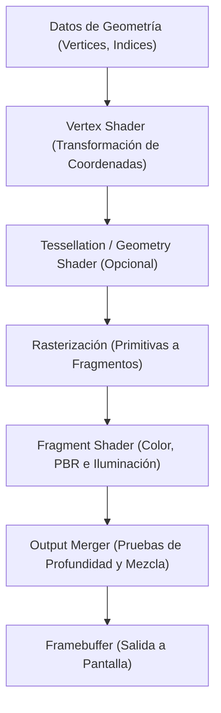

# Tecnología de Videojuegos: La Evolución de los Motores Gráficos 3D (Unreal Engine y Unity)

En el entretenimiento digital contemporáneo, especialmente en los videojuegos y la producción cinematográfica virtual, la evolución de los motores gráficos 3D constituye uno de los saltos tecnológicos más extraordinarios de la ciencia de la computación. Lo que comenzó en los años 90 con bloques poligonales toscos y sombreado plano se ha transformado en sistemas de renderizado en tiempo real capaces de crear mundos virtuales prácticamente indistinguibles de la realidad física.

Este artículo analiza en profundidad la historia y la arquitectura técnica de los motores 3D: desde el cauce de renderizado (pipeline) y el Renderizado Basado en la Física (PBR), hasta las innovaciones revolucionarias de Unreal Engine 5 (Nanite, Lumen), la arquitectura escalable de Unity (URP, HDRP, DOTS), el trazado de rayos por hardware y la convergencia de la inteligencia artificial con los gráficos por ordenador.

## 1. El Pipeline de Renderizado 3D: Evolución y Cambios de Paradigma

Para comprender los motores gráficos en tiempo real, es indispensable dominar el concepto de **pipeline de renderizado**. Las primeras tarjetas aceleradoras gráficas (GPU) utilizaban un **pipeline de función fija (Fixed-Function Pipeline)**, donde las fórmulas matemáticas de transformación de vértices e iluminación estaban soldadas en los circuitos, limitando drásticamente la libertad creativa de los desarrolladores.

A principios de los años 2000, la llegada de los **shaders programables** transformó la computación gráfica para siempre. Los programadores pudieron tomar el control directo del hardware de la GPU mediante lenguajes de sombreado:
- **Vertex Shader (Sombreador de Vértices)**: Calcula la transformación de coordenadas 3D, el skinning de personajes y la animación de mallas.
- **Fragment Shader / Pixel Shader (Sombreador de Fragmentos)**: Determina a nivel de píxel el color final, las texturas y el cálculo de iluminación.

En la actualidad, el pipeline evoluciona hacia arquitecturas impulsadas por cómputo general, utilizando **Mesh Shaders** y Compute Shaders para manipular la geometría con una flexibilidad sin precedentes.

```mermaid
flowchart TD
    A["Datos de Geometría (Vertices, Indices)"] --> B["Vertex Shader (Transformación de Coordenadas)"]
    B --> C["Tessellation / Geometry Shader (Opcional)"]
    C --> D["Rasterización (Primitivas a Fragmentos)"]
    D --> E["Fragment Shader (Color, PBR e Iluminación)"]
    E --> F["Output Merger (Pruebas de Profundidad y Mezcla)"]
    F --> G["Framebuffer (Salida a Pantalla)"]
```

## 2. Renderizado Basado en la Física (PBR): La Revolución Material

El gran punto de inflexión en el realismo visual contemporáneo fue la estandarización durante la década de 2010 del **Renderizado Basado en la Física (Physically Based Rendering: PBR)**. Antes de PBR, los videojuegos utilizaban modelos empíricos (como Phong o Blinn-Phong), donde los artistas debían pintar a mano mapas especulares que se veían incoherentes ante cualquier cambio en la iluminación ambiental.

PBR se apoya en las leyes fundamentales de la óptica y la termodinámica, tomando como base la célebre **Ecuación de Renderizado** formulada por James Kajiya:

$$ L_o(x, \omega_o) = L_e(x, \omega_o) + \int_{\Omega} f_r(x, \omega_i, \omega_o) L_i(x, \omega_i) (\omega_i \cdot n) d \omega_i $$

Donde:
- $L_o(x, \omega_o)$ es la radiancia espectral saliente desde el punto $x$ en la dirección $\omega_o$ (hacia la cámara).
- $L_e(x, \omega_o)$ es la emisión directa de luz propia del material.
- $\int_{\Omega}$ representa la integral hemisférica sobre todas las direcciones incidentes de luz $\omega_i$.
- $f_r(x, \omega_i, \omega_o)$ es la Función de Distribución de Reflectancia Bidireccional (BRDF), que describe la dispersión de la luz en microfacetas.
- $L_i(x, \omega_i)$ es la radiancia que incide en el punto $x$ desde la dirección $\omega_i$.
- $(\omega_i \cdot n)$ es el factor geométrico atenuante según la ley del coseno de Lambert.

Motores como Unreal Engine y Unity implementan aproximaciones en tiempo real de esta ecuación mediante el modelo microfacetario Cook-Torrance y la distribución GGX. Los artistas solo necesitan calibrar tres parámetros físicos muy intuitivos para reproducir cualquier material del mundo real:
- **Albedo (Color Base)**: Color intrínseco del objeto libre de sombras fijas.
- **Rugosidad (Roughness)**: Nivel de micro-imperfecciones que controla la nitidez o difusión de los reflejos.
- **Metalicidad (Metallic)**: Distingue el comportamiento óptico entre aislantes dieléctricos y metales conductores.

## 3. Las Innovaciones de Unreal Engine 5: Nanite y Lumen

**Unreal Engine (UE)** de Epic Games ha liderado históricamente la cúspide de la calidad gráfica. Su versión más reciente, Unreal Engine 5, introdujo dos tecnologías revolucionarias que desmantelaron décadas de compromisos técnicos en el desarrollo de videojuegos:

### Nanite: Geometría de Micropolígonos Virtualizada
Históricamente, los desarrolladores debían invertir meses en construir manualmente múltiples niveles de detalle (LOD) y proyectar detalles complejos en mapas de normales para no colapsar la memoria y el rendimiento.

Nanite elimina por completo la necesidad de crear LODs manuales. Permite importar mallas de calidad cinematográfica de decenas o cientos de millones de polígonos directamente en el motor. Nanite segmenta internamente la geometría en clústeres jerárquicos de 128 triángulos y transmite en streaming únicamente los micropolígonos que corresponden al tamaño de los píxeles en pantalla, logrando un detalle geométrico infinito con un consumo de memoria constante.

### Lumen: Iluminación Global Dinámica en Tiempo Real
Lumen sustituye la tradicional técnica del "horneado" de mapas de luz estáticos (Lightmaps) por un sistema de **Iluminación Global (GI)** y reflexiones enteramente dinámico. Cuando la luz solar entra por la boca de una cueva, Lumen calcula en milisegundos múltiples rebotes indirectos que iluminan las profundidades rocosas. Si un jugador destruye una pared o cambia la hora del día, la propagación de la luz se actualiza al instante combinando trazado en espacio de pantalla con campos de distancias (SDF) y trazado de rayos por hardware.

## 4. La Evolución de Unity: Escalabilidad y la Arquitectura DOTS

**Unity**, creado por Unity Technologies, sostiene más de la mitad del mercado interactivo mundial gracias a su inigualable soporte multiplataforma, abarcando desde teléfonos inteligentes hasta visores de realidad virtual y consolas de última generación.

### Pipelines Modulares: URP y HDRP
Para cubrir todo el espectro de dispositivos, Unity reestructuró su arquitectura de renderizado en Scriptable Render Pipelines (SRP):
- **URP (Universal Render Pipeline)**: Optimizado para exprimir al máximo el rendimiento y la eficiencia energética en dispositivos móviles, Nintendo Switch y cascos VR.
- **HDRP (High Definition Render Pipeline)**: Diseñado para PCs y consolas de alta gama, aprovechando compute shaders, iluminación volumétrica y shaders avanzados que compiten con el fotorrealismo cinematográfico.

### DOTS: Stack de Tecnología Orientada a Datos
Otra gran revolución de Unity ha sido el salto del paradigma clásico orientado a objetos (OOP) hacia el diseño orientado a datos mediante **DOTS**. A través del C# Job System multihilo, el compilador Burst y el Entity Component System (ECS), DOTS maximiza el aprovechamiento de la memoria caché de la CPU. Esto permite simular y renderizar cientos de miles de entidades simultáneas (como multitudes inmensas o flotas espaciales complejas) a 60 FPS estables.

## 5. Trazado de Rayos por Hardware y la Revolución de la IA

La vanguardia gráfica actual es indisociable del hardware dedicado y la inteligencia artificial.

Con la incorporación de núcleos de cálculo RT Cores en las arquitecturas NVIDIA RTX y AMD RDNA, el **Path Tracing (Trazado de Trayectorias)** en tiempo real ha pasado de las granjas de render cinematográficas a los ordenadores de sobremesa. Los motores calculan de forma físicamente exacta oclusiones ambientales, sombras de contacto suaves y reflejos especulares lanzando rayos directamente contra estructuras BVH.

Para contrarrestar la colosal carga computacional del trazado de rayos, los motores modernos han integrado técnicas de supermuestreo mediante redes neuronales profundas:
- **NVIDIA DLSS (Deep Learning Super Sampling)**
- **AMD FSR (FidelityFX Super Resolution)**
- **Intel XeSS**

Al renderizar internamente a resoluciones inferiores y reconstruir fotogramas 4K perfectos con IA y vectores de movimiento temporal, se duplican las tasas de fotogramas sin sacrificar la nitidez visual.

## 6. Más Allá del Videojuego: La Expansión Industrial

Los motores gráficos 3D han desbordado su ámbito original en el entretenimiento. Su extraordinaria capacidad de cálculo y simulación en tiempo real está revolucionando múltiples industrias:

- **Producción Virtual y Cine**: En producciones cinematográficas como *The Mandalorian*, los fondos de decorados se proyectan en tiempo real en gigantescas pantallas LED (The Volume) mediante Unreal Engine, sincronizándose de forma perfecta con el movimiento de las cámaras de rodaje.
- **Arquitectura y Automoción**: Diseñadores y arquitectos construyen réplicas digitales exactas (Gemelos Digitales) para ensayar aerodinámica en túneles de viento virtuales o realizar estudios de asoleamiento antes de fabricar prototipos físicos.
- **Entrenamiento de IA para Conducción Autónoma**: Se recrean mundos urbanos tridimensionales con físicas climáticas rigurosas para entrenar algoritmos de conducción autónoma a lo largo de millones de kilómetros simulados de forma segura y económica.

## Conclusión: La Liberación del Creador

La historia de los motores gráficos 3D fue durante décadas una lucha encarnizada contra las limitaciones del silicio. Los artistas debían invertir incontables horas en reducir polígonos, comprimir texturas y simular luces estáticas.

La llegada de tecnologías como Nanite, Lumen y DOTS ha roto finalmente esas cadenas. Hoy en día, los creadores pueden centrarse por completo en el diseño del mundo, la narrativa y la experiencia lúdica. Con el pulso constante entre Unreal Engine y Unity, la frontera entre la realidad física y el universo digital se disuelve a pasos agigantados.
