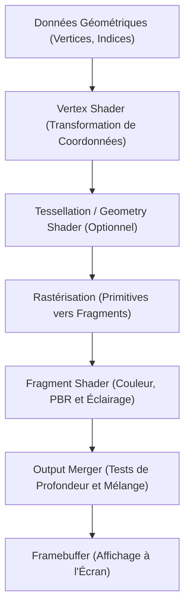

# Technologie du Jeu Vidéo : L'Évolution des Moteurs Graphiques 3D (Unreal Engine & Unity)

Dans le divertissement numérique contemporain, en particulier les jeux vidéo et la production cinématographique virtuelle, l'essor des moteurs graphiques 3D constitue l'une des avancées les plus spectaculaires de l'informatique moderne. Ce qui a commencé dans les années 1990 avec des blocs polygonaux rudimentaires s'est métamorphosé en systèmes de rendu en temps réel capables de créer des mondes virtuels indiscernables de la réalité physique.

Cet article explore l'histoire et l'architecture technique des moteurs 3D : du pipeline de rendu au rendu basé sur la physique (PBR), en passant par les innovations majeures d'Unreal Engine 5 (Nanite, Lumen), l'architecture modulaire d'Unity (URP, HDRP, DOTS), le ray tracing matériel et l'avènement des technologies d'upscaling par intelligence artificielle.

## 1. Le Pipeline de Rendu 3D : Évolution et Changements de Paradigme

Pour comprendre les moteurs en temps réel, il est essentiel de maîtriser le **pipeline de rendu graphique**. Les premiers GPU utilisaient un **pipeline à fonctions fixes (Fixed-Function Pipeline)**, où les calculs d'éclairage et de projection géométrique étaient gravés dans le silicium, limitant drastiquement la créativité des concepteurs.

Au début des années 2000, l'avènement des **shaders programmables** a bouleversé l'infographie. Les développeurs ont pris le contrôle direct des puces graphiques grâce à des programmes spécialisés :
- **Vertex Shader (Shader de Sommets)** : Calcule la transformation des coordonnées 3D, le squelettage des personnages et les déformations de maillage.
- **Fragment Shader / Pixel Shader (Shader de Fragments)** : Calcule au niveau du pixel les textures, les interactions lumineuses et les couleurs finales.

Aujourd'hui, le pipeline évolue vers des approches massivement parallèles avec les **Mesh Shaders** et les Compute Shaders, offrant un contrôle géométrique d'une souplesse sans précédent.

## 2. Le Rendu Basé sur la Physique (PBR) : La Révolution des Matériaux

Le tournant décisif vers le réalisme moderne fut la standardisation dans les années 2010 du **Rendu Basé sur la Physique (Physically Based Rendering : PBR)**. Auparavant, les jeux recouraient à des modèles empiriques (tels que Phong ou Blinn-Phong), obligeant les artistes à concevoir manuellement des textures spéculaires qui perdaient toute cohérence lors des variations d'éclairage.

Le PBR simule avec rigueur le comportement physique des ondes lumineuses, s'appuyant sur la célèbre **Équation de Rendu** établie par James Kajiya :

$$ L_o(x, \omega_o) = L_e(x, \omega_o) + \int_{\Omega} f_r(x, \omega_i, \omega_o) L_i(x, \omega_i) (\omega_i \cdot n) d \omega_i $$

Où :
- $L_o(x, \omega_o)$ représente la luminance spectrale émise depuis le point $x$ dans la direction $\omega_o$ vers la caméra.
- $L_e(x, \omega_o)$ désigne l'émission propre du matériau.
- $\int_{\Omega}$ correspond à l'intégrale hémisphérique sur l'ensemble des directions d'incidence $\omega_i$.
- $f_r(x, \omega_i, \omega_o)$ est la BRDF (Fonction de Distribution de Réflectance Bidirectionnelle), qui décrit la diffusion selon la théorie des microfacettes.
- $L_i(x, \omega_i)$ est la luminance incidente parvenant au point $x$.
- $(\omega_i \cdot n)$ est le facteur d'atténuation géométrique selon la loi en cosinus de Lambert.

Des moteurs comme Unreal Engine et Unity calculent en quelques millisecondes des approximations de cette intégrale via le modèle microfacette de Cook-Torrance avec distribution GGX. Les artistes n'ont besoin que de trois paramètres intuitifs pour représenter n'importe quelle matière réelle :
- **Albédo (Couleur de base)** : Teinte intrinsèque débarrassée de toute ombre précalculée.
- **Rugosité (Roughness)** : Niveau de micro-irrégularités qui régit la netteté des reflets.
- **Métallicité (Metallic)** : Distingue le comportement optique des diélectriques isolants de celui des métaux conducteurs.

## 3. Les Innovations d'Unreal Engine 5 : Nanite et Lumen

Développé par Epic Games, **Unreal Engine (UE)** a toujours repoussé les limites du graphisme en temps réel. Unreal Engine 5 a introduit deux technologies révolutionnaires qui ont mis fin à des décennies de compromis techniques :

### Nanite : Géométrie de Micro-Polygones Virtualisée
Auparavant, les développeurs devaient concevoir manuellement de multiples niveaux de détail (LOD) et projeter les reliefs fins sur des textures de normales afin de soulager le GPU.

Nanite supprime totalement la création de LOD manuels. Il permet d'importer directement des maillages de qualité cinéma composés de dizaines ou de centaines de millions de polygones. Nanite regroupe la géométrie en grappes hiérarchiques de 128 triangles et ne charge dynamiquement que les micro-polygones correspondant à la taille des pixels à l'écran, offrant un niveau de détail virtuel infini sans saturer la mémoire.

### Lumen : Éclairage Global et Réflexions Entièrement Dynamiques
Lumen remplace le traditionnel précalcul (baking) de cartes de lumière statiques par un système d'**Éclairage Global (GI)** entièrement dynamique. Lorsque la lumière du soleil pénètre dans une grotte, Lumen calcule en temps réel les rebonds indirects qui illuminent les parois sombres. Si une paroi s'effondre ou si l'heure du jour change, l'éclairage s'ajuste instantanément grâce à une combinaison de traçage dans l'espace écran, de champs de distance (SDF) et de ray tracing matériel.

## 4. L'Évolution d'Unity : Modularité et Performance avec DOTS

Créé par Unity Technologies, le moteur **Unity** anime plus de la moitié des productions interactives mondiales grâce à sa flexibilité multiplateforme incomparable, des smartphones aux casques de réalité virtuelle en passant par les consoles de salon.

### Pipelines Modulaires : URP et HDRP
Pour répondre à la diversité des périphériques, Unity a modernisé son architecture de rendu avec les Scriptable Render Pipelines (SRP) :
- **URP (Universal Render Pipeline)** : Conçu pour offrir une efficacité énergétique et des performances maximales sur smartphones, Nintendo Switch et casques autonomes de VR.
- **HDRP (High Definition Render Pipeline)** : Taillé pour les PC et consoles haut de gamme, exploitant pleinement les compute shaders et l'éclairage physique pour un rendu digne des effets spéciaux hollywoodiens.

### DOTS : La Pile Technologique Orientée Données
L'autre avancée majeure d'Unity est le passage de la programmation orientée objet classique (POO) à la conception orientée données (DOD) avec **DOTS**. En associant le C# Job System multithread, le compilateur Burst et l'Entity Component System (ECS), DOTS maximise l'utilisation du cache processeur. Cela permet de simuler et d'afficher des centaines de milliers d'entités simultanées (foules géantes, batailles spatiales) à 60 images par seconde stables.

## 5. Ray Tracing Matériel et Upscaling par Intelligence Artificielle

La pointe de la technologie 3D repose désormais sur la synergie entre accélération matérielle et intelligence artificielle.

Grâce aux cœurs RT intégrés aux architectures NVIDIA RTX et AMD RDNA, le **Path Tracing (Lancer de rayons)** s'exécute désormais en temps réel sur les machines de jeu. Les moteurs simulent avec une fidélité physique parfaite l'occlusion ambiante, les ombres douces et les réflexions nettes en testant directement l'intersection des rayons avec des arbres de volumes englobants (BVH).

Pour surmonter le coût calculatoire gigantesque du ray tracing, les moteurs intègrent nativement des algorithmes de super-échantillonnage par deep learning :
- **NVIDIA DLSS (Deep Learning Super Sampling)**
- **AMD FSR (FidelityFX Super Resolution)**
- **Intel XeSS**

En calculant la scène à une résolution inférieure puis en la reconstruisant en 4K grâce à des réseaux neuronaux et aux vecteurs de mouvement, l'IA double les performances sans altérer la finesse visuelle.

## 6. Au-delà du Jeu : L'Expansion Industrielle des Moteurs 3D

Les moteurs graphiques 3D ont largement dépassé le seul cadre vidéoludique. Leur puissance de calcul en temps réel transforme profondément l'industrie moderne :

- **Production Virtuelle et Cinéma** : Des productions comme *The Mandalorian* utilisent des murs d'écrans LED géants pilotés par Unreal Engine. Les décors 3D s'adaptent instantanément aux mouvements de la caméra, éliminant les contraintes des fonds verts en post-production.
- **Architecture et Industrie Automobile** : Constructeurs et architectes bâtissent des jumeaux numériques d'une précision millimétrique pour tester l'aérodynamique en soufflerie virtuelle ou simuler l'ensoleillement avant toute fabrication physique.
- **Apprentissage pour Véhicules Autonomes** : Les environnements 3D recréent des conditions météorologiques extrêmes et des scénarios d'accidents pour entraîner en toute sécurité les réseaux de neurones de conduite autonome sur des millions de kilomètres simulés.

## Conclusion : La Libération de la Créativité

L'histoire des moteurs graphiques 3D s'est longtemps résumée à une lutte permanente contre les limites du matériel, contraignant les créateurs à réduire le nombre de polygones, compresser les textures et tricher sur la lumière.

L'avènement de technologies telles que Nanite, Lumen et DOTS a abattu ces barrières. Les développeurs peuvent aujourd'hui se consacrer pleinement à la narration, au game design et à l'immersion artistique. Portée par la rivalité féconde entre Unreal Engine et Unity, la frontière entre réalité physique et univers virtuel s'efface un peu plus chaque jour.
