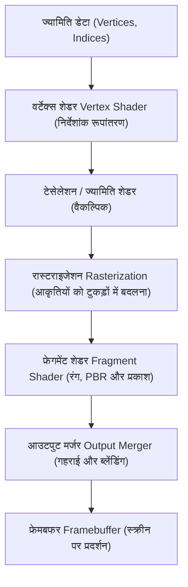

# गेम तकनीक: 3D ग्राफिक्स इंजन का विकास (Unreal Engine और Unity)

आधुनिक डिजिटल मनोरंजन, विशेष रूप से वीडियो गेम और वर्चुअल फिल्म निर्माण में 3D ग्राफिक्स इंजन का विकास कंप्यूटर विज्ञान की सबसे विस्मयकारी उपलब्धियों में से एक है। 1990 के दशक में कुछ खुरदरे पॉलीगॉन से शुरू हुई यह यात्रा आज ऐसी रीयल-टाइम रेंडरिंग प्रणालियों तक पहुँच चुकी है जो वास्तविक दुनिया जैसी आभासी दुनिया रचने में सक्षम हैं।

यह लेख 3D ग्राफिक्स इंजनों के इतिहास और तकनीकी संरचना का गहन विश्लेषण प्रस्तुत करता है: रेंडरिंग पाइपलाइन और फिजिकली बेस्ड रेंडरिंग (PBR) से लेकर Unreal Engine 5 की अभूतपूर्व तकनीकों (Nanite, Lumen), Unity के मॉड्यूलर सिस्टम (URP, HDRP, DOTS), हार्डवेयर रे ट्रेसिंग और एआई अपस्केलिंग तक।

## 1. 3D रेंडरिंग पाइपलाइन: विकास और नए प्रतिमान

3D इंजनों को समझने के लिए **रेंडरिंग पाइपलाइन** की अवधारणा को समझना आवश्यक है। शुरुआती जीपीयू (GPU) एक स्थिर प्रणाली (**Fixed-Function Pipeline**) पर काम करते थे, जहाँ प्रकाश और ज्यामितीय गणनाएँ हार्डवेयर सर्किट में तय थीं, जिससे डेवलपर्स के पास रचनात्मक स्वतंत्रता बहुत सीमित थी।

2000 के दशक की शुरुआत में **प्रोग्रामेबल शेडर्स** के आगमन ने ग्राफिक्स की दुनिया को पूरी तरह बदल दिया। डेवलपर्स को विशेष शेडर चरणों के माध्यम से सीधे जीपीयू को प्रोग्राम करने की शक्ति मिल गई:
- **वर्टेक्स शेडर (Vertex Shader)**: 3D निर्देशांकों के रूपांतरण और कैरेक्टर एनिमेशन की गणना करता है।
- **फ्रेगमेंट शेडर / पिक्सेल शेडर (Fragment Shader)**: स्क्रीन के प्रत्येक पिक्सेल के रंग, बनावट और प्रकाश की गणना करता है।

आजकल यह पाइपलाइन **मेश शेडर्स (Mesh Shaders)** और कंप्यूट शेडर्स के साथ और भी अधिक शक्तिशाली और लचीली हो चुकी है।

## 2. फिजिकली बेस्ड रेंडरिंग (PBR): सामग्रियों का यथार्थवादी विज्ञान

फोटोरियलिज्म की दिशा में सबसे बड़ा कदम 2010 के दशक में **फिजिकली बेस्ड रेंडरिंग (PBR)** का मानक बनना था। PBR से पहले गेम डेवलपर्स काल्पनिक सूत्रों (जैसे Phong मॉडल) का उपयोग करते थे, जहाँ रोशनी बदलने पर वस्तुएँ अस्वाभाविक लगने लगती थीं।

PBR प्रकाश के वास्तविक भौतिक व्यवहार का अनुकरण करता है, जिसका आधार जेम्स काजिया द्वारा तैयार किया गया प्रसिद्ध **रेंडरिंग समीकरण (Rendering Equation)** है:

$$ L_o(x, \omega_o) = L_e(x, \omega_o) + \int_{\Omega} f_r(x, \omega_i, \omega_o) L_i(x, \omega_i) (\omega_i \cdot n) d \omega_i $$

यहाँ:
- $L_o(x, \omega_o)$ सतह के बिंदु $x$ से दिशा $\omega_o$ में कैमरे तक पहुँचने वाला प्रकाश है।
- $L_e(x, \omega_o)$ वस्तु द्वारा स्वयं उत्सर्जित प्रकाश है।
- $\int_{\Omega}$ आने वाले प्रकाश की सभी दिशाओं $\omega_i$ का हेमिस्फेयर समाकलन है।
- $f_r(x, \omega_i, \omega_o)$ BRDF फलन है जो सतह की सूक्ष्म संरचना पर प्रकाश के बिखराव को दर्शाता है।
- $L_i(x, \omega_i)$ बिंदु $x$ पर आने वाले प्रकाश की तीव्रता है।
- $(\omega_i \cdot n)$ लैम्बर्ट के कोसाइन नियम के अनुसार ज्यामितीय कोण है।

Unreal Engine और Unity इस जटिल समीकरण को मिलीसेकंड में हल करने के लिए कुक-टॉरेंस मॉडल का उपयोग करते हैं। 3D कलाकारों को केवल तीन बुनियादी पैरामीटर सेट करने होते हैं:
- **अल्बेडो (Albedo / Base Color)**: बिना किसी छाया के वस्तु का शुद्ध रंग।
- **खुरदरापन (Roughness)**: सतह का खुरदरापन जो परावर्तन की चमक और धुंधलेपन को नियंत्रित करता है।
- **धातुत्व (Metallic)**: यह तय करता है कि सामग्री विद्युत सुचालक धातु है या अचालक।

## 3. Unreal Engine 5 के नवाचार: Nanite और Lumen

एपिक गेम्स का **Unreal Engine (UE)** हमेशा से उच्च-स्तरीय ग्राफिक्स में सबसे आगे रहा है। इसके नवीनतम संस्करण Unreal Engine 5 ने दो क्रांतिकारी तकनीकों को पेश किया:

### नैनिट (Nanite): वर्चुअलाइज्ड माइक्रोपॉलीगॉन ज्यामिति
पहले गेम बनाते समय डेवलपर्स को प्रदर्शन बनाए रखने के लिए मॉडल के कई कम-पॉलीगॉन वाले संस्करण (LOD) हाथ से बनाने पड़ते थे।

Nanite ने मैन्युअल LOD बनाने की आवश्यकता को समाप्त कर दिया। यह करोड़ों पॉलीगॉन वाले सिनेमाई मॉडलों को सीधे इंजन में लोड करने की सुविधा देता है। Nanite ज्यामिति को 128-त्रिभुज समूहों में बांटता है और केवल स्क्रीन पिक्सेल के आकार के बराबर आवश्यक माइक्रोपॉलीगॉन को ही रीयल-टाइम में रेंडर करता है।

### ल्यूमेन (Lumen): पूर्णतः गतिशील ग्लोबल इल्यूमिनेशन
Lumen ने पहले से लाइटमैप्स को बेक (Bake) करने की पुरानी प्रथा को समाप्त कर दिया। जब धूप किसी गुफा के मुहाने पर पड़ती है, तो Lumen दीवार और फर्श से टकराकर अंदर फैलने वाली अप्रत्यक्ष रोशनी की गणना मिलीसेकंड में रीयल-टाइम में करता है। यदि कोई दीवार ढह जाए, तो कमरे में रोशनी का फैलाव तुरंत उसी पल बदल जाता है।

## 4. Unity का विकास: स्केलेबिलिटी और DOTS तकनीक

यूनिटी टेक्नोलॉजीज का **Unity इंजन** अपनी बेजोड़ क्रॉस-प्लेटफॉर्म क्षमता के कारण दुनिया भर के आधे से अधिक मोबाइल गेम्स और इंटरैक्टिव ऐप्स को संचालित करता है।

### मॉड्यूलर पाइपलाइन: URP और HDRP
विभिन्न उपकरणों की क्षमताओं को ध्यान में रखते हुए Unity ने अपनी रेंडरिंग प्रणाली को दो भागों में बांटा:
- **URP (Universal Render Pipeline)**: मोबाइल फोन, निंटेंडो स्विच और वीआर हेडसेट्स के लिए ऊर्जा और प्रदर्शन की दृष्टि से अनुकूलित।
- **HDRP (High Definition Render Pipeline)**: आधुनिक हाई-एंड पीसी और कंसोल के लिए तैयार, जो फिल्मों जैसी वास्तविक रोशनी प्रदान करता है।

### DOTS (डेटा-ओरिएंटेड टेक्नोलॉजी स्टैक)
Unity का एक और बड़ा कदम पारंपरिक ऑब्जेक्ट-ओरिएंटेड प्रोग्रामिंग से डेटा-ओरिएंटेड डिजाइन की ओर बढ़ना है जिसे **DOTS** कहा जाता है। यह सीपीयू कैश मेमोरी का अधिकतम उपयोग करता है, जिससे स्क्रीन पर लाखों इकाइयों (विशाल भीड़ या अंतरिक्ष जहाजों) को बिना किसी रुकावट के 60 FPS पर सिमुलेट किया जा सकता है।

## 5. हार्डवेयर रे ट्रेसिंग और कृत्रिम बुद्धिमत्ता (AI) का संगम

आधुनिक ग्राफिक्स अब हार्डवेयर रे ट्रेसिंग और एआई सुपर-रिज़ॉल्यूशन के बिना अधूरे हैं।

NVIDIA RTX और AMD RDNA चिप्स में समर्पित रे ट्रेसिंग कोर की बदौलत अब गेमिंग में **पाथ ट्रेसिंग** रीयल-टाइम में संभव हो गई है। प्रकाश की किरणों का भौतिक रूप से पीछा करके दर्पण जैसे सटीक परावर्तन और मुलायम छायाएँ बनाई जाती हैं।

रे ट्रेसिंग के भारी लोड को संतुलित करने के लिए आधुनिक इंजनों में डीप लर्निंग तकनीकें शामिल हैं:
- **NVIDIA DLSS (डीप लर्निंग सुपर सैंपलिंग)**
- **AMD FSR (फिडेलिटी एफएक्स सुपर रिज़ॉल्यूशन)**
- **Intel XeSS**

एआई कम रिज़ॉल्यूशन में रेंडर की गई छवियों को मोशन वेक्टर्स की मदद से 4K रिज़ॉल्यूशन में बदल देता है, जिससे गेम की गति दोगुनी हो जाती है और गुणवत्ता में कोई कमी नहीं आती।

## 6. वीडियो गेम से परे: औद्योगिक क्रांति

3D ग्राफिक्स इंजन अब केवल गेमिंग तक सीमित नहीं हैं। उनकी रीयल-टाइम सिमुलेशन शक्ति कई उद्योगों को बदल रही है:

- **वर्चुअल फिल्म निर्माण**: *The Mandalorian* जैसी हॉलीवुड फिल्मों में अभिनेताओं के पीछे विशाल एलईडी स्क्रीन पर Unreal Engine से लाइव 3D बैकग्राउंड दिखाया जाता है।
- **वास्तुकला और ऑटोमोबाइल**: नई कारों और इमारतों के डिजिटल ट्विन बनाकर हवा के दबाव और रोशनी का परीक्षण निर्माण से पहले ही कर लिया जाता है।
- **स्वायत्त वाहनों (Autonomous Cars) का प्रशिक्षण**: स्वायत्त कारों के एआई को प्रशिक्षित करने के लिए इंजनों के भीतर मौसम और ट्रैफिक की रीयल-टाइम परिस्थितियाँ बनाई जाती हैं।

## निष्कर्ष: रचनात्मकता की मुक्ति

3D ग्राफिक्स इंजनों का इतिहास हमेशा हार्डवेयर की सीमाओं से लड़ने का इतिहास रहा है। वर्षों तक डेवलपर्स को पॉलीगॉन कम करने और नकली रोशनी बनाने में समय गंवाना पड़ता था।

Nanite, Lumen और DOTS जैसी तकनीकों ने रचनाकारों को इन तकनीकी बंधनों से आजाद कर दिया है। अब कलाकार केवल खूबसूरत कहानियों और मजेदार गेमप्ले को गढ़ने पर ध्यान केंद्रित कर सकते हैं। Unreal Engine और Unity के बीच की यह प्रतिस्पर्धा वास्तविक दुनिया और डिजिटल आभासी दुनिया के बीच की दूरी को तेजी से मिटा रही है।
