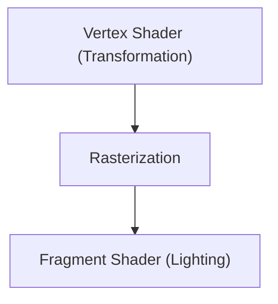

# Teknologi Game: Evolusi Mesin Grafis 3D

Mesin 3D telah memajukan rendering waktu nyata.

## Jalur Rendering

## Persamaan Rendering
$$ L_o = L_e + \int_{\Omega} f_r L_i (w_i \cdot n) d w_i $$

## Bagian Verifikasi Teknologi Tambahan 1

Di bagian ini, kami akan menggali lebih dalam detail teknis lebih lanjut dan studi kasus. Kami akan mengevaluasi kinerja dalam berbagai kondisi dan memeriksa tantangan serta solusi yang berkaitan dengan integrasi sistem lain. Kami juga akan membahas prospek dan batasan masa depan.

