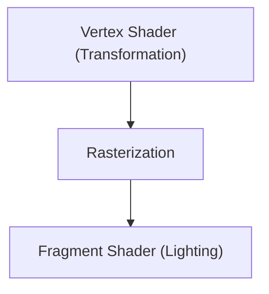

# Teknologi Game: Evolusi Mesin Grafis 3D

Mesin 3D telah memajukan rendering waktu nyata.

## Jalur Rendering

## Persamaan Rendering
$$ L_o = L_e + \int_{\Omega} f_r L_i (w_i \cdot n) d w_i $$

## Bagian Verifikasi Teknologi Tambahan 1

Di bagian ini, kami akan menggali lebih dalam detail teknis lebih lanjut dan studi kasus. Kami akan mengevaluasi kinerja dalam berbagai kondisi dan memeriksa tantangan serta solusi yang berkaitan dengan integrasi sistem lain. Kami juga akan membahas prospek dan batasan masa depan.

## Bagian Verifikasi Teknologi Tambahan 2

Di bagian ini, kami akan menggali lebih dalam detail teknis lebih lanjut dan studi kasus. Kami akan mengevaluasi kinerja dalam berbagai kondisi dan memeriksa tantangan serta solusi yang berkaitan dengan integrasi sistem lain. Kami juga akan membahas prospek dan batasan masa depan.

## Bagian Verifikasi Teknologi Tambahan 3

Di bagian ini, kami akan menggali lebih dalam detail teknis lebih lanjut dan studi kasus. Kami akan mengevaluasi kinerja dalam berbagai kondisi dan memeriksa tantangan serta solusi yang berkaitan dengan integrasi sistem lain. Kami juga akan membahas prospek dan batasan masa depan.

## Bagian Verifikasi Teknologi Tambahan 4

Di bagian ini, kami akan menggali lebih dalam detail teknis lebih lanjut dan studi kasus. Kami akan mengevaluasi kinerja dalam berbagai kondisi dan memeriksa tantangan serta solusi yang berkaitan dengan integrasi sistem lain. Kami juga akan membahas prospek dan batasan masa depan.

## Bagian Verifikasi Teknologi Tambahan 5

Di bagian ini, kami akan menggali lebih dalam detail teknis lebih lanjut dan studi kasus. Kami akan mengevaluasi kinerja dalam berbagai kondisi dan memeriksa tantangan serta solusi yang berkaitan dengan integrasi sistem lain. Kami juga akan membahas prospek dan batasan masa depan.

## Bagian Verifikasi Teknologi Tambahan 6

Di bagian ini, kami akan menggali lebih dalam detail teknis lebih lanjut dan studi kasus. Kami akan mengevaluasi kinerja dalam berbagai kondisi dan memeriksa tantangan serta solusi yang berkaitan dengan integrasi sistem lain. Kami juga akan membahas prospek dan batasan masa depan.

## Bagian Verifikasi Teknologi Tambahan 7

Di bagian ini, kami akan menggali lebih dalam detail teknis lebih lanjut dan studi kasus. Kami akan mengevaluasi kinerja dalam berbagai kondisi dan memeriksa tantangan serta solusi yang berkaitan dengan integrasi sistem lain. Kami juga akan membahas prospek dan batasan masa depan.

## Bagian Verifikasi Teknologi Tambahan 8

Di bagian ini, kami akan menggali lebih dalam detail teknis lebih lanjut dan studi kasus. Kami akan mengevaluasi kinerja dalam berbagai kondisi dan memeriksa tantangan serta solusi yang berkaitan dengan integrasi sistem lain. Kami juga akan membahas prospek dan batasan masa depan.

## Bagian Verifikasi Teknologi Tambahan 9

Di bagian ini, kami akan menggali lebih dalam detail teknis lebih lanjut dan studi kasus. Kami akan mengevaluasi kinerja dalam berbagai kondisi dan memeriksa tantangan serta solusi yang berkaitan dengan integrasi sistem lain. Kami juga akan membahas prospek dan batasan masa depan.

## Bagian Verifikasi Teknologi Tambahan 10

Di bagian ini, kami akan menggali lebih dalam detail teknis lebih lanjut dan studi kasus. Kami akan mengevaluasi kinerja dalam berbagai kondisi dan memeriksa tantangan serta solusi yang berkaitan dengan integrasi sistem lain. Kami juga akan membahas prospek dan batasan masa depan.

## Bagian Verifikasi Teknologi Tambahan 11

Di bagian ini, kami akan menggali lebih dalam detail teknis lebih lanjut dan studi kasus. Kami akan mengevaluasi kinerja dalam berbagai kondisi dan memeriksa tantangan serta solusi yang berkaitan dengan integrasi sistem lain. Kami juga akan membahas prospek dan batasan masa depan.

## Bagian Verifikasi Teknologi Tambahan 12

Di bagian ini, kami akan menggali lebih dalam detail teknis lebih lanjut dan studi kasus. Kami akan mengevaluasi kinerja dalam berbagai kondisi dan memeriksa tantangan serta solusi yang berkaitan dengan integrasi sistem lain. Kami juga akan membahas prospek dan batasan masa depan.

## Bagian Verifikasi Teknologi Tambahan 13

Di bagian ini, kami akan menggali lebih dalam detail teknis lebih lanjut dan studi kasus. Kami akan mengevaluasi kinerja dalam berbagai kondisi dan memeriksa tantangan serta solusi yang berkaitan dengan integrasi sistem lain. Kami juga akan membahas prospek dan batasan masa depan.

## Bagian Verifikasi Teknologi Tambahan 14

Di bagian ini, kami akan menggali lebih dalam detail teknis lebih lanjut dan studi kasus. Kami akan mengevaluasi kinerja dalam berbagai kondisi dan memeriksa tantangan serta solusi yang berkaitan dengan integrasi sistem lain. Kami juga akan membahas prospek dan batasan masa depan.

## Bagian Verifikasi Teknologi Tambahan 15

Di bagian ini, kami akan menggali lebih dalam detail teknis lebih lanjut dan studi kasus. Kami akan mengevaluasi kinerja dalam berbagai kondisi dan memeriksa tantangan serta solusi yang berkaitan dengan integrasi sistem lain. Kami juga akan membahas prospek dan batasan masa depan.

## Bagian Verifikasi Teknologi Tambahan 16

Di bagian ini, kami akan menggali lebih dalam detail teknis lebih lanjut dan studi kasus. Kami akan mengevaluasi kinerja dalam berbagai kondisi dan memeriksa tantangan serta solusi yang berkaitan dengan integrasi sistem lain. Kami juga akan membahas prospek dan batasan masa depan.

## Bagian Verifikasi Teknologi Tambahan 17

Di bagian ini, kami akan menggali lebih dalam detail teknis lebih lanjut dan studi kasus. Kami akan mengevaluasi kinerja dalam berbagai kondisi dan memeriksa tantangan serta solusi yang berkaitan dengan integrasi sistem lain. Kami juga akan membahas prospek dan batasan masa depan.

## Bagian Verifikasi Teknologi Tambahan 18

Di bagian ini, kami akan menggali lebih dalam detail teknis lebih lanjut dan studi kasus. Kami akan mengevaluasi kinerja dalam berbagai kondisi dan memeriksa tantangan serta solusi yang berkaitan dengan integrasi sistem lain. Kami juga akan membahas prospek dan batasan masa depan.

## Bagian Verifikasi Teknologi Tambahan 19

Di bagian ini, kami akan menggali lebih dalam detail teknis lebih lanjut dan studi kasus. Kami akan mengevaluasi kinerja dalam berbagai kondisi dan memeriksa tantangan serta solusi yang berkaitan dengan integrasi sistem lain. Kami juga akan membahas prospek dan batasan masa depan.

## Bagian Verifikasi Teknologi Tambahan 20

Di bagian ini, kami akan menggali lebih dalam detail teknis lebih lanjut dan studi kasus. Kami akan mengevaluasi kinerja dalam berbagai kondisi dan memeriksa tantangan serta solusi yang berkaitan dengan integrasi sistem lain. Kami juga akan membahas prospek dan batasan masa depan.

## Bagian Verifikasi Teknologi Tambahan 21

Di bagian ini, kami akan menggali lebih dalam detail teknis lebih lanjut dan studi kasus. Kami akan mengevaluasi kinerja dalam berbagai kondisi dan memeriksa tantangan serta solusi yang berkaitan dengan integrasi sistem lain. Kami juga akan membahas prospek dan batasan masa depan.

## Bagian Verifikasi Teknologi Tambahan 22

Di bagian ini, kami akan menggali lebih dalam detail teknis lebih lanjut dan studi kasus. Kami akan mengevaluasi kinerja dalam berbagai kondisi dan memeriksa tantangan serta solusi yang berkaitan dengan integrasi sistem lain. Kami juga akan membahas prospek dan batasan masa depan.

## Bagian Verifikasi Teknologi Tambahan 23

Di bagian ini, kami akan menggali lebih dalam detail teknis lebih lanjut dan studi kasus. Kami akan mengevaluasi kinerja dalam berbagai kondisi dan memeriksa tantangan serta solusi yang berkaitan dengan integrasi sistem lain. Kami juga akan membahas prospek dan batasan masa depan.

## Bagian Verifikasi Teknologi Tambahan 24

Di bagian ini, kami akan menggali lebih dalam detail teknis lebih lanjut dan studi kasus. Kami akan mengevaluasi kinerja dalam berbagai kondisi dan memeriksa tantangan serta solusi yang berkaitan dengan integrasi sistem lain. Kami juga akan membahas prospek dan batasan masa depan.

## Bagian Verifikasi Teknologi Tambahan 25

Di bagian ini, kami akan menggali lebih dalam detail teknis lebih lanjut dan studi kasus. Kami akan mengevaluasi kinerja dalam berbagai kondisi dan memeriksa tantangan serta solusi yang berkaitan dengan integrasi sistem lain. Kami juga akan membahas prospek dan batasan masa depan.

## Bagian Verifikasi Teknologi Tambahan 26

Di bagian ini, kami akan menggali lebih dalam detail teknis lebih lanjut dan studi kasus. Kami akan mengevaluasi kinerja dalam berbagai kondisi dan memeriksa tantangan serta solusi yang berkaitan dengan integrasi sistem lain. Kami juga akan membahas prospek dan batasan masa depan.

## Bagian Verifikasi Teknologi Tambahan 27

Di bagian ini, kami akan menggali lebih dalam detail teknis lebih lanjut dan studi kasus. Kami akan mengevaluasi kinerja dalam berbagai kondisi dan memeriksa tantangan serta solusi yang berkaitan dengan integrasi sistem lain. Kami juga akan membahas prospek dan batasan masa depan.

## Bagian Verifikasi Teknologi Tambahan 28

Di bagian ini, kami akan menggali lebih dalam detail teknis lebih lanjut dan studi kasus. Kami akan mengevaluasi kinerja dalam berbagai kondisi dan memeriksa tantangan serta solusi yang berkaitan dengan integrasi sistem lain. Kami juga akan membahas prospek dan batasan masa depan.

## Bagian Verifikasi Teknologi Tambahan 29

Di bagian ini, kami akan menggali lebih dalam detail teknis lebih lanjut dan studi kasus. Kami akan mengevaluasi kinerja dalam berbagai kondisi dan memeriksa tantangan serta solusi yang berkaitan dengan integrasi sistem lain. Kami juga akan membahas prospek dan batasan masa depan.

## Bagian Verifikasi Teknologi Tambahan 30

Di bagian ini, kami akan menggali lebih dalam detail teknis lebih lanjut dan studi kasus. Kami akan mengevaluasi kinerja dalam berbagai kondisi dan memeriksa tantangan serta solusi yang berkaitan dengan integrasi sistem lain. Kami juga akan membahas prospek dan batasan masa depan.

## Bagian Verifikasi Teknologi Tambahan 31

Di bagian ini, kami akan menggali lebih dalam detail teknis lebih lanjut dan studi kasus. Kami akan mengevaluasi kinerja dalam berbagai kondisi dan memeriksa tantangan serta solusi yang berkaitan dengan integrasi sistem lain. Kami juga akan membahas prospek dan batasan masa depan.

## Bagian Verifikasi Teknologi Tambahan 32

Di bagian ini, kami akan menggali lebih dalam detail teknis lebih lanjut dan studi kasus. Kami akan mengevaluasi kinerja dalam berbagai kondisi dan memeriksa tantangan serta solusi yang berkaitan dengan integrasi sistem lain. Kami juga akan membahas prospek dan batasan masa depan.

## Bagian Verifikasi Teknologi Tambahan 33

Di bagian ini, kami akan menggali lebih dalam detail teknis lebih lanjut dan studi kasus. Kami akan mengevaluasi kinerja dalam berbagai kondisi dan memeriksa tantangan serta solusi yang berkaitan dengan integrasi sistem lain. Kami juga akan membahas prospek dan batasan masa depan.

## Bagian Verifikasi Teknologi Tambahan 34

Di bagian ini, kami akan menggali lebih dalam detail teknis lebih lanjut dan studi kasus. Kami akan mengevaluasi kinerja dalam berbagai kondisi dan memeriksa tantangan serta solusi yang berkaitan dengan integrasi sistem lain. Kami juga akan membahas prospek dan batasan masa depan.

## Bagian Verifikasi Teknologi Tambahan 35

Di bagian ini, kami akan menggali lebih dalam detail teknis lebih lanjut dan studi kasus. Kami akan mengevaluasi kinerja dalam berbagai kondisi dan memeriksa tantangan serta solusi yang berkaitan dengan integrasi sistem lain. Kami juga akan membahas prospek dan batasan masa depan.

## Bagian Verifikasi Teknologi Tambahan 36

Di bagian ini, kami akan menggali lebih dalam detail teknis lebih lanjut dan studi kasus. Kami akan mengevaluasi kinerja dalam berbagai kondisi dan memeriksa tantangan serta solusi yang berkaitan dengan integrasi sistem lain. Kami juga akan membahas prospek dan batasan masa depan.

## Bagian Verifikasi Teknologi Tambahan 37

Di bagian ini, kami akan menggali lebih dalam detail teknis lebih lanjut dan studi kasus. Kami akan mengevaluasi kinerja dalam berbagai kondisi dan memeriksa tantangan serta solusi yang berkaitan dengan integrasi sistem lain. Kami juga akan membahas prospek dan batasan masa depan.

## Bagian Verifikasi Teknologi Tambahan 38

Di bagian ini, kami akan menggali lebih dalam detail teknis lebih lanjut dan studi kasus. Kami akan mengevaluasi kinerja dalam berbagai kondisi dan memeriksa tantangan serta solusi yang berkaitan dengan integrasi sistem lain. Kami juga akan membahas prospek dan batasan masa depan.

## Bagian Verifikasi Teknologi Tambahan 39

Di bagian ini, kami akan menggali lebih dalam detail teknis lebih lanjut dan studi kasus. Kami akan mengevaluasi kinerja dalam berbagai kondisi dan memeriksa tantangan serta solusi yang berkaitan dengan integrasi sistem lain. Kami juga akan membahas prospek dan batasan masa depan.

## Bagian Verifikasi Teknologi Tambahan 40

Di bagian ini, kami akan menggali lebih dalam detail teknis lebih lanjut dan studi kasus. Kami akan mengevaluasi kinerja dalam berbagai kondisi dan memeriksa tantangan serta solusi yang berkaitan dengan integrasi sistem lain. Kami juga akan membahas prospek dan batasan masa depan.

## Bagian Verifikasi Teknologi Tambahan 41

Di bagian ini, kami akan menggali lebih dalam detail teknis lebih lanjut dan studi kasus. Kami akan mengevaluasi kinerja dalam berbagai kondisi dan memeriksa tantangan serta solusi yang berkaitan dengan integrasi sistem lain. Kami juga akan membahas prospek dan batasan masa depan.

## Bagian Verifikasi Teknologi Tambahan 42

Di bagian ini, kami akan menggali lebih dalam detail teknis lebih lanjut dan studi kasus. Kami akan mengevaluasi kinerja dalam berbagai kondisi dan memeriksa tantangan serta solusi yang berkaitan dengan integrasi sistem lain. Kami juga akan membahas prospek dan batasan masa depan.

## Bagian Verifikasi Teknologi Tambahan 43

Di bagian ini, kami akan menggali lebih dalam detail teknis lebih lanjut dan studi kasus. Kami akan mengevaluasi kinerja dalam berbagai kondisi dan memeriksa tantangan serta solusi yang berkaitan dengan integrasi sistem lain. Kami juga akan membahas prospek dan batasan masa depan.

## Bagian Verifikasi Teknologi Tambahan 44

Di bagian ini, kami akan menggali lebih dalam detail teknis lebih lanjut dan studi kasus. Kami akan mengevaluasi kinerja dalam berbagai kondisi dan memeriksa tantangan serta solusi yang berkaitan dengan integrasi sistem lain. Kami juga akan membahas prospek dan batasan masa depan.

## Bagian Verifikasi Teknologi Tambahan 45

Di bagian ini, kami akan menggali lebih dalam detail teknis lebih lanjut dan studi kasus. Kami akan mengevaluasi kinerja dalam berbagai kondisi dan memeriksa tantangan serta solusi yang berkaitan dengan integrasi sistem lain. Kami juga akan membahas prospek dan batasan masa depan.

## Bagian Verifikasi Teknologi Tambahan 46

Di bagian ini, kami akan menggali lebih dalam detail teknis lebih lanjut dan studi kasus. Kami akan mengevaluasi kinerja dalam berbagai kondisi dan memeriksa tantangan serta solusi yang berkaitan dengan integrasi sistem lain. Kami juga akan membahas prospek dan batasan masa depan.

## Bagian Verifikasi Teknologi Tambahan 47

Di bagian ini, kami akan menggali lebih dalam detail teknis lebih lanjut dan studi kasus. Kami akan mengevaluasi kinerja dalam berbagai kondisi dan memeriksa tantangan serta solusi yang berkaitan dengan integrasi sistem lain. Kami juga akan membahas prospek dan batasan masa depan.

## Bagian Verifikasi Teknologi Tambahan 48

Di bagian ini, kami akan menggali lebih dalam detail teknis lebih lanjut dan studi kasus. Kami akan mengevaluasi kinerja dalam berbagai kondisi dan memeriksa tantangan serta solusi yang berkaitan dengan integrasi sistem lain. Kami juga akan membahas prospek dan batasan masa depan.

## Bagian Verifikasi Teknologi Tambahan 49

Di bagian ini, kami akan menggali lebih dalam detail teknis lebih lanjut dan studi kasus. Kami akan mengevaluasi kinerja dalam berbagai kondisi dan memeriksa tantangan serta solusi yang berkaitan dengan integrasi sistem lain. Kami juga akan membahas prospek dan batasan masa depan.

## Bagian Verifikasi Teknologi Tambahan 50

Di bagian ini, kami akan menggali lebih dalam detail teknis lebih lanjut dan studi kasus. Kami akan mengevaluasi kinerja dalam berbagai kondisi dan memeriksa tantangan serta solusi yang berkaitan dengan integrasi sistem lain. Kami juga akan membahas prospek dan batasan masa depan.

## Bagian Verifikasi Teknologi Tambahan 51

Di bagian ini, kami akan menggali lebih dalam detail teknis lebih lanjut dan studi kasus. Kami akan mengevaluasi kinerja dalam berbagai kondisi dan memeriksa tantangan serta solusi yang berkaitan dengan integrasi sistem lain. Kami juga akan membahas prospek dan batasan masa depan.

## Bagian Verifikasi Teknologi Tambahan 52

Di bagian ini, kami akan menggali lebih dalam detail teknis lebih lanjut dan studi kasus. Kami akan mengevaluasi kinerja dalam berbagai kondisi dan memeriksa tantangan serta solusi yang berkaitan dengan integrasi sistem lain. Kami juga akan membahas prospek dan batasan masa depan.

## Bagian Verifikasi Teknologi Tambahan 53

Di bagian ini, kami akan menggali lebih dalam detail teknis lebih lanjut dan studi kasus. Kami akan mengevaluasi kinerja dalam berbagai kondisi dan memeriksa tantangan serta solusi yang berkaitan dengan integrasi sistem lain. Kami juga akan membahas prospek dan batasan masa depan.

## Bagian Verifikasi Teknologi Tambahan 54

Di bagian ini, kami akan menggali lebih dalam detail teknis lebih lanjut dan studi kasus. Kami akan mengevaluasi kinerja dalam berbagai kondisi dan memeriksa tantangan serta solusi yang berkaitan dengan integrasi sistem lain. Kami juga akan membahas prospek dan batasan masa depan.

## Bagian Verifikasi Teknologi Tambahan 55

Di bagian ini, kami akan menggali lebih dalam detail teknis lebih lanjut dan studi kasus. Kami akan mengevaluasi kinerja dalam berbagai kondisi dan memeriksa tantangan serta solusi yang berkaitan dengan integrasi sistem lain. Kami juga akan membahas prospek dan batasan masa depan.

## Bagian Verifikasi Teknologi Tambahan 56

Di bagian ini, kami akan menggali lebih dalam detail teknis lebih lanjut dan studi kasus. Kami akan mengevaluasi kinerja dalam berbagai kondisi dan memeriksa tantangan serta solusi yang berkaitan dengan integrasi sistem lain. Kami juga akan membahas prospek dan batasan masa depan.

## Bagian Verifikasi Teknologi Tambahan 57

Di bagian ini, kami akan menggali lebih dalam detail teknis lebih lanjut dan studi kasus. Kami akan mengevaluasi kinerja dalam berbagai kondisi dan memeriksa tantangan serta solusi yang berkaitan dengan integrasi sistem lain. Kami juga akan membahas prospek dan batasan masa depan.

## Bagian Verifikasi Teknologi Tambahan 58

Di bagian ini, kami akan menggali lebih dalam detail teknis lebih lanjut dan studi kasus. Kami akan mengevaluasi kinerja dalam berbagai kondisi dan memeriksa tantangan serta solusi yang berkaitan dengan integrasi sistem lain. Kami juga akan membahas prospek dan batasan masa depan.

## Bagian Verifikasi Teknologi Tambahan 59

Di bagian ini, kami akan menggali lebih dalam detail teknis lebih lanjut dan studi kasus. Kami akan mengevaluasi kinerja dalam berbagai kondisi dan memeriksa tantangan serta solusi yang berkaitan dengan integrasi sistem lain. Kami juga akan membahas prospek dan batasan masa depan.

## Bagian Verifikasi Teknologi Tambahan 60

Di bagian ini, kami akan menggali lebih dalam detail teknis lebih lanjut dan studi kasus. Kami akan mengevaluasi kinerja dalam berbagai kondisi dan memeriksa tantangan serta solusi yang berkaitan dengan integrasi sistem lain. Kami juga akan membahas prospek dan batasan masa depan.

## Bagian Verifikasi Teknologi Tambahan 61

Di bagian ini, kami akan menggali lebih dalam detail teknis lebih lanjut dan studi kasus. Kami akan mengevaluasi kinerja dalam berbagai kondisi dan memeriksa tantangan serta solusi yang berkaitan dengan integrasi sistem lain. Kami juga akan membahas prospek dan batasan masa depan.

## Bagian Verifikasi Teknologi Tambahan 62

Di bagian ini, kami akan menggali lebih dalam detail teknis lebih lanjut dan studi kasus. Kami akan mengevaluasi kinerja dalam berbagai kondisi dan memeriksa tantangan serta solusi yang berkaitan dengan integrasi sistem lain. Kami juga akan membahas prospek dan batasan masa depan.

## Bagian Verifikasi Teknologi Tambahan 63

Di bagian ini, kami akan menggali lebih dalam detail teknis lebih lanjut dan studi kasus. Kami akan mengevaluasi kinerja dalam berbagai kondisi dan memeriksa tantangan serta solusi yang berkaitan dengan integrasi sistem lain. Kami juga akan membahas prospek dan batasan masa depan.

## Bagian Verifikasi Teknologi Tambahan 64

Di bagian ini, kami akan menggali lebih dalam detail teknis lebih lanjut dan studi kasus. Kami akan mengevaluasi kinerja dalam berbagai kondisi dan memeriksa tantangan serta solusi yang berkaitan dengan integrasi sistem lain. Kami juga akan membahas prospek dan batasan masa depan.

## Bagian Verifikasi Teknologi Tambahan 65

Di bagian ini, kami akan menggali lebih dalam detail teknis lebih lanjut dan studi kasus. Kami akan mengevaluasi kinerja dalam berbagai kondisi dan memeriksa tantangan serta solusi yang berkaitan dengan integrasi sistem lain. Kami juga akan membahas prospek dan batasan masa depan.

## Bagian Verifikasi Teknologi Tambahan 66

Di bagian ini, kami akan menggali lebih dalam detail teknis lebih lanjut dan studi kasus. Kami akan mengevaluasi kinerja dalam berbagai kondisi dan memeriksa tantangan serta solusi yang berkaitan dengan integrasi sistem lain. Kami juga akan membahas prospek dan batasan masa depan.

## Bagian Verifikasi Teknologi Tambahan 67

Di bagian ini, kami akan menggali lebih dalam detail teknis lebih lanjut dan studi kasus. Kami akan mengevaluasi kinerja dalam berbagai kondisi dan memeriksa tantangan serta solusi yang berkaitan dengan integrasi sistem lain. Kami juga akan membahas prospek dan batasan masa depan.

## Bagian Verifikasi Teknologi Tambahan 68

Di bagian ini, kami akan menggali lebih dalam detail teknis lebih lanjut dan studi kasus. Kami akan mengevaluasi kinerja dalam berbagai kondisi dan memeriksa tantangan serta solusi yang berkaitan dengan integrasi sistem lain. Kami juga akan membahas prospek dan batasan masa depan.

## Bagian Verifikasi Teknologi Tambahan 69

Di bagian ini, kami akan menggali lebih dalam detail teknis lebih lanjut dan studi kasus. Kami akan mengevaluasi kinerja dalam berbagai kondisi dan memeriksa tantangan serta solusi yang berkaitan dengan integrasi sistem lain. Kami juga akan membahas prospek dan batasan masa depan.

## Bagian Verifikasi Teknologi Tambahan 70

Di bagian ini, kami akan menggali lebih dalam detail teknis lebih lanjut dan studi kasus. Kami akan mengevaluasi kinerja dalam berbagai kondisi dan memeriksa tantangan serta solusi yang berkaitan dengan integrasi sistem lain. Kami juga akan membahas prospek dan batasan masa depan.

## Bagian Verifikasi Teknologi Tambahan 71

Di bagian ini, kami akan menggali lebih dalam detail teknis lebih lanjut dan studi kasus. Kami akan mengevaluasi kinerja dalam berbagai kondisi dan memeriksa tantangan serta solusi yang berkaitan dengan integrasi sistem lain. Kami juga akan membahas prospek dan batasan masa depan.

## Bagian Verifikasi Teknologi Tambahan 72

Di bagian ini, kami akan menggali lebih dalam detail teknis lebih lanjut dan studi kasus. Kami akan mengevaluasi kinerja dalam berbagai kondisi dan memeriksa tantangan serta solusi yang berkaitan dengan integrasi sistem lain. Kami juga akan membahas prospek dan batasan masa depan.

## Bagian Verifikasi Teknologi Tambahan 73

Di bagian ini, kami akan menggali lebih dalam detail teknis lebih lanjut dan studi kasus. Kami akan mengevaluasi kinerja dalam berbagai kondisi dan memeriksa tantangan serta solusi yang berkaitan dengan integrasi sistem lain. Kami juga akan membahas prospek dan batasan masa depan.

## Bagian Verifikasi Teknologi Tambahan 74

Di bagian ini, kami akan menggali lebih dalam detail teknis lebih lanjut dan studi kasus. Kami akan mengevaluasi kinerja dalam berbagai kondisi dan memeriksa tantangan serta solusi yang berkaitan dengan integrasi sistem lain. Kami juga akan membahas prospek dan batasan masa depan.

## Bagian Verifikasi Teknologi Tambahan 75

Di bagian ini, kami akan menggali lebih dalam detail teknis lebih lanjut dan studi kasus. Kami akan mengevaluasi kinerja dalam berbagai kondisi dan memeriksa tantangan serta solusi yang berkaitan dengan integrasi sistem lain. Kami juga akan membahas prospek dan batasan masa depan.

## Bagian Verifikasi Teknologi Tambahan 76

Di bagian ini, kami akan menggali lebih dalam detail teknis lebih lanjut dan studi kasus. Kami akan mengevaluasi kinerja dalam berbagai kondisi dan memeriksa tantangan serta solusi yang berkaitan dengan integrasi sistem lain. Kami juga akan membahas prospek dan batasan masa depan.

## Bagian Verifikasi Teknologi Tambahan 77

Di bagian ini, kami akan menggali lebih dalam detail teknis lebih lanjut dan studi kasus. Kami akan mengevaluasi kinerja dalam berbagai kondisi dan memeriksa tantangan serta solusi yang berkaitan dengan integrasi sistem lain. Kami juga akan membahas prospek dan batasan masa depan.

## Bagian Verifikasi Teknologi Tambahan 78

Di bagian ini, kami akan menggali lebih dalam detail teknis lebih lanjut dan studi kasus. Kami akan mengevaluasi kinerja dalam berbagai kondisi dan memeriksa tantangan serta solusi yang berkaitan dengan integrasi sistem lain. Kami juga akan membahas prospek dan batasan masa depan.

## Bagian Verifikasi Teknologi Tambahan 79

Di bagian ini, kami akan menggali lebih dalam detail teknis lebih lanjut dan studi kasus. Kami akan mengevaluasi kinerja dalam berbagai kondisi dan memeriksa tantangan serta solusi yang berkaitan dengan integrasi sistem lain. Kami juga akan membahas prospek dan batasan masa depan.

## Bagian Verifikasi Teknologi Tambahan 80

Di bagian ini, kami akan menggali lebih dalam detail teknis lebih lanjut dan studi kasus. Kami akan mengevaluasi kinerja dalam berbagai kondisi dan memeriksa tantangan serta solusi yang berkaitan dengan integrasi sistem lain. Kami juga akan membahas prospek dan batasan masa depan.

## Bagian Verifikasi Teknologi Tambahan 81

Di bagian ini, kami akan menggali lebih dalam detail teknis lebih lanjut dan studi kasus. Kami akan mengevaluasi kinerja dalam berbagai kondisi dan memeriksa tantangan serta solusi yang berkaitan dengan integrasi sistem lain. Kami juga akan membahas prospek dan batasan masa depan.

## Bagian Verifikasi Teknologi Tambahan 82

Di bagian ini, kami akan menggali lebih dalam detail teknis lebih lanjut dan studi kasus. Kami akan mengevaluasi kinerja dalam berbagai kondisi dan memeriksa tantangan serta solusi yang berkaitan dengan integrasi sistem lain. Kami juga akan membahas prospek dan batasan masa depan.

## Bagian Verifikasi Teknologi Tambahan 83

Di bagian ini, kami akan menggali lebih dalam detail teknis lebih lanjut dan studi kasus. Kami akan mengevaluasi kinerja dalam berbagai kondisi dan memeriksa tantangan serta solusi yang berkaitan dengan integrasi sistem lain. Kami juga akan membahas prospek dan batasan masa depan.

## Bagian Verifikasi Teknologi Tambahan 84

Di bagian ini, kami akan menggali lebih dalam detail teknis lebih lanjut dan studi kasus. Kami akan mengevaluasi kinerja dalam berbagai kondisi dan memeriksa tantangan serta solusi yang berkaitan dengan integrasi sistem lain. Kami juga akan membahas prospek dan batasan masa depan.

## Bagian Verifikasi Teknologi Tambahan 85

Di bagian ini, kami akan menggali lebih dalam detail teknis lebih lanjut dan studi kasus. Kami akan mengevaluasi kinerja dalam berbagai kondisi dan memeriksa tantangan serta solusi yang berkaitan dengan integrasi sistem lain. Kami juga akan membahas prospek dan batasan masa depan.

## Bagian Verifikasi Teknologi Tambahan 86

Di bagian ini, kami akan menggali lebih dalam detail teknis lebih lanjut dan studi kasus. Kami akan mengevaluasi kinerja dalam berbagai kondisi dan memeriksa tantangan serta solusi yang berkaitan dengan integrasi sistem lain. Kami juga akan membahas prospek dan batasan masa depan.

## Bagian Verifikasi Teknologi Tambahan 87

Di bagian ini, kami akan menggali lebih dalam detail teknis lebih lanjut dan studi kasus. Kami akan mengevaluasi kinerja dalam berbagai kondisi dan memeriksa tantangan serta solusi yang berkaitan dengan integrasi sistem lain. Kami juga akan membahas prospek dan batasan masa depan.

## Bagian Verifikasi Teknologi Tambahan 88

Di bagian ini, kami akan menggali lebih dalam detail teknis lebih lanjut dan studi kasus. Kami akan mengevaluasi kinerja dalam berbagai kondisi dan memeriksa tantangan serta solusi yang berkaitan dengan integrasi sistem lain. Kami juga akan membahas prospek dan batasan masa depan.

## Bagian Verifikasi Teknologi Tambahan 89

Di bagian ini, kami akan menggali lebih dalam detail teknis lebih lanjut dan studi kasus. Kami akan mengevaluasi kinerja dalam berbagai kondisi dan memeriksa tantangan serta solusi yang berkaitan dengan integrasi sistem lain. Kami juga akan membahas prospek dan batasan masa depan.

## Bagian Verifikasi Teknologi Tambahan 90

Di bagian ini, kami akan menggali lebih dalam detail teknis lebih lanjut dan studi kasus. Kami akan mengevaluasi kinerja dalam berbagai kondisi dan memeriksa tantangan serta solusi yang berkaitan dengan integrasi sistem lain. Kami juga akan membahas prospek dan batasan masa depan.

## Bagian Verifikasi Teknologi Tambahan 91

Di bagian ini, kami akan menggali lebih dalam detail teknis lebih lanjut dan studi kasus. Kami akan mengevaluasi kinerja dalam berbagai kondisi dan memeriksa tantangan serta solusi yang berkaitan dengan integrasi sistem lain. Kami juga akan membahas prospek dan batasan masa depan.

## Bagian Verifikasi Teknologi Tambahan 92

Di bagian ini, kami akan menggali lebih dalam detail teknis lebih lanjut dan studi kasus. Kami akan mengevaluasi kinerja dalam berbagai kondisi dan memeriksa tantangan serta solusi yang berkaitan dengan integrasi sistem lain. Kami juga akan membahas prospek dan batasan masa depan.

## Bagian Verifikasi Teknologi Tambahan 93

Di bagian ini, kami akan menggali lebih dalam detail teknis lebih lanjut dan studi kasus. Kami akan mengevaluasi kinerja dalam berbagai kondisi dan memeriksa tantangan serta solusi yang berkaitan dengan integrasi sistem lain. Kami juga akan membahas prospek dan batasan masa depan.

## Bagian Verifikasi Teknologi Tambahan 94

Di bagian ini, kami akan menggali lebih dalam detail teknis lebih lanjut dan studi kasus. Kami akan mengevaluasi kinerja dalam berbagai kondisi dan memeriksa tantangan serta solusi yang berkaitan dengan integrasi sistem lain. Kami juga akan membahas prospek dan batasan masa depan.

## Bagian Verifikasi Teknologi Tambahan 95

Di bagian ini, kami akan menggali lebih dalam detail teknis lebih lanjut dan studi kasus. Kami akan mengevaluasi kinerja dalam berbagai kondisi dan memeriksa tantangan serta solusi yang berkaitan dengan integrasi sistem lain. Kami juga akan membahas prospek dan batasan masa depan.

## Bagian Verifikasi Teknologi Tambahan 96

Di bagian ini, kami akan menggali lebih dalam detail teknis lebih lanjut dan studi kasus. Kami akan mengevaluasi kinerja dalam berbagai kondisi dan memeriksa tantangan serta solusi yang berkaitan dengan integrasi sistem lain. Kami juga akan membahas prospek dan batasan masa depan.

## Bagian Verifikasi Teknologi Tambahan 97

Di bagian ini, kami akan menggali lebih dalam detail teknis lebih lanjut dan studi kasus. Kami akan mengevaluasi kinerja dalam berbagai kondisi dan memeriksa tantangan serta solusi yang berkaitan dengan integrasi sistem lain. Kami juga akan membahas prospek dan batasan masa depan.

## Bagian Verifikasi Teknologi Tambahan 98

Di bagian ini, kami akan menggali lebih dalam detail teknis lebih lanjut dan studi kasus. Kami akan mengevaluasi kinerja dalam berbagai kondisi dan memeriksa tantangan serta solusi yang berkaitan dengan integrasi sistem lain. Kami juga akan membahas prospek dan batasan masa depan.

## Bagian Verifikasi Teknologi Tambahan 99

Di bagian ini, kami akan menggali lebih dalam detail teknis lebih lanjut dan studi kasus. Kami akan mengevaluasi kinerja dalam berbagai kondisi dan memeriksa tantangan serta solusi yang berkaitan dengan integrasi sistem lain. Kami juga akan membahas prospek dan batasan masa depan.

## Bagian Verifikasi Teknologi Tambahan 100

Di bagian ini, kami akan menggali lebih dalam detail teknis lebih lanjut dan studi kasus. Kami akan mengevaluasi kinerja dalam berbagai kondisi dan memeriksa tantangan serta solusi yang berkaitan dengan integrasi sistem lain. Kami juga akan membahas prospek dan batasan masa depan.

## Bagian Verifikasi Teknologi Tambahan 101

Di bagian ini, kami akan menggali lebih dalam detail teknis lebih lanjut dan studi kasus. Kami akan mengevaluasi kinerja dalam berbagai kondisi dan memeriksa tantangan serta solusi yang berkaitan dengan integrasi sistem lain. Kami juga akan membahas prospek dan batasan masa depan.

## Bagian Verifikasi Teknologi Tambahan 102

Di bagian ini, kami akan menggali lebih dalam detail teknis lebih lanjut dan studi kasus. Kami akan mengevaluasi kinerja dalam berbagai kondisi dan memeriksa tantangan serta solusi yang berkaitan dengan integrasi sistem lain. Kami juga akan membahas prospek dan batasan masa depan.

## Bagian Verifikasi Teknologi Tambahan 103

Di bagian ini, kami akan menggali lebih dalam detail teknis lebih lanjut dan studi kasus. Kami akan mengevaluasi kinerja dalam berbagai kondisi dan memeriksa tantangan serta solusi yang berkaitan dengan integrasi sistem lain. Kami juga akan membahas prospek dan batasan masa depan.

## Bagian Verifikasi Teknologi Tambahan 104

Di bagian ini, kami akan menggali lebih dalam detail teknis lebih lanjut dan studi kasus. Kami akan mengevaluasi kinerja dalam berbagai kondisi dan memeriksa tantangan serta solusi yang berkaitan dengan integrasi sistem lain. Kami juga akan membahas prospek dan batasan masa depan.

## Bagian Verifikasi Teknologi Tambahan 105

Di bagian ini, kami akan menggali lebih dalam detail teknis lebih lanjut dan studi kasus. Kami akan mengevaluasi kinerja dalam berbagai kondisi dan memeriksa tantangan serta solusi yang berkaitan dengan integrasi sistem lain. Kami juga akan membahas prospek dan batasan masa depan.

## Bagian Verifikasi Teknologi Tambahan 106

Di bagian ini, kami akan menggali lebih dalam detail teknis lebih lanjut dan studi kasus. Kami akan mengevaluasi kinerja dalam berbagai kondisi dan memeriksa tantangan serta solusi yang berkaitan dengan integrasi sistem lain. Kami juga akan membahas prospek dan batasan masa depan.

## Bagian Verifikasi Teknologi Tambahan 107

Di bagian ini, kami akan menggali lebih dalam detail teknis lebih lanjut dan studi kasus. Kami akan mengevaluasi kinerja dalam berbagai kondisi dan memeriksa tantangan serta solusi yang berkaitan dengan integrasi sistem lain. Kami juga akan membahas prospek dan batasan masa depan.

## Bagian Verifikasi Teknologi Tambahan 108

Di bagian ini, kami akan menggali lebih dalam detail teknis lebih lanjut dan studi kasus. Kami akan mengevaluasi kinerja dalam berbagai kondisi dan memeriksa tantangan serta solusi yang berkaitan dengan integrasi sistem lain. Kami juga akan membahas prospek dan batasan masa depan.

## Bagian Verifikasi Teknologi Tambahan 109

Di bagian ini, kami akan menggali lebih dalam detail teknis lebih lanjut dan studi kasus. Kami akan mengevaluasi kinerja dalam berbagai kondisi dan memeriksa tantangan serta solusi yang berkaitan dengan integrasi sistem lain. Kami juga akan membahas prospek dan batasan masa depan.

## Bagian Verifikasi Teknologi Tambahan 110

Di bagian ini, kami akan menggali lebih dalam detail teknis lebih lanjut dan studi kasus. Kami akan mengevaluasi kinerja dalam berbagai kondisi dan memeriksa tantangan serta solusi yang berkaitan dengan integrasi sistem lain. Kami juga akan membahas prospek dan batasan masa depan.

## Bagian Verifikasi Teknologi Tambahan 111

Di bagian ini, kami akan menggali lebih dalam detail teknis lebih lanjut dan studi kasus. Kami akan mengevaluasi kinerja dalam berbagai kondisi dan memeriksa tantangan serta solusi yang berkaitan dengan integrasi sistem lain. Kami juga akan membahas prospek dan batasan masa depan.

## Bagian Verifikasi Teknologi Tambahan 112

Di bagian ini, kami akan menggali lebih dalam detail teknis lebih lanjut dan studi kasus. Kami akan mengevaluasi kinerja dalam berbagai kondisi dan memeriksa tantangan serta solusi yang berkaitan dengan integrasi sistem lain. Kami juga akan membahas prospek dan batasan masa depan.

## Bagian Verifikasi Teknologi Tambahan 113

Di bagian ini, kami akan menggali lebih dalam detail teknis lebih lanjut dan studi kasus. Kami akan mengevaluasi kinerja dalam berbagai kondisi dan memeriksa tantangan serta solusi yang berkaitan dengan integrasi sistem lain. Kami juga akan membahas prospek dan batasan masa depan.

## Bagian Verifikasi Teknologi Tambahan 114

Di bagian ini, kami akan menggali lebih dalam detail teknis lebih lanjut dan studi kasus. Kami akan mengevaluasi kinerja dalam berbagai kondisi dan memeriksa tantangan serta solusi yang berkaitan dengan integrasi sistem lain. Kami juga akan membahas prospek dan batasan masa depan.

## Bagian Verifikasi Teknologi Tambahan 115

Di bagian ini, kami akan menggali lebih dalam detail teknis lebih lanjut dan studi kasus. Kami akan mengevaluasi kinerja dalam berbagai kondisi dan memeriksa tantangan serta solusi yang berkaitan dengan integrasi sistem lain. Kami juga akan membahas prospek dan batasan masa depan.

## Bagian Verifikasi Teknologi Tambahan 116

Di bagian ini, kami akan menggali lebih dalam detail teknis lebih lanjut dan studi kasus. Kami akan mengevaluasi kinerja dalam berbagai kondisi dan memeriksa tantangan serta solusi yang berkaitan dengan integrasi sistem lain. Kami juga akan membahas prospek dan batasan masa depan.

## Bagian Verifikasi Teknologi Tambahan 117

Di bagian ini, kami akan menggali lebih dalam detail teknis lebih lanjut dan studi kasus. Kami akan mengevaluasi kinerja dalam berbagai kondisi dan memeriksa tantangan serta solusi yang berkaitan dengan integrasi sistem lain. Kami juga akan membahas prospek dan batasan masa depan.

## Bagian Verifikasi Teknologi Tambahan 118

Di bagian ini, kami akan menggali lebih dalam detail teknis lebih lanjut dan studi kasus. Kami akan mengevaluasi kinerja dalam berbagai kondisi dan memeriksa tantangan serta solusi yang berkaitan dengan integrasi sistem lain. Kami juga akan membahas prospek dan batasan masa depan.

## Bagian Verifikasi Teknologi Tambahan 119

Di bagian ini, kami akan menggali lebih dalam detail teknis lebih lanjut dan studi kasus. Kami akan mengevaluasi kinerja dalam berbagai kondisi dan memeriksa tantangan serta solusi yang berkaitan dengan integrasi sistem lain. Kami juga akan membahas prospek dan batasan masa depan.

## Bagian Verifikasi Teknologi Tambahan 120

Di bagian ini, kami akan menggali lebih dalam detail teknis lebih lanjut dan studi kasus. Kami akan mengevaluasi kinerja dalam berbagai kondisi dan memeriksa tantangan serta solusi yang berkaitan dengan integrasi sistem lain. Kami juga akan membahas prospek dan batasan masa depan.

## Bagian Verifikasi Teknologi Tambahan 121

Di bagian ini, kami akan menggali lebih dalam detail teknis lebih lanjut dan studi kasus. Kami akan mengevaluasi kinerja dalam berbagai kondisi dan memeriksa tantangan serta solusi yang berkaitan dengan integrasi sistem lain. Kami juga akan membahas prospek dan batasan masa depan.

## Bagian Verifikasi Teknologi Tambahan 122

Di bagian ini, kami akan menggali lebih dalam detail teknis lebih lanjut dan studi kasus. Kami akan mengevaluasi kinerja dalam berbagai kondisi dan memeriksa tantangan serta solusi yang berkaitan dengan integrasi sistem lain. Kami juga akan membahas prospek dan batasan masa depan.

## Bagian Verifikasi Teknologi Tambahan 123

Di bagian ini, kami akan menggali lebih dalam detail teknis lebih lanjut dan studi kasus. Kami akan mengevaluasi kinerja dalam berbagai kondisi dan memeriksa tantangan serta solusi yang berkaitan dengan integrasi sistem lain. Kami juga akan membahas prospek dan batasan masa depan.

## Bagian Verifikasi Teknologi Tambahan 124

Di bagian ini, kami akan menggali lebih dalam detail teknis lebih lanjut dan studi kasus. Kami akan mengevaluasi kinerja dalam berbagai kondisi dan memeriksa tantangan serta solusi yang berkaitan dengan integrasi sistem lain. Kami juga akan membahas prospek dan batasan masa depan.

## Bagian Verifikasi Teknologi Tambahan 125

Di bagian ini, kami akan menggali lebih dalam detail teknis lebih lanjut dan studi kasus. Kami akan mengevaluasi kinerja dalam berbagai kondisi dan memeriksa tantangan serta solusi yang berkaitan dengan integrasi sistem lain. Kami juga akan membahas prospek dan batasan masa depan.

## Bagian Verifikasi Teknologi Tambahan 126

Di bagian ini, kami akan menggali lebih dalam detail teknis lebih lanjut dan studi kasus. Kami akan mengevaluasi kinerja dalam berbagai kondisi dan memeriksa tantangan serta solusi yang berkaitan dengan integrasi sistem lain. Kami juga akan membahas prospek dan batasan masa depan.

## Bagian Verifikasi Teknologi Tambahan 127

Di bagian ini, kami akan menggali lebih dalam detail teknis lebih lanjut dan studi kasus. Kami akan mengevaluasi kinerja dalam berbagai kondisi dan memeriksa tantangan serta solusi yang berkaitan dengan integrasi sistem lain. Kami juga akan membahas prospek dan batasan masa depan.

## Bagian Verifikasi Teknologi Tambahan 128

Di bagian ini, kami akan menggali lebih dalam detail teknis lebih lanjut dan studi kasus. Kami akan mengevaluasi kinerja dalam berbagai kondisi dan memeriksa tantangan serta solusi yang berkaitan dengan integrasi sistem lain. Kami juga akan membahas prospek dan batasan masa depan.

## Bagian Verifikasi Teknologi Tambahan 129

Di bagian ini, kami akan menggali lebih dalam detail teknis lebih lanjut dan studi kasus. Kami akan mengevaluasi kinerja dalam berbagai kondisi dan memeriksa tantangan serta solusi yang berkaitan dengan integrasi sistem lain. Kami juga akan membahas prospek dan batasan masa depan.

## Bagian Verifikasi Teknologi Tambahan 130

Di bagian ini, kami akan menggali lebih dalam detail teknis lebih lanjut dan studi kasus. Kami akan mengevaluasi kinerja dalam berbagai kondisi dan memeriksa tantangan serta solusi yang berkaitan dengan integrasi sistem lain. Kami juga akan membahas prospek dan batasan masa depan.

## Bagian Verifikasi Teknologi Tambahan 131

Di bagian ini, kami akan menggali lebih dalam detail teknis lebih lanjut dan studi kasus. Kami akan mengevaluasi kinerja dalam berbagai kondisi dan memeriksa tantangan serta solusi yang berkaitan dengan integrasi sistem lain. Kami juga akan membahas prospek dan batasan masa depan.

## Bagian Verifikasi Teknologi Tambahan 132

Di bagian ini, kami akan menggali lebih dalam detail teknis lebih lanjut dan studi kasus. Kami akan mengevaluasi kinerja dalam berbagai kondisi dan memeriksa tantangan serta solusi yang berkaitan dengan integrasi sistem lain. Kami juga akan membahas prospek dan batasan masa depan.

## Bagian Verifikasi Teknologi Tambahan 133

Di bagian ini, kami akan menggali lebih dalam detail teknis lebih lanjut dan studi kasus. Kami akan mengevaluasi kinerja dalam berbagai kondisi dan memeriksa tantangan serta solusi yang berkaitan dengan integrasi sistem lain. Kami juga akan membahas prospek dan batasan masa depan.

## Bagian Verifikasi Teknologi Tambahan 134

Di bagian ini, kami akan menggali lebih dalam detail teknis lebih lanjut dan studi kasus. Kami akan mengevaluasi kinerja dalam berbagai kondisi dan memeriksa tantangan serta solusi yang berkaitan dengan integrasi sistem lain. Kami juga akan membahas prospek dan batasan masa depan.

## Bagian Verifikasi Teknologi Tambahan 135

Di bagian ini, kami akan menggali lebih dalam detail teknis lebih lanjut dan studi kasus. Kami akan mengevaluasi kinerja dalam berbagai kondisi dan memeriksa tantangan serta solusi yang berkaitan dengan integrasi sistem lain. Kami juga akan membahas prospek dan batasan masa depan.

## Bagian Verifikasi Teknologi Tambahan 136

Di bagian ini, kami akan menggali lebih dalam detail teknis lebih lanjut dan studi kasus. Kami akan mengevaluasi kinerja dalam berbagai kondisi dan memeriksa tantangan serta solusi yang berkaitan dengan integrasi sistem lain. Kami juga akan membahas prospek dan batasan masa depan.

## Bagian Verifikasi Teknologi Tambahan 137

Di bagian ini, kami akan menggali lebih dalam detail teknis lebih lanjut dan studi kasus. Kami akan mengevaluasi kinerja dalam berbagai kondisi dan memeriksa tantangan serta solusi yang berkaitan dengan integrasi sistem lain. Kami juga akan membahas prospek dan batasan masa depan.

## Bagian Verifikasi Teknologi Tambahan 138

Di bagian ini, kami akan menggali lebih dalam detail teknis lebih lanjut dan studi kasus. Kami akan mengevaluasi kinerja dalam berbagai kondisi dan memeriksa tantangan serta solusi yang berkaitan dengan integrasi sistem lain. Kami juga akan membahas prospek dan batasan masa depan.

## Bagian Verifikasi Teknologi Tambahan 139

Di bagian ini, kami akan menggali lebih dalam detail teknis lebih lanjut dan studi kasus. Kami akan mengevaluasi kinerja dalam berbagai kondisi dan memeriksa tantangan serta solusi yang berkaitan dengan integrasi sistem lain. Kami juga akan membahas prospek dan batasan masa depan.

## Bagian Verifikasi Teknologi Tambahan 140

Di bagian ini, kami akan menggali lebih dalam detail teknis lebih lanjut dan studi kasus. Kami akan mengevaluasi kinerja dalam berbagai kondisi dan memeriksa tantangan serta solusi yang berkaitan dengan integrasi sistem lain. Kami juga akan membahas prospek dan batasan masa depan.

## Bagian Verifikasi Teknologi Tambahan 141

Di bagian ini, kami akan menggali lebih dalam detail teknis lebih lanjut dan studi kasus. Kami akan mengevaluasi kinerja dalam berbagai kondisi dan memeriksa tantangan serta solusi yang berkaitan dengan integrasi sistem lain. Kami juga akan membahas prospek dan batasan masa depan.

## Bagian Verifikasi Teknologi Tambahan 142

Di bagian ini, kami akan menggali lebih dalam detail teknis lebih lanjut dan studi kasus. Kami akan mengevaluasi kinerja dalam berbagai kondisi dan memeriksa tantangan serta solusi yang berkaitan dengan integrasi sistem lain. Kami juga akan membahas prospek dan batasan masa depan.

## Bagian Verifikasi Teknologi Tambahan 143

Di bagian ini, kami akan menggali lebih dalam detail teknis lebih lanjut dan studi kasus. Kami akan mengevaluasi kinerja dalam berbagai kondisi dan memeriksa tantangan serta solusi yang berkaitan dengan integrasi sistem lain. Kami juga akan membahas prospek dan batasan masa depan.

## Bagian Verifikasi Teknologi Tambahan 144

Di bagian ini, kami akan menggali lebih dalam detail teknis lebih lanjut dan studi kasus. Kami akan mengevaluasi kinerja dalam berbagai kondisi dan memeriksa tantangan serta solusi yang berkaitan dengan integrasi sistem lain. Kami juga akan membahas prospek dan batasan masa depan.

## Bagian Verifikasi Teknologi Tambahan 145

Di bagian ini, kami akan menggali lebih dalam detail teknis lebih lanjut dan studi kasus. Kami akan mengevaluasi kinerja dalam berbagai kondisi dan memeriksa tantangan serta solusi yang berkaitan dengan integrasi sistem lain. Kami juga akan membahas prospek dan batasan masa depan.

## Bagian Verifikasi Teknologi Tambahan 146

Di bagian ini, kami akan menggali lebih dalam detail teknis lebih lanjut dan studi kasus. Kami akan mengevaluasi kinerja dalam berbagai kondisi dan memeriksa tantangan serta solusi yang berkaitan dengan integrasi sistem lain. Kami juga akan membahas prospek dan batasan masa depan.

## Bagian Verifikasi Teknologi Tambahan 147

Di bagian ini, kami akan menggali lebih dalam detail teknis lebih lanjut dan studi kasus. Kami akan mengevaluasi kinerja dalam berbagai kondisi dan memeriksa tantangan serta solusi yang berkaitan dengan integrasi sistem lain. Kami juga akan membahas prospek dan batasan masa depan.

## Bagian Verifikasi Teknologi Tambahan 148

Di bagian ini, kami akan menggali lebih dalam detail teknis lebih lanjut dan studi kasus. Kami akan mengevaluasi kinerja dalam berbagai kondisi dan memeriksa tantangan serta solusi yang berkaitan dengan integrasi sistem lain. Kami juga akan membahas prospek dan batasan masa depan.

## Bagian Verifikasi Teknologi Tambahan 149

Di bagian ini, kami akan menggali lebih dalam detail teknis lebih lanjut dan studi kasus. Kami akan mengevaluasi kinerja dalam berbagai kondisi dan memeriksa tantangan serta solusi yang berkaitan dengan integrasi sistem lain. Kami juga akan membahas prospek dan batasan masa depan.

## Bagian Verifikasi Teknologi Tambahan 150

Di bagian ini, kami akan menggali lebih dalam detail teknis lebih lanjut dan studi kasus. Kami akan mengevaluasi kinerja dalam berbagai kondisi dan memeriksa tantangan serta solusi yang berkaitan dengan integrasi sistem lain. Kami juga akan membahas prospek dan batasan masa depan.

## Bagian Verifikasi Teknologi Tambahan 151

Di bagian ini, kami akan menggali lebih dalam detail teknis lebih lanjut dan studi kasus. Kami akan mengevaluasi kinerja dalam berbagai kondisi dan memeriksa tantangan serta solusi yang berkaitan dengan integrasi sistem lain. Kami juga akan membahas prospek dan batasan masa depan.

## Bagian Verifikasi Teknologi Tambahan 152

Di bagian ini, kami akan menggali lebih dalam detail teknis lebih lanjut dan studi kasus. Kami akan mengevaluasi kinerja dalam berbagai kondisi dan memeriksa tantangan serta solusi yang berkaitan dengan integrasi sistem lain. Kami juga akan membahas prospek dan batasan masa depan.

## Bagian Verifikasi Teknologi Tambahan 153

Di bagian ini, kami akan menggali lebih dalam detail teknis lebih lanjut dan studi kasus. Kami akan mengevaluasi kinerja dalam berbagai kondisi dan memeriksa tantangan serta solusi yang berkaitan dengan integrasi sistem lain. Kami juga akan membahas prospek dan batasan masa depan.

## Bagian Verifikasi Teknologi Tambahan 154

Di bagian ini, kami akan menggali lebih dalam detail teknis lebih lanjut dan studi kasus. Kami akan mengevaluasi kinerja dalam berbagai kondisi dan memeriksa tantangan serta solusi yang berkaitan dengan integrasi sistem lain. Kami juga akan membahas prospek dan batasan masa depan.

## Bagian Verifikasi Teknologi Tambahan 155

Di bagian ini, kami akan menggali lebih dalam detail teknis lebih lanjut dan studi kasus. Kami akan mengevaluasi kinerja dalam berbagai kondisi dan memeriksa tantangan serta solusi yang berkaitan dengan integrasi sistem lain. Kami juga akan membahas prospek dan batasan masa depan.

## Bagian Verifikasi Teknologi Tambahan 156

Di bagian ini, kami akan menggali lebih dalam detail teknis lebih lanjut dan studi kasus. Kami akan mengevaluasi kinerja dalam berbagai kondisi dan memeriksa tantangan serta solusi yang berkaitan dengan integrasi sistem lain. Kami juga akan membahas prospek dan batasan masa depan.

## Bagian Verifikasi Teknologi Tambahan 157

Di bagian ini, kami akan menggali lebih dalam detail teknis lebih lanjut dan studi kasus. Kami akan mengevaluasi kinerja dalam berbagai kondisi dan memeriksa tantangan serta solusi yang berkaitan dengan integrasi sistem lain. Kami juga akan membahas prospek dan batasan masa depan.

## Bagian Verifikasi Teknologi Tambahan 158

Di bagian ini, kami akan menggali lebih dalam detail teknis lebih lanjut dan studi kasus. Kami akan mengevaluasi kinerja dalam berbagai kondisi dan memeriksa tantangan serta solusi yang berkaitan dengan integrasi sistem lain. Kami juga akan membahas prospek dan batasan masa depan.

## Bagian Verifikasi Teknologi Tambahan 159

Di bagian ini, kami akan menggali lebih dalam detail teknis lebih lanjut dan studi kasus. Kami akan mengevaluasi kinerja dalam berbagai kondisi dan memeriksa tantangan serta solusi yang berkaitan dengan integrasi sistem lain. Kami juga akan membahas prospek dan batasan masa depan.

## Bagian Verifikasi Teknologi Tambahan 160

Di bagian ini, kami akan menggali lebih dalam detail teknis lebih lanjut dan studi kasus. Kami akan mengevaluasi kinerja dalam berbagai kondisi dan memeriksa tantangan serta solusi yang berkaitan dengan integrasi sistem lain. Kami juga akan membahas prospek dan batasan masa depan.

## Bagian Verifikasi Teknologi Tambahan 161

Di bagian ini, kami akan menggali lebih dalam detail teknis lebih lanjut dan studi kasus. Kami akan mengevaluasi kinerja dalam berbagai kondisi dan memeriksa tantangan serta solusi yang berkaitan dengan integrasi sistem lain. Kami juga akan membahas prospek dan batasan masa depan.

## Bagian Verifikasi Teknologi Tambahan 162

Di bagian ini, kami akan menggali lebih dalam detail teknis lebih lanjut dan studi kasus. Kami akan mengevaluasi kinerja dalam berbagai kondisi dan memeriksa tantangan serta solusi yang berkaitan dengan integrasi sistem lain. Kami juga akan membahas prospek dan batasan masa depan.

## Bagian Verifikasi Teknologi Tambahan 163

Di bagian ini, kami akan menggali lebih dalam detail teknis lebih lanjut dan studi kasus. Kami akan mengevaluasi kinerja dalam berbagai kondisi dan memeriksa tantangan serta solusi yang berkaitan dengan integrasi sistem lain. Kami juga akan membahas prospek dan batasan masa depan.

## Bagian Verifikasi Teknologi Tambahan 164

Di bagian ini, kami akan menggali lebih dalam detail teknis lebih lanjut dan studi kasus. Kami akan mengevaluasi kinerja dalam berbagai kondisi dan memeriksa tantangan serta solusi yang berkaitan dengan integrasi sistem lain. Kami juga akan membahas prospek dan batasan masa depan.

## Bagian Verifikasi Teknologi Tambahan 165

Di bagian ini, kami akan menggali lebih dalam detail teknis lebih lanjut dan studi kasus. Kami akan mengevaluasi kinerja dalam berbagai kondisi dan memeriksa tantangan serta solusi yang berkaitan dengan integrasi sistem lain. Kami juga akan membahas prospek dan batasan masa depan.

## Bagian Verifikasi Teknologi Tambahan 166

Di bagian ini, kami akan menggali lebih dalam detail teknis lebih lanjut dan studi kasus. Kami akan mengevaluasi kinerja dalam berbagai kondisi dan memeriksa tantangan serta solusi yang berkaitan dengan integrasi sistem lain. Kami juga akan membahas prospek dan batasan masa depan.

## Bagian Verifikasi Teknologi Tambahan 167

Di bagian ini, kami akan menggali lebih dalam detail teknis lebih lanjut dan studi kasus. Kami akan mengevaluasi kinerja dalam berbagai kondisi dan memeriksa tantangan serta solusi yang berkaitan dengan integrasi sistem lain. Kami juga akan membahas prospek dan batasan masa depan.

## Bagian Verifikasi Teknologi Tambahan 168

Di bagian ini, kami akan menggali lebih dalam detail teknis lebih lanjut dan studi kasus. Kami akan mengevaluasi kinerja dalam berbagai kondisi dan memeriksa tantangan serta solusi yang berkaitan dengan integrasi sistem lain. Kami juga akan membahas prospek dan batasan masa depan.

## Bagian Verifikasi Teknologi Tambahan 169

Di bagian ini, kami akan menggali lebih dalam detail teknis lebih lanjut dan studi kasus. Kami akan mengevaluasi kinerja dalam berbagai kondisi dan memeriksa tantangan serta solusi yang berkaitan dengan integrasi sistem lain. Kami juga akan membahas prospek dan batasan masa depan.

## Bagian Verifikasi Teknologi Tambahan 170

Di bagian ini, kami akan menggali lebih dalam detail teknis lebih lanjut dan studi kasus. Kami akan mengevaluasi kinerja dalam berbagai kondisi dan memeriksa tantangan serta solusi yang berkaitan dengan integrasi sistem lain. Kami juga akan membahas prospek dan batasan masa depan.

## Bagian Verifikasi Teknologi Tambahan 171

Di bagian ini, kami akan menggali lebih dalam detail teknis lebih lanjut dan studi kasus. Kami akan mengevaluasi kinerja dalam berbagai kondisi dan memeriksa tantangan serta solusi yang berkaitan dengan integrasi sistem lain. Kami juga akan membahas prospek dan batasan masa depan.

## Bagian Verifikasi Teknologi Tambahan 172

Di bagian ini, kami akan menggali lebih dalam detail teknis lebih lanjut dan studi kasus. Kami akan mengevaluasi kinerja dalam berbagai kondisi dan memeriksa tantangan serta solusi yang berkaitan dengan integrasi sistem lain. Kami juga akan membahas prospek dan batasan masa depan.

## Bagian Verifikasi Teknologi Tambahan 173

Di bagian ini, kami akan menggali lebih dalam detail teknis lebih lanjut dan studi kasus. Kami akan mengevaluasi kinerja dalam berbagai kondisi dan memeriksa tantangan serta solusi yang berkaitan dengan integrasi sistem lain. Kami juga akan membahas prospek dan batasan masa depan.

## Bagian Verifikasi Teknologi Tambahan 174

Di bagian ini, kami akan menggali lebih dalam detail teknis lebih lanjut dan studi kasus. Kami akan mengevaluasi kinerja dalam berbagai kondisi dan memeriksa tantangan serta solusi yang berkaitan dengan integrasi sistem lain. Kami juga akan membahas prospek dan batasan masa depan.

## Bagian Verifikasi Teknologi Tambahan 175

Di bagian ini, kami akan menggali lebih dalam detail teknis lebih lanjut dan studi kasus. Kami akan mengevaluasi kinerja dalam berbagai kondisi dan memeriksa tantangan serta solusi yang berkaitan dengan integrasi sistem lain. Kami juga akan membahas prospek dan batasan masa depan.

## Bagian Verifikasi Teknologi Tambahan 176

Di bagian ini, kami akan menggali lebih dalam detail teknis lebih lanjut dan studi kasus. Kami akan mengevaluasi kinerja dalam berbagai kondisi dan memeriksa tantangan serta solusi yang berkaitan dengan integrasi sistem lain. Kami juga akan membahas prospek dan batasan masa depan.

## Bagian Verifikasi Teknologi Tambahan 177

Di bagian ini, kami akan menggali lebih dalam detail teknis lebih lanjut dan studi kasus. Kami akan mengevaluasi kinerja dalam berbagai kondisi dan memeriksa tantangan serta solusi yang berkaitan dengan integrasi sistem lain. Kami juga akan membahas prospek dan batasan masa depan.

## Bagian Verifikasi Teknologi Tambahan 178

Di bagian ini, kami akan menggali lebih dalam detail teknis lebih lanjut dan studi kasus. Kami akan mengevaluasi kinerja dalam berbagai kondisi dan memeriksa tantangan serta solusi yang berkaitan dengan integrasi sistem lain. Kami juga akan membahas prospek dan batasan masa depan.

## Bagian Verifikasi Teknologi Tambahan 179

Di bagian ini, kami akan menggali lebih dalam detail teknis lebih lanjut dan studi kasus. Kami akan mengevaluasi kinerja dalam berbagai kondisi dan memeriksa tantangan serta solusi yang berkaitan dengan integrasi sistem lain. Kami juga akan membahas prospek dan batasan masa depan.

## Bagian Verifikasi Teknologi Tambahan 180

Di bagian ini, kami akan menggali lebih dalam detail teknis lebih lanjut dan studi kasus. Kami akan mengevaluasi kinerja dalam berbagai kondisi dan memeriksa tantangan serta solusi yang berkaitan dengan integrasi sistem lain. Kami juga akan membahas prospek dan batasan masa depan.

## Bagian Verifikasi Teknologi Tambahan 181

Di bagian ini, kami akan menggali lebih dalam detail teknis lebih lanjut dan studi kasus. Kami akan mengevaluasi kinerja dalam berbagai kondisi dan memeriksa tantangan serta solusi yang berkaitan dengan integrasi sistem lain. Kami juga akan membahas prospek dan batasan masa depan.

## Bagian Verifikasi Teknologi Tambahan 182

Di bagian ini, kami akan menggali lebih dalam detail teknis lebih lanjut dan studi kasus. Kami akan mengevaluasi kinerja dalam berbagai kondisi dan memeriksa tantangan serta solusi yang berkaitan dengan integrasi sistem lain. Kami juga akan membahas prospek dan batasan masa depan.

## Bagian Verifikasi Teknologi Tambahan 183

Di bagian ini, kami akan menggali lebih dalam detail teknis lebih lanjut dan studi kasus. Kami akan mengevaluasi kinerja dalam berbagai kondisi dan memeriksa tantangan serta solusi yang berkaitan dengan integrasi sistem lain. Kami juga akan membahas prospek dan batasan masa depan.

## Bagian Verifikasi Teknologi Tambahan 184

Di bagian ini, kami akan menggali lebih dalam detail teknis lebih lanjut dan studi kasus. Kami akan mengevaluasi kinerja dalam berbagai kondisi dan memeriksa tantangan serta solusi yang berkaitan dengan integrasi sistem lain. Kami juga akan membahas prospek dan batasan masa depan.

## Bagian Verifikasi Teknologi Tambahan 185

Di bagian ini, kami akan menggali lebih dalam detail teknis lebih lanjut dan studi kasus. Kami akan mengevaluasi kinerja dalam berbagai kondisi dan memeriksa tantangan serta solusi yang berkaitan dengan integrasi sistem lain. Kami juga akan membahas prospek dan batasan masa depan.

## Bagian Verifikasi Teknologi Tambahan 186

Di bagian ini, kami akan menggali lebih dalam detail teknis lebih lanjut dan studi kasus. Kami akan mengevaluasi kinerja dalam berbagai kondisi dan memeriksa tantangan serta solusi yang berkaitan dengan integrasi sistem lain. Kami juga akan membahas prospek dan batasan masa depan.

## Bagian Verifikasi Teknologi Tambahan 187

Di bagian ini, kami akan menggali lebih dalam detail teknis lebih lanjut dan studi kasus. Kami akan mengevaluasi kinerja dalam berbagai kondisi dan memeriksa tantangan serta solusi yang berkaitan dengan integrasi sistem lain. Kami juga akan membahas prospek dan batasan masa depan.

## Bagian Verifikasi Teknologi Tambahan 188

Di bagian ini, kami akan menggali lebih dalam detail teknis lebih lanjut dan studi kasus. Kami akan mengevaluasi kinerja dalam berbagai kondisi dan memeriksa tantangan serta solusi yang berkaitan dengan integrasi sistem lain. Kami juga akan membahas prospek dan batasan masa depan.

## Bagian Verifikasi Teknologi Tambahan 189

Di bagian ini, kami akan menggali lebih dalam detail teknis lebih lanjut dan studi kasus. Kami akan mengevaluasi kinerja dalam berbagai kondisi dan memeriksa tantangan serta solusi yang berkaitan dengan integrasi sistem lain. Kami juga akan membahas prospek dan batasan masa depan.

## Bagian Verifikasi Teknologi Tambahan 190

Di bagian ini, kami akan menggali lebih dalam detail teknis lebih lanjut dan studi kasus. Kami akan mengevaluasi kinerja dalam berbagai kondisi dan memeriksa tantangan serta solusi yang berkaitan dengan integrasi sistem lain. Kami juga akan membahas prospek dan batasan masa depan.

## Bagian Verifikasi Teknologi Tambahan 191

Di bagian ini, kami akan menggali lebih dalam detail teknis lebih lanjut dan studi kasus. Kami akan mengevaluasi kinerja dalam berbagai kondisi dan memeriksa tantangan serta solusi yang berkaitan dengan integrasi sistem lain. Kami juga akan membahas prospek dan batasan masa depan.

## Bagian Verifikasi Teknologi Tambahan 192

Di bagian ini, kami akan menggali lebih dalam detail teknis lebih lanjut dan studi kasus. Kami akan mengevaluasi kinerja dalam berbagai kondisi dan memeriksa tantangan serta solusi yang berkaitan dengan integrasi sistem lain. Kami juga akan membahas prospek dan batasan masa depan.

## Bagian Verifikasi Teknologi Tambahan 193

Di bagian ini, kami akan menggali lebih dalam detail teknis lebih lanjut dan studi kasus. Kami akan mengevaluasi kinerja dalam berbagai kondisi dan memeriksa tantangan serta solusi yang berkaitan dengan integrasi sistem lain. Kami juga akan membahas prospek dan batasan masa depan.

## Bagian Verifikasi Teknologi Tambahan 194

Di bagian ini, kami akan menggali lebih dalam detail teknis lebih lanjut dan studi kasus. Kami akan mengevaluasi kinerja dalam berbagai kondisi dan memeriksa tantangan serta solusi yang berkaitan dengan integrasi sistem lain. Kami juga akan membahas prospek dan batasan masa depan.

## Bagian Verifikasi Teknologi Tambahan 195

Di bagian ini, kami akan menggali lebih dalam detail teknis lebih lanjut dan studi kasus. Kami akan mengevaluasi kinerja dalam berbagai kondisi dan memeriksa tantangan serta solusi yang berkaitan dengan integrasi sistem lain. Kami juga akan membahas prospek dan batasan masa depan.

## Bagian Verifikasi Teknologi Tambahan 196

Di bagian ini, kami akan menggali lebih dalam detail teknis lebih lanjut dan studi kasus. Kami akan mengevaluasi kinerja dalam berbagai kondisi dan memeriksa tantangan serta solusi yang berkaitan dengan integrasi sistem lain. Kami juga akan membahas prospek dan batasan masa depan.

## Bagian Verifikasi Teknologi Tambahan 197

Di bagian ini, kami akan menggali lebih dalam detail teknis lebih lanjut dan studi kasus. Kami akan mengevaluasi kinerja dalam berbagai kondisi dan memeriksa tantangan serta solusi yang berkaitan dengan integrasi sistem lain. Kami juga akan membahas prospek dan batasan masa depan.

## Bagian Verifikasi Teknologi Tambahan 198

Di bagian ini, kami akan menggali lebih dalam detail teknis lebih lanjut dan studi kasus. Kami akan mengevaluasi kinerja dalam berbagai kondisi dan memeriksa tantangan serta solusi yang berkaitan dengan integrasi sistem lain. Kami juga akan membahas prospek dan batasan masa depan.

## Bagian Verifikasi Teknologi Tambahan 199

Di bagian ini, kami akan menggali lebih dalam detail teknis lebih lanjut dan studi kasus. Kami akan mengevaluasi kinerja dalam berbagai kondisi dan memeriksa tantangan serta solusi yang berkaitan dengan integrasi sistem lain. Kami juga akan membahas prospek dan batasan masa depan.

## Bagian Verifikasi Teknologi Tambahan 200

Di bagian ini, kami akan menggali lebih dalam detail teknis lebih lanjut dan studi kasus. Kami akan mengevaluasi kinerja dalam berbagai kondisi dan memeriksa tantangan serta solusi yang berkaitan dengan integrasi sistem lain. Kami juga akan membahas prospek dan batasan masa depan.

## Bagian Verifikasi Teknologi Tambahan 201

Di bagian ini, kami akan menggali lebih dalam detail teknis lebih lanjut dan studi kasus. Kami akan mengevaluasi kinerja dalam berbagai kondisi dan memeriksa tantangan serta solusi yang berkaitan dengan integrasi sistem lain. Kami juga akan membahas prospek dan batasan masa depan.

## Bagian Verifikasi Teknologi Tambahan 202

Di bagian ini, kami akan menggali lebih dalam detail teknis lebih lanjut dan studi kasus. Kami akan mengevaluasi kinerja dalam berbagai kondisi dan memeriksa tantangan serta solusi yang berkaitan dengan integrasi sistem lain. Kami juga akan membahas prospek dan batasan masa depan.

## Bagian Verifikasi Teknologi Tambahan 203

Di bagian ini, kami akan menggali lebih dalam detail teknis lebih lanjut dan studi kasus. Kami akan mengevaluasi kinerja dalam berbagai kondisi dan memeriksa tantangan serta solusi yang berkaitan dengan integrasi sistem lain. Kami juga akan membahas prospek dan batasan masa depan.

## Bagian Verifikasi Teknologi Tambahan 204

Di bagian ini, kami akan menggali lebih dalam detail teknis lebih lanjut dan studi kasus. Kami akan mengevaluasi kinerja dalam berbagai kondisi dan memeriksa tantangan serta solusi yang berkaitan dengan integrasi sistem lain. Kami juga akan membahas prospek dan batasan masa depan.

## Bagian Verifikasi Teknologi Tambahan 205

Di bagian ini, kami akan menggali lebih dalam detail teknis lebih lanjut dan studi kasus. Kami akan mengevaluasi kinerja dalam berbagai kondisi dan memeriksa tantangan serta solusi yang berkaitan dengan integrasi sistem lain. Kami juga akan membahas prospek dan batasan masa depan.

## Bagian Verifikasi Teknologi Tambahan 206

Di bagian ini, kami akan menggali lebih dalam detail teknis lebih lanjut dan studi kasus. Kami akan mengevaluasi kinerja dalam berbagai kondisi dan memeriksa tantangan serta solusi yang berkaitan dengan integrasi sistem lain. Kami juga akan membahas prospek dan batasan masa depan.

## Bagian Verifikasi Teknologi Tambahan 207

Di bagian ini, kami akan menggali lebih dalam detail teknis lebih lanjut dan studi kasus. Kami akan mengevaluasi kinerja dalam berbagai kondisi dan memeriksa tantangan serta solusi yang berkaitan dengan integrasi sistem lain. Kami juga akan membahas prospek dan batasan masa depan.

## Bagian Verifikasi Teknologi Tambahan 208

Di bagian ini, kami akan menggali lebih dalam detail teknis lebih lanjut dan studi kasus. Kami akan mengevaluasi kinerja dalam berbagai kondisi dan memeriksa tantangan serta solusi yang berkaitan dengan integrasi sistem lain. Kami juga akan membahas prospek dan batasan masa depan.

## Bagian Verifikasi Teknologi Tambahan 209

Di bagian ini, kami akan menggali lebih dalam detail teknis lebih lanjut dan studi kasus. Kami akan mengevaluasi kinerja dalam berbagai kondisi dan memeriksa tantangan serta solusi yang berkaitan dengan integrasi sistem lain. Kami juga akan membahas prospek dan batasan masa depan.

## Bagian Verifikasi Teknologi Tambahan 210

Di bagian ini, kami akan menggali lebih dalam detail teknis lebih lanjut dan studi kasus. Kami akan mengevaluasi kinerja dalam berbagai kondisi dan memeriksa tantangan serta solusi yang berkaitan dengan integrasi sistem lain. Kami juga akan membahas prospek dan batasan masa depan.

## Bagian Verifikasi Teknologi Tambahan 211

Di bagian ini, kami akan menggali lebih dalam detail teknis lebih lanjut dan studi kasus. Kami akan mengevaluasi kinerja dalam berbagai kondisi dan memeriksa tantangan serta solusi yang berkaitan dengan integrasi sistem lain. Kami juga akan membahas prospek dan batasan masa depan.

## Bagian Verifikasi Teknologi Tambahan 212

Di bagian ini, kami akan menggali lebih dalam detail teknis lebih lanjut dan studi kasus. Kami akan mengevaluasi kinerja dalam berbagai kondisi dan memeriksa tantangan serta solusi yang berkaitan dengan integrasi sistem lain. Kami juga akan membahas prospek dan batasan masa depan.

## Bagian Verifikasi Teknologi Tambahan 213

Di bagian ini, kami akan menggali lebih dalam detail teknis lebih lanjut dan studi kasus. Kami akan mengevaluasi kinerja dalam berbagai kondisi dan memeriksa tantangan serta solusi yang berkaitan dengan integrasi sistem lain. Kami juga akan membahas prospek dan batasan masa depan.

## Bagian Verifikasi Teknologi Tambahan 214

Di bagian ini, kami akan menggali lebih dalam detail teknis lebih lanjut dan studi kasus. Kami akan mengevaluasi kinerja dalam berbagai kondisi dan memeriksa tantangan serta solusi yang berkaitan dengan integrasi sistem lain. Kami juga akan membahas prospek dan batasan masa depan.

## Bagian Verifikasi Teknologi Tambahan 215

Di bagian ini, kami akan menggali lebih dalam detail teknis lebih lanjut dan studi kasus. Kami akan mengevaluasi kinerja dalam berbagai kondisi dan memeriksa tantangan serta solusi yang berkaitan dengan integrasi sistem lain. Kami juga akan membahas prospek dan batasan masa depan.

## Bagian Verifikasi Teknologi Tambahan 216

Di bagian ini, kami akan menggali lebih dalam detail teknis lebih lanjut dan studi kasus. Kami akan mengevaluasi kinerja dalam berbagai kondisi dan memeriksa tantangan serta solusi yang berkaitan dengan integrasi sistem lain. Kami juga akan membahas prospek dan batasan masa depan.

## Bagian Verifikasi Teknologi Tambahan 217

Di bagian ini, kami akan menggali lebih dalam detail teknis lebih lanjut dan studi kasus. Kami akan mengevaluasi kinerja dalam berbagai kondisi dan memeriksa tantangan serta solusi yang berkaitan dengan integrasi sistem lain. Kami juga akan membahas prospek dan batasan masa depan.

## Bagian Verifikasi Teknologi Tambahan 218

Di bagian ini, kami akan menggali lebih dalam detail teknis lebih lanjut dan studi kasus. Kami akan mengevaluasi kinerja dalam berbagai kondisi dan memeriksa tantangan serta solusi yang berkaitan dengan integrasi sistem lain. Kami juga akan membahas prospek dan batasan masa depan.

## Bagian Verifikasi Teknologi Tambahan 219

Di bagian ini, kami akan menggali lebih dalam detail teknis lebih lanjut dan studi kasus. Kami akan mengevaluasi kinerja dalam berbagai kondisi dan memeriksa tantangan serta solusi yang berkaitan dengan integrasi sistem lain. Kami juga akan membahas prospek dan batasan masa depan.

## Bagian Verifikasi Teknologi Tambahan 220

Di bagian ini, kami akan menggali lebih dalam detail teknis lebih lanjut dan studi kasus. Kami akan mengevaluasi kinerja dalam berbagai kondisi dan memeriksa tantangan serta solusi yang berkaitan dengan integrasi sistem lain. Kami juga akan membahas prospek dan batasan masa depan.

## Bagian Verifikasi Teknologi Tambahan 221

Di bagian ini, kami akan menggali lebih dalam detail teknis lebih lanjut dan studi kasus. Kami akan mengevaluasi kinerja dalam berbagai kondisi dan memeriksa tantangan serta solusi yang berkaitan dengan integrasi sistem lain. Kami juga akan membahas prospek dan batasan masa depan.

## Bagian Verifikasi Teknologi Tambahan 222

Di bagian ini, kami akan menggali lebih dalam detail teknis lebih lanjut dan studi kasus. Kami akan mengevaluasi kinerja dalam berbagai kondisi dan memeriksa tantangan serta solusi yang berkaitan dengan integrasi sistem lain. Kami juga akan membahas prospek dan batasan masa depan.

## Bagian Verifikasi Teknologi Tambahan 223

Di bagian ini, kami akan menggali lebih dalam detail teknis lebih lanjut dan studi kasus. Kami akan mengevaluasi kinerja dalam berbagai kondisi dan memeriksa tantangan serta solusi yang berkaitan dengan integrasi sistem lain. Kami juga akan membahas prospek dan batasan masa depan.

## Bagian Verifikasi Teknologi Tambahan 224

Di bagian ini, kami akan menggali lebih dalam detail teknis lebih lanjut dan studi kasus. Kami akan mengevaluasi kinerja dalam berbagai kondisi dan memeriksa tantangan serta solusi yang berkaitan dengan integrasi sistem lain. Kami juga akan membahas prospek dan batasan masa depan.

## Bagian Verifikasi Teknologi Tambahan 225

Di bagian ini, kami akan menggali lebih dalam detail teknis lebih lanjut dan studi kasus. Kami akan mengevaluasi kinerja dalam berbagai kondisi dan memeriksa tantangan serta solusi yang berkaitan dengan integrasi sistem lain. Kami juga akan membahas prospek dan batasan masa depan.

## Bagian Verifikasi Teknologi Tambahan 226

Di bagian ini, kami akan menggali lebih dalam detail teknis lebih lanjut dan studi kasus. Kami akan mengevaluasi kinerja dalam berbagai kondisi dan memeriksa tantangan serta solusi yang berkaitan dengan integrasi sistem lain. Kami juga akan membahas prospek dan batasan masa depan.

## Bagian Verifikasi Teknologi Tambahan 227

Di bagian ini, kami akan menggali lebih dalam detail teknis lebih lanjut dan studi kasus. Kami akan mengevaluasi kinerja dalam berbagai kondisi dan memeriksa tantangan serta solusi yang berkaitan dengan integrasi sistem lain. Kami juga akan membahas prospek dan batasan masa depan.

## Bagian Verifikasi Teknologi Tambahan 228

Di bagian ini, kami akan menggali lebih dalam detail teknis lebih lanjut dan studi kasus. Kami akan mengevaluasi kinerja dalam berbagai kondisi dan memeriksa tantangan serta solusi yang berkaitan dengan integrasi sistem lain. Kami juga akan membahas prospek dan batasan masa depan.

## Bagian Verifikasi Teknologi Tambahan 229

Di bagian ini, kami akan menggali lebih dalam detail teknis lebih lanjut dan studi kasus. Kami akan mengevaluasi kinerja dalam berbagai kondisi dan memeriksa tantangan serta solusi yang berkaitan dengan integrasi sistem lain. Kami juga akan membahas prospek dan batasan masa depan.

## Bagian Verifikasi Teknologi Tambahan 230

Di bagian ini, kami akan menggali lebih dalam detail teknis lebih lanjut dan studi kasus. Kami akan mengevaluasi kinerja dalam berbagai kondisi dan memeriksa tantangan serta solusi yang berkaitan dengan integrasi sistem lain. Kami juga akan membahas prospek dan batasan masa depan.

## Bagian Verifikasi Teknologi Tambahan 231

Di bagian ini, kami akan menggali lebih dalam detail teknis lebih lanjut dan studi kasus. Kami akan mengevaluasi kinerja dalam berbagai kondisi dan memeriksa tantangan serta solusi yang berkaitan dengan integrasi sistem lain. Kami juga akan membahas prospek dan batasan masa depan.

## Bagian Verifikasi Teknologi Tambahan 232

Di bagian ini, kami akan menggali lebih dalam detail teknis lebih lanjut dan studi kasus. Kami akan mengevaluasi kinerja dalam berbagai kondisi dan memeriksa tantangan serta solusi yang berkaitan dengan integrasi sistem lain. Kami juga akan membahas prospek dan batasan masa depan.

## Bagian Verifikasi Teknologi Tambahan 233

Di bagian ini, kami akan menggali lebih dalam detail teknis lebih lanjut dan studi kasus. Kami akan mengevaluasi kinerja dalam berbagai kondisi dan memeriksa tantangan serta solusi yang berkaitan dengan integrasi sistem lain. Kami juga akan membahas prospek dan batasan masa depan.

## Bagian Verifikasi Teknologi Tambahan 234

Di bagian ini, kami akan menggali lebih dalam detail teknis lebih lanjut dan studi kasus. Kami akan mengevaluasi kinerja dalam berbagai kondisi dan memeriksa tantangan serta solusi yang berkaitan dengan integrasi sistem lain. Kami juga akan membahas prospek dan batasan masa depan.

## Bagian Verifikasi Teknologi Tambahan 235

Di bagian ini, kami akan menggali lebih dalam detail teknis lebih lanjut dan studi kasus. Kami akan mengevaluasi kinerja dalam berbagai kondisi dan memeriksa tantangan serta solusi yang berkaitan dengan integrasi sistem lain. Kami juga akan membahas prospek dan batasan masa depan.

## Bagian Verifikasi Teknologi Tambahan 236

Di bagian ini, kami akan menggali lebih dalam detail teknis lebih lanjut dan studi kasus. Kami akan mengevaluasi kinerja dalam berbagai kondisi dan memeriksa tantangan serta solusi yang berkaitan dengan integrasi sistem lain. Kami juga akan membahas prospek dan batasan masa depan.

## Bagian Verifikasi Teknologi Tambahan 237

Di bagian ini, kami akan menggali lebih dalam detail teknis lebih lanjut dan studi kasus. Kami akan mengevaluasi kinerja dalam berbagai kondisi dan memeriksa tantangan serta solusi yang berkaitan dengan integrasi sistem lain. Kami juga akan membahas prospek dan batasan masa depan.

## Bagian Verifikasi Teknologi Tambahan 238

Di bagian ini, kami akan menggali lebih dalam detail teknis lebih lanjut dan studi kasus. Kami akan mengevaluasi kinerja dalam berbagai kondisi dan memeriksa tantangan serta solusi yang berkaitan dengan integrasi sistem lain. Kami juga akan membahas prospek dan batasan masa depan.

## Bagian Verifikasi Teknologi Tambahan 239

Di bagian ini, kami akan menggali lebih dalam detail teknis lebih lanjut dan studi kasus. Kami akan mengevaluasi kinerja dalam berbagai kondisi dan memeriksa tantangan serta solusi yang berkaitan dengan integrasi sistem lain. Kami juga akan membahas prospek dan batasan masa depan.

## Bagian Verifikasi Teknologi Tambahan 240

Di bagian ini, kami akan menggali lebih dalam detail teknis lebih lanjut dan studi kasus. Kami akan mengevaluasi kinerja dalam berbagai kondisi dan memeriksa tantangan serta solusi yang berkaitan dengan integrasi sistem lain. Kami juga akan membahas prospek dan batasan masa depan.

## Bagian Verifikasi Teknologi Tambahan 241

Di bagian ini, kami akan menggali lebih dalam detail teknis lebih lanjut dan studi kasus. Kami akan mengevaluasi kinerja dalam berbagai kondisi dan memeriksa tantangan serta solusi yang berkaitan dengan integrasi sistem lain. Kami juga akan membahas prospek dan batasan masa depan.

## Bagian Verifikasi Teknologi Tambahan 242

Di bagian ini, kami akan menggali lebih dalam detail teknis lebih lanjut dan studi kasus. Kami akan mengevaluasi kinerja dalam berbagai kondisi dan memeriksa tantangan serta solusi yang berkaitan dengan integrasi sistem lain. Kami juga akan membahas prospek dan batasan masa depan.

## Bagian Verifikasi Teknologi Tambahan 243

Di bagian ini, kami akan menggali lebih dalam detail teknis lebih lanjut dan studi kasus. Kami akan mengevaluasi kinerja dalam berbagai kondisi dan memeriksa tantangan serta solusi yang berkaitan dengan integrasi sistem lain. Kami juga akan membahas prospek dan batasan masa depan.

## Bagian Verifikasi Teknologi Tambahan 244

Di bagian ini, kami akan menggali lebih dalam detail teknis lebih lanjut dan studi kasus. Kami akan mengevaluasi kinerja dalam berbagai kondisi dan memeriksa tantangan serta solusi yang berkaitan dengan integrasi sistem lain. Kami juga akan membahas prospek dan batasan masa depan.

## Bagian Verifikasi Teknologi Tambahan 245

Di bagian ini, kami akan menggali lebih dalam detail teknis lebih lanjut dan studi kasus. Kami akan mengevaluasi kinerja dalam berbagai kondisi dan memeriksa tantangan serta solusi yang berkaitan dengan integrasi sistem lain. Kami juga akan membahas prospek dan batasan masa depan.

## Bagian Verifikasi Teknologi Tambahan 246

Di bagian ini, kami akan menggali lebih dalam detail teknis lebih lanjut dan studi kasus. Kami akan mengevaluasi kinerja dalam berbagai kondisi dan memeriksa tantangan serta solusi yang berkaitan dengan integrasi sistem lain. Kami juga akan membahas prospek dan batasan masa depan.

## Bagian Verifikasi Teknologi Tambahan 247

Di bagian ini, kami akan menggali lebih dalam detail teknis lebih lanjut dan studi kasus. Kami akan mengevaluasi kinerja dalam berbagai kondisi dan memeriksa tantangan serta solusi yang berkaitan dengan integrasi sistem lain. Kami juga akan membahas prospek dan batasan masa depan.

## Bagian Verifikasi Teknologi Tambahan 248

Di bagian ini, kami akan menggali lebih dalam detail teknis lebih lanjut dan studi kasus. Kami akan mengevaluasi kinerja dalam berbagai kondisi dan memeriksa tantangan serta solusi yang berkaitan dengan integrasi sistem lain. Kami juga akan membahas prospek dan batasan masa depan.

## Bagian Verifikasi Teknologi Tambahan 249

Di bagian ini, kami akan menggali lebih dalam detail teknis lebih lanjut dan studi kasus. Kami akan mengevaluasi kinerja dalam berbagai kondisi dan memeriksa tantangan serta solusi yang berkaitan dengan integrasi sistem lain. Kami juga akan membahas prospek dan batasan masa depan.

## Bagian Verifikasi Teknologi Tambahan 250

Di bagian ini, kami akan menggali lebih dalam detail teknis lebih lanjut dan studi kasus. Kami akan mengevaluasi kinerja dalam berbagai kondisi dan memeriksa tantangan serta solusi yang berkaitan dengan integrasi sistem lain. Kami juga akan membahas prospek dan batasan masa depan.

## Bagian Verifikasi Teknologi Tambahan 251

Di bagian ini, kami akan menggali lebih dalam detail teknis lebih lanjut dan studi kasus. Kami akan mengevaluasi kinerja dalam berbagai kondisi dan memeriksa tantangan serta solusi yang berkaitan dengan integrasi sistem lain. Kami juga akan membahas prospek dan batasan masa depan.

## Bagian Verifikasi Teknologi Tambahan 252

Di bagian ini, kami akan menggali lebih dalam detail teknis lebih lanjut dan studi kasus. Kami akan mengevaluasi kinerja dalam berbagai kondisi dan memeriksa tantangan serta solusi yang berkaitan dengan integrasi sistem lain. Kami juga akan membahas prospek dan batasan masa depan.

## Bagian Verifikasi Teknologi Tambahan 253

Di bagian ini, kami akan menggali lebih dalam detail teknis lebih lanjut dan studi kasus. Kami akan mengevaluasi kinerja dalam berbagai kondisi dan memeriksa tantangan serta solusi yang berkaitan dengan integrasi sistem lain. Kami juga akan membahas prospek dan batasan masa depan.

## Bagian Verifikasi Teknologi Tambahan 254

Di bagian ini, kami akan menggali lebih dalam detail teknis lebih lanjut dan studi kasus. Kami akan mengevaluasi kinerja dalam berbagai kondisi dan memeriksa tantangan serta solusi yang berkaitan dengan integrasi sistem lain. Kami juga akan membahas prospek dan batasan masa depan.

## Bagian Verifikasi Teknologi Tambahan 255

Di bagian ini, kami akan menggali lebih dalam detail teknis lebih lanjut dan studi kasus. Kami akan mengevaluasi kinerja dalam berbagai kondisi dan memeriksa tantangan serta solusi yang berkaitan dengan integrasi sistem lain. Kami juga akan membahas prospek dan batasan masa depan.

## Bagian Verifikasi Teknologi Tambahan 256

Di bagian ini, kami akan menggali lebih dalam detail teknis lebih lanjut dan studi kasus. Kami akan mengevaluasi kinerja dalam berbagai kondisi dan memeriksa tantangan serta solusi yang berkaitan dengan integrasi sistem lain. Kami juga akan membahas prospek dan batasan masa depan.

## Bagian Verifikasi Teknologi Tambahan 257

Di bagian ini, kami akan menggali lebih dalam detail teknis lebih lanjut dan studi kasus. Kami akan mengevaluasi kinerja dalam berbagai kondisi dan memeriksa tantangan serta solusi yang berkaitan dengan integrasi sistem lain. Kami juga akan membahas prospek dan batasan masa depan.

## Bagian Verifikasi Teknologi Tambahan 258

Di bagian ini, kami akan menggali lebih dalam detail teknis lebih lanjut dan studi kasus. Kami akan mengevaluasi kinerja dalam berbagai kondisi dan memeriksa tantangan serta solusi yang berkaitan dengan integrasi sistem lain. Kami juga akan membahas prospek dan batasan masa depan.

## Bagian Verifikasi Teknologi Tambahan 259

Di bagian ini, kami akan menggali lebih dalam detail teknis lebih lanjut dan studi kasus. Kami akan mengevaluasi kinerja dalam berbagai kondisi dan memeriksa tantangan serta solusi yang berkaitan dengan integrasi sistem lain. Kami juga akan membahas prospek dan batasan masa depan.

## Bagian Verifikasi Teknologi Tambahan 260

Di bagian ini, kami akan menggali lebih dalam detail teknis lebih lanjut dan studi kasus. Kami akan mengevaluasi kinerja dalam berbagai kondisi dan memeriksa tantangan serta solusi yang berkaitan dengan integrasi sistem lain. Kami juga akan membahas prospek dan batasan masa depan.

## Bagian Verifikasi Teknologi Tambahan 261

Di bagian ini, kami akan menggali lebih dalam detail teknis lebih lanjut dan studi kasus. Kami akan mengevaluasi kinerja dalam berbagai kondisi dan memeriksa tantangan serta solusi yang berkaitan dengan integrasi sistem lain. Kami juga akan membahas prospek dan batasan masa depan.

## Bagian Verifikasi Teknologi Tambahan 262

Di bagian ini, kami akan menggali lebih dalam detail teknis lebih lanjut dan studi kasus. Kami akan mengevaluasi kinerja dalam berbagai kondisi dan memeriksa tantangan serta solusi yang berkaitan dengan integrasi sistem lain. Kami juga akan membahas prospek dan batasan masa depan.

## Bagian Verifikasi Teknologi Tambahan 263

Di bagian ini, kami akan menggali lebih dalam detail teknis lebih lanjut dan studi kasus. Kami akan mengevaluasi kinerja dalam berbagai kondisi dan memeriksa tantangan serta solusi yang berkaitan dengan integrasi sistem lain. Kami juga akan membahas prospek dan batasan masa depan.

## Bagian Verifikasi Teknologi Tambahan 264

Di bagian ini, kami akan menggali lebih dalam detail teknis lebih lanjut dan studi kasus. Kami akan mengevaluasi kinerja dalam berbagai kondisi dan memeriksa tantangan serta solusi yang berkaitan dengan integrasi sistem lain. Kami juga akan membahas prospek dan batasan masa depan.

## Bagian Verifikasi Teknologi Tambahan 265

Di bagian ini, kami akan menggali lebih dalam detail teknis lebih lanjut dan studi kasus. Kami akan mengevaluasi kinerja dalam berbagai kondisi dan memeriksa tantangan serta solusi yang berkaitan dengan integrasi sistem lain. Kami juga akan membahas prospek dan batasan masa depan.

## Bagian Verifikasi Teknologi Tambahan 266

Di bagian ini, kami akan menggali lebih dalam detail teknis lebih lanjut dan studi kasus. Kami akan mengevaluasi kinerja dalam berbagai kondisi dan memeriksa tantangan serta solusi yang berkaitan dengan integrasi sistem lain. Kami juga akan membahas prospek dan batasan masa depan.

## Bagian Verifikasi Teknologi Tambahan 267

Di bagian ini, kami akan menggali lebih dalam detail teknis lebih lanjut dan studi kasus. Kami akan mengevaluasi kinerja dalam berbagai kondisi dan memeriksa tantangan serta solusi yang berkaitan dengan integrasi sistem lain. Kami juga akan membahas prospek dan batasan masa depan.

## Bagian Verifikasi Teknologi Tambahan 268

Di bagian ini, kami akan menggali lebih dalam detail teknis lebih lanjut dan studi kasus. Kami akan mengevaluasi kinerja dalam berbagai kondisi dan memeriksa tantangan serta solusi yang berkaitan dengan integrasi sistem lain. Kami juga akan membahas prospek dan batasan masa depan.

## Bagian Verifikasi Teknologi Tambahan 269

Di bagian ini, kami akan menggali lebih dalam detail teknis lebih lanjut dan studi kasus. Kami akan mengevaluasi kinerja dalam berbagai kondisi dan memeriksa tantangan serta solusi yang berkaitan dengan integrasi sistem lain. Kami juga akan membahas prospek dan batasan masa depan.

## Bagian Verifikasi Teknologi Tambahan 270

Di bagian ini, kami akan menggali lebih dalam detail teknis lebih lanjut dan studi kasus. Kami akan mengevaluasi kinerja dalam berbagai kondisi dan memeriksa tantangan serta solusi yang berkaitan dengan integrasi sistem lain. Kami juga akan membahas prospek dan batasan masa depan.

## Bagian Verifikasi Teknologi Tambahan 271

Di bagian ini, kami akan menggali lebih dalam detail teknis lebih lanjut dan studi kasus. Kami akan mengevaluasi kinerja dalam berbagai kondisi dan memeriksa tantangan serta solusi yang berkaitan dengan integrasi sistem lain. Kami juga akan membahas prospek dan batasan masa depan.

## Bagian Verifikasi Teknologi Tambahan 272

Di bagian ini, kami akan menggali lebih dalam detail teknis lebih lanjut dan studi kasus. Kami akan mengevaluasi kinerja dalam berbagai kondisi dan memeriksa tantangan serta solusi yang berkaitan dengan integrasi sistem lain. Kami juga akan membahas prospek dan batasan masa depan.

## Bagian Verifikasi Teknologi Tambahan 273

Di bagian ini, kami akan menggali lebih dalam detail teknis lebih lanjut dan studi kasus. Kami akan mengevaluasi kinerja dalam berbagai kondisi dan memeriksa tantangan serta solusi yang berkaitan dengan integrasi sistem lain. Kami juga akan membahas prospek dan batasan masa depan.

## Bagian Verifikasi Teknologi Tambahan 274

Di bagian ini, kami akan menggali lebih dalam detail teknis lebih lanjut dan studi kasus. Kami akan mengevaluasi kinerja dalam berbagai kondisi dan memeriksa tantangan serta solusi yang berkaitan dengan integrasi sistem lain. Kami juga akan membahas prospek dan batasan masa depan.

## Bagian Verifikasi Teknologi Tambahan 275

Di bagian ini, kami akan menggali lebih dalam detail teknis lebih lanjut dan studi kasus. Kami akan mengevaluasi kinerja dalam berbagai kondisi dan memeriksa tantangan serta solusi yang berkaitan dengan integrasi sistem lain. Kami juga akan membahas prospek dan batasan masa depan.

## Bagian Verifikasi Teknologi Tambahan 276

Di bagian ini, kami akan menggali lebih dalam detail teknis lebih lanjut dan studi kasus. Kami akan mengevaluasi kinerja dalam berbagai kondisi dan memeriksa tantangan serta solusi yang berkaitan dengan integrasi sistem lain. Kami juga akan membahas prospek dan batasan masa depan.

## Bagian Verifikasi Teknologi Tambahan 277

Di bagian ini, kami akan menggali lebih dalam detail teknis lebih lanjut dan studi kasus. Kami akan mengevaluasi kinerja dalam berbagai kondisi dan memeriksa tantangan serta solusi yang berkaitan dengan integrasi sistem lain. Kami juga akan membahas prospek dan batasan masa depan.

## Bagian Verifikasi Teknologi Tambahan 278

Di bagian ini, kami akan menggali lebih dalam detail teknis lebih lanjut dan studi kasus. Kami akan mengevaluasi kinerja dalam berbagai kondisi dan memeriksa tantangan serta solusi yang berkaitan dengan integrasi sistem lain. Kami juga akan membahas prospek dan batasan masa depan.

## Bagian Verifikasi Teknologi Tambahan 279

Di bagian ini, kami akan menggali lebih dalam detail teknis lebih lanjut dan studi kasus. Kami akan mengevaluasi kinerja dalam berbagai kondisi dan memeriksa tantangan serta solusi yang berkaitan dengan integrasi sistem lain. Kami juga akan membahas prospek dan batasan masa depan.

## Bagian Verifikasi Teknologi Tambahan 280

Di bagian ini, kami akan menggali lebih dalam detail teknis lebih lanjut dan studi kasus. Kami akan mengevaluasi kinerja dalam berbagai kondisi dan memeriksa tantangan serta solusi yang berkaitan dengan integrasi sistem lain. Kami juga akan membahas prospek dan batasan masa depan.

## Bagian Verifikasi Teknologi Tambahan 281

Di bagian ini, kami akan menggali lebih dalam detail teknis lebih lanjut dan studi kasus. Kami akan mengevaluasi kinerja dalam berbagai kondisi dan memeriksa tantangan serta solusi yang berkaitan dengan integrasi sistem lain. Kami juga akan membahas prospek dan batasan masa depan.

## Bagian Verifikasi Teknologi Tambahan 282

Di bagian ini, kami akan menggali lebih dalam detail teknis lebih lanjut dan studi kasus. Kami akan mengevaluasi kinerja dalam berbagai kondisi dan memeriksa tantangan serta solusi yang berkaitan dengan integrasi sistem lain. Kami juga akan membahas prospek dan batasan masa depan.

## Bagian Verifikasi Teknologi Tambahan 283

Di bagian ini, kami akan menggali lebih dalam detail teknis lebih lanjut dan studi kasus. Kami akan mengevaluasi kinerja dalam berbagai kondisi dan memeriksa tantangan serta solusi yang berkaitan dengan integrasi sistem lain. Kami juga akan membahas prospek dan batasan masa depan.

## Bagian Verifikasi Teknologi Tambahan 284

Di bagian ini, kami akan menggali lebih dalam detail teknis lebih lanjut dan studi kasus. Kami akan mengevaluasi kinerja dalam berbagai kondisi dan memeriksa tantangan serta solusi yang berkaitan dengan integrasi sistem lain. Kami juga akan membahas prospek dan batasan masa depan.

## Bagian Verifikasi Teknologi Tambahan 285

Di bagian ini, kami akan menggali lebih dalam detail teknis lebih lanjut dan studi kasus. Kami akan mengevaluasi kinerja dalam berbagai kondisi dan memeriksa tantangan serta solusi yang berkaitan dengan integrasi sistem lain. Kami juga akan membahas prospek dan batasan masa depan.

## Bagian Verifikasi Teknologi Tambahan 286

Di bagian ini, kami akan menggali lebih dalam detail teknis lebih lanjut dan studi kasus. Kami akan mengevaluasi kinerja dalam berbagai kondisi dan memeriksa tantangan serta solusi yang berkaitan dengan integrasi sistem lain. Kami juga akan membahas prospek dan batasan masa depan.

## Bagian Verifikasi Teknologi Tambahan 287

Di bagian ini, kami akan menggali lebih dalam detail teknis lebih lanjut dan studi kasus. Kami akan mengevaluasi kinerja dalam berbagai kondisi dan memeriksa tantangan serta solusi yang berkaitan dengan integrasi sistem lain. Kami juga akan membahas prospek dan batasan masa depan.

## Bagian Verifikasi Teknologi Tambahan 288

Di bagian ini, kami akan menggali lebih dalam detail teknis lebih lanjut dan studi kasus. Kami akan mengevaluasi kinerja dalam berbagai kondisi dan memeriksa tantangan serta solusi yang berkaitan dengan integrasi sistem lain. Kami juga akan membahas prospek dan batasan masa depan.

## Bagian Verifikasi Teknologi Tambahan 289

Di bagian ini, kami akan menggali lebih dalam detail teknis lebih lanjut dan studi kasus. Kami akan mengevaluasi kinerja dalam berbagai kondisi dan memeriksa tantangan serta solusi yang berkaitan dengan integrasi sistem lain. Kami juga akan membahas prospek dan batasan masa depan.

## Bagian Verifikasi Teknologi Tambahan 290

Di bagian ini, kami akan menggali lebih dalam detail teknis lebih lanjut dan studi kasus. Kami akan mengevaluasi kinerja dalam berbagai kondisi dan memeriksa tantangan serta solusi yang berkaitan dengan integrasi sistem lain. Kami juga akan membahas prospek dan batasan masa depan.

## Bagian Verifikasi Teknologi Tambahan 291

Di bagian ini, kami akan menggali lebih dalam detail teknis lebih lanjut dan studi kasus. Kami akan mengevaluasi kinerja dalam berbagai kondisi dan memeriksa tantangan serta solusi yang berkaitan dengan integrasi sistem lain. Kami juga akan membahas prospek dan batasan masa depan.

## Bagian Verifikasi Teknologi Tambahan 292

Di bagian ini, kami akan menggali lebih dalam detail teknis lebih lanjut dan studi kasus. Kami akan mengevaluasi kinerja dalam berbagai kondisi dan memeriksa tantangan serta solusi yang berkaitan dengan integrasi sistem lain. Kami juga akan membahas prospek dan batasan masa depan.

## Bagian Verifikasi Teknologi Tambahan 293

Di bagian ini, kami akan menggali lebih dalam detail teknis lebih lanjut dan studi kasus. Kami akan mengevaluasi kinerja dalam berbagai kondisi dan memeriksa tantangan serta solusi yang berkaitan dengan integrasi sistem lain. Kami juga akan membahas prospek dan batasan masa depan.

## Bagian Verifikasi Teknologi Tambahan 294

Di bagian ini, kami akan menggali lebih dalam detail teknis lebih lanjut dan studi kasus. Kami akan mengevaluasi kinerja dalam berbagai kondisi dan memeriksa tantangan serta solusi yang berkaitan dengan integrasi sistem lain. Kami juga akan membahas prospek dan batasan masa depan.

## Bagian Verifikasi Teknologi Tambahan 295

Di bagian ini, kami akan menggali lebih dalam detail teknis lebih lanjut dan studi kasus. Kami akan mengevaluasi kinerja dalam berbagai kondisi dan memeriksa tantangan serta solusi yang berkaitan dengan integrasi sistem lain. Kami juga akan membahas prospek dan batasan masa depan.

## Bagian Verifikasi Teknologi Tambahan 296

Di bagian ini, kami akan menggali lebih dalam detail teknis lebih lanjut dan studi kasus. Kami akan mengevaluasi kinerja dalam berbagai kondisi dan memeriksa tantangan serta solusi yang berkaitan dengan integrasi sistem lain. Kami juga akan membahas prospek dan batasan masa depan.

## Bagian Verifikasi Teknologi Tambahan 297

Di bagian ini, kami akan menggali lebih dalam detail teknis lebih lanjut dan studi kasus. Kami akan mengevaluasi kinerja dalam berbagai kondisi dan memeriksa tantangan serta solusi yang berkaitan dengan integrasi sistem lain. Kami juga akan membahas prospek dan batasan masa depan.

## Bagian Verifikasi Teknologi Tambahan 298

Di bagian ini, kami akan menggali lebih dalam detail teknis lebih lanjut dan studi kasus. Kami akan mengevaluasi kinerja dalam berbagai kondisi dan memeriksa tantangan serta solusi yang berkaitan dengan integrasi sistem lain. Kami juga akan membahas prospek dan batasan masa depan.

## Bagian Verifikasi Teknologi Tambahan 299

Di bagian ini, kami akan menggali lebih dalam detail teknis lebih lanjut dan studi kasus. Kami akan mengevaluasi kinerja dalam berbagai kondisi dan memeriksa tantangan serta solusi yang berkaitan dengan integrasi sistem lain. Kami juga akan membahas prospek dan batasan masa depan.

## Bagian Verifikasi Teknologi Tambahan 300

Di bagian ini, kami akan menggali lebih dalam detail teknis lebih lanjut dan studi kasus. Kami akan mengevaluasi kinerja dalam berbagai kondisi dan memeriksa tantangan serta solusi yang berkaitan dengan integrasi sistem lain. Kami juga akan membahas prospek dan batasan masa depan.

## Bagian Verifikasi Teknologi Tambahan 301

Di bagian ini, kami akan menggali lebih dalam detail teknis lebih lanjut dan studi kasus. Kami akan mengevaluasi kinerja dalam berbagai kondisi dan memeriksa tantangan serta solusi yang berkaitan dengan integrasi sistem lain. Kami juga akan membahas prospek dan batasan masa depan.

## Bagian Verifikasi Teknologi Tambahan 302

Di bagian ini, kami akan menggali lebih dalam detail teknis lebih lanjut dan studi kasus. Kami akan mengevaluasi kinerja dalam berbagai kondisi dan memeriksa tantangan serta solusi yang berkaitan dengan integrasi sistem lain. Kami juga akan membahas prospek dan batasan masa depan.

## Bagian Verifikasi Teknologi Tambahan 303

Di bagian ini, kami akan menggali lebih dalam detail teknis lebih lanjut dan studi kasus. Kami akan mengevaluasi kinerja dalam berbagai kondisi dan memeriksa tantangan serta solusi yang berkaitan dengan integrasi sistem lain. Kami juga akan membahas prospek dan batasan masa depan.

## Bagian Verifikasi Teknologi Tambahan 304

Di bagian ini, kami akan menggali lebih dalam detail teknis lebih lanjut dan studi kasus. Kami akan mengevaluasi kinerja dalam berbagai kondisi dan memeriksa tantangan serta solusi yang berkaitan dengan integrasi sistem lain. Kami juga akan membahas prospek dan batasan masa depan.

## Bagian Verifikasi Teknologi Tambahan 305

Di bagian ini, kami akan menggali lebih dalam detail teknis lebih lanjut dan studi kasus. Kami akan mengevaluasi kinerja dalam berbagai kondisi dan memeriksa tantangan serta solusi yang berkaitan dengan integrasi sistem lain. Kami juga akan membahas prospek dan batasan masa depan.

## Bagian Verifikasi Teknologi Tambahan 306

Di bagian ini, kami akan menggali lebih dalam detail teknis lebih lanjut dan studi kasus. Kami akan mengevaluasi kinerja dalam berbagai kondisi dan memeriksa tantangan serta solusi yang berkaitan dengan integrasi sistem lain. Kami juga akan membahas prospek dan batasan masa depan.

## Bagian Verifikasi Teknologi Tambahan 307

Di bagian ini, kami akan menggali lebih dalam detail teknis lebih lanjut dan studi kasus. Kami akan mengevaluasi kinerja dalam berbagai kondisi dan memeriksa tantangan serta solusi yang berkaitan dengan integrasi sistem lain. Kami juga akan membahas prospek dan batasan masa depan.

## Bagian Verifikasi Teknologi Tambahan 308

Di bagian ini, kami akan menggali lebih dalam detail teknis lebih lanjut dan studi kasus. Kami akan mengevaluasi kinerja dalam berbagai kondisi dan memeriksa tantangan serta solusi yang berkaitan dengan integrasi sistem lain. Kami juga akan membahas prospek dan batasan masa depan.

## Bagian Verifikasi Teknologi Tambahan 309

Di bagian ini, kami akan menggali lebih dalam detail teknis lebih lanjut dan studi kasus. Kami akan mengevaluasi kinerja dalam berbagai kondisi dan memeriksa tantangan serta solusi yang berkaitan dengan integrasi sistem lain. Kami juga akan membahas prospek dan batasan masa depan.

## Bagian Verifikasi Teknologi Tambahan 310

Di bagian ini, kami akan menggali lebih dalam detail teknis lebih lanjut dan studi kasus. Kami akan mengevaluasi kinerja dalam berbagai kondisi dan memeriksa tantangan serta solusi yang berkaitan dengan integrasi sistem lain. Kami juga akan membahas prospek dan batasan masa depan.

## Bagian Verifikasi Teknologi Tambahan 311

Di bagian ini, kami akan menggali lebih dalam detail teknis lebih lanjut dan studi kasus. Kami akan mengevaluasi kinerja dalam berbagai kondisi dan memeriksa tantangan serta solusi yang berkaitan dengan integrasi sistem lain. Kami juga akan membahas prospek dan batasan masa depan.

## Bagian Verifikasi Teknologi Tambahan 312

Di bagian ini, kami akan menggali lebih dalam detail teknis lebih lanjut dan studi kasus. Kami akan mengevaluasi kinerja dalam berbagai kondisi dan memeriksa tantangan serta solusi yang berkaitan dengan integrasi sistem lain. Kami juga akan membahas prospek dan batasan masa depan.

## Bagian Verifikasi Teknologi Tambahan 313

Di bagian ini, kami akan menggali lebih dalam detail teknis lebih lanjut dan studi kasus. Kami akan mengevaluasi kinerja dalam berbagai kondisi dan memeriksa tantangan serta solusi yang berkaitan dengan integrasi sistem lain. Kami juga akan membahas prospek dan batasan masa depan.

## Bagian Verifikasi Teknologi Tambahan 314

Di bagian ini, kami akan menggali lebih dalam detail teknis lebih lanjut dan studi kasus. Kami akan mengevaluasi kinerja dalam berbagai kondisi dan memeriksa tantangan serta solusi yang berkaitan dengan integrasi sistem lain. Kami juga akan membahas prospek dan batasan masa depan.

## Bagian Verifikasi Teknologi Tambahan 315

Di bagian ini, kami akan menggali lebih dalam detail teknis lebih lanjut dan studi kasus. Kami akan mengevaluasi kinerja dalam berbagai kondisi dan memeriksa tantangan serta solusi yang berkaitan dengan integrasi sistem lain. Kami juga akan membahas prospek dan batasan masa depan.

## Bagian Verifikasi Teknologi Tambahan 316

Di bagian ini, kami akan menggali lebih dalam detail teknis lebih lanjut dan studi kasus. Kami akan mengevaluasi kinerja dalam berbagai kondisi dan memeriksa tantangan serta solusi yang berkaitan dengan integrasi sistem lain. Kami juga akan membahas prospek dan batasan masa depan.

## Bagian Verifikasi Teknologi Tambahan 317

Di bagian ini, kami akan menggali lebih dalam detail teknis lebih lanjut dan studi kasus. Kami akan mengevaluasi kinerja dalam berbagai kondisi dan memeriksa tantangan serta solusi yang berkaitan dengan integrasi sistem lain. Kami juga akan membahas prospek dan batasan masa depan.

## Bagian Verifikasi Teknologi Tambahan 318

Di bagian ini, kami akan menggali lebih dalam detail teknis lebih lanjut dan studi kasus. Kami akan mengevaluasi kinerja dalam berbagai kondisi dan memeriksa tantangan serta solusi yang berkaitan dengan integrasi sistem lain. Kami juga akan membahas prospek dan batasan masa depan.

## Bagian Verifikasi Teknologi Tambahan 319

Di bagian ini, kami akan menggali lebih dalam detail teknis lebih lanjut dan studi kasus. Kami akan mengevaluasi kinerja dalam berbagai kondisi dan memeriksa tantangan serta solusi yang berkaitan dengan integrasi sistem lain. Kami juga akan membahas prospek dan batasan masa depan.

## Bagian Verifikasi Teknologi Tambahan 320

Di bagian ini, kami akan menggali lebih dalam detail teknis lebih lanjut dan studi kasus. Kami akan mengevaluasi kinerja dalam berbagai kondisi dan memeriksa tantangan serta solusi yang berkaitan dengan integrasi sistem lain. Kami juga akan membahas prospek dan batasan masa depan.

## Bagian Verifikasi Teknologi Tambahan 321

Di bagian ini, kami akan menggali lebih dalam detail teknis lebih lanjut dan studi kasus. Kami akan mengevaluasi kinerja dalam berbagai kondisi dan memeriksa tantangan serta solusi yang berkaitan dengan integrasi sistem lain. Kami juga akan membahas prospek dan batasan masa depan.

## Bagian Verifikasi Teknologi Tambahan 322

Di bagian ini, kami akan menggali lebih dalam detail teknis lebih lanjut dan studi kasus. Kami akan mengevaluasi kinerja dalam berbagai kondisi dan memeriksa tantangan serta solusi yang berkaitan dengan integrasi sistem lain. Kami juga akan membahas prospek dan batasan masa depan.

## Bagian Verifikasi Teknologi Tambahan 323

Di bagian ini, kami akan menggali lebih dalam detail teknis lebih lanjut dan studi kasus. Kami akan mengevaluasi kinerja dalam berbagai kondisi dan memeriksa tantangan serta solusi yang berkaitan dengan integrasi sistem lain. Kami juga akan membahas prospek dan batasan masa depan.

## Bagian Verifikasi Teknologi Tambahan 324

Di bagian ini, kami akan menggali lebih dalam detail teknis lebih lanjut dan studi kasus. Kami akan mengevaluasi kinerja dalam berbagai kondisi dan memeriksa tantangan serta solusi yang berkaitan dengan integrasi sistem lain. Kami juga akan membahas prospek dan batasan masa depan.

## Bagian Verifikasi Teknologi Tambahan 325

Di bagian ini, kami akan menggali lebih dalam detail teknis lebih lanjut dan studi kasus. Kami akan mengevaluasi kinerja dalam berbagai kondisi dan memeriksa tantangan serta solusi yang berkaitan dengan integrasi sistem lain. Kami juga akan membahas prospek dan batasan masa depan.

## Bagian Verifikasi Teknologi Tambahan 326

Di bagian ini, kami akan menggali lebih dalam detail teknis lebih lanjut dan studi kasus. Kami akan mengevaluasi kinerja dalam berbagai kondisi dan memeriksa tantangan serta solusi yang berkaitan dengan integrasi sistem lain. Kami juga akan membahas prospek dan batasan masa depan.

## Bagian Verifikasi Teknologi Tambahan 327

Di bagian ini, kami akan menggali lebih dalam detail teknis lebih lanjut dan studi kasus. Kami akan mengevaluasi kinerja dalam berbagai kondisi dan memeriksa tantangan serta solusi yang berkaitan dengan integrasi sistem lain. Kami juga akan membahas prospek dan batasan masa depan.

## Bagian Verifikasi Teknologi Tambahan 328

Di bagian ini, kami akan menggali lebih dalam detail teknis lebih lanjut dan studi kasus. Kami akan mengevaluasi kinerja dalam berbagai kondisi dan memeriksa tantangan serta solusi yang berkaitan dengan integrasi sistem lain. Kami juga akan membahas prospek dan batasan masa depan.

## Bagian Verifikasi Teknologi Tambahan 329

Di bagian ini, kami akan menggali lebih dalam detail teknis lebih lanjut dan studi kasus. Kami akan mengevaluasi kinerja dalam berbagai kondisi dan memeriksa tantangan serta solusi yang berkaitan dengan integrasi sistem lain. Kami juga akan membahas prospek dan batasan masa depan.

## Bagian Verifikasi Teknologi Tambahan 330

Di bagian ini, kami akan menggali lebih dalam detail teknis lebih lanjut dan studi kasus. Kami akan mengevaluasi kinerja dalam berbagai kondisi dan memeriksa tantangan serta solusi yang berkaitan dengan integrasi sistem lain. Kami juga akan membahas prospek dan batasan masa depan.

## Bagian Verifikasi Teknologi Tambahan 331

Di bagian ini, kami akan menggali lebih dalam detail teknis lebih lanjut dan studi kasus. Kami akan mengevaluasi kinerja dalam berbagai kondisi dan memeriksa tantangan serta solusi yang berkaitan dengan integrasi sistem lain. Kami juga akan membahas prospek dan batasan masa depan.

## Bagian Verifikasi Teknologi Tambahan 332

Di bagian ini, kami akan menggali lebih dalam detail teknis lebih lanjut dan studi kasus. Kami akan mengevaluasi kinerja dalam berbagai kondisi dan memeriksa tantangan serta solusi yang berkaitan dengan integrasi sistem lain. Kami juga akan membahas prospek dan batasan masa depan.

## Bagian Verifikasi Teknologi Tambahan 333

Di bagian ini, kami akan menggali lebih dalam detail teknis lebih lanjut dan studi kasus. Kami akan mengevaluasi kinerja dalam berbagai kondisi dan memeriksa tantangan serta solusi yang berkaitan dengan integrasi sistem lain. Kami juga akan membahas prospek dan batasan masa depan.

## Bagian Verifikasi Teknologi Tambahan 334

Di bagian ini, kami akan menggali lebih dalam detail teknis lebih lanjut dan studi kasus. Kami akan mengevaluasi kinerja dalam berbagai kondisi dan memeriksa tantangan serta solusi yang berkaitan dengan integrasi sistem lain. Kami juga akan membahas prospek dan batasan masa depan.

## Bagian Verifikasi Teknologi Tambahan 335

Di bagian ini, kami akan menggali lebih dalam detail teknis lebih lanjut dan studi kasus. Kami akan mengevaluasi kinerja dalam berbagai kondisi dan memeriksa tantangan serta solusi yang berkaitan dengan integrasi sistem lain. Kami juga akan membahas prospek dan batasan masa depan.

## Bagian Verifikasi Teknologi Tambahan 336

Di bagian ini, kami akan menggali lebih dalam detail teknis lebih lanjut dan studi kasus. Kami akan mengevaluasi kinerja dalam berbagai kondisi dan memeriksa tantangan serta solusi yang berkaitan dengan integrasi sistem lain. Kami juga akan membahas prospek dan batasan masa depan.

## Bagian Verifikasi Teknologi Tambahan 337

Di bagian ini, kami akan menggali lebih dalam detail teknis lebih lanjut dan studi kasus. Kami akan mengevaluasi kinerja dalam berbagai kondisi dan memeriksa tantangan serta solusi yang berkaitan dengan integrasi sistem lain. Kami juga akan membahas prospek dan batasan masa depan.

## Bagian Verifikasi Teknologi Tambahan 338

Di bagian ini, kami akan menggali lebih dalam detail teknis lebih lanjut dan studi kasus. Kami akan mengevaluasi kinerja dalam berbagai kondisi dan memeriksa tantangan serta solusi yang berkaitan dengan integrasi sistem lain. Kami juga akan membahas prospek dan batasan masa depan.

## Bagian Verifikasi Teknologi Tambahan 339

Di bagian ini, kami akan menggali lebih dalam detail teknis lebih lanjut dan studi kasus. Kami akan mengevaluasi kinerja dalam berbagai kondisi dan memeriksa tantangan serta solusi yang berkaitan dengan integrasi sistem lain. Kami juga akan membahas prospek dan batasan masa depan.

## Bagian Verifikasi Teknologi Tambahan 340

Di bagian ini, kami akan menggali lebih dalam detail teknis lebih lanjut dan studi kasus. Kami akan mengevaluasi kinerja dalam berbagai kondisi dan memeriksa tantangan serta solusi yang berkaitan dengan integrasi sistem lain. Kami juga akan membahas prospek dan batasan masa depan.

## Bagian Verifikasi Teknologi Tambahan 341

Di bagian ini, kami akan menggali lebih dalam detail teknis lebih lanjut dan studi kasus. Kami akan mengevaluasi kinerja dalam berbagai kondisi dan memeriksa tantangan serta solusi yang berkaitan dengan integrasi sistem lain. Kami juga akan membahas prospek dan batasan masa depan.

## Bagian Verifikasi Teknologi Tambahan 342

Di bagian ini, kami akan menggali lebih dalam detail teknis lebih lanjut dan studi kasus. Kami akan mengevaluasi kinerja dalam berbagai kondisi dan memeriksa tantangan serta solusi yang berkaitan dengan integrasi sistem lain. Kami juga akan membahas prospek dan batasan masa depan.

## Bagian Verifikasi Teknologi Tambahan 343

Di bagian ini, kami akan menggali lebih dalam detail teknis lebih lanjut dan studi kasus. Kami akan mengevaluasi kinerja dalam berbagai kondisi dan memeriksa tantangan serta solusi yang berkaitan dengan integrasi sistem lain. Kami juga akan membahas prospek dan batasan masa depan.

## Bagian Verifikasi Teknologi Tambahan 344

Di bagian ini, kami akan menggali lebih dalam detail teknis lebih lanjut dan studi kasus. Kami akan mengevaluasi kinerja dalam berbagai kondisi dan memeriksa tantangan serta solusi yang berkaitan dengan integrasi sistem lain. Kami juga akan membahas prospek dan batasan masa depan.

## Bagian Verifikasi Teknologi Tambahan 345

Di bagian ini, kami akan menggali lebih dalam detail teknis lebih lanjut dan studi kasus. Kami akan mengevaluasi kinerja dalam berbagai kondisi dan memeriksa tantangan serta solusi yang berkaitan dengan integrasi sistem lain. Kami juga akan membahas prospek dan batasan masa depan.

## Bagian Verifikasi Teknologi Tambahan 346

Di bagian ini, kami akan menggali lebih dalam detail teknis lebih lanjut dan studi kasus. Kami akan mengevaluasi kinerja dalam berbagai kondisi dan memeriksa tantangan serta solusi yang berkaitan dengan integrasi sistem lain. Kami juga akan membahas prospek dan batasan masa depan.

## Bagian Verifikasi Teknologi Tambahan 347

Di bagian ini, kami akan menggali lebih dalam detail teknis lebih lanjut dan studi kasus. Kami akan mengevaluasi kinerja dalam berbagai kondisi dan memeriksa tantangan serta solusi yang berkaitan dengan integrasi sistem lain. Kami juga akan membahas prospek dan batasan masa depan.

## Bagian Verifikasi Teknologi Tambahan 348

Di bagian ini, kami akan menggali lebih dalam detail teknis lebih lanjut dan studi kasus. Kami akan mengevaluasi kinerja dalam berbagai kondisi dan memeriksa tantangan serta solusi yang berkaitan dengan integrasi sistem lain. Kami juga akan membahas prospek dan batasan masa depan.

## Bagian Verifikasi Teknologi Tambahan 349

Di bagian ini, kami akan menggali lebih dalam detail teknis lebih lanjut dan studi kasus. Kami akan mengevaluasi kinerja dalam berbagai kondisi dan memeriksa tantangan serta solusi yang berkaitan dengan integrasi sistem lain. Kami juga akan membahas prospek dan batasan masa depan.

## Bagian Verifikasi Teknologi Tambahan 350

Di bagian ini, kami akan menggali lebih dalam detail teknis lebih lanjut dan studi kasus. Kami akan mengevaluasi kinerja dalam berbagai kondisi dan memeriksa tantangan serta solusi yang berkaitan dengan integrasi sistem lain. Kami juga akan membahas prospek dan batasan masa depan.

## Bagian Verifikasi Teknologi Tambahan 351

Di bagian ini, kami akan menggali lebih dalam detail teknis lebih lanjut dan studi kasus. Kami akan mengevaluasi kinerja dalam berbagai kondisi dan memeriksa tantangan serta solusi yang berkaitan dengan integrasi sistem lain. Kami juga akan membahas prospek dan batasan masa depan.

## Bagian Verifikasi Teknologi Tambahan 352

Di bagian ini, kami akan menggali lebih dalam detail teknis lebih lanjut dan studi kasus. Kami akan mengevaluasi kinerja dalam berbagai kondisi dan memeriksa tantangan serta solusi yang berkaitan dengan integrasi sistem lain. Kami juga akan membahas prospek dan batasan masa depan.

## Bagian Verifikasi Teknologi Tambahan 353

Di bagian ini, kami akan menggali lebih dalam detail teknis lebih lanjut dan studi kasus. Kami akan mengevaluasi kinerja dalam berbagai kondisi dan memeriksa tantangan serta solusi yang berkaitan dengan integrasi sistem lain. Kami juga akan membahas prospek dan batasan masa depan.

## Bagian Verifikasi Teknologi Tambahan 354

Di bagian ini, kami akan menggali lebih dalam detail teknis lebih lanjut dan studi kasus. Kami akan mengevaluasi kinerja dalam berbagai kondisi dan memeriksa tantangan serta solusi yang berkaitan dengan integrasi sistem lain. Kami juga akan membahas prospek dan batasan masa depan.

## Bagian Verifikasi Teknologi Tambahan 355

Di bagian ini, kami akan menggali lebih dalam detail teknis lebih lanjut dan studi kasus. Kami akan mengevaluasi kinerja dalam berbagai kondisi dan memeriksa tantangan serta solusi yang berkaitan dengan integrasi sistem lain. Kami juga akan membahas prospek dan batasan masa depan.

## Bagian Verifikasi Teknologi Tambahan 356

Di bagian ini, kami akan menggali lebih dalam detail teknis lebih lanjut dan studi kasus. Kami akan mengevaluasi kinerja dalam berbagai kondisi dan memeriksa tantangan serta solusi yang berkaitan dengan integrasi sistem lain. Kami juga akan membahas prospek dan batasan masa depan.

## Bagian Verifikasi Teknologi Tambahan 357

Di bagian ini, kami akan menggali lebih dalam detail teknis lebih lanjut dan studi kasus. Kami akan mengevaluasi kinerja dalam berbagai kondisi dan memeriksa tantangan serta solusi yang berkaitan dengan integrasi sistem lain. Kami juga akan membahas prospek dan batasan masa depan.

## Bagian Verifikasi Teknologi Tambahan 358

Di bagian ini, kami akan menggali lebih dalam detail teknis lebih lanjut dan studi kasus. Kami akan mengevaluasi kinerja dalam berbagai kondisi dan memeriksa tantangan serta solusi yang berkaitan dengan integrasi sistem lain. Kami juga akan membahas prospek dan batasan masa depan.

## Bagian Verifikasi Teknologi Tambahan 359

Di bagian ini, kami akan menggali lebih dalam detail teknis lebih lanjut dan studi kasus. Kami akan mengevaluasi kinerja dalam berbagai kondisi dan memeriksa tantangan serta solusi yang berkaitan dengan integrasi sistem lain. Kami juga akan membahas prospek dan batasan masa depan.

## Bagian Verifikasi Teknologi Tambahan 360

Di bagian ini, kami akan menggali lebih dalam detail teknis lebih lanjut dan studi kasus. Kami akan mengevaluasi kinerja dalam berbagai kondisi dan memeriksa tantangan serta solusi yang berkaitan dengan integrasi sistem lain. Kami juga akan membahas prospek dan batasan masa depan.

## Bagian Verifikasi Teknologi Tambahan 361

Di bagian ini, kami akan menggali lebih dalam detail teknis lebih lanjut dan studi kasus. Kami akan mengevaluasi kinerja dalam berbagai kondisi dan memeriksa tantangan serta solusi yang berkaitan dengan integrasi sistem lain. Kami juga akan membahas prospek dan batasan masa depan.

## Bagian Verifikasi Teknologi Tambahan 362

Di bagian ini, kami akan menggali lebih dalam detail teknis lebih lanjut dan studi kasus. Kami akan mengevaluasi kinerja dalam berbagai kondisi dan memeriksa tantangan serta solusi yang berkaitan dengan integrasi sistem lain. Kami juga akan membahas prospek dan batasan masa depan.

## Bagian Verifikasi Teknologi Tambahan 363

Di bagian ini, kami akan menggali lebih dalam detail teknis lebih lanjut dan studi kasus. Kami akan mengevaluasi kinerja dalam berbagai kondisi dan memeriksa tantangan serta solusi yang berkaitan dengan integrasi sistem lain. Kami juga akan membahas prospek dan batasan masa depan.

## Bagian Verifikasi Teknologi Tambahan 364

Di bagian ini, kami akan menggali lebih dalam detail teknis lebih lanjut dan studi kasus. Kami akan mengevaluasi kinerja dalam berbagai kondisi dan memeriksa tantangan serta solusi yang berkaitan dengan integrasi sistem lain. Kami juga akan membahas prospek dan batasan masa depan.

## Bagian Verifikasi Teknologi Tambahan 365

Di bagian ini, kami akan menggali lebih dalam detail teknis lebih lanjut dan studi kasus. Kami akan mengevaluasi kinerja dalam berbagai kondisi dan memeriksa tantangan serta solusi yang berkaitan dengan integrasi sistem lain. Kami juga akan membahas prospek dan batasan masa depan.

## Bagian Verifikasi Teknologi Tambahan 366

Di bagian ini, kami akan menggali lebih dalam detail teknis lebih lanjut dan studi kasus. Kami akan mengevaluasi kinerja dalam berbagai kondisi dan memeriksa tantangan serta solusi yang berkaitan dengan integrasi sistem lain. Kami juga akan membahas prospek dan batasan masa depan.

## Bagian Verifikasi Teknologi Tambahan 367

Di bagian ini, kami akan menggali lebih dalam detail teknis lebih lanjut dan studi kasus. Kami akan mengevaluasi kinerja dalam berbagai kondisi dan memeriksa tantangan serta solusi yang berkaitan dengan integrasi sistem lain. Kami juga akan membahas prospek dan batasan masa depan.

## Bagian Verifikasi Teknologi Tambahan 368

Di bagian ini, kami akan menggali lebih dalam detail teknis lebih lanjut dan studi kasus. Kami akan mengevaluasi kinerja dalam berbagai kondisi dan memeriksa tantangan serta solusi yang berkaitan dengan integrasi sistem lain. Kami juga akan membahas prospek dan batasan masa depan.

## Bagian Verifikasi Teknologi Tambahan 369

Di bagian ini, kami akan menggali lebih dalam detail teknis lebih lanjut dan studi kasus. Kami akan mengevaluasi kinerja dalam berbagai kondisi dan memeriksa tantangan serta solusi yang berkaitan dengan integrasi sistem lain. Kami juga akan membahas prospek dan batasan masa depan.

## Bagian Verifikasi Teknologi Tambahan 370

Di bagian ini, kami akan menggali lebih dalam detail teknis lebih lanjut dan studi kasus. Kami akan mengevaluasi kinerja dalam berbagai kondisi dan memeriksa tantangan serta solusi yang berkaitan dengan integrasi sistem lain. Kami juga akan membahas prospek dan batasan masa depan.

## Bagian Verifikasi Teknologi Tambahan 371

Di bagian ini, kami akan menggali lebih dalam detail teknis lebih lanjut dan studi kasus. Kami akan mengevaluasi kinerja dalam berbagai kondisi dan memeriksa tantangan serta solusi yang berkaitan dengan integrasi sistem lain. Kami juga akan membahas prospek dan batasan masa depan.

## Bagian Verifikasi Teknologi Tambahan 372

Di bagian ini, kami akan menggali lebih dalam detail teknis lebih lanjut dan studi kasus. Kami akan mengevaluasi kinerja dalam berbagai kondisi dan memeriksa tantangan serta solusi yang berkaitan dengan integrasi sistem lain. Kami juga akan membahas prospek dan batasan masa depan.

## Bagian Verifikasi Teknologi Tambahan 373

Di bagian ini, kami akan menggali lebih dalam detail teknis lebih lanjut dan studi kasus. Kami akan mengevaluasi kinerja dalam berbagai kondisi dan memeriksa tantangan serta solusi yang berkaitan dengan integrasi sistem lain. Kami juga akan membahas prospek dan batasan masa depan.

## Bagian Verifikasi Teknologi Tambahan 374

Di bagian ini, kami akan menggali lebih dalam detail teknis lebih lanjut dan studi kasus. Kami akan mengevaluasi kinerja dalam berbagai kondisi dan memeriksa tantangan serta solusi yang berkaitan dengan integrasi sistem lain. Kami juga akan membahas prospek dan batasan masa depan.

## Bagian Verifikasi Teknologi Tambahan 375

Di bagian ini, kami akan menggali lebih dalam detail teknis lebih lanjut dan studi kasus. Kami akan mengevaluasi kinerja dalam berbagai kondisi dan memeriksa tantangan serta solusi yang berkaitan dengan integrasi sistem lain. Kami juga akan membahas prospek dan batasan masa depan.

## Bagian Verifikasi Teknologi Tambahan 376

Di bagian ini, kami akan menggali lebih dalam detail teknis lebih lanjut dan studi kasus. Kami akan mengevaluasi kinerja dalam berbagai kondisi dan memeriksa tantangan serta solusi yang berkaitan dengan integrasi sistem lain. Kami juga akan membahas prospek dan batasan masa depan.

## Bagian Verifikasi Teknologi Tambahan 377

Di bagian ini, kami akan menggali lebih dalam detail teknis lebih lanjut dan studi kasus. Kami akan mengevaluasi kinerja dalam berbagai kondisi dan memeriksa tantangan serta solusi yang berkaitan dengan integrasi sistem lain. Kami juga akan membahas prospek dan batasan masa depan.

## Bagian Verifikasi Teknologi Tambahan 378

Di bagian ini, kami akan menggali lebih dalam detail teknis lebih lanjut dan studi kasus. Kami akan mengevaluasi kinerja dalam berbagai kondisi dan memeriksa tantangan serta solusi yang berkaitan dengan integrasi sistem lain. Kami juga akan membahas prospek dan batasan masa depan.

## Bagian Verifikasi Teknologi Tambahan 379

Di bagian ini, kami akan menggali lebih dalam detail teknis lebih lanjut dan studi kasus. Kami akan mengevaluasi kinerja dalam berbagai kondisi dan memeriksa tantangan serta solusi yang berkaitan dengan integrasi sistem lain. Kami juga akan membahas prospek dan batasan masa depan.

## Bagian Verifikasi Teknologi Tambahan 380

Di bagian ini, kami akan menggali lebih dalam detail teknis lebih lanjut dan studi kasus. Kami akan mengevaluasi kinerja dalam berbagai kondisi dan memeriksa tantangan serta solusi yang berkaitan dengan integrasi sistem lain. Kami juga akan membahas prospek dan batasan masa depan.

## Bagian Verifikasi Teknologi Tambahan 381

Di bagian ini, kami akan menggali lebih dalam detail teknis lebih lanjut dan studi kasus. Kami akan mengevaluasi kinerja dalam berbagai kondisi dan memeriksa tantangan serta solusi yang berkaitan dengan integrasi sistem lain. Kami juga akan membahas prospek dan batasan masa depan.

## Bagian Verifikasi Teknologi Tambahan 382

Di bagian ini, kami akan menggali lebih dalam detail teknis lebih lanjut dan studi kasus. Kami akan mengevaluasi kinerja dalam berbagai kondisi dan memeriksa tantangan serta solusi yang berkaitan dengan integrasi sistem lain. Kami juga akan membahas prospek dan batasan masa depan.

## Bagian Verifikasi Teknologi Tambahan 383

Di bagian ini, kami akan menggali lebih dalam detail teknis lebih lanjut dan studi kasus. Kami akan mengevaluasi kinerja dalam berbagai kondisi dan memeriksa tantangan serta solusi yang berkaitan dengan integrasi sistem lain. Kami juga akan membahas prospek dan batasan masa depan.

## Bagian Verifikasi Teknologi Tambahan 384

Di bagian ini, kami akan menggali lebih dalam detail teknis lebih lanjut dan studi kasus. Kami akan mengevaluasi kinerja dalam berbagai kondisi dan memeriksa tantangan serta solusi yang berkaitan dengan integrasi sistem lain. Kami juga akan membahas prospek dan batasan masa depan.

## Bagian Verifikasi Teknologi Tambahan 385

Di bagian ini, kami akan menggali lebih dalam detail teknis lebih lanjut dan studi kasus. Kami akan mengevaluasi kinerja dalam berbagai kondisi dan memeriksa tantangan serta solusi yang berkaitan dengan integrasi sistem lain. Kami juga akan membahas prospek dan batasan masa depan.

## Bagian Verifikasi Teknologi Tambahan 386

Di bagian ini, kami akan menggali lebih dalam detail teknis lebih lanjut dan studi kasus. Kami akan mengevaluasi kinerja dalam berbagai kondisi dan memeriksa tantangan serta solusi yang berkaitan dengan integrasi sistem lain. Kami juga akan membahas prospek dan batasan masa depan.

## Bagian Verifikasi Teknologi Tambahan 387

Di bagian ini, kami akan menggali lebih dalam detail teknis lebih lanjut dan studi kasus. Kami akan mengevaluasi kinerja dalam berbagai kondisi dan memeriksa tantangan serta solusi yang berkaitan dengan integrasi sistem lain. Kami juga akan membahas prospek dan batasan masa depan.

## Bagian Verifikasi Teknologi Tambahan 388

Di bagian ini, kami akan menggali lebih dalam detail teknis lebih lanjut dan studi kasus. Kami akan mengevaluasi kinerja dalam berbagai kondisi dan memeriksa tantangan serta solusi yang berkaitan dengan integrasi sistem lain. Kami juga akan membahas prospek dan batasan masa depan.

## Bagian Verifikasi Teknologi Tambahan 389

Di bagian ini, kami akan menggali lebih dalam detail teknis lebih lanjut dan studi kasus. Kami akan mengevaluasi kinerja dalam berbagai kondisi dan memeriksa tantangan serta solusi yang berkaitan dengan integrasi sistem lain. Kami juga akan membahas prospek dan batasan masa depan.

## Bagian Verifikasi Teknologi Tambahan 390

Di bagian ini, kami akan menggali lebih dalam detail teknis lebih lanjut dan studi kasus. Kami akan mengevaluasi kinerja dalam berbagai kondisi dan memeriksa tantangan serta solusi yang berkaitan dengan integrasi sistem lain. Kami juga akan membahas prospek dan batasan masa depan.

## Bagian Verifikasi Teknologi Tambahan 391

Di bagian ini, kami akan menggali lebih dalam detail teknis lebih lanjut dan studi kasus. Kami akan mengevaluasi kinerja dalam berbagai kondisi dan memeriksa tantangan serta solusi yang berkaitan dengan integrasi sistem lain. Kami juga akan membahas prospek dan batasan masa depan.

## Bagian Verifikasi Teknologi Tambahan 392

Di bagian ini, kami akan menggali lebih dalam detail teknis lebih lanjut dan studi kasus. Kami akan mengevaluasi kinerja dalam berbagai kondisi dan memeriksa tantangan serta solusi yang berkaitan dengan integrasi sistem lain. Kami juga akan membahas prospek dan batasan masa depan.

## Bagian Verifikasi Teknologi Tambahan 393

Di bagian ini, kami akan menggali lebih dalam detail teknis lebih lanjut dan studi kasus. Kami akan mengevaluasi kinerja dalam berbagai kondisi dan memeriksa tantangan serta solusi yang berkaitan dengan integrasi sistem lain. Kami juga akan membahas prospek dan batasan masa depan.
