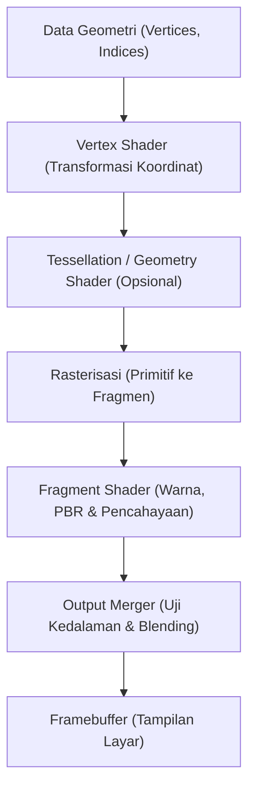

# Teknologi Game: Evolusi Engine Grafis 3D (Unreal Engine dan Unity)

Dalam industri hiburan digital modern, khususnya pengembangan video game dan produksi film virtual, evolusi engine grafis 3D merupakan salah satu pencapaian teknologi paling menakjubkan dalam ilmu komputer. Bermula pada era 1990-an dengan model poligon kasar dan pencahayaan datar, kini engine 3D telah menjelma menjadi sistem komputasi real-time yang sanggup menciptakan dunia virtual yang nyaris mustahil dibedakan dari kenyataan fisik.

Artikel ini menyajikan ulasan menyeluruh mengenai sejarah dan arsitektur teknis engine grafis 3D: mulai dari pipeline rendering dan Physically Based Rendering (PBR), terobosan Unreal Engine 5 (Nanite, Lumen), arsitektur modular Unity (URP, HDRP, DOTS), ray tracing berbasis perangkat keras, hingga integrasi kecerdasan buatan dalam rendering modern.

## 1. Pipeline Rendering 3D: Evolusi dan Pergeseran Paradigma

Memahami engine 3D mengharuskan kita memahami alur kerja **pipeline rendering grafis**. Unit pemroses grafis (GPU) masa awal mengandalkan **Fixed-Function Pipeline**, di mana perhitungan transformasi geometri dan tata cahaya dikunci mati pada sirkuit keras silikon, membatasi kebebasan ekspresi visual para pengembang.

Revolusi besar terjadi pada awal tahun 2000-an dengan hadirnya **programmable shaders**. Para pemrogram mendapatkan kendali penuh atas chip GPU melalui tahapan shader khusus:
- **Vertex Shader**: Menghitung transformasi koordinat 3D, deformasi jerat (mesh), dan animasi karakter (skinning).
- **Fragment Shader / Pixel Shader**: Menghitung tekstur material, interaksi cahaya, dan penetapan warna akhir pada setiap piksel layar.

Kini, pipeline rendering kian beralih ke arsitektur berbasis komputasi paralel masif menggunakan **Mesh Shaders** dan Compute Shaders yang sanggup memproses data geometri raksasa dengan sangat fleksibel.

```mermaid
flowchart TD
    A["Data Geometri (Vertices, Indices)"] --> B["Vertex Shader (Transformasi Koordinat)"]
    B --> C["Tessellation / Geometry Shader (Opsional)"]
    C --> D["Rasterisasi (Primitif ke Fragmen)"]
    D --> E["Fragment Shader (Warna, PBR & Pencahayaan)"]
    E --> F["Output Merger (Uji Kedalaman & Blending)"]
    F --> G["Framebuffer (Tampilan Layar)"]
```

## 2. Physically Based Rendering (PBR): Revolusi Material Nyata

Titik tolak terpenting menuju fotorealisme modern adalah standarisasi **Physically Based Rendering (PBR)** pada dekade 2010-an. Sebelum era PBR, game memakai model empiris (seperti Phong atau Blinn-Phong) yang mengharuskan artis menggambar tekstur kilau secara manual yang langsung terlihat janggal saat pencahayaan lingkungan berubah.

PBR mensimulasikan interaksi gelombang cahaya secara akurat berdasarkan hukum fisika optik dan termodinamika, berpijak pada **Persamaan Rendering (Rendering Equation)** legendaris karya James Kajiya:

$$ L_o(x, \omega_o) = L_e(x, \omega_o) + \int_{\Omega} f_r(x, \omega_i, \omega_o) L_i(x, \omega_i) (\omega_i \cdot n) d \omega_i $$

Di mana:
- $L_o(x, \omega_o)$ adalah pancaran radiansi spektral keluar dari titik $x$ ke arah $\omega_o$ (menuju kamera).
- $L_e(x, \omega_o)$ adalah cahaya yang dipancarkan sendiri oleh material berpendar.
- $\int_{\Omega}$ melambangkan integral hemisfer di atas seluruh arah datangnya cahaya $\omega_i$.
- $f_r(x, \omega_i, \omega_o)$ adalah BRDF (Bidirectional Reflectance Distribution Function) yang memodelkan hamburan cahaya pada faset mikro.
- $L_i(x, \omega_i)$ adalah radiansi cahaya yang tiba di titik $x$ dari arah $\omega_i$.
- $(\omega_i \cdot n)$ merupakan faktor pelemahan geometris menurut Hukum Kosinus Lambert.

Engine seperti Unreal Engine dan Unity mengkalkulasi pendekatan persamaan rumit ini dalam hitungan milidetik melalui model Cook-Torrance dan distribusi GGX. Artis 3D hanya perlu menyetel tiga parameter fisik intuitif:
- **Albedo (Warna Dasar)**: Warna murni permukaan bebas dari bayangan mati.
- **Roughness (Kekasaran)**: Kehalusan mikro permukaan yang menentukan ketajaman pantulan cahaya.
- **Metallic (Logam)**: Membedakan perilaku pantulan optik antara isolator dielektrik dan logam konduktif.

## 3. Inovasi Unreal Engine 5: Nanite dan Lumen

**Unreal Engine (UE)** buatan Epic Games selalu menjadi tolok ukur grafis kelas atas. Hadirnya Unreal Engine 5 memperkenalkan dua pilar teknologi mutakhir yang menghapus kompromi klasik dalam industri game:

### Nanite: Geometri Mikropoligon Ter-Virtualisasi
Dahulu, pengembang harus menghabiskan waktu berbulan-bulan membuat tingkatan detail (LOD) secara manual dan memanggang detail tinggi ke dalam peta normal agar game tidak tersendat.

Nanite menghapus kebutuhan pembuatan LOD manual. Nanite memungkinkan impor langsung model berkualitas film dengan puluhan hingga ratusan juta poligon. Sistem ini mengelompokkan jerat poligon ke dalam kluster hierarkis 128 segitiga dan hanya mengalirkan mikropoligon yang berukuran setara piksel layar secara real-time, menyajikan detail visual tak terbatas tanpa menghabiskan memori.

### Lumen: Pencahayaan Global Dinamis Real-Time
Lumen menggantikan metode kuno pemanggangan peta cahaya statis (Lightmaps) dengan sistem **Global Illumination (GI)** yang sepenuhnya dinamis. Ketika sinar matahari menembus celah gua, Lumen menghitung pantulan cahaya sekunder secara instan untuk menerangi sudut-sudut gua yang gelap. Jika dinding diledakkan atau waktu berganti, pencahayaan langsung menyesuaikan diri berkat kombinasi screen-space tracing, signed distance fields (SDF), dan ray tracing perangkat keras.

## 4. Evolusi Unity: Fleksibilitas Skala dan Arsitektur DOTS

**Unity**, yang dikembangkan oleh Unity Technologies, menopang lebih dari separuh produksi interaktif dunia berkat kemampuan lintas platformnya yang luar biasa, mulai dari ponsel pintar hingga headset VR dan konsol generasi terbaru.

### Pemisahan Pipeline Modular: URP dan HDRP
Untuk melayani keragaman spesifikasi perangkat keras, Unity merombak arsitekturnya menjadi Scriptable Render Pipelines (SRP):
- **URP (Universal Render Pipeline)**: Didesain hemat daya dan berkinerja tinggi untuk perangkat seluler, Nintendo Switch, dan kacamata VR mandiri.
- **HDRP (High Definition Render Pipeline)**: Ditujukan untuk PC performa tinggi dan konsol mutakhir, memanfaatkan compute shaders dan tata cahaya fisik untuk visual fotorealistis sekelas film layar lebar.

### DOTS: Ekosistem Berorientasi Data
Inovasi penting lainnya di Unity adalah pergeseran dari pemrograman berorientasi objek (OOP) ke desain berorientasi data (DOD) melalui **DOTS**. Memanfaatkan C# Job System, kompilator Burst, dan Entity Component System (ECS), DOTS mengoptimalkan penggunaan memori cache prosesor. Hasilnya, ratusan ribu objek mandiri (seperti simulasi kerumunan kota atau pertempuran luar angkasa) dapat disimulasikan dan dirender stabil pada 60 FPS.

## 5. Integrasi Ray Tracing Perangkat Keras dan AI Upscaling

Visual modern tidak terlepas dari perpaduan akselerasi perangkat keras khusus dan kecerdasan buatan.

Melalui hadirnya unit RT Cores pada GPU NVIDIA RTX dan AMD RDNA, teknik **Path Tracing** yang dahulu hanya ada di studio animasi kini dapat dinikmati secara real-time di PC konsumen. Engine menghitung oklusi ambien, bayangan kontak yang lembut, dan pantulan cermin dengan menembakkan sinar langsung ke struktur BVH.

Guna mengatasi beban komputasi ray tracing yang sangat berat, engine modern menanamkan algoritma super-resolusi berbasis AI:
- **NVIDIA DLSS (Deep Learning Super Sampling)**
- **AMD FSR (FidelityFX Super Resolution)**
- **Intel XeSS**

Dengan merender adegan pada resolusi lebih rendah lalu merekonstruksinya menjadi gambar 4K yang sangat tajam menggunakan jaringan saraf tiruan dan vektor gerakan temporal, AI sanggup menggandakan frame rate tanpa mengorbankan kualitas grafis.

## 6. Melewati Batas Video Game: Ekspansi ke Berbagai Industri

Engine grafis 3D kini tidak lagi terbatas pada industri game. Kemampuan simulasi optik dan fisik real-time telah memicu disrupsi di berbagai sektor:

- **Produksi Virtual dan Perfilman**: Serial kenamaan seperti *The Mandalorian* memanfaatkan panggung LED melengkung raksasa (The Volume) yang ditenagai Unreal Engine. Latar belakang 3D bergerak selaras dengan kamera secara real-time, menyingkirkan kerumitan layar hijau (green screen).
- **Arsitektur dan Otomotif**: Desainer merancang kembaran digital (Digital Twin) dengan presisi milimeter untuk pengujian aerodinamika di terowongan angin virtual dan simulasi pencahayaan matahari sebelum prototipe fisik dibuat.
- **Pelatihan Kendaraan Otonom**: Lingkungan perkotaan 3D disimulasikan lengkap dengan dinamika cuaca ekstrem guna melatih kecerdasan buatan mobil tanpa sopir secara aman melalui jutaan kilometer uji coba virtual.

## Kesimpulan: Pembebasan Daya Cipta Pengembang

Perjalanan panjang engine grafis 3D selama beberapa dekade diwarnai oleh kompromi teknis melawan batas kemampuan perangkat keras. Kreator kerap menghabiskan waktu berharga untuk memangkas poligon, memampatkan tekstur, dan memanipulasi bayangan palsu.

Kehadiran teknologi seperti Nanite, Lumen, dan DOTS telah meruntuhkan batasan-batasan tersebut. Kini para kreator dapat memusatkan energi mereka sepenuhnya pada perancangan dunia imajinatif, penceritaan emosional, dan mekanisme permainan yang memikat. Persaingan sehat antara Unreal Engine dan Unity akan terus mempercepat peleburan batas antara kenyataan fisik dan dunia digital masa depan.
