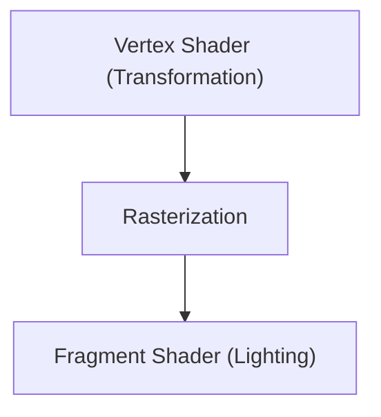

# 게임 기술: 3D 그래픽 엔진의 진화

3D 엔진은 실시간 렌더링을 진화시켰습니다.

## 렌더링 파이프라인

## 렌더링 방정식
$$ L_o = L_e + \int_{\Omega} f_r L_i (w_i \cdot n) d w_i $$

## 추가 기술 검증 파트 1

이 섹션에서는 추가적인 기술 세부 사항 및 사례 연구에 대해 깊이 파고듭니다. 다양한 조건 하에서의 성능 평가나, 다른 시스템과의 통합에 관한 과제와 해결책을 검토합니다. 향후 전망과 한계에 대해서도 고찰합니다.

