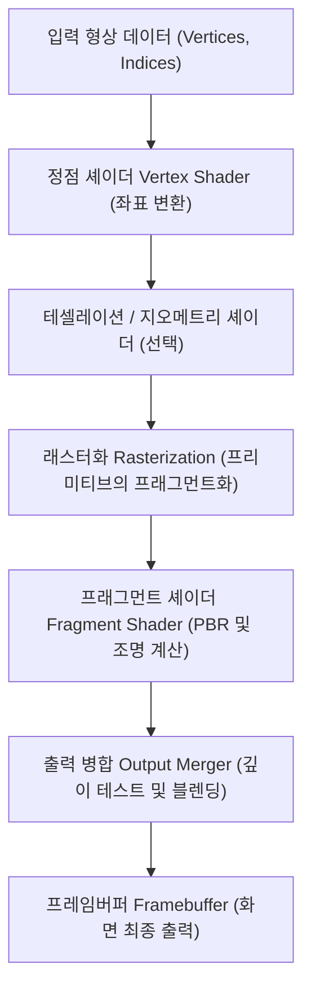

# 게임 기술: 3D 그래픽스 엔진의 진화 (Unreal Engine & Unity)

현대 디지털 엔터테인먼트, 특히 비디오 게임과 영상 가상 제작(Virtual Production) 분야에서 3D 그래픽스 엔진의 진화는 컴퓨터 과학 역사상 가장 눈부신 도약 중 하나입니다. 1990년대 몇 개의 거친 다각형(Polygon)으로 시작했던 3D 게임은, 이제 현실과 구분하기 어려울 정도의 포토리얼리즘 가상 세계를 실시간으로 렌더링하는 경지에 도달했습니다.

본 글에서는 3D 그래픽스 엔진의 발전사와 핵심 아키텍처를 심층 분석합니다: 고정 파이프라인에서 프로그래머블 셰이더로의 전환, 물리 기반 렌더링(PBR)의 수학적 원리, 언리얼 엔진 5(UE5)의 혁신 기술인 나나이트(Nanite)와 루멘(Lumen), 유니티의 모듈형 파이프라인(URP/HDRP)과 데이터 지향 기술 스택(DOTS), 그리고 실시간 하드웨어 레이 트레이싱과 AI 업스케일링의 융합에 이르기까지 폭넓게 살펴봅니다.

## 1. 3D 렌더링 파이프라인의 진화와 패러다임 전환

3D 그래픽스 엔진을 이해하기 위한 첫걸음은 **렌더링 파이프라인(Rendering Pipeline)** 의 구조를 파악하는 것입니다. 초기 GPU는 하드웨어 연산 로직이 고정된 **고정 기능 파이프라인(Fixed-Function Pipeline)** 을 사용했기 때문에, 개발자가 빛과 좌표 변환을 자유롭게 제어할 수 없었습니다.

그러나 2000년대 초 **프로그래머블 셰이더(Programmable Shaders)** 의 등장은 컴퓨터 그래픽스 역사상 가장 위대한 패러다임 전환을 가져왔습니다. 개발자는 셰이더 언어를 통해 GPU 하드웨어를 직접 프로그래밍할 수 있게 되었습니다:
- **정점 셰이더 (Vertex Shader)**: 3차원 공간상의 정점 좌표 변환, 버텍스 애니메이션, 캐릭터 스키닝 처리.
- **프래그먼트 셰이더 (Fragment Shader / Pixel Shader)**: 픽셀 단위의 재질 텍스처링, 조명 계산, 색상 결정.

현대 파이프라인은 더 나아가 테셀레이션, 지오메트리 셰이더, 그리고 최신의 **메시 셰이더(Mesh Shader)** 와 범용 컴퓨트 셰이더를 활용하여 기하학적 연산을 더욱 유연하게 처리하고 있습니다.

```mermaid
flowchart TD
    A["입력 형상 데이터 (Vertices, Indices)"] --> B["정점 셰이더 Vertex Shader (좌표 변환)"]
    B --> C["테셀레이션 / 지오메트리 셰이더 (선택)"]
    C --> D["래스터화 Rasterization (프리미티브의 프래그먼트화)"]
    D --> E["프래그먼트 셰이더 Fragment Shader (PBR 및 조명 계산)"]
    E --> F["출력 병합 Output Merger (깊이 테스트 및 블렌딩)"]
    F --> G["프레임버퍼 Framebuffer (화면 최종 출력)"]
```

## 2. 물리 기반 렌더링 (PBR): 질감 표현의 수학적 혁명

2010년대 3D 그래픽스의 가장 결정적인 분기점은 **물리 기반 렌더링(Physically Based Rendering: PBR)** 의 표준화였습니다. PBR 도입 이전에는 퐁(Phong)이나 블린-퐁(Blinn-Phong) 같은 경험적 모델에 의존했기 때문에, 아티스트가 빛의 변화에 따라 일일이 스펙큘러 텍스처를 손으로 그려야 했고 조명이 바뀌면 금세 어색해졌습니다.

PBR은 현실의 광학 및 열역학 법칙을 수학적으로 시뮬레이션합니다. 그 이론적 중심에는 제임스 카지야(James Kajiya)가 정립한 **렌더링 방정식(Rendering Equation)** 이 있습니다:

$$ L_o(x, \omega_o) = L_e(x, \omega_o) + \int_{\Omega} f_r(x, \omega_i, \omega_o) L_i(x, \omega_i) (\omega_i \cdot n) d \omega_i $$

여기서:
- $L_o(x, \omega_o)$ : 표면의 점 $x$에서 관찰 방향 $\omega_o$로 방출되는 총 방출 복사휘도(카메라에 닿는 빛의 세기).
- $L_e(x, \omega_o)$ : 물체 자체가 스스로 내뿜는 자체 발광(Self-emission).
- $\int_{\Omega}$ : 표면 위의 반구 전체에서 들어오는 모든 입사광 방향 $\omega_i$에 대한 적분.
- $f_r(x, \omega_i, \omega_o)$ : 양방향 반사도 분포 함수(BRDF), 미세표면 이론에 따른 재질의 빛 반사 특성.
- $L_i(x, \omega_i)$ : 입사 방향 $\omega_i$에서 표면으로 들어오는 입사 복사휘도.
- $(\omega_i \cdot n)$ : 람베르트 코사인 법칙에 따른 기하학적 감쇠 계수.

언리얼 엔진과 유니티는 쿡-토런스(Cook-Torrance) 미세표면 모델과 GGX 분포를 결합하여 이 복잡한 적분을 실시간으로 근사 계산합니다. 아티스트는 직관적인 세 가지 물리 파라미터만 조절하여 모든 현실의 물질을 정확하게 재현할 수 있습니다:
- **알베도 (Albedo / Base Color)**: 그림자 정보가 배제된 순수한 물체 고유의 색상.
- **거칠기 (Roughness)**: 표면의 미세한 굴곡 정도로, 하이라이트 반사의 흐림 정도 결정.
- **금속성 (Metallic)**: 비전도체(유전체)와 전도체(금속)의 물리적 반사율 차이 구분.

## 3. 언리얼 엔진 5의 기술 혁신: 나나이트(Nanite)와 루멘(Lumen)

에픽게임즈의 **언리얼 엔진(Unreal Engine)** 은 항상 최고 사양 하이엔드 그래픽의 기준점이었습니다. 특히 최신 **Unreal Engine 5 (UE5)** 는 수십 년간 게임 업계를 얽매었던 기술적 타협을 끝장내는 두 가지 핵심 기술을 도입했습니다:

### 나나이트 (Nanite): 가상화 마이크로폴리곤 지오메트리
과거 게임 개발자들은 프레임 레이트를 방어하기 위해 카메라 거리에 따라 모델링을 단순화하는 LOD(Level of Detail)를 수작업으로 제작하고, 고화질 디테일을 노멀 맵에 베이킹하는 데 수많은 시간을 쏟아야 했습니다.

나나이트는 수천만, 수억 개의 영화용 원본 지오메트리를 그대로 엔진에 임포트할 수 있게 해줍니다. 메시를 128개의 삼각형 클러스터로 자동 분할하고, 화면 픽셀 크기에 맞춰 필요한 마이크로폴리곤만을 실시간 스트리밍 렌더링합니다. 아티스트는 더 이상 폴리곤 제약에 갇힐 필요가 없습니다.

### 루멘 (Lumen): 완전 동적 글로벌 일루미네이션
루멘은 과거 수 시간씩 소요되던 라이트맵 베이킹(Baking)을 완전히 대체하는 실시간 **글로벌 일루미네이션(GI)** 시스템입니다. 햇빛이 동굴 입구로 들어와 바닥과 벽면에 반사되어 어두운 내부를 은은하게 밝히는 간접광(Indirect bounce)을 수 밀리초 단위로 실시간 계산합니다. 동적으로 벽이 무너지거나 낮에서 밤으로 시간이 바뀌어도 빛의 회절과 반사가 완벽하게 즉각 반영됩니다.

## 4. 유니티(Unity)의 진화: 확장성과 데이터 지향 기술(DOTS)

유니티 테크놀로지스의 **유니티 엔진** 은 모바일, PC, 콘솔, VR/AR을 아우르는 압도적인 멀티플랫폼 호환성과 개발 생산성으로 전 세계 게임 시장의 절반 이상을 지탱하고 있습니다.

### 스크립터블 렌더 파이프라인 (URP와 HDRP)
유니티는 기기 성능 편차를 완벽히 소화하기 위해 렌더링 파이프라인을 완전히 현대화했습니다:
- **URP (Universal Render Pipeline)**: 모바일, 닌텐도 스위치, 독립형 VR 기기를 위해 배터리 소모와 대역폭을 최적화한 고효율 파이프라인.
- **HDRP (High Definition Render Pipeline)**: 고사양 PC와 차세대 콘솔을 겨냥하여 컴퓨트 셰이더, 볼류메트릭 라이팅, 물리 기반 고급 조명을 풀가동하는 극사실적 파이프라인.

### DOTS (데이터 지향 기술 스택)의 도입
유니티의 또 다른 혁명은 전통적인 객체 지향 프로그래밍(OOP)에서 데이터 지향 설계(DOD)로의 전환인 **DOTS** 입니다. C# Job System, Burst 컴파일러, 엔티티 컴포넌트 시스템(ECS)을 통해 CPU 캐시 메모리 적중률을 극대화함으로써, 수만〜수십만 개의 독립된 객체(대규모 군중, 우주 함대전)를 60 FPS 이상으로 시뮬레이션하고 렌더링할 수 있습니다.

## 5. 실시간 레이 트레이싱과 AI 딥러닝의 결합

현대 3D 그래픽스 엔진은 하드웨어 발전과 인공지능의 결합을 통해 완성됩니다.

NVIDIA RTX 시리즈 및 AMD RDNA 아키텍처에 하드웨어 레이 트레이싱 가속 코어(RT Cores)가 탑재되면서, 과거 오프라인 영화 렌더링에서만 쓰이던 **패스 트레이싱(Path Tracing)** 이 실시간으로 구동됩니다. 광선의 물리적 궤적을 직접 추적하여 완벽한 거울 반사, 사실적인 굴절, 물리적 접촉 그림자를 자연스럽게 구현합니다.

또한 연산 부하를 획기적으로 줄이기 위해 최신 엔진들은 AI 기반 초해상도(Upscaling) 기술을 표준으로 내장하고 있습니다:
- **NVIDIA DLSS (Deep Learning Super Sampling)**
- **AMD FSR (FidelityFX Super Resolution)**
- **Intel XeSS**

네이티브 해상도보다 낮은 해상도로 빠르게 렌더링한 후, 딥러닝 신경망과 모션 벡터를 통해 고해상도 4K 화면으로 복원함으로써 화질 손상 없이 프레임 레이트를 2배 이상 끌어올립니다.

## 6. 게임을 넘어선 3D 그래픽스 엔진의 산업적 확장

오늘날 3D 그래픽스 엔진은 비디오 게임의 울타리를 넘어섰습니다. 초당 수십 회의 초고속 물리 및 광학 시뮬레이션 능력은 산업 전반을 근본적으로 바꾸고 있습니다:

- **영상 제작 및 버추얼 프로덕션**: 《만달로리안》 등 할리우드 대작 영화들은 거대한 LED 벽(The Volume)에 언리얼 엔진으로 배경을 실시간 투사하여 카메라 앵글과 동기화하는 기법을 표준으로 사용합니다.
- **건축 및 자동차 디지털 트윈**: 완공 전의 빌딩이나 신형 자동차를 밀리미터 단위의 정밀한 가상 모델로 제작하여 일조량 분석과 공기역학 시뮬레이션을 수행합니다.
- **자율주행 및 로봇 AI 학습**: 현실에서 발생하기 힘든 폭설, 빗길 주행, 돌발 상황을 가상 도시에서 무한히 시뮬레이션하여 안전하게 자율주행 신경망을 훈련시킵니다.

## 결론: 창작자를 기술적 타협에서 해방시키다

3D 그래픽스 엔진의 역사는 하드웨어의 한계에 맞선 기술적 타협의 연속이었습니다. 폴리곤을 깎아내고, 텍스처를 압축하고, 빛을 가짜로 굽는 데 수많은 시간을 허비해야 했습니다.

그러나 Nanite, Lumen, DOTS와 같은 첨단 기술의 출현은 마침내 창작자들을 이 같은 족쇄에서 해방시켰습니다. 이제 개발자들은 기술적 한계와의 싸움 대신 오직 독창적인 스토리텔링, 예술적 연출, 그리고 재미있는 게임플레이를 빚어내는 데 몰두할 수 있습니다. 언리얼 엔진과 유니티가 이끄는 기술 혁신은 가상과 현실의 경계를 지우며 인류에게 상상 그 이상의 디지털 경험을 선사하고 있습니다.
