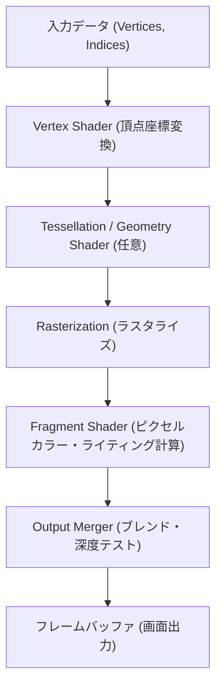

# ゲーム技術: 3Dグラフィックスエンジンの進化 (Unreal Engine / Unity)

現代のエンターテインメント、特にビデオゲームや映像制作において、3Dグラフィックスエンジンの進化は最も目覚ましい技術的飛躍の一つと言えるでしょう。数ピクセルの粗いポリゴンから始まった3Dゲームは、現在では現実と見紛うほどのフォトリアルな世界をリアルタイムでレンダリングするまでに至りました。本記事では、3Dグラフィックスエンジンの進化の歴史を振り返りつつ、業界を牽引する二大巨頭である「Unreal Engine」と「Unity」の最新技術、そしてそれを支えるレンダリングの仕組みについて深く掘り下げていきます。

## 1. 3Dレンダリングパイプラインの進化とパラダイムシフト

3Dグラフィックスエンジンを理解する上で欠かせないのが「レンダリングパイプライン」の概念です。初期のGPUは「固定機能パイプライン」を採用しており、開発者が介入できる余地は限られていました。しかし、2000年代初頭に登場した「プログラマブルシェーダー」により、この状況は一変します。

開発者は、頂点の位置を計算する「頂点シェーダー（Vertex Shader）」や、画面上のピクセルの色を決定する「フラグメントシェーダー（Fragment Shader / Pixel Shader）」を直接プログラミングできるようになり、表現の幅が爆発的に広がりました。現在ではさらに柔軟性の高いコンピュートシェーダーやメッシュシェーダーが主流となりつつあります。

以下は、一般的な現代のレンダリングパイプラインを簡略化したフローです。

## 2. 物理ベースレンダリング (PBR) による質感の革命

近年の3Dグラフィックスにおける最大のターニングポイントは、「物理ベースレンダリング（Physically Based Rendering: PBR）」の標準化です。PBRは、現実世界の光の物理的な挙動を数学的にシミュレーションすることで、説得力のある質感を生み出す手法です。

PBRの根底にあるのが以下の「レンダリング方程式（Rendering Equation）」です。この方程式は、ある点から特定の方向へ放射される光の量を定式化したものです。

$$ L_o(x, \omega_o) = L_e(x, \omega_o) + \int_{\Omega} f_r(x, \omega_i, \omega_o) L_i(x, \omega_i) (\omega_i \cdot n) d \omega_i $$

- $L_o$ : 出射放射輝度（カメラに届く光）
- $L_e$ : 発光（オブジェクト自体が光る場合の光）
- $\int_{\Omega}$ : 半球上のすべての入射方向についての積分
- $f_r$ : BRDF（双方向反射分布関数。マテリアルの質感を決定）
- $L_i$ : 入射放射輝度（光源や環境から届く光）
- $(\omega_i \cdot n)$ : ランベルトの余弦則に基づく減衰

Unreal EngineやUnityをはじめとする現代のエンジンは、この複雑な積分計算をリアルタイムで近似計算するための高度なアルゴリズムを実装しています。アルベド（基本色）、ラフネス（粗さ）、メタリック（金属度）という直感的なパラメータを調整するだけで、木材、金属、プラスチック、肌など、あらゆる物質を現実的に表現できるようになりました。

## 3. Unreal Engine 5 の革新: Nanite と Lumen

Epic Gamesが開発する「Unreal Engine (UE)」は、常にハイエンドグラフィックスの限界を押し広げてきました。特に最新のUnreal Engine 5 (UE5) は、ゲーム開発の常識を覆す2つのコア技術を導入しました。

### Nanite: 仮想化マイクロポリゴンジオメトリ
これまで、ゲーム開発者は処理負荷を下げるために、カメラからの距離に応じてモデルのポリゴン数を減らす「LOD (Level of Detail)」を手作業で作成し、ノーマルマップ（法線マップ）にディテールを焼き付けるという手間のかかる作業を強いられてきました。
Naniteは、映画用の数千万ポリゴンのアセットをそのままゲームエンジンにインポートし、ピクセルサイズにスケーリングされたポリゴンをリアルタイムでストリーミング描画することを可能にしました。これにより、LODの作成やポリゴン数の制限という呪縛からクリエイターを解放しました。

### Lumen: 完全動的なグローバルイルミネーション
Lumenは、ライトマップの事前ベイク（計算）を不要にする、完全動的なグローバルイルミネーション（GI）および反射システムです。太陽の光が洞窟の奥深くに差し込み、壁に反射して空間全体を照らすような間接光のシミュレーションを、ミリ秒単位でリアルタイムに計算します。時間帯の変化や、プレイヤーが壁を破壊して新たな光源が生まれた場合でも、光の回り込みが即座に更新されます。

## 4. Unityの進化: スケーラビリティとパフォーマンスの追求

Unity Technologiesが提供する「Unity」は、モバイルゲームからハイエンドPC、さらにはVR/ARまで、圧倒的なマルチプラットフォーム対応力とスケーラビリティを武器に進化を続けています。

### レンダリングパイプラインの細分化 (URP と HDRP)
Unityは多様なニーズに応えるため、レンダリングアーキテクチャを刷新しました。
- **URP (Universal Render Pipeline)**: パフォーマンスに最適化されており、モバイル端末からSwitch、VR機器まで、幅広いプラットフォームで高品質なグラフィックスを軽量に動作させます。
- **HDRP (High Definition Render Pipeline)**: PCやコンソール向けに物理ベースのライティングや高度なシェーダーをフル活用し、Unreal Engineに匹敵するフォトリアルなハイエンド表現を可能にします。

### DOTS (Data-Oriented Technology Stack) の導入
Unityのもう一つの大きな進化が、オブジェクト指向からデータ指向へのパラダイムシフトである「DOTS」です。CPUのキャッシュメモリを効率的に利用し、マルチコアプロセッシングを極限まで活用することで、数万、数十万という膨大な数のオブジェクトを60FPSでシミュレーション・描画することを実現しています。これにより、都市全体のシミュレーションや大規模な群衆の表現など、これまでにないスケールのゲームプレイが可能になります。

## 5. レイトレーシングとAIの融合

現代の3Dグラフィックスエンジンを語る上で欠かせないのが、ハードウェアの進化、特に「リアルタイムレイトレーシング」と「AIアップスケーリング」の統合です。

NVIDIAのRTXシリーズやAMDのRDNAアーキテクチャの登場により、これまで映画のCGレンダリングでしか不可能だったパストレーシング（光の軌跡を物理的に追跡する手法）がリアルタイムで実行可能になりました。エンジン側もこれにネイティブ対応し、正確な影、正確な反射、そして正確な屈折を表現しています。

さらに、レイトレーシングによる重い負荷を軽減するため、NVIDIA DLSS（Deep Learning Super Sampling）やAMD FSR（FidelityFX Super Resolution）などの超解像技術がエンジンに統合されています。低解像度でレンダリングした画像をAIの力で高解像度にアップスケールすることで、品質を落とさずにフレームレートを劇的に向上させることがスタンダードになりつつあります。

## 6. エンジンの未来と他産業への波及

3Dグラフィックスエンジンは、もはやゲーム開発だけのものではありません。その強力なリアルタイム処理能力は、さまざまな産業に革命をもたらしています。

- **映像制作とバーチャルプロダクション**: 『マンダロリアン』などの最先端の映画・ドラマ制作では、巨大なLEDウォールにUnreal Engineで生成した背景をリアルタイムで投影し、カメラの動きと連動させる手法が主流になっています。
- **建築と自動車産業**: UnityやUnreal Engineを用いて、設計段階の建築物や未発表の自動車モデルの精巧なデジタルツインを構築し、物理的なプロトタイプを作成することなく検証やプレゼンテーションを行うことが一般的になりました。
- **シミュレーションとAI学習**: 自動運転AIの学習用環境として、エンジン内で現実世界の天候や交通状況をシミュレーションし、仮想空間で安全かつ効率的にAIをトレーニングする用途にも活用されています。

## 結論: クリエイターを解放する技術の進化

3Dグラフィックスエンジンの歴史は、ハードウェアの制約やパフォーマンスの限界との戦いの歴史でした。しかし、現在私たちが目撃しているのは、NaniteやLumen、DOTSといった技術による「制約からの解放」です。

ポリゴン数の削減、テクスチャの最適化、ライトのベイクアップといった技術的な「ごまかし」に割いていた膨大な時間を、クリエイターは本来の「面白いゲームプレイを作ること」や「美しい世界をデザインすること」に集中できるようになりました。Unreal EngineとUnityが競い合いながら主導するこの技術革新は、今後も私たちの想像を超えるバーチャル体験を生み出していくことでしょう。
