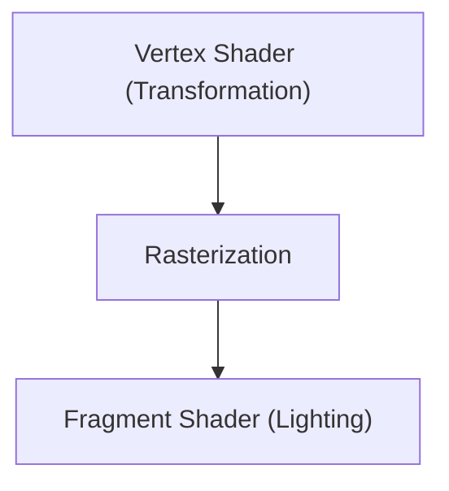

# Tecnologia de Jogos: A Evolução dos Motores Gráficos 3D

Os motores 3D evoluíram a renderização em tempo real.

## Pipeline de Renderização

## Equação de Renderização
$$ L_o = L_e + \int_{\Omega} f_r L_i (w_i \cdot n) d w_i $$

## Parte de Verificação Técnica Adicional 1

Nesta seção, nos aprofundamos em mais detalhes técnicos e estudos de caso. Avaliamos o desempenho sob várias condições e examinamos desafios e soluções para a integração com outros sistemas. Também consideramos as perspectivas futuras e limitações.

