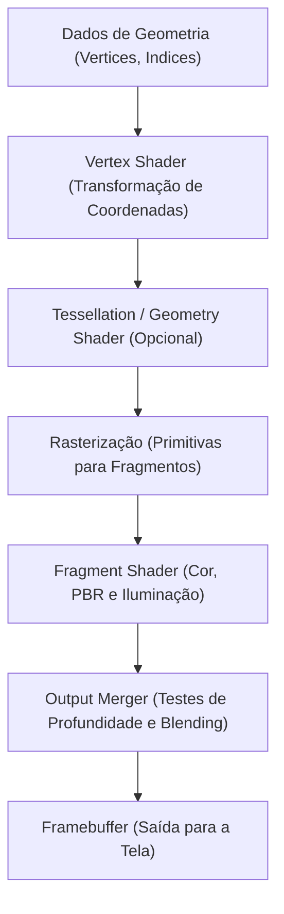

# Tecnologia de Jogos: A Evolução dos Motores Gráficos 3D (Unreal Engine e Unity)

No entretenimento digital moderno, em especial nos videogames e na produção cinematográfica virtual, a evolução dos motores gráficos 3D representa um dos maiores saltos da computação. O que começou nos anos 1990 com blocos poligonais rudimentares e sombreamento plano transformou-se em sistemas de renderização em tempo real capazes de gerar universos virtuais praticamente indistinguíveis da realidade física.

Este artigo analisa em profundidade a história e a arquitetura técnica dos motores 3D: do pipeline de renderização e do Renderizado Baseado em Física (PBR) às inovações revolucionárias da Unreal Engine 5 (Nanite, Lumen), passando pela arquitetura escalável da Unity (URP, HDRP, DOTS), ray tracing acelerado por hardware e upscaling com inteligência artificial.

## 1. O Pipeline de Renderização 3D: Evolução e Paradigmas

Para compreender os motores gráficos em tempo real, é fundamental entender o conceito de **pipeline de renderização**. As primeiras unidades de processamento gráfico (GPUs) utilizavam um **pipeline de função fixa (Fixed-Function Pipeline)**, no qual as regras de iluminação e projeção geométrica eram gravadas diretamente nos circuitos, limitando o controle criativo dos desenvolvedores.

No início dos anos 2000, o surgimento dos **shaders programáveis** revolucionou a computação visual. Os desenvolvedores passaram a controlar o hardware da GPU por meio de estágios especializados:
- **Vertex Shader**: Calcula a projeção de coordenadas 3D, deformações de malha e animações de esqueletos.
- **Fragment Shader / Pixel Shader**: Calcula no nível do pixel as texturas, interações luminosas e cores finais.

Atualmente, o pipeline caminha para abordagens totalmente orientadas a computação paralela, utilizando **Mesh Shaders** e Compute Shaders para manipular geometrias densas com máxima agilidade.

```mermaid
flowchart TD
    A["Dados de Geometria (Vertices, Indices)"] --> B["Vertex Shader (Transformação de Coordenadas)"]
    B --> C["Tessellation / Geometry Shader (Opcional)"]
    C --> D["Rasterização (Primitivas para Fragmentos)"]
    D --> E["Fragment Shader (Cor, PBR e Iluminação)"]
    E --> F["Output Merger (Testes de Profundidade e Blending)"]
    F --> G["Framebuffer (Saída para a Tela)"]
```

## 2. Renderização Baseada em Física (PBR): A Revolução dos Materiais

O grande divisor de águas no fotorrealismo dos jogos foi a consolidação do **Renderizado Baseado em Física (Physically Based Rendering: PBR)** durante a década de 2010. Antes do PBR, os jogos utilizavam modelos empíricos (como Phong ou Blinn-Phong), nos quais artistas precisavam pintar manualmente mapas especulares que se tornavam incoerentes diante de qualquer alteração na iluminação do cenário.

O PBR simula o comportamento real das ondas de luz a partir da clássica **Equação de Renderização** formulada por James Kajiya:

$$ L_o(x, \omega_o) = L_e(x, \omega_o) + \int_{\Omega} f_r(x, \omega_i, \omega_o) L_i(x, \omega_i) (\omega_i \cdot n) d \omega_i $$

Onde:
- $L_o(x, \omega_o)$ é a radiância espectral emitida a partir do ponto $x$ na direção $\omega_o$ (em direção à câmera).
- $L_e(x, \omega_o)$ é a emissão de luz própria do material.
- $\int_{\Omega}$ representa a integral sobre todas as direções incidentes de luz $\omega_i$ no hemisfério.
- $f_r(x, \omega_i, \omega_o)$ é a BRDF (Função de Distribuição de Refletância Bidirecional), que descreve a dispersão microscópica da luz.
- $L_i(x, \omega_i)$ é a luz incidente que chega ao ponto $x$.
- $(\omega_i \cdot n)$ é o fator de atenuação geométrica segundo a lei dos cossenos de Lambert.

Motores como Unreal Engine e Unity calculam aproximações dessa equação em tempo real com o modelo de microfacetas de Cook-Torrance e distribuição GGX. Os artistas só precisam calibrar três parâmetros físicos intuitivos:
- **Albedo (Cor Base)**: Cor própria do objeto sem sombras pré-calculadas.
- **Rugosidade (Roughness)**: Grau de micro-imperfeições que define se o reflexo é nítido ou difuso.
- **Metalicidade (Metallic)**: Separa o comportamento óptico de materiais dielétricos (isolantes) dos metais condutores.

## 3. As Inovações da Unreal Engine 5: Nanite e Lumen

Criada pela Epic Games, a **Unreal Engine (UE)** é o padrão de excelência para computação gráfica de ponta. A Unreal Engine 5 introduziu duas tecnologias pioneiras que encerraram décadas de concessões técnicas no desenvolvimento de jogos:

### Nanite: Geometria de Micropolígonos Virtualizada
No passado, os criadores gastavam meses construindo múltiplos níveis de detalhe (LOD) e gravando detalhes em mapas de normais para não sobrecarregar a memória de vídeo.

O Nanite extinguiu a necessidade de LODs manuais. Ele permite importar malhas tridimensionais de qualidade cinematográfica contendo dezenas ou centenas de milhões de polígonos. O Nanite divide internamente a geometria em grupos de 128 triângulos e transmite em streaming apenas os micropolígonos do tamanho exato dos pixels na tela, proporcionando detalhes infinitos sem esgotar os recursos de hardware.

### Lumen: Iluminação Global Dinâmica em Tempo Real
O Lumen substitui o método tradicional de pré-cálculo de mapas de luz estáticos (Lightmaps) por um sistema de **Iluminação Global (GI)** e reflexões totalmente dinâmico. Quando a luz solar entra por uma fresta em uma caverna, o Lumen calcula em milissegundos os múltiplos rebotes que clareiam o ambiente interno. Caso uma parede seja destruída ou o sol mude de posição, a iluminação responde imediatamente por meio de traçado em espaço de tela, campos de distância (SDF) e ray tracing por hardware.

## 4. A Evolução da Unity: Escalabilidade e Arquitetura DOTS

A **Unity**, desenvolvida pela Unity Technologies, dá suporte a mais da metade dos conteúdos interativos mundiais graças à sua versatilidade multiplataforma incomparável, desde celulares até consoles e óculos de realidade virtual.

### Pipelines Modulares: URP e HDRP
Para atender a dispositivos com potências variadas, a Unity renovou sua arquitetura com os Scriptable Render Pipelines (SRP):
- **URP (Universal Render Pipeline)**: Focado em máxima eficiência energética e desempenho em smartphones, Nintendo Switch e óculos VR autônomos.
- **HDRP (High Definition Render Pipeline)**: Voltado para PCs de alto desempenho e consoles da nova geração, aproveitando compute shaders e iluminação física para produzir visuais fotorrealistas dignos de Hollywood.

### DOTS: Stack de Tecnologia Orientada a Dados
Outra revolução na Unity foi a transição da programação orientada a objetos (POO) para o design orientado a dados com o **DOTS**. Aliando o C# Job System multithread, o compilador Burst e o Entity Component System (ECS), o DOTS otimiza ao máximo o uso da memória cache da CPU. Isso viabiliza a simulação e o desenho de centenas de milhares de entidades simultâneas (multidões densas, frotas espaciais) a 60 FPS contínuos.

## 5. Ray Tracing por Hardware e Super-resolução por IA

O ápice da tecnologia gráfica contemporânea reside na união entre aceleração de hardware e inteligência artificial.

Com a chegada de núcleos dedicados (RT Cores) nas placas NVIDIA RTX e AMD RDNA, o **Path Tracing (Traçado de Caminhos)** em tempo real tornou-se viável fora dos estúdios de cinema. Os motores calculam com precisão física oclusão de ambiente, sombras de contato suaves e reflexos espelhados testando raios diretamente contra estruturas aceleradoras (BVH).

Para amortizar o custo de processamento do ray tracing, os motores adotaram sistemas de superamostragem por inteligência artificial:
- **NVIDIA DLSS (Deep Learning Super Sampling)**
- **AMD FSR (FidelityFX Super Resolution)**
- **Intel XeSS**

Renderizando a cena internamente em resolução menor e reconstruindo imagens nítidas em 4K via redes neurais e vetores de movimento, a IA dobra a taxa de quadros mantendo a máxima qualidade visual.

## 6. Além dos Jogos: A Expansão Industrial dos Motores 3D

Os motores gráficos 3D extrapolaram o universo do entretenimento eletrônico. Sua capacidade de processamento em tempo real está revolucionando os mais diversos setores:

- **Produção Virtual e Cinema**: Séries consagradas como *The Mandalorian* utilizam estúdios com painéis de LED gigantes (The Volume) acionados pela Unreal Engine. Os cenários 3D adaptam-se perfeitamente aos movimentos das câmeras em tempo real, aposentando os tradicionais fundos verdes.
- **Arquitetura e Engenharia Automotiva**: Montadoras e escritórios de arquitetura criam réplicas virtuais precisas (Gêmeos Digitais) para testes aerodinâmicos em túneis de vento simulados ou estudos de insolação antes da fabricação de protótipos físicos.
- **Simulação para Condução Autônoma**: Cidades inteiras são modeladas com físicas climáticas dinâmicas para testar e treinar modelos de inteligência artificial de veículos autônomos por milhões de quilômetros simulados com total segurança.

## Conclusão: A Libertação do Potencial Criativo

A história dos motores gráficos 3D foi marcada por uma constante batalha contra as limitações de hardware. Durante décadas, os criadores foram obrigados a dedicar incontáveis horas a reduzir polígonos, compactar texturas e simular iluminações estáticas.

O surgimento de tecnologias como Nanite, Lumen e DOTS eliminou essas barreiras. Hoje, os desenvolvedores podem focar inteiramente na riqueza da narrativa, no design de mundos fascinantes e em mecânicas de gameplay inovadoras. Impulsionada pela intensa disputa entre Unreal Engine e Unity, a linha que separa o mundo físico do universo virtual está desaparecendo mais rápido do que nunca.
