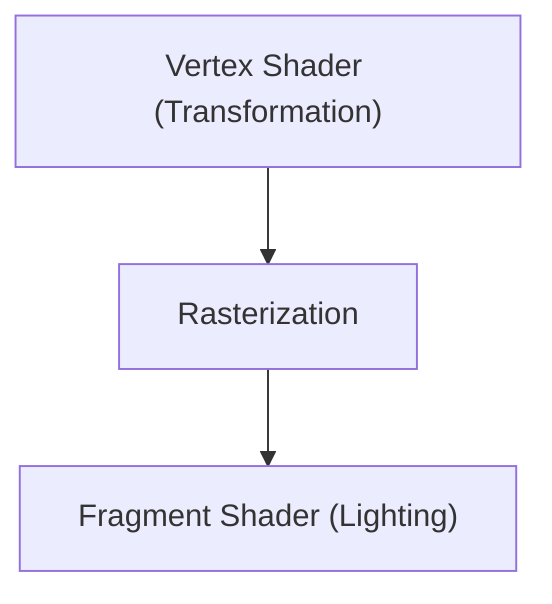

# Игровые технологии: Эволюция движков 3D-графики

3D-движки способствовали развитию рендеринга в реальном времени.

## Конвейер рендеринга

## Уравнение рендеринга
$$ L_o = L_e + \int_{\Omega} f_r L_i (w_i \cdot n) d w_i $$

## Дополнительная техническая проверка, часть 1

В этом разделе мы подробно рассмотрим дальнейшие технические детали и тематические исследования. Мы оценим производительность в различных условиях и рассмотрим проблемы и решения для интеграции с другими системами. Мы также обсудим будущие перспективы и ограничения.

