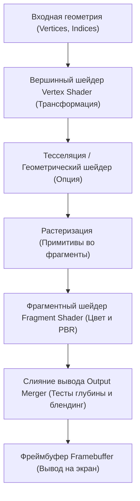

# Игровые технологии: Эволюция 3D-движков (Unreal Engine и Unity)

В современных цифровых развлечениях, видеоиграх и виртуальном кинопроизводстве развитие трехмерных графических движков представляет собой один из самых впечатляющих научно-технических прорывов. То, что начиналось в 1990-х годах с угловатых низкополигональных моделей, сегодня превратилось в сложнейшие вычислительные комплексы реального времени, способные воссоздавать виртуальные миры, неотличимые от физической реальности.

В этой статье подробно рассматривается эволюция и техническое устройство 3D-движков: от классического графического конвейера и физически корректного рендеринга (PBR) до революционных технологий Unreal Engine 5 (Nanite, Lumen), архитектуры Unity (URP, HDRP, DOTS), аппаратной трассировки лучей и интеграции искусственного интеллекта.

## 1. Конвейер 3D-рендеринга: Эволюция и смена парадигм

Понимание графического движка начинается с концепции **графического конвейера (Rendering Pipeline)**. Ранние графические процессоры (GPU) базировались на жестко фиксированном конвейере (**Fixed-Function Pipeline**), где формулы освещения и трансформации координат были аппаратно зашиты в кремний, оставляя разработчикам минимум творческой свободы.

Ситуация кардинально изменилась в начале 2000-х годов с появлением **программируемых шейдеров**. Разработчики получили прямой программный контроль над графическим процессором:
- **Вершинный шейдер (Vertex Shader)**: Вычисляет трансформацию 3D-координат, скелетную анимацию (скиннинг) и деформации геометрии.
- **Фрагментный шейдер / Пиксельный шейдер (Fragment Shader)**: Определяет цвет пикселей на экране, накладывает текстуры и рассчитывает освещение.

Современные графические конвейеры переходят к вычислительно-ориентированным архитектурам, использующим **Mesh Shaders** и Compute Shaders, что позволяет обрабатывать сложнейшую геометрию с предельной эффективностью.

```mermaid
flowchart TD
    A["Входная геометрия (Vertices, Indices)"] --> B["Вершинный шейдер Vertex Shader (Трансформация)"]
    B --> C["Тесселяция / Геометрический шейдер (Опция)"]
    C --> D["Растеризация (Примитивы во фрагменты)"]
    D --> E["Фрагментный шейдер Fragment Shader (Цвет и PBR)"]
    E --> F["Слияние вывода Output Merger (Тесты глубины и блендинг)"]
    F --> G["Фреймбуфер Framebuffer (Вывод на экран)"]
```

## 2. Физически корректный рендеринг (PBR): Революция материалов

Главным поворотным моментом на пути к фотореализму стала стандартизация **физически корректного рендеринга (Physically Based Rendering: PBR)** в 2010-х годах. До появления PBR в играх использовались эмпирические модели (такие как Фонг или Блинн-Фонг), требующие от художников рисовать карты отражений вручную, которые мгновенно теряли естественность при смене условий освещения.

PBR математически моделирует законы оптики и термодинамики на основе классического **уравнения рендеринга**, сформулированного Джеймсом Каджией:

$$ L_o(x, \omega_o) = L_e(x, \omega_o) + \int_{\Omega} f_r(x, \omega_i, \omega_o) L_i(x, \omega_i) (\omega_i \cdot n) d \omega_i $$

Где:
- $L_o(x, \omega_o)$ — спектральная яркость, излучаемая из точки $x$ в направлении $\omega_o$ (в камеру).
- $L_e(x, \omega_o)$ — собственное излучение светящихся материалов.
- $\int_{\Omega}$ — интеграл по полусфере всех возможных направлений падения света $\omega_i$.
- $f_r(x, \omega_i, \omega_o)$ — двунаправленная функция распределения отражения (BRDF), моделирующая рассеяние света микрогранями.
- $L_i(x, \omega_i)$ — падающая на точку $x$ яркость света из направления $\omega_i$.
- $(\omega_i \cdot n)$ — геометрический фактор ослабления по закону косинуса Ламберта.

Движки Unreal Engine и Unity решают приближения этого уравнения за доли миллисекунды, используя модель Кука-Торренса и распределение GGX. Художникам достаточно задать три интуитивно понятных физических параметра:
- **Альбедо (Базовый цвет)**: Чистый цвет поверхности без запеченных теней.
- **Шероховатость (Roughness)**: Микрорельеф поверхности, определяющий степень размытия бликов.
- **Металличность (Metallic)**: Разграничивает оптические свойства диэлектриков и проводящих металлов.

## 3. Технологические инновации Unreal Engine 5: Nanite и Lumen

Разрабатываемый Epic Games движок **Unreal Engine (UE)** традиционно задает эталоны передовой графики. С выходом Unreal Engine 5 компания представила две фундаментальные технологии, разрушившие барьеры традиционной разработки:

### Nanite: Виртуализированная геометрия микрополигонов
Раньше разработчики тратили колоссальные ресурсы на ручное создание уровней детализации (LOD) и запекание мелких деталей в карты нормалей ради экономии памяти и производительности.

Nanite полностью устранил необходимость ручного создания LOD. Он позволяет напрямую импортировать в движок высокополигональные кинематографические модели из десятков и сотен миллионов треугольников. Внутри Nanite разбивает геометрию на кластеры по 128 треугольников и динамически передает на отрисовку только микрополигоны, сопоставимые по размеру с пикселями экрана. Художники освободились от полигональных ограничений.

### Lumen: Полностью динамическое глобальное освещение
Lumen заменяет многочасовое запекание статичных карт освещения (Lightmaps) на полностью динамическую систему **глобального освещения (Global Illumination)**. Когда солнечный луч проникает в пещеру, Lumen в реальном времени просчитывает многократные диффузные переотражения, мягко освещающие темные своды. При разрушении стены или смещении солнца освещение мгновенно пересчитывается с использованием трассировки по экранному пространству, полей расстояний (SDF) и аппаратного рейтрейсинга.

## 4. Эволюция Unity: Масштабируемость и архитектура DOTS

Движок **Unity** от Unity Technologies охватывает колоссальную долю мирового рынка благодаря непревзойденной мультиплатформенности — от мобильных телефонов и автономных VR-шлемов до высокопроизводительных ПК и консолей.

### Модульные конвейеры: URP и HDRP
Чтобы удовлетворить столь разнообразные требования, Unity перешла на модульные программируемые конвейеры (Scriptable Render Pipelines):
- **URP (Universal Render Pipeline)**: Максимально оптимизирован под энергоэффективность и скорость на мобильных устройствах, Nintendo Switch и VR-шлемах.
- **HDRP (High Definition Render Pipeline)**: Спроектирован для топовых ПК и консолей нового поколения, задействуя вычислительные шейдеры, объемный свет и физическое освещение кинематографического уровня.

### DOTS: Стек технологий, ориентированный на данные
Еще одним прорывом Unity стал переход от классического объектно-ориентированного программирования (ООП) к архитектуре, ориентированной на данные (DOD) через **DOTS**. За счет многопоточной системы C# Job System, компилятора Burst и архитектуры ECS (Entity Component System) достигается предельная утилизация кэша процессора. Это позволяет симулировать и отрисовывать сотни тысяч независимых объектов (масштабные армии, симуляции толпы) при стабильных 60 FPS.

## 5. Аппаратный рейтрейсинг и масштабирование на базе ИИ

Современная графика неразрывно связана с выделенными аппаратными блоками и алгоритмами машинного обучения.

С появлением ядер RT Cores в видеокартах NVIDIA RTX и AMD RDNA физически точный **Path Tracing (трассировка путей)** стал доступен в играх реального времени. Движки вычисляют естественное затенение, мягкие контактные тени и чистые отражения, выпуская лучи непосредственно в ускоряющие древовидные структуры (BVH).

Для компенсации высокой вычислительной нагрузки рейтрейсинга современные движки повсеместно используют интеллектуальное масштабирование:
- **NVIDIA DLSS (Deep Learning Super Sampling)**
- **AMD FSR (FidelityFX Super Resolution)**
- **Intel XeSS**

Рендеринг сцены в пониженном разрешении с последующей нейросетевой реконструкцией до честного 4K на основе временных векторов движения удваивает кадровую частоту без потери четкости изображения.

## 6. За пределами видеоигр: Промышленное применение

3D-графические движки давно переросли рамки видеоигр. Их мощь и физическая точность находят широчайшее применение в индустрии:

- **Виртуальное кинопроизводство (Virtual Production)**: В съемках таких сериалов, как *«Мандалорец»*, актеры играют на фоне огромных изогнутых LED-стен (The Volume). Движок Unreal Engine рендерит окружение в реальном времени синхронно с движением съемочной камеры.
- **Архитектура и автомобилестроение**: Архитекторы и инженеры создают миллиметрово точные цифровые двойники (Digital Twins) для аэродинамических продувок в виртуальной трубе и расчета инсоляции еще до постройки физических прототипов.
- **Обучение ИИ для беспилотного транспорта**: 3D-движки моделируют городские улицы, переменчивую погоду и аварийные ситуации, позволяя обучать нейросети автопилота на миллионах километров виртуального пробега.

## Заключение: Освобождение творческой мысли

История 3D-графических движков долгое время была историей борьбы с аппаратными ограничениями. Авторам приходилось тратить недели на оптимизацию сеток, сжатие текстур и имитацию света.

Технологии Nanite, Lumen и DOTS сняли эти оковы. Сегодня создатели могут целиком сосредоточиться на режиссуре, дизайне миров и увлекательном геймплее. Соперничество между Unreal Engine и Unity продолжает стремительно стирать границу между виртуальным миром и объективной реальностью.
