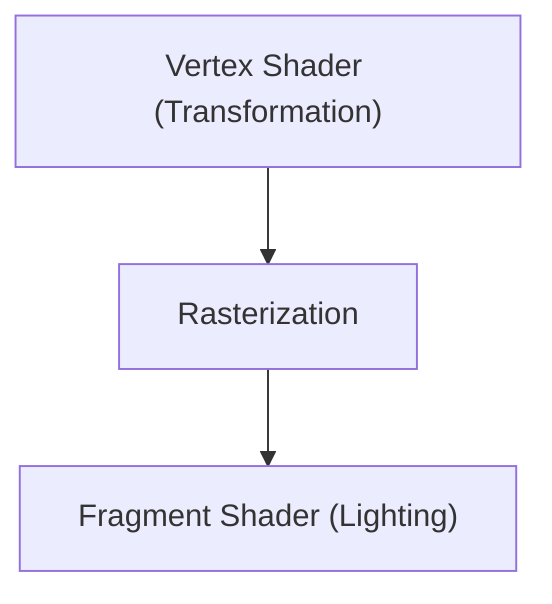

# 游戏技术：3D图形引擎的演进

3D引擎推动了实时渲染的演进。

## 渲染管线

## 渲染方程
$$ L_o = L_e + \int_{\Omega} f_r L_i (w_i \cdot n) d w_i $$

## 附加技术验证部分 1

本节将深入探讨进一步的技术细节和案例研究。我们将评估各种条件下的性能，并讨论与其他系统集成时的挑战和解决方案。我们还将对未来的前景和局限性进行考察。

