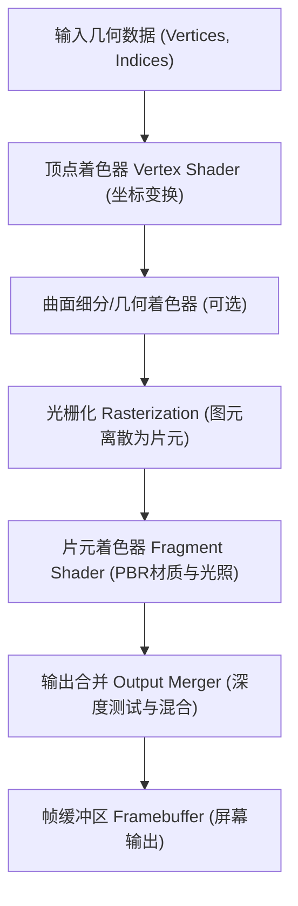

# 游戏技术：3D图形引擎的演进之路 (Unreal Engine 与 Unity)

在现代数字娱乐、电子游戏与影视虚拟制片领域，3D 图形引擎的演变堪称计算机科学史上最为惊艳的跨越之一。从 20 世纪 90 年代粗糙低多边形块状模型起步的 3D 游戏，如今已发展到能够以实时算力渲染出肉眼难辨真伪的拟真虚拟世界。

本文将全景式解析 3D 图形引擎的演进历程与核心技术架构：从经典渲染管线的范式转变、物理基础渲染（PBR）的数学精髓，到虚幻引擎 5（Unreal Engine 5）颠覆性的 Nanite 与 Lumen 技术、Unity 的模块化管线（URP/HDRP）与数据导向架构（DOTS），再到实时光线追踪与深度学习超分辨率技术的融合，以及图形引擎在工业数字孪生与影视领域的跨界革命。

## 1. 3D 渲染管线的演进与范式转移

理解 3D 图形引擎的核心，必须从 **渲染管线（Rendering Pipeline）** 的运作机制切入。早期的图形处理器（GPU）采用严格的 **固定功能管线（Fixed-Function Pipeline）** ，顶点变换和光照算法被固化在硅晶圆中，开发者几乎没有任何自由编程的空间。

2000 年代初，随着 **可编程着色器（Programmable Shaders）** 的横空出世，图形学迎来了天翻地覆的变革。开发者得以通过着色器语言直接操纵 GPU 硬件：
- **顶点着色器（Vertex Shader）** ：精确计算三维顶点的坐标变换、骨骼蒙皮与形态动画。
- **片元着色器（Fragment Shader / Pixel Shader）** ：在像素级别计算材质纹理、光照相互作用与色彩合成。

进入现代，几何着色器、曲面细分以及最新的 **网格着色器（Mesh Shader）** 和计算着色器（Compute Shader）正逐步取代传统前级，赋予引擎更灵活的算力调度机制。

```mermaid
flowchart TD
    A["输入几何数据 (Vertices, Indices)"] --> B["顶点着色器 Vertex Shader (坐标变换)"]
    B --> C["曲面细分/几何着色器 (可选)"]
    C --> D["光栅化 Rasterization (图元离散为片元)"]
    D --> E["片元着色器 Fragment Shader (PBR材质与光照)"]
    E --> F["输出合并 Output Merger (深度测试与混合)"]
    F --> G["帧缓冲区 Framebuffer (屏幕输出)"]
```

## 2. 基于物理的渲染 (PBR)：材质真实感的数学革命

现代图形学中最具里程碑意义的飞跃，是 2010 年代 **基于物理的渲染（Physically Based Rendering: PBR）** 的全面普及。在 PBR 诞生前，游戏普遍采用经验模型（如 Phong 或 Blinn-Phong），美工必须绘制大量依赖经验的高光贴图，一旦光照环境发生剧烈变化，物体质感往往立刻失真。

PBR 遵循严格的热力学与光学物理法则，其理论基石源自詹姆斯·卡吉亚（James Kajiya）提出的 **经典渲染方程（Rendering Equation）** ：

$$ L_o(x, \omega_o) = L_e(x, \omega_o) + \int_{\Omega} f_r(x, \omega_i, \omega_o) L_i(x, \omega_i) (\omega_i \cdot n) d \omega_i $$

其中：
- $L_o(x, \omega_o)$：表面点 $x$ 沿观察方向 $\omega_o$ 发射的出射辐射亮度（摄像机接收的光强）。
- $L_e(x, \omega_o)$：物体自身的发光分量。
- $\int_{\Omega}$：半球空间内所有可能入射光线方向 $\omega_i$ 的积分。
- $f_r(x, \omega_i, \omega_o)$：双向反射分布函数（BRDF），由微表面理论定义物体的表面微观反射特征。
- $L_i(x, \omega_i)$：沿方向 $\omega_i$ 射向表面点 $x$ 的入射辐射亮度。
- $(\omega_i \cdot n)$：基于朗伯余弦定律的几何衰减因子。

Unreal Engine 与 Unity 等现代商业引擎通过 Cook-Torrance 微表面模型与 GGX 分布函数，在数毫秒内对该复杂积分进行实时数学近似。美术人员只需调节极其直观的物理参数即可还原几乎所有真实物质：
- **基础色（Albedo / Base Color）** ：物体本身的无光照漫反射本色。
- **粗糙度（Roughness）** ：表面的微观起伏程度，决定高光的散射模糊度。
- **金属度（Metallic）** ：用于区分绝缘介质与导电金属的光学反射特性。

## 3. 虚幻引擎 5 (UE5) 的革命：Nanite 与 Lumen

Epic Games 旗下的 **虚幻引擎（Unreal Engine）** 历来是顶级画质的代名词。最新的 Unreal Engine 5（UE5）通过两项核心技术的突破，彻底终结了数十年来困扰游戏工业的技术折中：

### Nanite：虚拟化微多边形几何体
过去，开发者为了保证帧率，必须花费巨量人工制作不同精度的模型等级（LOD，Level of Detail），并将高模细节烘焙至法线贴图。

Nanite 彻底废弃了手动 LOD 流程。它允许开发者将影视级的数千万甚至数亿多边形的高精模型直接导入引擎。Nanite 在底层将网格自动聚类为层级化的微多边形群（每个群约 128 个三角形），根据摄像机距离以像素级精度动态流式调度渲染。美术师彻底摆脱了面数预算的束缚。

### Lumen：全动态全局光照与反射系统
传统的动态光照难以兼顾复杂的多级弹射间接光，游戏通常依赖预先离线“烘焙”好的光照贴图（Lightmaps）。

Lumen 实现了完全实时的 **全局光照（Global Illumination）** 。当太阳光照射到洞穴入口时，光线在岩壁、地面间经历多次漫反射照亮深处洞穴的物理过程，能够在数毫秒内动态计算更新。若玩家用炸药炸开一堵墙，新涌入的光束会立即自然洒满整个房间。

## 4. Unity 的演进：极致的跨平台伸缩性与性能突破

Unity Technologies 的 **Unity 引擎** 凭借对移动端、PC、主机乃至 VR/AR 头显的无缝跨平台支持，占据了全球互动内容的半壁江山。

### 可编程渲染管线细分：URP 与 HDRP
为了满足跨度极大的硬件设备需求，Unity 全面重构了其底层渲染架构：
- **通用渲染管线（URP）** ：针对手机、掌机（如任天堂 Switch）以及移动 VR 设备进行深度功耗与带宽优化，以低能耗提供高质量渲染。
- **高清渲染管线（HDRP）** ：专为高性能 PC 与次世代主机设计，全面支持物理光照、体积雾效与顶级着色技术，画面品质足以比肩顶级电影特效。

### 数据导向型技术堆栈（DOTS）
Unity 推动的另一场底层革命是从传统面向对象编程（OOP）转向面向数据设计（DOD）的 **DOTS** 。通过 C# Job System 多线程架构、Burst 编译器以及实体组件系统（ECS），DOTS 能够让 CPU 缓存命中率达到极致。在一帧内同时模拟和渲染数十万个具备独立 AI 和物理特性的单位（如密集同屏尸潮或城市交通网），并稳定保持 60 FPS。

## 5. 实时光线追踪与深度学习 AI 的融合

现代 3D 引擎的爆发式跃迁，亦得益于硬件底层算力的革命与人工智能算法的深度嵌入。

随着 NVIDIA RTX 系列和 AMD RDNA 架构显卡引入硬件级光线追踪计算核心（RT Cores），过去仅能在离线电影渲染中见到的 **路径追踪（Path Tracing）** 正式迈入实时领域。引擎通过直接发射光线计算求交，完美呈现精准的物理级柔和阴影、多层镜面反射以及真实光线折射。

为缓解全光线追踪带来的算力压力，引擎广泛集成了前沿的 AI 超分辨率采样技术：
- **NVIDIA DLSS（深度学习超级采样）**
- **AMD FSR（FidelityFX 超级分辨率）**
- **Intel XeSS**

通过在较低分辨率下渲染画面，再借助深度神经网络和时间反向投影向量将其智能重构至无损 4K 画面，不仅消除了图像锯齿，更让帧率直接翻倍。

## 6. 超越游戏：3D 引擎向多元工业领域的全面渗透

3D 图形引擎如今早已突破了娱乐游戏的单一范畴，其高保真、低延迟的实时仿真能力正在深刻重塑现代工业：

- **影视制作与虚拟制片（Virtual Production）** ：如《曼达洛人》等现代好莱坞大作，演员置身于由大型 LED 弧形屏幕墙包裹的摄影棚中，背景由 Unreal Engine 实时渲染并与摄影机轨迹无延迟联动，极大颠覆了传统绿幕后期制作。
- **建筑、工业设计与汽车工业** ：利用 Unity 或 Unreal Engine 为未下线的概念车或大型建筑群构建毫米级精准度的“数字孪生（Digital Twin）”，在设计阶段即可完成风洞气动仿真与日照分析。
- **自动驾驶与机器人 AI 训练** ：利用 3D 引擎构建具有逼真物理碰撞与多变天气的虚拟城市环境，让自动驾驶算法在虚拟世界中进行数百万公里的无风险低成本强化学习。

## 结论：技术演进对创造力的终极解放

纵观 3D 图形引擎的发展史，本质上就是一部人类工程师与硬件算力瓶颈抗争的史诗。在过去的几十年中，创作者不得不耗费漫长时间在多边形精简、法线烘焙与光照贴图伪造等“技术妥协”上。

而今天，Nanite、Lumen 与 DOTS 等划时代技术的诞生，终于将创作者从繁琐的技术束缚中解放出来。美术师与游戏设计师得以将全部精力投入到叙事设计、创意世界观的构筑以及核心玩法的打磨之中。在 Unreal Engine 与 Unity 的竞逐推动下，虚拟与现实的界限正在以前所未有的速度消融。
