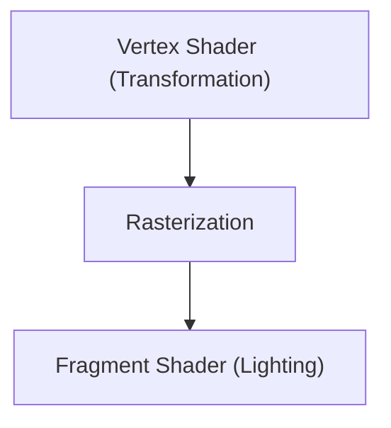

# 遊戲技術：3D圖形引擎的進化

3D引擎使即時渲染技術得到了進化。

## 渲染管線

## 渲染方程式
$$ L_o = L_e + \int_{\Omega} f_r L_i (w_i \cdot n) d w_i $$

## 附加技術驗證部分 1

本節將深入探討更多的技術細節與案例研究。我們將評估各種條件下的效能，並探討與其他系統整合時的挑戰與解決方案。同時，也會對未來的展望與局限性進行考察。

