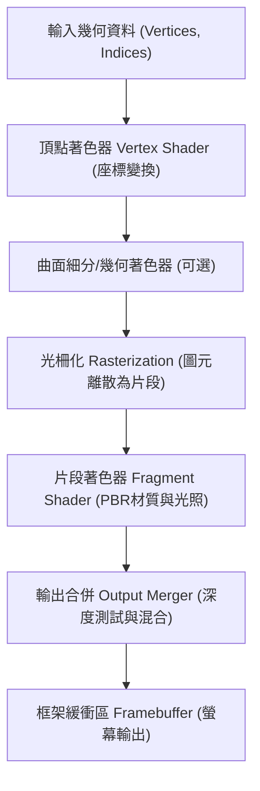

# 遊戲技術：3D圖形引擎的演進之路 (Unreal Engine 與 Unity)

在現代數位娛樂、電子遊戲與影視虛擬製片領域，3D 圖形引擎的演變堪稱電腦科學史上最為驚豔的跨越之一。從 20 世紀 90 年代粗糙低多邊形塊狀模型起步的 3D 遊戲，如今已發展到能夠以即時算力渲染出肉眼難辨真偽的擬真虛擬世界。

本文將全景式解析 3D 圖形引擎的演進歷程與核心技術架構：從經典渲染管線的範式轉變、物理基礎渲染（PBR）的數學精髓，到虛幻引擎 5（Unreal Engine 5）顛覆性的 Nanite 與 Lumen 技術、Unity 的模組化管線（URP/HDRP）與資料導向架構（DOTS），再到即時光線追蹤與深度學習超解析度技術的融合，以及圖形引擎在工業數位分身與影視領域的跨界革命。

## 1. 3D 渲染管線的演進與範式轉移

理解 3D 圖形引擎的核心，必須從 **渲染管線（Rendering Pipeline）** 的運作機制切入。早期的圖形處理器（GPU）採用嚴格的 **固定功能管線（Fixed-Function Pipeline）** ，頂點變換和光照演算法被固化在矽晶圓中，開發者幾乎沒有任何自由編程的空間。

2000 年代初，隨著 **可程式化著色器（Programmable Shaders）** 的橫空出世，圖形學迎來了翻天覆地的變革。開發者得以透過著色器語言直接操縱 GPU 硬體：
- **頂點著色器（Vertex Shader）** ：精確計算三維頂點的座標變換、骨骼蒙皮與形態動畫。
- **片段著色器（Fragment Shader / Pixel Shader）** ：在像素級別計算材質紋理、光照相互作用與色彩合成。

進入現代，幾何著色器、曲面細分以及最新的 **網格著色器（Mesh Shader）** 和計算著色器（Compute Shader）正逐步取代傳統前級，賦予引擎更靈活的算力調度機制。

```mermaid
flowchart TD
    A["輸入幾何資料 (Vertices, Indices)"] --> B["頂點著色器 Vertex Shader (座標變換)"]
    B --> C["曲面細分/幾何著色器 (可選)"]
    C --> D["光柵化 Rasterization (圖元離散為片段)"]
    D --> E["片段著色器 Fragment Shader (PBR材質與光照)"]
    E --> F["輸出合併 Output Merger (深度測試與混合)"]
    F --> G["框架緩衝區 Framebuffer (螢幕輸出)"]
```

## 2. 基於物理的渲染 (PBR)：材質真實感的數學革命

現代圖形學中最具里程碑意義的飛躍，是 2010 年代 **基於物理的渲染（Physically Based Rendering: PBR）** 的全面普及。在 PBR 誕生前，遊戲普遍採用經驗模型（如 Phong 或 Blinn-Phong），美術必須繪製大量依賴經驗的高光貼圖，一旦光照環境發生劇烈變化，物體質感往往立刻失真。

PBR 遵循嚴格的熱力學與光學物理法則，其理論基石源自詹姆斯·卡吉亞（James Kajiya）提出的 **經典渲染方程式（Rendering Equation）** ：

$$ L_o(x, \omega_o) = L_e(x, \omega_o) + \int_{\Omega} f_r(x, \omega_i, \omega_o) L_i(x, \omega_i) (\omega_i \cdot n) d \omega_i $$

其中：
- $L_o(x, \omega_o)$：表面點 $x$ 沿觀察方向 $\omega_o$ 發射的出射輻射亮度（攝影機接收的光強）。
- $L_e(x, \omega_o)$：物體自身的發光分量。
- $\int_{\Omega}$：半球空間內所有可能入射光線方向 $\omega_i$ 的積分。
- $f_r(x, \omega_i, \omega_o)$：雙向反射分布函數（BRDF），由微表面理論定義物體的表面微觀反射特徵。
- $L_i(x, \omega_i)$：沿方向 $\omega_i$ 射向表面點 $x$ 的入射輻射亮度。
- $(\omega_i \cdot n)$：基於朗伯餘弦定律的幾何衰減因子。

Unreal Engine 與 Unity 等現代商業引擎透過 Cook-Torrance 微表面模型與 GGX 分布函數，在數毫秒內對該複雜積分進行即時數學近似。美術人員只需調節極其直觀的物理參數即可還原幾乎所有真實物質：
- **基礎色（Albedo / Base Color）** ：物體本身的無光照漫反射本色。
- **粗糙度（Roughness）** ：表面的微觀起伏程度，決定高光的散射模糊度。
- **金屬度（Metallic）** ：用於區分絕緣介質與導電金屬的光學反射特性。

## 3. 虛幻引擎 5 (UE5) 的革命：Nanite 與 Lumen

Epic Games 旗下的 **虛幻引擎（Unreal Engine）** 歷來是頂級畫質的代名詞。最新的 Unreal Engine 5（UE5）透過兩項核心技術的突破，徹底終結了數十年來困擾遊戲工業的技術折中：

### Nanite：虛擬化微多邊形幾何體
過去，開發者為了保證幀率，必須花費巨量人工製作不同精度的模型等級（LOD，Level of Detail），並將高模細節烘焙至法線貼圖。

Nanite 徹底廢棄了手動 LOD 流程。它允許開發者將影視級的數千萬甚至數億多邊形的高精模型直接匯入引擎。Nanite 在底層將網格自動聚類為階層化的微多邊形群（每個群約 128 個三角形），根據攝影機距離以像素級精度動態流式調度渲染。美術師徹底擺脫了面數預算的束縛。

### Lumen：全動態全局光照與反射系統
傳統的動態光照難以兼顧複雜的多級彈射間接光，遊戲通常依賴預先離線「烘焙」好的光照貼圖（Lightmaps）。

Lumen 實現了完全即時的 **全局光照（Global Illumination）** 。當太陽光照射到洞穴入口時，光線在岩壁、地面間經歷多次漫反射照亮深處洞穴的物理過程，能夠在數毫秒內動態計算更新。若玩家用炸藥炸開一堵牆，新湧入的光束會立即自然灑滿整個房間。

## 4. Unity 的演進：極致的跨平台伸縮性與效能突破

Unity Technologies 的 **Unity 引擎** 憑藉對行動端、PC、主機乃至 VR/AR 頭戴裝置的無縫跨平台支援，佔據了全球互動內容的半壁江山。

### 可程式化渲染管線細分：URP 與 HDRP
為了滿足跨度極大的硬體設備需求，Unity 全面重構了其底層渲染架構：
- **通用渲染管線（URP）** ：針對手機、掌機（如任天堂 Switch）以及行動 VR 設備進行深度功耗與頻寬最佳化，以低能耗提供高品質渲染。
- **高畫質渲染管線（HDRP）** ：專為高效能 PC 與次世代主機設計，全面支援物理光照、體積霧效與頂級著色技術，畫面品質足以比肩頂級電影特效。

### 資料導向型技術堆疊（DOTS）
Unity 推動的另一場底層革命是從傳統物件導向程式設計（OOP）轉向資料導向設計（DOD）的 **DOTS** 。透過 C# Job System 多執行緒架構、Burst 編譯器以及實體元件系統（ECS），DOTS 能夠讓 CPU 快取命中率達到極致。在一幀內同時模擬和渲染數十萬個具備獨立 AI 和物理特性的單位（如密集同屏屍潮或城市交通網），並穩定保持 60 FPS。

## 5. 即時光線追蹤與深度學習 AI 的融合

現代 3D 引擎的爆發式躍遷，亦得益於硬體底層算力的革命與人工智慧演算法的深度嵌入。

隨著 NVIDIA RTX 系列和 AMD RDNA 架構顯示卡引入硬體級光線追蹤計算核心（RT Cores），過去僅能在離線電影渲染中見到的 **路徑追蹤（Path Tracing）** 正式邁入即時領域。引擎透過直接發射光線計算求交，完美呈現精準的物理級柔和陰影、多層鏡面反射以及真實光線折射。

為緩解全光線追蹤帶來的算力壓力，引擎廣泛整合了前沿的 AI 超解析度採樣技術：
- **NVIDIA DLSS（深度學習超級取樣）**
- **AMD FSR（FidelityFX 超級解析度）**
- **Intel XeSS**

透過在較低解析度下渲染畫面，再借助深度神經網路和時間反向投影向量將其智慧重建至無損 4K 畫面，不僅消除了圖像鋸齒，更讓幀率直接翻倍。

## 6. 超越遊戲：3D 引擎向多元工業領域的全面滲透

3D 圖形引擎如今早已突破了娛樂遊戲的單一範疇，其高保真、低延遲的即時模擬能力正在深刻重塑現代工業：

- **影視製作與虛擬製片（Virtual Production）** ：如《曼達洛人》等現代好萊塢大作，演員置身於由大型 LED 弧形螢幕牆包裹的攝影棚中，背景由 Unreal Engine 即時渲染並與攝影機軌跡無延遲連動，極大顛覆了傳統綠幕後製。
- **建築、工業設計與汽車工業** ：利用 Unity 或 Unreal Engine 為未下線的概念車或大型建築群建構公釐級精準度的「數位分身（Digital Twin）」，在設計階段即可完成風洞氣動模擬與日照分析。
- **自動駕駛與機器人 AI 訓練** ：利用 3D 引擎建構具有逼真物理碰撞與多變天氣的虛擬城市環境，讓自動駕駛演算法在虛擬世界中進行數百萬公里的無風險低成本強化學習。

## 結論：技術演進對創造力的終極解放

縱觀 3D 圖形引擎的發展史，本質上就是一部人類工程師與硬體算力瓶頸抗爭的史詩。在過去的幾十年中，創作者不得不耗費漫長時間在多邊形精簡、法線烘焙與光照貼圖偽造等「技術妥協」上。

而今天，Nanite、Lumen 與 DOTS 等劃時代技術的誕生，終於將創作者從繁瑣的技術束縛中解放出來。美術師與遊戲設計師得以將全部精力投入到敘事設計、創意世界觀的構築以及核心玩法的打磨之中。在 Unreal Engine 與 Unity 的競逐推動下，虛擬與現實的界限正在以前所未有的速度消融。
