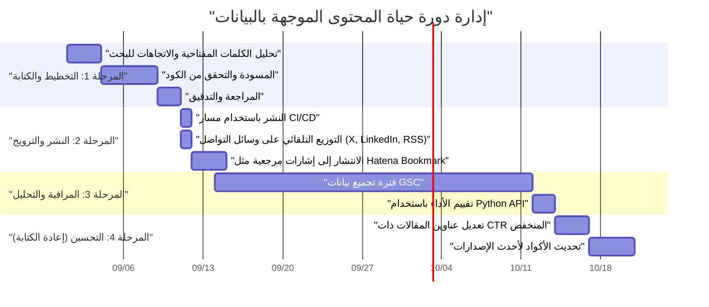
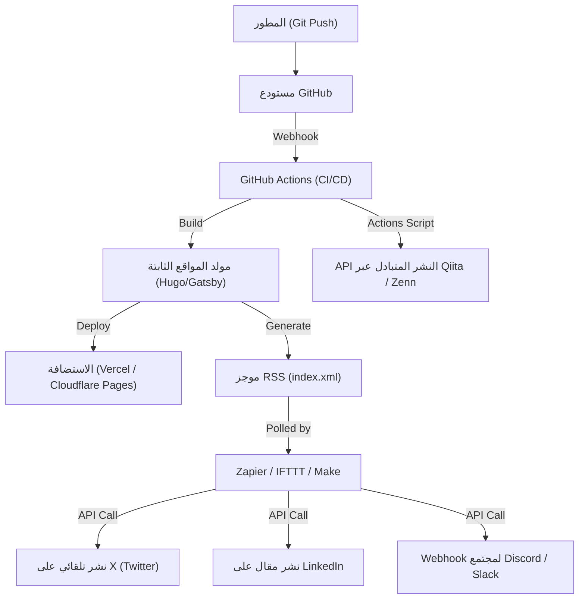

## مقدمة: نمو المدونات التقنية الذي يمكن للمهندسين فقط تحقيقه

يبدأ العديد من مهندسي البرمجيات في إنشاء مدونات تقنية، ولكن الحالات التي تنجح في جذب عدد معين من الزيارات والحفاظ عليها وتوسيعها على المدى الطويل ليست كثيرة. إن كتابة مقالات تقنية عالية الجودة هي شرط أساسي، ولكن عصر "اكتب مقالاً جيداً وسيُقرأ بشكل طبيعي" قد انتهى بالفعل. أصبحت خوارزميات محركات البحث الحالية أكثر تعقيداً، كما أصبح تدفق المعلومات على وسائل التواصل الاجتماعي أسرع من أي وقت مضى.

ومع ذلك، يتمتع المهندسون بنقاط قوة لا يمتلكها أصحاب المهن الأخرى. وهي "فهم بنية الأنظمة، والجمع بين الأدوات للأتمتة، وتحليل البيانات برمجياً". في هذا المقال، بدلاً من الاقتصار على مجرد تقنيات الكتابة، سنتعامل مع المدونة التقنية كـ "منتج" واحد، وسنشرح بتفصيل شديد وعملي استراتيجيات لزيادة الزيارات الشهرية بشكل كبير باستخدام قوة الهندسة.

---

## 1. بنية SEO للمدونات التقنية الموجهة للمهندسين

يعد النظام الأساسي للمدونة (مثل مولدات المواقع الثابتة) وهيكل HTML من أهم العوامل لمحركات البحث لتفسير المحتوى بشكل صحيح.

### 1.1 تحسين Core Web Vitals

تستخدم Google تجربة الصفحة كعامل ترتيب، ولا يمكن تجاهل **Core Web Vitals (LCP, FID/INP, CLS)** في المدونات التقنية بشكل خاص.
في المدونات التقنية، يتم استخدام الكثير من كتل التعليمات البرمجية المصدرية والمعادلات الرياضية (MathJax / KaTeX) والرسوم التوضيحية. هذه العوامل تؤخر عرض الصفحة.

- **LCP (Largest Contentful Paint)**: سرعة تحميل المحتوى الرئيسي في شاشة العرض الأولى. استخدم WebP أو AVIF للصورة البارزة (eyecatch)، وقم بالتحميل المسبق لها عن طريق إضافة خاصية `fetchpriority="high"`. بالإضافة إلى ذلك، اجعل ملفات CSS أو JS الضخمة المستخدمة في تمييز بناء الجملة (syntax highlighting) تُحمل بشكل غير متزامن، أو صممها بحيث تُحمل فقط في الصفحات التي تحتاج إليها.
- **CLS (Cumulative Layout Shift)**: انزياح التخطيط أثناء تحميل المقال. من خلال تخصيص مساحة عرض المعادلات والصور مسبقاً باستخدام `aspect-ratio` في CSS وما إلى ذلك، يمكنك منع الاهتزاز الذي يحدث عند إدراج DOM لاحقاً.
- **INP (Interaction to Next Paint)**: الاستجابة لتفاعلات المستخدم. من الضروري عدم تشغيل JavaScript الثقيلة (على سبيل المثال، البحث الديناميكي عن النص الكامل من جانب العميل، أو تنفيذ محلل Markdown ضخم) في السلسلة (thread) الرئيسية، بل نقلها إلى Web Worker أو إنشائها كـ HTML ثابت (SSG) أثناء عملية البناء.

### 1.2 تنفيذ البيانات المنظمة (JSON-LD)

لإبلاغ محركات البحث بشكل صريح بأن الصفحة عبارة عن "مقال" ومن هو "المؤلف"، نقوم بتنفيذ البيانات المنظمة بتنسيق JSON-LD. من خلال الاستفادة من المخططات (schemas) مثل `TechArticle` و `SoftwareSourceCode`، يصبح من الأسهل ظهورها في النتائج المنسقة (Rich Results) لـ Google، مما يحسن نسبة النقر إلى الظهور (CTR).

```html
<script type="application/ld+json">
{
  "@context": "https://schema.org",
  "@type": "TechArticle",
  "headline": "ما يجب على المهندسين فعله لزيادة الزيارات الشهرية للمدونات التقنية",
  "image": [
    "https://example.com/img/eyecatch.jpg"
  ],
  "datePublished": "2026-09-14T10:00:00+09:00",
  "author": {
    "@type": "Person",
    "name": "Kenji",
    "url": "https://example.com/about/"
  },
  "publisher": {
    "@type": "Organization",
    "name": "Kenji's Tech Blog",
    "logo": {
      "@type": "ImageObject",
      "url": "https://example.com/img/logo.png"
    }
  }
}
</script>
```

### 1.3 تحسين HTML الدلالي وهيكل المستند

يعد التداخل المناسب للعناوين (`h1` إلى `h6`) من الأساسيات، ولكن في المدونات التقنية، يُطلب الاستخدام الدقيق للعلامات الدلالية في HTML5 مثل `article`، `section`، `aside`، و `nav`. بالإضافة إلى ذلك، من خلال الاستخدام المناسب لـ `<code>` و `<pre>` للإشارة إلى التعليمات البرمجية المصدرية، و `<kbd>` لإدخال لوحة المفاتيح، و `<var>` للمتغيرات، يمكنك تقديم HTML قابل للقراءة آلياً. وتُعد هذه أيضاً وسيلة فعّالة جداً لفهرسة المحتوى بواسطة الذكاء الاصطناعي (جمع بيانات التدريب لنماذج LLM أو أنظمة RAG).

---

## 2. سيكولوجية نية البحث (Search Intent) واستراتيجية الكلمات المفتاحية

لتحقيق أقصى قدر من الزيارات القادمة من محركات البحث (الزيارات العضوية)، من الضروري الفهم الدقيق لنية البحث، أي "لماذا بحث المستخدم بهذه الكلمة المفتاحية". يمكن تقسيم نية البحث في المجال التقني إلى فئتين رئيسيتين.

### 2.1 "نوع حل الأخطاء" و"نوع التعلم المنهجي والمراجعة"

1. **نوع حل الأخطاء (Troubleshooting Intent)**
   - أمثلة على الكلمات المفتاحية للبحث: `Docker "no space left on device" حل`, `Python IndexError list index out of range سبب`
   - الحالة النفسية: المستخدم عالق بسبب خطأ أثناء التطوير، ويبحث عن أوامر أو مقتطفات برمجية لتكون كعلاج فوري.
   - الاستراتيجية: قدم "الاستنتاج (التعليمات البرمجية أو الأوامر لحل المشكلة)" في بداية المقال (شاشة العرض الأولى). ضع شرح الخلفية والآليات التفصيلية بعد ذلك، وقم بتلبية رغبة المستخدم في "إصلاح المشكلة فوراً" أولاً. هذا يمكن أن يقلل من معدل الارتداد (Bounce Rate).

2. **نوع التعلم المنهجي والمراجعة (Learning & Review Intent)**
   - أمثلة على الكلمات المفتاحية للبحث: `React مقابل Vue 2026 مقارنة`, `مقدمة في المعالجة غير المتزامنة Rust`, `تصميم بنية الشبكة GCP`
   - الحالة النفسية: يفكر المستخدم في اختيار حزمة تقنية جديدة، أو تعميق فهمه من الأساسيات، وهو مستعد لقضاء بعض الوقت في القراءة.
   - الاستراتيجية: قم بإثراء جدول المحتويات (TOC)، واستخدم الكثير من الرسوم التوضيحية ومخططات البنية (Mermaid وغيرها). من خلال المقارنة الموضوعية بين الإيجابيات والسلبيات، وتضمين حالات الاستخدام حول كيفية استخدامها في العمل الفعلي، يمكنك زيادة وقت البقاء في الصفحة.

### 2.2 نموذج التدهور الأسي للزيارات واستراتيجية الذيل الطويل (Long-Tail)

تميل أعداد الزيارات للمقالات التقنية إلى تشكيل ذروة مفاجئة (spike) بسبب انتشارها الواسع على وسائل التواصل الاجتماعي فور نشرها، ثم تنخفض بشكل أسي بعد ذلك. يمكن تقريب هذه الزيارات $V(t)$ بالنموذج الرياضي التالي.

$$ V(t) = V_0 e^{-\lambda t} + C $$

حيث:
- $V(t)$: حجم الزيارات في الوقت $t$
- $V_0$: حجم ذروة الزيارات الأولية الناتجة عن الانتشار على وسائل التواصل الاجتماعي فور النشر
- $\lambda$: ثابت التدهور المصاحب لتقادم المحتوى أو النسيان على وسائل التواصل الاجتماعي (يعتمد على سرعة تغير الاتجاهات التقنية)
- $C$: الزيارات العضوية المستقرة القادمة من محركات البحث (خط الأساس للزيارات)

إن مفتاح زيادة الزيارات على المدى الطويل لا يكمن في استهداف الانتشار المؤقت ($V_0$)، بل في **كيفية تكبير الحد الثابت $C$ (الزيارات المستمرة من محركات البحث)**. من خلال تغطية عدد كبير من "الكلمات المفتاحية ذات الذيل الطويل" التي تتميز بحجم بحث منخفض ولكن لا توجد منافسة عليها، مثل أخطاء متخصصة معينة أو طرق ربط بين أدوات معينة، نقوم بتنمية مجموع $C$ ليصبح ضخماً.

---

## 3. تحليل المحتوى الموجه بالبيانات باستخدام GSC API

لبناء قاعدة زيارات مستقرة $C$، من الضروري الاستفادة من بيانات Google Search Console (GSC) وتحليل "كيف يتم تقييمنا من قبل Google" بشكل موضوعي. ومع ذلك، هناك حدود للاعتماد على النقرات اليدوية في واجهة مستخدم الويب لـ GSC. بصفتك مهندساً، يجب عليك أتمتة التحليل باستخدام GSC API و Python.

### 3.1 نهج الأتمتة باستخدام GSC API و Python

سنقوم بإنشاء برنامج نصي يكتشف تلقائياً كيفية انخفاض ترتيب البحث لمقال معين بمرور الوقت (Decaying Content)، أو يكتشف "المقالات المهدرة" التي تحظى بعدد مرات ظهور كبير (impressions) ولكن نسبة النقر إلى الظهور (CTR) منخفضة بشكل غير طبيعي.
لهذا سنستخدم `google-api-python-client` و `pandas`.

### 3.2 الكود البرمجي بـ Python: الاستخراج التلقائي للمحتوى ذي الـ CTR المنخفض

فيما يلي مثال لبرنامج نصي يجلب بيانات أداء البحث لآخر 30 يوماً من API، ويستخرج "الكلمات المفتاحية وروابط المقالات التي لديها مجال كبير لتحسين العناوين أو الأوصاف"، حيث تكون مرات الظهور 1000 أو أكثر ونسبة CTR أقل من 2٪.

```python
import pandas as pd
from google.oauth2 import service_account
from googleapiclient.discovery import build
import datetime

# 1. المصادقة وبناء خدمة API
KEY_FILE_LOCATION = 'path/to/your-service-account-key.json'
SCOPES = ['https://www.googleapis.com/auth/webmasters.readonly']
SITE_URL = 'https://your-tech-blog.com/'

credentials = service_account.Credentials.from_service_account_file(
    KEY_FILE_LOCATION, scopes=SCOPES)
webmasters_service = build('searchconsole', 'v1', credentials=credentials)

# 2. حساب فترة الطلب (آخر 30 يوماً)
today = datetime.date.today()
end_date = (today - datetime.timedelta(days=2)).strftime('%Y-%m-%d')
start_date = (today - datetime.timedelta(days=32)).strftime('%Y-%m-%d')

# 3. تنفيذ طلب API
request = {
    'startDate': start_date,
    'endDate': end_date,
    'dimensions': ['query', 'page'],
    'rowLimit': 5000
}

response = webmasters_service.searchanalytics().query(
    siteUrl=SITE_URL, body=request).execute()

# 4. معالجة البيانات وتصفيتها باستخدام Pandas DataFrame
if 'rows' in response:
    rows = response['rows']
    data = []
    for row in rows:
        data.append({
            'Query': row['keys'][0],
            'URL': row['keys'][1],
            'Clicks': row['clicks'],
            'Impressions': row['impressions'],
            'CTR': row['ctr'],
            'Position': row['position']
        })
    
    df = pd.DataFrame(data)
    
    # شروط التصفية: مرات الظهور 1000 أو أكثر و CTR أقل من 2٪
    target_df = df[(df['Impressions'] >= 1000) & (df['CTR'] < 0.02)]
    
    # الترتيب التصاعدي للموضع (إعطاء الأولوية لتلك التي ترتيبها عالٍ ولكن لا يتم النقر عليها)
    target_df = target_df.sort_values(by='Position', ascending=True)
    
    print("【القائمة الموصى بها لتحسين العنوان/الوصف التعريفي】")
    print(target_df.head(10))
    
    # تصدير إلى CSV وغيرها عند الحاجة
    # target_df.to_csv('improve_candidates.csv', index=False)
else:
    print("لم يتم العثور على بيانات.")
```

من خلال تشغيل هذا البرنامج النصي كوظيفة دورية في cron أو GitHub Actions، يمكنك دائماً اتخاذ قرار يعتمد على البيانات حول "المقالات التي يجب إعادة كتابة عناوينها". بدلاً من الاعتماد على الحدس، من المهم إجراء تحسين مستمر بناءً على البيانات (التحسين المستمر للمحتوى Continuous Content Improvement وليس فقط CI/CD).

---

## 4. إدارة دورة حياة المقال واستراتيجية إعادة الكتابة

لا تنتهي المقالة التقنية بمجرد نشرها. مع تطور التكنولوجيا (تحديث إصدارات إطارات العمل، إيقاف واجهات برمجة التطبيقات وما إلى ذلك)، يصبح المحتوى قديماً بسرعة. الاستمرار في تقديم معلومات قديمة لا يضر بمصداقية المدونة فحسب، بل يؤثر سلباً على تقييم SEO.

### 4.1 إدارة دورة حياة المحتوى (مخطط جانت)

يوضح مخطط جانت بـ Mermaid دورة الحياة المثالية لتشغيل المحتوى.



بهذه الطريقة، فإن التعامل مع إنشاء المقال كمشروع تطوير برمجيات واحد، وإدراج مرحلة التشغيل والصيانة (إعادة الكتابة) بعد الإصدار في الخطة، هو سر الحفاظ على الزيارات وتحسينها.

### 4.2 النموذج الرياضي للعائد على الاستثمار (ROI) لإنشاء المحتوى

بما أن المهندس يخصص وقته الثمين لكتابة مقال، فيجب أن يكون واعياً بالعائد على هذا الاستثمار (ROI).
يمكن صياغة ROI في المدونة على النحو التالي.

$$ ROI = \frac{\sum_{t=1}^{T} \left( Rev_{ad}(t) + Val_{brand}(t) + Val_{skill}(t) \right) - Cost_{time}}{\text{Cost}_{time}} \times 100 \ (\%) $$

- $T$: العمر الافتراضي الفعال للمقال (الفترة حتى يصبح قديماً)
- $Rev_{ad}(t)$: العوائد المباشرة من إيرادات الإعلانات أو إيرادات التسويق بالعمولة أو الرعاية
- $Val_{brand}(t)$: القيمة المالية المحولة للتأثير الإيجابي على المسار المهني (زيادة قيمة العروض عند تغيير الوظيفة، طلبات إلقاء محاضرات، إلخ) نتيجة إبراز المهارات التقنية
- $Val_{skill}(t)$: القيمة المضافة لتطوير مهاراتك الذاتية نتيجة التعلم والبحث الذي قمت به من أجل كتابة المقال
- $Cost_{time}$: الوقت المستغرق في كتابة المقال، وإنشاء الرسوم التوضيحية، والتحقق من الكود (محسوباً بأجرك بالساعة)

الشيء الرائع في المدونات التقنية هو أنه حتى لو كان $Rev_{ad}$ صغيراً، فإن $Val_{brand}$ و $Val_{skill}$ يميلان إلى أن يكونا كبيرين جداً. على وجه الخصوص، الشروحات التقنية عالية الجودة تصبح بحد ذاتها ملف أعمال (Portfolio)، ولها تأثير هائل في البحث عن عمل أو الحصول على أعمال جانبية.

---

## 5. التوزيع باستخدام GitHub Actions والتكامل مع أدوات الأتمتة الخارجية

بعد إنشاء المحتوى، يصبح التحدي هو كيفية إيصاله بكفاءة إلى الجمهور المستهدف (التوزيع). من غير الفعال نشر الروابط يدوياً على كل شبكة اجتماعية في كل مرة، وهذا ليس من شيم المهندسين.

### 5.1 بنية أتمتة مشاركة وسائل التواصل الاجتماعي

سنقوم ببناء بنية أتمتة كاملة تبدأ من لحظة دمج ملف Markdown في فرع main في مستودع GitHub، لتشمل البناء والنشر والإعلان عبر منصات متعددة.



### 5.2 النقاط الأساسية في بناء مسار الأتمتة

1. **البناء والنشر باستخدام GitHub Actions**
   إذا كنت تستخدم مولد مواقع ثابتة، فاستخدم GitHub Actions لأتمتة إنشاء HTML ونشره على وجهة الاستضافة (Vercel، Netlify، Cloudflare Pages، وما إلى ذلك). في هذه الحالة، كتدبير لـ Core Web Vitals المذكور سابقاً، من الفعال أيضاً دمج عملية تحسين الصور (مثل التحويل التلقائي إلى WebP) في مسار البناء.

2. **ربط وسائل التواصل الاجتماعي عبر مشغلات RSS باستخدام Zapier/IFTTT**
   يقوم مولد الموقع بإنشاء أحدث موجز RSS (XML) أثناء البناء. يمكنك إدخال هذا في منصات iPaaS مثل Zapier أو Make (المعروفة سابقاً باسم Integromat) وإنشاء سير عمل يقول "عند إضافة عنصر جديد إلى RSS، قم بنشر العنوان والرابط على X (Twitter) و LinkedIn". بهذه الطريقة، يتم إشعار المتابعين تلقائياً في نفس اللحظة التي يتم فيها نشر المقال.

3. **النشر المتبادل إلى Qiita/Zenn (استخدام العلامات الأساسية Canonical tags)**
   بينما لا تزال قوة نطاق مدونتك الخاصة أو الشخصية ضعيفة، فإن إحدى الاستراتيجيات هي استعارة قوة الجذب لمنصات تقنية مثل Qiita و Zenn. ومع ذلك، فإن مجرد النسخ واللصق يحمل خطر التعرض لعقوبة من قِبل محركات البحث (SEO) بسبب المحتوى المكرر.
   يمكن حل هذه المشكلة عن طريق تعيين **علامة Canonical** في البيانات الوصفية لمقالات Qiita أو Zenn، وتحديد عنوان URL للمقال الأصلي على مدونتك. من خلال برمجة نصية تستدعي واجهات برمجة التطبيقات لمختلف المنصات من GitHub Actions وتولد مقالات تلقائياً من Markdown، يمكنك أتمتة النشر بالكامل عبر قنوات متعددة.

---

## خاتمة: تدوير عجلة التحسين المستمر

من أجل زيادة الزيارات الشهرية للمدونة التقنية بشكل كبير، فإنه بالإضافة إلى فعل "الكتابة"، من الضروري اتباع نهج هندسي مثل الذي قدمناه هذه المرة.

1. بناء بنية موقع و HTML قوية مع مراعاة SEO
2. تصميم مقالات تتفهم نية بحث المستخدم (حل الأخطاء مقابل التعلم المنهجي)
3. تحليل البيانات باستخدام Google Search Console API و Python
4. إدارة دورة حياة المحتوى وإعادة كتابته مع مراعاة ROI
5. الأتمتة الكاملة للتوزيع باستخدام تكامل CI/CD و Zapier

إذا تمكنت من تجميع هذه العناصر في نظام متكامل، فستصبح مدونتك التقنية أقوى أصل (Asset) يدعم مسيرتك المهنية بقوة. بالنسبة للمهندسين الذين يعانون من ركود في أعداد الزيارات، نرجو منكم البدء بـ "نمو المدونة (Growth Hack)" من اليوم. إن مهارات البرمجة وقدرات تصميم البنية التي اكتسبتها من أعمال التطوير ستكون بلا شك أقوى سلاح لك في إدارة المدونة.
