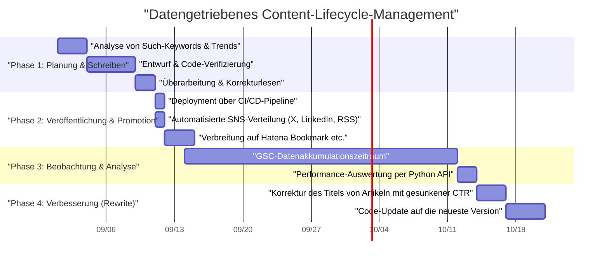
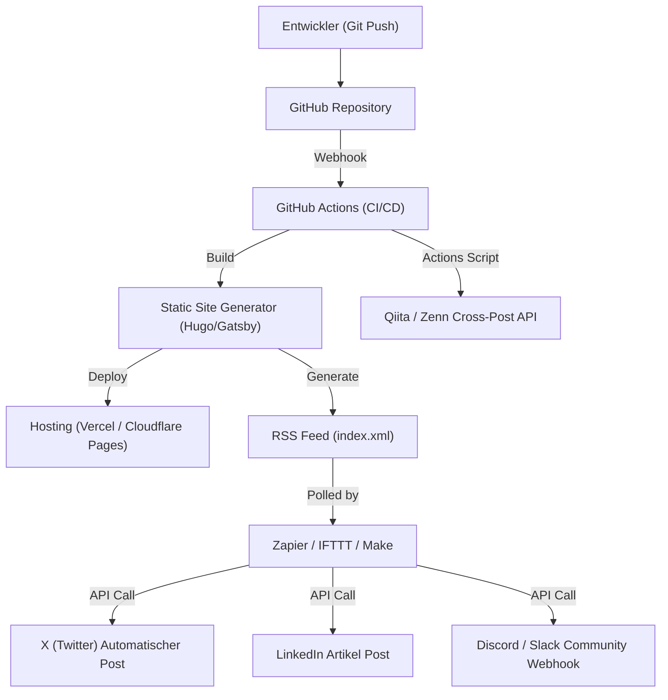

## Einführung: Growth Hacking für Tech-Blogs, das nur Ingenieure können

Viele Softwareingenieure starten einen Tech-Blog, aber es gibt nicht viele Fälle, in denen sie eine bestimmte Anzahl von Zugriffen sammeln und diese über einen langen Zeitraum aufrechterhalten und ausbauen können. Es ist eine Grundvoraussetzung, qualitativ hochwertige technische Artikel zu schreiben, aber die Zeit, in der "gute Artikel natürlich gelesen werden", ist bereits vorbei. Die Algorithmen aktueller Suchmaschinen sind komplexer geworden, und zudem ist der Informationsfluss in sozialen Netzwerken schneller als je zuvor.

Ingenieure haben jedoch Stärken, die andere Berufe nicht haben. Diese bestehen darin, dass sie "die Architektur von Systemen verstehen, Werkzeuge zur Automatisierung kombinieren und Daten programmatisch analysieren können". In diesem Artikel betrachten wir einen Tech-Blog als ein einziges "Produkt", das über bloße Schreibtechniken hinausgeht, und erklären detailliert und praxisnah Strategien, um die monatlichen Zugriffe durch die Kraft des Engineerings drastisch zu steigern.

---

## 1. SEO-Architektur für Tech-Blogs von Ingenieuren

Das dem Blog zugrunde liegende System (wie z.B. Static Site Generators) und die HTML-Struktur sind die wichtigsten Faktoren für Suchmaschinen, um den Inhalt richtig zu interpretieren.

### 1.1 Optimierung der Core Web Vitals

Google verwendet die Page Experience als Ranking-Faktor, und insbesondere **Core Web Vitals (LCP, FID/INP, CLS)** dürfen auch bei Tech-Blogs nicht ignoriert werden.
In Tech-Blogs werden häufig große Mengen an Quellcode-Blöcken, mathematische Formeln (MathJax / KaTeX) und illustrative Bilder verwendet. Diese sind Faktoren, die das Rendern der Seite verzögern.

- **LCP (Largest Contentful Paint)**: Die Ladegeschwindigkeit des Hauptinhalts im sichtbaren Bereich (First View). Verwenden Sie WebP oder AVIF für das Eyecatcher-Bild und laden Sie es mit dem Attribut `fetchpriority="high"` vor. Entwerfen Sie auch riesige CSS- oder JS-Dateien für das Syntax-Highlighting so, dass sie asynchron oder nur auf den benötigten Seiten geladen werden.
- **CLS (Cumulative Layout Shift)**: Layout-Verschiebungen während des Ladens der Seite. Indem Sie den Anzeigebereich für Formeln und Bilder im Voraus mit CSS-Eigenschaften wie `aspect-ratio` reservieren, verhindern Sie ein Ruckeln, wenn das DOM später eingefügt wird.
- **INP (Interaction to Next Paint)**: Reaktionsfähigkeit auf Benutzereingaben. Es ist unerlässlich, schweres JavaScript (z.B. dynamische Volltextsuche auf der Client-Seite oder die Ausführung eines riesigen Markdown-Parsers) nicht im Hauptthread auszuführen, sondern es an einen Web Worker auszulagern oder es beim Build als statisches HTML zu generieren (SSG).

### 1.2 Implementierung strukturierter Daten (JSON-LD)

Um Suchmaschinen explizit mitzuteilen, dass eine Seite ein "Artikel" ist und "wer" der Autor ist, implementieren wir strukturierte Daten im JSON-LD-Format. Durch die Verwendung von Schemata wie `TechArticle` oder `SoftwareSourceCode` wird es wahrscheinlicher, dass sie in den Rich Results von Google angezeigt werden, was die CTR (Click-Through-Rate) verbessert.

```html
<script type="application/ld+json">
{
  "@context": "https://schema.org",
  "@type": "TechArticle",
  "headline": "Was Ingenieure tun sollten, um die monatlichen Zugriffe auf ihrem Tech-Blog zu steigern",
  "image": [
    "https://example.com/img/eyecatch.jpg"
  ],
  "datePublished": "2026-09-14T10:00:00+09:00",
  "author": {
    "@type": "Person",
    "name": "Kenji",
    "url": "https://example.com/about/"
  },
  "publisher": {
    "@type": "Organization",
    "name": "Kenji's Tech Blog",
    "logo": {
      "@type": "ImageObject",
      "url": "https://example.com/img/logo.png"
    }
  }
}
</script>
```

### 1.3 Semantisches HTML und Optimierung der Dokumentstruktur

Die richtige Verschachtelung von Überschriften (`h1` bis `h6`) ist eine der grundlegendsten Regeln, aber in Tech-Blogs ist auch die korrekte Verwendung von semantischen HTML5-Tags wie `article`, `section`, `aside` und `nav` erforderlich. Darüber hinaus können Sie durch die angemessene Unterscheidung von `<code>` und `<pre>` für Quellcode, `<kbd>` für Tastatureingaben und `<var>` für Variablen ein maschinenlesbares HTML bereitstellen. Dies ist auch eine äußerst effektive Methode für die KI-gestützte Inhaltsindizierung (Sammeln von Trainingsdaten für LLMs oder RAG-Systeme).

---

## 2. Die Psychologie der Suchintention und Keyword-Strategien

Um den Traffic von Suchmaschinen (organischer Traffic) zu maximieren, ist es notwendig, die Suchintention der Nutzer genau zu interpretieren: "Warum haben sie nach diesem Keyword gesucht?". Technische Suchintentionen können grob in zwei Kategorien eingeteilt werden.

### 2.1 "Fehlerbehebungs-Typ" und "Systematischer Lern-/Review-Typ"

1. **Fehlerbehebungs-Typ (Troubleshooting Intent)**
   - Beispiel für Suchbegriffe: `Docker "no space left on device" Lösung`, `Python IndexError list index out of range Ursache`
   - Psychologie: Durch einen Fehler bei der Entwicklung blockiert, sucht man sofort nach einem Befehl oder Code-Snippet, das als Wundermittel dient.
   - Strategie: Präsentieren Sie am Anfang des Artikels (First View) das "Fazit (Code oder Befehl zur Lösung)". Erklärungen zu den Hintergründen und detaillierten Mechanismen werden dahinter platziert, um zuerst den Wunsch des Nutzers nach "sofortiger Behebung" zu erfüllen. Dies senkt die Absprungrate (Bounce Rate).

2. **Systematischer Lern-/Review-Typ (Learning & Review Intent)**
   - Beispiel für Suchbegriffe: `React vs Vue 2026 Vergleich`, `Rust asynchrone Programmierung Einführung`, `GCP Netzwerkarchitektur Design`
   - Psychologie: Man möchte einen neuen Technologie-Stack auswählen oder das grundlegende Verständnis vertiefen und ist bereit, sich Zeit zum Lesen zu nehmen.
   - Strategie: Erweitern Sie das Inhaltsverzeichnis (TOC) und verwenden Sie viele Illustrationen und Architekturdiagramme (Mermaid usw.). Vergleichen Sie Vor- und Nachteile objektiv und integrieren Sie Anwendungsfälle dafür, wie sie in der tatsächlichen Arbeit eingesetzt werden können, um die Verweildauer zu verlängern.

### 2.2 Exponentielles Zerfallsmodell des Traffics und Long-Tail-Strategie

Die Zugriffe auf technische Artikel weisen die Tendenz auf, unmittelbar nach der Veröffentlichung durch Buzz in den sozialen Medien usw. einen Peak (Spike) zu bilden und danach exponentiell abzusinken. Dieser Traffic $V(t)$ kann durch das folgende mathematische Modell angenähert werden.

$$ V(t) = V_0 e^{-\lambda t} + C $$

Wobei:
- $V(t)$: Traffic-Menge zur Zeit $t$
- $V_0$: Menge des anfänglichen Traffic-Spikes durch Social-Media-Buzz usw. unmittelbar nach der Veröffentlichung
- $\lambda$: Zerfallskonstante im Zusammenhang mit der Veralterung von Inhalten und dem Vergessen in den sozialen Netzwerken (abhängig von der Geschwindigkeit von Technologie-Trendänderungen)
- $C$: Stabiler organischer Such-Traffic von Suchmaschinen (Baseline-Traffic)

Der Schlüssel zur langfristigen Steigerung der Zugriffe liegt nicht darin, auf einen vorübergehenden Buzz ($V_0$) abzuzielen, sondern **den konstanten Term $C$ (anhaltender Traffic von Suchmaschinen) so groß wie möglich zu machen**. Durch die massenhafte Abdeckung von "Long-Tail-Keywords", die zwar ein geringes Suchvolumen, aber keine Konkurrenz haben, wie z.B. spezifische Nischen-Fehler oder Methoden zur Integration bestimmter Tools, lassen wir die Summe von $C$ zu etwas Riesigem heranwachsen.

---

## 3. Datengetriebene Inhaltsanalyse mit der Google Search Console API

Um eine stabile Traffic-Basis $C$ aufzubauen, ist es notwendig, die Daten der Google Search Console (GSC) zu nutzen und objektiv zu analysieren, "wie man von Google bewertet wird". Allerdings hat die manuelle Klick-Bedienung der GSC Web-UI ihre Grenzen. Wenn Sie ein Ingenieur sind, automatisieren Sie die Analyse mit der GSC API und Python.

### 3.1 Automatisierungsansatz mit GSC API und Python

Erstellen Sie ein Skript, das automatisch "verschwendete Artikel" erkennt, bei denen die Suchplatzierung eines bestimmten Artikels im Laufe der Zeit sinkt (Decaying Content) oder bei denen die Anzahl der Impressionen (Aufrufe) hoch ist, die Klickrate (CTR) jedoch ungewöhnlich niedrig ist.
Dafür werden `google-api-python-client` und `pandas` verwendet.

### 3.2 Python-Implementierungscode: Automatische Extraktion von Inhalten mit geringer CTR

Das folgende Skript ist ein Beispiel, das Such-Performance-Daten der letzten 30 Tage über die API abruft und "Keywords und Artikel-URLs mit großem Verbesserungspotenzial bei Titel oder Beschreibung" extrahiert, die mindestens 1000 Impressionen und eine CTR von 2% oder weniger aufweisen.

```python
import pandas as pd
from google.oauth2 import service_account
from googleapiclient.discovery import build
import datetime

# 1. Authentifizierung und Aufbau des API-Service
KEY_FILE_LOCATION = 'path/to/your-service-account-key.json'
SCOPES = ['https://www.googleapis.com/auth/webmasters.readonly']
SITE_URL = 'https://your-tech-blog.com/'

credentials = service_account.Credentials.from_service_account_file(
    KEY_FILE_LOCATION, scopes=SCOPES)
webmasters_service = build('searchconsole', 'v1', credentials=credentials)

# 2. Berechnung des Anfragezeitraums (letzte 30 Tage)
today = datetime.date.today()
end_date = (today - datetime.timedelta(days=2)).strftime('%Y-%m-%d')
start_date = (today - datetime.timedelta(days=32)).strftime('%Y-%m-%d')

# 3. Ausführung der API-Anfrage
request = {
    'startDate': start_date,
    'endDate': end_date,
    'dimensions': ['query', 'page'],
    'rowLimit': 5000
}

response = webmasters_service.searchanalytics().query(
    siteUrl=SITE_URL, body=request).execute()

# 4. Datenverarbeitung und Filterung mit Pandas DataFrame
if 'rows' in response:
    rows = response['rows']
    data = []
    for row in rows:
        data.append({
            'Query': row['keys'][0],
            'URL': row['keys'][1],
            'Clicks': row['clicks'],
            'Impressions': row['impressions'],
            'CTR': row['ctr'],
            'Position': row['position']
        })
    
    df = pd.DataFrame(data)
    
    # Filterbedingungen: Impressionen 1000 oder mehr & CTR unter 2%
    target_df = df[(df['Impressions'] >= 1000) & (df['CTR'] < 0.02)]
    
    # Aufsteigend nach Position sortieren (Priorität auf solche mit hohem Ranking, aber ohne Klicks)
    target_df = target_df.sort_values(by='Position', ascending=True)
    
    print("【Empfehlungsliste zur Verbesserung von Titel / Meta-Beschreibung】")
    print(target_df.head(10))
    
    # Bei Bedarf CSV-Ausgabe etc.
    # target_df.to_csv('improve_candidates.csv', index=False)
else:
    print("Es wurden keine Daten gefunden.")
```

Indem Sie dieses Skript regelmäßig über cron oder GitHub Actions ausführen, können Sie stets datengesteuert entscheiden, "welchen Artikel-Titel Sie umschreiben sollten". Es ist wichtig, sich nicht auf die Intuition zu verlassen, sondern sich auf kontinuierliche, datenbasierte Verbesserung zu konzentrieren (Continuous Content Improvement anstelle von CI/CD).

---

## 4. Verwaltung des Artikel-Lebenszyklus und Rewrite-Strategie

Ein technischer Artikel ist mit seiner Veröffentlichung nicht abgeschlossen. Mit der Weiterentwicklung von Technologien (Framework-Updates, API-Veralterungen usw.) veralten die Inhalte sehr schnell. Das weitere Bereitstellen veralteter Informationen beeinträchtigt nicht nur die Glaubwürdigkeit des Blogs, sondern führt auch zu einer negativen SEO-Bewertung.

### 4.1 Content-Lifecycle-Management (Gantt-Diagramm)

Wir zeigen den idealen operativen Lebenszyklus von Inhalten in einem Mermaid-Gantt-Diagramm.



### 4.2 Mathematisches Modell des ROI (Return on Investment) bei der Content-Erstellung

Da Ingenieure ihre wertvolle Zeit für das Schreiben von Artikeln aufwenden, sollten sie sich der Rendite (ROI) bewusst sein.
Der ROI eines Blogs kann wie folgt formuliert werden.

$$ ROI = \frac{\sum_{t=1}^{T} \left( Rev_{ad}(t) + Val_{brand}(t) + Val_{skill}(t) \right) - Cost_{time}}{\text{Cost}_{time}} \times 100 \ (\%) $$

- $T$: Effektive Lebensdauer des Artikels (Zeit bis zur Veralterung)
- $Rev_{ad}(t)$: Direkte Einnahmen aus Werbung, Affiliate und Sponsoring
- $Val_{brand}(t)$: Finanzieller Gegenwert der positiven Auswirkungen auf die Karriere durch die Demonstration technischer Fähigkeiten (z.B. Erhöhung der Gehaltsangebote bei einem Jobwechsel, Anfragen für Vorträge)
- $Val_{skill}(t)$: Der Wert der Verbesserung der eigenen Fähigkeiten durch das Lernen und Recherchieren, das für das Schreiben des Artikels notwendig war
- $Cost_{time}$: Die Zeit, die für das Schreiben des Artikels, die Erstellung von Diagrammen und die Überprüfung des Codes aufgewendet wurde (umgerechnet in den eigenen Stundenlohn)

Das Großartige an Tech-Blogs ist, dass selbst wenn $Rev_{ad}$ gering ist, $Val_{brand}$ und $Val_{skill}$ dazu neigen, extrem groß zu werden. Insbesondere hochwertige technische Erklärungen dienen direkt als Portfolio und entfalten bei der Jobsuche oder bei der Akquise von Nebenjobs eine enorme Wirkung.

---

## 5. Verteilung (Distribution) durch Integration von GitHub Actions und externen Automatisierungstools

Nachdem die Inhalte erstellt wurden, besteht die Herausforderung darin, diese effizient an die Zielgruppe zu verteilen (Distribution). Es ist ineffizient und unpassend für einen Ingenieur, Links jedes Mal manuell in jedem sozialen Netzwerk zu posten.

### 5.1 Architektur zur Automatisierung des Social-Media-Sharings

Wir bauen eine Architektur auf, die vom Moment des Mergens einer Markdown-Datei in den main-Branch des GitHub-Repositories bis hin zum Build, Deployment und der Bekanntgabe auf mehreren Plattformen alles vollständig automatisiert.



### 5.2 Wichtige Punkte beim Aufbau der Automatisierungspipeline

1. **Build und Deploy mit GitHub Actions**
   Wenn Sie einen Static Site Generator verwenden, nutzen Sie GitHub Actions, um die HTML-Generierung und das Deployment auf das Hosting-Ziel (Vercel, Netlify, Cloudflare Pages usw.) zu automatisieren. Dabei ist es auch effektiv, als Maßnahme für die zuvor erwähnten Core Web Vitals Bildoptimierungsprozesse (wie automatische Konvertierung zu WebP) in die Build-Pipeline zu integrieren.

2. **SNS-Integration durch RSS-Trigger mithilfe von Zapier/IFTTT**
   Der Site-Generator erstellt beim Builden den neuesten RSS-Feed (XML). Diesen lassen Sie von einem iPaaS wie Zapier oder Make (ehemals Integromat) einlesen und richten einen Workflow ein, der besagt: "Wenn ein neues Element zum RSS hinzugefügt wird, poste Titel und URL auf X (Twitter) und LinkedIn." Dadurch erhalten Ihre Follower im Moment der Veröffentlichung des Artikels automatisch eine Benachrichtigung.

3. **Crossposting auf Qiita/Zenn (Nutzung von Canonical-Tags)**
   Solange die Domain-Autorität Ihres Firmen- oder persönlichen Blogs schwach ist, kann es hilfreich sein, sich die Anziehungskraft von Technologieplattformen wie Qiita oder Zenn zunutze zu machen. Ein bloßes Kopieren und Einfügen birgt jedoch das Risiko, als "Duplicate Content" SEO-Strafen zu erleiden.
   Dieses Problem kann gelöst werden, indem ein **Canonical-Tag** in den Metadaten der Artikel auf Qiita oder Zenn gesetzt wird, das auf die ursprüngliche Artikel-URL Ihres eigenen Blogs verweist. Indem Sie ein Skript erstellen, das über GitHub Actions APIs der verschiedenen Plattformen aufruft und automatisch Artikel aus Markdown generiert, können Sie die Multi-Channel-Verteilung vollständig automatisieren.

---

## Fazit: Den Zyklus der kontinuierlichen Verbesserung drehen

Um die monatlichen Zugriffe auf einem Tech-Blog drastisch zu steigern, ist zusätzlich zum "Schreiben" ein Engineering-Ansatz wie der hier vorgestellte unerlässlich.

1. Aufbau einer soliden HTML- und Site-Architektur mit Fokus auf SEO
2. Artikeldesign, das die Suchintention der Nutzer versteht (Fehlerbehebung vs. systematisches Lernen)
3. Datenanalyse mithilfe der Google Search Console API und Python
4. ROI-bewusstes Content-Lifecycle-Management und Rewriting
5. Vollständige Automatisierung der Distribution durch CI/CD und Zapier-Integration

Wenn Sie dies als System aufbauen können, wird Ihr Tech-Blog zu Ihrem stärksten Kapital (Asset), das Ihre eigene Karriere massiv vorantreibt. Ingenieure, die unter stagnierenden Zugriffszahlen leiden, sollten noch heute mit dem "Growth Hacking für Blogs" beginnen. Die Programmierfähigkeiten und architektonischen Designfähigkeiten, die Sie in Ihrer Entwicklungsarbeit erworben haben, werden auch beim Betreiben eines Blogs Ihre stärkste Waffe sein.
