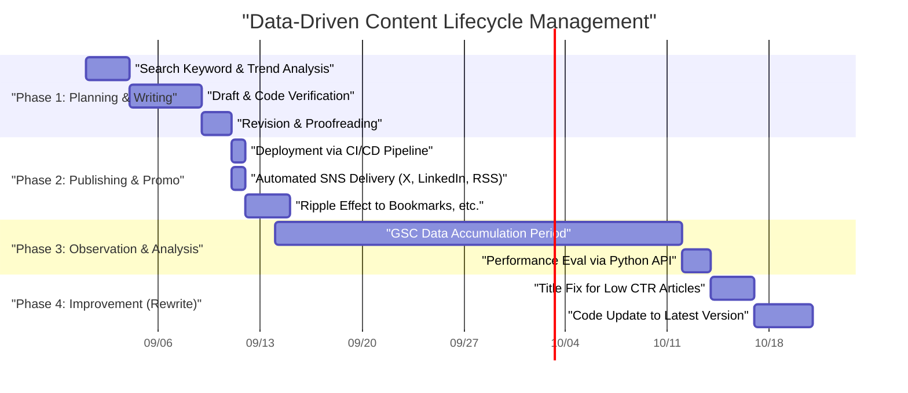
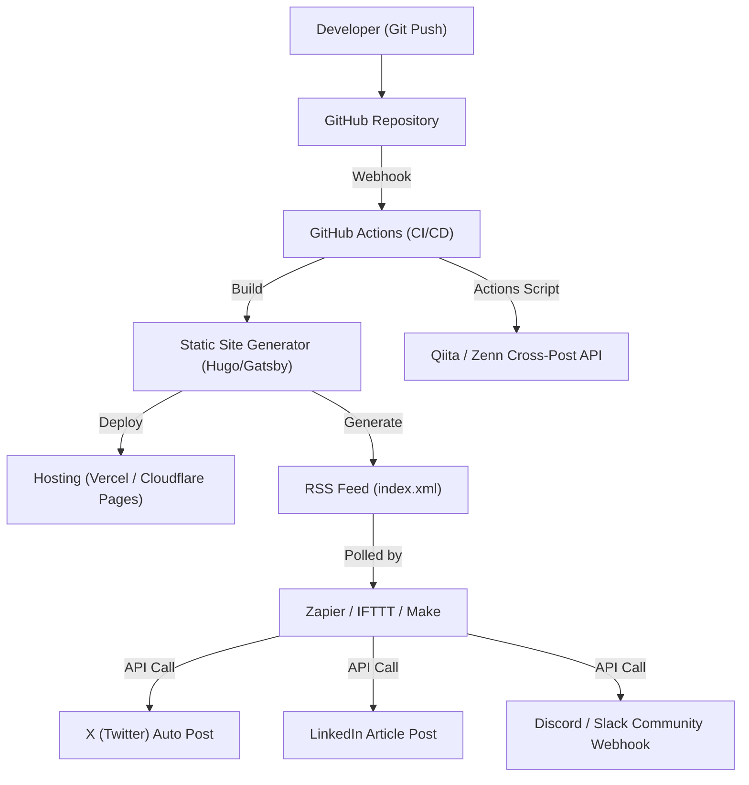

## Introduction: Tech Blog Growth Hacking Only Engineers Can Do

Many software engineers start tech blogs, but few manage to gather a consistent number of views and maintain or expand them over a long period. Writing high-quality technical articles is a prerequisite, but the era of "write a good article and it will naturally be read" is long gone. Today's search engine algorithms have become complex, and the flow of information on SNS is faster than ever.

However, engineers have an advantage that other professions do not. That is the ability to "understand system architecture, combine tools for automation, and analyze data programmatically." In this article, going beyond simple writing techniques, we will treat a tech blog as a single "product" and explain in extreme and practical detail the strategies to dramatically increase monthly traffic using the power of engineering.

---

## 1. SEO Architecture for Engineer Tech Blogs

The foundational system of a blog (such as a static site generator) and the structure of its HTML are the most critical factors for search engines to interpret content correctly.

### 1.1 Core Web Vitals Optimization

Google has adopted page experience as a ranking factor, and **Core Web Vitals (LCP, FID/INP, CLS)** cannot be ignored, even for tech blogs.
Tech blogs heavily use large amounts of source code blocks, mathematical formulas (MathJax / KaTeX), and explanatory diagrams. These are factors that delay page rendering.

- **LCP (Largest Contentful Paint)**: The loading speed of the main content above the fold. Use WebP or AVIF for the eye-catch image and add the `fetchpriority="high"` attribute to preload it. Also, huge CSS and JS files for syntax highlighting should be loaded asynchronously or designed to load only on pages where they are needed.
- **CLS (Cumulative Layout Shift)**: Layout shifts during page loading. By securing the display area for formulas and images in advance using CSS properties like `aspect-ratio`, you can prevent layout jank when the DOM is inserted later.
- **INP (Interaction to Next Paint)**: Responsiveness to user interactions. Heavy JavaScript (such as dynamic full-text search on the client side or executing a massive Markdown parser) must not be executed on the main thread; it is essential to offload it to a Web Worker or generate it as static HTML (SSG) during the build process.

### 1.2 Implementation of Structured Data (JSON-LD)

To explicitly tell search engines that the page is an "article" and "who" the author is, implement structured data in JSON-LD format. By utilizing schemas such as `TechArticle` or `SoftwareSourceCode`, your content is more likely to appear in Google's Rich Results, improving the CTR (Click-Through Rate).

```html
<script type="application/ld+json">
{
  "@context": "https://schema.org",
  "@type": "TechArticle",
  "headline": "What Engineers Should Do to Grow Monthly Traffic on a Tech Blog",
  "image": [
    "https://example.com/img/eyecatch.jpg"
  ],
  "datePublished": "2026-09-14T10:00:00+09:00",
  "author": {
    "@type": "Person",
    "name": "Kenji",
    "url": "https://example.com/about/"
  },
  "publisher": {
    "@type": "Organization",
    "name": "Kenji's Tech Blog",
    "logo": {
      "@type": "ImageObject",
      "url": "https://example.com/img/logo.png"
    }
  }
}
</script>
```

### 1.3 Semantic HTML and Document Structure Optimization

Proper nesting of headings (`h1` to `h6`) is fundamental, but tech blogs require accurate use of HTML5 semantic tags like `article`, `section`, `aside`, and `nav`. Also, appropriately distinguishing `<code>` and `<pre>` for source code, `<kbd>` for keyboard inputs, and `<var>` for variables provides machine-readable HTML. This is also a highly effective measure for AI content indexing (LLM training data collection and RAG systems).

---

## 2. The Psychology of Search Intent and Keyword Strategy

To maximize incoming traffic from search engines (organic traffic), you need to accurately decipher the search intent—"why did the user search for that keyword?" Search intent in the tech field can be broadly classified into two types.

### 2.1 "Troubleshooting Type" vs. "Systematic Learning & Review Type"

1. **Troubleshooting Intent**
   - Example search keywords: `Docker "no space left on device" solution`, `Python IndexError list index out of range cause`
   - Psychology: Blocked by an error during development, looking for a quick fix command or code snippet right now.
   - Strategy: Present the "conclusion (code or command to solve the issue)" at the very beginning of the article (above the fold). Place the background and detailed mechanism explanations after that, first satisfying the user's desire to "fix it immediately." This helps reduce the bounce rate.

2. **Systematic Learning & Review Intent**
   - Example search keywords: `React vs Vue 2026 comparison`, `Rust asynchronous processing tutorial`, `GCP network architecture design`
   - Psychology: Wants to select a new tech stack or deepen their understanding from the basics, and is ready to take time to read.
   - Strategy: Enrich the Table of Contents (TOC) and heavily use diagrams and architecture charts (Mermaid, etc.). Objectively compare pros and cons and include use cases of how it can be applied in actual work, which can increase time spent on the page.

### 2.2 Exponential Decay Model of Traffic and Long-Tail Strategy

Traffic for technical articles tends to form a spike (surge) right after publication due to buzz on SNS, etc., and then decreases exponentially. This traffic $V(t)$ can be approximated by the following mathematical model:

$$ V(t) = V_0 e^{-\lambda t} + C $$

Where:
- $V(t)$: Traffic volume at time $t$
- $V_0$: Initial traffic spike volume due to SNS buzz immediately after publication
- $\lambda$: Decay constant associated with content obsolescence and forgetting on SNS (depends on the speed of technological trend changes)
- $C$: Stable organic search inflow from search engines (baseline traffic)

The key to growing traffic over the long term is not to aim for a temporary buzz ($V_0$), but **how to make the constant term $C$ (sustained inflow from search engines) as large as possible**. By covering a massive amount of "long-tail keywords"—such as specific niche errors or integration methods between specific tools—that have low search volume but no competition, you can grow the total sum of $C$ into something enormous.

---

## 3. Data-Driven Content Analysis Using Google Search Console API

To build a stable traffic foundation $C$, it is necessary to utilize Google Search Console (GSC) data to objectively analyze "how Google evaluates your site." However, clicking around the GSC Web UI has its limits. If you are an engineer, automate the analysis using the GSC API and Python.

### 3.1 Automation Approach with GSC API and Python

Create a script that automatically detects "wasteful articles" where the search ranking drops over time (Decaying Content), or where impressions are high but the Click-Through Rate (CTR) is abnormally low.
This uses `google-api-python-client` and `pandas`.

### 3.2 Python Implementation Code: Auto-Extracting Content with Decreased CTR

Below is an example of a script that fetches search performance data for the past 30 days from the API and extracts a "recommended list of keywords and article URLs with great room for improvement in title or description" where impressions are 1000 or more and CTR is 2% or less.

```python
import pandas as pd
from google.oauth2 import service_account
from googleapiclient.discovery import build
import datetime

# 1. Authentication and API service construction
KEY_FILE_LOCATION = 'path/to/your-service-account-key.json'
SCOPES = ['https://www.googleapis.com/auth/webmasters.readonly']
SITE_URL = 'https://your-tech-blog.com/'

credentials = service_account.Credentials.from_service_account_file(
    KEY_FILE_LOCATION, scopes=SCOPES)
webmasters_service = build('searchconsole', 'v1', credentials=credentials)

# 2. Calculation of request period (past 30 days)
today = datetime.date.today()
end_date = (today - datetime.timedelta(days=2)).strftime('%Y-%m-%d')
start_date = (today - datetime.timedelta(days=32)).strftime('%Y-%m-%d')

# 3. Execution of API request
request = {
    'startDate': start_date,
    'endDate': end_date,
    'dimensions': ['query', 'page'],
    'rowLimit': 5000
}

response = webmasters_service.searchanalytics().query(
    siteUrl=SITE_URL, body=request).execute()

# 4. Data processing and filtering using Pandas DataFrame
if 'rows' in response:
    rows = response['rows']
    data = []
    for row in rows:
        data.append({
            'Query': row['keys'][0],
            'URL': row['keys'][1],
            'Clicks': row['clicks'],
            'Impressions': row['impressions'],
            'CTR': row['ctr'],
            'Position': row['position']
        })
    
    df = pd.DataFrame(data)
    
    # Filtering condition: Impressions >= 1000 & CTR < 2%
    target_df = df[(df['Impressions'] >= 1000) & (df['CTR'] < 0.02)]
    
    # Sort in ascending order by position (prioritize high ranking but unclicked)
    target_df = target_df.sort_values(by='Position', ascending=True)
    
    print("[Recommended List for Title/Meta Description Improvement]")
    print(target_df.head(10))
    
    # Export to CSV if necessary, etc.
    # target_df.to_csv('improve_candidates.csv', index=False)
else:
    print("No data found.")
```

By running this script as a cron job or a GitHub Actions scheduled job, you can continuously make data-driven decisions on "which article titles to rewrite." It's important to rely on data rather than intuition for continuous improvement (Continuous Content Improvement).

---

## 4. Article Lifecycle Management and Rewrite Strategy

Publishing a technical article is not the end. As technology evolves (framework version updates, API deprecations, etc.), content quickly becomes obsolete. Continuing to provide outdated information not only damages the blog's credibility but also negatively affects SEO.

### 4.1 Content Lifecycle Management (Gantt Chart)

The ideal content operation lifecycle is shown in a Mermaid Gantt chart.



Treating article creation like a software development project and incorporating the post-release operation/maintenance (rewrite) phase into your plan is the secret to maintaining and improving traffic.

### 4.2 Mathematical Model of Content Creation ROI (Return on Investment)

Since engineers spend valuable time writing articles, they should be aware of the Return on Investment (ROI).
The ROI for a blog can be formulated as follows:

$$ ROI = \frac{\sum_{t=1}^{T} \left( Rev_{ad}(t) + Val_{brand}(t) + Val_{skill}(t) \right) - Cost_{time}}{\text{Cost}_{time}} \times 100 \ (\%) $$

- $T$: Effective lifespan of the article (time until it becomes obsolete)
- $Rev_{ad}(t)$: Direct revenue from ad earnings, affiliate revenue, and sponsorships
- $Val_{brand}(t)$: Monetary equivalent of the positive impact on career due to demonstrating technical skills (e.g., increased offer amount when changing jobs, speaking requests)
- $Val_{skill}(t)$: Value of personal skill improvement through learning and research done to write the article
- $Cost_{time}$: Time spent writing the article, creating diagrams, and verifying code (converted to personal hourly rate)

The great thing about tech blogs is that even if $Rev_{ad}$ is small, $Val_{brand}$ and $Val_{skill}$ tend to be extremely large. In particular, high-quality technical explanations serve directly as a portfolio, wielding immense power in job hunting or securing side jobs.

---

## 5. Distribution via GitHub Actions and External Automation Tool Integration

After creating content, the challenge becomes how to efficiently deliver it to the target audience (distribution). Manually posting links to each SNS every time is inefficient and un-engineer-like.

### 5.1 Social Media Sharing Automation Architecture

We will build an architecture that fully automates everything from building, deploying, and notifying multiple platforms the moment a Markdown file is merged into the main branch of a GitHub repository.



### 5.2 Key Points for Building an Automation Pipeline

1. **Build and Deploy with GitHub Actions**
   If using a static site generator, automate the HTML generation and deployment to the hosting provider (Vercel, Netlify, Cloudflare Pages, etc.) using GitHub Actions. At this time, it is also effective to incorporate an image optimization process (such as auto-conversion to WebP) into the build pipeline as a Core Web Vitals countermeasure mentioned earlier.

2. **SNS Integration with RSS Triggers Using Zapier/IFTTT**
   The site generator creates the latest RSS feed (XML) during the build. Feed this into an iPaaS like Zapier or Make (formerly Integromat) to build a workflow such as "When a new item is added to RSS, post the title and URL to X (Twitter) and LinkedIn." With this, notifications to followers are automatically sent the moment an article is published.

3. **Cross-Posting to Qiita/Zenn (Using Canonical Tags)**
   While the domain authority of your company or personal blog is still weak, borrowing the visitor attraction power of technical platforms like Qiita or Zenn is one strategy. However, simple copy-pasting carries the risk of SEO penalties for duplicate content.
   This issue can be resolved by setting a **Canonical tag** in the metadata of the Qiita or Zenn article, pointing to the original article URL on your own blog. By writing a script that hits various platform APIs from GitHub Actions to automatically generate articles from Markdown, you can fully automate multi-channel delivery.

---

## Conclusion: Turning the Cycle of Continuous Improvement

To dramatically increase monthly traffic on a tech blog, the engineering approaches introduced this time are indispensable in addition to the act of "writing."

1. Building a robust HTML and site architecture with SEO in mind
2. Article design that understands the user's search intent (troubleshooting vs. systematic learning)
3. Data analysis utilizing the Google Search Console API and Python
4. Content lifecycle management and rewriting with ROI in mind
5. Complete automation of distribution through CI/CD and Zapier integration

If you can assemble these as a system, your tech blog will become the strongest asset to powerfully boost your own career. Engineers struggling with stagnant traffic should definitely start "blog growth hacking" today. The programming skills and architecture design abilities cultivated in development work will undoubtedly be your greatest weapons in blog management as well.
