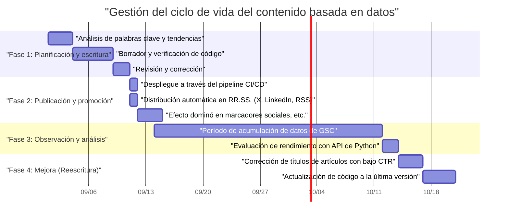
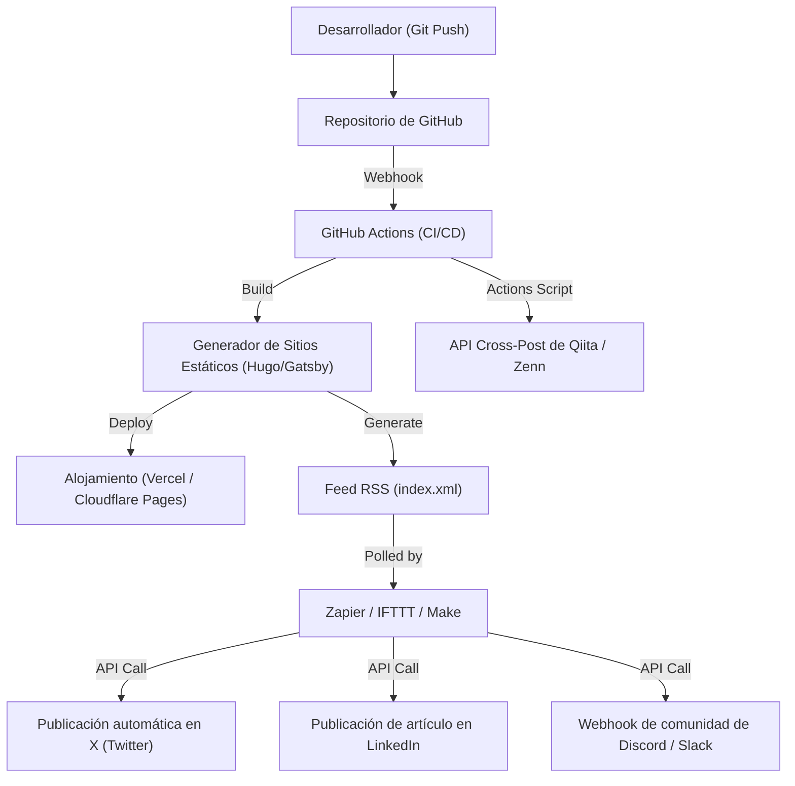

## Introducción: Growth hacking para blogs técnicos que solo los ingenieros pueden hacer

Muchos ingenieros de software abren blogs técnicos, pero no hay muchos casos en los que logren atraer una cierta cantidad de tráfico y mantenerlo/expandirlo a largo plazo. Escribir artículos técnicos de alta calidad es un requisito previo, pero la era de "si escribes buenos artículos, serán leídos naturalmente" ya ha terminado. Los algoritmos de los motores de búsqueda actuales se han vuelto complejos y, además, el flujo de información en las redes sociales es más rápido que nunca.

Sin embargo, los ingenieros tienen fortalezas que otras profesiones no tienen. Estas radican en su capacidad para "comprender la arquitectura de los sistemas, combinar herramientas para automatizar y analizar datos mediante programación". En este artículo, no nos limitaremos a simples técnicas de escritura, sino que trataremos el blog técnico como un "producto", y explicaremos de manera extremadamente detallada y práctica las estrategias para aumentar drásticamente el tráfico mensual utilizando el poder de la ingeniería.

---

## 1. Arquitectura SEO de blogs técnicos para ingenieros

El sistema fundamental del blog (como los generadores de sitios estáticos) y la estructura HTML son los elementos más importantes para que los motores de búsqueda interpreten correctamente el contenido.

### 1.1 Optimización de los Core Web Vitals

Google ha adoptado la experiencia de la página como factor de clasificación, y en especial los **Core Web Vitals (LCP, FID/INP, CLS)** no pueden ignorarse, incluso en un blog técnico.
En los blogs técnicos, se utilizan en gran medida bloques masivos de código fuente, fórmulas matemáticas (MathJax / KaTeX) y diagramas. Estos factores retrasan la renderización de la página.

- **LCP (Largest Contentful Paint)**: Velocidad de carga del contenido principal de la primera vista. Use WebP o AVIF para la imagen destacada y precárguela asignando el atributo `fetchpriority="high"`. Además, cargue de forma asíncrona CSS o JS masivos para resaltar la sintaxis, o diséñelos para que se carguen solo en las páginas necesarias.
- **CLS (Cumulative Layout Shift)**: Desplazamiento del diseño durante la carga del artículo. Al asegurar con anticipación el área de visualización de fórmulas matemáticas o imágenes con atributos CSS como `aspect-ratio`, evitará saltos bruscos cuando el DOM se inserte más tarde.
- **INP (Interaction to Next Paint)**: Capacidad de respuesta a la interacción del usuario. Es esencial no ejecutar JavaScript pesado (por ejemplo, búsquedas dinámicas de texto completo en el lado del cliente o la ejecución de analizadores masivos de Markdown) en el hilo principal; trasládelo a un Web Worker o genérelo como HTML estático (SSG) durante la compilación.

### 1.2 Implementación de datos estructurados (JSON-LD)

Para informar explícitamente a los motores de búsqueda que la página es un "artículo" y "quién" es el autor, implemente datos estructurados en formato JSON-LD. Al usar esquemas como `TechArticle` o `SoftwareSourceCode`, es más probable que aparezca en los resultados enriquecidos de Google, lo que mejorará su CTR (Click-Through Rate).

```html
<script type="application/ld+json">
{
  "@context": "https://schema.org",
  "@type": "TechArticle",
  "headline": "Qué deben hacer los ingenieros para aumentar el tráfico mensual en su blog técnico",
  "image": [
    "https://example.com/img/eyecatch.jpg"
  ],
  "datePublished": "2026-09-14T10:00:00+09:00",
  "author": {
    "@type": "Person",
    "name": "Kenji",
    "url": "https://example.com/about/"
  },
  "publisher": {
    "@type": "Organization",
    "name": "Kenji's Tech Blog",
    "logo": {
      "@type": "ImageObject",
      "url": "https://example.com/img/logo.png"
    }
  }
}
</script>
```

### 1.3 HTML semántico y optimización de la estructura del documento

El anidamiento adecuado de los encabezados (`h1` a `h6`) es fundamental, pero en un blog técnico se requiere el uso preciso de etiquetas semánticas de HTML5 como `article`, `section`, `aside` y `nav`. Además, al utilizar correctamente `<code>` y `<pre>` para el código fuente, `<kbd>` para la entrada del teclado, y `<var>` para variables, podrá proporcionar un HTML legible por máquinas. Esta es también una medida muy eficaz para la indexación de contenido por IA (recopilación de datos de entrenamiento LLM o sistemas RAG).

---

## 2. La psicología de la intención de búsqueda (Search Intent) y estrategias de palabras clave

Para maximizar el flujo desde los motores de búsqueda (tráfico orgánico), es necesario interpretar con precisión la intención de búsqueda, es decir, "por qué el usuario buscó esa palabra clave". La intención de búsqueda en temas técnicos se puede clasificar principalmente en dos categorías.

### 2.1 "Tipo resolución de errores" y "Tipo aprendizaje sistemático / revisión"

1. **Tipo resolución de errores (Troubleshooting Intent)**
   - Ejemplos de palabras clave de búsqueda: `Solución Docker "no space left on device"`, `Causa Python IndexError list index out of range`
   - Psicología: Están bloqueados por un error durante el desarrollo y buscan comandos o fragmentos de código que actúen como un remedio inmediato.
   - Estrategia: Presente la "conclusión (códigos o comandos para resolverlo)" al comienzo del artículo (primera vista). El trasfondo y la explicación detallada de los mecanismos se colocarán detrás de esto, satisfaciendo primero el deseo del usuario de "arreglarlo ahora mismo". Esto puede reducir la tasa de rebote (bounce rate).

2. **Tipo aprendizaje sistemático / revisión (Learning & Review Intent)**
   - Ejemplos de palabras clave de búsqueda: `Comparación React vs Vue 2026`, `Introducción al procesamiento asíncrono en Rust`, `Diseño de arquitectura de red GCP`
   - Psicología: Quieren seleccionar un nuevo conjunto de tecnologías o profundizar su comprensión desde lo básico, y están preparados para tomarse el tiempo de leer.
   - Estrategia: Enriquezca la tabla de contenidos (TOC) y utilice abundantes diagramas de arquitectura o ilustraciones (Mermaid, etc.). Al comparar objetivamente las ventajas y desventajas e incluir casos de uso sobre cómo aplicarlo en el trabajo real, puede aumentar el tiempo de permanencia.

### 2.2 Modelo de decaimiento exponencial del tráfico y estrategia de cola larga (Long Tail)

El tráfico de los artículos técnicos tiende a formar picos (aumentos rápidos) al hacerse virales en redes sociales inmediatamente después de su publicación, y luego disminuir exponencialmente. Este tráfico $V(t)$ se puede aproximar con el siguiente modelo matemático.

$$ V(t) = V_0 e^{-\lambda t} + C $$

Donde:
- $V(t)$: Volumen de tráfico en el tiempo $t$
- $V_0$: Pico de tráfico inicial debido a la viralidad en redes sociales, etc., justo después de la publicación
- $\lambda$: Constante de decaimiento debido a la obsolescencia del contenido u olvido en las redes sociales (dependiente de la velocidad de los cambios en las tendencias tecnológicas)
- $C$: Flujo constante de búsqueda orgánica desde los motores de búsqueda (tráfico base)

La clave para aumentar el acceso a largo plazo es, más que apuntar a una viralidad temporal ($V_0$), **cómo maximizar el término constante $C$ (flujo sostenido desde los motores de búsqueda)**. Al cubrir masivamente "palabras clave de cola larga" (long tail keywords) que no tienen competidores aunque su volumen de búsqueda sea bajo, como errores específicos de nicho o cómo conectar herramientas específicas entre sí, desarrollaremos la suma total de $C$ hasta que sea enorme.

---

## 3. Análisis de contenido basado en datos utilizando la API de Google Search Console

Para construir una base de tráfico estable $C$, es necesario utilizar datos de Google Search Console (GSC) y analizar objetivamente "cómo está siendo evaluado por Google". Sin embargo, hay límites al operar GSC haciendo clics en su interfaz web. Como ingenieros, automaticemos el análisis usando la API de GSC y Python.

### 3.1 Enfoque de automatización con la API de GSC y Python

Crearemos un script que detecte automáticamente "artículos desperdiciados" donde el ranking de búsqueda de un artículo específico cae con el tiempo (Decaying Content), o donde las impresiones son altas pero el CTR (tasa de clics) es inusualmente bajo.
Para esto usaremos `google-api-python-client` y `pandas`.

### 3.2 Código de implementación en Python: Extracción automática de contenido con caída de CTR

El siguiente es un ejemplo de script que obtiene datos de rendimiento de búsqueda de los últimos 30 días a través de la API, y extrae "palabras clave y URLs de artículos con gran margen de mejora en el título o descripción" que tienen 1000 o más impresiones y un CTR menor al 2%.

```python
import pandas as pd
from google.oauth2 import service_account
from googleapiclient.discovery import build
import datetime

# 1. Autenticación y construcción del servicio API
KEY_FILE_LOCATION = 'path/to/your-service-account-key.json'
SCOPES = ['https://www.googleapis.com/auth/webmasters.readonly']
SITE_URL = 'https://your-tech-blog.com/'

credentials = service_account.Credentials.from_service_account_file(
    KEY_FILE_LOCATION, scopes=SCOPES)
webmasters_service = build('searchconsole', 'v1', credentials=credentials)

# 2. Cálculo del período de la solicitud (últimos 30 días)
today = datetime.date.today()
end_date = (today - datetime.timedelta(days=2)).strftime('%Y-%m-%d')
start_date = (today - datetime.timedelta(days=32)).strftime('%Y-%m-%d')

# 3. Ejecución de la solicitud a la API
request = {
    'startDate': start_date,
    'endDate': end_date,
    'dimensions': ['query', 'page'],
    'rowLimit': 5000
}

response = webmasters_service.searchanalytics().query(
    siteUrl=SITE_URL, body=request).execute()

# 4. Procesamiento y filtrado de datos usando Pandas DataFrame
if 'rows' in response:
    rows = response['rows']
    data = []
    for row in rows:
        data.append({
            'Query': row['keys'][0],
            'URL': row['keys'][1],
            'Clicks': row['clicks'],
            'Impressions': row['impressions'],
            'CTR': row['ctr'],
            'Position': row['position']
        })
    
    df = pd.DataFrame(data)
    
    # Condiciones de filtrado: 1000 o más impresiones y CTR menor al 2%
    target_df = df[(df['Impressions'] >= 1000) & (df['CTR'] < 0.02)]
    
    # Ordenar por posición ascendente (priorizar aquellos con alta posición pero no cliqueados)
    target_df = target_df.sort_values(by='Position', ascending=True)
    
    print("【Lista de recomendaciones para mejorar títulos/meta descripciones】")
    print(target_df.head(10))
    
    # Salida a CSV si es necesario, etc.
    # target_df.to_csv('improve_candidates.csv', index=False)
else:
    print("No se encontraron datos.")
```

Al ejecutar este script periódicamente a través de un cron o un job de GitHub Actions, siempre podrá decidir basado en datos "qué título de artículo debe reescribirse". En lugar de depender de la intuición, la mejora continua basada en datos (Mejora Continua de Contenido en lugar de CI/CD) es importante.

---

## 4. Gestión del ciclo de vida de los artículos y estrategias de reescritura

Un artículo técnico no termina cuando se publica. A medida que la tecnología evoluciona (actualizaciones de versiones de frameworks, obsolescencia de API, etc.), el contenido se vuelve anticuado rápidamente. Seguir proporcionando información desactualizada no solo daña la credibilidad de su blog, sino que también resulta en una calificación negativa desde el punto de vista del SEO.

### 4.1 Gestión del ciclo de vida del contenido (Diagrama de Gantt)

A continuación se muestra el ciclo de vida de operación de contenido ideal utilizando un diagrama de Gantt de Mermaid.



Este tipo de enfoque, tratando la creación de artículos como un proyecto de desarrollo de software e incorporando la fase de operación y mantenimiento (reescritura) posterior al lanzamiento en su planificación, es el secreto para mantener y mejorar el tráfico.

### 4.2 Modelo matemático del retorno de inversión (ROI) de la creación de contenido

Dado que los ingenieros dedican su valioso tiempo a escribir artículos, deben ser conscientes de su retorno de inversión (ROI).
El ROI en un blog se puede formular de la siguiente manera.

$$ ROI = \frac{\sum_{t=1}^{T} \left( Rev_{ad}(t) + Val_{brand}(t) + Val_{skill}(t) \right) - Cost_{time}}{\text{Cost}_{time}} \times 100 \ (\%) $$

- $T$: Vida útil del artículo (tiempo hasta la obsolescencia)
- $Rev_{ad}(t)$: Ingresos directos de publicidad, afiliaciones o patrocinios
- $Val_{brand}(t)$: Valor monetario equivalente al impacto positivo en su carrera por demostrar habilidades técnicas (aumento en ofertas de trabajo, solicitudes de conferencias, etc.)
- $Val_{skill}(t)$: Valor del incremento de sus propias habilidades a través del aprendizaje e investigación necesarios para escribir el artículo
- $Cost_{time}$: Tiempo dedicado a escribir el artículo, crear diagramas y verificar código (equivalente a su tarifa por hora)

Lo grandioso de los blogs técnicos es que, incluso si $Rev_{ad}$ es pequeño, $Val_{brand}$ y $Val_{skill}$ tienden a ser extremadamente grandes. En particular, las explicaciones técnicas de alta calidad se convierten directamente en su portafolio y tienen un inmenso poder en la búsqueda de empleo o trabajos secundarios.

---

## 5. Distribución mediante GitHub Actions y la integración de herramientas de automatización externas

Una vez creado el contenido, el desafío es cómo entregarlo eficientemente a su público objetivo (distribución). Publicar enlaces manualmente en cada red social cada vez es ineficiente y no es digno de un ingeniero.

### 5.1 Arquitectura de automatización de intercambio en redes sociales

Construiremos una arquitectura totalmente automatizada desde el momento en que se fusiona el archivo Markdown a la rama main del repositorio de GitHub, abarcando la compilación, despliegue y notificaciones en múltiples plataformas.



### 5.2 Puntos clave en la construcción de pipelines de automatización

1. **Compilación y despliegue usando GitHub Actions**
   Si utiliza un generador de sitios estáticos, automatice la generación de HTML y el despliegue al destino de alojamiento (Vercel, Netlify, Cloudflare Pages, etc.) utilizando GitHub Actions. En este punto, también es eficaz integrar procesos de optimización de imágenes (como la conversión automática a WebP) en su pipeline de compilación como medida para los Core Web Vitals mencionados anteriormente.

2. **Integración en redes sociales disparada por RSS utilizando Zapier/IFTTT**
   El generador de sitios genera el último feed RSS (XML) durante la compilación. Haga que una plataforma iPaaS como Zapier o Make (antes Integromat) lea esto para crear un flujo de trabajo: "Cuando se agregue un nuevo elemento al RSS, publicar el título y la URL en X (Twitter) y LinkedIn". Esto permite notificaciones automáticas a sus seguidores en el momento en que publica un artículo.

3. **Publicación cruzada (Cross-post) en plataformas técnicas como Qiita/Zenn (uso de etiquetas Canonical)**
   Mientras el poder de dominio de su propio blog corporativo o personal sea débil, es una buena estrategia aprovechar el poder de atracción de clientes de plataformas técnicas como Qiita o Zenn. Sin embargo, el simple copiar y pegar conlleva el riesgo de recibir una penalización de SEO por contenido duplicado.
   Este problema se puede resolver estableciendo la **etiqueta Canonical** en los metadatos de los artículos en Qiita o Zenn, apuntando a la URL del artículo original en su propio blog. Al crear un script que llame a las APIs de las distintas plataformas desde GitHub Actions para generar artículos automáticamente desde Markdown, podrá automatizar completamente la distribución multicanal.

---

## Conclusión: Girar el ciclo de mejora continua

Para aumentar drásticamente el tráfico mensual de un blog técnico, además del acto de "escribir", el enfoque de ingeniería presentado esta vez es indispensable.

1. Construcción de una arquitectura de sitio y HTML robusta teniendo en cuenta el SEO
2. Diseño de artículos que comprenda la intención de búsqueda del usuario (resolución de errores vs aprendizaje sistemático)
3. Análisis de datos aprovechando la API de Google Search Console y Python
4. Gestión del ciclo de vida del contenido y reescritura considerando el ROI
5. Automatización total de la distribución mediante integración con CI/CD y Zapier

Si logra integrar todo esto como un sistema, su blog técnico se convertirá en el activo (asset) más poderoso para impulsar fuertemente su propia carrera. A los ingenieros que sufren por el estancamiento del tráfico, les instamos a que comiencen hoy el "growth hacking para su blog". Las habilidades de programación y diseño de arquitectura que han cultivado en sus tareas de desarrollo serán, sin duda, su mejor arma en la gestión de su blog.
