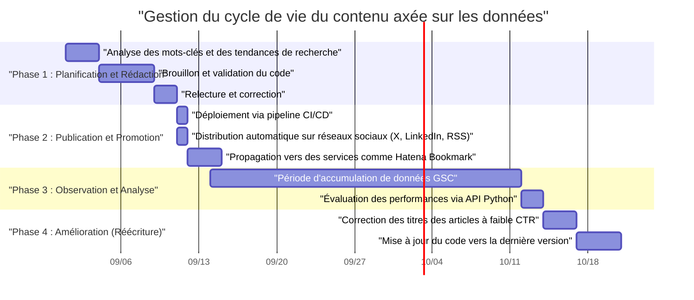
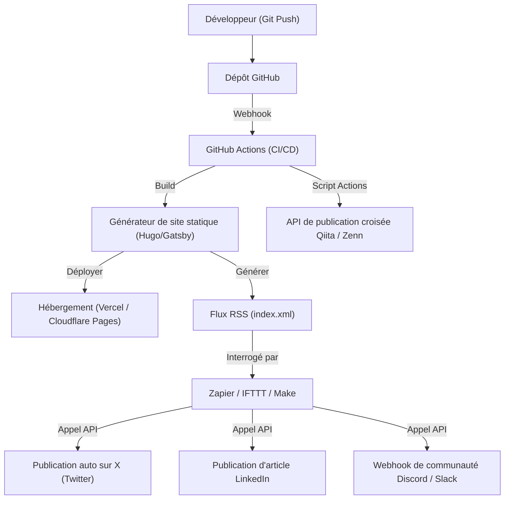

## Introduction : Le Growth Hacking des blogs techniques, une compétence propre aux ingénieurs

Beaucoup d'ingénieurs logiciels lancent un blog technique, mais rares sont ceux qui parviennent à attirer un certain niveau de trafic et à le maintenir ou l'augmenter sur le long terme. Rédiger des articles techniques de haute qualité est une condition préalable, mais l'époque où « écrire de bons articles suffisait pour être lu naturellement » est bel et bien révolue. Les algorithmes actuels des moteurs de recherche sont devenus complexes, et le flux d'informations sur les réseaux sociaux est plus rapide que jamais.

Cependant, les ingénieurs possèdent des atouts que d'autres professions n'ont pas. Ils sont capables de « comprendre l'architecture des systèmes, de combiner des outils pour automatiser des processus, et d'analyser des données via la programmation ». Dans cet article, au lieu de nous limiter à de simples techniques de rédaction, nous considérerons le blog technique comme un véritable « produit » et expliquerons de manière très détaillée et pratique les stratégies permettant d'augmenter drastiquement le trafic mensuel grâce au pouvoir de l'ingénierie.

---

## 1. Architecture SEO pour les blogs techniques à l'attention des ingénieurs

Le système de base du blog (comme les générateurs de sites statiques) et la structure HTML sont les éléments les plus cruciaux pour que les moteurs de recherche puissent interpréter correctement le contenu.

### 1.1 Optimisation des Signaux Web Essentiels (Core Web Vitals)

Google utilise l'expérience sur la page comme facteur de classement, et les **Signaux Web Essentiels (LCP, FID/INP, CLS)** ne peuvent être ignorés, même pour un blog technique.
Les blogs techniques utilisent souvent de nombreux blocs de code source, des formules mathématiques (MathJax / KaTeX) et des illustrations. Ces éléments ont tendance à retarder le rendu de la page.

- **LCP (Largest Contentful Paint)** : Vitesse de chargement du contenu principal dans la ligne de flottaison. Utilisez le WebP ou l'AVIF pour les images à la une, et préchargez-les en ajoutant l'attribut `fetchpriority="high"`. De plus, les gros fichiers CSS ou JS pour la coloration syntaxique doivent être chargés de manière asynchrone ou conçus pour n'être chargés que sur les pages nécessaires.
- **CLS (Cumulative Layout Shift)** : Décalage inattendu de la mise en page pendant le chargement de l'article. En réservant à l'avance l'espace d'affichage pour les formules et les images à l'aide de la propriété CSS `aspect-ratio`, etc., vous évitez les sauts visuels lors de l'insertion ultérieure de nœuds DOM.
- **INP (Interaction to Next Paint)** : Réactivité aux interactions de l'utilisateur. Il est impératif de ne pas exécuter de JavaScript lourd (par exemple, une recherche plein texte dynamique côté client ou l'exécution d'un énorme parseur Markdown) sur le thread principal. Il faut le déléguer à un Web Worker ou générer du HTML statique lors du build (SSG).

### 1.2 Implémentation des données structurées (JSON-LD)

Afin d'indiquer explicitement aux moteurs de recherche que la page est un « article » et qui en est « l'auteur », implémentez des données structurées au format JSON-LD. L'utilisation de schémas tels que `TechArticle` ou `SoftwareSourceCode` augmente la probabilité d'apparaître dans les résultats enrichis de Google, ce qui améliore le CTR (taux de clics).

```html
<script type="application/ld+json">
{
  "@context": "https://schema.org",
  "@type": "TechArticle",
  "headline": "Ce que les ingénieurs doivent faire pour augmenter le trafic mensuel de leur blog technique",
  "image": [
    "https://example.com/img/eyecatch.jpg"
  ],
  "datePublished": "2026-09-14T10:00:00+09:00",
  "author": {
    "@type": "Person",
    "name": "Kenji",
    "url": "https://example.com/about/"
  },
  "publisher": {
    "@type": "Organization",
    "name": "Kenji's Tech Blog",
    "logo": {
      "@type": "ImageObject",
      "url": "https://example.com/img/logo.png"
    }
  }
}
</script>
```

### 1.3 HTML sémantique et optimisation de la structure du document

L'imbrication correcte des balises d'en-tête (`h1` à `h6`) est fondamentale, mais un blog technique exige également l'utilisation précise des balises sémantiques HTML5 telles que `article`, `section`, `aside` et `nav`. De plus, l'utilisation appropriée des balises `<code>` et `<pre>` pour le code source, `<kbd>` pour les entrées clavier, et `<var>` pour les variables permet de fournir un HTML lisible par les machines. Il s'agit également d'une méthode très efficace pour l'indexation de contenu par l'IA (collecte de données d'apprentissage pour les LLM et systèmes RAG).

---

## 2. Psychologie de l'intention de recherche et stratégie de mots-clés

Pour maximiser le trafic en provenance des moteurs de recherche (trafic organique), il est nécessaire de déchiffrer avec précision l'intention de recherche de l'utilisateur, c'est-à-dire « pourquoi il a cherché ce mot-clé ». Les intentions de recherche dans le domaine technique peuvent être classées en deux grandes catégories.

### 2.1 Type « Résolution d'erreur » et Type « Apprentissage systématique / Revue »

1. **Type Résolution d'erreur (Troubleshooting Intent)**
   - Exemples de mots-clés : `Docker "no space left on device" solution`, `Python IndexError list index out of range cause`
   - Psychologie : Bloqué par une erreur lors du développement, l'utilisateur cherche un remède immédiat sous forme de commande ou d'extrait de code.
   - Stratégie : Présentez la « conclusion (code ou commande pour résoudre le problème) » dès le début de l'article (dans la ligne de flottaison). Placez le contexte et les explications détaillées des mécanismes plus bas, afin de satisfaire immédiatement le désir de l'utilisateur de « réparer tout de suite ». Cela permet de réduire le taux de rebond (bounce rate).

2. **Type Apprentissage systématique / Revue (Learning & Review Intent)**
   - Exemples de mots-clés : `React vs Vue 2026 comparaison`, `Rust traitement asynchrone introduction`, `GCP architecture réseau conception`
   - Psychologie : Souhaite sélectionner une nouvelle stack technique ou approfondir sa compréhension depuis les bases, et est prêt à prendre le temps de lire.
   - Stratégie : Enrichissez la table des matières (TOC) et utilisez de nombreux schémas et diagrammes d'architecture (comme Mermaid). Comparez objectivement les avantages et les inconvénients, et incluez des cas d'utilisation pour montrer comment cela s'applique dans la pratique, ce qui augmentera le temps passé sur la page.

### 2.2 Modèle de décroissance exponentielle du trafic et stratégie de longue traîne

Le trafic d'un article technique a tendance à former un pic (augmentation soudaine) immédiatement après sa publication grâce au buzz sur les réseaux sociaux, puis à diminuer de manière exponentielle. Ce trafic $V(t)$ peut être approximé par le modèle mathématique suivant :

$$ V(t) = V_0 e^{-\lambda t} + C $$

Où :
- $V(t)$ : Volume de trafic à l'instant $t$
- $V_0$ : Volume du pic de trafic initial dû au buzz sur les réseaux sociaux juste après la publication
- $\lambda$ : Constante d'atténuation due à l'obsolescence du contenu ou à l'oubli sur les réseaux sociaux (dépend de la vitesse d'évolution des tendances technologiques)
- $C$ : Trafic organique stable provenant des moteurs de recherche (trafic de base)

La clé pour augmenter le trafic sur le long terme ne réside pas dans la recherche d'un buzz temporaire ($V_0$), mais dans **la façon d'augmenter le terme constant $C$ (l'afflux continu provenant des moteurs de recherche)**. En couvrant un grand nombre de « mots-clés de longue traîne » – comme des erreurs spécifiques et de niche ou des méthodes d'intégration entre des outils précis – qui ont un faible volume de recherche mais aucune concurrence, vous ferez croître la somme de $C$ pour en faire un volume colossal.

---

## 3. Analyse de contenu axée sur les données à l'aide de l'API Google Search Console

Afin de construire une base de trafic stable $C$, il est nécessaire d'utiliser les données de la Google Search Console (GSC) et d'analyser objectivement « comment vous êtes évalué par Google ». Cependant, cliquer manuellement sur l'interface web de GSC a ses limites. En tant qu'ingénieur, automatisez l'analyse à l'aide de l'API GSC et de Python.

### 3.1 Approche d'automatisation avec l'API GSC et Python

Nous allons créer un script qui détecte automatiquement la manière dont le classement de recherche d'un article spécifique baisse avec le temps (Decaying Content), ou les « articles gaspillés » qui ont un nombre élevé d'impressions mais un taux de clics (CTR) anormalement bas.
Pour cela, nous utiliserons `google-api-python-client` et `pandas`.

### 3.2 Implémentation en Python : Extraction automatique des contenus à faible CTR

Voici un exemple de script qui récupère les données de performance de recherche des 30 derniers jours via l'API, et extrait les « mots-clés et URL d'articles ayant une grande marge d'amélioration pour le titre ou la description », c'est-à-dire ceux dont le nombre d'impressions est supérieur ou égal à 1000 et le CTR inférieur ou égal à 2 %.

```python
import pandas as pd
from google.oauth2 import service_account
from googleapiclient.discovery import build
import datetime

# 1. Authentification et construction du service API
KEY_FILE_LOCATION = 'path/to/your-service-account-key.json'
SCOPES = ['https://www.googleapis.com/auth/webmasters.readonly']
SITE_URL = 'https://your-tech-blog.com/'

credentials = service_account.Credentials.from_service_account_file(
    KEY_FILE_LOCATION, scopes=SCOPES)
webmasters_service = build('searchconsole', 'v1', credentials=credentials)

# 2. Calcul de la période de requête (30 derniers jours)
today = datetime.date.today()
end_date = (today - datetime.timedelta(days=2)).strftime('%Y-%m-%d')
start_date = (today - datetime.timedelta(days=32)).strftime('%Y-%m-%d')

# 3. Exécution de la requête API
request = {
    'startDate': start_date,
    'endDate': end_date,
    'dimensions': ['query', 'page'],
    'rowLimit': 5000
}

response = webmasters_service.searchanalytics().query(
    siteUrl=SITE_URL, body=request).execute()

# 4. Traitement des données et filtrage avec Pandas DataFrame
if 'rows' in response:
    rows = response['rows']
    data = []
    for row in rows:
        data.append({
            'Query': row['keys'][0],
            'URL': row['keys'][1],
            'Clicks': row['clicks'],
            'Impressions': row['impressions'],
            'CTR': row['ctr'],
            'Position': row['position']
        })
    
    df = pd.DataFrame(data)
    
    # Conditions de filtrage : Impressions >= 1000 & CTR < 2%
    target_df = df[(df['Impressions'] >= 1000) & (df['CTR'] < 0.02)]
    
    # Tri croissant par position (priorité aux classements élevés non cliqués)
    target_df = target_df.sort_values(by='Position', ascending=True)
    
    print("【Liste des recommandations pour améliorer les titres/méta-descriptions】")
    print(target_df.head(10))
    
    # Export CSV si nécessaire
    # target_df.to_csv('improve_candidates.csv', index=False)
else:
    print("Aucune donnée trouvée.")
```

En exécutant ce script via des tâches planifiées avec cron ou GitHub Actions, vous pouvez toujours décider de manière axée sur les données « quels titres d'articles doivent être réécrits ». Au lieu de se fier à l'intuition, une amélioration continue basée sur les données (une sorte de Continuous Content Improvement plutôt que CI/CD) est primordiale.

---

## 4. Gestion du cycle de vie des articles et stratégie de réécriture

Un article technique ne s'arrête pas à sa publication. Avec l'évolution des technologies (mise à jour de frameworks, dépréciation d'API, etc.), le contenu devient obsolète en un clin d'œil. Continuer à fournir des informations obsolètes nuit non seulement à la crédibilité du blog, mais entraîne également une évaluation négative en termes de SEO.

### 4.1 Gestion du cycle de vie du contenu (Diagramme de Gantt)

Nous illustrons le cycle de vie idéal pour la gestion du contenu avec un diagramme de Gantt Mermaid.



Ainsi, traiter la création d'articles comme un projet de développement logiciel à part entière, et intégrer la phase d'exploitation et de maintenance (réécriture) post-publication dans votre planification est le secret pour maintenir et augmenter le trafic.

### 4.2 Modèle mathématique du ROI (retour sur investissement) de la création de contenu

Puisque les ingénieurs consacrent un temps précieux à rédiger des articles, ils doivent être conscients du retour sur investissement (ROI).
Le ROI d'un blog peut être formulé de la manière suivante :

$$ ROI = \frac{\sum_{t=1}^{T} \left( Rev_{ad}(t) + Val_{brand}(t) + Val_{skill}(t) \right) - Cost_{time}}{\text{Cost}_{time}} \times 100 \ (\%) $$

- $T$ : Durée de vie utile de l'article (période avant qu'il ne devienne obsolète)
- $Rev_{ad}(t)$ : Revenus directs issus de la publicité, de l'affiliation ou du sponsoring
- $Val_{brand}(t)$ : Valeur monétaire équivalente de l'impact positif sur la carrière en mettant en avant vos compétences techniques (augmentation des offres salariales lors d'un changement d'emploi, demandes d'intervention, etc.)
- $Val_{skill}(t)$ : Valeur de l'amélioration de vos propres compétences grâce à l'apprentissage et à la recherche effectués pour rédiger l'article
- $Cost_{time}$ : Temps consacré à la rédaction de l'article, à la création des schémas et à la validation du code (converti à votre taux horaire)

Le point fort d'un blog technique est que même si $Rev_{ad}$ est faible, $Val_{brand}$ et $Val_{skill}$ ont tendance à être extrêmement élevés. En particulier, une explication technique de haute qualité devient directement un portfolio, ce qui s'avère redoutablement efficace lors de la recherche d'emploi ou de l'acquisition de missions en freelance.

---

## 5. Distribution via GitHub Actions et l'intégration d'outils d'automatisation externes

Après avoir créé du contenu, le défi est de savoir comment le diffuser efficacement à votre public cible (distribution). Publier manuellement des liens sur chaque réseau social à chaque fois est inefficace et indigne d'un ingénieur.

### 5.1 Architecture d'automatisation du partage sur les réseaux sociaux

Nous allons mettre en place une architecture qui automatise l'intégralité du processus, de la compilation au déploiement, en passant par la notification sur de multiples plateformes, dès l'instant où un fichier Markdown est fusionné dans la branche principale (main) du dépôt GitHub.



### 5.2 Points clés pour la mise en place d'un pipeline automatisé

1. **Compilation et déploiement via GitHub Actions**
   Si vous utilisez un générateur de site statique, automatisez la génération HTML et le déploiement vers votre hébergeur (Vercel, Netlify, Cloudflare Pages, etc.) à l'aide de GitHub Actions. À cette occasion, pour répondre aux exigences des Signaux Web Essentiels mentionnées précédemment, il est également efficace d'intégrer un processus d'optimisation des images (comme la conversion automatique en WebP) dans le pipeline de compilation.

2. **Intégration des réseaux sociaux déclenchée par RSS via Zapier/IFTTT**
   Le générateur de site produit un flux RSS (XML) à jour lors de la compilation. En important cela dans une iPaaS telle que Zapier ou Make (anciennement Integromat), vous pouvez construire un workflow tel que : « Dès qu'un nouvel élément est ajouté au RSS, publier le titre et l'URL sur X (Twitter) et LinkedIn ». Cela permet de notifier automatiquement vos abonnés à l'instant même où l'article est publié.

3. **Publication croisée sur Qiita/Zenn (Utilisation de balises canoniques)**
   Tant que l'autorité de domaine de votre blog personnel ou d'entreprise est faible, il peut être judicieux de tirer parti de la force d'attraction de plateformes techniques comme Qiita ou Zenn. Cependant, un simple copier-coller présente le risque de subir des pénalités SEO pour contenu dupliqué.
   Ce problème peut être résolu en définissant la **balise Canonical** dans les métadonnées des articles sur Qiita ou Zenn, en pointant vers l'URL de l'article original sur votre propre blog. En appelant les API des différentes plateformes depuis GitHub Actions et en écrivant un script pour générer automatiquement l'article à partir de votre fichier Markdown, vous pouvez automatiser entièrement la diffusion multicanale.

---

## Conclusion : Faire tourner le cycle de l'amélioration continue

Pour augmenter drastiquement le trafic mensuel d'un blog technique, au-delà de l'acte d'« écrire », les approches d'ingénierie telles que celles présentées ici sont indispensables.

1. Construction d'une architecture de site et d'un HTML robustes axés sur le SEO
2. Conception d'articles prenant en compte l'intention de recherche de l'utilisateur (résolution d'erreur vs apprentissage systématique)
3. Analyse de données à l'aide de l'API Google Search Console et de Python
4. Gestion du cycle de vie du contenu et réécriture en tenant compte du ROI
5. Automatisation complète de la distribution via le CI/CD et l'intégration de Zapier

Si vous parvenez à assembler ces éléments en un système, votre blog technique deviendra l'actif (asset) le plus puissant pour propulser votre propre carrière. Ingénieurs souffrant d'une stagnation de trafic, n'hésitez pas à commencer le « Growth Hacking de votre blog » dès aujourd'hui. Vos compétences en programmation et votre capacité de conception d'architecture, cultivées lors de vos activités de développement, seront assurément vos meilleures armes dans la gestion de votre blog.
