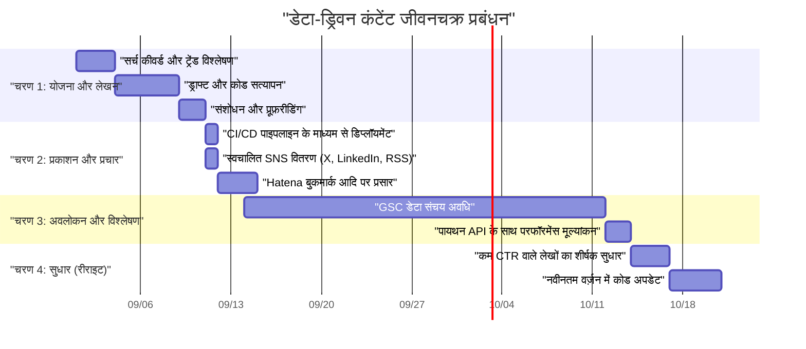
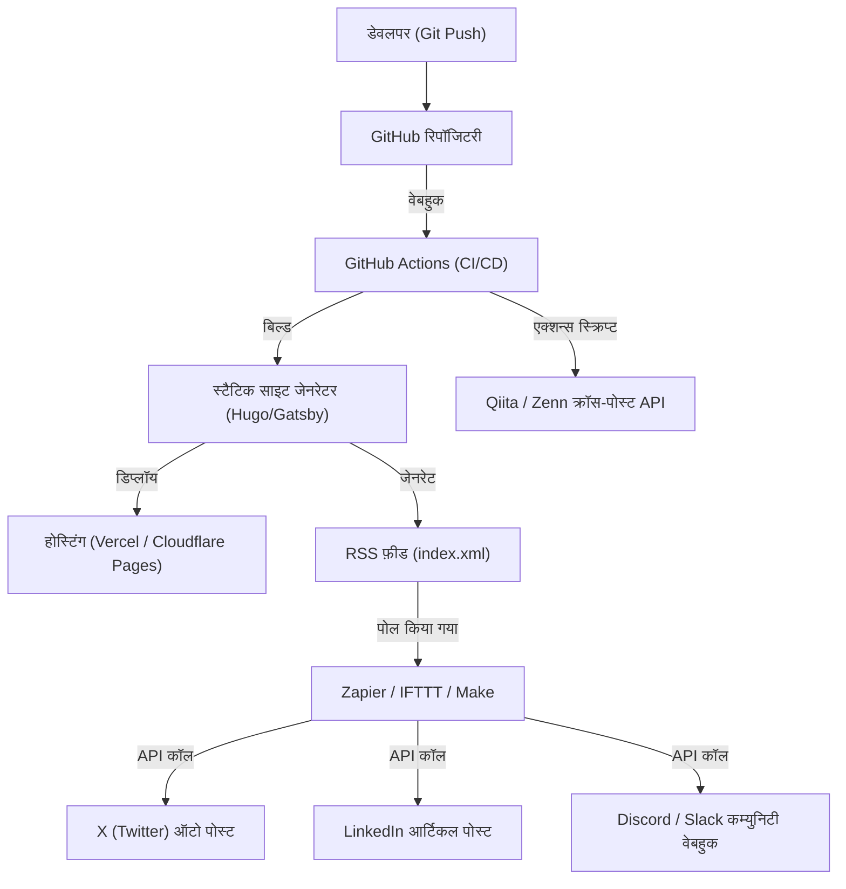

## परिचय: टेक ब्लॉग का ग्रोथ हैक जो केवल एक इंजीनियर ही कर सकता है

कई सॉफ़्टवेयर इंजीनियर तकनीकी ब्लॉग शुरू करते हैं, लेकिन ऐसे बहुत कम मामले होते हैं जहां वे एक निश्चित मात्रा में ट्रैफ़िक इकट्ठा कर पाते हैं और उसे लंबे समय तक बनाए रख पाते हैं या बढ़ा पाते हैं। उच्च गुणवत्ता वाले तकनीकी लेख लिखना एक बुनियादी शर्त है, लेकिन वह युग अब समाप्त हो गया है जब "अच्छा लेख लिखने से लोग उसे स्वाभाविक रूप से पढ़ेंगे"। आधुनिक सर्च इंजन एल्गोरिदम जटिल हो गए हैं, और सोशल मीडिया पर सूचनाओं का प्रवाह पहले से कहीं अधिक तेज़ हो गया है।

हालाँकि, इंजीनियरों के पास ऐसी ताकतें हैं जो अन्य पेशों में नहीं हैं। वह है "सिस्टम आर्किटेक्चर को समझना, टूल्स को मिलाकर प्रक्रियाओं को स्वचालित करना, और प्रोग्राम के माध्यम से डेटा का विश्लेषण करने में सक्षम होना।" यह लेख केवल लेखन तकनीकों तक सीमित नहीं है, बल्कि तकनीकी ब्लॉग को एक "प्रोडक्ट" के रूप में देखता है, और इंजीनियरिंग की शक्ति का उपयोग करके मासिक ट्रैफ़िक को नाटकीय रूप से बढ़ाने की रणनीतियों को अत्यंत विस्तृत और व्यावहारिक रूप से समझाता है।

---

## 1. इंजीनियरों के तकनीकी ब्लॉग के लिए एसईओ (SEO) आर्किटेक्चर

ब्लॉग का आधार बनने वाला सिस्टम (जैसे कि स्टैटिक साइट जेनरेटर) और HTML की संरचना सबसे महत्वपूर्ण तत्व हैं जो सर्च इंजन को कंटेंट की सही ढंग से व्याख्या करने में मदद करते हैं।

### 1.1 Core Web Vitals का अनुकूलन (Optimization)

Google पेज एक्सपीरियंस को रैंकिंग फैक्टर के रूप में उपयोग करता है, और विशेष रूप से **Core Web Vitals (LCP, FID/INP, CLS)** को तकनीकी ब्लॉग में भी नज़रअंदाज़ नहीं किया जा सकता है।
तकनीकी ब्लॉग में, बड़ी संख्या में सोर्स कोड ब्लॉक, गणितीय सूत्र (MathJax / KaTeX) और इलस्ट्रेटिव इमेजेस का बहुत अधिक उपयोग किया जाता है। ये कारक पेज की रेंडरिंग में देरी कर सकते हैं।

- **LCP (Largest Contentful Paint)**: पहले व्यू (First View) में मुख्य कंटेंट की लोडिंग स्पीड। आईकैच (eyecatch) इमेजेस के लिए WebP या AVIF का उपयोग करें और उन्हें प्रीलोड करने के लिए `fetchpriority="high"` एट्रिब्यूट (attribute) जोड़ें। साथ ही, सिंटैक्स हाइलाइटिंग के लिए भारी CSS और JS को एसिंक्रोनस रूप से लोड करें या उन्हें केवल उन पेजों पर लोड करने के लिए डिज़ाइन करें जहाँ उनकी आवश्यकता हो।
- **CLS (Cumulative Layout Shift)**: लेख लोड होते समय लेआउट का खिसकना। गणितीय सूत्रों या इमेजेस के लिए डिस्प्ले एरिया को पहले से CSS `aspect-ratio` आदि के साथ सुरक्षित करके, बाद में DOM सम्मिलित किए जाने पर होने वाले झटके (Layout shift) को रोका जा सकता है।
- **INP (Interaction to Next Paint)**: यूज़र के इंटरेक्शन पर प्रतिक्रिया। भारी JavaScript (जैसे क्लाइंट-साइड पर डायनामिक फुल-टेक्स्ट सर्च या भारी Markdown पार्सर का निष्पादन) को मेन थ्रेड पर चलाने के बजाय, इसे Web Worker पर ऑफलोड करना या बिल्ड के समय स्टैटिक HTML (SSG) के रूप में जेनरेट करना अनिवार्य है।

### 1.2 स्ट्रक्चर्ड डेटा (JSON-LD) का कार्यान्वयन (Implementation)

सर्च इंजन को स्पष्ट रूप से यह बताने के लिए कि पेज एक "लेख (article)" है और इसका लेखक "कौन" है, JSON-LD फॉर्मेट का उपयोग करके स्ट्रक्चर्ड डेटा लागू करें। `TechArticle` या `SoftwareSourceCode` जैसी स्कीमा का उपयोग करके, Google के रिच रिज़ल्ट्स (Rich Results) में प्रदर्शित होने की संभावना बढ़ जाती है, जिससे CTR (क्लिक-थ्रू रेट) में सुधार होता है।

```html
<script type="application/ld+json">
{
  "@context": "https://schema.org",
  "@type": "TechArticle",
  "headline": "तकनीकी ब्लॉग पर मासिक विज़िटर्स बढ़ाने के लिए इंजीनियरों को क्या करना चाहिए",
  "image": [
    "https://example.com/img/eyecatch.jpg"
  ],
  "datePublished": "2026-09-14T10:00:00+09:00",
  "author": {
    "@type": "Person",
    "name": "Kenji",
    "url": "https://example.com/about/"
  },
  "publisher": {
    "@type": "Organization",
    "name": "Kenji's Tech Blog",
    "logo": {
      "@type": "ImageObject",
      "url": "https://example.com/img/logo.png"
    }
  }
}
</script>
```

### 1.3 सिमेंटिक HTML और डॉक्यूमेंट स्ट्रक्चर का अनुकूलन

हेडिंग्स (`h1` से `h6`) की उचित नेस्टिंग (nesting) सबसे बुनियादी बातों में से एक है, लेकिन तकनीकी ब्लॉगों में HTML5 सिमेंटिक टैग्स जैसे `article`, `section`, `aside` और `nav` का सटीक रूप से उपयोग करना आवश्यक है। इसके अतिरिक्त, सोर्स कोड को इंगित करने के लिए `<code>` और `<pre>`, कीबोर्ड इनपुट के लिए `<kbd>`, और वेरिएबल्स के लिए `<var>` का सही ढंग से उपयोग करके, आप मशीन-रीडेबल HTML प्रदान कर सकते हैं। यह AI द्वारा कंटेंट इंडेक्सिंग (जैसे LLM ट्रेनिंग डेटा कलेक्शन और RAG सिस्टम) के लिए भी एक बहुत ही प्रभावी साधन है।

---

## 2. सर्च इंटेंट (Search Intent) का मनोविज्ञान और कीवर्ड रणनीति

सर्च इंजनों (ऑर्गेनिक ट्रैफ़िक) से आने वाले ट्रैफ़िक को अधिकतम करने के लिए, आपको यूज़र के सर्च इंटेंट को सटीक रूप से समझना होगा कि "उन्होंने उस कीवर्ड से सर्च क्यों किया।" तकनीकी सर्च इंटेंट को मोटे तौर पर दो श्रेणियों में बांटा जा सकता है।

### 2.1 "त्रुटि समाधान (Error Resolution) प्रकार" और "व्यवस्थित शिक्षण/समीक्षा (Systematic Learning/Review) प्रकार"

1. **त्रुटि समाधान प्रकार (Troubleshooting Intent)**
   - सर्च कीवर्ड के उदाहरण: `Docker "no space left on device" समाधान`, `Python IndexError list index out of range कारण`
   - मनोविज्ञान: डेवलपमेंट के दौरान किसी एरर के कारण काम रुक गया है, और वे तुरंत एक त्वरित समाधान देने वाले कमांड या कोड स्निपेट (snippet) की तलाश में हैं।
   - रणनीति: लेख की शुरुआत में (फर्स्ट व्यू में) "निष्कर्ष (समाधान के लिए कोड या कमांड)" प्रस्तुत करें। पृष्ठभूमि और विस्तृत तंत्र की व्याख्या को उसके बाद रखें, जिससे यूज़र की "इसे तुरंत ठीक करने" की इच्छा पहले पूरी हो सके। इससे बाउंस रेट (Bounce rate) कम किया जा सकता है।

2. **व्यवस्थित शिक्षण/समीक्षा प्रकार (Learning & Review Intent)**
   - सर्च कीवर्ड के उदाहरण: `React vs Vue 2026 तुलना`, `Rust एसिंक्रोनस प्रोसेसिंग (Asynchronous processing) परिचय`, `GCP नेटवर्क आर्किटेक्चर डिज़ाइन`
   - मनोविज्ञान: किसी नए तकनीकी स्टैक (tech stack) का चयन करना चाहते हैं या बुनियादी बातों से अपनी समझ को गहरा करना चाहते हैं, और पढ़ने में समय बिताने के लिए तैयार हैं।
   - रणनीति: विषय सूची (TOC) को समृद्ध करें और इलस्ट्रेशन (illustrations) या आर्किटेक्चर आरेखों (जैसे Mermaid) का अधिक उपयोग करें। फायदे और नुकसान की निष्पक्ष रूप से तुलना करें, और यह शामिल करें कि वास्तविक कार्य में इसका उपयोग कैसे किया जा सकता है (use cases), जिससे पेज पर बिताया गया समय बढ़ाया जा सके।

### 2.2 ट्रैफ़िक का एक्सपोनेंशियल डेके (Exponential Decay) मॉडल और लॉन्ग-टेल (Long-Tail) रणनीति

तकनीकी लेखों के ट्रैफ़िक में अक्सर पब्लिश होने के तुरंत बाद सोशल मीडिया आदि पर वायरल (buzz) होने के कारण अचानक उछाल (spike) आता है, और फिर यह घातांकीय (exponential) रूप से कम होने लगता है। इस ट्रैफ़िक $V(t)$ का अनुमान निम्नलिखित गणितीय मॉडल द्वारा लगाया जा सकता है:

$$ V(t) = V_0 e^{-\lambda t} + C $$

जहाँ:
- $V(t)$: समय $t$ पर ट्रैफ़िक की मात्रा
- $V_0$: पब्लिश होने के तुरंत बाद सोशल मीडिया बज़ आदि के कारण प्रारंभिक ट्रैफ़िक का उछाल
- $\lambda$: कंटेंट के पुराने होने या सोशल मीडिया पर भूल जाने के कारण क्षय स्थिरांक (Decay constant) (तकनीक के ट्रेंड परिवर्तन की गति पर निर्भर करता है)
- $C$: सर्च इंजन से आने वाला स्थिर ऑर्गेनिक ट्रैफ़िक (बेसलाइन ट्रैफ़िक)

लंबे समय तक ट्रैफ़िक बढ़ाने की कुंजी अस्थायी बज़ ($V_0$) का लक्ष्य रखने के बजाय इस बात पर निर्भर करती है कि **स्थिरांक $C$ (सर्च इंजन से लगातार आने वाला ट्रैफ़िक) को कितना बढ़ाया जाए**। विशिष्ट आला (niche) एरर्स या विशिष्ट टूल्स को एक साथ जोड़ने के तरीकों जैसे "लॉन्ग-टेल कीवर्ड्स" (जिनका सर्च वॉल्यूम कम हो सकता है लेकिन कोई प्रतिस्पर्धा नहीं होती) को बड़ी संख्या में कवर करके, $C$ के योग को एक विशाल ट्रैफ़िक स्रोत में विकसित किया जा सकता है।

---

## 3. Google Search Console API का उपयोग करके डेटा-ड्रिवन (Data-Driven) कंटेंट विश्लेषण

एक स्थिर ट्रैफ़िक आधार $C$ बनाने के लिए, आपको Google Search Console (GSC) के डेटा का उपयोग करके निष्पक्ष रूप से यह विश्लेषण करने की आवश्यकता है कि "Google आपके कंटेंट का मूल्यांकन कैसे कर रहा है।" हालांकि, GSC के वेब यूआई (Web UI) पर मैन्युअल क्लिक करने की अपनी सीमाएँ हैं। एक इंजीनियर के रूप में, GSC API और पायथन (Python) का उपयोग करके इस विश्लेषण को स्वचालित (automate) करें।

### 3.1 GSC API और पायथन (Python) के साथ ऑटोमेशन एप्रोच (Automation Approach)

एक ऐसी स्क्रिप्ट बनाएं जो स्वचालित रूप से यह पता लगाए कि किसी विशिष्ट लेख की सर्च रैंकिंग समय के साथ कैसे गिर रही है (Decaying Content), या ऐसे "व्यर्थ जा रहे लेखों" का पता लगाए जिनकी इंप्रेशन (Impression) संख्या अधिक है लेकिन क्लिक-थ्रू रेट (CTR) असामान्य रूप से कम है।
इसके लिए `google-api-python-client` और `pandas` का उपयोग किया जाता है।

### 3.2 पायथन इम्प्लीमेंटेशन कोड: कम CTR वाले कंटेंट का स्वचालित निष्कर्षण

नीचे एक स्क्रिप्ट का उदाहरण दिया गया है जो API से पिछले 30 दिनों का सर्च परफॉर्मेंस डेटा प्राप्त करता है, और उन "कीवर्ड और लेख URLs को निकालता है जिनके शीर्षक और विवरण (description) में सुधार की काफी गुंजाइश है", जहां इंप्रेशन 1000 से अधिक हैं और CTR 2% से कम है।

```python
import pandas as pd
from google.oauth2 import service_account
from googleapiclient.discovery import build
import datetime

# 1. प्रमाणीकरण और API सर्विस का निर्माण
KEY_FILE_LOCATION = 'path/to/your-service-account-key.json'
SCOPES = ['https://www.googleapis.com/auth/webmasters.readonly']
SITE_URL = 'https://your-tech-blog.com/'

credentials = service_account.Credentials.from_service_account_file(
    KEY_FILE_LOCATION, scopes=SCOPES)
webmasters_service = build('searchconsole', 'v1', credentials=credentials)

# 2. अनुरोध अवधि की गणना (पिछले 30 दिन)
today = datetime.date.today()
end_date = (today - datetime.timedelta(days=2)).strftime('%Y-%m-%d')
start_date = (today - datetime.timedelta(days=32)).strftime('%Y-%m-%d')

# 3. API अनुरोध निष्पादित करना
request = {
    'startDate': start_date,
    'endDate': end_date,
    'dimensions': ['query', 'page'],
    'rowLimit': 5000
}

response = webmasters_service.searchanalytics().query(
    siteUrl=SITE_URL, body=request).execute()

# 4. Pandas DataFrame का उपयोग करके डेटा प्रोसेसिंग और फ़िल्टरिंग
if 'rows' in response:
    rows = response['rows']
    data = []
    for row in rows:
        data.append({
            'Query': row['keys'][0],
            'URL': row['keys'][1],
            'Clicks': row['clicks'],
            'Impressions': row['impressions'],
            'CTR': row['ctr'],
            'Position': row['position']
        })
    
    df = pd.DataFrame(data)
    
    # फ़िल्टरिंग शर्तें: इंप्रेशन 1000 से अधिक और CTR 2% से कम
    target_df = df[(df['Impressions'] >= 1000) & (df['CTR'] < 0.02)]
    
    # पोजीशन के आधार पर आरोही क्रम में सॉर्ट करें (जिनकी रैंकिंग अधिक है लेकिन क्लिक नहीं हो रहे हैं, उन्हें प्राथमिकता दें)
    target_df = target_df.sort_values(by='Position', ascending=True)
    
    print("【शीर्षक/मेटा डिस्क्रिप्शन में सुधार के लिए अनुशंसित सूची】")
    print(target_df.head(10))
    
    # आवश्यकतानुसार CSV आउटपुट आदि
    # target_df.to_csv('improve_candidates.csv', index=False)
else:
    print("डेटा नहीं मिला।")
```

इस स्क्रिप्ट को cron या GitHub Actions के शेड्यूल्ड जॉब के रूप में चलाकर, आप हमेशा डेटा-आधारित निर्णय ले सकते हैं कि "किस लेख के शीर्षक को फिर से लिखा जाना चाहिए।" केवल अंतर्ज्ञान (intuition) पर निर्भर रहने के बजाय, डेटा पर आधारित निरंतर सुधार (Continuous Content Improvement - एक तरह का CI/CD) बहुत महत्वपूर्ण है।

---

## 4. लेख का जीवनचक्र प्रबंधन (Lifecycle Management) और रीराइट रणनीति (Rewrite Strategy)

तकनीकी लेख केवल पब्लिश करने के बाद समाप्त नहीं हो जाते। प्रौद्योगिकी के विकास (फ्रेमवर्क वर्ज़न अपडेट, API के अप्रचलित (deprecated) होने आदि) के साथ, कंटेंट बहुत तेज़ी से पुराना हो जाता है। पुरानी जानकारी प्रदान करना जारी रखने से न केवल ब्लॉग की विश्वसनीयता कम होती है, बल्कि इसका एसईओ (SEO) पर भी नकारात्मक प्रभाव पड़ता है।

### 4.1 कंटेंट जीवनचक्र प्रबंधन (गैंट चार्ट)

यहाँ Mermaid गैंट चार्ट (Gantt Chart) का उपयोग करके कंटेंट संचालन का एक आदर्श जीवनचक्र दर्शाया गया है।



इस प्रकार, लेख निर्माण को एक सॉफ़्टवेयर डेवलपमेंट प्रोजेक्ट की तरह मानना, और रिलीज़ के बाद के संचालन और रखरखाव (रीराइट) चरण को योजना में शामिल करना, ट्रैफ़िक को बनाए रखने और सुधारने का रहस्य है।

### 4.2 कंटेंट निर्माण के ROI (रिटर्न ऑन इन्वेस्टमेंट) का गणितीय मॉडल

चूंकि एक इंजीनियर लेख लिखने के लिए अपना कीमती समय लगाता है, इसलिए उसे इसके रिटर्न ऑन इन्वेस्टमेंट (ROI) के प्रति जागरूक होना चाहिए।
ब्लॉग के लिए ROI को इस प्रकार सूत्रबद्ध किया जा सकता है:

$$ ROI = \frac{\sum_{t=1}^{T} \left( Rev_{ad}(t) + Val_{brand}(t) + Val_{skill}(t) \right) - Cost_{time}}{\text{Cost}_{time}} \times 100 \ (\%) $$

- $T$: लेख का प्रभावी जीवनकाल (पुराना होने तक का समय)
- $Rev_{ad}(t)$: विज्ञापन आय, एफिलिएट आय, और प्रायोजन (sponsorship) से प्रत्यक्ष राजस्व
- $Val_{brand}(t)$: तकनीकी कौशल दिखाने के कारण करियर पर सकारात्मक प्रभाव का मौद्रिक मूल्य (जैसे जॉब बदलते समय अधिक वेतन प्रस्ताव, व्याख्यान के निमंत्रण आदि)
- $Val_{skill}(t)$: लेख लिखने के लिए सीखने और शोध करने से आपके स्वयं के कौशल में होने वाले सुधार का मूल्य
- $Cost_{time}$: लेख लिखने, चित्र बनाने और कोड को सत्यापित करने में लगने वाला समय (आपके अपने प्रति-घंटे वेतन के बराबर)

तकनीकी ब्लॉगों के बारे में सबसे अच्छी बात यह है कि भले ही $Rev_{ad}$ कम हो, $Val_{brand}$ और $Val_{skill}$ बहुत अधिक होने की प्रवृत्ति होती है। विशेष रूप से, एक उच्च गुणवत्ता वाली तकनीकी व्याख्या सीधे आपके पोर्टफोलियो (portfolio) के रूप में कार्य करती है और जॉब सर्च या साइड जॉब्स पाने में अत्यधिक प्रभावी होती है।

---

## 5. GitHub Actions और बाहरी ऑटोमेशन टूल्स के एकीकरण के माध्यम से वितरण (Distribution)

एक बार कंटेंट बन जाने के बाद, चुनौती यह है कि इसे लक्ष्य दर्शकों तक कुशलतापूर्वक कैसे पहुँचाया जाए (वितरण)। हर बार मैन्युअल रूप से विभिन्न SNS पर लिंक पोस्ट करना अक्षम है, और यह एक इंजीनियर के काम करने के तरीके के अनुकूल नहीं है।

### 5.1 सोशल मीडिया शेयरिंग का ऑटोमेशन आर्किटेक्चर

एक ऐसा आर्किटेक्चर बनाएं जो Markdown फ़ाइल को GitHub रिपॉजिटरी की main ब्रांच में मर्ज करने के क्षण से ही बिल्ड, डिप्लॉयमेंट और कई प्लेटफ़ॉर्म्स पर घोषणाओं को पूरी तरह से स्वचालित कर दे।



### 5.2 ऑटोमेशन पाइपलाइन बनाने के मुख्य बिंदु

1. **GitHub Actions के माध्यम से बिल्ड और डिप्लॉयमेंट**
   यदि आप स्टैटिक साइट जेनरेटर का उपयोग कर रहे हैं, तो HTML जेनरेशन और होस्टिंग गंतव्य (Vercel, Netlify, Cloudflare Pages, आदि) पर डिप्लॉयमेंट को स्वचालित करने के लिए GitHub Actions का उपयोग करें। इस समय, जैसा कि ऊपर बताया गया है, Core Web Vitals के उपाय के रूप में इमेज ऑप्टिमाइज़ेशन प्रोसेस (जैसे स्वचालित रूप से WebP में बदलना) को बिल्ड पाइपलाइन में शामिल करना भी प्रभावी है।

2. **Zapier/IFTTT का उपयोग करके RSS-ट्रिगर SNS एकीकरण**
   साइट जेनरेटर बिल्ड के समय नवीनतम RSS फ़ीड (XML) उत्पन्न करेगा। इसे Zapier या Make (पूर्व में Integromat) जैसे iPaaS में फीड करें और एक ऐसा वर्कफ़्लो बनाएं जो कहता हो: "जब RSS में कोई नया आइटम जोड़ा जाता है, तो शीर्षक और URL को X (Twitter) और LinkedIn पर पोस्ट करें।" इससे लेख पब्लिश होते ही आपके फॉलोअर्स को अपने आप नोटिफिकेशन मिल जाएगा।

3. **Qiita/Zenn पर क्रॉस-पोस्टिंग (कैनोनिकल टैग का उपयोग)**
   जब आपके अपने या व्यक्तिगत ब्लॉग की डोमेन अथॉरिटी (domain power) कमजोर होती है, तो Qiita या Zenn जैसे तकनीकी प्लेटफ़ॉर्म की ऑडियंस का लाभ उठाना एक अच्छी रणनीति है। हालाँकि, केवल कॉपी और पेस्ट करने से एसईओ (SEO) पर डुप्लिकेट कंटेंट का दंड (penalty) लगने का जोखिम होता है।
   इस समस्या को Qiita या Zenn लेखों के मेटाडेटा में **कैनोनिकल (Canonical) टैग** सेट करके और अपने ब्लॉग के मूल लेख URL को निर्दिष्ट करके हल किया जा सकता है। एक स्क्रिप्ट सेट करके जो GitHub Actions से विभिन्न प्लेटफ़ॉर्म के API को कॉल करता है और स्वचालित रूप से Markdown से लेख बनाता है, आप मल्टी-चैनल वितरण को पूरी तरह से स्वचालित कर सकते हैं।

---

## निष्कर्ष: निरंतर सुधार के चक्र को चलाए रखना

तकनीकी ब्लॉग पर मासिक ट्रैफ़िक को नाटकीय रूप से बढ़ाने के लिए, "लिखने" के कार्य के अलावा, इस लेख में प्रस्तुत किए गए इंजीनियरिंग दृष्टिकोण (engineering approach) आवश्यक हैं।

1. एसईओ (SEO) को ध्यान में रखकर एक मजबूत HTML और साइट आर्किटेक्चर का निर्माण
2. यूज़र के सर्च इंटेंट (त्रुटि समाधान बनाम व्यवस्थित शिक्षण) को समझने वाला लेख डिज़ाइन
3. Google Search Console API और पायथन (Python) का पूरा उपयोग करके डेटा विश्लेषण
4. ROI को ध्यान में रखते हुए कंटेंट जीवनचक्र प्रबंधन और रीराइट
5. CI/CD और Zapier एकीकरण के माध्यम से वितरण (distribution) का पूर्ण ऑटोमेशन

यदि आप इन सभी को एक सिस्टम के रूप में स्थापित कर सकते हैं, तो आपका तकनीकी ब्लॉग आपके करियर को मजबूती से बढ़ावा देने वाली सबसे मूल्यवान संपत्ति (asset) बन जाएगा। जो इंजीनियर ट्रैफ़िक रुकने या न बढ़ने की समस्या से जूझ रहे हैं, उन्हें आज ही से "ब्लॉग ग्रोथ हैकिंग" शुरू कर देनी चाहिए। डेवलपमेंट के काम में आपके द्वारा अर्जित प्रोग्रामिंग कौशल और आर्किटेक्चर डिज़ाइन क्षमताएँ ब्लॉग चलाने में भी आपका सबसे बड़ा हथियार बनेंगी।
