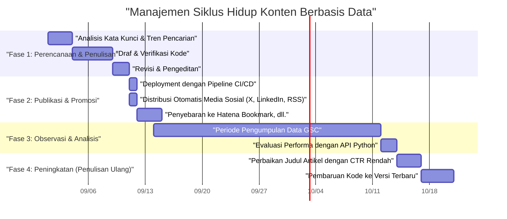
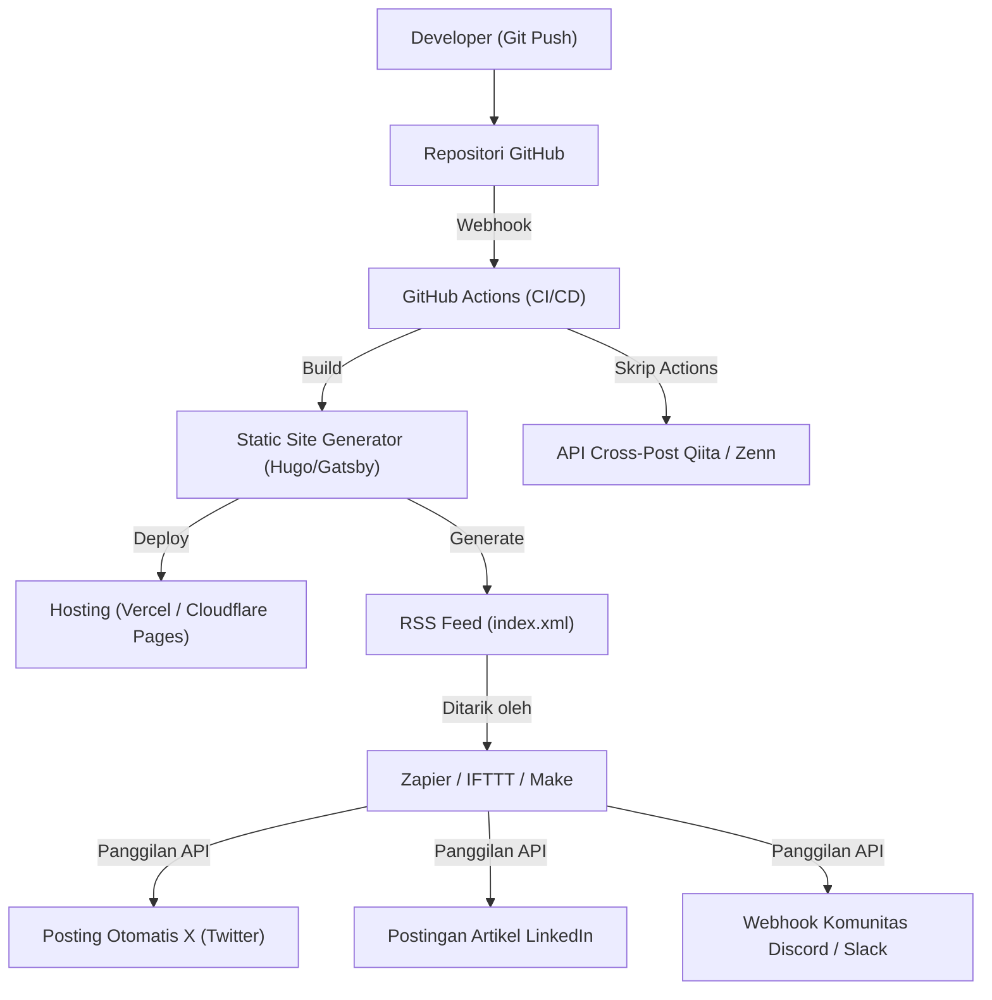

## Pendahuluan: Growth Hack Blog Teknologi yang Hanya Bisa Dilakukan oleh Engineer

Banyak software engineer yang memulai blog teknologi, namun tidak banyak yang berhasil mengumpulkan sejumlah akses tertentu serta mempertahankan dan mengembangkannya dalam jangka waktu lama. Menulis artikel teknis berkualitas tinggi adalah prasyarat, namun era di mana "menulis artikel yang baik secara alami akan dibaca" sudah berakhir. Algoritma mesin pencari saat ini semakin kompleks, dan arus informasi di media sosial bergerak lebih cepat dari sebelumnya.

Namun, engineer memiliki keunggulan yang tidak dimiliki profesi lain. Keunggulan tersebut adalah kemampuan untuk "memahami arsitektur sistem, menggabungkan alat untuk otomatisasi, dan menganalisis data secara terprogram". Dalam artikel ini, kita tidak hanya akan membahas teknik penulisan, melainkan memandang blog teknologi sebagai sebuah "produk", dan menjelaskan secara sangat rinci dan praktis mengenai strategi untuk secara dramatis meningkatkan akses bulanan menggunakan kekuatan rekayasa (engineering).

---

## 1. Arsitektur SEO Blog Teknologi untuk Engineer

Sistem yang menjadi dasar blog (seperti static site generator) dan struktur HTML adalah elemen paling penting agar mesin pencari dapat menginterpretasikan konten dengan benar.

### 1.1 Optimasi Core Web Vitals

Google menggunakan pengalaman halaman (page experience) sebagai faktor peringkat, dan secara khusus **Core Web Vitals (LCP, FID/INP, CLS)** tidak dapat diabaikan bahkan dalam blog teknologi.
Blog teknologi sering kali menggunakan banyak blok kode sumber, rumus matematika (MathJax / KaTeX), dan gambar diagram. Hal-hal tersebut dapat menyebabkan keterlambatan dalam rendering halaman.

- **LCP (Largest Contentful Paint)**: Kecepatan pemuatan konten utama pada tampilan pertama. Gunakan WebP atau AVIF untuk gambar eyecatch, dan muat lebih awal (preload) dengan menambahkan atribut `fetchpriority="high"`. Selain itu, buat CSS atau JS besar yang digunakan untuk syntax highlight dimuat secara asinkron (asynchronous), atau desain agar hanya dimuat di halaman yang membutuhkannya.
- **CLS (Cumulative Layout Shift)**: Pergeseran tata letak saat halaman sedang dimuat. Dengan memesan area tampilan untuk rumus matematika atau gambar menggunakan properti CSS seperti `aspect-ratio` sejak awal, Anda dapat mencegah pergeseran mendadak saat DOM disisipkan kemudian.
- **INP (Interaction to Next Paint)**: Responsivitas terhadap interaksi pengguna. Sangat penting untuk tidak menjalankan JavaScript berat (misalnya, pencarian dinamis teks penuh di sisi klien, atau eksekusi parser Markdown raksasa) di thread utama (main thread), melainkan memindahkannya ke Web Worker atau menghasilkannya sebagai HTML statis (SSG) pada saat proses build.

### 1.2 Implementasi Data Terstruktur (JSON-LD)

Untuk secara eksplisit memberi tahu mesin pencari bahwa halaman tersebut adalah "artikel" dan "siapa" penulisnya, terapkan data terstruktur dalam format JSON-LD. Dengan memanfaatkan skema seperti `TechArticle` dan `SoftwareSourceCode`, konten Anda akan lebih mudah muncul dalam hasil pencarian kaya (rich results) Google, yang mana akan meningkatkan CTR (Click-Through Rate).

```html
<script type="application/ld+json">
{
  "@context": "https://schema.org",
  "@type": "TechArticle",
  "headline": "Hal-hal yang Harus Dilakukan Engineer untuk Meningkatkan Akses Bulanan di Blog Teknologi",
  "image": [
    "https://example.com/img/eyecatch.jpg"
  ],
  "datePublished": "2026-09-14T10:00:00+09:00",
  "author": {
    "@type": "Person",
    "name": "Kenji",
    "url": "https://example.com/about/"
  },
  "publisher": {
    "@type": "Organization",
    "name": "Kenji's Tech Blog",
    "logo": {
      "@type": "ImageObject",
      "url": "https://example.com/img/logo.png"
    }
  }
}
</script>
```

### 1.3 HTML Semantik dan Optimasi Struktur Dokumen

Meskipun nesting (penyarangan) heading yang tepat (`h1` hingga `h6`) adalah hal mendasar, pada blog teknologi Anda dituntut untuk menggunakan tag semantik HTML5 seperti `article`, `section`, `aside`, dan `nav` secara akurat. Selain itu, dengan menggunakan `<code>` atau `<pre>` untuk menunjukkan kode sumber, `<kbd>` untuk input keyboard, dan `<var>` untuk variabel secara tepat, Anda dapat menyediakan HTML yang dapat dibaca mesin (machine-readable). Ini juga merupakan langkah yang sangat efektif untuk memfasilitasi pengindeksan konten oleh AI (pengumpulan data pelatihan LLM atau sistem RAG).

---

## 2. Psikologi Niat Pencarian (Search Intent) dan Strategi Kata Kunci

Untuk memaksimalkan arus kunjungan dari mesin pencari (lalu lintas organik), Anda perlu membaca dengan tepat "mengapa pengguna mencari kata kunci tersebut," yang dikenal sebagai niat pencarian. Niat pencarian untuk topik teknis pada umumnya dapat diklasifikasikan ke dalam dua kategori.

### 2.1 Tipe "Pemecahan Kesalahan" (Troubleshooting) dan Tipe "Pembelajaran Sistematis/Ulasan" (Learning & Review)

1. **Tipe Pemecahan Kesalahan (Troubleshooting Intent)**
   - Contoh kata kunci pencarian: `Solusi Docker "no space left on device"`, `Penyebab Python IndexError list index out of range`
   - Psikologi: Pengguna terblokir oleh kesalahan selama pengembangan, dan menginginkan potongan kode atau perintah (command) yang bisa menjadi obat mujarab secara instan.
   - Strategi: Sajikan "kesimpulan (kode atau perintah untuk memecahkan masalah)" di awal artikel (tampilan pertama). Tempatkan latar belakang atau penjelasan rinci tentang mekanismenya setelahnya. Penuhi terlebih dahulu keinginan pengguna untuk "ingin segera memperbaikinya". Ini akan membantu menurunkan rasio pentalan (bounce rate).

2. **Tipe Pembelajaran Sistematis & Ulasan (Learning & Review Intent)**
   - Contoh kata kunci pencarian: `Perbandingan React vs Vue 2026`, `Pengenalan Pemrosesan Asynchronous Rust`, `Desain Arsitektur Jaringan GCP`
   - Psikologi: Pengguna berencana memilih tech stack baru, atau ingin memperdalam pemahaman mereka dari dasar, dan siap meluangkan waktu untuk membaca.
   - Strategi: Perkaya daftar isi (TOC) dan gunakan banyak ilustrasi serta diagram arsitektur (seperti Mermaid). Bandingkan kelebihan dan kekurangan secara objektif, dan sertakan studi kasus (use case) bagaimana teknologi tersebut dapat digunakan dalam pekerjaan nyata. Hal ini dapat meningkatkan waktu menetap (dwell time) di halaman.

### 2.2 Model Penurunan Eksponensial Lalu Lintas dan Strategi Long-Tail

Jumlah akses pada artikel teknis cenderung membentuk lonjakan (spike) karena viral (buzz) di media sosial dan lainnya segera setelah diterbitkan, lalu menurun secara eksponensial. Lalu lintas $V(t)$ ini dapat diperkirakan menggunakan model matematika berikut.

$$ V(t) = V_0 e^{-\lambda t} + C $$

Di mana:
- $V(t)$: Volume lalu lintas pada waktu $t$
- $V_0$: Lonjakan lalu lintas awal akibat buzz media sosial sesaat setelah dipublikasikan
- $\lambda$: Konstanta peluruhan yang berkaitan dengan keusangan konten atau efek lupa di media sosial (bergantung pada kecepatan perubahan tren teknologi)
- $C$: Arus masuk pencarian organik yang stabil dari mesin pencari (lalu lintas dasar)

Kunci untuk mengembangkan akses dalam jangka panjang bukanlah menargetkan buzz sementara ($V_0$), melainkan **bagaimana memperbesar nilai konstanta $C$ (arus masuk berkelanjutan dari mesin pencari)**. Dengan meliput sejumlah besar "kata kunci long-tail" yang minim persaingan meskipun volume pencariannya kecil, seperti cara menangani error khusus yang niche atau cara mengintegrasikan alat tertentu, Anda dapat mengembangkan total kumulatif $C$ menjadi sesuatu yang sangat besar.

---

## 3. Analisis Konten Berbasis Data menggunakan API Google Search Console

Untuk membangun fondasi lalu lintas $C$ yang stabil, perlu menggunakan data dari Google Search Console (GSC) dan menganalisis secara objektif "bagaimana Google menilai (mengevaluasi) konten". Namun, mengoperasikan GSC melalui UI Web memiliki batasan. Jika Anda seorang engineer, mari otomatisasi proses analisis ini menggunakan GSC API dan Python.

### 3.1 Pendekatan Otomatisasi dengan GSC API dan Python

Buatlah sebuah skrip yang secara otomatis dapat mendeteksi "artikel yang disayangkan", yaitu ketika peringkat pencarian sebuah artikel tertentu terus menurun dari waktu ke waktu (Decaying Content), atau ketika rasio klik-tayang (CTR) ternyata sangat rendah meskipun jumlah tayangan (impresi) tinggi.
Untuk melakukan ini, kita akan menggunakan `google-api-python-client` dan `pandas`.

### 3.2 Kode Implementasi Python: Ekstraksi Otomatis Konten dengan CTR Rendah

Berikut ini adalah contoh skrip yang mengambil data performa pencarian 30 hari terakhir melalui API, lalu mengekstraksi "URL artikel dan kata kunci yang memiliki ruang perbaikan besar pada judul atau deskripsi" dengan kondisi lebih dari 1000 impresi dan CTR kurang dari 2%.

```python
import pandas as pd
from google.oauth2 import service_account
from googleapiclient.discovery import build
import datetime

# 1. Autentikasi dan Pembuatan Layanan API
KEY_FILE_LOCATION = 'path/to/your-service-account-key.json'
SCOPES = ['https://www.googleapis.com/auth/webmasters.readonly']
SITE_URL = 'https://your-tech-blog.com/'

credentials = service_account.Credentials.from_service_account_file(
    KEY_FILE_LOCATION, scopes=SCOPES)
webmasters_service = build('searchconsole', 'v1', credentials=credentials)

# 2. Perhitungan Periode Permintaan (30 hari terakhir)
today = datetime.date.today()
end_date = (today - datetime.timedelta(days=2)).strftime('%Y-%m-%d')
start_date = (today - datetime.timedelta(days=32)).strftime('%Y-%m-%d')

# 3. Eksekusi Permintaan API
request = {
    'startDate': start_date,
    'endDate': end_date,
    'dimensions': ['query', 'page'],
    'rowLimit': 5000
}

response = webmasters_service.searchanalytics().query(
    siteUrl=SITE_URL, body=request).execute()

# 4. Pemrosesan dan Pemfilteran Data dengan Pandas DataFrame
if 'rows' in response:
    rows = response['rows']
    data = []
    for row in rows:
        data.append({
            'Query': row['keys'][0],
            'URL': row['keys'][1],
            'Clicks': row['clicks'],
            'Impressions': row['impressions'],
            'CTR': row['ctr'],
            'Position': row['position']
        })
    
    df = pd.DataFrame(data)
    
    # Kondisi filter: Impresi >= 1000 dan CTR < 2%
    target_df = df[(df['Impressions'] >= 1000) & (df['CTR'] < 0.02)]
    
    # Urutkan berdasarkan Posisi secara menaik (prioritaskan yang peringkatnya tinggi namun jarang diklik)
    target_df = target_df.sort_values(by='Position', ascending=True)
    
    print("【Daftar Rekomendasi Perbaikan Judul/Meta Deskripsi】")
    print(target_df.head(10))
    
    # Ekspor ke CSV jika diperlukan
    # target_df.to_csv('improve_candidates.csv', index=False)
else:
    print("Data tidak ditemukan.")
```

Dengan menjalankan skrip ini secara berkala menggunakan cron atau GitHub Actions, Anda dapat memutuskan "judul artikel mana yang perlu ditulis ulang" dengan pendekatan yang selalu didorong oleh data (data-driven). Sangat penting untuk melakukan peningkatan berkelanjutan berbasis data (Continuous Content Improvement seperti halnya CI/CD) dan bukan hanya mengandalkan intuisi.

---

## 4. Manajemen Siklus Hidup Artikel dan Strategi Penulisan Ulang

Menulis dan memublikasikan artikel teknis bukanlah akhir dari segalanya. Seiring dengan perkembangan teknologi (seperti peningkatan versi framework, depresiasi API, dll.), konten dapat dengan cepat menjadi usang. Terus menyajikan informasi lama tidak hanya akan merusak kredibilitas blog, tetapi juga berdampak negatif pada evaluasi SEO.

### 4.1 Manajemen Siklus Hidup Konten (Gantt Chart)

Siklus hidup operasional yang ideal untuk sebuah konten diilustrasikan dengan Mermaid Gantt chart berikut ini.



Seperti yang ditunjukkan di atas, kunci untuk menjaga dan meningkatkan lalu lintas adalah memperlakukan pembuatan artikel seolah-olah sebuah proyek pengembangan perangkat lunak, dan memasukkan fase pemeliharaan (penulisan ulang) setelah rilis ke dalam rencana operasional.

### 4.2 Model Matematis ROI (Laba Atas Investasi) Pembuatan Konten

Karena engineer menghabiskan waktu berharga mereka untuk menulis artikel, return on investment (ROI) harus selalu dipertimbangkan.
ROI pada blog dapat dirumuskan sebagai berikut.

$$ ROI = \frac{\sum_{t=1}^{T} \left( Rev_{ad}(t) + Val_{brand}(t) + Val_{skill}(t) \right) - Cost_{time}}{\text{Cost}_{time}} \times 100 \ (\%) $$

- $T$: Masa pakai efektif artikel (periode hingga usang)
- $Rev_{ad}(t)$: Pendapatan langsung dari iklan, pendapatan afiliasi, atau sponsor
- $Val_{brand}(t)$: Nilai konversi moneter dari dampak positif terhadap karier karena memperlihatkan keterampilan teknis (peningkatan penawaran gaji saat pindah kerja, permintaan untuk menjadi pembicara, dll.)
- $Val_{skill}(t)$: Nilai peningkatan keterampilan diri dari proses pembelajaran dan riset yang dilakukan demi menulis artikel tersebut
- $Cost_{time}$: Waktu yang dihabiskan untuk menulis artikel, membuat diagram, dan memverifikasi kode (dikonversi ke tarif per jam sendiri)

Hal hebat dari memiliki blog teknologi adalah, meskipun $Rev_{ad}$ mungkin kecil, $Val_{brand}$ dan $Val_{skill}$ cenderung menjadi sangat besar. Secara khusus, artikel teknis berkualitas tinggi bisa langsung menjadi portofolio Anda, dan menunjukkan kekuatan luar biasa dalam mencari pekerjaan atau proyek sampingan.

---

## 5. Distribusi Melalui Integrasi GitHub Actions dan Alat Otomatisasi Eksternal

Setelah konten dibuat, tantangannya adalah bagaimana menyampaikannya kepada audiens target secara efisien (distribusi). Memublikasikan tautan ke setiap platform media sosial secara manual sangat tidak efisien dan sama sekali tidak mencerminkan cara kerja seorang engineer.

### 5.1 Arsitektur Otomatisasi Berbagi di Media Sosial

Kita akan membangun arsitektur otomatis yang menangani mulai dari saat file Markdown di-merge ke branch main di repositori GitHub, meliputi build, deployment, hingga pengumuman otomatis ke berbagai platform.



### 5.2 Poin-poin dalam Membangun Pipeline Otomatisasi

1. **Build dan Deployment dengan GitHub Actions**
   Jika menggunakan static site generator, gunakan GitHub Actions untuk mengotomatiskan pembuatan HTML dan deployment ke layanan hosting (seperti Vercel, Netlify, Cloudflare Pages, dll.). Di sini, sangat efektif untuk memasukkan proses optimasi gambar (misalnya konversi otomatis ke WebP) ke dalam pipeline build sebagai bagian dari optimasi Core Web Vitals yang telah disebutkan sebelumnya.

2. **Integrasi Media Sosial menggunakan Trigger RSS di Zapier/IFTTT**
   Saat build dilakukan, generator situs akan membuat RSS feed terbaru (XML). Baca file ini di iPaaS (Integration Platform as a Service) seperti Zapier atau Make (sebelumnya Integromat) dan atur alur kerja seperti "Jika item baru ditambahkan di RSS, publikasikan judul dan URL-nya ke X (Twitter) dan LinkedIn". Dengan ini, notifikasi ke pengikut (followers) akan otomatis terkirim begitu artikel diterbitkan.

3. **Cross-Posting ke Qiita/Zenn (Penggunaan Tag Canonical)**
   Saat otoritas domain (domain power) blog korporat atau pribadi Anda masih lemah, meminjam kekuatan platform teknis seperti Qiita atau Zenn untuk menarik pengunjung adalah ide yang patut dicoba. Namun, menyalin dan menempel begitu saja berisiko mendapatkan penalti SEO sebagai konten duplikat.
   Masalah ini dapat diatasi dengan menambahkan **tag Canonical** di metadata artikel di Qiita atau Zenn, yang diarahkan ke URL artikel orisinal di blog Anda sendiri. Dengan memicu API di berbagai platform dari GitHub Actions dan membuat skrip untuk membuat artikel dari file Markdown Anda, distribusi multi-saluran dapat sepenuhnya diotomatisasi.

---

## Penutup: Menjalankan Siklus Peningkatan Berkelanjutan

Untuk secara dramatis meningkatkan jumlah kunjungan bulanan ke blog teknologi Anda, selain tindakan "menulis", pendekatan teknis seperti yang diperkenalkan kali ini sangat diperlukan.

1. Membangun arsitektur situs dan HTML yang solid dengan mempertimbangkan SEO
2. Desain artikel yang memahami niat pencarian pengguna (pemecahan masalah vs pembelajaran sistematis)
3. Analisis data sepenuhnya memanfaatkan API Google Search Console dan Python
4. Manajemen siklus hidup konten dan penulisan ulang dengan mempertimbangkan ROI
5. Otomatisasi penuh dalam distribusi melalui integrasi CI/CD dan Zapier

Jika Anda dapat mengintegrasikan semua hal ini sebagai sebuah sistem, blog teknologi akan menjadi aset (asset) paling kuat yang akan mendorong karier Anda. Bagi engineer yang khawatir tentang jumlah akses yang mandek, kami harap Anda mencoba memulai "growth hack blog" Anda mulai hari ini. Keahlian pemrograman dan kemampuan desain arsitektur yang Anda asah dalam tugas-tugas pengembangan niscaya akan menjadi senjata terbesar Anda dalam menjalankan blog.
