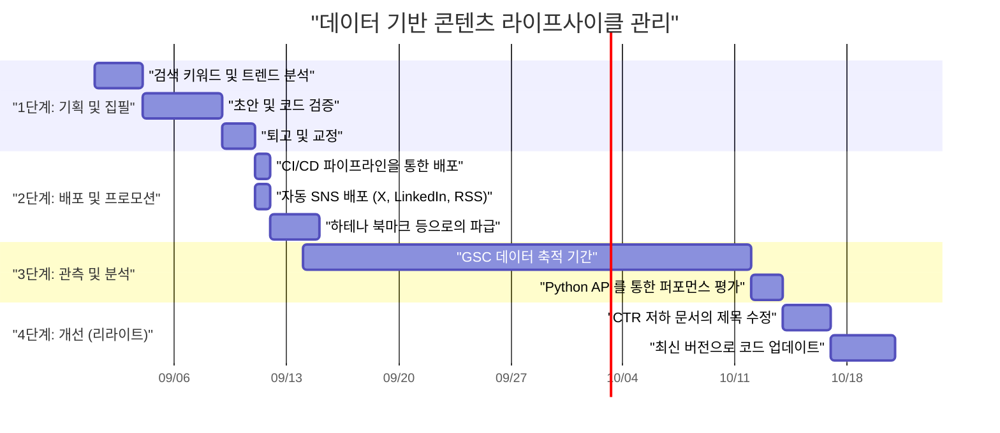
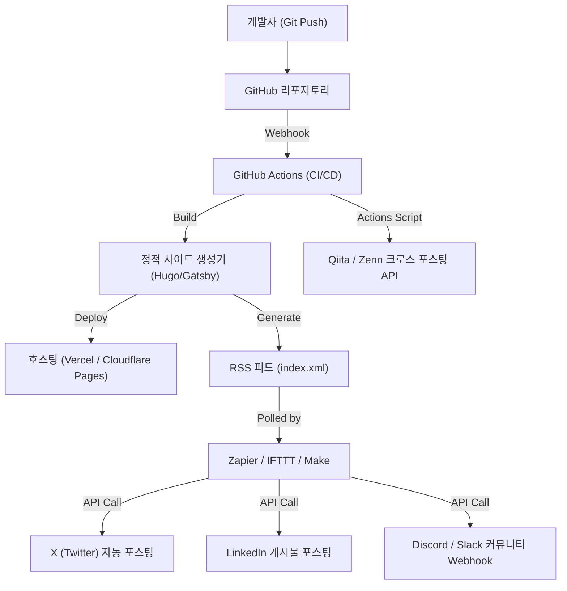

## 들어가며: 엔지니어이기에 가능한 기술 블로그 그로스 해킹

많은 소프트웨어 엔지니어가 기술 블로그를 개설하지만, 일정 수준의 조회수를 모으고 이를 장기간에 걸쳐 유지 및 확대하는 경우는 결코 많지 않습니다. 질 높은 기술 문서를 작성하는 것은 대전제이지만, "좋은 글을 쓰면 자연스럽게 읽힌다"는 시대는 이미 끝났습니다. 현재 검색 엔진의 알고리즘은 복잡해졌고, 게다가 SNS 상의 정보 흐름은 그 어느 때보다 빠르게 진행되고 있습니다.

하지만 엔지니어에게는 다른 직군에는 없는 강점이 있습니다. 바로 "시스템의 아키텍처를 이해하고, 도구들을 조합하여 자동화하며, 데이터를 프로그램으로 분석할 수 있다"는 점입니다. 본 문서에서는 단순한 글쓰기 테크닉에 그치지 않고, 기술 블로그를 하나의 "제품"으로 인식하고 엔지니어링의 힘으로 월간 트래픽을 극적으로 늘리기 위한 전략을 아주 상세하고 실천적으로 해설합니다.

---

## 1. 엔지니어를 위한 기술 블로그의 SEO 아키텍처

블로그의 기반이 되는 시스템(정적 사이트 생성기 등)과 HTML 구조는 검색 엔진이 콘텐츠를 올바르게 해석하기 위한 가장 중요한 항목입니다.

### 1.1 Core Web Vitals의 최적화

Google은 페이지 경험을 랭킹 요소로 채택하고 있으며, 특히 **Core Web Vitals (LCP, FID/INP, CLS)**는 기술 블로그에서도 무시할 수 없습니다.
기술 블로그에서는 대량의 소스 코드 블록이나 수식(MathJax / KaTeX), 도해 이미지가 많이 사용됩니다. 이것들은 페이지 렌더링을 지연시키는 요인이 됩니다.

- **LCP (Largest Contentful Paint)**: 첫 화면의 주요 콘텐츠 로딩 속도입니다. 썸네일 이미지에는 WebP나 AVIF를 사용하고, `fetchpriority="high"` 속성을 부여하여 프리로드합니다. 또한 신택스 하이라이팅을 위한 거대한 CSS나 JS는 비동기 로드하거나 필요한 페이지에만 로드되도록 설계합니다.
- **CLS (Cumulative Layout Shift)**: 문서를 로딩하는 도중 발생하는 레이아웃의 어긋남입니다. 수식이나 이미지의 표시 영역을 미리 CSS의 `aspect-ratio` 등으로 확보해 두면 나중에 DOM이 삽입될 때 발생하는 흔들림을 방지할 수 있습니다.
- **INP (Interaction to Next Paint)**: 사용자의 조작에 대한 응답성입니다. 무거운 JavaScript(예를 들어 클라이언트 사이드에서의 동적인 전문 검색이나 거대한 Markdown 파서 실행 등)를 메인 스레드에서 실행하지 않고, Web Worker로 넘기거나 빌드 시 정적 HTML로 생성(SSG)해 두는 것이 필수적입니다.

### 1.2 구조화된 데이터(JSON-LD) 구현

검색 엔진에게 페이지가 "문서"라는 것과 저자가 "누구"인지를 명시적으로 전달하기 위해 JSON-LD 포맷을 이용한 구조화 데이터를 구현합니다. `TechArticle`이나 `SoftwareSourceCode` 등의 스키마를 활용하면 Google 리치 리절트에 표시되기 쉬워지며, CTR(클릭률)이 향상됩니다.

```html
<script type="application/ld+json">
{
  "@context": "https://schema.org",
  "@type": "TechArticle",
  "headline": "엔지니어가 기술 블로그의 월간 조회수를 늘리기 위해 해야 할 일",
  "image": [
    "https://example.com/img/eyecatch.jpg"
  ],
  "datePublished": "2026-09-14T10:00:00+09:00",
  "author": {
    "@type": "Person",
    "name": "Kenji",
    "url": "https://example.com/about/"
  },
  "publisher": {
    "@type": "Organization",
    "name": "Kenji's Tech Blog",
    "logo": {
      "@type": "ImageObject",
      "url": "https://example.com/img/logo.png"
    }
  }
}
</script>
```

### 1.3 시맨틱 HTML과 문서 구조의 최적화

제목(`h1`~`h6`)의 적절한 중첩은 기본 중의 기본이지만, 기술 블로그에서는 `article`, `section`, `aside`, `nav`와 같은 HTML5의 시맨틱 태그를 정확히 사용하는 것이 요구됩니다. 또한 소스 코드를 나타내는 `<code>`나 `<pre>`, 키보드 입력을 나타내는 `<kbd>`, 변수를 나타내는 `<var>` 등을 적절히 구분해서 사용함으로써 기계가 읽기 쉬운(Machine-readable) HTML을 제공할 수 있습니다. 이는 AI의 콘텐츠 인덱싱(LLM의 학습 데이터 수집이나 RAG 시스템)에 대해서도 매우 효과적인 수단이 됩니다.

---

## 2. 검색 의도(서치 인텐트)의 심리학과 키워드 전략

검색 엔진으로부터의 유입(오가닉 트래픽)을 극대화하려면 사용자가 "왜 그 키워드로 검색했는지"라는 검색 의도를 정확히 파악해야 합니다. 기술 관련 검색 의도는 크게 2가지로 분류할 수 있습니다.

### 2.1 "오류 해결형"과 "체계적 학습 및 리뷰형"

1. **오류 해결형 (Troubleshooting Intent)**
   - 검색 키워드 예: `Docker "no space left on device" 해결책`, `Python IndexError list index out of range 원인`
   - 심리: 개발 중 오류로 막혀 있어 당장 특효약이 될 수 있는 명령어 스니펫이나 코드를 원함.
   - 전략: 글의 첫머리(첫 화면)에 "결론(해결하기 위한 코드나 명령어)"을 제시합니다. 배경이나 자세한 메커니즘에 대한 설명은 그 뒤에 배치하여 우선 사용자의 "빨리 고치고 싶다"는 욕구를 충족시킵니다. 이를 통해 이탈률(바운스 레이트)을 낮출 수 있습니다.

2. **체계적 학습 및 리뷰형 (Learning & Review Intent)**
   - 검색 키워드 예: `React vs Vue 2026 비교`, `Rust 비동기 처리 입문`, `GCP 네트워크 아키텍처 설계`
   - 심리: 새로운 기술 스택 선정이나 기초부터의 이해를 심화하고자 하며, 시간을 들여 읽을 준비가 되어 있음.
   - 전략: 목차(TOC)를 충실히 구성하고 도해나 아키텍처 다이어그램(Mermaid 등)을 많이 사용합니다. 장단점을 객관적으로 비교하고 실제 업무에서 어떻게 활용할 수 있는지에 대한 유스케이스를 포함함으로써 체류 시간을 늘릴 수 있습니다.

### 2.2 트래픽의 지수 함수적 감쇠 모델과 롱테일 전략

기술 문서의 조회수는 게시 직후 SNS 등에서 화제가 되며 스파이크(급증)를 형성하고, 그 후 지수 함수적으로 감소하는 경향이 있습니다. 이 트래픽 $V(t)$는 아래의 수식 모델로 근사할 수 있습니다.

$$ V(t) = V_0 e^{-\lambda t} + C $$

여기서:
- $V(t)$: 시간 $t$에서의 트래픽 양
- $V_0$: 배포 직후 SNS 화제 등으로 인한 초기 트래픽 스파이크 양
- $\lambda$: 콘텐츠 진부화 및 SNS 상의 망각에 따른 감쇠 상수 (기술의 트렌드 변화 속도에 의존)
- $C$: 검색 엔진으로부터 안정적으로 유입되는 오가닉 검색 트래픽 (베이스라인 트래픽)

트래픽을 장기적으로 늘리는 핵심은 일시적인 화제($V_0$)를 노리는 것보다 **상수항 $C$(검색 엔진으로부터의 지속적인 유입)를 어떻게 키울 것인가**에 있습니다. 특정하고 틈새가 있는 오류나 특정 도구들 간의 연동 방법 등, 검색 볼륨은 적어도 경쟁자가 없는 "롱테일 키워드"를 대량으로 커버함으로써 $C$의 총합을 거대하게 키워 나갑니다.

---

## 3. Google Search Console API를 활용한 데이터 기반 콘텐츠 분석

안정적인 트래픽 기반 $C$를 구축하기 위해서는 Google Search Console(GSC)의 데이터를 활용하여 "Google로부터 어떻게 평가받고 있는지"를 객관적으로 분석해야 합니다. 하지만 GSC의 Web UI를 수동으로 조작하는 것에는 한계가 있습니다. 엔지니어라면 GSC API와 Python을 이용해 분석을 자동화해 봅시다.

### 3.1 GSC API와 Python을 활용한 자동화 접근

특정 문서의 검색 순위가 시간이 지남에 따라 어떻게 하락하는지(Decaying Content) 혹은 노출 횟수(임프레션)는 많은데 클릭률(CTR)이 비정상적으로 낮은 "아쉬운 문서"를 자동 탐지하는 스크립트를 작성합니다.
여기에는 `google-api-python-client`와 `pandas`를 사용합니다.

### 3.2 Python 구현 코드: CTR 저하 콘텐츠 자동 추출

아래는 지난 30일간의 검색 퍼포먼스 데이터를 API에서 가져와서 노출 수가 1000회 이상이면서 CTR이 2% 이하인 "제목이나 디스크립션의 개선 여지가 큰 키워드 및 문서 URL"을 추출하는 스크립트 예제입니다.

```python
import pandas as pd
from google.oauth2 import service_account
from googleapiclient.discovery import build
import datetime

# 1. 인증 및 API 서비스 구축
KEY_FILE_LOCATION = 'path/to/your-service-account-key.json'
SCOPES = ['https://www.googleapis.com/auth/webmasters.readonly']
SITE_URL = 'https://your-tech-blog.com/'

credentials = service_account.Credentials.from_service_account_file(
    KEY_FILE_LOCATION, scopes=SCOPES)
webmasters_service = build('searchconsole', 'v1', credentials=credentials)

# 2. 요청 기간 계산 (최근 30일)
today = datetime.date.today()
end_date = (today - datetime.timedelta(days=2)).strftime('%Y-%m-%d')
start_date = (today - datetime.timedelta(days=32)).strftime('%Y-%m-%d')

# 3. API 요청 실행
request = {
    'startDate': start_date,
    'endDate': end_date,
    'dimensions': ['query', 'page'],
    'rowLimit': 5000
}

response = webmasters_service.searchanalytics().query(
    siteUrl=SITE_URL, body=request).execute()

# 4. Pandas DataFrame을 이용한 데이터 처리 및 필터링
if 'rows' in response:
    rows = response['rows']
    data = []
    for row in rows:
        data.append({
            'Query': row['keys'][0],
            'URL': row['keys'][1],
            'Clicks': row['clicks'],
            'Impressions': row['impressions'],
            'CTR': row['ctr'],
            'Position': row['position']
        })
    
    df = pd.DataFrame(data)
    
    # 필터링 조건: 임프레션 1000 이상 & CTR 2% 미만
    target_df = df[(df['Impressions'] >= 1000) & (df['CTR'] < 0.02)]
    
    # 포지션 오름차순으로 정렬 (순위가 높은데 클릭되지 않는 것을 우선)
    target_df = target_df.sort_values(by='Position', ascending=True)
    
    print("【제목/메타 디스크립션 개선 권장 목록】")
    print(target_df.head(10))
    
    # 필요에 따라 CSV 출력 등
    # target_df.to_csv('improve_candidates.csv', index=False)
else:
    print("데이터를 찾을 수 없습니다.")
```

이 스크립트를 cron이나 GitHub Actions의 정기 작업으로 돌림으로써 "어떤 문서의 제목을 다시 작성할지"를 항상 데이터 기반으로 결정할 수 있습니다. 직감에 의존하는 것이 아니라, 데이터에 기반한 지속적 개선(CI/CD가 아닌 Continuous Content Improvement)이 중요합니다.

---

## 4. 콘텐츠의 라이프사이클 관리와 리라이트 전략

기술 문서는 배포했다고 끝이 아닙니다. 기술의 발전(프레임워크의 버전 업그레이드, API의 지원 중단 등)에 따라 내용은 순식간에 오래된 것이 됩니다. 낡은 정보를 계속 제공하는 단지 제공하는 것은 블로그의 신뢰성을 떨어뜨릴 뿐만 아니라 SEO 측면에서도 마이너스 평가를 받게 됩니다.

### 4.1 콘텐츠 라이프사이클 관리 (간트 차트)

이상적인 콘텐츠 운영 라이프사이클을 Mermaid 간트 차트로 나타냅니다.



### 4.2 콘텐츠 제작의 ROI (투자 대비 효과) 수리 모델

엔지니어가 귀중한 시간을 쪼개어 문서를 작성하는 이상, 그 투자 대비 효과(ROI)를 의식해야 합니다.
블로그에서의 ROI는 다음과 같이 공식화할 수 있습니다.

$$ ROI = \frac{\sum_{t=1}^{T} \left( Rev_{ad}(t) + Val_{brand}(t) + Val_{skill}(t) \right) - Cost_{time}}{\text{Cost}_{time}} \times 100 \ (\%) $$

- $T$: 문서의 유효 수명 (진부화될 때까지의 기간)
- $Rev_{ad}(t)$: 광고 수익, 제휴 수익, 스폰서십을 통한 직접적인 수익
- $Val_{brand}(t)$: 기술력 어필로 인한 커리어에 미치는 긍정적 영향(이직 시 오퍼 금액 증가, 강연 의뢰 등)의 금전적 환산 가치
- $Val_{skill}(t)$: 문서를 집필하기 위해 자신이 학습하고 조사한 데 따른 자기 스킬 향상의 가치
- $Cost_{time}$: 문서를 작성하고 도해를 만들며 코드를 검증하는 데 소비한 시간 (자신의 시급으로 환산)

기술 블로그의 훌륭한 점은 $Rev_{ad}$가 적더라도 $Val_{brand}$와 $Val_{skill}$이 극히 커지는 경향이 있다는 것입니다. 특히 양질의 기술 해설은 그대로 포트폴리오가 되어 이직 활동이나 부업을 구할 때 절대적인 위력을 발휘합니다.

---

## 5. GitHub Actions와 외부 자동화 도구 연동을 통한 배포(디스트리뷰션)

콘텐츠를 작성한 후에는 그것을 얼마나 타겟층에게 효율적으로 전달할지(배포)가 과제가 됩니다. 매번 수동으로 각 SNS에 링크를 올리는 것은 비효율적이며 엔지니어답지 않습니다.

### 5.1 소셜 미디어 공유 자동화 아키텍처

Markdown 파일을 GitHub 리포지토리의 main 브랜치에 병합(merge)하는 순간부터 빌드, 배포, 그리고 여러 플랫폼에 알리는 것까지 전부 자동화하는 아키텍처를 구축합니다.



### 5.2 자동화 파이프라인 구축 포인트

1. **GitHub Actions를 이용한 빌드 및 배포**
   정적 사이트 생성기를 이용하고 있는 경우, GitHub Actions를 사용하여 HTML 생성과 호스팅 위치(Vercel, Netlify, Cloudflare Pages 등)로의 배포를 자동화합니다. 이때 앞서 언급한 Core Web Vitals에 대한 대책으로 이미지 최적화 프로세스(WebP 자동 변환 등)를 빌드 파이프라인에 포함하는 것도 효과적입니다.

2. **Zapier/IFTTT를 이용한 RSS 트리거 SNS 연동**
   사이트 생성기는 빌드할 때 최신 RSS 피드(XML)를 생성합니다. 이를 Zapier나 Make(구 Integromat) 등의 iPaaS에서 읽어들이도록 하여 "RSS에 새로운 항목이 추가되면 X(Twitter)와 LinkedIn에 제목과 URL을 포스팅한다"라는 워크플로우를 구축합니다. 이를 통해 문서가 공개되는 순간 팔로워들에게 알림이 자동으로 발송됩니다.

3. **Qiita/Zenn으로의 크로스 포스팅 (캐노니컬 태그 활용)**
   자사 블로그나 개인 블로그의 도메인 파워가 약할 때는 Qiita나 Zenn 등 기술 플랫폼의 고객 유치력을 빌리는 것도 하나의 방법입니다. 하지만 단순한 복사 및 붙여넣기는 중복 콘텐츠로 SEO 상의 페널티를 받을 위험이 있습니다.
   이 문제는 Qiita나 Zenn의 문서 메타 데이터에 **Canonical 태그**를 설정하고 자체 블로그의 원본 문서 URL을 지정함으로써 해결할 수 있습니다. GitHub Actions에서 각종 플랫폼의 API를 호출하고 Markdown으로부터 문서를 자동 생성하는 스크립트를 구성하면 여러 채널에서의 배포를 완전히 자동화할 수 있습니다.

---

## 마무리하며: 지속적인 개선 사이클 돌리기

기술 블로그에서 월간 조회수를 극적으로 늘리기 위해서는 "글을 쓴다"는 행위와 더불어 이번에 소개한 엔지니어링 접근 방식이 필수적입니다.

1. SEO를 의식한 견고한 HTML 및 사이트 아키텍처 구축
2. 사용자의 검색 의도(오류 해결 vs 체계적 학습)를 이해한 문서 설계
3. Google Search Console API와 Python을 활용한 데이터 분석
4. ROI를 고려한 콘텐츠의 라이프사이클 관리 및 리라이트
5. CI/CD 및 Zapier 연동을 통한 배포 완전 자동화

이러한 요소들을 하나의 시스템으로 구성할 수 있다면, 기술 블로그는 여러분의 커리어를 강력하게 뒷받침하는 최고의 자산(Asset)이 될 것입니다. 조회수 정체로 고민하고 있는 엔지니어라면 오늘부터라도 꼭 "블로그 그로스 해킹"을 시작해 보시기 바랍니다. 개발 업무에서 쌓은 프로그래밍 역량과 아키텍처 설계 능력은 블로그 운영에 있어서도 최고의 무기가 될 것입니다.
