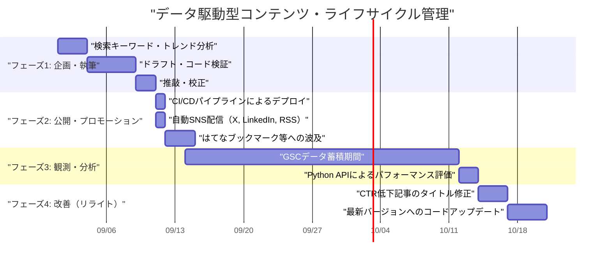
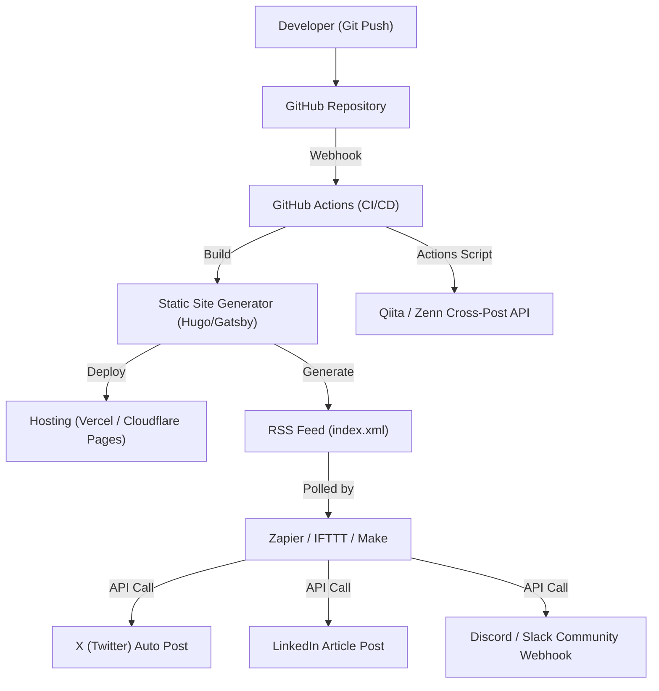

## はじめに：エンジニアだからこそできる技術ブログのグロースハック

多くのソフトウェアエンジニアが技術ブログを開設しますが、一定のアクセス数を集め、それを長期間にわたって維持・拡大できているケースは決して多くありません。質の高い技術記事を書くことは大前提ですが、「良い記事を書けば自然と読まれる」という時代はすでに終わりました。現在の検索エンジンのアルゴリズムは複雑化しており、さらにSNS上の情報のフローはかつてないほど高速化しています。

しかし、エンジニアには他の職種にはない強みがあります。それは「システムのアーキテクチャを理解し、ツールを組み合わせて自動化し、データをプログラムで分析できる」という点です。本記事では、単なるライティングテクニックにとどまらず、技術ブログを1つの「プロダクト」として捉え、エンジニアリングの力で月間アクセスを劇的に伸ばすための戦略を、極めて詳細かつ実践的に解説します。

---

## 1. エンジニア向け技術ブログのSEOアーキテクチャ

ブログの土台となるシステム（静的サイトジェネレーターなど）とHTMLの構造は、検索エンジンがコンテンツを正しく解釈するための最重要項目です。

### 1.1 Core Web Vitalsの最適化

Googleはページエクスペリエンスをランキング要因として採用しており、特に**Core Web Vitals (LCP, FID/INP, CLS)** は技術ブログにおいても無視できません。
技術ブログでは、大量のソースコードブロックや数式（MathJax / KaTeX）、図解画像が多用されます。これらはページのレンダリングを遅延させる要因となります。

- **LCP (Largest Contentful Paint)**: ファーストビューの主要コンテンツの読み込み速度。アイキャッチ画像にはWebPやAVIFを使用し、`fetchpriority="high"`属性を付与してプリロードします。また、シンタックスハイライト用の巨大なCSSやJSは非同期読み込みにするか、必要なページにのみロードする設計にします。
- **CLS (Cumulative Layout Shift)**: 記事読み込み中のレイアウトのズレ。数式や画像の表示領域をあらかじめCSSの`aspect-ratio`等で確保しておくことで、後からDOMが挿入された際のガタつきを防ぎます。
- **INP (Interaction to Next Paint)**: ユーザーの操作に対する応答性。重いJavaScript（例えばクライアントサイドでの動的な全文検索や、巨大なMarkdownパーサーの実行など）をメインスレッドで実行せず、Web Workerに逃がすかビルド時に静的HTMLとして生成（SSG）しておくことが必須です。

### 1.2 構造化データ（JSON-LD）の実装

検索エンジンに対して、ページが「記事」であること、著者が「誰」であるかを明示的に伝えるため、JSON-LDフォーマットによる構造化データを実装します。`TechArticle` や `SoftwareSourceCode` などのスキーマを活用することで、Googleのリッチリザルトに表示されやすくなり、CTR（クリックスルーレート）が向上します。

```html
<script type="application/ld+json">
{
  "@context": "https://schema.org",
  "@type": "TechArticle",
  "headline": "技術ブログで月間アクセスを伸ばすためにエンジニアがやるべきこと",
  "image": [
    "https://example.com/img/eyecatch.jpg"
  ],
  "datePublished": "2026-09-14T10:00:00+09:00",
  "author": {
    "@type": "Person",
    "name": "Kenji",
    "url": "https://example.com/about/"
  },
  "publisher": {
    "@type": "Organization",
    "name": "Kenji's Tech Blog",
    "logo": {
      "@type": "ImageObject",
      "url": "https://example.com/img/logo.png"
    }
  }
}
</script>
```

### 1.3 セマンティックHTMLと文書構造の最適化

見出し（`h1`〜`h6`）の適切なネストは基本中の基本ですが、技術ブログでは`article`, `section`, `aside`, `nav`といったHTML5のセマンティックタグを正確に利用することが求められます。また、ソースコードを示す`<code>`や`<pre>`、キーボード入力を示す`<kbd>`、変数を示す`<var>`などを適切に使い分けることで、マシンリーダブルなHTMLを提供できます。これはAIによるコンテンツのインデックス（LLMの学習データ収集やRAGシステム）に対しても非常に有効な手段となります。

---

## 2. 検索意図（サーチインテント）の心理学とキーワード戦略

検索エンジンからの流入（オーガニックトラフィック）を最大化するには、ユーザーが「なぜそのキーワードで検索したのか」という検索意図を正確に読み解く必要があります。技術系の検索意図は、大きく2つに分類できます。

### 2.1 「エラー解決型」と「体系的学習・レビュー型」

1. **エラー解決型（Troubleshooting Intent）**
   - 検索キーワード例: `Docker "no space left on device" 解決策`, `Python IndexError list index out of range 原因`
   - 心理: 開発中のエラーでブロックされており、今すぐ特効薬となるコマンドやコードスニペットを求めている。
   - 戦略: 記事の冒頭（ファーストビュー）で「結論（解決するためのコードやコマンド）」を提示します。背景や詳細なメカニズムの解説はその後ろに配置し、まずはユーザーの「すぐに直したい」という欲求を満たします。これにより、離脱率（バウンスレート）を下げることができます。

2. **体系的学習・レビュー型（Learning & Review Intent）**
   - 検索キーワード例: `React vs Vue 2026 比較`, `Rust 非同期処理 入門`, `GCP ネットワークアーキテクチャ 設計`
   - 心理: 新しい技術スタックの選定や、基礎からの理解を深めたいと考えており、時間をかけて読む準備ができている。
   - 戦略: 目次（TOC）を充実させ、図解やアーキテクチャ図（Mermaid等）を多用します。メリット・デメリットを客観的に比較し、実際の業務でどのように使えるかのユースケースを含めることで、滞在時間を伸ばすことができます。

### 2.2 トラフィックの指数関数的減衰モデルとロングテール戦略

技術記事のアクセス数は、公開直後にSNS等でバズることでスパイク（急増）を形成し、その後指数関数的に減少する傾向があります。このトラフィック $V(t)$ は以下の数式モデルで近似できます。

$$ V(t) = V_0 e^{-\lambda t} + C $$

ここで：
- $V(t)$: 時間 $t$ におけるトラフィック量
- $V_0$: 公開直後のSNSバズ等による初期トラフィックのスパイク量
- $\lambda$: コンテンツの陳腐化やSNS上の忘却に伴う減衰定数（技術のトレンド変化速度に依存）
- $C$: 検索エンジンからの安定したオーガニック検索流入（ベースライントラフィック）

アクセスを長期的に伸ばす鍵は、一時的なバズ（$V_0$）を狙うことよりも、**定数項 $C$（検索エンジンからの持続的な流入）をいかに大きくするか**にあります。特定のニッチなエラーや、特定のツール同士の連携方法など、検索ボリュームは少なくても競合がいない「ロングテールキーワード」を大量にカバーすることで、$C$ の総和を巨大なものに育てていきます。

---

## 3. Google Search Console APIを用いたデータ駆動コンテンツ分析

安定したトラフィック基盤 $C$ を構築するためには、Google Search Console（GSC）のデータを活用し、「Googleからどのように評価されているか」を客観的に分析する必要があります。しかし、GSCのWeb UIポチポチ操作には限界があります。エンジニアであれば、GSC APIとPythonを用いて分析を自動化しましょう。

### 3.1 GSC APIとPythonによる自動化アプローチ

特定の記事の検索順位が時間とともにどう下落しているか（Decaying Content）、または表示回数（インプレッション）は多いのにクリック率（CTR）が異常に低い「もったいない記事」を自動検出するスクリプトを作成します。
これには `google-api-python-client` と `pandas` を使用します。

### 3.2 Python実装コード：CTR低下コンテンツの自動抽出

以下は、過去30日間の検索パフォーマンスデータをAPIから取得し、表示回数が1000回以上かつCTRが2%以下の「タイトルやディスクリプションの改善余地が大きいキーワードと記事URL」を抽出するスクリプトの例です。

```python
import pandas as pd
from google.oauth2 import service_account
from googleapiclient.discovery import build
import datetime

# 1. 認証とAPIサービスの構築
KEY_FILE_LOCATION = 'path/to/your-service-account-key.json'
SCOPES = ['https://www.googleapis.com/auth/webmasters.readonly']
SITE_URL = 'https://your-tech-blog.com/'

credentials = service_account.Credentials.from_service_account_file(
    KEY_FILE_LOCATION, scopes=SCOPES)
webmasters_service = build('searchconsole', 'v1', credentials=credentials)

# 2. リクエスト期間の計算（過去30日間）
today = datetime.date.today()
end_date = (today - datetime.timedelta(days=2)).strftime('%Y-%m-%d')
start_date = (today - datetime.timedelta(days=32)).strftime('%Y-%m-%d')

# 3. APIリクエストの実行
request = {
    'startDate': start_date,
    'endDate': end_date,
    'dimensions': ['query', 'page'],
    'rowLimit': 5000
}

response = webmasters_service.searchanalytics().query(
    siteUrl=SITE_URL, body=request).execute()

# 4. Pandas DataFrameを用いたデータ処理とフィルタリング
if 'rows' in response:
    rows = response['rows']
    data = []
    for row in rows:
        data.append({
            'Query': row['keys'][0],
            'URL': row['keys'][1],
            'Clicks': row['clicks'],
            'Impressions': row['impressions'],
            'CTR': row['ctr'],
            'Position': row['position']
        })
    
    df = pd.DataFrame(data)
    
    # フィルタリング条件: インプレッション1000以上 ＆ CTRが2%未満
    target_df = df[(df['Impressions'] >= 1000) & (df['CTR'] < 0.02)]
    
    # ポジションの昇順でソート（順位が高いのにクリックされないものを優先）
    target_df = target_df.sort_values(by='Position', ascending=True)
    
    print("【タイトル/メタディスクリプション改善の推奨リスト】")
    print(target_df.head(10))
    
    # 必要に応じてCSV出力など
    # target_df.to_csv('improve_candidates.csv', index=False)
else:
    print("データが見つかりませんでした。")
```

このスクリプトをcronやGitHub Actionsの定期ジョブで回すことで、「どの記事のタイトルをリライトすべきか」を常にデータドリブンで決定することができます。直感に頼るのではなく、データに基づく継続的改善（CI/CDならぬContinuous Content Improvement）が重要です。

---

## 4. 記事のライフサイクル管理とリライト戦略

技術記事は公開して終わりではありません。技術の進化（フレームワークのバージョンアップ、APIの非推奨化など）に伴い、内容はあっという間に陳腐化します。古い情報を提供し続けることは、ブログの信頼性を損なうだけでなく、SEO的にもマイナス評価となります。

### 4.1 コンテンツ・ライフサイクル管理（ガントチャート）

理想的なコンテンツの運用ライフサイクルをMermaidガントチャートで示します。



このように、記事作成を一つのソフトウェア開発プロジェクトのように扱い、リリース後の運用・保守（リライト）フェーズを計画に組み込むことが、トラフィックを維持・向上させる秘訣です。

### 4.2 コンテンツ作成のROI（投資対効果）の数理モデル

エンジニアが貴重な時間を割いて記事を書く以上、その投資対効果（ROI）を意識すべきです。
ブログにおけるROIは、以下のように定式化できます。

$$ ROI = \frac{\sum_{t=1}^{T} \left( Rev_{ad}(t) + Val_{brand}(t) + Val_{skill}(t) \right) - Cost_{time}}{\text{Cost}_{time}} \times 100 \ (\%) $$

- $T$: 記事の有効寿命（陳腐化するまでの期間）
- $Rev_{ad}(t)$: 広告収益やアフィリエイト収益、スポンサーシップによる直接的収益
- $Val_{brand}(t)$: 技術力アピールによるキャリアへの好影響（転職時のオファー額増加、講演依頼など）の金銭的換算値
- $Val_{skill}(t)$: 記事を執筆するために自身が学習・調査したことによる自己スキルの向上価値
- $Cost_{time}$: 記事の執筆、図解の作成、コードの検証に費やした時間（自身の時給換算）

技術ブログの素晴らしい点は、$Rev_{ad}$ が少なくても、$Val_{brand}$ と $Val_{skill}$ が極めて大きくなる傾向にあることです。特に、質の高い技術解説はそのままポートフォリオとなり、転職活動や副業の獲得において絶大な威力を発揮します。

---

## 5. GitHub Actionsと外部自動化ツール連携によるディストリビューション

コンテンツを作成した後は、それをいかに効率よくターゲット層に届けるか（ディストリビューション）が課題となります。毎回手動で各SNSにリンクを投稿するのは非効率であり、エンジニアらしくありません。

### 5.1 ソーシャルメディア共有の自動化アーキテクチャ

MarkdownファイルをGitHubリポジトリのmainブランチにマージした瞬間から、ビルド、デプロイ、そして複数プラットフォームへの告知までを全自動化するアーキテクチャを構築します。



### 5.2 自動化パイプラインの構築ポイント

1. **GitHub Actionsによるビルドとデプロイ**
   静的サイトジェネレーターを利用している場合、GitHub Actionsを用いてHTMLの生成とホスティング先（Vercel, Netlify, Cloudflare Pagesなど）へのデプロイを自動化します。この際、前述のCore Web Vitals対策として、画像の最適化プロセス（WebPへの自動変換など）をビルドパイプラインに組み込むことも有効です。

2. **Zapier/IFTTTを利用したRSSトリガーのSNS連携**
   サイトジェネレーターはビルド時に最新のRSSフィード（XML）を生成します。これをZapierやMake (旧Integromat) などのiPaaSに読み込ませ、「RSSに新しいアイテムが追加されたら、X（Twitter）とLinkedInにタイトルとURLを投稿する」というワークフローを構築します。これにより、記事を公開した瞬間にフォロワーへの通知が自動で行われます。

3. **Qiita/Zennへのクロスポスト（カノニカルタグの活用）**
   自社ブログや個人ブログのドメインパワーが弱いうちは、QiitaやZennなどの技術プラットフォームの集客力を借りるのも一つの手です。ただし、単なるコピー＆ペーストは重複コンテンツとしてSEO上のペナルティを受けるリスクがあります。
   この問題は、QiitaやZennの記事のメタデータに**Canonicalタグ**を設定し、自ブログのオリジナル記事URLを指定することで解決できます。GitHub Actionsから各種プラットフォームのAPIを叩き、Markdownから記事を自動生成するスクリプトを組むことで、マルチチャネルでの配信を完全自動化できます。

---

## おわりに：継続的改善のサイクルを回す

技術ブログで月間アクセスを劇的に伸ばすためには、「書く」という行為に加えて、今回紹介したようなエンジニアリングのアプローチが不可欠です。

1. SEOを意識した堅牢なHTML・サイトアーキテクチャの構築
2. ユーザーの検索意図（エラー解決 vs 体系的学習）を理解した記事設計
3. Google Search Console APIとPythonを駆使したデータ分析
4. ROIを意識したコンテンツのライフサイクル管理とリライト
5. CI/CDやZapier連携によるディストリビューションの完全自動化

これらをシステムとして組み上げることができれば、技術ブログはあなた自身のキャリアを強力に後押しする最強の資産（アセット）となります。アクセス数の停滞に悩んでいるエンジニアは、ぜひ今日から「ブログのグロースハック」を始めてみてください。開発業務で培ったプログラミングスキルとアーキテクチャ設計能力は、ブログ運営においても最大の武器となるはずです。
