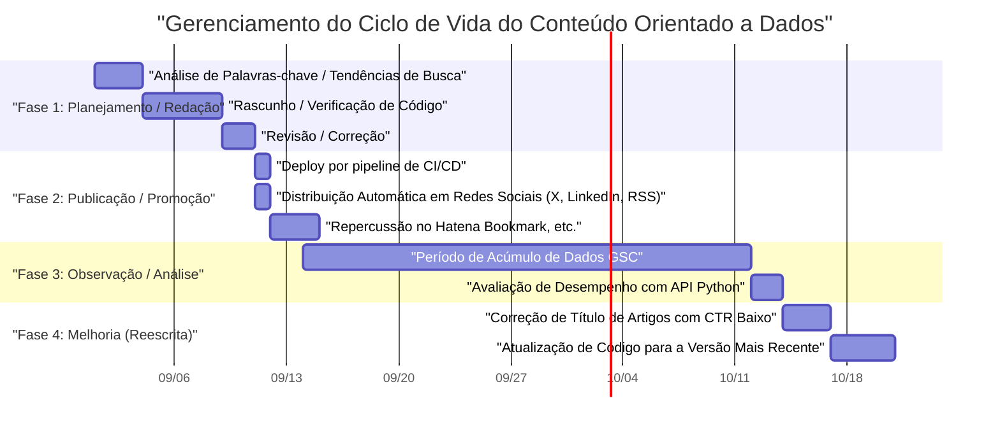
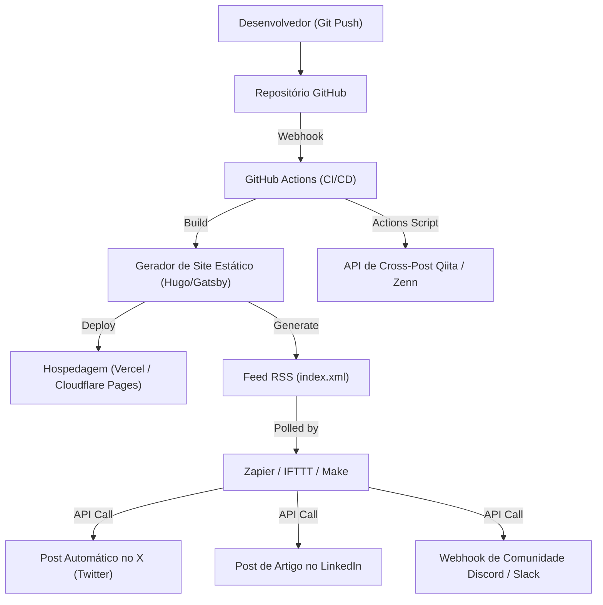

## Introdução: Growth Hacking de blog de tecnologia que só engenheiros podem fazer

Muitos engenheiros de software iniciam blogs de tecnologia, mas não são muitos os casos em que conseguem atrair um certo número de acessos e manter/expandir isso por um longo período. Escrever artigos técnicos de alta qualidade é uma premissa básica, mas a era do "escreva um bom artigo e ele será lido naturalmente" já acabou. Os algoritmos atuais dos mecanismos de busca tornaram-se complexos e o fluxo de informações nas redes sociais está mais rápido do que nunca.

No entanto, os engenheiros têm vantagens que outras profissões não têm. É o fato de que "entendem a arquitetura de sistemas, combinam ferramentas para automatizar e podem analisar dados programaticamente". Neste artigo, em vez de nos limitarmos a meras técnicas de escrita, trataremos o blog de tecnologia como um único "produto" e explicaremos de forma extremamente detalhada e prática as estratégias para aumentar drasticamente os acessos mensais através do poder da engenharia.

---

## 1. Arquitetura de SEO de blog de tecnologia para engenheiros

O sistema que serve de base para o blog (como geradores de sites estáticos) e a estrutura HTML são os itens mais importantes para que os mecanismos de busca interpretem corretamente o conteúdo.

### 1.1 Otimização das Core Web Vitals

O Google adota a experiência da página como um fator de ranqueamento, e especialmente as **Core Web Vitals (LCP, FID/INP, CLS)** não podem ser ignoradas nem mesmo em blogs de tecnologia.
Em blogs de tecnologia, uma grande quantidade de blocos de código-fonte, fórmulas matemáticas (MathJax / KaTeX) e imagens explicativas são frequentemente utilizados. Estes se tornam fatores que atrasam a renderização da página.

- **LCP (Largest Contentful Paint)**: A velocidade de carregamento do conteúdo principal na primeira visualização. Use WebP ou AVIF para a imagem de destaque (eyecatch) e adicione o atributo `fetchpriority="high"` para fazer o pré-carregamento. Além disso, projete CSS ou JS gigantes para destaque de sintaxe para carregarem de forma assíncrona ou carregarem apenas nas páginas necessárias.
- **CLS (Cumulative Layout Shift)**: O deslocamento do layout durante o carregamento da página. Ao reservar previamente a área de exibição de fórmulas matemáticas ou imagens com propriedades CSS como `aspect-ratio`, você evita os solavancos quando o DOM é inserido posteriormente.
- **INP (Interaction to Next Paint)**: A capacidade de resposta às interações do usuário. É essencial não executar JavaScript pesado (por exemplo, pesquisa de texto completo dinâmica no lado do cliente ou execução de analisadores de Markdown gigantes) na thread principal; delegue-os para um Web Worker ou gere-os como HTML estático (SSG) durante o build.

### 1.2 Implementação de dados estruturados (JSON-LD)

Para informar explicitamente aos mecanismos de busca que a página é um "artigo" e "quem" é o autor, implementamos dados estruturados no formato JSON-LD. Aproveitando esquemas como `TechArticle` e `SoftwareSourceCode`, torna-se mais fácil aparecer nos rich results do Google, melhorando o CTR (Taxa de Clique).

```html
<script type="application/ld+json">
{
  "@context": "https://schema.org",
  "@type": "TechArticle",
  "headline": "O que os engenheiros devem fazer para aumentar os acessos mensais no blog de tecnologia",
  "image": [
    "https://example.com/img/eyecatch.jpg"
  ],
  "datePublished": "2026-09-14T10:00:00+09:00",
  "author": {
    "@type": "Person",
    "name": "Kenji",
    "url": "https://example.com/about/"
  },
  "publisher": {
    "@type": "Organization",
    "name": "Kenji's Tech Blog",
    "logo": {
      "@type": "ImageObject",
      "url": "https://example.com/img/logo.png"
    }
  }
}
</script>
```

### 1.3 HTML semântico e otimização da estrutura do documento

O aninhamento adequado de cabeçalhos (`h1` a `h6`) é a base das bases, mas em blogs de tecnologia exige-se o uso preciso de tags semânticas do HTML5 como `article`, `section`, `aside` e `nav`. Além disso, ao usar adequadamente `<code>` e `<pre>` para indicar código-fonte, `<kbd>` para indicar entrada de teclado e `<var>` para indicar variáveis, você pode fornecer um HTML legível por máquina. Isso também é um meio muito eficaz para a indexação de conteúdo por IA (coleta de dados de treinamento para LLMs ou sistemas RAG).

---

## 2. Psicologia da intenção de busca (Search Intent) e estratégia de palavras-chave

Para maximizar o fluxo vindo dos mecanismos de busca (tráfego orgânico), é necessário decifrar com precisão a intenção de busca, ou seja, "por que o usuário pesquisou aquela palavra-chave". A intenção de busca técnica pode ser amplamente classificada em duas categorias.

### 2.1 "Tipo resolução de erros" e "Tipo aprendizado sistemático / revisão"

1. **Tipo resolução de erros (Troubleshooting Intent)**
   - Exemplo de palavras-chave de busca: `Docker "no space left on device" solução`, `Python IndexError list index out of range causa`
   - Psicologia: Está bloqueado por um erro durante o desenvolvimento e deseja um comando ou snippet de código que seja um remédio milagroso agora mesmo.
   - Estratégia: Apresente a "conclusão (código ou comando para resolver)" no início do artigo (primeira visualização). Coloque o contexto e a explicação detalhada do mecanismo depois, e primeiro satisfaça o desejo do usuário de "consertar imediatamente". Isso permite diminuir a taxa de rejeição (bounce rate).

2. **Tipo aprendizado sistemático / revisão (Learning & Review Intent)**
   - Exemplo de palavras-chave de busca: `React vs Vue 2026 comparação`, `Rust processamento assíncrono introdução`, `GCP arquitetura de rede design`
   - Psicologia: Está considerando a seleção de uma nova stack tecnológica ou quer aprofundar o entendimento desde a base e está preparado para passar tempo lendo.
   - Estratégia: Enriqueça o índice (TOC) e use bastante diagramas explicativos ou de arquitetura (Mermaid, etc.). Compare objetivamente as vantagens e desvantagens e inclua casos de uso de como pode ser usado no trabalho real para aumentar o tempo de permanência na página.

### 2.2 Modelo de decaimento exponencial do tráfego e estratégia de cauda longa

O número de acessos a artigos técnicos tende a formar um pico (aumento rápido) logo após a publicação, ao viralizar em redes sociais, etc., e então diminuir exponencialmente. Este tráfego $V(t)$ pode ser aproximado pela seguinte fórmula matemática.

$$ V(t) = V_0 e^{-\lambda t} + C $$

Onde:
- $V(t)$: Volume de tráfego no tempo $t$
- $V_0$: Pico inicial de tráfego devido à viralização nas redes sociais logo após a publicação
- $\lambda$: Constante de decaimento devido à obsolescência do conteúdo ou esquecimento nas redes sociais (depende da velocidade de mudança de tendências da tecnologia)
- $C$: Fluxo orgânico estável vindo dos mecanismos de busca (tráfego base)

A chave para aumentar o acesso a longo prazo não é focar no pico temporário ($V_0$), mas **como tornar o termo constante $C$ (fluxo contínuo dos mecanismos de busca) maior**. Ao cobrir uma grande quantidade de "palavras-chave de cauda longa" — como erros de nicho específicos ou métodos de integração entre ferramentas específicas — que têm baixo volume de buscas mas não têm concorrência, a soma total de $C$ crescerá para algo enorme.

---

## 3. Análise de conteúdo orientada a dados usando a API do Google Search Console

Para construir uma base de tráfego estável $C$, é necessário utilizar dados do Google Search Console (GSC) e analisar de forma objetiva "como está sendo avaliado pelo Google". No entanto, há limites para a operação manual de clicar na interface da web do GSC. Sendo um engenheiro, vamos automatizar a análise usando a API do GSC e Python.

### 3.1 Abordagem de automação com API do GSC e Python

Criaremos um script para detectar automaticamente "artigos desperdiçados", onde a posição de busca de um artigo específico cai com o tempo (Decaying Content) ou onde o número de impressões é alto, mas a taxa de cliques (CTR) é anormalmente baixa.
Para isso, utilizaremos `google-api-python-client` e `pandas`.

### 3.2 Código de implementação Python: Extração automática de conteúdo com queda de CTR

Abaixo está um exemplo de um script que obtém os dados de desempenho de busca dos últimos 30 dias pela API e extrai "palavras-chave e URLs de artigos com grande margem de melhora no título ou descrição", onde o número de impressões é 1000 ou mais e o CTR é 2% ou menos.

```python
import pandas as pd
from google.oauth2 import service_account
from googleapiclient.discovery import build
import datetime

# 1. Autenticação e construção do serviço de API
KEY_FILE_LOCATION = 'path/to/your-service-account-key.json'
SCOPES = ['https://www.googleapis.com/auth/webmasters.readonly']
SITE_URL = 'https://your-tech-blog.com/'

credentials = service_account.Credentials.from_service_account_file(
    KEY_FILE_LOCATION, scopes=SCOPES)
webmasters_service = build('searchconsole', 'v1', credentials=credentials)

# 2. Cálculo do período da requisição (últimos 30 dias)
today = datetime.date.today()
end_date = (today - datetime.timedelta(days=2)).strftime('%Y-%m-%d')
start_date = (today - datetime.timedelta(days=32)).strftime('%Y-%m-%d')

# 3. Execução da requisição de API
request = {
    'startDate': start_date,
    'endDate': end_date,
    'dimensions': ['query', 'page'],
    'rowLimit': 5000
}

response = webmasters_service.searchanalytics().query(
    siteUrl=SITE_URL, body=request).execute()

# 4. Processamento de dados e filtragem usando Pandas DataFrame
if 'rows' in response:
    rows = response['rows']
    data = []
    for row in rows:
        data.append({
            'Query': row['keys'][0],
            'URL': row['keys'][1],
            'Clicks': row['clicks'],
            'Impressions': row['impressions'],
            'CTR': row['ctr'],
            'Position': row['position']
        })
    
    df = pd.DataFrame(data)
    
    # Condições de filtragem: Impressões maiores ou iguais a 1000 e CTR menor que 2%
    target_df = df[(df['Impressions'] >= 1000) & (df['CTR'] < 0.02)]
    
    # Ordenar em ordem crescente de posição (priorizar os que têm alta posição mas não são clicados)
    target_df = target_df.sort_values(by='Position', ascending=True)
    
    print("【Lista de recomendações de melhoria de título/meta descrição】")
    print(target_df.head(10))
    
    # Exportação para CSV, etc., se necessário
    # target_df.to_csv('improve_candidates.csv', index=False)
else:
    print("Nenhum dado encontrado.")
```

Rodando esse script como um cron job ou como um job periódico do GitHub Actions, você pode sempre tomar decisões orientadas a dados sobre "quais títulos de artigos devem ser reescritos". Em vez de confiar na intuição, a melhoria contínua baseada em dados (uma "Continuous Content Improvement", em analogia a CI/CD) é importante.

---

## 4. Gerenciamento do ciclo de vida dos artigos e estratégia de reescrita

Um artigo técnico não acaba quando é publicado. Com a evolução da tecnologia (atualizações de versão de frameworks, obsolescência de APIs, etc.), o conteúdo torna-se obsoleto num piscar de olhos. Continuar a fornecer informações desatualizadas não apenas prejudica a credibilidade do blog, mas também é uma avaliação negativa do ponto de vista do SEO.

### 4.1 Gerenciamento do ciclo de vida do conteúdo (Gráfico de Gantt)

Mostramos o ciclo de vida operacional ideal de um conteúdo através de um gráfico de Gantt no Mermaid.



Tratar a criação de um artigo como um projeto de desenvolvimento de software e incorporar a fase de operação e manutenção (reescrita) pós-lançamento no planejamento é o segredo para manter e aumentar o tráfego.

### 4.2 Modelo matemático do ROI (Retorno sobre Investimento) da criação de conteúdo

Dado que os engenheiros dedicam seu tempo valioso para escrever artigos, eles devem estar cientes do seu retorno sobre investimento (ROI).
O ROI de um blog pode ser formulado da seguinte maneira.

$$ ROI = \frac{\sum_{t=1}^{T} \left( Rev_{ad}(t) + Val_{brand}(t) + Val_{skill}(t) \right) - Cost_{time}}{\text{Cost}_{time}} \times 100 \ (\%) $$

- $T$: Vida útil efetiva do artigo (período até se tornar obsoleto)
- $Rev_{ad}(t)$: Receita direta de publicidade, receita de afiliados e patrocínios
- $Val_{brand}(t)$: Valor monetário equivalente ao impacto positivo na carreira devido ao apelo da capacidade técnica (aumento do valor da oferta de emprego ao mudar de empresa, pedidos de palestras, etc.)
- $Val_{skill}(t)$: Valor de aprimoramento das próprias habilidades através do aprendizado e pesquisa para escrever o artigo
- $Cost_{time}$: Tempo gasto redigindo o artigo, criando ilustrações e testando o código (convertido para seu próprio salário por hora)

O excelente de um blog de tecnologia é que, mesmo que $Rev_{ad}$ seja pequeno, $Val_{brand}$ e $Val_{skill}$ tendem a ser extremamente grandes. Em especial, uma explicação técnica de alta qualidade torna-se um portfólio em si mesmo, mostrando um poder tremendo em atividades de procura de emprego ou obtenção de trabalhos secundários (freelancer).

---

## 5. Distribuição por meio de integração entre GitHub Actions e ferramentas de automação externas

Após criar o conteúdo, o desafio é como entregá-lo eficientemente ao público-alvo (distribuição). Postar manualmente os links em cada rede social todas as vezes é ineficiente e não parece algo de um engenheiro.

### 5.1 Arquitetura de automação de compartilhamento em mídias sociais

Vamos construir uma arquitetura que automatiza completamente desde o momento em que o arquivo Markdown é mesclado na branch main do repositório GitHub, passando pelo build, deploy e notificação em múltiplas plataformas.



### 5.2 Pontos de construção do pipeline de automação

1. **Build e Deploy via GitHub Actions**
   Se você estiver utilizando um gerador de site estático, use GitHub Actions para automatizar a geração de HTML e o deploy no serviço de hospedagem (Vercel, Netlify, Cloudflare Pages, etc.). Neste momento, também é eficaz integrar no pipeline de build o processo de otimização de imagens (conversão automática para WebP, etc.) como uma contramedida para o Core Web Vitals mencionado anteriormente.

2. **Integração de Redes Sociais ativada por RSS usando Zapier/IFTTT**
   O gerador de sites cria o último feed RSS (XML) no momento do build. Alimente isso em um iPaaS como Zapier ou Make (anteriormente Integromat) e crie um fluxo de trabalho: "Se um novo item for adicionado ao RSS, publique o título e o URL no X (Twitter) e no LinkedIn". Com isso, os seguidores são notificados automaticamente no momento em que o artigo é publicado.

3. **Cross-Post para o Qiita/Zenn (Uso de Canonical Tags)**
   Enquanto a força de domínio do seu próprio blog corporativo ou pessoal for fraca, emprestar o poder de atração de público de plataformas técnicas como Qiita e Zenn é uma opção. No entanto, um simples copiar e colar carrega o risco de ser penalizado por SEO como conteúdo duplicado.
   Esse problema pode ser resolvido configurando a **Tag Canonical** nos metadados do artigo no Qiita ou Zenn, especificando a URL do artigo original no seu próprio blog. Ao criar um script que faz chamadas para as APIs das diversas plataformas a partir do GitHub Actions para gerar automaticamente artigos a partir de Markdown, a distribuição multicanal pode ser totalmente automatizada.

---

## Conclusão: Girando o ciclo de melhoria contínua

Para aumentar drasticamente os acessos mensais do blog de tecnologia, além do ato de "escrever", abordagens de engenharia como as apresentadas desta vez são essenciais.

1. Construção de HTML e arquitetura de site robustos e com foco em SEO
2. Design de artigo que compreende a intenção de busca do usuário (resolução de erros vs. aprendizado sistemático)
3. Análise de dados aproveitando a API do Google Search Console e Python
4. Gerenciamento do ciclo de vida e reescrita do conteúdo com foco no ROI
5. Automação completa da distribuição por meio de CI/CD e integração com Zapier

Se conseguir montar isso como um sistema, o blog de tecnologia se tornará o ativo mais forte para impulsionar poderosamente sua própria carreira. Engenheiros que sofrem com a estagnação do número de acessos, por favor, comecem o "growth hacking de blog" a partir de hoje. Suas habilidades de programação e capacidade de design de arquitetura cultivadas nas tarefas de desenvolvimento com certeza serão suas maiores armas na gestão de um blog.
