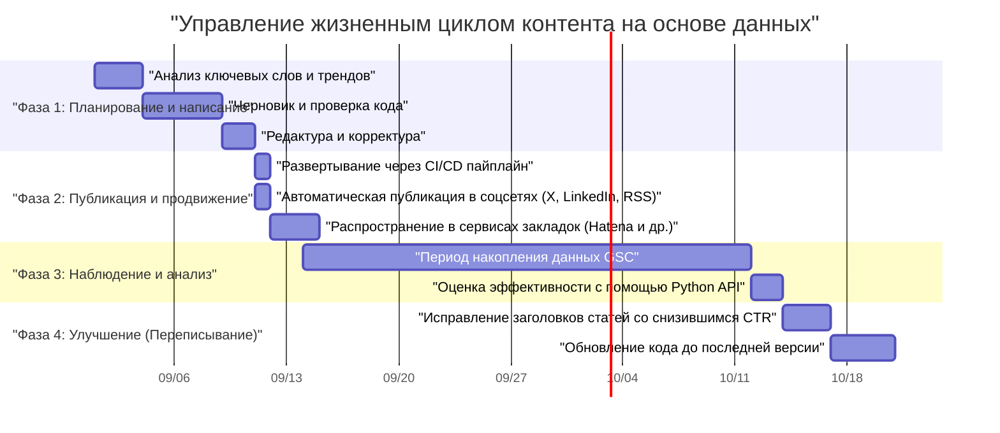

## Введение: Гроуз-хакинг технического блога, доступный только инженерам

Многие инженеры-программисты создают технические блоги, но далеко не всем удается привлечь определенное количество трафика и поддерживать, а тем более увеличивать его в течение длительного времени. Написание качественных технических статей является обязательным условием, но эпоха «напиши хорошую статью, и её обязательно прочитают» уже прошла. Сегодня алгоритмы поисковых систем стали значительно сложнее, а скорость распространения информации в социальных сетях достигла небывалых высот.

Однако у инженеров есть преимущество перед представителями других профессий. Оно заключается в способности «понимать системную архитектуру, комбинировать инструменты для автоматизации и программно анализировать данные». В этой статье мы не ограничимся лишь техниками написания текстов, а рассмотрим технический блог как «продукт» и подробно, с практическими примерами, разберем стратегии радикального увеличения ежемесячного трафика с помощью инженерных навыков.

---

## 1. SEO-архитектура технического блога для инженеров

Базовая система блога (например, генератор статических сайтов) и структура HTML являются важнейшими факторами для правильной интерпретации контента поисковыми системами.

### 1.1 Оптимизация Core Web Vitals

Google использует Page Experience как фактор ранжирования, и в частности **Core Web Vitals (LCP, FID/INP, CLS)** не стоит игнорировать даже в технических блогах.
В технических блогах часто используется множество блоков исходного кода, математических формул (MathJax / KaTeX) и иллюстраций. Они могут стать причиной задержки рендеринга страницы.

- **LCP (Largest Contentful Paint)**: Скорость загрузки основного контента на первом экране. Для главного изображения используйте форматы WebP или AVIF и предзагружайте его с атрибутом `fetchpriority="high"`. Огромные CSS и JS для подсветки синтаксиса должны загружаться асинхронно или только на тех страницах, где они действительно нужны.
- **CLS (Cumulative Layout Shift)**: Смещение макета во время загрузки страницы. Резервирование области отображения для формул и изображений заранее с помощью CSS (например, `aspect-ratio`) предотвратит скачки макета при последующей вставке DOM-элементов.
- **INP (Interaction to Next Paint)**: Отзывчивость на действия пользователя. Тяжелый JavaScript (например, динамический полнотекстовый поиск на стороне клиента или выполнение громоздкого парсера Markdown) не должен выполняться в главном потоке — его необходимо выносить в Web Worker или генерировать как статический HTML на этапе сборки (SSG).

### 1.2 Внедрение структурированных данных (JSON-LD)

Чтобы явно сообщить поисковым системам, что страница является «статьей», а также кто является её «автором», внедрите структурированные данные в формате JSON-LD. Использование таких схем, как `TechArticle` и `SoftwareSourceCode`, повышает шансы на появление в расширенных результатах (Rich Results) Google, что в свою очередь увеличивает CTR (кликабельность).

```html
<script type="application/ld+json">
{
  "@context": "https://schema.org",
  "@type": "TechArticle",
  "headline": "Что должны делать инженеры, чтобы увеличить ежемесячный трафик своего технического блога",
  "image": [
    "https://example.com/img/eyecatch.jpg"
  ],
  "datePublished": "2026-09-14T10:00:00+09:00",
  "author": {
    "@type": "Person",
    "name": "Kenji",
    "url": "https://example.com/about/"
  },
  "publisher": {
    "@type": "Organization",
    "name": "Kenji's Tech Blog",
    "logo": {
      "@type": "ImageObject",
      "url": "https://example.com/img/logo.png"
    }
  }
}
</script>
```

### 1.3 Семантический HTML и оптимизация структуры документа

Правильная вложенность заголовков (`h1`–`h6`) — это основы, но технический блог требует точного использования семантических тегов HTML5, таких как `article`, `section`, `aside` и `nav`. Кроме того, надлежащее использование тегов `<code>` и `<pre>` для исходного кода, `<kbd>` для ввода с клавиатуры и `<var>` для переменных позволяет предоставлять машиночитаемый HTML. Это также очень эффективная мера для индексации контента искусственным интеллектом (сбор обучающих данных для LLM или систем RAG).

---

## 2. Психология поискового намерения (Search Intent) и стратегия ключевых слов

Чтобы максимизировать органический трафик из поисковых систем, необходимо точно понимать поисковое намерение — «почему пользователь ищет именно по этому ключевому слову». В технической сфере поисковые намерения можно условно разделить на две категории.

### 2.1 «Решение ошибок» и «Системное обучение и обзоры»

1. **Намерение решить ошибку (Troubleshooting Intent)**
   - Примеры ключевых слов: `Решение Docker "no space left on device"`, `Причина Python IndexError list index out of range`
   - Психология: Пользователь заблокирован ошибкой в процессе разработки и нуждается в быстром решении — команде или фрагменте кода.
   - Стратегия: В самом начале статьи (на первом экране) представьте «заключение» (код или команду для решения проблемы). Пояснения, контекст и подробные механизмы размещайте ниже, в первую очередь удовлетворяя желание пользователя «быстро всё исправить». Это позволит снизить показатель отказов (Bounce Rate).

2. **Намерение системного обучения и обзоров (Learning & Review Intent)**
   - Примеры ключевых слов: `Сравнение React vs Vue 2026`, `Введение в асинхронное программирование Rust`, `Проектирование сетевой архитектуры GCP`
   - Психология: Пользователь хочет выбрать новый технологический стек или углубить понимание основ, и готов потратить время на чтение.
   - Стратегия: Сделайте подробное оглавление (TOC), используйте множество иллюстраций и диаграмм архитектуры (например, Mermaid). Объективное сравнение преимуществ и недостатков, а также примеры использования в реальных рабочих задачах (Use Cases) помогут увеличить время пребывания на странице.

### 2.2 Модель экспоненциального затухания трафика и стратегия длинного хвоста (Long Tail)

Трафик технических статей часто образует пик (всплеск) сразу после публикации за счет виральности в социальных сетях, после чего имеет тенденцию к экспоненциальному снижению. Этот трафик $V(t)$ можно аппроксимировать следующей математической моделью:

$$ V(t) = V_0 e^{-\lambda t} + C $$

Где:
- $V(t)$: Объем трафика в момент времени $t$
- $V_0$: Величина начального пика трафика, вызванного соцсетями и т.д. сразу после публикации
- $\lambda$: Константа затухания, связанная с устареванием контента и забыванием в соцсетях (зависит от скорости изменения технологических трендов)
- $C$: Стабильный органический поисковый трафик из поисковых систем (базовый трафик)

Ключ к долгосрочному росту трафика заключается не в погоне за временными всплесками ($V_0$), а в том, **как максимально увеличить константу $C$ (постоянный приток из поисковиков)**. Охватывая большое количество «низкочастотных запросов» (Long Tail Keywords), таких как специфические редкие ошибки или способы интеграции определенных инструментов, где мало конкуренции, даже при небольшом объеме поиска, вы можете вырастить общую сумму $C$ до огромных размеров.

---

## 3. Анализ контента на основе данных с использованием Google Search Console API

Чтобы построить стабильную базу трафика $C$, необходимо использовать данные Google Search Console (GSC) для объективного анализа того, «как вас оценивает Google». Однако ручная работа в веб-интерфейсе GSC имеет свои ограничения. Если вы инженер, автоматизируйте анализ с помощью GSC API и Python.

### 3.1 Подход к автоматизации с помощью GSC API и Python

Создайте скрипт, который будет автоматически обнаруживать «статьи с упущенным потенциалом» — например, статьи, позиции которых со временем падают (Decaying Content), или статьи с высоким количеством показов (Impressions), но аномально низким показателем кликабельности (CTR).
Для этого используются `google-api-python-client` и `pandas`.

### 3.2 Реализация на Python: Автоматическое извлечение контента со снижающимся CTR

Ниже приведен пример скрипта, который получает данные об эффективности поиска за последние 30 дней через API и извлекает «ключевые слова и URL-адреса статей, где есть большой потенциал для улучшения заголовков и описаний» — с количеством показов более 1000 и CTR менее 2%.

```python
import pandas as pd
from google.oauth2 import service_account
from googleapiclient.discovery import build
import datetime

# 1. Аутентификация и инициализация сервиса API
KEY_FILE_LOCATION = 'path/to/your-service-account-key.json'
SCOPES = ['https://www.googleapis.com/auth/webmasters.readonly']
SITE_URL = 'https://your-tech-blog.com/'

credentials = service_account.Credentials.from_service_account_file(
    KEY_FILE_LOCATION, scopes=SCOPES)
webmasters_service = build('searchconsole', 'v1', credentials=credentials)

# 2. Вычисление периода запроса (последние 30 дней)
today = datetime.date.today()
end_date = (today - datetime.timedelta(days=2)).strftime('%Y-%m-%d')
start_date = (today - datetime.timedelta(days=32)).strftime('%Y-%m-%d')

# 3. Выполнение запроса к API
request = {
    'startDate': start_date,
    'endDate': end_date,
    'dimensions': ['query', 'page'],
    'rowLimit': 5000
}

response = webmasters_service.searchanalytics().query(
    siteUrl=SITE_URL, body=request).execute()

# 4. Обработка данных и фильтрация с использованием Pandas DataFrame
if 'rows' in response:
    rows = response['rows']
    data = []
    for row in rows:
        data.append({
            'Query': row['keys'][0],
            'URL': row['keys'][1],
            'Clicks': row['clicks'],
            'Impressions': row['impressions'],
            'CTR': row['ctr'],
            'Position': row['position']
        })
    
    df = pd.DataFrame(data)
    
    # Условия фильтрации: Показов 1000 и более И CTR менее 2%
    target_df = df[(df['Impressions'] >= 1000) & (df['CTR'] < 0.02)]
    
    # Сортировка по возрастанию позиции (приоритет тем, которые высоко ранжируются, но по которым не кликают)
    target_df = target_df.sort_values(by='Position', ascending=True)
    
    print("【Рекомендуемый список для улучшения заголовков/мета-описаний】")
    print(target_df.head(10))
    
    # Экспорт в CSV при необходимости
    # target_df.to_csv('improve_candidates.csv', index=False)
else:
    print("Данные не найдены.")
```

Запуская этот скрипт по расписанию через cron или GitHub Actions, вы сможете всегда на основе данных принимать решения о том, «заголовок какой статьи следует переписать». Важно опираться не на интуицию, а на непрерывное улучшение контента на основе данных (Continuous Content Improvement, аналог CI/CD).

---

## 4. Управление жизненным циклом статей и стратегия переписывания (Rewrite)

Создание технической статьи не заканчивается её публикацией. С развитием технологий (обновления версий фреймворков, устаревание API и т.д.) контент быстро теряет актуальность. Продолжение предоставления устаревшей информации не только вредит репутации блога, но и негативно сказывается на SEO-оценке.

### 4.1 Управление жизненным циклом контента (Диаграмма Ганта)

Идеальный жизненный цикл управления контентом показан на диаграмме Ганта Mermaid.



Таким образом, отношение к созданию статей как к проекту по разработке программного обеспечения и включение фазы эксплуатации и обслуживания (переписывания) после релиза в план — это секрет поддержания и увеличения трафика.

### 4.2 Математическая модель рентабельности инвестиций (ROI) при создании контента

Поскольку инженеры тратят свое драгоценное время на написание статей, им следует осознавать рентабельность своих инвестиций (ROI).
ROI для блога можно сформулировать следующим образом:

$$ ROI = \frac{\sum_{t=1}^{T} \left( Rev_{ad}(t) + Val_{brand}(t) + Val_{skill}(t) \right) - Cost_{time}}{\text{Cost}_{time}} \times 100 \ (\%) $$

- $T$: Срок эффективной жизни статьи (период до её устаревания)
- $Rev_{ad}(t)$: Прямой доход от рекламы, партнерских программ (affiliate) и спонсорства
- $Val_{brand}(t)$: Денежный эквивалент положительного влияния на карьеру за счет демонстрации технических навыков (увеличение суммы оффера при смене работы, приглашения выступить с докладом и т.д.)
- $Val_{skill}(t)$: Ценность повышения собственных навыков за счет обучения и исследований, проведенных для написания статьи
- $Cost_{time}$: Время, затраченное на написание статьи, создание иллюстраций и проверку кода (в пересчете на собственную почасовую ставку)

Прекрасная особенность технических блогов заключается в том, что даже если $Rev_{ad}$ невелик, $Val_{brand}$ и $Val_{skill}$ имеют тенденцию быть чрезвычайно большими. В частности, качественные технические объяснения становятся вашим портфолио и демонстрируют огромную силу при поиске работы или получении дополнительных заказов (подработки).

---

## 5. Дистрибуция за счет интеграции GitHub Actions и внешних инструментов автоматизации

После создания контента возникает проблема: как наиболее эффективно доставить его целевой аудитории (дистрибуция). Публикация ссылок в каждой социальной сети вручную каждый раз неэффективна и не свойственна инженерам.

### 5.1 Архитектура автоматизации шаринга в социальных сетях

Мы построим архитектуру, которая полностью автоматизирует процесс от момента слияния (merge) Markdown-файла в ветку main репозитория GitHub до сборки, развертывания и оповещения на множестве платформ.

```mermaid
flowchart TD
    A["Разработчик (Git Push)"] --> B["Репозиторий GitHub"]
    B -->|Webhook| C["GitHub Actions (CI/CD)"]
    C -->|Сборка (Build)| D["Генератор статических сайтов (Hugo/Gatsby)"]
    D -->|Развертывание (Deploy)| E["Хостинг (Vercel / Cloudflare Pages)"]
    D -->|Генерация| F["RSS-канал (index.xml)"]
    F -->|Опрос (Polled by)| G["Zapier / IFTTT / Make"]
    G -->|Вызов API| H["Автопубликация в X (Twitter)"]
    G -->|Вызов API| I["Публикация статьи в LinkedIn"]
    G -->|Вызов API| J["Webhook сообщества Discord / Slack"]
    C -->|Скрипт Actions| K["Кросс-постинг API в Qiita / Zenn"]
```

### 5.2 Ключевые моменты создания пайплайна автоматизации

1. **Сборка и развертывание с помощью GitHub Actions**
   Если вы используете генератор статических сайтов, используйте GitHub Actions для автоматизации генерации HTML и развертывания на хостинге (Vercel, Netlify, Cloudflare Pages и т.д.). При этом, в качестве меры для Core Web Vitals, упомянутой ранее, эффективно внедрить в пайплайн сборки процесс оптимизации изображений (например, автоматическую конвертацию в WebP).

2. **Интеграция с социальными сетями на основе RSS-триггеров с использованием Zapier/IFTTT**
   Генератор сайтов при сборке создает актуальный RSS-канал (XML). Загрузив его в iPaaS, такие как Zapier или Make (ранее Integromat), можно настроить рабочий процесс (workflow): «Когда в RSS добавляется новый элемент, публиковать заголовок и URL в X (Twitter) и LinkedIn». Таким образом, уведомление подписчиков происходит автоматически в момент публикации статьи.

3. **Кросс-постинг в Qiita/Zenn (использование тега Canonical)**
   Пока сила домена вашего собственного или корпоративного блога невелика, можно использовать привлекающую силу технических платформ, таких как Qiita или Zenn. Однако простой копипаст несет риск получения SEO-санкций за дублированный контент.
   Эту проблему можно решить, установив тег **Canonical** в метаданных статьи на Qiita или Zenn, указав URL оригинальной статьи в вашем блоге. Написав скрипт, который вызывает API различных платформ из GitHub Actions и автоматически генерирует статьи из Markdown, вы можете полностью автоматизировать мульти-канальную дистрибуцию.

---

## Заключение: Запуск цикла непрерывного улучшения

Чтобы радикально увеличить ежемесячный трафик в техническом блоге, помимо самого процесса «написания», необходимы инженерные подходы, подобные тем, что представлены в этой статье.

1. Построение надежной HTML- и сайт-архитектуры с учетом SEO
2. Проектирование статей с пониманием поисковых намерений пользователей (решение ошибок против системного обучения)
3. Анализ данных с использованием Google Search Console API и Python
4. Управление жизненным циклом контента и переписывание с учетом ROI
5. Полная автоматизация дистрибуции через интеграцию с CI/CD и Zapier

Если вы сможете собрать это воедино как систему, ваш технический блог станет мощнейшим активом (Asset), который будет сильно продвигать вашу карьеру. Инженеры, которые страдают от стагнации трафика, пожалуйста, начните применять «гроуз-хакинг блога» уже сегодня. Навыки программирования и проектирования архитектуры, отточенные в процессе разработки, должны стать вашим величайшим оружием и в управлении блогом.
