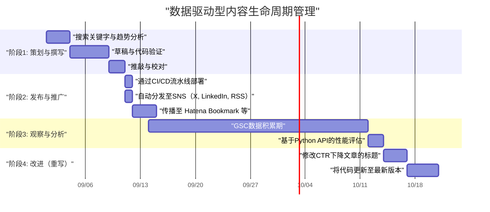
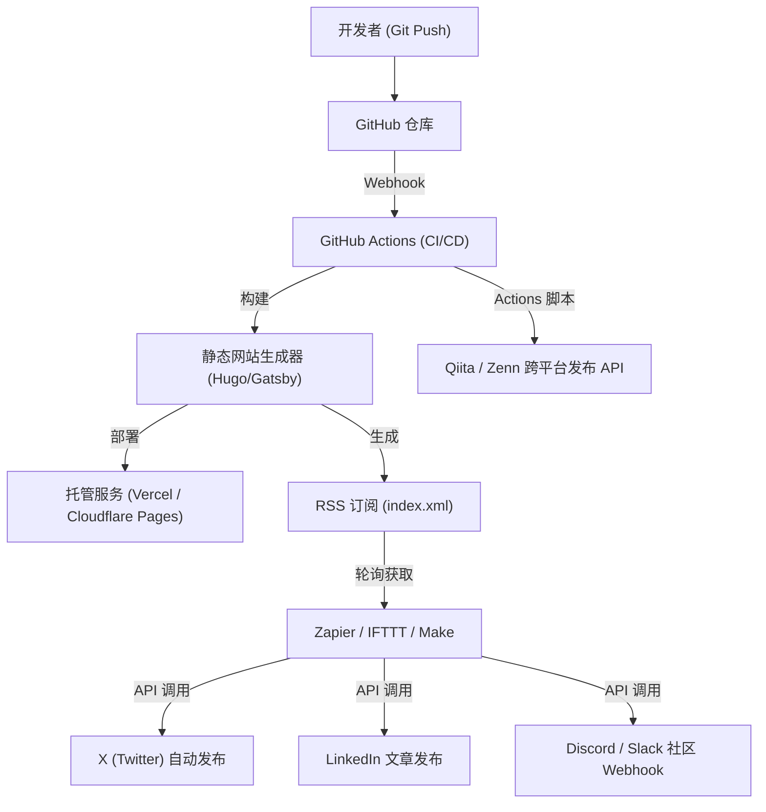

## 前言：只有工程师才能做到的技术博客增长黑客

许多软件工程师都开设了技术博客，但能够获得一定访问量并能长期维持、扩大的情况并不多。写出高质量的技术文章是大前提，但“只要写出好文章就自然会有人看”的时代已经结束。如今的搜索引擎算法日益复杂，而且SNS上的信息流动速度也达到了前所未有的程度。

然而，工程师拥有其他职业所没有的优势。那就是“理解系统架构、组合工具实现自动化、能够通过编程分析数据”。本文不仅局限于写作技巧，而是将技术博客视为一个“产品”，极其详细且具有实操性地讲解如何利用工程化力量大幅提升月度访问量的策略。

---

## 1. 面向工程师的技术博客的SEO架构

博客底层系统（如静态网站生成器）和HTML结构是搜索引擎正确解析内容的最重要因素。

### 1.1 优化 Core Web Vitals

Google将页面体验作为排名因素之一，特别是 **Core Web Vitals (LCP, FID/INP, CLS)** 在技术博客中也不容忽视。
技术博客中大量使用源代码块、数学公式（MathJax / KaTeX）和图解图片。这些都会成为延迟页面渲染的因素。

- **LCP (Largest Contentful Paint)**: 首屏主要内容的加载速度。对于头图建议使用WebP或AVIF格式，并添加`fetchpriority="high"`属性进行预加载。另外，用于语法高亮的巨大CSS或JS应设计为异步加载，或仅在需要的页面上加载。
- **CLS (Cumulative Layout Shift)**: 文章加载过程中的布局偏移。通过提前使用CSS的`aspect-ratio`等属性预留出公式或图片的显示区域，可以防止后续DOM插入时发生的画面抖动。
- **INP (Interaction to Next Paint)**: 对用户交互的响应能力。沉重的JavaScript（例如客户端动态全文搜索或巨大的Markdown解析器执行等）绝对不能在主线程上执行，必须将其转移到Web Worker中，或者在构建时生成静态HTML（SSG）。

### 1.2 结构化数据 (JSON-LD) 的实现

为了向搜索引擎明确传达页面是“文章”，作者是“谁”，需要实现基于JSON-LD格式的结构化数据。利用 `TechArticle` 或 `SoftwareSourceCode` 等模式（Schema），可以更容易在Google的富媒体搜索结果中展示，从而提升CTR（点击率）。

```html
<script type="application/ld+json">
{
  "@context": "https://schema.org",
  "@type": "TechArticle",
  "headline": "为了提高技术博客的月度访问量，工程师应该做些什么",
  "image": [
    "https://example.com/img/eyecatch.jpg"
  ],
  "datePublished": "2026-09-14T10:00:00+09:00",
  "author": {
    "@type": "Person",
    "name": "Kenji",
    "url": "https://example.com/about/"
  },
  "publisher": {
    "@type": "Organization",
    "name": "Kenji's Tech Blog",
    "logo": {
      "@type": "ImageObject",
      "url": "https://example.com/img/logo.png"
    }
  }
}
</script>
```

### 1.3 语义化 HTML 和文档结构优化

标题（`h1`〜`h6`）的适当嵌套是最基本的，但在技术博客中更要求准确使用 `article`, `section`, `aside`, `nav` 等HTML5语义化标签。此外，妥善区分使用表示源代码的 `<code>` 或 `<pre>`、表示键盘输入的 `<kbd>`、表示变量的 `<var>` 等，能够提供机器可读的HTML。这对于AI的内容索引（LLM训练数据收集和RAG系统）也是一种非常有效的手段。

---

## 2. 搜索意图 (Search Intent) 心理学与关键字策略

为了最大化来自搜索引擎的流量（自然流量），必须准确解读用户“为什么要用该关键字进行搜索”的搜索意图。技术类的搜索意图主要可以分为两类。

### 2.1 “错误解决型”与“系统学习/评测型”

1. **错误解决型（Troubleshooting Intent）**
   - 搜索关键字示例: `Docker "no space left on device" 解决方案`, `Python IndexError list index out of range 原因`
   - 心理: 开发中被错误卡住，急需能够药到病除的命令或代码片段。
   - 策略: 在文章开头（首屏）给出“结论（解决问题的代码或命令）”。将其背景和详细机制的解释放在后面，首先满足用户“想马上修复”的渴望。由此可以降低跳出率。

2. **系统学习/评测型（Learning & Review Intent）**
   - 搜索关键字示例: `React vs Vue 2026 对比`, `Rust 异步处理 入门`, `GCP 网络架构 设计`
   - 心理: 想要选择新的技术栈或从基础加深理解，做好了花时间阅读的准备。
   - 策略: 丰富目录（TOC），大量使用图解和架构图（如Mermaid等）。客观对比优缺点，并包含如何在实际业务中使用的用例，以此延长停留时间。

### 2.2 流量的指数衰减模型与长尾策略

技术文章的访问量往往在发布后因社交媒体等引发疯传而形成流量峰值，随后呈现指数级衰减。这个流量 $V(t)$ 可以用以下数学模型来近似。

$$ V(t) = V_0 e^{-\lambda t} + C $$

在这里：
- $V(t)$: 时间 $t$ 的流量
- $V_0$: 发布后因SNS疯传等产生的初始流量峰值
- $\lambda$: 随内容过时和SNS遗忘而产生的衰减常数（取决于技术趋势变化速度）
- $C$: 来自搜索引擎的稳定的自然搜索流量（基线流量）

实现访问量长期增长的关键不在于追求一时的疯传（$V_0$），而在于**如何做大常数项 $C$（来自搜索引擎的持续流量）**。通过大量覆盖搜索量虽小但没有竞争对手的“长尾关键字”，例如特定的冷门错误、特定工具之间的协同方法等，从而将 $C$ 的总和培育成一个庞大的数字。

---

## 3. 使用 Google Search Console API 的数据驱动内容分析

为了构建稳定的流量基盘 $C$，需要利用Google Search Console（GSC）的数据，客观分析“Google是如何评价你的内容的”。然而，手动在GSC Web界面上点击操作是有局限的。既然是工程师，就让我们使用GSC API和Python来自动化分析吧。

### 3.1 基于 GSC API 和 Python 的自动化方法

编写脚本，自动检测特定文章的搜索排名是如何随时间下降的（衰退内容），或者展示次数很多但点击率（CTR）异常低下的“可惜的文章”。
这里我们将使用 `google-api-python-client` 和 `pandas`。

### 3.2 Python实现代码：自动提取点击率下降的内容

以下是一个脚本示例，从API获取过去30天的搜索效果数据，并提取出展示次数在1000次以上且CTR低于2%的“标题和描述有较大改善空间的关键字和文章URL”。

```python
import pandas as pd
from google.oauth2 import service_account
from googleapiclient.discovery import build
import datetime

# 1. 认证并构建API服务
KEY_FILE_LOCATION = 'path/to/your-service-account-key.json'
SCOPES = ['https://www.googleapis.com/auth/webmasters.readonly']
SITE_URL = 'https://your-tech-blog.com/'

credentials = service_account.Credentials.from_service_account_file(
    KEY_FILE_LOCATION, scopes=SCOPES)
webmasters_service = build('searchconsole', 'v1', credentials=credentials)

# 2. 计算请求期间（过去30天）
today = datetime.date.today()
end_date = (today - datetime.timedelta(days=2)).strftime('%Y-%m-%d')
start_date = (today - datetime.timedelta(days=32)).strftime('%Y-%m-%d')

# 3. 执行API请求
request = {
    'startDate': start_date,
    'endDate': end_date,
    'dimensions': ['query', 'page'],
    'rowLimit': 5000
}

response = webmasters_service.searchanalytics().query(
    siteUrl=SITE_URL, body=request).execute()

# 4. 使用 Pandas DataFrame 进行数据处理和过滤
if 'rows' in response:
    rows = response['rows']
    data = []
    for row in rows:
        data.append({
            'Query': row['keys'][0],
            'URL': row['keys'][1],
            'Clicks': row['clicks'],
            'Impressions': row['impressions'],
            'CTR': row['ctr'],
            'Position': row['position']
        })
    
    df = pd.DataFrame(data)
    
    # 过滤条件: 展示次数 >= 1000 且 CTR < 2%
    target_df = df[(df['Impressions'] >= 1000) & (df['CTR'] < 0.02)]
    
    # 按照排名的升序排序（优先处理排名高但未被点击的内容）
    target_df = target_df.sort_values(by='Position', ascending=True)
    
    print("【推荐修改标题/元描述的列表】")
    print(target_df.head(10))
    
    # 根据需要输出为 CSV 等
    # target_df.to_csv('improve_candidates.csv', index=False)
else:
    print("未找到数据。")
```

通过在cron或GitHub Actions的定时任务中运行这个脚本，你就可以始终以数据驱动的方式决定“该重写哪篇文章的标题”。不再依赖直觉，基于数据的持续改进（Continuous Content Improvement）才是关键。

---

## 4. 文章的生命周期管理与重写策略

技术文章并不是发布了就结束了。随着技术的演进（框架升级、API弃用等），内容很快就会过时。继续提供旧信息不仅会损害博客的信誉，还会导致SEO上的负面评价。

### 4.1 内容生命周期管理（甘特图）

用 Mermaid 甘特图来展示理想的内容运营生命周期。



正如上述图表所示，将文章创作视为一个软件开发项目，把发布后的运营与维护（重写）阶段纳入计划，是维持和提升流量的秘诀。

### 4.2 内容创作的 ROI（投资回报率）数学模型

既然工程师花宝贵的时间写文章，就应该考虑其投资回报率（ROI）。
博客的ROI可以公式化如下：

$$ ROI = \frac{\sum_{t=1}^{T} \left( Rev_{ad}(t) + Val_{brand}(t) + Val_{skill}(t) \right) - Cost_{time}}{\text{Cost}_{time}} \times 100 \ (\%) $$

- $T$: 文章的有效寿命（直到过时为止的期间）
- $Rev_{ad}(t)$: 广告收入、联盟营销收入及赞助带来的直接收益
- $Val_{brand}(t)$: 技术实力展示对职业生涯带来的正面影响（跳槽时Offer薪资的增加、演讲邀请等）的折算金钱价值
- $Val_{skill}(t)$: 为撰写文章而自行学习与调查带来的自我技能提升价值
- $Cost_{time}$: 花费在撰写文章、制作图解和验证代码上的时间（按自身时薪折算）

技术博客的绝妙之处在于，即使 $Rev_{ad}$ 很少，$Val_{brand}$ 和 $Val_{skill}$ 往往也会非常巨大。特别是高质量的技术解析文章会直接成为你的作品集，在跳槽或获取副业时发挥巨大威力。

---

## 5. 通过 GitHub Actions 与外部自动化工具集成进行分发

内容创作完成后，接下来的挑战是如何将其高效地送达到目标群体手中。每次都手动向各个SNS发链接效率极低，也不符合工程师的作风。

### 5.1 社交媒体分享的自动化架构

我们将构建一个自动化架构，从Markdown文件合并到GitHub仓库的main分支那一刻起，实现构建、部署以及向多平台发布通知的全自动化。



### 5.2 自动化流水线的构建要点

1. **基于 GitHub Actions 的构建与部署**
   如果正在使用静态网站生成器，可以利用GitHub Actions自动化生成HTML并部署到托管服务（Vercel, Netlify, Cloudflare Pages等）。此时，作为上文提到的Core Web Vitals对策，将图片优化流程（如自动转换为WebP格式）加入构建流水线也非常有效。

2. **利用 Zapier/IFTTT 结合 RSS 触发 SNS 同步**
   网站生成器在构建时会生成最新的RSS Feed（XML）。将其导入Zapier或Make 等iPaaS中，构建“当RSS中添加新项目时，向X (Twitter) 和 LinkedIn 发布标题和URL”的工作流。这样在文章发布瞬间就能自动通知粉丝。

3. **向 Qiita/Zenn 进行跨平台发布（利用 Canonical 标签）**
   在自有博客或个人博客的域名权重尚弱时，借助Qiita或Zenn等技术平台的引流能力也不失为一种方法。但是，简单的复制粘贴有被视为重复内容而受到SEO惩罚的风险。
   这个问题可以通过在Qiita或Zenn文章的元数据中设置 **Canonical 标签**，并指向自己博客的原创文章URL来解决。编写脚本，通过GitHub Actions调用各平台的API从Markdown自动生成文章，可以实现多渠道分发的完全自动化。

---

## 结语：让持续改进的循环运转起来

为了大幅提高技术博客的月度访问量，除了“写”这个行为之外，本文介绍的工程化方法也是不可或缺的。

1. 构建具有SEO意识的健壮的HTML与网站架构
2. 理解用户搜索意图（解决错误 vs 系统学习）并以此进行文章设计
3. 熟练运用 Google Search Console API 和 Python 进行数据分析
4. 有ROI意识的内容生命周期管理与重写
5. 通过 CI/CD 和 Zapier 联动实现分发的完全自动化

如果能将这些构建为一个系统，那么技术博客将成为强有力推动你个人职业发展的最强资产。对于正为访问量停滞而苦恼的工程师们，请务必从今天开始尝试“博客的增长黑客”。在开发业务中积累的编程技能和架构设计能力，必将成为你运营博客的最大武器。
