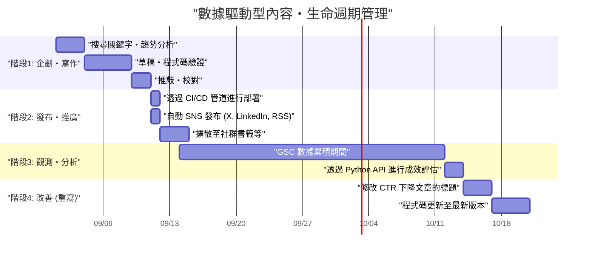
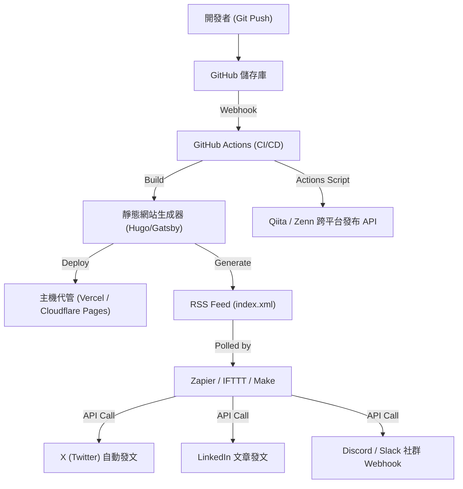

## 前言：正因為是工程師才能做到的技術部落格成長駭客

許多軟體工程師都會開設技術部落格，但能聚集一定瀏覽量，並長期間維持與擴大流量的例子卻不多。寫出高品質的技術文章是大前提，但「只要寫出好文章自然就會有人看」的時代已經結束了。現在的搜尋引擎演算法變得非常複雜，而且社群網路上的資訊流動速度也比以往任何時候都要快。

然而，工程師擁有其他職位所沒有的優勢。那就是「理解系統架構、能組合工具進行自動化、能用程式分析數據」。本文將不只停留在單純的寫作技巧，而是將技術部落格視為一個「產品」，極度詳細且實踐性地解說如何利用工程能力來大幅提升月流量的策略。

---

## 1. 面向工程師的技術部落格SEO架構

作為部落格基礎的系統（如靜態網站生成器）和HTML結構，是搜尋引擎正確理解內容的最重要項目。

### 1.1 Core Web Vitals 的最佳化

Google 採用頁面體驗作為排名因素，特別是 **Core Web Vitals (LCP, FID/INP, CLS)** 在技術部落格中也無法忽視。
技術部落格經常大量使用原始碼區塊、數學公式（MathJax / KaTeX）和圖解圖片。這些都會成為延遲頁面渲染的因素。

- **LCP (Largest Contentful Paint)**: 首屏主要內容的載入速度。主視覺圖片應使用 WebP 或 AVIF，並加上 `fetchpriority="high"` 屬性進行預載入。此外，用於語法標明的巨大 CSS 或 JS 應設計為非同步載入，或僅在需要的頁面載入。
- **CLS (Cumulative Layout Shift)**: 文章載入過程中的版面偏移。透過 CSS 的 `aspect-ratio` 等預先保留數學公式和圖片的顯示區域，可以防止後續 DOM 插入時造成的畫面跳動。
- **INP (Interaction to Next Paint)**: 對使用者操作的響應性。繁重的 JavaScript（例如客戶端的動態全文檢索或巨大的 Markdown 解析器執行等）不應在主執行緒上執行，必須轉移到 Web Worker，或者在建置時生成靜態 HTML (SSG)。

### 1.2 結構化資料（JSON-LD）的實作

為了明確地告訴搜尋引擎頁面是「文章」，作者是「誰」，需要實作 JSON-LD 格式的結構化資料。活用 `TechArticle` 或 `SoftwareSourceCode` 等 Schema，可以更容易顯示在 Google 的複合式搜尋結果中，從而提升 CTR（點閱率）。

```html
<script type="application/ld+json">
{
  "@context": "https://schema.org",
  "@type": "TechArticle",
  "headline": "工程師為了增加技術部落格月流量應該做的事",
  "image": [
    "https://example.com/img/eyecatch.jpg"
  ],
  "datePublished": "2026-09-14T10:00:00+09:00",
  "author": {
    "@type": "Person",
    "name": "Kenji",
    "url": "https://example.com/about/"
  },
  "publisher": {
    "@type": "Organization",
    "name": "Kenji's Tech Blog",
    "logo": {
      "@type": "ImageObject",
      "url": "https://example.com/img/logo.png"
    }
  }
}
</script>
```

### 1.3 語意化HTML與文件結構的最佳化

標題（`h1`〜`h6`）的適當嵌套是基本中的基本，但在技術部落格中會被要求正確使用 HTML5 的語意標籤，如 `article`, `section`, `aside`, `nav`。此外，透過適當區分表示原始碼的 `<code>` 和 `<pre>`、表示鍵盤輸入的 `<kbd>`、表示變數的 `<var>` 等，可以提供機器可讀 (machine-readable) 的 HTML。這對於 AI 的內容索引（LLM 的學習資料收集或 RAG 系統）也是非常有效的手段。

---

## 2. 搜尋意圖（Search Intent）的心理學與關鍵字策略

要最大化來自搜尋引擎的流量（自然流量），必須準確解讀使用者「為什麼用那個關鍵字搜尋」的搜尋意圖。技術相關的搜尋意圖大致可分為兩類。

### 2.1 「錯誤解決型」與「系統性學習・評論型」

1. **錯誤解決型（Troubleshooting Intent）**
   - 搜尋關鍵字範例: `Docker "no space left on device" 解決方案`, `Python IndexError list index out of range 原因`
   - 心理: 因為開發中的錯誤而卡住，現在立刻需要能作為特效藥的指令或程式碼片段。
   - 策略: 在文章開頭（首屏）提示「結論（解決用的程式碼或指令）」。背景和詳細機制的解說放在後面，首先滿足使用者「想立刻修好」的渴望。這樣可以降低跳出率（Bounce Rate）。

2. **系統性學習・評論型（Learning & Review Intent）**
   - 搜尋關鍵字範例: `React vs Vue 2026 比較`, `Rust 非同步處理 入門`, `GCP 網路架構 設計`
   - 心理: 想選擇新的技術堆疊，或想從基礎加深理解，已經準備好花時間閱讀。
   - 策略: 充實目錄（TOC），大量使用圖解或架構圖（如 Mermaid 等）。客觀比較優缺點，並包含在實際業務中如何使用的案例，可以延長停留時間。

### 2.2 流量的指數衰減模型與長尾策略

技術文章的瀏覽量，通常在公開後會因為在 SNS 等被瘋傳而形成高峰（Spike），隨後呈現指數型減少的趨勢。這個流量 $V(t)$ 可以用以下數學模型來近似：

$$ V(t) = V_0 e^{-\lambda t} + C $$

這裡的：
- $V(t)$: 時間 $t$ 的流量
- $V_0$: 公開後因 SNS 瘋傳等造成的初期流量高峰值
- $\lambda$: 伴隨內容過時或 SNS 上被遺忘的衰減常數（取決於技術趨勢變化的速度）
- $C$: 來自搜尋引擎的穩定自然搜尋流量（基準線流量）

要長期提升流量的關鍵，與其瞄準短暫的爆紅（$V_0$），不如將重點放在**如何將常數項 $C$（來自搜尋引擎的持續流量）最大化**。涵蓋大量像特定的小眾錯誤、或是特定工具之間的串接方法等，即使搜尋量少但沒有競爭對手的「長尾關鍵字」，來將 $C$ 的總和培育成巨大的流量。

---

## 3. 使用 Google Search Console API 的數據驅動內容分析

為了建構穩定的流量基礎 $C$，必須活用 Google Search Console (GSC) 的數據，客觀地分析「被 Google 給予了什麼樣的評價」。然而，在 GSC 的 Web UI 上點擊操作是有極限的。如果是工程師，就用 GSC API 和 Python 將分析自動化吧。

### 3.1 GSC API 與 Python 的自動化方法

建立一個腳本，自動偵測特定文章的搜尋排名是如何隨時間下降的（Decaying Content），或者顯示次數（曝光）很多但點閱率（CTR）卻異常低「很可惜的文章」。
這會使用到 `google-api-python-client` 和 `pandas`。

### 3.2 Python 實作程式碼：自動萃取 CTR 下降的內容

以下腳本範例是從 API 取得過去 30 天的搜尋成效數據，並萃取出顯示次數 1000 次以上且 CTR 在 2% 以下的「標題或描述有很大改善空間的關鍵字與文章 URL」。

```python
import pandas as pd
from google.oauth2 import service_account
from googleapiclient.discovery import build
import datetime

# 1. 認證與建立 API 服務
KEY_FILE_LOCATION = 'path/to/your-service-account-key.json'
SCOPES = ['https://www.googleapis.com/auth/webmasters.readonly']
SITE_URL = 'https://your-tech-blog.com/'

credentials = service_account.Credentials.from_service_account_file(
    KEY_FILE_LOCATION, scopes=SCOPES)
webmasters_service = build('searchconsole', 'v1', credentials=credentials)

# 2. 計算請求期間（過去 30 天）
today = datetime.date.today()
end_date = (today - datetime.timedelta(days=2)).strftime('%Y-%m-%d')
start_date = (today - datetime.timedelta(days=32)).strftime('%Y-%m-%d')

# 3. 執行 API 請求
request = {
    'startDate': start_date,
    'endDate': end_date,
    'dimensions': ['query', 'page'],
    'rowLimit': 5000
}

response = webmasters_service.searchanalytics().query(
    siteUrl=SITE_URL, body=request).execute()

# 4. 使用 Pandas DataFrame 進行資料處理與過濾
if 'rows' in response:
    rows = response['rows']
    data = []
    for row in rows:
        data.append({
            'Query': row['keys'][0],
            'URL': row['keys'][1],
            'Clicks': row['clicks'],
            'Impressions': row['impressions'],
            'CTR': row['ctr'],
            'Position': row['position']
        })
    
    df = pd.DataFrame(data)
    
    # 過濾條件: 曝光次數 1000 以上 且 CTR 低於 2%
    target_df = df[(df['Impressions'] >= 1000) & (df['CTR'] < 0.02)]
    
    # 依照排名升冪排序（優先處理排名高卻沒有被點擊的項目）
    target_df = target_df.sort_values(by='Position', ascending=True)
    
    print("【建議修改標題/Meta Description 的清單】")
    print(target_df.head(10))
    
    # 根據需求輸出 CSV 等
    # target_df.to_csv('improve_candidates.csv', index=False)
else:
    print("找不到數據。")
```

透過 cron 或 GitHub Actions 的定期任務來執行這個腳本，就能持續以數據驅動來決定「應該重寫哪篇文章的標題」。不依賴直覺，而是基於數據的持續改善（不是 CI/CD 而是 Continuous Content Improvement）是非常重要的。

---

## 4. 文章的生命週期管理與重寫策略

技術文章不是發布了就結束了。隨著技術的演進（框架的版號升級、API 的棄用等），內容很快就會過時。持續提供舊資訊不僅會損害部落格的信譽，在 SEO 上也會獲得負面評價。

### 4.1 內容・生命週期管理（甘特圖）

用 Mermaid 甘特圖來展示理想的內容營運生命週期。



像這樣，將文章撰寫視為一個軟體開發專案來對待，並將發布後的營運・維護（重寫）階段納入計畫，是維持與提升流量的秘訣。

### 4.2 內容創作的 ROI（投資回報率）數學模型

既然工程師要花費寶貴的時間寫文章，就應該意識到其投資回報率 (ROI)。
部落格的 ROI 可以公式化如下：

$$ ROI = \frac{\sum_{t=1}^{T} \left( Rev_{ad}(t) + Val_{brand}(t) + Val_{skill}(t) \right) - Cost_{time}}{\text{Cost}_{time}} \times 100 \ (\%) $$

- $T$: 文章的有效壽命（直到過時的期間）
- $Rev_{ad}(t)$: 廣告收益、聯盟行銷收益、贊助等直接收益
- $Val_{brand}(t)$: 技術能力展示對職涯產生正面影響（轉職時錄取薪資增加、演講邀約等）的金錢換算值
- $Val_{skill}(t)$: 為了撰寫文章，自身進行學習與調查所帶來的自我技能提升價值
- $Cost_{time}$: 撰寫文章、製作圖解、驗證程式碼所花費的時間（換算成自己的時薪）

技術部落格最棒的一點是，即使 $Rev_{ad}$ 很少，$Val_{brand}$ 和 $Val_{skill}$ 也有變得極大的傾向。特別是高品質的技術解說會直接成為作品集，在轉職活動或獲取副業時發揮極大的威力。

---

## 5. 結合 GitHub Actions 與外部自動化工具的發布機制

建立內容後，如何有效率地傳遞給目標受眾（發布與分發）就成了一個課題。每次都手動將連結貼到各個 SNS 是沒有效率的，也不像工程師的作風。

### 5.1 社群媒體分享的自動化架構

建構一個架構，從將 Markdown 檔案合併到 GitHub 儲存庫的 main 分支那一刻起，到建置、部署、以及跨平台發布通知，都能完全自動化。



### 5.2 自動化管道的建置重點

1. **透過 GitHub Actions 進行建置與部署**
   如果使用靜態網站生成器，可利用 GitHub Actions 將 HTML 的生成與部署到主機服務（Vercel, Netlify, Cloudflare Pages 等）自動化。這時，作為前述 Core Web Vitals 的對策，將圖片最佳化流程（例如自動轉換為 WebP）納入建置管道也是非常有效的。

2. **利用 Zapier/IFTTT 搭配 RSS 觸發的 SNS 串接**
   網站生成器在建置時會產生最新的 RSS feed (XML)。讓 Zapier 或 Make (前 Integromat) 等 iPaaS 讀取這個 feed，並建立「當 RSS 有新增項目時，就將標題和 URL 發布到 X (Twitter) 和 LinkedIn」的工作流程。這樣一來，文章發布的瞬間就能自動通知追蹤者。

3. **交叉發布 (Cross-Post) 到 Qiita/Zenn（Canonical 標籤的活用）**
   當自家部落格或個人部落格的網域權威（Domain Power）還很弱時，借用 Qiita 或 Zenn 等技術平台的集客力也是一種方法。但是，單純的複製貼上會有被當作重複內容而受到 SEO 懲罰的風險。
   這個問題可以透過在 Qiita 或 Zenn 文章的 Meta Data 中設定 **Canonical 標籤**，並指定自家部落格的原創文章 URL 來解決。透過 GitHub Actions 呼叫各種平台的 API，編寫從 Markdown 自動生成文章的腳本，就能完全自動化多管道的發布。

---

## 結語：轉動持續改善的循環

為了讓技術部落格的月流量出現戲劇性的成長，除了「寫作」這個行為之外，本次介紹的工程化方法也是不可或缺的。

1. 建立有意識到 SEO 的穩固 HTML 與網站架構
2. 規劃能理解使用者搜尋意圖（錯誤解決 vs 系統性學習）的文章
3. 充分運用 Google Search Console API 與 Python 進行數據分析
4. 意識到 ROI 的內容生命週期管理與重寫
5. 透過 CI/CD 與 Zapier 串接，實現發布的完全自動化

如果能將這些組合成一個系統，技術部落格將會成為強力推動你個人職涯的最強資產（Asset）。如果工程師正為了流量停滯而煩惱，請務必從今天開始嘗試「部落格的成長駭客」。在開發業務中培養出的程式設計技能與架構設計能力，在經營部落格時也一定會成為最強大的武器。
