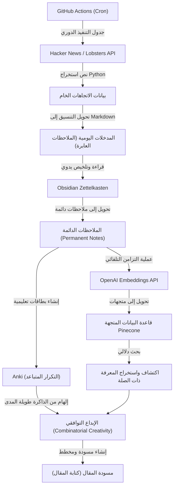

عند إدارة مدونة تقنية كمهندس أو باحث، هناك عقبة حتمية ستواجهها، وهي "نفاد الأفكار". حتى لو سارت كتابة المقالات الأولى بسلاسة، فليس من النادر أن تعاني بمرور الوقت من القلق بشأن "ماذا يجب أن أكتب بعد ذلك؟" أو "نقص هائل في المدخلات لإنتاج المخرجات". تعتمد كتابة المدونة التقنية بشكل كبير ليس فقط على مهارات الكتابة بحد ذاتها، بل على تصميم نظام متكامل لجمع المعرفة اليومية، تنظيمها، ودمجها لخلق قيمة جديدة.

في هذا المقال، سنشرح بتفصيل فني دقيق **نظام استخراج الأفكار وإدارة المخرجات والمدخلات** لإنتاج أفكار للمقالات التقنية بشكل شبه دائم. سنبدأ ببناء آلية لاستخراج المواضيع الرائجة تلقائيًا باستخدام واجهات برمجة التطبيقات (APIs) من مصادر معلومات عالية الجودة مثل Hacker News و Lobsters، وجدولتها باستخدام GitHub Actions. بعد ذلك، سننظم المعلومات التي تم جمعها كمعرفة باستخدام طريقة Zettelkasten مع Obsidian، ونبني نظامًا متقدمًا لإدارة المعرفة الشخصية (PKM) يتيح البحث الدلالي (Semantic Search) من خلال دمج Embeddings API من OpenAI مع قاعدة بيانات متجهة (Pinecone).

علاوة على ذلك، لتعويض حدود الذاكرة البشرية، سنمارس التكرار المتباعد (Spaced Repetition) بناءً على منحنى النسيان لإبنجهاوس باستخدام تطبيق Anki. وسنتعمق في عملية تحويل المعرفة الراسخة إلى أفكار جديدة من خلال "الإبداع التوافقي" (Combinatorial Creativity)، مع تقديم نماذج رياضية محددة وأمثلة تنفيذية لنصوص Python.

## 1. إنتروبيا المعلومات وآلية "نفاد الأفكار"

لماذا نعاني من "نفاد الأفكار"؟ من منظور نظرية المعلومات، يمكن القول إن "كمية المعلومات" في نظام المعرفة لدينا قد نضبت، أو أصبحت متجانسة.

تعبر إنتروبيا المعلومات $H(X)$، التي اقترحها كلود شانون، عن درجة عدم اليقين (أو المفاجأة) للمعلومات التي يتم الحصول عليها من مصدر المعلومات.

$$ H(X) = - \sum_{i=1}^{n} P(x_i) \log_2 P(x_i) $$

هنا، $X$ هو متغير عشوائي للموضوع الذي يتم الحصول عليه من مصدر المعلومات، و $P(x_i)$ هو احتمال مواجهة هذا الموضوع $x_i$. إذا كنت تزور دائمًا نفس المواقع الإلكترونية (مثل مواقع إخبارية محلية معينة أو توثيقات لنفس حزمة التكنولوجيا)، فإن احتمالية $P(x_i)$ معينة سترتفع بشكل كبير، مما يؤدي إلى انخفاض الإنتروبيا الإجمالية للنظام $H(X)$. انخفاض الإنتروبيا يعني حالة "عدم وجود اكتشافات (مفاجآت) جديدة"، وهذا هو السبب الجذري لـ "نفاد الأفكار".

للحفاظ على إنتروبيا عالية، من الضروري إدخال مصادر معلومات لا تتعامل معها عادةً بشكل متعمد كـ "ضوضاء"، وتسوية توزيع الاحتمالات للتعرض لمواضيع غير معروفة. هذا هو السبب الرئيسي لأتمتة الحصول على مدخلات من مصادر معلومات متنوعة.

## 2. بناء مسار مؤتمت لجمع المعلومات: Hacker News & Lobsters API

للحصول على مدخلات عالية الجودة، من الفعال استخراج المعلومات الرائجة من مجتمعات هندسية عالية الجودة وقليلة الضوضاء. تعتبر Hacker News (التي تديرها Y Combinator) و Lobsters أماكن مثالية للنقاشات التقنية العميقة. ومع ذلك، فإن تصفح هذه المواقع يوميًا يستغرق وقتًا ويستهلك موارد معرفية.

لذلك، سنكتب نصًا برمجيًا (Script) بلغة Python لاستخراج المقالات التي تتجاوز درجة معينة تلقائيًا من واجهات برمجة التطبيقات (APIs) الخاصة بهذه المواقع.

### نص Python لاستخراج المقالات الرائجة

يقوم النص البرمجي التالي بجلب المقالات التي تلبي معايير معينة من Firebase API الخاص بـ Hacker News وموجز JSON الخاص بـ Lobsters، وإخراجها كملف Markdown.

```python
import requests
import json
from datetime import datetime
import os

# الإعدادات
HN_TOPSTORIES_URL = "https://hacker-news.firebaseio.com/v0/topstories.json"
HN_ITEM_URL = "https://hacker-news.firebaseio.com/v0/item/{}.json"
LOBSTERS_URL = "https://lobste.rs/hottest.json"
MIN_HN_SCORE = 100
MIN_LOBSTERS_SCORE = 10
OUTPUT_DIR = "./daily_inputs"

def get_hacker_news_trends():
    """الحصول على أفضل المقالات ذات التقييم العالي من Hacker News"""
    print("Fetching Hacker News top stories...")
    response = requests.get(HN_TOPSTORIES_URL)
    if response.status_code != 200:
        return []
    
    story_ids = response.json()[:30] # التقييد بأفضل 30 مقال
    trending_stories = []
    
    for story_id in story_ids:
        item_resp = requests.get(HN_ITEM_URL.format(story_id))
        if item_resp.status_code == 200:
            item = item_resp.json()
            if item and item.get("score", 0) >= MIN_HN_SCORE:
                trending_stories.append({
                    "title": item.get("title"),
                    "url": item.get("url", f"https://news.ycombinator.com/item?id={story_id}"),
                    "score": item.get("score"),
                    "source": "Hacker News"
                })
    return trending_stories

def get_lobsters_trends():
    """الحصول على المقالات ذات التقييم العالي من Lobsters"""
    print("Fetching Lobsters hottest stories...")
    response = requests.get(LOBSTERS_URL)
    if response.status_code != 200:
        return []
    
    items = response.json()
    trending_stories = []
    
    for item in items:
        if item.get("score", 0) >= MIN_LOBSTERS_SCORE:
            trending_stories.append({
                "title": item.get("title"),
                "url": item.get("url", item.get("comments_url")),
                "score": item.get("score"),
                "source": "Lobsters"
            })
    return trending_stories

def save_to_markdown(stories):
    """حفظ المقالات التي تم الحصول عليها كملف Markdown"""
    if not os.path.exists(OUTPUT_DIR):
        os.makedirs(OUTPUT_DIR)
        
    today_str = datetime.now().strftime("%Y-%m-%d")
    filepath = os.path.join(OUTPUT_DIR, f"trends_{today_str}.md")
    
    with open(filepath, "w", encoding="utf-8") as f:
        f.write(f"# Daily Tech Trends: {today_str}\n\n")
        for story in stories:
            f.write(f"## [{story['title']}]({story['url']})\n")
            f.write(f"- **Source**: {story['source']}\n")
            f.write(f"- **Score**: {story['score']}\n")
            f.write(f"- **Notes**: (أضف أفكارك وملاحظاتك هنا)\n\n")
            
    print(f"Saved {len(stories)} stories to {filepath}")

if __name__ == "__main__":
    hn_stories = get_hacker_news_trends()
    lobsters_stories = get_lobsters_trends()
    all_stories = hn_stories + lobsters_stories
    
    # الترتيب تنازلياً حسب التقييم
    all_stories.sort(key=lambda x: x["score"], reverse=True)
    save_to_markdown(all_stories)
```

يوفر هذا النص البرمجي قيمة تتجاوز مجرد كونه قارئ RSS بسيط. فمن خلال التصفية حسب النتيجة (Score)، يمكنك استخراج المواضيع التقنية التي يوليها المجتمع اهتمامًا حقيقيًا (إشارة عالية الجودة وقليلة الضوضاء).

## 3. الجدولة والأتمتة باستخدام GitHub Actions

تشغيل هذا النص البرمجي يدويًا كل يوم أمر مزعج. أساس الأتمتة هو تقليل التدخل البشري إلى أدنى حد ممكن. سنستخدم ميزة Cron في GitHub Actions لجدولة تنفيذ النص البرمجي يوميًا في وقت محدد وإجراء التزام (Commit) للنتائج في المستودع تلقائيًا.

قم بإنشاء `.github/workflows/daily_trends.yml` في جذر المشروع واكتب ما يلي:

```yaml
name: Daily Tech Trends Scraper

on:
  schedule:
    - cron: '0 0 * * *' # التنفيذ يوميًا الساعة 0:00 UTC
  workflow_dispatch: # للتشغيل اليدوي

jobs:
  scrape-and-commit:
    runs-on: ubuntu-latest
    steps:
      - name: Checkout Repository
        uses: actions/checkout@v3
        
      - name: Setup Python
        uses: actions/setup-python@v4
        with:
          python-version: '3.10'
          
      - name: Install Dependencies
        run: |
          python -m pip install --upgrade pip
          pip install requests
          
      - name: Run Scraper Script
        run: python scripts/fetch_trends.py
        
      - name: Commit and Push Changes
        run: |
          git config --local user.email "action@github.com"
          git config --local user.name "GitHub Action"
          git add daily_inputs/
          git commit -m "Auto-update daily tech trends [skip ci]" || echo "No changes to commit"
          git push
```

وبهذا، في كل صباح عندما تفتح Obsidian، ستكون المواضيع المهمة لهذا اليوم قد أُضيفت تلقائيًا كملفات Markdown في مجلد صندوق الوارد الخاص بك (`daily_inputs/`).

## 4. ربط المعرفة في شبكة باستخدام Zettelkasten و Obsidian

المعلومات التي تم جمعها تلقائيًا لا تزال مجرد "بيانات". هناك حاجة إلى عملية لتحويلها إلى "معرفة". هنا يأتي دور طريقة Zettelkasten وتطبيق Obsidian.

Zettelkasten هي طريقة لتدوين الملاحظات ابتكرها عالم الاجتماع الألماني نيكلاس لومان. بدلاً من تصنيف الملاحظات في مجلدات هرمية، تُحفظ كل ملاحظة بشكل صغير ومستقل (ذري)، ويتم ربط الملاحظات ببعضها من خلال الروابط لبناء شبكة من المعرفة تشبه الشبكات العصبية في الدماغ.

توجد بشكل أساسي 3 أنواع من الملاحظات في Zettelkasten:
1. **الملاحظات العابرة (Fleeting Notes)**: لتسجيل الأفكار أو المعلومات التي يتم جمعها مؤقتًا. معلومات الاتجاهات (Trends) بتنسيق Markdown التي قمنا بإنشائها تلقائيًا تندرج تحت هذه الفئة.
2. **الملاحظات الأدبية (Literature Notes)**: ملخصات المقالات أو الكتب بكلماتك الخاصة بعد قراءتها.
3. **الملاحظات الدائمة (Permanent Notes)**: أفكار مكتملة حول موضوع معين. وهي تعتبر البذور المباشرة لمقالات المدونة.

باستخدام ميزة الروابط المرجعية (Backlinks) في Obsidian (مثل `[[اسم الملاحظة]]`)، يمكنك على سبيل المثال ربط ملاحظة "الملكية في لغة Rust" بملاحظة "تاريخ تجميع القمامة (Garbage Collection)"، مما قد يؤدي إلى اكتشاف روابط وأفكار غير متوقعة.

## 5. البحث الدلالي باستخدام قاعدة البيانات المتجهة (Pinecone) و OpenAI Embeddings

عندما يزداد عدد الملاحظات إلى المئات أو الآلاف، يصبح من الصعب العثور على الملاحظة المطلوبة بمجرد البحث بالكلمات الرئيسية (النص الكامل). يبرز هنا دور البحث الدلالي (Semantic Search) باستخدام التضمينات (Embeddings) في النماذج اللغوية الكبيرة (LLMs)، وهو مفيد جدًا عندما تقول: "لا أتذكر الكلمات الرئيسية، لكنني أريد العثور على ملاحظة تشبه هذا المفهوم".

باستخدام نموذج `text-embedding-ada-002` (أو `text-embedding-3-small`) من OpenAI، نقوم بتحويل كل ملاحظة Markdown في Obsidian إلى متجه متعدد الأبعاد (مصفوفة أرقام من مئات إلى آلاف الأبعاد). في هذه المساحة المتجهة، تكون الجمل ذات المعاني المتقاربة قريبة من بعضها من حيث المسافة المادية أيضًا.

لقياس التشابه بين المتجهات، يُستخدم تشابه جيب التمام (Cosine Similarity) على نطاق واسع.

$$ \text{similarity} = \cos(\theta) = \frac{\mathbf{A} \cdot \mathbf{B}}{\|\mathbf{A}\| \|\mathbf{B}\|} = \frac{\sum_{i=1}^{n} A_i B_i}{\sqrt{\sum_{i=1}^{n} A_i^2} \sqrt{\sum_{i=1}^{n} B_i^2}} $$

$\mathbf{A}$ و $\mathbf{B}$ هما متجهات سلسلة الاستعلام وملاحظة على التوالي. لإجراء هذا الحساب بسرعة، نستخدم قواعد البيانات المتجهة مثل Pinecone أو Qdrant.

### مثال على تنفيذ البحث الدلالي

إليك جزء من نص Python يمسح دليل الملاحظات في Obsidian، ويقوم بتحويلها إلى متجهات باستخدام OpenAI API، ثم يقوم بإدراجها/تحديثها (Upsert) في Pinecone.

```python
import os
import glob
from openai import OpenAI
from pinecone import Pinecone, ServerlessSpec

# إعداد مفاتيح API (تم الحصول عليها من متغيرات البيئة)
OPENAI_API_KEY = os.getenv("OPENAI_API_KEY")
PINECONE_API_KEY = os.getenv("PINECONE_API_KEY")

client = OpenAI(api_key=OPENAI_API_KEY)
pc = Pinecone(api_key=PINECONE_API_KEY)

INDEX_NAME = "obsidian-notes"
OBSIDIAN_DIR = "/path/to/obsidian/vault/PermanentNotes"

def init_pinecone():
    """تهيئة فهرس Pinecone"""
    if INDEX_NAME not in pc.list_indexes().names():
        pc.create_index(
            name=INDEX_NAME,
            dimension=1536, # الأبعاد الخاصة بـ text-embedding-3-small / ada-002
            metric="cosine",
            spec=ServerlessSpec(cloud="aws", region="us-east-1")
        )
    return pc.Index(INDEX_NAME)

def get_embedding(text):
    """تحويل النص إلى متجهات باستخدام OpenAI API"""
    response = client.embeddings.create(
        input=text,
        model="text-embedding-3-small"
    )
    return response.data[0].embedding

def sync_notes_to_pinecone(index):
    """قراءة ملفات Markdown، وتحويلها إلى متجهات، وحفظها في Pinecone"""
    md_files = glob.glob(os.path.join(OBSIDIAN_DIR, "*.md"))
    
    vectors = []
    for filepath in md_files:
        filename = os.path.basename(filepath)
        with open(filepath, "r", encoding="utf-8") as f:
            content = f.read()
            
        # المعالجة فقط إذا كان محتوى الملاحظة غير فارغ
        if content.strip():
            print(f"Embedding note: {filename}")
            embedding = get_embedding(content)
            
            # صيغة Pinecone (id, vector, metadata)
            vectors.append({
                "id": filename,
                "values": embedding,
                "metadata": {"text": content[:500]} # جزء من النص لعرضه في نتائج البحث
            })
            
    # الإدراج/التحديث كدفعة واحدة (Batch)
    if vectors:
        index.upsert(vectors=vectors)
        print(f"Successfully upserted {len(vectors)} notes.")

def search_similar_ideas(index, query_text, top_k=3):
    """البحث عن ملاحظات مشابهة للاستعلام لاستخراج الأفكار"""
    query_embedding = get_embedding(query_text)
    
    results = index.query(
        vector=query_embedding,
        top_k=top_k,
        include_metadata=True
    )
    
    print(f"\n--- Search Results for: '{query_text}' ---")
    for match in results["matches"]:
        print(f"Score: {match['score']:.4f} | Note: {match['id']}")
        print(f"Preview: {match['metadata']['text'][:100]}...\n")

if __name__ == "__main__":
    idx = init_pinecone()
    # عند التشغيل الأول، قم باستدعاء sync_notes_to_pinecone(idx) لإنشاء قاعدة البيانات
    sync_notes_to_pinecone(idx)
    
    # البحث من أجل توليد أفكار للمدونة
    search_similar_ideas(idx, "تسريع الاستدلال في التعلم الآلي على المتصفح باستخدام WebAssembly")
```

باستخدام هذا النظام، إذا تساءلت: "أريد أن أكتب عن 'WebAssembly' الذي كان شائعًا على Hacker News هذا الأسبوع، لكن هل كتبت أي ملاحظات متعلقة به في الماضي؟"، سيقوم الذكاء الاصطناعي على الفور باختيار الملاحظات الدائمة (Permanent Notes) السابقة ذات الصلة الدلالية. يتيح ذلك بناء مقالة عميقة تستفيد بشكل كامل من أصولك المعرفية السابقة.

## 6. منحنى النسيان لإبنجهاوس والتكرار المتباعد باستخدام Anki

مهما كانت جودة المعرفة التي تسجلها في ملاحظاتك، فإذا لم تترسخ هذه المعرفة في عقلك ككاتب، فسيكون من الصعب عليك ربط مفاهيم متعددة بطلاقة أثناء الكتابة. هنا يظهر "منحنى النسيان لإبنجهاوس"، والذي يمثل نموذجًا رياضيًا لآلية الذاكرة البشرية.

يمكن تقريب منحنى النسيان بالمعادلة التالية:

$$ R = e^{-\frac{t}{S}} $$

حيث أن:
- $R$ هو معدل الاحتفاظ بالذاكرة (Retrievability، ويتراوح من 0 إلى 1)
- $t$ هو الوقت المنقضي منذ التعلم
- $S$ هو استقرار الذاكرة (Stability) أو قوتها

مباشرة بعد تعلم مفهوم جديد، يكون $S$ صغيرًا، وينخفض $R$ (النسيان) بسرعة مع مرور الوقت $t$. ومع ذلك، إذا قمت بالمراجعة (Recall) في التوقيت المثالي قبل أن تنسى، فإن سرعة النسيان في المرة القادمة ستتباطأ (يصبح $S$ أكبر)، وتترسخ المعرفة كذاكرة طويلة المدى.

البرنامج الذي يحسب آليًا أوقات المراجعة المثلى بناءً على خوارزميات (مثل SuperMemo 2) ويقدمها كبطاقات تعليمية (Flashcards) هو "Anki".

كطريقة فعالة لتوليد أفكار للمدونات التقنية، يمكن **تحويل محتويات الملاحظات الدائمة (Permanent Notes) في Obsidian إلى بطاقات تعليمية في Anki**.
على سبيل المثال، يمكنك تسجيل أسئلة تتعلق بأسس التقنية في Anki مثل: "ما هي العناصر الثلاثة لنظرية CAP؟" أو "لماذا يمتلك فهرس B-Tree أداء بحث يبلغ O(log N)؟" ومراجعتها كروتين يومي. عندما تُفهرس المعرفة في عقلك كذاكرة طويلة المدى، يتم ربط المعلومات في اللاوعي أثناء الاستحمام أو المشي، مما يولد لحظات إلهام (Eureka moments) مثل: "آه، يمكنني كتابة مقال حول خوارزميات الإجماع في الأنظمة الموزعة".

## 7. الإبداع التوافقي (Combinatorial Creativity)

عبر المسار السابق، قمنا بتحقيق "توفير مدخلات متنوعة"، "التنظيم والبحث بالذكاء الاصطناعي عبر Zettelkasten"، و "ترسيخ الذاكرة طويلة المدى باستخدام Anki". الخطوة الأخيرة هي "الإبداع التوافقي" (Combinatorial Creativity)، والذي يولد أفكارًا مبتكرة تمامًا لمقالات تقنية من خلال دمج هذه العناصر معًا.

لا ينشأ الابتكار والإبداع من العدم، بل من توليفات جديدة للعناصر الحالية. تشتهر مقولة ستيف جوبز: "الإبداع هو مجرد ربط الأشياء ببعضها" (Creativity is just connecting things).

بالنسبة لمدونة تقنية، يمكن التفكير في مصفوفة التركيبات التالية:

1. **[تقنية قديمة] × [نموذج جديد]**: مثال "أنماط التصميم المضادة (Anti-patterns) لمعمارية الخدمات المصغرة الحديثة نتعلمها من معمارية COBOL"
2. **[الواجهة الأمامية] × [مفاهيم الواجهة الخلفية]**: مثال "شرح خوارزمية تحديث DOM الافتراضي في React من منظور مستويات عزل المعاملات في قواعد البيانات"
3. **[نظرية رياضية مجردة] × [تنفيذ عملي]**: مثال "استخدام نظرية المخططات (Graph Theory) لتحسين جدولة Pods في Kubernetes"

لإحداث مثل هذه التركيبات بشكل متعمد، يمكنك الاستفادة من نظام البحث الدلالي Pinecone الذي بنيناه سابقًا لاستخراج مفهومين عشوائيين "أ" و "ب"، ومطالبة الذكاء الاصطناعي (مثل ChatGPT): "اقترح 5 عناوين مقالات مدونة تقنية مع مسودة جداول المحتويات الخاصة بها من خلال الجمع بين هذين المفهومين". سيسمح لك هذا بتوليد أفكار غير متوقعة لم تكن لتفكر فيها بنفسك، وبطريقة لا حصر لها.

## 8. معمارية النظام العام

فيما يلي مخطط تدفقي باستخدام Mermaid يلخص معمارية النظام ككل للحفاظ على استمرار الأفكار لمقالات المدونة، بدءًا من "جمع المعلومات وحتى توليد الأفكار".



من أبرز ميزات هذا النظام هو **الفصل التام بين "المهام الفكرية التي يجب القيام بها يدويًا (كالتلخيص، التفكير، الكتابة)" وبين "المهام التي يمكن تفويضها للآلات (كالجمع، البحث، جدولة التكرار المتباعد)"**. بفضل هذا، يمكن للكاتب أن يركز كل جهده على أكثر الأنشطة قيمة، وهي "التفكير" و "الدمج".

## 9. نموذج انتقال الحالة من الفكرة إلى النشر

يمكن التعبير عن دورة حياة الفكرة المتراكمة في Zettelkasten وصولًا إلى النشر كمنشور مدونة من خلال مخطط انتقال الحالة التالي. يتم استخدام الأدوات والأساليب المناسبة لكل حالة.

```mermaid
stateDiagram-v2
    [*] --> Capture["التقاط الأفكار (جمع المعلومات)"]
    
    Capture["التقاط الأفكار (جمع المعلومات)"] --> Fleeting["ملاحظات عابرة (مذكرات مؤقتة)"]
    Fleeting["ملاحظات عابرة (مذكرات مؤقتة)"] --> Permanent["ملاحظات دائمة (Permanent Notes)"]
    
    Permanent["ملاحظات دائمة (Permanent Notes)"] --> Brainstorming["عصف ذهني (بحث دلالي بالذكاء الاصطناعي)"]
    Permanent["ملاحظات دائمة (Permanent Notes)"] --> Memorization["تذكر (مراجعة باستخدام Anki)"]
    Memorization["تذكر (مراجعة باستخدام Anki)"] --> Brainstorming["عصف ذهني (بحث دلالي بالذكاء الاصطناعي)"]
    
    Brainstorming["عصف ذهني (بحث دلالي بالذكاء الاصطناعي)"] --> Outlining["مخطط (إنشاء الهيكل وجدول المحتويات)"]
    Outlining["مخطط (إنشاء الهيكل وجدول المحتويات)"] --> Drafting["صياغة (كتابة المسودة الأولى)"]
    
    Drafting["صياغة (كتابة المسودة الأولى)"] --> Review["مراجعة وتحرير (التنقيح والتدقيق اللغوي)"]
    Review["مراجعة وتحرير (التنقيح والتدقيق اللغوي)"] --> Published["منشور (نشر المدونة)"]
    
    Published["منشور (نشر المدونة)"] --> [*]
```



بفضل هذا الوعي بمسار العمل، يمكنك تحديد "في أي مرحلة أنت عالق الآن؟" بوضوح. عندما تواجه صعوبة في إنتاج الأفكار، يمكنك ببساطة العودة إلى مرحلتي "Capture" أو "Permanent" والتأكد من أن خط أنابيب المدخلات يعمل بشكل صحيح.

## الخلاصة: الكتابة هي "نظام"

"نفاد الأفكار للمدونات التقنية" لا يعود إلى نقص في قدرات الفرد أو انخفاض في حماسه، بل هو **نتيجة حتمية لعدم بناء نظام لتدوير المعرفة**.

كما تم الشرح في هذا المقال:
1. تأمين مدخلات عالية الجودة وقليلة الضوضاء عبر **واجهات برمجة التطبيقات (APIs) والأتمتة**
2. شبكة المعرفة باستخدام طريقة Zettelkasten عبر **Obsidian**
3. البحث الدلالي في أصولك المعرفية باستخدام **OpenAI و Pinecone**
4. تقوية فهرسة الدماغ عبر **Anki** ومنحنى النسيان لإبنجهاوس
5. **الإبداع التوافقي** من خلال دمج المفاهيم الحالية

من خلال بناء مسار شامل يجمع هذه العناصر، ستجد أن أفكار مدونتك لا تنفد؛ بل على العكس، كلما كتبت أكثر، تولدت المزيد من الأفكار بشكل متزايد ذاتيًا.

لا حاجة لبناء النظام كله بشكل مثالي من البداية. يمكنك البدء بإنشاء نص برمجي بسيط يستدعي Hacker News API، واكتساب عادة تدوين الملاحظات حول المقالات المثيرة للاهتمام بصيغة Markdown. نأمل أن تصبح مدونتك التقنية مصدرًا رائدًا لأفكار متميزة في المستقبل.
