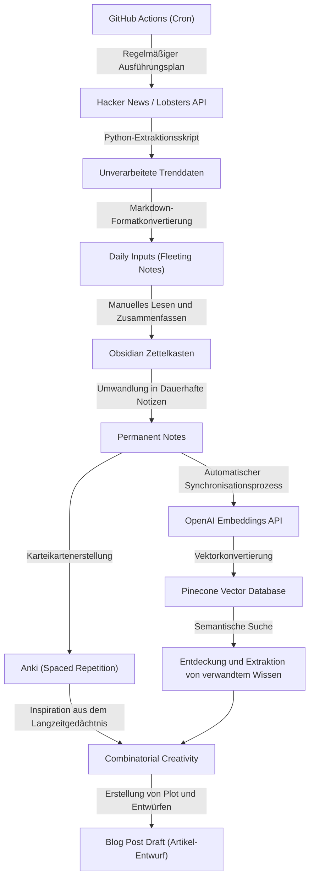

Wenn man als Ingenieur oder Forscher einen Technik-Blog betreibt, stößt man fast unweigerlich auf eine bestimmte Hürde: das "Ausgehen der Ideen". Während sich die ersten Artikel oft noch problemlos schreiben lassen, ist es nicht ungewöhnlich, dass man im Laufe der Zeit von Sorgen wie "Ich weiß nicht, was ich als Nächstes schreiben soll" oder "Mir fehlt massiv der Input für meinen Output" geplagt wird. Das Schreiben für einen Technik-Blog hängt nicht nur von der Fähigkeit ab, Texte zu verfassen, sondern maßgeblich von einem Systemdesign, das das tägliche Sammeln, Strukturieren und Kombinieren von Wissen zu neuem Wert umfasst.

In diesem Artikel werde ich äußerst detailliert und technisch eine **systematisierte Input- und Output-Pipeline** erläutern, mit der sich nahezu unbegrenzt neue Ideen für technische Artikel generieren lassen. Wir beginnen mit einem Mechanismus, der mithilfe von APIs automatisch Trendthemen aus hochwertigen internationalen Informationsquellen wie Hacker News oder Lobsters extrahiert und regelmäßig über GitHub Actions ausgeführt wird. Anschließend bauen wir ein fortschrittliches System für persönliches Wissensmanagement (PKM) auf. Dabei werden die gesammelten Informationen mit der Zettelkasten-Methode in Obsidian als Wissen systematisiert und durch die Kombination der Embeddings-API von OpenAI mit Pinecone (einer Vektordatenbank) eine semantische Suche ermöglicht.

Um die Grenzen des menschlichen Gedächtnisses auszugleichen, setzen wir zudem auf die sogenannte verteilte Wiederholung (Spaced Repetition) auf Basis der Ebbinghaus'schen Vergessenskurve, welche wir mit Anki praktizieren. Den gesamten Prozess – von der Verankerung des Wissens bis hin zur Sublimierung in neue Ideen durch "kombinatorische Kreativität" – werden wir anhand konkreter mathematischer Modelle und Implementierungsbeispiele von Python-Skripten tiefgehend untersuchen.

## 1. Informationsentropie und der Mechanismus des "Ideenmangels"

Warum gehen uns eigentlich die Ideen aus? Aus informationstheoretischer Sicht kann man sagen, dass der "Informationsgehalt" unseres vorhandenen Wissenssystems erschöpft oder homogenisiert ist.

Die von Claude Shannon eingeführte Informationsentropie $H(X)$ beschreibt die Unsicherheit (oder den Überraschungsgrad) der aus einer Informationsquelle gewonnenen Informationen.

$$ H(X) = - \sum_{i=1}^{n} P(x_i) \log_2 P(x_i) $$

Hierbei ist $X$ die Zufallsvariable für ein aus der Informationsquelle gewonnenes Thema und $P(x_i)$ die Wahrscheinlichkeit, diesem Thema $x_i$ zu begegnen. Wenn man regelmäßig ähnliche Websites besucht (z. B. bestimmte inländische Nachrichtenseiten oder immer nur die Dokumentation zum selben Technologie-Stack), wird ein spezifisches $P(x_i)$ extrem hoch, was zu einem Absinken der Entropie des gesamten Systems $H(X)$ führt. Ein Zustand niedriger Entropie bedeutet, dass es "keine neuen Entdeckungen (Überraschungen)" gibt, und genau das ist die Hauptursache für den Ideenmangel.

Um die Entropie hoch zu halten, muss man bewusst Informationsquellen, mit denen man normalerweise nicht in Kontakt kommt, als "Rauschen" einbeziehen und die Wahrscheinlichkeitsverteilung für das Aufeinandertreffen mit unbekannten Themen ausgleichen. Dies ist der wichtigste Grund, warum man den Input aus vielfältigen Informationsquellen automatisieren sollte.

## 2. Aufbau einer automatisierten Pipeline zur Informationssammlung: Hacker News & Lobsters API

Um hochwertigen Input zu erhalten, ist es effektiv, Trendinformationen aus qualitativ hochwertigen Entwickler-Communities mit wenig Rauschen zu extrahieren. Hacker News (betrieben von Y Combinator) und Lobsters eignen sich ideal als Orte für tiefgreifende technische Diskussionen. Es kostet jedoch viel Zeit und kognitive Ressourcen, diese Seiten täglich manuell zu überprüfen.

Daher erstellen wir ein Skript in Python, das über die entsprechenden APIs automatisch Artikel extrahiert, die eine bestimmte Punktzahl (Score) überschreiten.

### Python-Skript zur Extraktion von Trendartikeln

Das folgende Skript ruft Artikel, die bestimmten Kriterien entsprechen, aus der Firebase-API von Hacker News sowie aus dem JSON-Feed von Lobsters ab und gibt diese als Markdown-Datei aus.

```python
import requests
import json
from datetime import datetime
import os

# Konfiguration
HN_TOPSTORIES_URL = "https://hacker-news.firebaseio.com/v0/topstories.json"
HN_ITEM_URL = "https://hacker-news.firebaseio.com/v0/item/{}.json"
LOBSTERS_URL = "https://lobste.rs/hottest.json"
MIN_HN_SCORE = 100
MIN_LOBSTERS_SCORE = 10
OUTPUT_DIR = "./daily_inputs"

def get_hacker_news_trends():
    """Ruft Top-Artikel mit hohem Score von Hacker News ab"""
    print("Fetching Hacker News top stories...")
    response = requests.get(HN_TOPSTORIES_URL)
    if response.status_code != 200:
        return []
    
    story_ids = response.json()[:30] # Auf die Top 30 beschränken
    trending_stories = []
    
    for story_id in story_ids:
        item_resp = requests.get(HN_ITEM_URL.format(story_id))
        if item_resp.status_code == 200:
            item = item_resp.json()
            if item and item.get("score", 0) >= MIN_HN_SCORE:
                trending_stories.append({
                    "title": item.get("title"),
                    "url": item.get("url", f"https://news.ycombinator.com/item?id={story_id}"),
                    "score": item.get("score"),
                    "source": "Hacker News"
                })
    return trending_stories

def get_lobsters_trends():
    """Ruft Artikel mit hohem Score von Lobsters ab"""
    print("Fetching Lobsters hottest stories...")
    response = requests.get(LOBSTERS_URL)
    if response.status_code != 200:
        return []
    
    items = response.json()
    trending_stories = []
    
    for item in items:
        if item.get("score", 0) >= MIN_LOBSTERS_SCORE:
            trending_stories.append({
                "title": item.get("title"),
                "url": item.get("url", item.get("comments_url")),
                "score": item.get("score"),
                "source": "Lobsters"
            })
    return trending_stories

def save_to_markdown(stories):
    """Speichert die abgerufenen Artikel als Markdown-Datei"""
    if not os.path.exists(OUTPUT_DIR):
        os.makedirs(OUTPUT_DIR)
        
    today_str = datetime.now().strftime("%Y-%m-%d")
    filepath = os.path.join(OUTPUT_DIR, f"trends_{today_str}.md")
    
    with open(filepath, "w", encoding="utf-8") as f:
        f.write(f"# Daily Tech Trends: {today_str}\n\n")
        for story in stories:
            f.write(f"## [{story['title']}]({story['url']})\n")
            f.write(f"- **Source**: {story['source']}\n")
            f.write(f"- **Score**: {story['score']}\n")
            f.write(f"- **Notes**: (Fügen Sie hier Ihre Überlegungen hinzu)\n\n")
            
    print(f"Saved {len(stories)} stories to {filepath}")

if __name__ == "__main__":
    hn_stories = get_hacker_news_trends()
    lobsters_stories = get_lobsters_trends()
    all_stories = hn_stories + lobsters_stories
    
    # Absteigend nach Score sortieren
    all_stories.sort(key=lambda x: x["score"], reverse=True)
    save_to_markdown(all_stories)
```

Dieses Skript bietet mehr Mehrwert als ein einfacher RSS-Reader. Durch die Filterung nach dem Score ist es möglich, nur die technischen Themen zu extrahieren, die in der Community wirklich Aufmerksamkeit erregen (hohes Signal bei geringem Rauschen).

## 3. Planung und Automatisierung mit GitHub Actions

Das erstellte Python-Skript jeden Tag manuell auszuführen, wäre mühsam. Die Grundidee der Automatisierung ist es, menschliche Eingriffe auf ein absolutes Minimum zu reduzieren. Mithilfe der Cron-Funktion von GitHub Actions bauen wir einen Mechanismus auf, der das Skript täglich zu einer festgelegten Zeit ausführt und die Ergebnisse automatisch in das Repository committet.

Erstellen Sie im Projekt-Root die Datei `.github/workflows/daily_trends.yml` und fügen Sie Folgendes ein:

```yaml
name: Daily Tech Trends Scraper

on:
  schedule:
    - cron: '0 0 * * *' # Täglich um 0:00 Uhr UTC ausführen
  workflow_dispatch: # Für manuelle Ausführung

jobs:
  scrape-and-commit:
    runs-on: ubuntu-latest
    steps:
      - name: Checkout Repository
        uses: actions/checkout@v3
        
      - name: Setup Python
        uses: actions/setup-python@v4
        with:
          python-version: '3.10'
          
      - name: Install Dependencies
        run: |
          python -m pip install --upgrade pip
          pip install requests
          
      - name: Run Scraper Script
        run: python scripts/fetch_trends.py
        
      - name: Commit and Push Changes
        run: |
          git config --local user.email "action@github.com"
          git config --local user.name "GitHub Action"
          git add daily_inputs/
          git commit -m "Auto-update daily tech trends [skip ci]" || echo "No changes to commit"
          git push
```

Dadurch entsteht ein Zustand, bei dem jeden Morgen beim Öffnen von Obsidian automatisch die wichtigsten Themen des Tages als Markdown-Dateien in Ihrem Posteingang (`daily_inputs/`) landen.

## 4. Wissensvernetzung mit Zettelkasten und Obsidian

Die automatisch gesammelten Informationen sind zunächst nicht mehr als bloße "Daten". Es bedarf eines Prozesses, um sie zu "Wissen" zu veredeln. Genau hier kommen die Zettelkasten-Methode und Obsidian ins Spiel.

Der Zettelkasten ist eine Methode zur Notizerstellung, die von dem deutschen Soziologen Niklas Luhmann entwickelt wurde. Anstatt Notizen hierarchisch in Ordnern zu kategorisieren, hält man einzelne Notizen klein (atomar) und verknüpft sie untereinander durch Links. Auf diese Weise baut man ein Wissensnetzwerk auf, das den neuronalen Schaltkreisen des Gehirns ähnelt.

Im Zettelkasten-System gibt es hauptsächlich drei Arten von Notizen:
1. **Flüchtige Notizen (Fleeting Notes)**: Dienen dazu, Einfälle oder gesammelte Informationen vorübergehend festzuhalten. Das zuvor automatisch generierte Markdown mit den Trendinformationen fällt in diese Kategorie.
2. **Literatur-Notizen (Literature Notes)**: Zusammenfassungen in eigenen Worten von gelesenen Artikeln oder Büchern.
3. **Dauerhafte Notizen (Permanent Notes)**: Abgeschlossene Überlegungen, die zu einem bestimmten Thema aufgeschrieben wurden. Diese bilden oft den direkten Keim für zukünftige Blogartikel.

Durch die Nutzung der Backlink-Funktion (`[[Notizname]]`) von Obsidian kann man beispielsweise eine Notiz über "Ownership in Rust" mit einer Notiz über die "Geschichte der Garbage Collection" verknüpfen und so völlig unerwartete ideelle Zusammenhänge entdecken.

## 5. Semantische Suche mit einer Vektordatenbank (Pinecone) und OpenAI Embeddings

Wenn die Anzahl der Notizen auf Hunderte oder Tausende ansteigt, wird es schwierig, mit einer reinen Stichwortsuche (Volltextsuche) die gewünschte Notiz zu finden. Wenn Sie sich denken: "Ich kann mich an die Schlüsselwörter nicht erinnern, suche aber nach einer Notiz, die konzeptionell ähnlich ist", zeigt die semantische Suche unter Verwendung von Embeddings großer Sprachmodelle (LLMs) ihre wahre Stärke.

Mithilfe des Modells `text-embedding-ada-002` (oder `text-embedding-3-small`) von OpenAI konvertieren wir jede Markdown-Notiz aus Obsidian in einen mehrdimensionalen Vektor (ein Array von Hunderten bis Tausenden von Zahlen). In diesem Vektorraum rücken die Vektoren von Sätzen mit ähnlicher Bedeutung physisch näher zusammen.

Um die Ähnlichkeit zwischen Vektoren zu messen, wird häufig die Kosinus-Ähnlichkeit (Cosine Similarity) verwendet.

$$ \text{similarity} = \cos(\theta) = \frac{\mathbf{A} \cdot \mathbf{B}}{\|\mathbf{A}\| \|\mathbf{B}\|} = \frac{\sum_{i=1}^{n} A_i B_i}{\sqrt{\sum_{i=1}^{n} A_i^2} \sqrt{\sum_{i=1}^{n} B_i^2}} $$

Dabei sind $\mathbf{A}$ und $\mathbf{B}$ die Vektoren des Such-Strings bzw. der Notiz. Um diese Berechnung schnell durchzuführen, verwenden wir eine Vektordatenbank wie Pinecone oder Qdrant.

### Implementierungsbeispiel einer semantischen Suche

Das folgende Python-Skript durchsucht das Notizverzeichnis von Obsidian, vektorisiert die Inhalte mithilfe der OpenAI-API und führt ein Upsert (Einfügen/Aktualisieren) in Pinecone durch.

```python
import os
import glob
from openai import OpenAI
from pinecone import Pinecone, ServerlessSpec

# API-Schlüssel einrichten (aus Umgebungsvariablen lesen)
OPENAI_API_KEY = os.getenv("OPENAI_API_KEY")
PINECONE_API_KEY = os.getenv("PINECONE_API_KEY")

client = OpenAI(api_key=OPENAI_API_KEY)
pc = Pinecone(api_key=PINECONE_API_KEY)

INDEX_NAME = "obsidian-notes"
OBSIDIAN_DIR = "/path/to/obsidian/vault/PermanentNotes"

def init_pinecone():
    """Initialisiert den Pinecone-Index"""
    if INDEX_NAME not in pc.list_indexes().names():
        pc.create_index(
            name=INDEX_NAME,
            dimension=1536, # Dimensionen von text-embedding-3-small / ada-002
            metric="cosine",
            spec=ServerlessSpec(cloud="aws", region="us-east-1")
        )
    return pc.Index(INDEX_NAME)

def get_embedding(text):
    """Konvertiert Text mit der OpenAI API in Vektoren"""
    response = client.embeddings.create(
        input=text,
        model="text-embedding-3-small"
    )
    return response.data[0].embedding

def sync_notes_to_pinecone(index):
    """Liest Markdown-Dateien, vektorisiert sie und speichert sie in Pinecone"""
    md_files = glob.glob(os.path.join(OBSIDIAN_DIR, "*.md"))
    
    vectors = []
    for filepath in md_files:
        filename = os.path.basename(filepath)
        with open(filepath, "r", encoding="utf-8") as f:
            content = f.read()
            
        # Nur verarbeiten, wenn der Inhalt der Notiz nicht leer ist
        if content.strip():
            print(f"Embedding note: {filename}")
            embedding = get_embedding(content)
            
            # Pinecone Format (id, vector, metadata)
            vectors.append({
                "id": filename,
                "values": embedding,
                "metadata": {"text": content[:500]} # Textausschnitt zur Anzeige in Suchergebnissen
            })
            
    # Upsert im Batch-Verfahren
    if vectors:
        index.upsert(vectors=vectors)
        print(f"Successfully upserted {len(vectors)} notes.")

def search_similar_ideas(index, query_text, top_k=3):
    """Sucht nach ähnlichen Notizen zur Abfrage, um Ideen zu generieren"""
    query_embedding = get_embedding(query_text)
    
    results = index.query(
        vector=query_embedding,
        top_k=top_k,
        include_metadata=True
    )
    
    print(f"\n--- Search Results for: '{query_text}' ---")
    for match in results["matches"]:
        print(f"Score: {match['score']:.4f} | Note: {match['id']}")
        print(f"Preview: {match['metadata']['text'][:100]}...\n")

if __name__ == "__main__":
    idx = init_pinecone()
    # Beim ersten Ausführen rufen Sie sync_notes_to_pinecone(idx) auf, um die DB aufzubauen
    sync_notes_to_pinecone(idx)
    
    # Suche zur Ideengenerierung für den Blog
    search_similar_ideas(idx, "Beschleunigung von Machine-Learning-Inferenz im Browser mit WebAssembly")
```

Wenn Sie sich beispielsweise fragen: "Ich möchte über 'WebAssembly' schreiben, worüber diese Woche auf Hacker News gesprochen wurde, aber habe ich in der Vergangenheit bereits verwandte Notizen verfasst?", liefert dieses System sofort semantisch verwandte Permanent Notes aus Ihrer Historie. So wird es möglich, Artikel mit großer Tiefe zu verfassen, die Ihre bisherigen Wissensressourcen optimal ausschöpfen.

## 6. Die Ebbinghaus'sche Vergessenskurve und verteilte Wiederholung mit Anki

Egal, wie exzellentes Wissen Sie in Ihren Notizen festhalten – wenn das Wissen im Gehirn des Autors nicht gefestigt ist, wird es schwierig sein, während des Schreibens verschiedene Konzepte flüssig miteinander zu verbinden. An diesem Punkt kommt die "Ebbinghaus'sche Vergessenskurve" ins Spiel, die den Mechanismus des menschlichen Gedächtnisses mathematisch modelliert.

$$ R = e^{-\frac{t}{S}} $$

Hierbei gilt:
- $R$ ist die Retrievability (Wahrscheinlichkeit des Abrufs, im Bereich von 0 bis 1).
- $t$ ist die seit dem Lernen vergangene Zeit.
- $S$ ist die Stabilität (Stability) oder Stärke des Gedächtnisses.

Direkt nach dem Erlernen eines neuen Konzepts ist $S$ gering und $R$ sinkt rapide mit der Zeit $t$ (Vergessen). Wenn man jedoch zu dem präzisen Zeitpunkt eine Wiederholung (Recall) durchführt, an dem das Wissen fast vergessen ist, verlangsamt sich die Geschwindigkeit des erneuten Vergessens (d.h. $S$ wird größer) und das Wissen verankert sich im Langzeitgedächtnis.

Die Software "Anki" berechnet den optimalen Zeitpunkt für diese Wiederholungen automatisch mithilfe eines Algorithmus (wie z. B. SuperMemo 2) und präsentiert den Inhalt in Form von Karteikarten.

Ein mächtiger Ansatz zur Generierung von Ideen für den Technik-Blog besteht darin, **die Inhalte der Permanent Notes aus Obsidian in Anki-Karteikarten umzuwandeln**.
Sie können beispielsweise grundlegende technische Fragen in Anki aufnehmen, wie: "Was sind die 3 Elemente des CAP-Theorems?" oder "Warum haben B-Tree-Indizes eine Such-Performance von O(log N)?", und diese im Rahmen Ihrer täglichen Routine wiederholen. Sobald das Wissen in Ihrem Langzeitgedächtnis indexiert ist, verknüpfen sich die Informationen beim Duschen oder Spazierengehen unbewusst, und Sie erleben Heureka-Momente wie: "Ah, ich könnte einen Artikel über Konsens-Algorithmen in verteilten Systemen schreiben."

## 7. Kombinatorische Kreativität (Combinatorial Creativity)

Mit der bisherigen Pipeline haben wir den "Input von vielfältigen Informationen", die "Organisation und KI-Suche mittels Zettelkasten" sowie die "Verankerung im Langzeitgedächtnis durch Anki" realisiert. Der letzte Schritt ist die "kombinatorische Kreativität" (Combinatorial Creativity), bei der diese Elemente miteinander verbunden werden, um völlig neuartige Ideen für technische Artikel zu entwickeln.

Innovation und Kreativität entstehen selten aus dem Nichts, sondern durch neue Kombinationen bereits bestehender Elemente. Ein berühmtes Zitat von Steve Jobs lautet dazu: "Creativity is just connecting things."

Für technische Blogs ist beispielsweise folgende Matrix als Kombinationsmuster denkbar:

1. **[Alte Technologien] × [Neue Paradigmen]**: Beispiel: "Anti-Patterns im modernen Microservice-Design – gelernt aus der Architektur von COBOL"
2. **[Frontend] × [Backend-Konzepte]**: Beispiel: "Erklärung des virtuellen DOM-Aktualisierungsalgorithmus von React aus der Perspektive von Transaktionsisolationsstufen in Datenbanken"
3. **[Abstrakte Mathematik/Theorie] × [Konkrete Implementierung]**: Beispiel: "Optimierung des Pod-Schedulings in Kubernetes durch Graphentheorie"

Um solche Kombinationen gezielt herbeizuführen, können Sie das zuvor aufgebaute semantische Suchsystem mit Pinecone nutzen, um ein zufälliges Konzept A und ein zufälliges Konzept B zu extrahieren. Geben Sie einer KI (wie ChatGPT) dann folgenden Prompt: "Schlage mir 5 Titel- und Gliederungsideen für einen Technik-Blog vor, die diese beiden Konzepte kombinieren." Dadurch können Sie unendlich viele frische Artikel-Ideen generieren, auf die Sie alleine vielleicht nicht gekommen wären.

## 8. Architektur des Gesamtsystems

Die bisher erläuterte Gesamtarchitektur zur "Verhinderung des Ausgehens von Ideen für technische Artikel – von der Informationssammlung bis zur Ideenkreation" ist in folgendem Mermaid-Flussdiagramm zusammengefasst.



Das Besondere an diesem System ist, **dass intellektuelle Aufgaben, die manuell durchgeführt werden sollten (Zusammenfassen, Nachdenken, Schreiben), und Aufgaben, die der Maschine überlassen werden sollten (Sammeln, Suchen, Terminierung von Spaced Repetitions), vollständig voneinander getrennt sind**. Dadurch können sich Autoren ganz auf die wertschöpfendsten Tätigkeiten konzentrieren: das "Denken" und das "Kombinieren".

## 9. Zustandsübergangsmodell von der Idee bis zur Veröffentlichung

Der Lebenszyklus der im Zettelkasten angesammelten Ideen bis hin zur endgültigen Veröffentlichung als Blogartikel lässt sich im folgenden Zustandsübergangsdiagramm darstellen. In jedem Zustand werden jeweils die passenden Werkzeuge und Ansätze eingesetzt.

```mermaid
stateDiagram-v2
    [*] --> Capture["Idea Capture (Ideenerfassung)"]
    
    Capture["Idea Capture (Ideenerfassung)"] --> Fleeting["Fleeting Notes (Flüchtige Notizen)"]
    Fleeting["Fleeting Notes (Flüchtige Notizen)"] --> Permanent["Permanent Notes (Dauerhafte Notizen)"]
    
    Permanent["Permanent Notes (Dauerhafte Notizen)"] --> Brainstorming["Brainstorming (Semantische KI-Suche)"]
    Permanent["Permanent Notes (Dauerhafte Notizen)"] --> Memorization["Memorization (Anki-Wiederholung)"]
    Memorization["Memorization (Anki-Wiederholung)"] --> Brainstorming["Brainstorming (Semantische KI-Suche)"]
    
    Brainstorming["Brainstorming (Semantische KI-Suche)"] --> Outlining["Outlining (Struktur und Gliederung)"]
    Outlining["Outlining (Struktur und Gliederung)"] --> Drafting["Drafting (Erster Entwurf)"]
    
    Drafting["Drafting (Erster Entwurf)"] --> Review["Review & Edit (Überprüfung und Korrektur)"]
    Review["Review & Edit (Überprüfung und Korrektur)"] --> Published["Published (Blog-Veröffentlichung)"]
    
    Published["Published (Blog-Veröffentlichung)"] --> [*]
```

Indem man sich dieses Workflows bewusst wird, wird auch klarer, "in welcher Phase man gerade feststeckt". Wenn Ihnen die Ideen ausgehen, kehren Sie einfach zu den Phasen "Capture" oder "Permanent" zurück und überprüfen, ob Ihre Input-Pipeline ordnungsgemäß funktioniert.

## Fazit: Schreiben ist ein "System"

Dass einem beim Technik-Blog die Ideen ausgehen, liegt nicht an persönlicher Unfähigkeit oder mangelnder Motivation, sondern ist das **unweigerliche Resultat, wenn noch kein System zur Zirkulation von Wissen aufgebaut wurde**.

Wie in diesem Artikel vorgestellt:
1. Sicherstellung eines hochwertigen, rauscharmen Inputs durch **APIs und Automatisierung**
2. Vernetzung von Wissen über einen Zettelkasten in **Obsidian**
3. Semantische Suche in den eigenen Vermögenswerten mithilfe von **OpenAI und Pinecone**
4. Stärkung des mentalen Index durch **Anki** und die Ebbinghaus'sche Vergessenskurve
5. **Kombinatorische Kreativität**, die bestehende Konzepte miteinander verbindet

Durch den Aufbau einer umfassenden Pipeline, die all diese Elemente kombiniert, versiegen die Blog-Ideen nicht mehr. Stattdessen entsteht ein Zustand, in dem sich neue Ideen quasi von selbst vervielfältigen, je mehr man schreibt.

Es ist nicht nötig, von Anfang an alles perfekt aufzubauen. Beginnen Sie doch einfach damit, ein einfaches Skript für die Hacker News-API zu erstellen, und machen Sie es sich zur Gewohnheit, interessante Artikel als Markdown-Notizen festzuhalten. Ich hoffe sehr, dass Ihr Technik-Blog zu einer Quelle großartiger Ideen für die nächste Generation heranwachsen wird.
