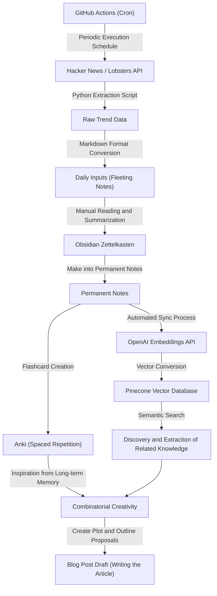

When running a tech blog as an engineer or researcher, you almost certainly face a wall. That is "running out of ideas". Even if the first few articles go smoothly, as you continue, it is not uncommon to be tormented by the worry of "I don't know what to write next" or "I am overwhelmingly lacking the input to produce output". Writing a tech blog relies heavily not just on the skill of writing sentences, but on an entire system design of daily knowledge collection, organization, and combining them to create new value.

In this article, we will explain in extreme detail and technically a **systematized input and output pipeline** to semi-permanently generate tech article ideas. We start with a mechanism that automatically extracts trending topics from high-quality overseas information sources like Hacker News and Lobsters using APIs, and runs them periodically via GitHub Actions. Then, we systematize the collected information as knowledge using the Zettelkasten method with Obsidian, and build an advanced Personal Knowledge Management (PKM) system that enables semantic search by combining OpenAI's Embeddings API and Pinecone (a vector database).

Furthermore, to supplement the limits of human memory, we practice spaced repetition based on the Ebbinghaus forgetting curve using Anki, and we will deeply delve into a series of processes that sublimate established knowledge into new ideas through "Combinatorial Creativity", along with concrete mathematical models and Python script implementation examples.

## 1. Information Entropy and the Mechanism of "Running Out of Ideas"

Why do we run out of ideas? From the perspective of information theory, it can be said that the "amount of information" in our knowledge system is depleted or has become homogenized.

Claude Shannon's proposed information entropy $H(X)$ represents the uncertainty (or degree of surprise) of information obtained from an information source.

$$ H(X) = - \sum_{i=1}^{n} P(x_i) \log_2 P(x_i) $$

Here, $X$ is a random variable of topics obtained from an information source, and $P(x_i)$ is the probability of encountering that topic $x_i$. If you usually look at similar websites (for example, only specific domestic news sites or documentation for the same tech stack), a specific $P(x_i)$ becomes extremely high, and as a result, the overall system entropy $H(X)$ decreases. A low entropy state is a state with "no new discoveries (surprises)", which is the root cause of "running out of ideas".

To keep entropy high, you intentionally need to incorporate information sources you don't usually encounter as noise, leveling the probability distribution of encountering unknown topics. This is the biggest reason to automate input from diverse information sources.

## 2. Building an Automated Information Gathering Pipeline: Hacker News & Lobsters API

To obtain high-quality input, it is effective to extract trend information from high-quality engineer communities with low noise. Hacker News (operated by Y Combinator) and Lobsters are optimal places where deep technical discussions take place. However, patrolling these sites every day takes time and consumes cognitive resources.

Therefore, we will create a Python script that automatically extracts articles above a specific score from these APIs.

### Trend Article Extraction Script in Python

The following script fetches articles that meet certain criteria from the Hacker News Firebase API and the Lobsters JSON feed, and outputs them as a Markdown file.

```python
import requests
import json
from datetime import datetime
import os

# Settings
HN_TOPSTORIES_URL = "https://hacker-news.firebaseio.com/v0/topstories.json"
HN_ITEM_URL = "https://hacker-news.firebaseio.com/v0/item/{}.json"
LOBSTERS_URL = "https://lobste.rs/hottest.json"
MIN_HN_SCORE = 100
MIN_LOBSTERS_SCORE = 10
OUTPUT_DIR = "./daily_inputs"

def get_hacker_news_trends():
    """Fetch top stories with high scores from Hacker News"""
    print("Fetching Hacker News top stories...")
    response = requests.get(HN_TOPSTORIES_URL)
    if response.status_code != 200:
        return []
    
    story_ids = response.json()[:30] # Narrow down to top 30
    trending_stories = []
    
    for story_id in story_ids:
        item_resp = requests.get(HN_ITEM_URL.format(story_id))
        if item_resp.status_code == 200:
            item = item_resp.json()
            if item and item.get("score", 0) >= MIN_HN_SCORE:
                trending_stories.append({
                    "title": item.get("title"),
                    "url": item.get("url", f"https://news.ycombinator.com/item?id={story_id}"),
                    "score": item.get("score"),
                    "source": "Hacker News"
                })
    return trending_stories

def get_lobsters_trends():
    """Fetch high-scoring stories from Lobsters"""
    print("Fetching Lobsters hottest stories...")
    response = requests.get(LOBSTERS_URL)
    if response.status_code != 200:
        return []
    
    items = response.json()
    trending_stories = []
    
    for item in items:
        if item.get("score", 0) >= MIN_LOBSTERS_SCORE:
            trending_stories.append({
                "title": item.get("title"),
                "url": item.get("url", item.get("comments_url")),
                "score": item.get("score"),
                "source": "Lobsters"
            })
    return trending_stories

def save_to_markdown(stories):
    """Save fetched stories as a Markdown file"""
    if not os.path.exists(OUTPUT_DIR):
        os.makedirs(OUTPUT_DIR)
        
    today_str = datetime.now().strftime("%Y-%m-%d")
    filepath = os.path.join(OUTPUT_DIR, f"trends_{today_str}.md")
    
    with open(filepath, "w", encoding="utf-8") as f:
        f.write(f"# Daily Tech Trends: {today_str}\n\n")
        for story in stories:
            f.write(f"## [{story['title']}]({story['url']})\n")
            f.write(f"- **Source**: {story['source']}\n")
            f.write(f"- **Score**: {story['score']}\n")
            f.write(f"- **Notes**: (Add your thoughts here)\n\n")
            
    print(f"Saved {len(stories)} stories to {filepath}")

if __name__ == "__main__":
    hn_stories = get_hacker_news_trends()
    lobsters_stories = get_lobsters_trends()
    all_stories = hn_stories + lobsters_stories
    
    # Sort in descending order by score
    all_stories.sort(key=lambda x: x["score"], reverse=True)
    save_to_markdown(all_stories)
```

This script provides more value than a simple RSS reader. This is because by filtering by score, you can extract only the technical topics that are truly attracting attention in the community (high signal with low noise).

## 3. Scheduling and Automation with GitHub Actions

Manually running the created Python script every day is tedious. The basis of automation is to minimize human intervention as much as possible. Using the Cron feature of GitHub Actions, we build a mechanism to run the script at a specified time every day and automatically commit the results to the repository.

Create `.github/workflows/daily_trends.yml` at the project root and write the following:

```yaml
name: Daily Tech Trends Scraper

on:
  schedule:
    - cron: '0 0 * * *' # Run at UTC 0:00 every day (9:00 JST)
  workflow_dispatch: # For manual execution

jobs:
  scrape-and-commit:
    runs-on: ubuntu-latest
    steps:
      - name: Checkout Repository
        uses: actions/checkout@v3
        
      - name: Setup Python
        uses: actions/setup-python@v4
        with:
          python-version: '3.10'
          
      - name: Install Dependencies
        run: |
          python -m pip install --upgrade pip
          pip install requests
          
      - name: Run Scraper Script
        run: python scripts/fetch_trends.py
        
      - name: Commit and Push Changes
        run: |
          git config --local user.email "action@github.com"
          git config --local user.name "GitHub Action"
          git add daily_inputs/
          git commit -m "Auto-update daily tech trends [skip ci]" || echo "No changes to commit"
          git push
```

With this, you can create a state where every morning when you open Obsidian, the important topics of the day are automatically added to your inbox (`daily_inputs/`) as Markdown.

## 4. Networking Knowledge Using Zettelkasten and Obsidian

Automatically collected information is still just "data". A process is needed to sublimate this into "knowledge". This is where the Zettelkasten method and Obsidian come into play.

Zettelkasten is a note-taking method devised by German sociologist Niklas Luhmann. Instead of classifying notes into hierarchical folders, you keep individual notes small (atomic) and connect them with links, building a network of knowledge like the neural circuits of a brain.

There are primarily 3 types of notes in Zettelkasten:
1. **Fleeting Notes**: For temporarily recording passing ideas or collected information. The auto-generated trend information Markdown falls into this category.
2. **Literature Notes**: Summaries in your own words of articles or books you've read.
3. **Permanent Notes**: Completed thoughts written on a single topic. These become the direct seeds for blog articles.

By using Obsidian's backlink feature (`[[Note Name]]`), you can link a note like "Rust's Ownership" with a note like "History of Garbage Collection", for example, allowing you to discover unexpected connections between ideas.

## 5. Semantic Search Using Vector Database (Pinecone) and OpenAI Embeddings

When the number of notes increases to hundreds or thousands, it becomes difficult to find the desired note with just keyword search (full-text search). Semantic search utilizing Large Language Model (LLM) Embeddings demonstrates its power when "you can't remember the keyword, but want to find a note with a similar concept".

Using OpenAI's `text-embedding-ada-002` model (or `text-embedding-3-small`), we convert each Markdown note in Obsidian into a multi-dimensional vector (an array of numbers with hundreds to thousands of dimensions). In these vector spaces, vectors of sentences with close meanings will have a close physical distance as well.

To measure the similarity between vectors, Cosine Similarity is widely used.

$$ \text{similarity} = \cos(\theta) = \frac{\mathbf{A} \cdot \mathbf{B}}{\|\mathbf{A}\| \|\mathbf{B}\|} = \frac{\sum_{i=1}^{n} A_i B_i}{\sqrt{\sum_{i=1}^{n} A_i^2} \sqrt{\sum_{i=1}^{n} B_i^2}} $$

$\mathbf{A}$ and $\mathbf{B}$ are the query string vector and the note vector, respectively. To perform this calculation at high speed, we use a vector database such as Pinecone or Qdrant.

### Semantic Search Implementation Example

Below is a part of a Python script that scans an Obsidian note directory, vectorizes them with the OpenAI API, and upserts (inserts/updates) them into Pinecone.

```python
import os
import glob
from openai import OpenAI
from pinecone import Pinecone, ServerlessSpec

# Setup API Keys (Get from environment variables)
OPENAI_API_KEY = os.getenv("OPENAI_API_KEY")
PINECONE_API_KEY = os.getenv("PINECONE_API_KEY")

client = OpenAI(api_key=OPENAI_API_KEY)
pc = Pinecone(api_key=PINECONE_API_KEY)

INDEX_NAME = "obsidian-notes"
OBSIDIAN_DIR = "/path/to/obsidian/vault/PermanentNotes"

def init_pinecone():
    """Initialize Pinecone index"""
    if INDEX_NAME not in pc.list_indexes().names():
        pc.create_index(
            name=INDEX_NAME,
            dimension=1536, # Dimension for text-embedding-3-small / ada-002
            metric="cosine",
            spec=ServerlessSpec(cloud="aws", region="us-east-1")
        )
    return pc.Index(INDEX_NAME)

def get_embedding(text):
    """Vectorize text using OpenAI API"""
    response = client.embeddings.create(
        input=text,
        model="text-embedding-3-small"
    )
    return response.data[0].embedding

def sync_notes_to_pinecone(index):
    """Read Markdown files, vectorize them, and save to Pinecone"""
    md_files = glob.glob(os.path.join(OBSIDIAN_DIR, "*.md"))
    
    vectors = []
    for filepath in md_files:
        filename = os.path.basename(filepath)
        with open(filepath, "r", encoding="utf-8") as f:
            content = f.read()
            
        # Process only if note content is not empty
        if content.strip():
            print(f"Embedding note: {filename}")
            embedding = get_embedding(content)
            
            # Pinecone format (id, vector, metadata)
            vectors.append({
                "id": filename,
                "values": embedding,
                "metadata": {"text": content[:500]} # Partial text for displaying search results
            })
            
    # Upsert with batch processing
    if vectors:
        index.upsert(vectors=vectors)
        print(f"Successfully upserted {len(vectors)} notes.")

def search_similar_ideas(index, query_text, top_k=3):
    """Search for notes similar to query and use for idea generation"""
    query_embedding = get_embedding(query_text)
    
    results = index.query(
        vector=query_embedding,
        top_k=top_k,
        include_metadata=True
    )
    
    print(f"\n--- Search Results for: '{query_text}' ---")
    for match in results["matches"]:
        print(f"Score: {match['score']:.4f} | Note: {match['id']}")
        print(f"Preview: {match['metadata']['text'][:100]}...\n")

if __name__ == "__main__":
    idx = init_pinecone()
    # Call sync_notes_to_pinecone(idx) on first run to build the DB
    sync_notes_to_pinecone(idx)
    
    # Search to generate blog ideas
    search_similar_ideas(idx, "Speeding up machine learning inference in browsers using WebAssembly")
```

Using this system, if you wonder "I want to write about 'WebAssembly' which was trending on Hacker News this week, but have I written any related notes in the past?", the AI will instantly pick up semantically related past Permanent Notes. This enables a deep article structure that fully utilizes your past knowledge assets.

## 6. Ebbinghaus's Forgetting Curve and Spaced Repetition Utilizing Anki

No matter how excellent the knowledge recorded in your notes is, if the knowledge is not ingrained in the writer's own brain, it is difficult to fluently stitch together multiple concepts while writing. This is where the "Ebbinghaus forgetting curve", which mathematically models the mechanism of human memory, comes in.

The forgetting curve is approximated by the following equation:

$$ R = e^{-\frac{t}{S}} $$

Here,
- $R$ is the Retrievability (range from 0 to 1)
- $t$ is the elapsed time since learning
- $S$ is the Stability or strength of memory

Right after learning a new concept, $S$ is small, and as time $t$ passes, $R$ drops (forgets) rapidly. However, if you review (Recall) at the perfect timing when you are about to forget it, the speed until you forget it next becomes slower ($S$ becomes larger), and it settles into long-term memory.

The software that automatically calculates this optimal review timing using an algorithm (like SuperMemo 2) and presents it as flashcards is "Anki".

A powerful approach for generating tech blog ideas is to **convert the contents of Obsidian's Permanent Notes into Anki flashcards**.
For example, you register questions related to fundamental technical concepts like "What are the 3 elements of the CAP theorem?" or "Why does a B-Tree index have a search performance of O(log N)?" into Anki and review them as a daily routine. When knowledge is indexed in your brain as long-term memory, while taking a shower or walking, information connects subconsciously, producing a eureka moment like "Ah, I could write an article about consensus algorithms in distributed systems."

## 7. Combinatorial Creativity

With the pipeline up to this point, we have achieved "input of diverse information", "organization and AI search with Zettelkasten", and "retention in long-term memory with Anki". The final step is "Combinatorial Creativity", which generates completely new tech article ideas by multiplying these elements together.

Innovation and creativity are said to arise not from producing something out of nothing, but from new combinations of existing elements. Steve Jobs' quote "Creativity is just connecting things." is famous.

As a matrix of combinations for tech blogs, patterns like the following can be considered:

1. **[Old Technology] × [New Paradigm]**: e.g., "Anti-patterns of modern microservices design learned from COBOL architecture"
2. **[Frontend] × [Backend Concepts]**: e.g., "Explaining React's virtual DOM update algorithm from the perspective of database transaction isolation levels"
3. **[Abstract Mathematics / Theory] × [Concrete Implementation]**: e.g., "Deciphering Kubernetes Pod scheduling optimization with graph theory"

To intentionally cause these combinations, you can use the Pinecone semantic search system built earlier to extract a random concept A and concept B, and throw a prompt to an AI (like ChatGPT) saying "Propose 5 tech blog titles and outline ideas combining these two", allowing you to infinitely generate article ideas from novel angles you wouldn't come up with yourself.

## 8. Overall System Architecture

The overall architecture "from information gathering to idea creation" explained so far to prevent tech article writer's block is summarized in the following Mermaid flowchart.



The feature of this system is that **"intellectual tasks to be done manually (summarization, consideration, writing)" and "tasks to be delegated to machines (collection, search, spaced repetition scheduling)" are completely separated**. This allows the writer to focus on the highest value-added activities of "thinking" and "combining".

## 9. State Transition Model from Idea to Publication

The lifecycle from ideas accumulated in Zettelkasten to ultimately being published as blog articles can be expressed as the following state transition diagram. You use appropriate tools and approaches in each state.

```mermaid
stateDiagram-v2
    [*] --> Capture["Idea Capture"]
    
    Capture["Idea Capture"] --> Fleeting["Fleeting Notes"]
    Fleeting["Fleeting Notes"] --> Permanent["Permanent Notes"]
    
    Permanent["Permanent Notes"] --> Brainstorming["Brainstorming (AI Semantic Search)"]
    Permanent["Permanent Notes"] --> Memorization["Memorization (Anki Review)"]
    Memorization["Memorization (Anki Review)"] --> Brainstorming["Brainstorming (AI Semantic Search)"]
    
    Brainstorming["Brainstorming (AI Semantic Search)"] --> Outlining["Outlining (Structure & TOC Creation)"]
    Outlining["Outlining (Structure & TOC Creation)"] --> Drafting["Drafting (First Draft)"]
    
    Drafting["Drafting (First Draft)"] --> Review["Review & Edit (Refining & Proofreading)"]
    Review["Review & Edit (Refining & Proofreading)"] --> Published["Published (Blog Publication)"]
    
    Published["Published (Blog Publication)"] --> [*]
```



By being aware of this workflow, "which phase am I stuck in right now" becomes clear. If no ideas are coming out, you can return to the "Capture" or "Permanent" phase and check if the input pipeline is operating normally.

## Conclusion: Writing is a "System"

"Tech blog writer's block" is not caused by a lack of individual ability or a decline in motivation, but is an **inevitable result of not having a system built to circulate knowledge**.

As introduced in this article:
1. Securing high-quality input with low noise through **APIs and automation**
2. Networking knowledge through Zettelkasten using **Obsidian**
3. Semantic search of personal assets using **OpenAI and Pinecone**
4. Strengthening brain indexes utilizing **Anki** and the Ebbinghaus forgetting curve
5. **Combinatorial Creativity** multiplying existing concepts

By building a comprehensive pipeline combining these, you can create a state where your blog ideas do not dry up, but rather, the more you write, the more new ideas self-multiply.

You don't need to build everything perfectly from the start. First, try starting with the habit of making a simple script to hit the Hacker News API and taking Markdown notes on articles that interest you. I hope your tech blog becomes a source of excellent next-generation ideas.
