Al administrar un blog técnico como ingeniero o investigador, hay un obstáculo que casi siempre enfrentarás. Es el "quedarse sin ideas". Aunque los primeros artículos se escriban sin problemas, a medida que continúas, no es raro que te atormente la preocupación de "no sé sobre qué escribir a continuación" o "me falta abrumadoramente información de entrada (input) para poder generar salidas (output)". La escritura de un blog técnico no depende solo de la habilidad de redactar, sino en gran medida del diseño de un sistema continuo para recopilar conocimientos diarios, organizarlos y combinarlos para crear nuevo valor.

En este artículo, explicaré de manera muy detallada y técnica sobre un **pipeline de entrada y salida sistematizado** para continuar generando ideas de artículos técnicos de forma semipermanente. Comenzaremos con un mecanismo para extraer automáticamente temas en tendencia utilizando APIs de fuentes de información extranjeras de alta calidad como Hacker News o Lobsters, y ejecutarlos periódicamente con GitHub Actions. Luego, construiremos un avanzado sistema de Gestión de Conocimiento Personal (PKM: Personal Knowledge Management) que sistematiza la información recopilada como conocimiento mediante el método Zettelkasten usando Obsidian, y que permite realizar búsquedas semánticas combinando la API de Embeddings de OpenAI y Pinecone (una base de datos vectorial).

Además, para compensar los límites de la memoria humana, profundizaremos en una serie de procesos para poner en práctica la repetición espaciada (Spaced Repetition) basada en la curva del olvido de Ebbinghaus utilizando Anki, y para elevar el conocimiento consolidado a nuevas ideas mediante la "creatividad combinatoria (Combinatorial Creativity)", acompañados de modelos matemáticos concretos y ejemplos de implementación de scripts en Python.

## 1. La entropía de la información y el mecanismo de "quedarse sin ideas"

¿Por qué nos "quedamos sin ideas"? Desde la perspectiva de la teoría de la información, se puede decir que es un estado en el cual la "cantidad de información" de nuestro sistema de conocimiento se ha agotado o se ha homogeneizado.

La entropía de la información $H(X)$ propuesta por Claude Shannon representa la incertidumbre (o el grado de sorpresa) de la información que se puede obtener de una fuente de información.

$$ H(X) = - \sum_{i=1}^{n} P(x_i) \log_2 P(x_i) $$

Aquí, $X$ es la variable aleatoria de un tema obtenido de una fuente de información, y $P(x_i)$ es la probabilidad de encontrarse con ese tema $x_i$. Si normalmente visitas los mismos sitios web (por ejemplo, solo sitios de noticias nacionales específicos o documentación de la misma pila tecnológica), un $P(x_i)$ específico se vuelve extremadamente alto y, como resultado, la entropía $H(X)$ de todo el sistema disminuye. Un estado de baja entropía es un estado en el que "no hay nuevos descubrimientos (sorpresas)", y esta es la causa fundamental de "quedarse sin ideas".

Para mantener una entropía alta, es necesario incorporar intencionalmente fuentes de información que no sueles frecuentar como ruido y nivelar la distribución de probabilidad de entrar en contacto con temas desconocidos. Esta es la razón principal para automatizar la entrada desde diversas fuentes de información.

## 2. Construcción de un pipeline de recopilación de información automatizado: Hacker News & Lobsters API

Para obtener información de entrada de alta calidad, es efectivo extraer información sobre tendencias de comunidades de ingenieros de calidad y con poco ruido. Hacker News (operado por Y Combinator) y Lobsters son lugares óptimos donde se llevan a cabo discusiones técnicas profundas. Sin embargo, navegar por estos sitios todos los días lleva tiempo y consume recursos cognitivos.

Por lo tanto, crearemos un script utilizando Python para extraer automáticamente artículos con una puntuación superior a cierto umbral desde estas APIs.

### Script de extracción de artículos en tendencia con Python

El siguiente script obtiene artículos que cumplen ciertos criterios desde la Firebase API de Hacker News y el feed JSON de Lobsters, y los exporta como un archivo Markdown.

```python
import requests
import json
from datetime import datetime
import os

# Configuración
HN_TOPSTORIES_URL = "https://hacker-news.firebaseio.com/v0/topstories.json"
HN_ITEM_URL = "https://hacker-news.firebaseio.com/v0/item/{}.json"
LOBSTERS_URL = "https://lobste.rs/hottest.json"
MIN_HN_SCORE = 100
MIN_LOBSTERS_SCORE = 10
OUTPUT_DIR = "./daily_inputs"

def get_hacker_news_trends():
    """Obtener los mejores artículos con alta puntuación de Hacker News"""
    print("Fetching Hacker News top stories...")
    response = requests.get(HN_TOPSTORIES_URL)
    if response.status_code != 200:
        return []
    
    story_ids = response.json()[:30] # Limitar a los 30 mejores
    trending_stories = []
    
    for story_id in story_ids:
        item_resp = requests.get(HN_ITEM_URL.format(story_id))
        if item_resp.status_code == 200:
            item = item_resp.json()
            if item and item.get("score", 0) >= MIN_HN_SCORE:
                trending_stories.append({
                    "title": item.get("title"),
                    "url": item.get("url", f"https://news.ycombinator.com/item?id={story_id}"),
                    "score": item.get("score"),
                    "source": "Hacker News"
                })
    return trending_stories

def get_lobsters_trends():
    """Obtener artículos con alta puntuación de Lobsters"""
    print("Fetching Lobsters hottest stories...")
    response = requests.get(LOBSTERS_URL)
    if response.status_code != 200:
        return []
    
    items = response.json()
    trending_stories = []
    
    for item in items:
        if item.get("score", 0) >= MIN_LOBSTERS_SCORE:
            trending_stories.append({
                "title": item.get("title"),
                "url": item.get("url", item.get("comments_url")),
                "score": item.get("score"),
                "source": "Lobsters"
            })
    return trending_stories

def save_to_markdown(stories):
    """Guardar los artículos obtenidos como un archivo Markdown"""
    if not os.path.exists(OUTPUT_DIR):
        os.makedirs(OUTPUT_DIR)
        
    today_str = datetime.now().strftime("%Y-%m-%d")
    filepath = os.path.join(OUTPUT_DIR, f"trends_{today_str}.md")
    
    with open(filepath, "w", encoding="utf-8") as f:
        f.write(f"# Daily Tech Trends: {today_str}\n\n")
        for story in stories:
            f.write(f"## [{story['title']}]({story['url']})\n")
            f.write(f"- **Source**: {story['source']}\n")
            f.write(f"- **Score**: {story['score']}\n")
            f.write(f"- **Notes**: (Añadir consideraciones aquí)\n\n")
            
    print(f"Saved {len(stories)} stories to {filepath}")

if __name__ == "__main__":
    hn_stories = get_hacker_news_trends()
    lobsters_stories = get_lobsters_trends()
    all_stories = hn_stories + lobsters_stories
    
    # Ordenar por puntuación en orden descendente
    all_stories.sort(key=lambda x: x["score"], reverse=True)
    save_to_markdown(all_stories)
```

Este script proporciona un valor superior a un simple lector de RSS. Al realizar un filtrado por puntuación, puedes extraer solo los temas técnicos que realmente están llamando la atención en la comunidad (señal alta con poco ruido).

## 3. Programación y automatización con GitHub Actions

Ejecutar manualmente el script de Python creado todos los días es tedioso. La base de la automatización es reducir la intervención humana al mínimo. Utilizando la función Cron de GitHub Actions, construiremos un mecanismo para ejecutar el script a una hora designada todos los días y confirmar (commit) automáticamente los resultados en el repositorio.

Crea un archivo `.github/workflows/daily_trends.yml` en la raíz del proyecto y escribe lo siguiente:

```yaml
name: Daily Tech Trends Scraper

on:
  schedule:
    - cron: '0 0 * * *' # Ejecutar todos los días a las 0:00 UTC (9:00 hora de Japón)
  workflow_dispatch: # Para ejecución manual

jobs:
  scrape-and-commit:
    runs-on: ubuntu-latest
    steps:
      - name: Checkout Repository
        uses: actions/checkout@v3
        
      - name: Setup Python
        uses: actions/setup-python@v4
        with:
          python-version: '3.10'
          
      - name: Install Dependencies
        run: |
          python -m pip install --upgrade pip
          pip install requests
          
      - name: Run Scraper Script
        run: python scripts/fetch_trends.py
        
      - name: Commit and Push Changes
        run: |
          git config --local user.email "action@github.com"
          git config --local user.name "GitHub Action"
          git add daily_inputs/
          git commit -m "Auto-update daily tech trends [skip ci]" || echo "No changes to commit"
          git push
```

Gracias a esto, puedes crear un estado en el que, cada mañana al abrir Obsidian, los temas importantes del día se habrán añadido automáticamente a tu bandeja de entrada (`daily_inputs/`) en formato Markdown.

## 4. Creación de una red de conocimiento utilizando Zettelkasten y Obsidian

La información recopilada automáticamente todavía es solo "datos". Es necesario un proceso para elevarla a "conocimiento". Aquí es donde entran en juego el método Zettelkasten y Obsidian.

Zettelkasten es un método de toma de notas ideado por el sociólogo alemán Niklas Luhmann. En lugar de clasificar las notas en carpetas jerárquicas, mantiene cada nota pequeña (atómica) y conecta las notas entre sí con enlaces, construyendo una red de conocimiento similar a los circuitos neuronales del cerebro.

Existen principalmente 3 tipos de notas en Zettelkasten:
1. **Fleeting Notes (Notas fugaces)**: Para registrar temporalmente ideas que se te ocurren o información recopilada. El archivo Markdown de información de tendencias generado automáticamente anteriormente entra en esta categoría.
2. **Literature Notes (Notas de literatura)**: Resúmenes con tus propias palabras tras leer artículos o libros.
3. **Permanent Notes (Notas permanentes)**: Consideraciones completas escritas sobre un tema único. Estas serán directamente la semilla para tus artículos del blog.

Al utilizar la función de retroenlace (backlink) de Obsidian (`[[Nombre de la nota]]`), puedes, por ejemplo, enlazar una nota sobre "La propiedad en Rust" con una sobre "La historia del recolector de basura", y descubrir conexiones inesperadas de ideas.

## 5. Búsqueda semántica utilizando una base de datos vectorial (Pinecone) y OpenAI Embeddings

Cuando el número de notas aumenta a cientos o miles, resulta difícil encontrar la nota deseada mediante una simple búsqueda de palabras clave (búsqueda de texto completo). La búsqueda semántica (de significado) que aprovecha los Embeddings de los Modelos de Lenguaje Grande (LLM) demuestra su poder cuando "no puedes recordar las palabras clave, pero quieres encontrar una nota que sea conceptualmente similar".

Utilizando el modelo `text-embedding-ada-002` (o `text-embedding-3-small`) de OpenAI, cada nota Markdown de Obsidian se convierte en un vector multidimensional (un arreglo de números de cientos a miles de dimensiones). En este espacio vectorial, los vectores de frases con significados similares también tienen una distancia física cercana.

Para medir la similitud entre vectores, se utiliza ampliamente la similitud del coseno (Cosine Similarity).

$$ \text{similarity} = \cos(\theta) = \frac{\mathbf{A} \cdot \mathbf{B}}{\|\mathbf{A}\| \|\mathbf{B}\|} = \frac{\sum_{i=1}^{n} A_i B_i}{\sqrt{\sum_{i=1}^{n} A_i^2} \sqrt{\sum_{i=1}^{n} B_i^2}} $$

$\mathbf{A}$ y $\mathbf{B}$ son el vector de la cadena de consulta y el vector de la nota, respectivamente. Para realizar este cálculo a alta velocidad, se utilizan bases de datos vectoriales como Pinecone o Qdrant.

### Ejemplo de implementación de búsqueda semántica

A continuación se muestra una parte de un script en Python que escanea el directorio de notas de Obsidian, las vectoriza usando la API de OpenAI y las actualiza (upsert) en Pinecone.

```python
import os
import glob
from openai import OpenAI
from pinecone import Pinecone, ServerlessSpec

# Configuración de la clave API (Obtenida de variables de entorno)
OPENAI_API_KEY = os.getenv("OPENAI_API_KEY")
PINECONE_API_KEY = os.getenv("PINECONE_API_KEY")

client = OpenAI(api_key=OPENAI_API_KEY)
pc = Pinecone(api_key=PINECONE_API_KEY)

INDEX_NAME = "obsidian-notes"
OBSIDIAN_DIR = "/path/to/obsidian/vault/PermanentNotes"

def init_pinecone():
    """Inicialización del índice de Pinecone"""
    if INDEX_NAME not in pc.list_indexes().names():
        pc.create_index(
            name=INDEX_NAME,
            dimension=1536, # Número de dimensiones de text-embedding-3-small / ada-002
            metric="cosine",
            spec=ServerlessSpec(cloud="aws", region="us-east-1")
        )
    return pc.Index(INDEX_NAME)

def get_embedding(text):
    """Vectorizar texto utilizando la API de OpenAI"""
    response = client.embeddings.create(
        input=text,
        model="text-embedding-3-small"
    )
    return response.data[0].embedding

def sync_notes_to_pinecone(index):
    """Leer archivos Markdown, vectorizarlos y guardarlos en Pinecone"""
    md_files = glob.glob(os.path.join(OBSIDIAN_DIR, "*.md"))
    
    vectors = []
    for filepath in md_files:
        filename = os.path.basename(filepath)
        with open(filepath, "r", encoding="utf-8") as f:
            content = f.read()
            
        # Procesar solo si el contenido de la nota no está vacío
        if content.strip():
            print(f"Embedding note: {filename}")
            embedding = get_embedding(content)
            
            # Formato de Pinecone (id, vector, metadata)
            vectors.append({
                "id": filename,
                "values": embedding,
                "metadata": {"text": content[:500]} # Texto parcial para mostrar en los resultados de búsqueda
            })
            
    # Upsert mediante procesamiento por lotes (batch)
    if vectors:
        index.upsert(vectors=vectors)
        print(f"Successfully upserted {len(vectors)} notes.")

def search_similar_ideas(index, query_text, top_k=3):
    """Buscar notas similares a la consulta y utilizarlas para la generación de ideas"""
    query_embedding = get_embedding(query_text)
    
    results = index.query(
        vector=query_embedding,
        top_k=top_k,
        include_metadata=True
    )
    
    print(f"\n--- Search Results for: '{query_text}' ---")
    for match in results["matches"]:
        print(f"Score: {match['score']:.4f} | Note: {match['id']}")
        print(f"Preview: {match['metadata']['text'][:100]}...\n")

if __name__ == "__main__":
    idx = init_pinecone()
    # En la primera ejecución, llamar a sync_notes_to_pinecone(idx) para construir la BD
    sync_notes_to_pinecone(idx)
    
    # Búsqueda para generación de ideas del blog
    search_similar_ideas(idx, "Aceleración de la inferencia de aprendizaje automático en el navegador utilizando WebAssembly")
```

Con este sistema, frente a la pregunta "Quiero escribir sobre 'WebAssembly', que fue tema de conversación esta semana en Hacker News, pero ¿he escrito notas relacionadas en el pasado?", la IA seleccionará instantáneamente las Permanent Notes pasadas que estén semánticamente relacionadas. Esto hace posible estructurar un artículo profundo aprovechando al máximo tus propios activos de conocimiento pasados.

## 6. Repetición espaciada aprovechando la curva del olvido de Ebbinghaus y Anki

Por excelente que sea el conocimiento registrado en tus notas, si no está consolidado en el propio cerebro del escritor, será difícil conectar fluidamente múltiples conceptos durante la escritura. Aquí es donde entra en juego la "curva del olvido de Ebbinghaus", que modela matemáticamente los mecanismos de la memoria humana.

La curva del olvido se aproxima con la siguiente fórmula:

$$ R = e^{-\frac{t}{S}} $$

Aquí,
- $R$ es la tasa de retención de la memoria (Retrievability, en un rango de 0 a 1)
- $t$ es el tiempo transcurrido desde el aprendizaje
- $S$ es la estabilidad (Stability) o fuerza de la memoria

Inmediatamente después de aprender un nuevo concepto, $S$ es pequeña y, a medida que el tiempo $t$ avanza, $R$ disminuye (olvido) rápidamente. Sin embargo, al realizar repasos (Recall) en el momento exacto en que se está a punto de olvidar, la velocidad hasta el próximo olvido se vuelve más gradual (haciendo que $S$ sea mayor), consolidándose en la memoria a largo plazo.

El software que calcula automáticamente este momento óptimo de repaso mediante algoritmos (como SuperMemo 2) y lo presenta como tarjetas de memoria (flashcards) es "Anki".

Un enfoque poderoso para crear ideas para el blog técnico es **convertir el contenido de las Permanent Notes de Obsidian en tarjetas de Anki**.
Por ejemplo, registrar en Anki preguntas relacionadas con fundamentos técnicos como "¿Cuáles son los 3 elementos del teorema CAP?" o "¿Por qué los índices B-Tree tienen un rendimiento de búsqueda de O(log N)?" y repasarlas como parte de tu rutina diaria. Cuando el conocimiento se indexa en el cerebro como memoria a largo plazo, la información se conectará inconscientemente mientras te bañas o caminas, generando momentos de inspiración (momentos Eureka) como: "Ah, creo que podría escribir un artículo sobre los algoritmos de consenso en sistemas distribuidos".

## 7. Creatividad combinatoria (Combinatorial Creativity)

En el pipeline desarrollado hasta ahora hemos logrado la "entrada de información diversa", la "organización con Zettelkasten y búsqueda con IA" y la "consolidación en la memoria a largo plazo con Anki". El último paso es la "creatividad combinatoria (Combinatorial Creativity)", que consiste en multiplicar estos elementos para generar ideas completamente nuevas para artículos técnicos.

Se dice que la innovación y la creatividad no nacen de crear algo de la nada, sino de nuevas combinaciones de elementos existentes. Es famosa la cita de Steve Jobs: "La creatividad es simplemente conectar cosas (Creativity is just connecting things.)".

Como patrones de combinación en blogs técnicos, se puede considerar la siguiente matriz:

1. **[Tecnología antigua] × [Nuevo paradigma]**: Ejemplo: "Aprendiendo de la arquitectura de COBOL: Antipatrones en el diseño de microservicios modernos".
2. **[Frontend] × [Concepto de backend]**: Ejemplo: "Explicando el algoritmo de actualización del DOM virtual de React desde la perspectiva de los niveles de aislamiento de transacciones de bases de datos".
3. **[Matemáticas abstractas y teorías] × [Implementación concreta]**: Ejemplo: "Descifrando la optimización de la programación (scheduling) de Pods en Kubernetes con la teoría de grafos".

Para generar estas combinaciones intencionadamente, puedes usar el sistema de búsqueda semántica de Pinecone que construimos anteriormente para extraer dos conceptos aleatorios, A y B. Luego, pasándole a una IA (como ChatGPT) un prompt diciendo: "Propón 5 títulos y borradores de índice para un blog técnico que combine estos dos", podrás generar infinitamente ideas de artículos con enfoques novedosos que no se te habrían ocurrido por tu cuenta.

## 8. Arquitectura general del sistema

A continuación, se resume en el siguiente diagrama de flujo de Mermaid la arquitectura general de "desde la recopilación de información hasta la generación de ideas" que hemos explicado hasta ahora para evitar quedarse sin ideas de artículos técnicos.

```mermaid
flowchart TD
    A["Hacker News / Lobsters API"] -->|Script de extracción en Python| B["Datos de tendencias sin procesar"]
    C["GitHub Actions (Cron)"] -->|Programa de ejecución periódica| A
    B -->|Conversión de formato a Markdown| D["Entradas Diarias (Fleeting Notes)"]
    D -->|Trabajo manual de lectura y resumen| E["Obsidian Zettelkasten"]
    E -->|Conversión a notas permanentes| F["Notas Permanentes (Permanent Notes)"]
    F -->|Procesamiento de sincronización automática| G["OpenAI Embeddings API"]
    G -->|Conversión a vectores| H["Base de Datos Vectorial Pinecone"]
    H -->|Búsqueda semántica| I["Descubrimiento y extracción de conocimientos relacionados"]
    F -->|Creación de tarjetas de memoria (flashcards)| J["Anki (Repetición Espaciada)"]
    J -->|Inspiración desde la memoria a largo plazo| K["Creatividad Combinatoria"]
    I --> K
    K -->|Creación de trama y borrador de estructura| L["Borrador del Artículo del Blog (Escritura del artículo)"]
```

La característica de este sistema es que **el "trabajo intelectual que se debe hacer manualmente (resumen, consideración, redacción)" y el "trabajo que se debe delegar a la máquina (recopilación, búsqueda, programación de la repetición espaciada)" están completamente separados**. Gracias a esto, el escritor puede concentrarse en "pensar" y "combinar", que es lo que proporciona el mayor valor añadido.

## 9. Modelo de transición de estado: desde la idea hasta su publicación

El ciclo de vida desde que las ideas acumuladas en Zettelkasten se publican finalmente como artículos del blog, se puede representar mediante el siguiente diagrama de transición de estados. Se debe utilizar la herramienta y el enfoque adecuados para cada estado.

```mermaid
stateDiagram-v2
    [*] --> Capture["Idea Capture (Captura de información)"]
    
    Capture["Idea Capture (Captura de información)"] --> Fleeting["Fleeting Notes (Notas temporales)"]
    Fleeting["Fleeting Notes (Notas temporales)"] --> Permanent["Permanent Notes (Notas permanentes)"]
    
    Permanent["Permanent Notes (Notas permanentes)"] --> Brainstorming["Brainstorming (Búsqueda semántica con IA)"]
    Permanent["Permanent Notes (Notas permanentes)"] --> Memorization["Memorization (Repaso con Anki)"]
    Memorization["Memorization (Repaso con Anki)"] --> Brainstorming["Brainstorming (Búsqueda semántica con IA)"]
    
    Brainstorming["Brainstorming (Búsqueda semántica con IA)"] --> Outlining["Outlining (Creación de estructura e índice)"]
    Outlining["Outlining (Creación de estructura e índice)"] --> Drafting["Drafting (Redacción del primer borrador)"]
    
    Drafting["Drafting (Redacción del primer borrador)"] --> Review["Review & Edit (Revisión y edición)"]
    Review["Review & Edit (Revisión y edición)"] --> Published["Published (Publicación del blog)"]
    
    Published["Published (Publicación del blog)"] --> [*]
```



Al ser consciente de este flujo de trabajo, quedará claro "en qué fase te encuentras atascado actualmente". Cuando no tengas ideas, simplemente debes regresar a la fase de "Capture" o "Permanent", y verificar si el pipeline de entrada está funcionando correctamente.

## Conclusión: Escribir es un "sistema"

"Quedarse sin ideas para el blog técnico" no es el resultado de la falta de capacidad individual o la disminución de la motivación, sino **una consecuencia inevitable de no tener construido un sistema que permita circular el conocimiento**.

Como hemos presentado en este artículo:
1. Asegurar una entrada (input) de alta calidad y con poco ruido mediante **APIs y automatización**.
2. Creación de una red de conocimiento mediante Zettelkasten utilizando **Obsidian**.
3. Búsqueda semántica de los propios activos usando **OpenAI y Pinecone**.
4. Fortalecimiento del índice mental aprovechando **Anki** y la curva del olvido de Ebbinghaus.
5. **Creatividad combinatoria** que multiplica conceptos existentes.

Al construir un pipeline integral que combina todo esto, lejos de que se agoten las ideas para el blog, se puede crear un estado en el que las nuevas ideas se auto-multiplican cuanto más escribes.

No es necesario construir todo a la perfección desde el principio. Comienza por crear un script sencillo que llame a la API de Hacker News y adquiere el hábito de tomar notas en formato Markdown sobre los artículos que te interesen. Espero que tu blog técnico se convierta en una fuente de excelentes ideas para la próxima generación.
