Lorsque vous tenez un blog technique en tant qu'ingénieur ou chercheur, il y a un mur auquel vous serez presque certainement confronté. C'est la "panne d'idées". Même si les premiers articles s'écrivent facilement, au fur et à mesure que vous continuez, il n'est pas rare d'être tourmenté par des problèmes tels que "Je ne sais pas quoi écrire ensuite" ou "Je manque cruellement de matières premières (input) pour produire (output)". La rédaction d'un blog technique ne dépend pas seulement de la compétence en écriture, mais repose fortement sur la conception d'un système pour collecter et organiser quotidiennement les connaissances, puis les combiner pour créer de la nouvelle valeur.

Dans cet article, nous expliquerons de manière extrêmement détaillée et technique un **pipeline d'assimilation et de production systématisé** permettant de générer de façon quasi permanente des idées d'articles techniques. Nous commencerons par un mécanisme qui extrait automatiquement les sujets tendances de sources d'informations de haute qualité à l'étranger, comme Hacker News et Lobsters, à l'aide d'API, et l'exécute régulièrement via GitHub Actions. Ensuite, nous construirons un système avancé de gestion des connaissances personnelles (PKM : Personal Knowledge Management) qui organise les informations collectées sous forme de connaissances avec la méthode Zettelkasten en utilisant Obsidian, et permet une recherche sémantique en combinant l'API Embeddings d'OpenAI et Pinecone (une base de données vectorielle).

De plus, pour compenser les limites de la mémoire humaine, nous mettrons en pratique la répétition espacée (Spaced Repetition) basée sur la courbe de l'oubli d'Ebbinghaus en utilisant Anki. Nous explorerons en profondeur le processus continu qui sublime les connaissances mémorisées en de nouvelles idées grâce à la "Créativité combinatoire (Combinatorial Creativity)", avec des modèles mathématiques concrets et des exemples d'implémentation de scripts Python.

## 1. L'entropie de l'information et le mécanisme de la "panne d'idées"

Pourquoi sommes-nous à court d'idées ? Du point de vue de la théorie de l'information, on peut dire que la "quantité d'informations" de notre système de connaissances s'est épuisée ou homogénéisée.

L'entropie de l'information $H(X)$, proposée par Claude Shannon, représente l'incertitude (ou le degré de surprise) des informations obtenues à partir d'une source d'information.

$$ H(X) = - \sum_{i=1}^{n} P(x_i) \log_2 P(x_i) $$

Ici, $X$ est une variable aléatoire des sujets obtenus de la source d'information, et $P(x_i)$ est la probabilité de rencontrer ce sujet $x_i$. Si vous consultez habituellement les mêmes sites Web (par exemple, uniquement certains sites d'actualités nationaux ou la documentation de la même pile technologique), un certain $P(x_i)$ devient extrêmement élevé, et par conséquent, l'entropie $H(X)$ de l'ensemble du système diminue. Un état de faible entropie est un état "sans nouvelles découvertes (surprises)", ce qui est la cause fondamentale de la panne d'idées.

Pour maintenir une entropie élevée, il est nécessaire d'introduire intentionnellement des sources d'informations que vous ne consultez pas habituellement comme "bruit", et d'égaliser la distribution de probabilité de rencontrer des sujets inconnus. C'est la principale raison pour laquelle on automatise l'apport de sources d'informations diverses.

## 2. Construction d'un pipeline automatisé de collecte d'informations : Hacker News & API Lobsters

Pour obtenir des informations de qualité, il est efficace d'extraire des informations sur les tendances à partir de communautés d'ingénieurs de qualité avec peu de bruit. Hacker News (géré par Y Combinator) et Lobsters sont des endroits idéaux pour des discussions techniques approfondies. Cependant, parcourir ces sites tous les jours prend du temps et consomme des ressources cognitives.

Par conséquent, nous allons créer un script en utilisant Python pour extraire automatiquement les articles dépassant un certain score à partir de ces API.

### Script Python pour l'extraction des articles tendances

Le script suivant récupère les articles répondant à certains critères à partir de l'API Firebase de Hacker News et du flux JSON de Lobsters, et les produit sous forme de fichiers Markdown.

```python
import requests
import json
from datetime import datetime
import os

# Paramètres
HN_TOPSTORIES_URL = "https://hacker-news.firebaseio.com/v0/topstories.json"
HN_ITEM_URL = "https://hacker-news.firebaseio.com/v0/item/{}.json"
LOBSTERS_URL = "https://lobste.rs/hottest.json"
MIN_HN_SCORE = 100
MIN_LOBSTERS_SCORE = 10
OUTPUT_DIR = "./daily_inputs"

def get_hacker_news_trends():
    """Récupérer les meilleurs articles avec des scores élevés depuis Hacker News"""
    print("Fetching Hacker News top stories...")
    response = requests.get(HN_TOPSTORIES_URL)
    if response.status_code != 200:
        return []
    
    story_ids = response.json()[:30] # Restreindre aux 30 premiers
    trending_stories = []
    
    for story_id in story_ids:
        item_resp = requests.get(HN_ITEM_URL.format(story_id))
        if item_resp.status_code == 200:
            item = item_resp.json()
            if item and item.get("score", 0) >= MIN_HN_SCORE:
                trending_stories.append({
                    "title": item.get("title"),
                    "url": item.get("url", f"https://news.ycombinator.com/item?id={story_id}"),
                    "score": item.get("score"),
                    "source": "Hacker News"
                })
    return trending_stories

def get_lobsters_trends():
    """Récupérer les articles avec des scores élevés depuis Lobsters"""
    print("Fetching Lobsters hottest stories...")
    response = requests.get(LOBSTERS_URL)
    if response.status_code != 200:
        return []
    
    items = response.json()
    trending_stories = []
    
    for item in items:
        if item.get("score", 0) >= MIN_LOBSTERS_SCORE:
            trending_stories.append({
                "title": item.get("title"),
                "url": item.get("url", item.get("comments_url")),
                "score": item.get("score"),
                "source": "Lobsters"
            })
    return trending_stories

def save_to_markdown(stories):
    """Enregistrer les articles récupérés en tant que fichier Markdown"""
    if not os.path.exists(OUTPUT_DIR):
        os.makedirs(OUTPUT_DIR)
        
    today_str = datetime.now().strftime("%Y-%m-%d")
    filepath = os.path.join(OUTPUT_DIR, f"trends_{today_str}.md")
    
    with open(filepath, "w", encoding="utf-8") as f:
        f.write(f"# Daily Tech Trends: {today_str}\n\n")
        for story in stories:
            f.write(f"## [{story['title']}]({story['url']})\n")
            f.write(f"- **Source**: {story['source']}\n")
            f.write(f"- **Score**: {story['score']}\n")
            f.write(f"- **Notes**: (Ajoutez vos réflexions ici)\n\n")
            
    print(f"Saved {len(stories)} stories to {filepath}")

if __name__ == "__main__":
    hn_stories = get_hacker_news_trends()
    lobsters_stories = get_lobsters_trends()
    all_stories = hn_stories + lobsters_stories
    
    # Trier par ordre décroissant de score
    all_stories.sort(key=lambda x: x["score"], reverse=True)
    save_to_markdown(all_stories)
```

Ce script offre plus de valeur qu'un simple lecteur RSS. En filtrant par score, il est possible d'extraire uniquement les sujets techniques qui attirent vraiment l'attention de la communauté (signal élevé avec peu de bruit).

## 3. Planification et automatisation avec GitHub Actions

Exécuter manuellement le script Python créé tous les jours est fastidieux. La base de l'automatisation consiste à réduire au maximum l'intervention humaine. En utilisant la fonctionnalité Cron de GitHub Actions, nous construisons un système qui exécute le script à une heure spécifiée chaque jour et valide (commit) automatiquement les résultats dans le dépôt.

Créez `.github/workflows/daily_trends.yml` à la racine du projet et rédigez-le comme suit.

```yaml
name: Daily Tech Trends Scraper

on:
  schedule:
    - cron: '0 0 * * *' # Exécuter tous les jours à 0:00 UTC (9:00 heure du Japon)
  workflow_dispatch: # Pour l'exécution manuelle

jobs:
  scrape-and-commit:
    runs-on: ubuntu-latest
    steps:
      - name: Checkout Repository
        uses: actions/checkout@v3
        
      - name: Setup Python
        uses: actions/setup-python@v4
        with:
          python-version: '3.10'
          
      - name: Install Dependencies
        run: |
          python -m pip install --upgrade pip
          pip install requests
          
      - name: Run Scraper Script
        run: python scripts/fetch_trends.py
        
      - name: Commit and Push Changes
        run: |
          git config --local user.email "action@github.com"
          git config --local user.name "GitHub Action"
          git add daily_inputs/
          git commit -m "Auto-update daily tech trends [skip ci]" || echo "No changes to commit"
          git push
```

De cette façon, lorsque vous ouvrez Obsidian chaque matin, les sujets importants de la journée seront automatiquement ajoutés à votre boîte de réception (`daily_inputs/`) sous forme de Markdown.

## 4. Mise en réseau des connaissances à l'aide de Zettelkasten et Obsidian

Les informations collectées automatiquement ne sont encore que de simples "données". Il faut un processus pour les sublimer en "connaissances". C'est ici que la méthode Zettelkasten et Obsidian entrent en jeu.

Zettelkasten est une méthode de prise de notes inventée par le sociologue allemand Niklas Luhmann. Au lieu de classer les notes dans des dossiers hiérarchiques, chaque note est gardée petite (atomique), et les notes sont reliées entre elles par des liens, créant ainsi un réseau de connaissances semblable aux circuits neuronaux du cerveau.

Il existe principalement 3 types de notes dans Zettelkasten :
1. **Fleeting Notes (Notes éphémères)** : Pour enregistrer temporairement des idées qui vous viennent à l'esprit ou des informations que vous avez collectées. Le Markdown des informations de tendance généré automatiquement tout à l'heure correspond à cela.
2. **Literature Notes (Notes de lecture)** : Des résumés dans vos propres mots après avoir lu des articles ou des livres.
3. **Permanent Notes (Notes permanentes)** : Des réflexions complètes sur un sujet donné. Celles-ci deviendront les germes directs de vos articles de blog.

En utilisant la fonctionnalité de rétrolien (backlink) d'Obsidian (`[[Nom de la note]]`), par exemple en liant la note "Propriété dans Rust" avec la note "Histoire du Garbage Collection", vous pouvez découvrir des connexions d'idées inattendues.

## 5. Recherche sémantique à l'aide de bases de données vectorielles (Pinecone) et d'OpenAI Embeddings

Lorsque le nombre de notes atteint des centaines ou des milliers, il devient difficile de trouver la note souhaitée avec une simple recherche par mots-clés (recherche en texte intégral). C'est là que la recherche sémantique, qui utilise les Embeddings des grands modèles de langage (LLM), démontre sa puissance, particulièrement utile lorsque vous vous dites : "Je ne me souviens pas des mots-clés, mais je veux trouver des notes conceptuellement similaires."

En utilisant le modèle `text-embedding-ada-002` (ou `text-embedding-3-small`) d'OpenAI, chaque note Markdown d'Obsidian est convertie en un vecteur multidimensionnel (un tableau de nombres de centaines à milliers de dimensions). Dans ces espaces vectoriels, les vecteurs de phrases ayant des significations proches sont également physiquement proches l'un de l'autre.

Pour mesurer la similarité entre les vecteurs, la similarité cosinus (Cosine Similarity) est largement utilisée.

$$ \text{similarity} = \cos(\theta) = \frac{\mathbf{A} \cdot \mathbf{B}}{\|\mathbf{A}\| \|\mathbf{B}\|} = \frac{\sum_{i=1}^{n} A_i B_i}{\sqrt{\sum_{i=1}^{n} A_i^2} \sqrt{\sum_{i=1}^{n} B_i^2}} $$

$\mathbf{A}$ et $\mathbf{B}$ sont respectivement le vecteur de la chaîne de requête et le vecteur de la note. Pour effectuer ce calcul rapidement, on utilise des bases de données vectorielles telles que Pinecone ou Qdrant.

### Exemple d'implémentation de la recherche sémantique

Voici une partie d'un script Python qui parcourt le répertoire des notes d'Obsidian, les vectorise avec l'API OpenAI et les met à jour (upsert) dans Pinecone.

```python
import os
import glob
from openai import OpenAI
from pinecone import Pinecone, ServerlessSpec

# Configuration de la clé API (obtenue à partir des variables d'environnement)
OPENAI_API_KEY = os.getenv("OPENAI_API_KEY")
PINECONE_API_KEY = os.getenv("PINECONE_API_KEY")

client = OpenAI(api_key=OPENAI_API_KEY)
pc = Pinecone(api_key=PINECONE_API_KEY)

INDEX_NAME = "obsidian-notes"
OBSIDIAN_DIR = "/path/to/obsidian/vault/PermanentNotes"

def init_pinecone():
    """Initialisation de l'index Pinecone"""
    if INDEX_NAME not in pc.list_indexes().names():
        pc.create_index(
            name=INDEX_NAME,
            dimension=1536, # Nombre de dimensions pour text-embedding-3-small / ada-002
            metric="cosine",
            spec=ServerlessSpec(cloud="aws", region="us-east-1")
        )
    return pc.Index(INDEX_NAME)

def get_embedding(text):
    """Vectorisation de texte avec l'API OpenAI"""
    response = client.embeddings.create(
        input=text,
        model="text-embedding-3-small"
    )
    return response.data[0].embedding

def sync_notes_to_pinecone(index):
    """Lit les fichiers Markdown, les vectorise et les enregistre dans Pinecone"""
    md_files = glob.glob(os.path.join(OBSIDIAN_DIR, "*.md"))
    
    vectors = []
    for filepath in md_files:
        filename = os.path.basename(filepath)
        with open(filepath, "r", encoding="utf-8") as f:
            content = f.read()
            
        # Traitement uniquement si le contenu de la note n'est pas vide
        if content.strip():
            print(f"Embedding note: {filename}")
            embedding = get_embedding(content)
            
            # Format Pinecone (id, vecteur, métadonnées)
            vectors.append({
                "id": filename,
                "values": embedding,
                "metadata": {"text": content[:500]} # Extrait de texte pour l'affichage des résultats de recherche
            })
            
    # Mise à jour par traitement par lots (batch)
    if vectors:
        index.upsert(vectors=vectors)
        print(f"Successfully upserted {len(vectors)} notes.")

def search_similar_ideas(index, query_text, top_k=3):
    """Rechercher des notes similaires à la requête pour aider à générer des idées"""
    query_embedding = get_embedding(query_text)
    
    results = index.query(
        vector=query_embedding,
        top_k=top_k,
        include_metadata=True
    )
    
    print(f"\n--- Search Results for: '{query_text}' ---")
    for match in results["matches"]:
        print(f"Score: {match['score']:.4f} | Note: {match['id']}")
        print(f"Preview: {match['metadata']['text'][:100]}...\n")

if __name__ == "__main__":
    idx = init_pinecone()
    # Lors de la première exécution, appeler sync_notes_to_pinecone(idx) pour construire la BD
    sync_notes_to_pinecone(idx)
    
    # Recherche d'idées pour le blog
    search_similar_ideas(idx, "Accélération de l'inférence de l'apprentissage automatique dans le navigateur à l'aide de WebAssembly")
```

Avec ce système, si vous vous demandez : "Je veux écrire sur 'WebAssembly', qui a fait le buzz sur Hacker News cette semaine, mais ai-je déjà écrit une note connexe dans le passé ?", l'IA sélectionnera instantanément pour vous les Permanent Notes sémantiquement liées. Cela permet de structurer des articles approfondis en exploitant pleinement vos propres connaissances accumulées dans le passé.

## 6. La courbe de l'oubli d'Ebbinghaus et la répétition espacée avec Anki

Peu importe la qualité des connaissances que vous consignez dans vos notes, si elles ne sont pas ancrées dans le cerveau même de l'auteur, il sera difficile de relier couramment plusieurs concepts lors de la rédaction. C'est ici qu'intervient la "courbe de l'oubli d'Ebbinghaus", qui modélise mathématiquement le mécanisme de la mémoire humaine.

La courbe de l'oubli est approchée par l'équation suivante :

$$ R = e^{-\frac{t}{S}} $$

Où,
- $R$ est le taux de rétention de la mémoire (Retrievability, plage de 0 à 1)
- $t$ est le temps écoulé depuis l'apprentissage
- $S$ est la stabilité (Stability) ou la force de la mémoire

Immédiatement après l'apprentissage d'un nouveau concept, $S$ est petit, et $R$ diminue rapidement (oubli) avec le temps $t$. Cependant, en révisant (Recall) au moment idéal où vous êtes sur le point d'oublier, la vitesse d'oubli ralentit (c'est-à-dire que $S$ augmente) et les informations s'ancrent dans la mémoire à long terme.

Le logiciel "Anki" calcule automatiquement ce moment de révision optimal à l'aide d'algorithmes (comme SuperMemo 2) et vous le présente sous forme de flashcards (cartes-mémoire).

Une approche puissante pour créer des sujets de blog technique consiste à **convertir le contenu des Permanent Notes d'Obsidian en flashcards Anki**.
Par exemple, vous pouvez enregistrer des questions touchant aux fondements technologiques, telles que "Quels sont les 3 éléments du théorème CAP ?" ou "Pourquoi l'index B-Tree a-t-il une performance de recherche de O(log N) ?", dans Anki et les réviser dans le cadre de votre routine quotidienne. Une fois que ces connaissances sont indexées dans votre cerveau comme mémoire à long terme, lorsque vous prenez une douche ou que vous vous promenez, les informations se connectent de manière subconsciente, générant des moments eurêka ("Ah, je pourrais écrire un article sur l'algorithme de consensus dans les systèmes distribués !").

## 7. La créativité combinatoire (Combinatorial Creativity)

Grâce au pipeline décrit jusqu'à présent, nous avons réalisé "l'assimilation d'informations diverses", "l'organisation par Zettelkasten et la recherche IA", et "l'ancrage dans la mémoire à long terme par Anki". La dernière étape est la "Créativité combinatoire (Combinatorial Creativity)", qui multiplie ces éléments pour générer des idées d'articles techniques complètement nouvelles.

On dit que l'innovation et la créativité ne naissent pas de rien, mais émergent d'une nouvelle combinaison d'éléments existants. La citation de Steve Jobs "Creativity is just connecting things." en est un exemple célèbre.

Les modèles de combinaisons pour les blogs techniques pourraient être représentés par la matrice suivante :

1. **[Ancienne technologie] × [Nouveau paradigme]** : Ex. "Les anti-patterns de conception de microservices modernes appris de l'architecture COBOL"
2. **[Front-end] × [Concepts Back-end]** : Ex. "Explication de l'algorithme de mise à jour du DOM virtuel de React du point de vue des niveaux d'isolation des transactions de base de données"
3. **[Mathématiques/Théorie abstraites] × [Implémentation concrète]** : Ex. "Déchiffrer l'optimisation de la planification des pods Kubernetes par la théorie des graphes"

Pour susciter intentionnellement ces combinaisons, vous pouvez utiliser le système de recherche sémantique de Pinecone construit précédemment pour extraire aléatoirement un concept A et un concept B, et lancer un prompt à une IA (comme ChatGPT) tel que : "Propose-moi 5 idées de titres et de plans d'articles de blog technique combinant ces 2 concepts". Vous pourrez ainsi générer à l'infini des idées d'articles avec des angles originaux auxquels vous n'auriez pas pensé vous-même.

## 8. Architecture globale du système

L'architecture globale expliquée jusqu'à présent, de la "collecte d'informations à la génération d'idées" pour éviter la panne d'idées d'articles techniques, est résumée dans le diagramme de flux Mermaid suivant.

```mermaid
flowchart TD
    A["Hacker News / Lobsters API"] -->|Script d'extraction Python| B["Données de tendance brutes"]
    C["GitHub Actions (Cron)"] -->|Calendrier d'exécution régulière| A
    B -->|Conversion au format Markdown| D["Daily Inputs (Fleeting Notes)"]
    D -->|Travail manuel de lecture et de résumé| E["Obsidian Zettelkasten"]
    E -->|Conversion en notes permanentes| F["Permanent Notes"]
    F -->|Processus de synchronisation automatique| G["OpenAI Embeddings API"]
    G -->|Conversion vectorielle| H["Pinecone Vector Database"]
    H -->|Recherche sémantique| I["Découverte et extraction de connaissances liées"]
    F -->|Création de cartes-mémoire (flashcards)| J["Anki (Spaced Repetition)"]
    J -->|Inspiration depuis la mémoire à long terme| K["Combinatorial Creativity"]
    I --> K
    K -->|Création de l'intrigue / Planification| L["Blog Post Draft (Rédaction de l'article)"]
```

La caractéristique de ce système est que **"le travail intellectuel à effectuer manuellement (résumé, réflexion, écriture)" et "le travail à déléguer à la machine (collecte, recherche, planification de la répétition espacée)" sont complètement séparés**. Cela permet à l'auteur de se concentrer sur "penser" et "combiner", qui ont la plus grande valeur ajoutée.

## 9. Modèle de transition d'état de l'idée à la publication

Le cycle de vie des idées accumulées dans Zettelkasten, de leur création à leur publication finale en tant qu'article de blog, peut être représenté par le diagramme de transition d'état suivant. Les outils et approches appropriés sont utilisés dans chaque état.

```mermaid
stateDiagram-v2
    [*] --> Capture["Idea Capture (Capture d'idées)"]
    
    Capture["Idea Capture (Capture d'idées)"] --> Fleeting["Fleeting Notes (Notes éphémères)"]
    Fleeting["Fleeting Notes (Notes éphémères)"] --> Permanent["Permanent Notes (Notes permanentes)"]
    
    Permanent["Permanent Notes (Notes permanentes)"] --> Brainstorming["Brainstorming (Recherche sémantique IA)"]
    Permanent["Permanent Notes (Notes permanentes)"] --> Memorization["Memorization (Révisions Anki)"]
    Memorization["Memorization (Révisions Anki)"] --> Brainstorming["Brainstorming (Recherche sémantique IA)"]
    
    Brainstorming["Brainstorming (Recherche sémantique IA)"] --> Outlining["Outlining (Structuration et plan)"]
    Outlining["Outlining (Structuration et plan)"] --> Drafting["Drafting (Rédaction du premier jet)"]
    
    Drafting["Drafting (Rédaction du premier jet)"] --> Review["Review & Edit (Révision et correction)"]
    Review["Review & Edit (Révision et correction)"] --> Published["Published (Publication sur le blog)"]
    
    Published["Published (Publication sur le blog)"] --> [*]
```



En gardant ce flux de travail à l'esprit, vous savez clairement "dans quelle phase vous êtes bloqué actuellement". Si vous manquez d'idées, il suffit de retourner à la phase de "Capture" ou "Permanent" et de vérifier si le pipeline d'assimilation fonctionne correctement.

## Conclusion : L'écriture est un "système"

Le "manque d'idées pour les blogs techniques" n'est pas causé par un manque de capacités personnelles ou une baisse de motivation, mais est le **résultat inévitable de l'absence de construction d'un système de circulation des connaissances**.

Comme présenté dans cet article :
1. Assurer une assimilation de qualité et sans bruit grâce aux **API et à l'automatisation**
2. Mettre en réseau les connaissances grâce à Zettelkasten en utilisant **Obsidian**
3. Recherche sémantique de ses propres ressources via **OpenAI et Pinecone**
4. Renforcement de l'indexation cérébrale à l'aide d'**Anki** et de la courbe de l'oubli d'Ebbinghaus
5. **Créativité combinatoire** pour croiser des concepts existants

En construisant un pipeline complet combinant ces éléments, vos idées de blog ne s'épuiseront pas ; au contraire, plus vous écrirez, plus de nouvelles idées s'auto-multiplieront.

Il n'est pas nécessaire de tout construire parfaitement dès le début. Commencez par créer un script simple qui interroge l'API de Hacker News, et prenez l'habitude de noter les articles qui vous intéressent en Markdown. J'espère que votre blog technique deviendra une source d'excellence pour la prochaine génération d'idées.
