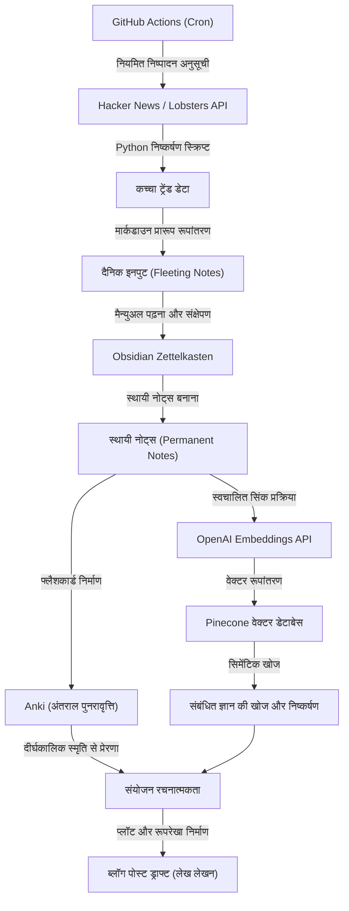

एक इंजीनियर या शोधकर्ता के रूप में तकनीकी ब्लॉग चलाते समय, आप लगभग निश्चित रूप से एक बाधा का सामना करेंगे। वह है "विचारों की कमी"। भले ही पहले कुछ लेख आसानी से लिखे जाते हैं, लेकिन जैसे-जैसे आप जारी रखते हैं, इस तरह की चिंताओं से परेशान होना असामान्य नहीं है कि "मुझे नहीं पता कि आगे क्या लिखना है" या "आउटपुट के लिए मेरे पास अत्यधिक रूप से इनपुट की कमी है"। तकनीकी ब्लॉग लिखना केवल पाठ लिखने के कौशल पर ही नहीं, बल्कि दैनिक ज्ञान इकट्ठा करने, व्यवस्थित करने और नए मूल्य बनाने के लिए उन्हें संयोजित करने वाली एक प्रणाली के डिजाइन पर बहुत अधिक निर्भर करता है।

इस लेख में, तकनीकी लेखों के विचारों को अर्ध-स्थायी रूप से उत्पन्न करते रहने के लिए **व्यवस्थित इनपुट और आउटपुट पाइपलाइन** के बारे में बेहद विस्तृत और तकनीकी व्याख्या की जाएगी। हम हैकर न्यूज़ (Hacker News) और लॉबस्टर्स (Lobsters) जैसे उच्च-गुणवत्ता वाले विदेशी सूचना स्रोतों से API का उपयोग करके स्वचालित रूप से ट्रेंडिंग विषय निकालने और GitHub Actions का उपयोग करके उन्हें नियमित रूप से निष्पादित करने के तंत्र से शुरू करेंगे। फिर, एकत्रित जानकारी को ऑब्सीडियन (Obsidian) का उपयोग करते हुए ज़ेटेलकास्टेन (Zettelkasten) पद्धति के माध्यम से ज्ञान के रूप में व्यवस्थित किया जाएगा, और एक उन्नत व्यक्तिगत ज्ञान प्रबंधन (PKM: Personal Knowledge Management) प्रणाली का निर्माण किया जाएगा जो OpenAI के Embeddings API और Pinecone (वेक्टर डेटाबेस) को जोड़कर सिमेंटिक खोज (Semantic Search) को सक्षम बनाता है।

इसके अलावा, मानव स्मृति की सीमाओं की भरपाई करने के लिए, एबिंगहॉस के विस्मरण वक्र (Ebbinghaus Forgetting Curve) पर आधारित अंतराल पुनरावृत्ति (Spaced Repetition) का Anki का उपयोग करके अभ्यास किया जाएगा। स्थापित ज्ञान को "संयोजन रचनात्मकता (Combinatorial Creativity)" के माध्यम से नए विचारों में बदलने की पूरी प्रक्रिया को विशिष्ट गणितीय मॉडल और पायथन स्क्रिप्ट (Python Script) कार्यान्वयन उदाहरणों के साथ गहराई से देखा जाएगा।

## 1. सूचना एन्ट्रापी और "विचारों की कमी" का तंत्र

हम "विचारों की कमी" का अनुभव क्यों करते हैं? सूचना सिद्धांत के दृष्टिकोण से देखा जाए, तो यह कहा जा सकता है कि हमारी ज्ञान प्रणाली में "सूचना की मात्रा" समाप्त हो गई है या समरूप हो गई है।

क्लाउड शैनन द्वारा प्रस्तावित सूचना एन्ट्रापी $H(X)$ एक सूचना स्रोत से प्राप्त सूचना की अनिश्चितता (या आश्चर्य की डिग्री) का प्रतिनिधित्व करती है।

$$ H(X) = - \sum_{i=1}^{n} P(x_i) \log_2 P(x_i) $$

यहाँ, $X$ सूचना स्रोत से प्राप्त विषयों का यादृच्छिक चर (Random Variable) है, और $P(x_i)$ उस विषय $x_i$ का सामना करने की प्रायिकता है। यदि आप नियमित रूप से समान वेबसाइटों (उदाहरण के लिए, केवल विशिष्ट घरेलू समाचार साइटें या एक ही तकनीकी स्टैक के दस्तावेज़) को देखते हैं, तो एक विशिष्ट $P(x_i)$ अत्यंत उच्च हो जाता है, और परिणामस्वरूप समग्र प्रणाली की एन्ट्रापी $H(X)$ कम हो जाती है। कम एन्ट्रापी की स्थिति का अर्थ है "कोई नई खोज (आश्चर्य) नहीं" वाली स्थिति, और यही "विचारों की कमी" का मूल कारण है।

एन्ट्रापी को उच्च बनाए रखने के लिए, जानबूझकर ऐसे सूचना स्रोतों को शोर (Noise) के रूप में शामिल करना आवश्यक है जिनका आप आमतौर पर सामना नहीं करते हैं, और अज्ञात विषयों का सामना करने के प्रायिकता वितरण को समतल करना चाहिए। विभिन्न सूचना स्रोतों से इनपुट को स्वचालित करने का यह सबसे बड़ा कारण है।

## 2. स्वचालित सूचना संग्रह पाइपलाइन का निर्माण: Hacker News और Lobsters API

उच्च गुणवत्ता वाला इनपुट प्राप्त करने के लिए, कम शोर वाले अच्छे इंजीनियर समुदायों से ट्रेंडिंग जानकारी निकालना प्रभावी है। हैकर न्यूज़ (Hacker News - Y Combinator द्वारा संचालित) और लॉबस्टर्स (Lobsters) ऐसी जगहें हैं जहाँ तकनीकी चर्चा गहराई से होती है। हालाँकि, हर दिन इन साइटों पर ब्राउज़ करने में समय लगता है और संज्ञानात्मक संसाधनों (Cognitive Resources) की खपत होती है।

इसलिए, हम एक स्क्रिप्ट बनाएंगे जो पायथन (Python) का उपयोग करके इन API से एक विशिष्ट स्कोर से ऊपर के लेखों को स्वचालित रूप से निकालेगी।

### पायथन का उपयोग करके ट्रेंडिंग लेख निष्कर्षण स्क्रिप्ट

निम्नलिखित स्क्रिप्ट हैकर न्यूज़ (Hacker News) के फायरबेस (Firebase) API और लॉबस्टर्स (Lobsters) के JSON फीड से विशिष्ट मानदंडों को पूरा करने वाले लेखों को प्राप्त करती है, और उन्हें एक मार्कडाउन (Markdown) फ़ाइल के रूप में आउटपुट करती है।

```python
import requests
import json
from datetime import datetime
import os

# सेटिंग्स
HN_TOPSTORIES_URL = "https://hacker-news.firebaseio.com/v0/topstories.json"
HN_ITEM_URL = "https://hacker-news.firebaseio.com/v0/item/{}.json"
LOBSTERS_URL = "https://lobste.rs/hottest.json"
MIN_HN_SCORE = 100
MIN_LOBSTERS_SCORE = 10
OUTPUT_DIR = "./daily_inputs"

def get_hacker_news_trends():
    """Hacker News से उच्च स्कोर वाले शीर्ष लेख प्राप्त करें"""
    print("Fetching Hacker News top stories...")
    response = requests.get(HN_TOPSTORIES_URL)
    if response.status_code != 200:
        return []
    
    story_ids = response.json()[:30] # शीर्ष 30 तक सीमित करें
    trending_stories = []
    
    for story_id in story_ids:
        item_resp = requests.get(HN_ITEM_URL.format(story_id))
        if item_resp.status_code == 200:
            item = item_resp.json()
            if item and item.get("score", 0) >= MIN_HN_SCORE:
                trending_stories.append({
                    "title": item.get("title"),
                    "url": item.get("url", f"https://news.ycombinator.com/item?id={story_id}"),
                    "score": item.get("score"),
                    "source": "Hacker News"
                })
    return trending_stories

def get_lobsters_trends():
    """Lobsters से उच्च स्कोर वाले लेख प्राप्त करें"""
    print("Fetching Lobsters hottest stories...")
    response = requests.get(LOBSTERS_URL)
    if response.status_code != 200:
        return []
    
    items = response.json()
    trending_stories = []
    
    for item in items:
        if item.get("score", 0) >= MIN_LOBSTERS_SCORE:
            trending_stories.append({
                "title": item.get("title"),
                "url": item.get("url", item.get("comments_url")),
                "score": item.get("score"),
                "source": "Lobsters"
            })
    return trending_stories

def save_to_markdown(stories):
    """प्राप्त किए गए लेखों को मार्कडाउन फ़ाइल के रूप में सहेजें"""
    if not os.path.exists(OUTPUT_DIR):
        os.makedirs(OUTPUT_DIR)
        
    today_str = datetime.now().strftime("%Y-%m-%d")
    filepath = os.path.join(OUTPUT_DIR, f"trends_{today_str}.md")
    
    with open(filepath, "w", encoding="utf-8") as f:
        f.write(f"# Daily Tech Trends: {today_str}\n\n")
        for story in stories:
            f.write(f"## [{story['title']}]({story['url']})\n")
            f.write(f"- **Source**: {story['source']}\n")
            f.write(f"- **Score**: {story['score']}\n")
            f.write(f"- **Notes**: (यहाँ अपने विचार जोड़ें)\n\n")
            
    print(f"Saved {len(stories)} stories to {filepath}")

if __name__ == "__main__":
    hn_stories = get_hacker_news_trends()
    lobsters_stories = get_lobsters_trends()
    all_stories = hn_stories + lobsters_stories
    
    # स्कोर के आधार पर अवरोही क्रम में सॉर्ट करें
    all_stories.sort(key=lambda x: x["score"], reverse=True)
    save_to_markdown(all_stories)
```

यह स्क्रिप्ट एक साधारण RSS रीडर से अधिक मूल्य प्रदान करती है। स्कोर के आधार पर फ़िल्टर करके, हम केवल उन तकनीकी विषयों को निकाल सकते हैं जो वास्तव में समुदाय का ध्यान आकर्षित कर रहे हैं (कम शोर वाले उच्च संकेत)।

## 3. GitHub Actions का उपयोग करके शेड्यूलिंग और स्वचालन

हर दिन बनाई गई पायथन स्क्रिप्ट को मैन्युअल रूप से निष्पादित करना एक परेशानी है। स्वचालन का मूल नियम मानवीय हस्तक्षेप को कम से कम करना है। GitHub Actions के क्रॉन (Cron) फ़ंक्शन का उपयोग करके, हम हर दिन एक निर्दिष्ट समय पर स्क्रिप्ट को निष्पादित करने और परिणामों को रिपॉजिटरी में स्वचालित रूप से कमिट करने के लिए एक तंत्र का निर्माण करेंगे।

प्रोजेक्ट के रूट में `.github/workflows/daily_trends.yml` बनाएं और इसे इस प्रकार लिखें:

```yaml
name: Daily Tech Trends Scraper

on:
  schedule:
    - cron: '0 0 * * *' # हर दिन UTC 0:00 बजे निष्पादित होता है (भारतीय समयानुसार सुबह 5:30)
  workflow_dispatch: # मैन्युअल निष्पादन के लिए

jobs:
  scrape-and-commit:
    runs-on: ubuntu-latest
    steps:
      - name: Checkout Repository
        uses: actions/checkout@v3
        
      - name: Setup Python
        uses: actions/setup-python@v4
        with:
          python-version: '3.10'
          
      - name: Install Dependencies
        run: |
          python -m pip install --upgrade pip
          pip install requests
          
      - name: Run Scraper Script
        run: python scripts/fetch_trends.py
        
      - name: Commit and Push Changes
        run: |
          git config --local user.email "action@github.com"
          git config --local user.name "GitHub Action"
          git add daily_inputs/
          git commit -m "Auto-update daily tech trends [skip ci]" || echo "No changes to commit"
          git push
```

इसके साथ, जब आप हर सुबह ऑब्सीडियन (Obsidian) खोलते हैं, तो आप एक ऐसी स्थिति बना सकते हैं जहाँ उस दिन के महत्वपूर्ण विषय स्वचालित रूप से आपके इनबॉक्स (`daily_inputs/`) में मार्कडाउन के रूप में जुड़ जाते हैं।

## 4. ज़ेटेलकास्टेन (Zettelkasten) और ऑब्सीडियन (Obsidian) का उपयोग करके ज्ञान का नेटवर्क बनाना

स्वचालित रूप से एकत्रित की गई जानकारी अभी भी केवल "डेटा" है। इसे "ज्ञान" में बदलने की प्रक्रिया आवश्यक है। यहीं ज़ेटेलकास्टेन (Zettelkasten) पद्धति और ऑब्सीडियन (Obsidian) उपयोगी साबित होते हैं।

ज़ेटेलकास्टेन एक नोट्स बनाने की विधि है जिसे जर्मन समाजशास्त्री निकलास लुहमन (Niklas Luhmann) ने विकसित किया था। नोट्स को पदानुक्रमित फ़ोल्डरों में वर्गीकृत करने के बजाय, यह विधि प्रत्येक नोट को छोटा (परमाणु रूप से) रखती है, और नोट्स को एक-दूसरे के साथ लिंक करके मस्तिष्क के तंत्रिका सर्किट के समान ज्ञान का नेटवर्क बनाती है।

ज़ेटेलकास्टेन में मुख्य रूप से 3 प्रकार के नोट्स होते हैं:
1. **अस्थायी नोट्स (Fleeting Notes)**: ऐसे नोट्स जो अस्थायी रूप से उन विचारों या एकत्र की गई जानकारी को रिकॉर्ड करते हैं जो दिमाग में आते हैं। स्वचालित रूप से उत्पन्न की गई ट्रेंडिंग जानकारी वाला मार्कडाउन इस श्रेणी में आता है।
2. **साहित्य नोट्स (Literature Notes)**: लेख या किताबें पढ़ने के बाद अपने शब्दों में लिखे गए सारांश।
3. **स्थायी नोट्स (Permanent Notes)**: एक ही विषय पर लिखे गए संपूर्ण विचार और राय। ये सीधे तौर पर ब्लॉग पोस्ट के लिए बीज (Seed) बन जाते हैं।

ऑब्सीडियन (Obsidian) की बैकलिंक सुविधा (`[[नोट का नाम]]`) का उपयोग करके, आप उदाहरण के लिए "Rust में स्वामित्व (Ownership in Rust)" पर एक नोट और "कचरा संग्रहण का इतिहास (History of Garbage Collection)" पर एक नोट लिंक कर सकते हैं, और विचारों के अप्रत्याशित कनेक्शन की खोज कर सकते हैं।

## 5. वेक्टर डेटाबेस (Pinecone) और OpenAI Embeddings का उपयोग करके सिमेंटिक खोज (Semantic Search)

जब नोट्स की संख्या सैकड़ों या हज़ारों में बढ़ जाती है, तो केवल कीवर्ड सर्च (पूर्ण-पाठ खोज) के साथ वांछित नोट ढूंढना मुश्किल हो जाता है। ऐसे मामलों में जहाँ "मुझे कीवर्ड याद नहीं आ रहा है, लेकिन मैं ऐसी अवधारणा वाला एक नोट खोजना चाहता हूँ जो समान हो," बड़े भाषा मॉडल (LLM) के Embeddings का लाभ उठाने वाली सिमेंटिक (अर्थ संबंधी) खोज बहुत प्रभावी हो जाती है।

OpenAI के `text-embedding-ada-002` मॉडल (या `text-embedding-3-small`) का उपयोग करते हुए, ऑब्सीडियन के प्रत्येक मार्कडाउन नोट को एक बहुआयामी वेक्टर (सैकड़ों से लेकर हज़ारों आयामों वाली संख्याओं की एक सरणी) में परिवर्तित किया जाता है। इन वेक्टर स्थानों में, समान अर्थ वाले वाक्यों के वैक्टरों की भौतिक दूरी भी करीब होती है।

वैक्टरों के बीच समानता को मापने के लिए, कोसाइन समानता (Cosine Similarity) का व्यापक रूप से उपयोग किया जाता है।

$$ \text{similarity} = \cos(\theta) = \frac{\mathbf{A} \cdot \mathbf{B}}{\|\mathbf{A}\| \|\mathbf{B}\|} = \frac{\sum_{i=1}^{n} A_i B_i}{\sqrt{\sum_{i=1}^{n} A_i^2} \sqrt{\sum_{i=1}^{n} B_i^2}} $$

$\mathbf{A}$ और $\mathbf{B}$ क्रमशः क्वेरी स्ट्रिंग का वेक्टर और नोट का वेक्टर हैं। इस गणना को तेज़ी से करने के लिए, पाइनकोन (Pinecone) या क्यूड्रैंट (Qdrant) जैसे वेक्टर डेटाबेस का उपयोग किया जाता है।

### सिमेंटिक खोज कार्यान्वयन का उदाहरण

नीचे एक पायथन स्क्रिप्ट का हिस्सा दिया गया है जो ऑब्सीडियन नोट निर्देशिका को स्कैन करता है, इसे OpenAI API का उपयोग करके वेक्टर में परिवर्तित करता है, और इसे पाइनकोन (Pinecone) में अपसर्ट (सम्मिलित/अद्यतन) करता है।

```python
import os
import glob
from openai import OpenAI
from pinecone import Pinecone, ServerlessSpec

# API कुंजियों को कॉन्फ़िगर करना (पर्यावरण चर से प्राप्त)
OPENAI_API_KEY = os.getenv("OPENAI_API_KEY")
PINECONE_API_KEY = os.getenv("PINECONE_API_KEY")

client = OpenAI(api_key=OPENAI_API_KEY)
pc = Pinecone(api_key=PINECONE_API_KEY)

INDEX_NAME = "obsidian-notes"
OBSIDIAN_DIR = "/path/to/obsidian/vault/PermanentNotes"

def init_pinecone():
    """Pinecone इंडेक्स का इनिशियलाइज़ेशन"""
    if INDEX_NAME not in pc.list_indexes().names():
        pc.create_index(
            name=INDEX_NAME,
            dimension=1536, # text-embedding-3-small / ada-002 के आयाम
            metric="cosine",
            spec=ServerlessSpec(cloud="aws", region="us-east-1")
        )
    return pc.Index(INDEX_NAME)

def get_embedding(text):
    """OpenAI API का उपयोग करके टेक्स्ट को वेक्टराइज़ करें"""
    response = client.embeddings.create(
        input=text,
        model="text-embedding-3-small"
    )
    return response.data[0].embedding

def sync_notes_to_pinecone(index):
    """मार्कडाउन फ़ाइलें पढ़ें, उन्हें वेक्टराइज़ करें, और Pinecone में सहेजें"""
    md_files = glob.glob(os.path.join(OBSIDIAN_DIR, "*.md"))
    
    vectors = []
    for filepath in md_files:
        filename = os.path.basename(filepath)
        with open(filepath, "r", encoding="utf-8") as f:
            content = f.read()
            
        # केवल तभी प्रक्रिया करें जब नोट की सामग्री खाली न हो
        if content.strip():
            print(f"Embedding note: {filename}")
            embedding = get_embedding(content)
            
            # Pinecone स्वरूप (id, vector, metadata)
            vectors.append({
                "id": filename,
                "values": embedding,
                "metadata": {"text": content[:500]} # खोज परिणामों में दिखाने के लिए टेक्स्ट का हिस्सा
            })
            
    # बैच प्रक्रिया के साथ अपसर्ट
    if vectors:
        index.upsert(vectors=vectors)
        print(f"Successfully upserted {len(vectors)} notes.")

def search_similar_ideas(index, query_text, top_k=3):
    """क्वेरी के समान नोट्स खोजें और उनका उपयोग विचारों को उत्पन्न करने के लिए करें"""
    query_embedding = get_embedding(query_text)
    
    results = index.query(
        vector=query_embedding,
        top_k=top_k,
        include_metadata=True
    )
    
    print(f"\n--- Search Results for: '{query_text}' ---")
    for match in results["matches"]:
        print(f"Score: {match['score']:.4f} | Note: {match['id']}")
        print(f"Preview: {match['metadata']['text'][:100]}...\n")

if __name__ == "__main__":
    idx = init_pinecone()
    # DB बनाने के लिए पहली बार चलाते समय sync_notes_to_pinecone(idx) पर कॉल करें
    sync_notes_to_pinecone(idx)
    
    # ब्लॉग विचारों के लिए खोजें
    search_similar_ideas(idx, "WebAssembly का उपयोग करके ब्राउज़र में मशीन लर्निंग इन्फरेंस का त्वरण")
```

इस प्रणाली का उपयोग करके, प्रश्न के लिए "मैं 'WebAssembly' के बारे में लिखना चाहता हूँ जो इस सप्ताह हैकर न्यूज़ पर एक गर्म विषय था, लेकिन क्या मैंने अतीत में कोई संबंधित नोट्स लिखे हैं?", AI अर्थपूर्ण रूप से संबंधित अतीत के स्थायी नोट्स (Permanent Notes) को तुरंत उठा लेगा। यह आपको अपनी पिछली ज्ञान संपत्तियों का पूरा उपयोग करते हुए गहन लेख संरचना बनाने की अनुमति देता है।

## 6. एबिंगहॉस विस्मरण वक्र (Ebbinghaus Forgetting Curve) और Anki का उपयोग करके अंतराल पुनरावृत्ति (Spaced Repetition)

आप नोट्स में कितनी भी बेहतरीन जानकारी क्यों न दर्ज कर लें, लेकिन अगर वह ज्ञान लेखक के मस्तिष्क में स्थापित नहीं है, तो लेखन के दौरान कई अवधारणाओं को आसानी से जोड़ना मुश्किल होगा। यहाँ, मानव स्मृति के तंत्र को गणितीय रूप से मॉडल करने वाला "एबिंगहॉस विस्मरण वक्र" काम आता है।

विस्मरण वक्र को निम्नलिखित समीकरण द्वारा अनुमानित किया जाता है:

$$ R = e^{-\frac{t}{S}} $$

यहाँ,
- $R$ स्मृति की पुनर्प्राप्ति क्षमता (Retrievability) है (0 से 1 की सीमा)
- $t$ सीखने के बाद से बीता हुआ समय है
- $S$ स्मृति की स्थिरता (Stability) या ताकत है

किसी नई अवधारणा को सीखने के तुरंत बाद, $S$ छोटा होता है, और समय $t$ के साथ $R$ तेजी से घटता है (भूलना)। हालाँकि, यदि आप भूलने वाले ही होते हैं उस उत्तम समय पर समीक्षा (Recall) करते हैं, तो अगली बार भूलने की गति धीमी हो जाएगी ($S$ बड़ा हो जाता है), और यह दीर्घकालिक स्मृति (Long-term Memory) में स्थापित हो जाएगा।

"Anki" एक ऐसा सॉफ़्टवेयर है जो एल्गोरिदम (जैसे SuperMemo 2) का उपयोग करके स्वचालित रूप से इस इष्टतम समीक्षा समय की गणना करता है और इसे फ़्लैशकार्ड (Flashcards) के रूप में प्रस्तुत करता है।

तकनीकी ब्लॉग के लिए विचार उत्पन्न करने के लिए एक शक्तिशाली दृष्टिकोण के रूप में, **ऑब्सीडियन (Obsidian) के स्थायी नोट्स (Permanent Notes) की सामग्री को Anki फ़्लैशकार्ड में परिवर्तित करना** शामिल हो सकता है।
उदाहरण के लिए, तकनीकी नींव से संबंधित प्रश्नों को दर्ज करें, जैसे "CAP प्रमेय के 3 तत्व क्या हैं?" और "क्या कारण है कि B-Tree इंडेक्स में O(log N) का खोज प्रदर्शन है?", और उन्हें अपनी दैनिक दिनचर्या के हिस्से के रूप में समीक्षा करें। जब ज्ञान को आपके मस्तिष्क में दीर्घकालिक स्मृति के रूप में अनुक्रमित किया जाता है, तो जानकारी अनजाने में जुड़ जाती है जब आप स्नान कर रहे होते हैं या टहल रहे होते हैं, जिससे यह अहसास (यूरेका क्षण) होता है, "आह, मैं वितरित प्रणालियों (Distributed Systems) के सर्वसम्मति एल्गोरिदम पर एक लेख लिख सकता हूँ।"

## 7. संयोजन रचनात्मकता (Combinatorial Creativity)

अब तक की पाइपलाइन ने "विभिन्न जानकारी के इनपुट", "ज़ेटेलकास्टेन (Zettelkasten) और एआई खोज द्वारा संगठन", और "Anki के माध्यम से दीर्घकालिक स्मृति में प्रतिधारण" प्राप्त किया है। अंतिम चरण "संयोजन रचनात्मकता (Combinatorial Creativity)" है, जो पूरी तरह से नए तकनीकी लेख विचार उत्पन्न करने के लिए इन तत्वों को गुणा करता है।

नवाचार (Innovation) और रचनात्मकता शून्य से कुछ नहीं बनाते हैं, बल्कि मौजूदा तत्वों के नए संयोजनों से उत्पन्न होते हैं। स्टीव जॉब्स (Steve Jobs) के शब्द, "रचनात्मकता बस चीजों को जोड़ना है (Creativity is just connecting things)" प्रसिद्ध हैं।

तकनीकी ब्लॉग के लिए संयोजन पैटर्न के रूप में निम्नलिखित मैट्रिक्स पर विचार किया जा सकता है:

1. **[पुरानी तकनीक] × [नया प्रतिमान (Paradigm)]**: उदाहरण "COBOL की वास्तुकला से सीखना: आधुनिक माइक्रोसेवाओं (Microservices) के डिजाइन का एंटी-पैटर्न"
2. **[फ्रंट-एंड] × [बैक-एंड की अवधारणा]**: उदाहरण "डेटाबेस के लेनदेन अलगाव स्तरों (Transaction Isolation Levels) के परिप्रेक्ष्य से React के वर्चुअल DOM अपडेट एल्गोरिदम की व्याख्या"
3. **[सार गणित/सिद्धांत] × [विशिष्ट कार्यान्वयन]**: उदाहरण "ग्राफ सिद्धांत (Graph Theory) का उपयोग करके Kubernetes के पॉड शेड्यूलिंग अनुकूलन (Pod Scheduling Optimization) को समझना"

इस संयोजन को जानबूझकर उत्पन्न करने के लिए, आप पहले बनाए गए पाइनकोन (Pinecone) सिमेंटिक खोज सिस्टम का उपयोग करके यादृच्छिक अवधारणा A और अवधारणा B को निकाल सकते हैं, और AI (जैसे ChatGPT) को एक प्रॉम्प्ट दे सकते हैं, "इन दोनों को मिलाकर तकनीकी ब्लॉग के 5 शीर्षक और अनुक्रमणिका (Table of Contents) विचार सुझाएँ।" ऐसा करके, आप अनंत संख्या में उपन्यास लेख विचार उत्पन्न कर सकते हैं जिनके बारे में आप स्वयं कभी नहीं सोच सकते थे।

## 8. समग्र सिस्टम वास्तुकला

तकनीकी लेखों के विचारों की कमी को रोकने के लिए "सूचना संग्रह से लेकर विचार सृजन तक" की समग्र वास्तुकला, जिसे अब तक समझाया गया है, निम्नलिखित मर्मेड (Mermaid) फ़्लोचार्ट में सारांशित की गई है।



इस प्रणाली की विशेषता यह है कि **"बौद्धिक कार्य जो मैन्युअल रूप से किया जाना चाहिए (संक्षेपण, विचार और लेखन)" और "कार्य जो मशीन पर छोड़ दिया जाना चाहिए (संग्रह, खोज, और अंतराल पुनरावृत्ति का शेड्यूलिंग)" पूरी तरह से अलग हैं**। यह लेखक को उच्चतम मूल्यवर्धित कार्यों पर ध्यान केंद्रित करने की अनुमति देता है: "सोचना" और "संयोजन करना"।

## 9. विचार से लेकर प्रकाशन तक का अवस्था संक्रमण मॉडल (State Transition Model)

ज़ेटेलकास्टेन (Zettelkasten) में संचित विचारों के अंततः ब्लॉग लेख के रूप में प्रकाशित होने तक के जीवनचक्र (Lifecycle) को निम्नलिखित अवस्था संक्रमण आरेख (State Transition Diagram) के रूप में दर्शाया जा सकता है। प्रत्येक अवस्था में उपयुक्त टूल और दृष्टिकोण का उपयोग किया जाता है।

```mermaid
stateDiagram-v2
    [*] --> Capture["विचारों को पकड़ना (Idea Capture)"]
    
    Capture["विचारों को पकड़ना (Idea Capture)"] --> Fleeting["अस्थायी नोट्स (Fleeting Notes)"]
    Fleeting["अस्थायी नोट्स (Fleeting Notes)"] --> Permanent["स्थायी नोट्स (Permanent Notes)"]
    
    Permanent["स्थायी नोट्स (Permanent Notes)"] --> Brainstorming["ब्रेनस्टॉर्मिंग (AI सिमेंटिक खोज)"]
    Permanent["स्थायी नोट्स (Permanent Notes)"] --> Memorization["याद करना (Anki समीक्षा)"]
    Memorization["याद करना (Anki समीक्षा)"] --> Brainstorming["ब्रेनस्टॉर्मिंग (AI सिमेंटिक खोज)"]
    
    Brainstorming["ब्रेनस्टॉर्मिंग (AI सिमेंटिक खोज)"] --> Outlining["रूपरेखा (Outlining)"]
    Outlining["रूपरेखा (Outlining)"] --> Drafting["प्रारूपण (Drafting)"]
    
    Drafting["प्रारूपण (Drafting)"] --> Review["समीक्षा और संपादन (Review & Edit)"]
    Review["समीक्षा और संपादन (Review & Edit)"] --> Published["प्रकाशित (Published)"]
    
    Published["प्रकाशित (Published)"] --> [*]
```



इस वर्कफ़्लो के प्रति सचेत रहने से, यह स्पष्ट हो जाता है कि "मैं वर्तमान में किस चरण में अटका हुआ हूँ।" जब आप विचारों के लिए फंस जाते हैं, तो आपको बस 'विचारों को पकड़ना (Capture)' या 'स्थायी नोट्स (Permanent)' चरण पर वापस लौटना होगा और जांचना होगा कि इनपुट पाइपलाइन ठीक से काम कर रही है या नहीं।

## निष्कर्ष: लेखन एक "प्रणाली (System)" है

"तकनीकी ब्लॉग के लिए विचारों की कमी" व्यक्तिगत क्षमता की कमी या प्रेरणा की हानि के कारण नहीं है, बल्कि **यह ज्ञान को प्रसारित करने वाली प्रणाली के निर्माण न होने का एक अपरिहार्य परिणाम** है।

जैसा कि इस लेख में बताया गया है:
1. **API और स्वचालन** के माध्यम से कम शोर वाले उच्च गुणवत्ता वाले इनपुट को सुरक्षित करना।
2. **ऑब्सीडियन (Obsidian)** का उपयोग करते हुए ज़ेटेलकास्टेन (Zettelkasten) के माध्यम से ज्ञान का नेटवर्क बनाना।
3. **OpenAI और Pinecone** के माध्यम से अपनी संपत्तियों की सिमेंटिक खोज।
4. **Anki** और एबिंगहॉस विस्मरण वक्र (Ebbinghaus Forgetting Curve) का उपयोग करके मस्तिष्क में अनुक्रमण (Indexing) को मजबूत करना।
5. मौजूदा अवधारणाओं को गुणा करने के लिए **संयोजन रचनात्मकता (Combinatorial Creativity)**।

इन तत्वों को मिलाकर एक व्यापक पाइपलाइन बनाकर, आप एक ऐसी स्थिति बना सकते हैं जहाँ आपके ब्लॉग के विचार समाप्त होने के बजाय, आप जितना अधिक लिखते हैं, उतने ही नए विचार अपने आप बढ़ते जाते हैं।

शुरुआत से ही सब कुछ पूरी तरह से बनाने की कोई आवश्यकता नहीं है। हैकर न्यूज़ API को हिट करने वाली एक सरल स्क्रिप्ट बनाकर शुरुआत करें और अपनी रुचि वाले लेखों को मार्कडाउन (Markdown) में नोट करने की आदत डालें। हमें उम्मीद है कि आपका तकनीकी ब्लॉग अगली पीढ़ी के महान विचारों का स्रोत बन जाएगा।
