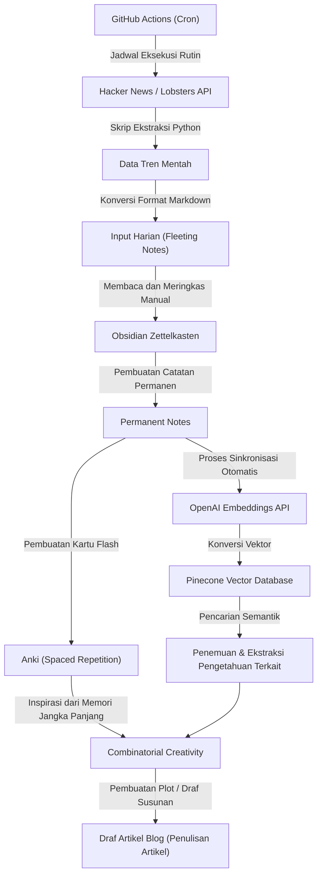

Sebagai seorang engineer atau researcher yang mengelola blog teknologi, ada satu rintangan yang hampir pasti akan Anda hadapi. Yaitu "kehabisan ide". Meskipun beberapa artikel pertama dapat ditulis dengan lancar, seiring berjalannya waktu, tidak jarang kita merasa tersiksa oleh kekhawatiran seperti "Saya tidak tahu apa yang harus ditulis selanjutnya" atau "Input saya sangat kurang untuk menghasilkan output". Menulis blog teknologi tidak hanya bergantung pada keterampilan menulis, tetapi juga sangat bergantung pada perancangan sistem yang mencakup pengumpulan pengetahuan harian, pengorganisasian, dan penggabungan elemen-elemen tersebut untuk menciptakan nilai baru.

Dalam artikel ini, kami akan menjelaskan secara sangat rinci dan teknis tentang **pipeline input dan output yang disistematisasi** untuk terus menghasilkan ide artikel teknologi secara semi-permanen. Kita akan mulai dengan mekanisme untuk secara otomatis mengekstrak topik yang sedang tren menggunakan API dari sumber informasi luar negeri berkualitas tinggi seperti Hacker News dan Lobsters, serta menjalankannya secara rutin dengan GitHub Actions. Kemudian, informasi yang terkumpul akan disistematisasi sebagai pengetahuan menggunakan metode Zettelkasten dengan Obsidian, dan dikombinasikan dengan Embeddings API dari OpenAI serta Pinecone (database vektor) untuk memungkinkan pencarian semantik, membangun sistem Manajemen Pengetahuan Pribadi (PKM: Personal Knowledge Management) yang canggih.

Selain itu, untuk mengimbangi keterbatasan daya ingat manusia, kita akan mempraktikkan Pengulangan Berjarak (Spaced Repetition) menggunakan Anki berdasarkan kurva kelupaan Ebbinghaus, dan mendalami serangkaian proses untuk menyublimasikan pengetahuan yang telah melekat menjadi ide-ide baru melalui "Kreativitas Kombinatorial (Combinatorial Creativity)", lengkap dengan model matematis spesifik dan contoh implementasi skrip Python.

## 1. Entropi Informasi dan Mekanisme "Kehabisan Ide"

Mengapa kita mengalami "kehabisan ide"? Dilihat dari perspektif teori informasi, ini dapat dikatakan sebagai keadaan di mana "jumlah informasi" dari sistem pengetahuan yang kita miliki telah habis, atau telah menjadi homogen.

Entropi informasi $H(X)$ yang digagas oleh Claude Shannon merepresentasikan ketidakpastian (atau tingkat kejutan) dari informasi yang diperoleh dari suatu sumber informasi.

$$ H(X) = - \sum_{i=1}^{n} P(x_i) \log_2 P(x_i) $$

Di sini, $X$ adalah variabel acak dari topik yang diperoleh dari sumber informasi, dan $P(x_i)$ adalah probabilitas menemukan topik $x_i$ tersebut. Jika Anda selalu melihat situs web yang sama (misalnya, hanya situs berita domestik tertentu atau dokumentasi tumpukan teknologi yang sama), $P(x_i)$ tertentu menjadi sangat tinggi, yang mengakibatkan penurunan entropi $H(X)$ dari keseluruhan sistem. Keadaan entropi rendah berarti keadaan di mana "tidak ada penemuan (kejutan) baru", dan inilah akar penyebab dari "kehabisan ide".

Untuk menjaga entropi tetap tinggi, kita perlu secara sengaja memasukkan sumber informasi yang biasanya tidak kita akses sebagai noise, dan meratakan distribusi probabilitas dalam bersentuhan dengan topik-topik yang belum diketahui. Inilah alasan terbesar mengapa kita harus mengotomatisasi input dari berbagai sumber informasi.

## 2. Membangun Pipeline Pengumpulan Informasi Otomatis: Hacker News & Lobsters API

Untuk mendapatkan input yang berkualitas tinggi, akan sangat efektif untuk mengekstrak informasi tren dari komunitas engineer berkualitas baik dengan tingkat noise yang rendah. Hacker News (dioperasikan oleh Y Combinator) dan Lobsters adalah tempat terbaik di mana diskusi teknis yang mendalam berlangsung. Namun, menelusuri situs-situs ini setiap hari memakan waktu dan menghabiskan sumber daya kognitif.

Oleh karena itu, kita akan membuat skrip menggunakan Python untuk secara otomatis mengekstrak artikel dengan skor tertentu atau lebih tinggi dari API ini.

### Skrip Ekstraksi Artikel Tren dengan Python

Skrip berikut mengambil artikel yang memenuhi kriteria tertentu dari Firebase API Hacker News dan umpan JSON Lobsters, dan mengeluarkannya sebagai file Markdown.

```python
import requests
import json
from datetime import datetime
import os

# Pengaturan
HN_TOPSTORIES_URL = "https://hacker-news.firebaseio.com/v0/topstories.json"
HN_ITEM_URL = "https://hacker-news.firebaseio.com/v0/item/{}.json"
LOBSTERS_URL = "https://lobste.rs/hottest.json"
MIN_HN_SCORE = 100
MIN_LOBSTERS_SCORE = 10
OUTPUT_DIR = "./daily_inputs"

def get_hacker_news_trends():
    """Mengambil artikel teratas dengan skor tinggi dari Hacker News"""
    print("Fetching Hacker News top stories...")
    response = requests.get(HN_TOPSTORIES_URL)
    if response.status_code != 200:
        return []
    
    story_ids = response.json()[:30] # Batasi 30 besar
    trending_stories = []
    
    for story_id in story_ids:
        item_resp = requests.get(HN_ITEM_URL.format(story_id))
        if item_resp.status_code == 200:
            item = item_resp.json()
            if item and item.get("score", 0) >= MIN_HN_SCORE:
                trending_stories.append({
                    "title": item.get("title"),
                    "url": item.get("url", f"https://news.ycombinator.com/item?id={story_id}"),
                    "score": item.get("score"),
                    "source": "Hacker News"
                })
    return trending_stories

def get_lobsters_trends():
    """Mengambil artikel dengan skor tinggi dari Lobsters"""
    print("Fetching Lobsters hottest stories...")
    response = requests.get(LOBSTERS_URL)
    if response.status_code != 200:
        return []
    
    items = response.json()
    trending_stories = []
    
    for item in items:
        if item.get("score", 0) >= MIN_LOBSTERS_SCORE:
            trending_stories.append({
                "title": item.get("title"),
                "url": item.get("url", item.get("comments_url")),
                "score": item.get("score"),
                "source": "Lobsters"
            })
    return trending_stories

def save_to_markdown(stories):
    """Menyimpan artikel yang diambil sebagai file Markdown"""
    if not os.path.exists(OUTPUT_DIR):
        os.makedirs(OUTPUT_DIR)
        
    today_str = datetime.now().strftime("%Y-%m-%d")
    filepath = os.path.join(OUTPUT_DIR, f"trends_{today_str}.md")
    
    with open(filepath, "w", encoding="utf-8") as f:
        f.write(f"# Daily Tech Trends: {today_str}\n\n")
        for story in stories:
            f.write(f"## [{story['title']}]({story['url']})\n")
            f.write(f"- **Source**: {story['source']}\n")
            f.write(f"- **Score**: {story['score']}\n")
            f.write(f"- **Notes**: (Tambahkan observasi Anda di sini)\n\n")
            
    print(f"Saved {len(stories)} stories to {filepath}")

if __name__ == "__main__":
    hn_stories = get_hacker_news_trends()
    lobsters_stories = get_lobsters_trends()
    all_stories = hn_stories + lobsters_stories
    
    # Urutkan berdasarkan skor secara menurun
    all_stories.sort(key=lambda x: x["score"], reverse=True)
    save_to_markdown(all_stories)
```

Skrip ini memberikan nilai lebih dari sekadar pembaca RSS sederhana. Dengan memfilter berdasarkan skor, kita hanya mengekstrak topik teknis yang benar-benar diperhatikan oleh komunitas (sinyal tinggi dengan noise rendah).

## 3. Penjadwalan dan Otomatisasi dengan GitHub Actions

Menjalankan skrip Python yang telah dibuat secara manual setiap hari sangat merepotkan. Dasar dari otomatisasi adalah mengurangi campur tangan manusia semaksimal mungkin. Kita akan membangun mekanisme untuk menjalankan skrip setiap hari pada waktu yang ditentukan dan mengkomit hasilnya secara otomatis ke repositori menggunakan fitur Cron dari GitHub Actions.

Buat file `.github/workflows/daily_trends.yml` di root proyek, dan tulis sebagai berikut.

```yaml
name: Daily Tech Trends Scraper

on:
  schedule:
    - cron: '0 0 * * *' # Dijalankan setiap hari pada 0:00 UTC (9:00 JST)
  workflow_dispatch: # Untuk eksekusi manual

jobs:
  scrape-and-commit:
    runs-on: ubuntu-latest
    steps:
      - name: Checkout Repository
        uses: actions/checkout@v3
        
      - name: Setup Python
        uses: actions/setup-python@v4
        with:
          python-version: '3.10'
          
      - name: Install Dependencies
        run: |
          python -m pip install --upgrade pip
          pip install requests
          
      - name: Run Scraper Script
        run: python scripts/fetch_trends.py
        
      - name: Commit and Push Changes
        run: |
          git config --local user.email "action@github.com"
          git config --local user.name "GitHub Action"
          git add daily_inputs/
          git commit -m "Auto-update daily tech trends [skip ci]" || echo "No changes to commit"
          git push
```

Dengan ini, setiap pagi saat Anda membuka Obsidian, topik penting hari itu akan secara otomatis ditambahkan ke kotak masuk (`daily_inputs/`) dalam format Markdown.

## 4. Pembentukan Jaringan Pengetahuan menggunakan Zettelkasten dan Obsidian

Informasi yang terkumpul secara otomatis masih sekadar "data". Diperlukan proses untuk menyublimasikannya menjadi "pengetahuan". Di sinilah metode Zettelkasten dan Obsidian berperan.

Zettelkasten adalah metode pembuatan catatan yang dirancang oleh sosiolog Jerman, Niklas Luhmann. Alih-alih mengklasifikasikan catatan ke dalam folder hierarkis, metode ini menjaga setiap catatan tetap kecil (atomik) dan menghubungkannya dengan tautan, sehingga membangun jaringan pengetahuan yang menyerupai sirkuit saraf otak.

Pada umumnya terdapat 3 jenis catatan dalam Zettelkasten:
1. **Fleeting Notes (Catatan Sekilas)**: Mencatat ide-ide yang muncul atau informasi yang dikumpulkan untuk sementara. Markdown dari informasi tren yang dibuat secara otomatis sebelumnya termasuk dalam kategori ini.
2. **Literature Notes (Catatan Literatur)**: Ringkasan dengan kata-kata sendiri setelah membaca artikel atau buku.
3. **Permanent Notes (Catatan Permanen)**: Berisi pemikiran utuh mengenai satu topik. Inilah yang menjadi benih langsung dari artikel blog.

Dengan menggunakan fitur backlink Obsidian (`[[Nama Catatan]]`), misalnya dengan menautkan catatan "Kepemilikan di Rust" dan "Sejarah Garbage Collection", Anda dapat menemukan koneksi ide yang tidak terduga.

## 5. Pencarian Semantik Menggunakan Database Vektor (Pinecone) dan OpenAI Embeddings

Ketika jumlah catatan bertambah menjadi ratusan hingga ribuan, akan sulit menemukan catatan yang dituju hanya dengan pencarian kata kunci biasa (pencarian teks penuh). Pencarian semantik, yang memanfaatkan Embeddings dari Large Language Model (LLM), menunjukkan kehebatannya ketika Anda ingin "Mencari catatan yang secara konsep mirip meskipun kata kuncinya tidak teringat".

Menggunakan model `text-embedding-ada-002` (atau `text-embedding-3-small`) dari OpenAI, setiap catatan Markdown Obsidian dikonversi menjadi vektor multi-dimensi (array numerik yang terdiri dari ratusan hingga ribuan dimensi). Di dalam ruang vektor ini, kalimat dengan makna yang mirip akan memiliki jarak fisik yang lebih dekat antar vektornya.

Untuk mengukur kemiripan antar vektor, Cosine Similarity (Kesamaan Kosinus) secara luas digunakan.

$$ \text{similarity} = \cos(\theta) = \frac{\mathbf{A} \cdot \mathbf{B}}{\|\mathbf{A}\| \|\mathbf{B}\|} = \frac{\sum_{i=1}^{n} A_i B_i}{\sqrt{\sum_{i=1}^{n} A_i^2} \sqrt{\sum_{i=1}^{n} B_i^2}} $$

$\mathbf{A}$ dan $\mathbf{B}$ masing-masing adalah vektor dari string kueri dan vektor dari catatan. Untuk melakukan perhitungan ini dengan cepat, kita menggunakan database vektor seperti Pinecone atau Qdrant.

### Contoh Implementasi Pencarian Semantik

Berikut adalah bagian dari skrip Python yang memindai direktori catatan Obsidian, melakukan vektorisasi dengan OpenAI API, lalu mengunggahnya (upsert - masukkan/perbarui) ke Pinecone.

```python
import os
import glob
from openai import OpenAI
from pinecone import Pinecone, ServerlessSpec

# Pengaturan API Key (Didapat dari environment variables)
OPENAI_API_KEY = os.getenv("OPENAI_API_KEY")
PINECONE_API_KEY = os.getenv("PINECONE_API_KEY")

client = OpenAI(api_key=OPENAI_API_KEY)
pc = Pinecone(api_key=PINECONE_API_KEY)

INDEX_NAME = "obsidian-notes"
OBSIDIAN_DIR = "/path/to/obsidian/vault/PermanentNotes"

def init_pinecone():
    """Inisialisasi indeks Pinecone"""
    if INDEX_NAME not in pc.list_indexes().names():
        pc.create_index(
            name=INDEX_NAME,
            dimension=1536, # Dimensi untuk text-embedding-3-small / ada-002
            metric="cosine",
            spec=ServerlessSpec(cloud="aws", region="us-east-1")
        )
    return pc.Index(INDEX_NAME)

def get_embedding(text):
    """Vektorisasi teks menggunakan OpenAI API"""
    response = client.embeddings.create(
        input=text,
        model="text-embedding-3-small"
    )
    return response.data[0].embedding

def sync_notes_to_pinecone(index):
    """Membaca file Markdown, vektorisasi, dan menyimpannya ke Pinecone"""
    md_files = glob.glob(os.path.join(OBSIDIAN_DIR, "*.md"))
    
    vectors = []
    for filepath in md_files:
        filename = os.path.basename(filepath)
        with open(filepath, "r", encoding="utf-8") as f:
            content = f.read()
            
        # Proses hanya jika konten catatan tidak kosong
        if content.strip():
            print(f"Embedding note: {filename}")
            embedding = get_embedding(content)
            
            # Format Pinecone (id, vector, metadata)
            vectors.append({
                "id": filename,
                "values": embedding,
                "metadata": {"text": content[:500]} # Sebagian teks untuk ditampilkan pada hasil pencarian
            })
            
    # Upsert melalui batch processing
    if vectors:
        index.upsert(vectors=vectors)
        print(f"Successfully upserted {len(vectors)} notes.")

def search_similar_ideas(index, query_text, top_k=3):
    """Mencari catatan yang mirip dengan kueri untuk keperluan ide"""
    query_embedding = get_embedding(query_text)
    
    results = index.query(
        vector=query_embedding,
        top_k=top_k,
        include_metadata=True
    )
    
    print(f"\n--- Search Results for: '{query_text}' ---")
    for match in results["matches"]:
        print(f"Score: {match['score']:.4f} | Note: {match['id']}")
        print(f"Preview: {match['metadata']['text'][:100]}...\n")

if __name__ == "__main__":
    idx = init_pinecone()
    # Saat dijalankan pertama kali, panggil sync_notes_to_pinecone(idx) untuk membangun DB
    sync_notes_to_pinecone(idx)
    
    # Pencarian untuk ide artikel blog
    search_similar_ideas(idx, "Mempercepat inferensi machine learning di browser menggunakan WebAssembly")
```

Dengan menggunakan sistem ini, ketika Anda bertanya, "Saya ingin menulis tentang 'WebAssembly' yang sedang ramai di Hacker News minggu ini, tapi apakah saya pernah menulis catatan terkait sebelumnya?", AI akan dengan instan mengambil Permanent Notes (Catatan Permanen) terdahulu yang relevan secara semantik. Hal ini memungkinkan penulisan artikel mendalam yang sepenuhnya memanfaatkan aset pengetahuan Anda di masa lalu.

## 6. Pengulangan Berjarak Memanfaatkan Kurva Kelupaan Ebbinghaus dan Anki

Tidak peduli seberapa baik pengetahuan dicatat dalam buku catatan, akan sulit untuk menghubungkan berbagai konsep secara fasih selama proses penulisan jika pengetahuan tersebut belum tertanam di otak penulis. Di sinilah "Kurva Kelupaan Ebbinghaus" hadir, yang merupakan pemodelan matematis dari mekanisme memori manusia.

Kurva kelupaan didekati dengan persamaan berikut:

$$ R = e^{-\frac{t}{S}} $$

Di mana:
- $R$ adalah tingkat retensi memori (Retrievability, rentang 0 hingga 1)
- $t$ adalah waktu berlalu setelah pembelajaran
- $S$ adalah stabilitas (Stability) atau kekuatan memori

Tepat setelah mempelajari konsep baru, $S$ berukuran kecil, dan $R$ turun (lupa) secara dramatis seiring berjalannya waktu $t$. Namun, jika Anda melakukan peninjauan kembali (Recall) pada saat-saat yang tepat ketika Anda hampir lupa, kecepatan kelupaan selanjutnya akan melambat ($S$ membesar), dan ingatan tersebut akan beralih menjadi memori jangka panjang.

Perangkat lunak yang secara otomatis menghitung waktu peninjauan kembali optimal dengan menggunakan algoritme (seperti SuperMemo 2) dan menyajikannya sebagai kartu flash (flashcard) adalah "Anki".

Sebagai pendekatan yang kuat untuk menghasilkan ide blog teknologi, **mengonversi konten Permanent Notes di Obsidian menjadi kartu flash Anki** bisa dilakukan.
Misalnya, Anda bisa mendaftarkan pertanyaan seputar dasar-dasar teknis ke dalam Anki, seperti "Apa 3 elemen dari Teorema CAP?" atau "Mengapa indeks B-Tree memiliki performa pencarian O(log N)?", lalu meninjaunya kembali sebagai rutinitas harian. Begitu pengetahuan tersebut terindeks dalam otak sebagai memori jangka panjang, informasi-informasi itu akan terhubung di bawah sadar saat Anda mandi atau berjalan-jalan, sehingga memicu ilham (momen Eureka) seperti, "Ah, sepertinya saya bisa menulis artikel tentang algoritme konsensus sistem terdistribusi."

## 7. Kreativitas Kombinatorial (Combinatorial Creativity)

Melalui pipeline sejauh ini, kita telah mewujudkan "Input berbagai informasi", "Pengorganisasian dan pencarian AI melalui Zettelkasten", dan "Menanamkannya ke memori jangka panjang melalui Anki". Langkah terakhir adalah memadukan elemen-elemen ini untuk menghasilkan ide artikel teknologi yang sama sekali baru melalui "Kreativitas Kombinatorial (Combinatorial Creativity)".

Inovasi dan kreativitas tidak dikatakan muncul dari ketiadaan, melainkan dari kombinasi baru atas elemen-elemen yang sudah ada. Kutipan terkenal Steve Jobs mengatakan, "Kreativitas hanyalah menghubungkan hal-hal."

Untuk pola kombinasi dalam blog teknologi, matriks berikut bisa dipertimbangkan:

1. **[Teknologi Lama] × [Paradigma Baru]**: Contoh "Belajar dari arsitektur COBOL tentang anti-pattern dalam desain arsitektur microservices modern"
2. **[Frontend] × [Konsep Backend]**: Contoh "Menjelaskan algoritme pembaruan Virtual DOM React dari perspektif tingkat isolasi transaksi database"
3. **[Matematika/Teori Abstrak] × [Implementasi Konkret]**: Contoh "Memahami optimasi penjadwalan Pod di Kubernetes melalui teori graf"

Untuk menciptakan kombinasi ini secara sengaja, kita dapat memanfaatkan sistem pencarian semantik Pinecone yang telah dibangun, mengekstrak konsep A dan konsep B secara acak, dan memberikan prompt ke AI (seperti ChatGPT), "Berikan 5 ide judul dan draf daftar isi untuk blog teknologi yang menggabungkan 2 konsep ini", sehingga mampu menghasilkan ide-ide artikel dari sudut pandang orisinal tanpa batas yang tidak pernah terpikirkan oleh kita sendiri.

## 8. Arsitektur Keseluruhan Sistem

Seluruh arsitektur dari "pengumpulan informasi hingga penciptaan ide" untuk mencegah kehabisan ide artikel teknologi yang telah dibahas sejauh ini dirangkum dalam diagram alir Mermaid di bawah ini.



Karakteristik sistem ini adalah **pemisahan yang sempurna antara "pekerjaan intelektual yang harus dilakukan manual (meringkas, mengobservasi, menulis)" dengan "pekerjaan yang sebaiknya diserahkan pada mesin (pengumpulan, pencarian, penjadwalan pengulangan berjarak)"**. Dengan hal ini, penulis dapat memfokuskan diri sepenuhnya pada "berpikir" dan "mengkombinasikan" yang merupakan hal-hal bernilai tambah paling tinggi.

## 9. Model Transisi Keadaan dari Ide hingga Publikasi

Siklus hidup ide-ide yang terkumpul di Zettelkasten, hingga akhirnya diterbitkan sebagai artikel blog, dapat digambarkan dengan diagram transisi keadaan di bawah ini. Kita menggunakan alat dan pendekatan yang tepat pada setiap keadaannya.

```mermaid
stateDiagram-v2
    [*] --> Capture["Idea Capture (Penangkapan Ide)"]
    
    Capture["Idea Capture (Penangkapan Ide)"] --> Fleeting["Fleeting Notes (Catatan Sementara)"]
    Fleeting["Fleeting Notes (Catatan Sementara)"] --> Permanent["Permanent Notes (Catatan Permanen)"]
    
    Permanent["Permanent Notes (Catatan Permanen)"] --> Brainstorming["Brainstorming (Pencarian Semantik AI)"]
    Permanent["Permanent Notes (Catatan Permanen)"] --> Memorization["Memorization (Peninjauan Anki)"]
    Memorization["Memorization (Peninjauan Anki)"] --> Brainstorming["Brainstorming (Pencarian Semantik AI)"]
    
    Brainstorming["Brainstorming (Pencarian Semantik AI)"] --> Outlining["Outlining (Pembuatan Draf Susunan / Daftar Isi)"]
    Outlining["Outlining (Pembuatan Draf Susunan / Daftar Isi)"] --> Drafting["Drafting (Penulisan Draf Awal)"]
    
    Drafting["Drafting (Penulisan Draf Awal)"] --> Review["Review & Edit (Revisi & Penyuntingan)"]
    Review["Review & Edit (Revisi & Penyuntingan)"] --> Published["Published (Publikasi Blog)"]
    
    Published["Published (Publikasi Blog)"] --> [*]
```



Dengan menyadari alur kerja ini, menjadi lebih jelas "pada fase mana diri kita sedang terjebak". Saat ide tidak muncul, Anda cukup kembali ke fase "Capture" atau "Permanent" untuk memeriksa apakah pipeline input berjalan normal.

## Kesimpulan: Menulis adalah "Sistem"

"Kehabisan ide blog teknologi" bukanlah disebabkan oleh kurangnya kemampuan individu atau penurunan motivasi, melainkan **merupakan konsekuensi tak terelakkan dari tidak terbangunnya sistem yang dapat mensirkulasikan pengetahuan**.

Seperti yang diperkenalkan pada artikel ini,
1. Mengamankan input berkualitas dengan noise rendah melalui **API dan otomatisasi**
2. Membangun jaringan pengetahuan dengan Zettelkasten menggunakan **Obsidian**
3. Melakukan pencarian semantik aset pengetahuan diri sendiri melalui **OpenAI dan Pinecone**
4. Memperkuat indeks di dalam otak dengan memanfaatkan **Anki** dan kurva kelupaan Ebbinghaus
5. **Kreativitas kombinatorial** yang memadukan konsep-konsep yang ada

Dengan membangun pipeline komprehensif yang memadukan semuanya, alih-alih mengering, ide blog Anda akan terus bereproduksi dan bertambah banyak seiring dengan makin seringnya Anda menulis.

Anda tidak perlu membangun segalanya dengan sempurna sejak awal. Sebagai permulaan, cobalah membuat skrip sederhana yang mengakses API Hacker News, dan biasakan untuk mencatat artikel yang menarik perhatian Anda dalam format markdown. Saya berharap blog teknologi Anda akan menjadi sumber ide-ide cemerlang bagi generasi mendatang.
