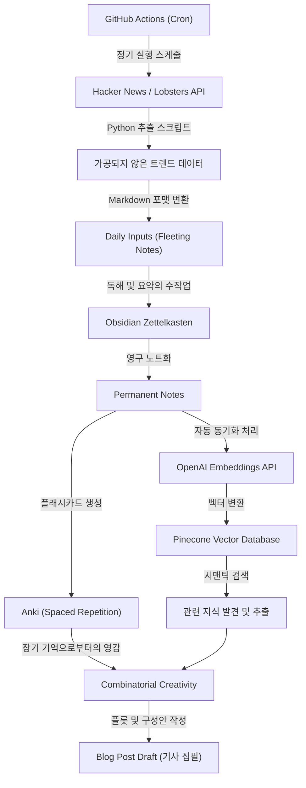

엔지니어나 리서처로서 기술 블로그를 운영하다 보면 거의 반드시 직면하게 되는 벽이 있습니다. 그것이 바로 '소재 고갈'입니다. 처음 몇 개의 기사는 순조롭게 쓸 수 있더라도, 계속하다 보면 '다음에 무엇을 쓰면 좋을지 모르겠다', '아웃풋을 위한 인풋이 압도적으로 부족하다'라는 고민에 시달리는 일은 드물지 않습니다. 기술 블로그 작성은 단순히 글을 쓰는 기술뿐만 아니라, 매일매일의 지식 수집, 정리, 그리고 그것들을 조합하여 새로운 가치를 창출하는 일련의 시스템 설계에 크게 의존하고 있습니다.

본 기사에서는 기술 기사의 아이디어를 반영구적으로 계속해서 만들어내기 위한, **시스템화된 인풋과 아웃풋의 파이프라인**에 대해 매우 상세하고 기술적으로 해설합니다. Hacker News나 Lobsters와 같은 해외의 고품질 정보원으로부터 API를 사용하여 자동으로 트렌드 토픽을 추출하고, GitHub Actions로 정기 실행하는 구조부터 시작합니다. 그리고 수집한 정보를 Obsidian을 사용한 제텔카스텐(Zettelkasten) 방식으로 지식으로서 체계화하고, OpenAI의 Embeddings API와 Pinecone(벡터 데이터베이스)을 조합하여 시맨틱 검색을 가능하게 하는 고도화된 개인 지식 관리(PKM: Personal Knowledge Management) 시스템을 구축합니다.

나아가, 인간 기억의 한계를 보완하기 위해 에빙하우스의 망각 곡선에 기반한 간격 반복(Spaced Repetition)을 Anki를 사용하여 실천하고, 정착된 지식을 '조합의 창조성(Combinatorial Creativity)'을 통해 새로운 아이디어로 승화시키는 일련의 과정을 구체적인 수학적 모델 및 Python 스크립트 구현 예시와 함께 깊이 파헤쳐 보겠습니다.

## 1. 정보의 엔트로피와 '소재 고갈'의 메커니즘

왜 우리는 '소재 고갈'을 겪는 것일까요? 정보 이론의 관점에서 생각해보면, 우리가 가지고 있는 지식 체계의 '정보량'이 고갈되었거나, 균질화되어 버린 상태라고 할 수 있습니다.

클로드 섀넌이 제창한 정보 엔트로피 $H(X)$는 정보원으로부터 얻어지는 정보의 불확실성(또는 놀라움의 정도)을 나타냅니다.

$$ H(X) = - \sum_{i=1}^{n} P(x_i) \log_2 P(x_i) $$

여기서, $X$는 정보원으로부터 얻어지는 토픽의 확률 변수, $P(x_i)$는 그 토픽 $x_i$와 조우할 확률입니다. 평소에 비슷한 웹사이트(예를 들어 특정 국내 뉴스 사이트나 같은 기술 스택의 문서만)를 보면, 특정 $P(x_i)$가 극단적으로 높아지며, 결과적으로 시스템 전체의 엔트로피 $H(X)$가 저하됩니다. 엔트로피가 낮은 상태란 '새로운 발견(놀라움)이 없는' 상태이며, 이것이 '소재 고갈'의 근본 원인입니다.

엔트로피를 높게 유지하기 위해서는 의도적으로 평소에 접하지 않는 정보원을 노이즈로 받아들여, 미지의 토픽을 접할 확률 분포를 평준화할 필요가 있습니다. 이것이 다양한 정보원으로부터의 인풋을 자동화하는 가장 큰 이유입니다.

## 2. 자동화된 정보 수집 파이프라인 구축: Hacker News & Lobsters API

질 높은 인풋을 얻기 위해서는 노이즈가 적은 양질의 엔지니어 커뮤니티에서 트렌드 정보를 추출하는 것이 효과적입니다. Hacker News(Y Combinator 운영)나 Lobsters는 기술적인 논의가 깊게 이루어지는 장소로 최적입니다. 하지만 매일 이러한 사이트들을 순회하는 것은 시간이 걸리고 인지 리소스를 소비합니다.

그래서 Python을 사용하여 이들 API로부터 특정 점수 이상의 기사를 자동 추출하는 스크립트를 작성합니다.

### Python을 활용한 트렌드 기사 추출 스크립트

다음 스크립트는 Hacker News의 Firebase API와 Lobsters의 JSON 피드에서 일정 기준을 충족하는 기사를 가져와 Markdown 파일로 출력하는 것입니다.

```python
import requests
import json
from datetime import datetime
import os

# 설정
HN_TOPSTORIES_URL = "https://hacker-news.firebaseio.com/v0/topstories.json"
HN_ITEM_URL = "https://hacker-news.firebaseio.com/v0/item/{}.json"
LOBSTERS_URL = "https://lobste.rs/hottest.json"
MIN_HN_SCORE = 100
MIN_LOBSTERS_SCORE = 10
OUTPUT_DIR = "./daily_inputs"

def get_hacker_news_trends():
    """Hacker News에서 고득점 인기 기사를 가져온다"""
    print("Fetching Hacker News top stories...")
    response = requests.get(HN_TOPSTORIES_URL)
    if response.status_code != 200:
        return []
    
    story_ids = response.json()[:30] # 상위 30건으로 제한
    trending_stories = []
    
    for story_id in story_ids:
        item_resp = requests.get(HN_ITEM_URL.format(story_id))
        if item_resp.status_code == 200:
            item = item_resp.json()
            if item and item.get("score", 0) >= MIN_HN_SCORE:
                trending_stories.append({
                    "title": item.get("title"),
                    "url": item.get("url", f"https://news.ycombinator.com/item?id={story_id}"),
                    "score": item.get("score"),
                    "source": "Hacker News"
                })
    return trending_stories

def get_lobsters_trends():
    """Lobsters에서 고득점 기사를 가져온다"""
    print("Fetching Lobsters hottest stories...")
    response = requests.get(LOBSTERS_URL)
    if response.status_code != 200:
        return []
    
    items = response.json()
    trending_stories = []
    
    for item in items:
        if item.get("score", 0) >= MIN_LOBSTERS_SCORE:
            trending_stories.append({
                "title": item.get("title"),
                "url": item.get("url", item.get("comments_url")),
                "score": item.get("score"),
                "source": "Lobsters"
            })
    return trending_stories

def save_to_markdown(stories):
    """가져온 기사를 Markdown 파일로 저장한다"""
    if not os.path.exists(OUTPUT_DIR):
        os.makedirs(OUTPUT_DIR)
        
    today_str = datetime.now().strftime("%Y-%m-%d")
    filepath = os.path.join(OUTPUT_DIR, f"trends_{today_str}.md")
    
    with open(filepath, "w", encoding="utf-8") as f:
        f.write(f"# Daily Tech Trends: {today_str}\n\n")
        for story in stories:
            f.write(f"## [{story['title']}]({story['url']})\n")
            f.write(f"- **Source**: {story['source']}\n")
            f.write(f"- **Score**: {story['score']}\n")
            f.write(f"- **Notes**: (여기에 고찰을 추가한다)\n\n")
            
    print(f"Saved {len(stories)} stories to {filepath}")

if __name__ == "__main__":
    hn_stories = get_hacker_news_trends()
    lobsters_stories = get_lobsters_trends()
    all_stories = hn_stories + lobsters_stories
    
    # 점수 내림차순으로 정렬
    all_stories.sort(key=lambda x: x["score"], reverse=True)
    save_to_markdown(all_stories)
```

이 스크립트는 단순한 RSS 리더 이상의 가치를 제공합니다. 점수를 통한 필터링을 수행함으로써, 커뮤니티에서 정말로 주목받고 있는 기술적 토픽(노이즈가 적은 높은 시그널)만을 추출할 수 있기 때문입니다.

## 3. GitHub Actions를 활용한 스케줄링 및 자동화

작성한 Python 스크립트를 매일 수동으로 실행하는 것은 번거롭습니다. 자동화의 기본은 인간의 개입을 극한까지 줄이는 것입니다. GitHub Actions의 Cron 기능을 사용하여 매일 지정된 시간에 스크립트를 실행하고, 결과를 리포지토리에 자동 커밋하는 구조를 구축합니다.

프로젝트 루트에 `.github/workflows/daily_trends.yml`을 생성하고, 다음과 같이 작성합니다.

```yaml
name: Daily Tech Trends Scraper

on:
  schedule:
    - cron: '0 0 * * *' # 매일 UTC 0:00에 실행 (한국 시간 9:00)
  workflow_dispatch: # 수동 실행용

jobs:
  scrape-and-commit:
    runs-on: ubuntu-latest
    steps:
      - name: Checkout Repository
        uses: actions/checkout@v3
        
      - name: Setup Python
        uses: actions/setup-python@v4
        with:
          python-version: '3.10'
          
      - name: Install Dependencies
        run: |
          python -m pip install --upgrade pip
          pip install requests
          
      - name: Run Scraper Script
        run: python scripts/fetch_trends.py
        
      - name: Commit and Push Changes
        run: |
          git config --local user.email "action@github.com"
          git config --local user.name "GitHub Action"
          git add daily_inputs/
          git commit -m "Auto-update daily tech trends [skip ci]" || echo "No changes to commit"
          git push
```

이를 통해 매일 아침 Obsidian을 열면, 자동으로 그날의 중요 토픽이 인박스(`daily_inputs/`)에 Markdown으로 추가되어 있는 상태를 만들어 낼 수 있습니다.

## 4. 제텔카스텐(Zettelkasten)과 Obsidian을 이용한 지식의 네트워크화

자동으로 수집된 정보는 아직 단순한 '데이터'에 불과합니다. 이를 '지식'으로 승화시키는 과정이 필요합니다. 여기서 활약하는 것이 제텔카스텐(Zettelkasten) 방식과 Obsidian입니다.

제텔카스텐은 독일의 사회학자 니클라스 루만이 고안한 노트 작성법입니다. 노트를 계층형 폴더로 분류하는 것이 아니라, 개별 노트를 작게(원자적으로) 유지하고 노트끼리 링크로 연결함으로써 뇌의 신경 회로와 같은 지식 네트워크를 구축합니다.

제텔카스텐에는 주로 3종류의 노트가 존재합니다:
1. **Fleeting Notes (임시 메모)**: 떠오른 아이디어나 수집한 정보를 일시적으로 기록하는 것. 앞서 자동 생성한 트렌드 정보 Markdown이 이에 해당합니다.
2. **Literature Notes (문헌 메모)**: 기사나 책을 읽고 자신의 언어로 요약한 것.
3. **Permanent Notes (영구 노트)**: 하나의 토픽에 대해 완결된 고찰을 적은 것. 이것들이 블로그 기사의 직접적인 씨앗이 됩니다.

Obsidian의 백링크 기능(`[[노트명]]`)을 사용하면, 예를 들어 'Rust의 소유권'이라는 노트와 '가비지 컬렉션의 역사'라는 노트를 연결하여 예상치 못한 아이디어의 연결 고리를 발견할 수 있습니다.

## 5. 벡터 데이터베이스(Pinecone)와 OpenAI Embeddings를 이용한 시맨틱 검색

노트의 수가 늘어나 수백, 수천 개가 되면, 단순한 키워드 검색(전문 검색)으로는 목적하는 노트를 찾기가 어려워집니다. '키워드는 기억나지 않지만, 개념적으로 비슷한 노트를 찾고 싶다'고 할 때 위력을 발휘하는 것이 대규모 언어 모델(LLM)의 Embeddings를 활용한 시맨틱(의미적) 검색입니다.

OpenAI의 `text-embedding-ada-002` 모델(또는 `text-embedding-3-small`)을 사용하여 Obsidian의 각 Markdown 노트를 다차원 벡터(수백~수천 차원의 수치 배열)로 변환합니다. 이러한 벡터 공간에서는 의미가 가까운 문장의 벡터는 물리적인 거리도 가까워집니다.

벡터 간의 유사도를 측정하기 위해 코사인 유사도(Cosine Similarity)가 널리 사용됩니다.

$$ \text{similarity} = \cos(\theta) = \frac{\mathbf{A} \cdot \mathbf{B}}{\|\mathbf{A}\| \|\mathbf{B}\|} = \frac{\sum_{i=1}^{n} A_i B_i}{\sqrt{\sum_{i=1}^{n} A_i^2} \sqrt{\sum_{i=1}^{n} B_i^2}} $$

$\mathbf{A}$와 $\mathbf{B}$는 각각 쿼리 문자열의 벡터와 노트의 벡터입니다. 이 계산을 고속으로 수행하기 위해 Pinecone이나 Qdrant와 같은 벡터 데이터베이스를 사용합니다.

### 시맨틱 검색 구현 예시

다음은 Obsidian의 노트 디렉터리를 순회하고, OpenAI API로 벡터화하여 Pinecone에 업서트(삽입/업데이트)하는 Python 스크립트의 일부입니다.

```python
import os
import glob
from openai import OpenAI
from pinecone import Pinecone, ServerlessSpec

# API 키 설정 (환경 변수에서 가져오기)
OPENAI_API_KEY = os.getenv("OPENAI_API_KEY")
PINECONE_API_KEY = os.getenv("PINECONE_API_KEY")

client = OpenAI(api_key=OPENAI_API_KEY)
pc = Pinecone(api_key=PINECONE_API_KEY)

INDEX_NAME = "obsidian-notes"
OBSIDIAN_DIR = "/path/to/obsidian/vault/PermanentNotes"

def init_pinecone():
    """Pinecone 인덱스 초기화"""
    if INDEX_NAME not in pc.list_indexes().names():
        pc.create_index(
            name=INDEX_NAME,
            dimension=1536, # text-embedding-3-small / ada-002의 차원 수
            metric="cosine",
            spec=ServerlessSpec(cloud="aws", region="us-east-1")
        )
    return pc.Index(INDEX_NAME)

def get_embedding(text):
    """OpenAI API를 사용하여 텍스트를 벡터화"""
    response = client.embeddings.create(
        input=text,
        model="text-embedding-3-small"
    )
    return response.data[0].embedding

def sync_notes_to_pinecone(index):
    """Markdown 파일을 읽어 벡터화하고 Pinecone에 저장"""
    md_files = glob.glob(os.path.join(OBSIDIAN_DIR, "*.md"))
    
    vectors = []
    for filepath in md_files:
        filename = os.path.basename(filepath)
        with open(filepath, "r", encoding="utf-8") as f:
            content = f.read()
            
        # 노트의 내용이 비어있지 않은 경우에만 처리
        if content.strip():
            print(f"Embedding note: {filename}")
            embedding = get_embedding(content)
            
            # Pinecone의 포맷 (id, vector, metadata)
            vectors.append({
                "id": filename,
                "values": embedding,
                "metadata": {"text": content[:500]} # 검색 결과 표시용 일부 텍스트
            })
            
    # 일괄 처리로 업서트
    if vectors:
        index.upsert(vectors=vectors)
        print(f"Successfully upserted {len(vectors)} notes.")

def search_similar_ideas(index, query_text, top_k=3):
    """쿼리와 유사한 노트를 검색하여 아이디어 도출에 활용"""
    query_embedding = get_embedding(query_text)
    
    results = index.query(
        vector=query_embedding,
        top_k=top_k,
        include_metadata=True
    )
    
    print(f"\n--- Search Results for: '{query_text}' ---")
    for match in results["matches"]:
        print(f"Score: {match['score']:.4f} | Note: {match['id']}")
        print(f"Preview: {match['metadata']['text'][:100]}...\n")

if __name__ == "__main__":
    idx = init_pinecone()
    # 최초 실행 시 sync_notes_to_pinecone(idx)를 호출하여 DB를 구축한다
    sync_notes_to_pinecone(idx)
    
    # 블로그 아이디어 도출을 위해 검색
    search_similar_ideas(idx, "WebAssembly를 활용한 브라우저 상의 머신러닝 추론 고속화")
```

이 시스템을 사용하면, '이번 주 Hacker News에서 화제가 된 「WebAssembly」에 대해 쓰고 싶은데, 과거에 내가 관련된 노트를 쓴 적이 있나?'라는 질문에 대해, AI가 의미적으로 관련된 과거의 Permanent Notes를 순식간에 골라줍니다. 이를 통해 과거의 자신의 지식 자산을 최대한 활용한 깊이 있는 기사 구성이 가능해집니다.

## 6. 에빙하우스의 망각 곡선과 Anki를 활용한 간격 반복

아무리 훌륭한 지식을 노트에 기록하더라도, 집필자의 뇌 자체에 지식이 정착되어 있지 않다면 집필 중에 여러 개념을 유창하게 엮어내는 것은 어렵습니다. 여기서 인간 기억의 메커니즘을 수학적으로 모델링한 '에빙하우스의 망각 곡선'이 등장합니다.

망각 곡선은 다음 공식으로 근사할 수 있습니다:

$$ R = e^{-\frac{t}{S}} $$

여기서,
- $R$은 기억 보존율(Retrievability, 0에서 1 사이의 범위)
- $t$는 학습 후 경과한 시간
- $S$는 기억의 안정도(Stability) 또는 강도

새로운 개념을 배운 직후에는 $S$가 작고, 시간 $t$와 함께 급격하게 $R$이 저하(망각)됩니다. 하지만 잊어버릴 만한 절묘한 타이밍에 복습(Recall)을 하면, 다음에 잊어버리기까지의 속도가 완만해지며($S$가 커짐), 장기 기억으로 정착해 갑니다.

이 최적의 복습 타이밍을 알고리즘(SuperMemo 2 등)으로 자동 계산하여 플래시카드 형태로 제시해 주는 소프트웨어가 바로 'Anki'입니다.

기술 블로그의 소재를 만들기 위한 강력한 접근법으로, **Obsidian의 Permanent Notes 내용을 Anki 플래시카드로 변환하는 것**을 들 수 있습니다.
예를 들어, 'CAP 정리의 3요소는 무엇인가?', 'B-Tree 인덱스가 O(log N)의 검색 성능을 갖는 이유는?' 등 기술적 근간과 관련된 질문을 Anki에 등록하고 매일 루틴으로 복습합니다. 지식이 장기 기억으로서 뇌 내에 인덱싱되면, 샤워를 하거나 산책을 할 때 무의식 속에서 정보가 결합하여 '아, 분산 시스템의 합의 알고리즘에 대한 기사를 쓸 수 있겠다'라는 번뜩임(유레카 모먼트)을 만들어냅니다.

## 7. 조합의 창조성 (Combinatorial Creativity)

지금까지의 파이프라인을 통해 '다양한 정보의 인풋', '제텔카스텐(Zettelkasten)에 의한 정리와 AI 검색', 'Anki를 통한 장기 기억 정착'을 실현했습니다. 마지막 단계는 이러한 요소들을 곱하여 완전히 새로운 기술 기사 아이디어를 생성하는 '조합의 창조성(Combinatorial Creativity)'입니다.

혁신이나 창조성은 무에서 유를 창조하는 것이 아니라, 기존 요소들의 새로운 조합에 의해 탄생한다고 알려져 있습니다. 스티브 잡스의 'Creativity is just connecting things(창조성은 그저 사물들을 연결하는 것이다).'라는 말이 유명합니다.

기술 블로그에서의 조합 패턴으로는 다음과 같은 매트릭스를 생각해 볼 수 있습니다.

1. **[오래된 기술] × [새로운 패러다임]**: 예) 'COBOL의 아키텍처에서 배우는 현대 마이크로서비스 설계의 안티 패턴'
2. **[프론트엔드] × [백엔드 개념]**: 예) 'React의 가상 DOM 업데이트 알고리즘을 데이터베이스 트랜잭션 격리 수준의 관점에서 해설하기'
3. **[추상적인 수학/이론] × [구체적 구현]**: 예) '그래프 이론으로 풀어보는 Kubernetes Pod 스케줄링의 최적화'

이러한 조합을 의도적으로 발생시키기 위해, 앞서 구축한 Pinecone의 시맨틱 검색 시스템을 이용하여 무작위로 개념 A와 개념 B를 추출하고, AI(ChatGPT 등)에게 '이 두 가지를 조합한 기술 블로그 제목과 목차 초안을 5개 제안해 줘'라고 프롬프트를 던짐으로써, 혼자서는 떠올리기 힘든 참신한 시각의 기사 아이디어를 무한히 생성할 수 있습니다.

## 8. 시스템 전체 아키텍처

여기까지 해설한 기술 기사 소재 고갈을 막기 위한 '정보 수집부터 아이디어 창출까지'의 전체 아키텍처를 아래의 Mermaid 플로우차트로 정리합니다.



이 시스템의 특징은 **'수동으로 수행해야 할 지적 작업(요약, 고찰, 집필)'과 '기계에 맡겨야 할 작업(수집, 검색, 간격 반복 스케줄링)'이 완벽하게 분리되어 있다**는 점입니다. 이를 통해 집필자는 가장 부가가치가 높은 '생각하는 것'과 '조합하는 것'에 전념할 수 있습니다.

## 9. 아이디어에서 발행까지의 상태 전이 모델

제텔카스텐(Zettelkasten)에 축적된 아이디어가 최종적으로 블로그 기사로 공개되기까지의 라이프사이클은 다음의 상태 전이도로 표현할 수 있습니다. 각 상태에서 적절한 도구와 접근법을 구분하여 사용합니다.

```mermaid
stateDiagram-v2
    [*] --> Capture["Idea Capture (정보 포착)"]
    
    Capture["Idea Capture (정보 포착)"] --> Fleeting["Fleeting Notes (임시 메모)"]
    Fleeting["Fleeting Notes (임시 메모)"] --> Permanent["Permanent Notes (영구 노트)"]
    
    Permanent["Permanent Notes (영구 노트)"] --> Brainstorming["Brainstorming (AI 시맨틱 검색)"]
    Permanent["Permanent Notes (영구 노트)"] --> Memorization["Memorization (Anki 복습)"]
    Memorization["Memorization (Anki 복습)"] --> Brainstorming["Brainstorming (AI 시맨틱 검색)"]
    
    Brainstorming["Brainstorming (AI 시맨틱 검색)"] --> Outlining["Outlining (구성 및 목차 작성)"]
    Outlining["Outlining (구성 및 목차 작성)"] --> Drafting["Drafting (초고 집필)"]
    
    Drafting["Drafting (초고 집필)"] --> Review["Review & Edit (퇴고 및 교정)"]
    Review["Review & Edit (퇴고 및 교정)"] --> Published["Published (블로그 발행)"]
    
    Published["Published (블로그 발행)"] --> [*]
```



이 워크플로우를 의식함으로써 '지금 자신이 어느 단계에서 막혀 있는지'가 명확해집니다. 소재가 떠오르지 않을 때는 'Capture'나 'Permanent' 단계로 돌아가 인풋 파이프라인이 정상적으로 가동하고 있는지 확인하면 됩니다.

## 결론: 집필은 '시스템'이다

'기술 블로그의 소재 고갈'은 개인의 능력 부족이나 동기 부여 저하가 원인이 아니라, **지식을 순환시키는 시스템이 구축되어 있지 않음으로 인한 필연적인 결과**입니다.

본 기사에서 소개한 바와 같이,
1. **API와 자동화**를 통한 노이즈 적은 양질의 인풋 확보
2. **Obsidian**을 이용한 제텔카스텐(Zettelkasten)을 통한 지식의 네트워크화
3. **OpenAI와 Pinecone**을 통한 자기 자산의 시맨틱 검색
4. **Anki**와 에빙하우스의 망각 곡선을 활용한 뇌 내 인덱스 강화
5. 기존의 개념을 결합하는 **조합의 창조성**

이러한 요소들을 조합한 포괄적인 파이프라인을 구축함으로써 블로그 아이디어는 고갈되기는커녕 쓰면 쓸수록 새로운 아이디어가 자기 증식해 나가는 상태를 만들 수 있습니다.

처음부터 이 모든 것을 완벽하게 구축할 필요는 없습니다. 먼저 Hacker News API를 호출하는 간단한 스크립트를 만들고, 관심 있는 기사를 마크다운으로 메모하는 습관부터 시작해 보세요. 당신의 기술 블로그가 차세대의 뛰어난 아이디어 발신지가 되기를 바랍니다.
