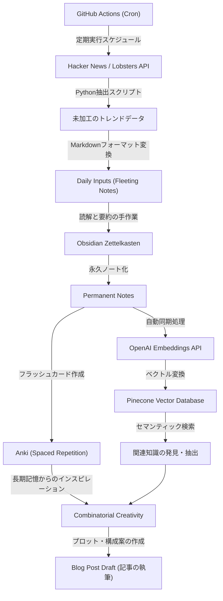

エンジニアやリサーチャーとして技術ブログを運営していると、必ずと言っていいほど直面する壁があります。それが「ネタ切れ」です。最初の数記事は順調に書けても、継続していくうちに「次に何を書けばいいのか分からない」「アウトプットするためのインプットが圧倒的に足りない」という悩みに苛まれることは珍しくありません。技術ブログの執筆は、単に文章を書く技術だけでなく、日々の知識の収集、整理、そしてそれらを組み合わせて新しい価値を生み出す一連のシステム設計に大きく依存しています。

本記事では、技術記事のアイデアを半永久的に生み出し続けるための、**システム化されたインプットとアウトプットのパイプライン**について、極めて詳細かつ技術的に解説します。Hacker NewsやLobstersといった海外の高品質な情報源からAPIを用いて自動でトレンドトピックを抽出し、GitHub Actionsで定期実行する仕組みから始めます。そして、収集した情報をObsidianを用いたZettelkasten（ツェッテルカステン）メソッドで知識として体系化し、OpenAIのEmbeddings APIとPinecone（ベクトルデータベース）を組み合わせてセマンティック検索を可能にする、高度な個人的知識管理（PKM: Personal Knowledge Management）システムを構築します。

さらに、人間の記憶の限界を補うために、エビングハウスの忘却曲線に基づいた間隔反復（Spaced Repetition）をAnkiを用いて実践し、定着した知識を「組み合わせの創造性（Combinatorial Creativity）」によって新しいアイデアへと昇華させる一連のプロセスを、具体的な数学的モデルやPythonスクリプトの実装例とともに深く掘り下げていきます。

## 1. 情報のエントロピーと「ネタ切れ」のメカニズム

なぜ私たちは「ネタ切れ」を起こすのでしょうか。情報理論の観点から考えると、私たちが持っている知識体系の「情報量」が枯渇している、あるいは均質化してしまっている状態だと言えます。

クロード・シャノンが提唱した情報エントロピー $H(X)$ は、情報源から得られる情報の不確実性（あるいは驚きの度合い）を表します。

$$ H(X) = - \sum_{i=1}^{n} P(x_i) \log_2 P(x_i) $$

ここで、$X$ は情報源から得られるトピックの確率変数、$P(x_i)$ はそのトピック $x_i$ に遭遇する確率です。普段から同じようなWebサイト（例えば特定の国内ニュースサイトや同じ技術スタックのドキュメントのみ）を見ていると、特定の $P(x_i)$ が極端に高くなり、結果としてシステム全体のエントロピー $H(X)$ が低下します。エントロピーが低い状態とは「新しい発見（驚き）がない」状態であり、これが「ネタ切れ」の根本原因です。

エントロピーを高く保つためには、意図的に普段接しない情報源をノイズとして取り入れ、未知のトピックに触れる確率分布を平準化する必要があります。これが、多様な情報源からのインプットを自動化する最大の理由です。

## 2. 自動化された情報収集パイプラインの構築：Hacker News & Lobsters API

質の高いインプットを得るためには、ノイズの少ない良質なエンジニアコミュニティからトレンド情報を抽出するのが効果的です。Hacker News（Y Combinator運営）やLobstersは、技術的な議論が深く行われる場所として最適です。しかし、毎日これらのサイトを巡回するのは時間がかかり、認知リソースを消費します。

そこで、Pythonを用いてこれらのAPIから特定のスコア以上の記事を自動抽出するスクリプトを作成します。

### Pythonによるトレンド記事抽出スクリプト

以下のスクリプトは、Hacker NewsのFirebase APIとLobstersのJSONフィードから、一定の基準を満たした記事を取得し、Markdownファイルとして出力するものです。

```python
import requests
import json
from datetime import datetime
import os

# 設定
HN_TOPSTORIES_URL = "https://hacker-news.firebaseio.com/v0/topstories.json"
HN_ITEM_URL = "https://hacker-news.firebaseio.com/v0/item/{}.json"
LOBSTERS_URL = "https://lobste.rs/hottest.json"
MIN_HN_SCORE = 100
MIN_LOBSTERS_SCORE = 10
OUTPUT_DIR = "./daily_inputs"

def get_hacker_news_trends():
    """Hacker Newsから高スコアのトップ記事を取得する"""
    print("Fetching Hacker News top stories...")
    response = requests.get(HN_TOPSTORIES_URL)
    if response.status_code != 200:
        return []
    
    story_ids = response.json()[:30] # 上位30件に絞る
    trending_stories = []
    
    for story_id in story_ids:
        item_resp = requests.get(HN_ITEM_URL.format(story_id))
        if item_resp.status_code == 200:
            item = item_resp.json()
            if item and item.get("score", 0) >= MIN_HN_SCORE:
                trending_stories.append({
                    "title": item.get("title"),
                    "url": item.get("url", f"https://news.ycombinator.com/item?id={story_id}"),
                    "score": item.get("score"),
                    "source": "Hacker News"
                })
    return trending_stories

def get_lobsters_trends():
    """Lobstersから高スコアの記事を取得する"""
    print("Fetching Lobsters hottest stories...")
    response = requests.get(LOBSTERS_URL)
    if response.status_code != 200:
        return []
    
    items = response.json()
    trending_stories = []
    
    for item in items:
        if item.get("score", 0) >= MIN_LOBSTERS_SCORE:
            trending_stories.append({
                "title": item.get("title"),
                "url": item.get("url", item.get("comments_url")),
                "score": item.get("score"),
                "source": "Lobsters"
            })
    return trending_stories

def save_to_markdown(stories):
    """取得した記事をMarkdownファイルとして保存する"""
    if not os.path.exists(OUTPUT_DIR):
        os.makedirs(OUTPUT_DIR)
        
    today_str = datetime.now().strftime("%Y-%m-%d")
    filepath = os.path.join(OUTPUT_DIR, f"trends_{today_str}.md")
    
    with open(filepath, "w", encoding="utf-8") as f:
        f.write(f"# Daily Tech Trends: {today_str}\n\n")
        for story in stories:
            f.write(f"## [{story['title']}]({story['url']})\n")
            f.write(f"- **Source**: {story['source']}\n")
            f.write(f"- **Score**: {story['score']}\n")
            f.write(f"- **Notes**: (ここに考察を追記する)\n\n")
            
    print(f"Saved {len(stories)} stories to {filepath}")

if __name__ == "__main__":
    hn_stories = get_hacker_news_trends()
    lobsters_stories = get_lobsters_trends()
    all_stories = hn_stories + lobsters_stories
    
    # スコアで降順にソート
    all_stories.sort(key=lambda x: x["score"], reverse=True)
    save_to_markdown(all_stories)
```

このスクリプトは、単純なRSSリーダー以上の価値を提供します。スコアによるフィルタリングを行うことで、コミュニティで本当に注目されている技術的トピック（ノイズの少ない高いシグナル）のみを抽出できるからです。

## 3. GitHub Actionsによるスケジューリングと自動化

作成したPythonスクリプトを手動で毎日実行するのは面倒です。自動化の基本は、人間の介入を極限まで減らすことです。GitHub ActionsのCron機能を用いて、毎日指定した時刻にスクリプトを実行し、結果をリポジトリに自動コミットする仕組みを構築します。

プロジェクトルートに `.github/workflows/daily_trends.yml` を作成し、以下のように記述します。

```yaml
name: Daily Tech Trends Scraper

on:
  schedule:
    - cron: '0 0 * * *' # 毎日UTC 0:00に実行（日本時間 9:00）
  workflow_dispatch: # 手動実行用

jobs:
  scrape-and-commit:
    runs-on: ubuntu-latest
    steps:
      - name: Checkout Repository
        uses: actions/checkout@v3
        
      - name: Setup Python
        uses: actions/setup-python@v4
        with:
          python-version: '3.10'
          
      - name: Install Dependencies
        run: |
          python -m pip install --upgrade pip
          pip install requests
          
      - name: Run Scraper Script
        run: python scripts/fetch_trends.py
        
      - name: Commit and Push Changes
        run: |
          git config --local user.email "action@github.com"
          git config --local user.name "GitHub Action"
          git add daily_inputs/
          git commit -m "Auto-update daily tech trends [skip ci]" || echo "No changes to commit"
          git push
```

これにより、毎朝Obsidianを開くと、自動的にその日の重要トピックがインボックス（`daily_inputs/`）にMarkdownとして追加されている状態を作り出すことができます。

## 4. ZettelkastenとObsidianを用いた知識のネットワーク化

自動収集された情報は、まだ単なる「データ」に過ぎません。これを「知識」に昇華させるプロセスが必要です。ここで活躍するのが、Zettelkasten（ツェッテルカステン）メソッドとObsidianです。

Zettelkastenは、ドイツの社会学者ニクラス・ルーマンが考案したノート作成法です。ノートを階層型のフォルダに分類するのではなく、個々のノートを小さく（アトミックに）保ち、ノート同士をリンクで繋ぐことで、脳の神経回路のような知識のネットワークを構築します。

Zettelkastenには主に3種類のノートが存在します：
1. **Fleeting Notes（走り書きメモ）**: 思いついたアイデアや収集した情報を一時的に記録するもの。先ほど自動生成したトレンド情報のMarkdownがこれに該当します。
2. **Literature Notes（文献メモ）**: 記事や本を読んで、自分の言葉で要約したもの。
3. **Permanent Notes（永久ノート）**: 一つのトピックについて完結した考察を書いたもの。これらがブログ記事の直接の種となります。

Obsidianのバックリンク機能（`[[ノート名]]`）を使うことで、例えば「Rustの所有権」というノートと「ガベージコレクションの歴史」というノートをリンクさせ、予期せぬアイデアの繋がりを発見することができます。

## 5. ベクトルデータベース（Pinecone）とOpenAI Embeddingsを利用したセマンティック検索

ノートの数が増えて数百、数千になると、単なるキーワード検索（全文検索）では目的のノートを見つけるのが困難になります。「キーワードは思い出せないが、概念としては似ているノートを探したい」という場合に威力を発揮するのが、大規模言語モデル（LLM）のEmbeddingsを活用したセマンティック（意味的）検索です。

OpenAIの `text-embedding-ada-002` モデル（または `text-embedding-3-small`）を用いて、Obsidianの各Markdownノートを多次元のベクトル（数百〜数千次元の数値の配列）に変換します。これらのベクトル空間において、意味が近い文章のベクトルは物理的な距離も近くなります。

ベクトル間の類似度を測るために、コサイン類似度（Cosine Similarity）が広く用いられます。

$$ \text{similarity} = \cos(\theta) = \frac{\mathbf{A} \cdot \mathbf{B}}{\|\mathbf{A}\| \|\mathbf{B}\|} = \frac{\sum_{i=1}^{n} A_i B_i}{\sqrt{\sum_{i=1}^{n} A_i^2} \sqrt{\sum_{i=1}^{n} B_i^2}} $$

$\mathbf{A}$ と $\mathbf{B}$ はそれぞれクエリ文字列のベクトルとノートのベクトルです。この計算を高速に行うために、PineconeやQdrantといったベクトルデータベースを使用します。

### セマンティック検索の実装例

以下は、Obsidianのノートディレクトリを走査し、OpenAI APIでベクトル化してPineconeにアップサート（挿入・更新）するPythonスクリプトの一部です。

```python
import os
import glob
from openai import OpenAI
from pinecone import Pinecone, ServerlessSpec

# APIキーの設定 (環境変数から取得)
OPENAI_API_KEY = os.getenv("OPENAI_API_KEY")
PINECONE_API_KEY = os.getenv("PINECONE_API_KEY")

client = OpenAI(api_key=OPENAI_API_KEY)
pc = Pinecone(api_key=PINECONE_API_KEY)

INDEX_NAME = "obsidian-notes"
OBSIDIAN_DIR = "/path/to/obsidian/vault/PermanentNotes"

def init_pinecone():
    """Pineconeインデックスの初期化"""
    if INDEX_NAME not in pc.list_indexes().names():
        pc.create_index(
            name=INDEX_NAME,
            dimension=1536, # text-embedding-3-small / ada-002の次元数
            metric="cosine",
            spec=ServerlessSpec(cloud="aws", region="us-east-1")
        )
    return pc.Index(INDEX_NAME)

def get_embedding(text):
    """OpenAI APIを用いてテキストをベクトル化"""
    response = client.embeddings.create(
        input=text,
        model="text-embedding-3-small"
    )
    return response.data[0].embedding

def sync_notes_to_pinecone(index):
    """Markdownファイルを読み込み、ベクトル化してPineconeへ保存"""
    md_files = glob.glob(os.path.join(OBSIDIAN_DIR, "*.md"))
    
    vectors = []
    for filepath in md_files:
        filename = os.path.basename(filepath)
        with open(filepath, "r", encoding="utf-8") as f:
            content = f.read()
            
        # ノートの内容が空でない場合のみ処理
        if content.strip():
            print(f"Embedding note: {filename}")
            embedding = get_embedding(content)
            
            # Pineconeのフォーマット (id, vector, metadata)
            vectors.append({
                "id": filename,
                "values": embedding,
                "metadata": {"text": content[:500]} # 検索結果表示用の一部テキスト
            })
            
    # バッチ処理でアップサート
    if vectors:
        index.upsert(vectors=vectors)
        print(f"Successfully upserted {len(vectors)} notes.")

def search_similar_ideas(index, query_text, top_k=3):
    """クエリに類似したノートを検索してアイデア出しに活用"""
    query_embedding = get_embedding(query_text)
    
    results = index.query(
        vector=query_embedding,
        top_k=top_k,
        include_metadata=True
    )
    
    print(f"\n--- Search Results for: '{query_text}' ---")
    for match in results["matches"]:
        print(f"Score: {match['score']:.4f} | Note: {match['id']}")
        print(f"Preview: {match['metadata']['text'][:100]}...\n")

if __name__ == "__main__":
    idx = init_pinecone()
    # 初回実行時はsync_notes_to_pinecone(idx)を呼び出してDBを構築する
    sync_notes_to_pinecone(idx)
    
    # ブログのアイデア出しのために検索
    search_similar_ideas(idx, "WebAssemblyを利用したブラウザ上での機械学習推論の高速化")
```

このシステムを使えば、「今週のHacker Newsで話題になっていた『WebAssembly』について書きたいが、過去に自分は関連するノートを書いたか？」という疑問に対し、AIが意味的に関連する過去のPermanent Notesを瞬時にピックアップしてくれます。これにより、過去の自分の知識資産をフル活用した深みのある記事構成が可能になります。

## 6. エビングハウスの忘却曲線とAnkiを活用した間隔反復

どんなに優れた知識をノートに記録しても、執筆者の脳自体に知識が定着していなければ、執筆中に複数の概念を流暢に繋ぎ合わせることは困難です。ここで、人間の記憶のメカMechanismを数学的にモデル化した「エビングハウスの忘却曲線」が登場します。

忘却曲線は以下の式で近似されます：

$$ R = e^{-\frac{t}{S}} $$

ここで、
- $R$ は記憶の保持率 (Retrievability, 0から1の範囲)
- $t$ は学習してからの経過時間
- $S$ は記憶の安定度 (Stability) または強さ

新しい概念を学んだ直後は $S$ が小さく、時間は $t$ と共に急激に $R$ が低下（忘却）します。しかし、忘れかけた絶妙なタイミングで復習（Recall）を行うと、次に忘れるまでの速度が緩やかになり（$S$ が大きくなる）、長期記憶へと定着していきます。

この最適な復習タイミングをアルゴリズム（SuperMemo 2など）で自動計算し、フラッシュカードとして提示してくれるソフトウェアが「Anki」です。

技術ブログのネタ作りのための強力なアプローチとして、**ObsidianのPermanent Notesの内容をAnkiのフラッシュカードに変換する**ことが挙げられます。
例えば、「CAP定理の3要素とは何か？」「B-TreeインデックスがO(log N)の検索性能を持つ理由は？」といった技術的根幹に関わる問いをAnkiに登録し、毎日のルーティンとして復習します。知識が長期記憶として脳内にインデックスされると、シャワーを浴びている時や散歩している時に、無意識下で情報が結びつき、「あ、分散システムの合意アルゴリズムについての記事が書けそうだ」というひらめき（エウレカモーメント）を生み出します。

## 7. 組み合わせの創造性 (Combinatorial Creativity)

これまでのパイプラインで、「多様な情報のインプット」「Zettelkastenによる整理とAI検索」「Ankiによる長期記憶への定着」を実現しました。最後のステップは、これらの要素を掛け合わせて全く新しい技術記事のアイデアを生成する「組み合わせの創造性（Combinatorial Creativity）」です。

イノベーションや創造性は、無から有を生み出すのではなく、既存の要素の新しい組み合わせによって生まれるとされています。スティーブ・ジョブズの「Creativity is just connecting things.」という言葉が有名です。

技術ブログにおける組み合わせのパターンとしては、以下のようなマトリックスが考えられます。

1. **[古い技術] × [新しいパラダイム]**: 例「COBOLのアーキテクチャから学ぶ、現代のマイクロサービス設計のアンチパターン」
2. **[フロントエンド] × [バックエンドの概念]**: 例「Reactの仮想DOM更新アルゴリズムを、データベースのトランザクション分離レベルの視点で解説する」
3. **[抽象的な数学・理論] × [具体的な実装]**: 例「グラフ理論で読み解く、KubernetesのPodスケジューリングの最適化」

この組み合わせを意図的に発生させるため、先ほど構築したPineconeのセマンティック検索システムを利用し、ランダムな概念Aと概念Bを抽出し、AI（ChatGPTなど）に「これら2つを組み合わせた技術ブログのタイトルと目次案を5つ提案して」とプロンプトを投げることで、自分では思いつかないような斬新な切り口の記事アイデアを無限に生成することができます。

## 8. システム全体のアーキテクチャ

ここまでに解説した、技術記事のネタ切れを防ぐための「情報収集からアイデア創出まで」の全体アーキテクチャを以下のMermaidフローチャートにまとめます。



このシステムの特徴は、**「手動で行うべき知的作業（要約、考察、執筆）」と「機械に任せるべき作業（収集、検索、間隔反復のスケジューリング）」が完全に分離されている**ことです。これにより、執筆者は最も付加価値の高い「考えること」と「組み合わせること」に専念できます。

## 9. アイデアから公開までの状態遷移モデル

Zettelkastenに蓄積されたアイデアが、最終的にブログ記事として公開されるまでのライフサイクルは、以下の状態遷移図として表現できます。それぞれの状態で適切なツールとアプローチを使い分けます。

```mermaid
stateDiagram-v2
    [*] --> Capture["Idea Capture (情報の捕捉)"]
    
    Capture["Idea Capture (情報の捕捉)"] --> Fleeting["Fleeting Notes (一時メモ)"]
    Fleeting["Fleeting Notes (一時メモ)"] --> Permanent["Permanent Notes (永久ノート)"]
    
    Permanent["Permanent Notes (永久ノート)"] --> Brainstorming["Brainstorming (AIセマンティック検索)"]
    Permanent["Permanent Notes (永久ノート)"] --> Memorization["Memorization (Anki復習)"]
    Memorization["Memorization (Anki復習)"] --> Brainstorming["Brainstorming (AIセマンティック検索)"]
    
    Brainstorming["Brainstorming (AIセマンティック検索)"] --> Outlining["Outlining (構成・目次作成)"]
    Outlining["Outlining (構成・目次作成)"] --> Drafting["Drafting (初稿執筆)"]
    
    Drafting["Drafting (初稿執筆)"] --> Review["Review & Edit (推敲・校正)"]
    Review["Review & Edit (推敲・校正)"] --> Published["Published (ブログ公開)"]
    
    Published["Published (ブログ公開)"] --> [*]
```



このワークフローを意識することで、「今自分がどのフェーズで詰まっているのか」が明確になります。ネタが出ないときは「Capture」や「Permanent」のフェーズに戻り、インプットパイプラインが正常に稼働しているかを確認すれば良いのです。

## まとめ：執筆は「システム」である

「技術ブログのネタ切れ」は、個人の能力不足やモチベーションの低下が原因ではなく、**知識を循環させるシステムが構築されていないことによる必然的な結果**です。

本記事で紹介したように、
1. **APIと自動化**によるノイズの少ない良質なインプットの確保
2. **Obsidian**を用いたZettelkastenによる知識のネットワーク化
3. **OpenAIとPinecone**による自己資産のセマンティック検索
4. **Anki**とエビングハウスの忘却曲線を活用した脳内インデックスの強化
5. 既存の概念を掛け合わせる**組み合わせの創造性**

これらを組み合わせた包括的なパイプラインを構築することで、ブログのアイデアは枯渇するどころか、書けば書くほど新しいアイデアが自己増殖していく状態を作ることができます。

最初からすべてを完璧に構築する必要はありません。まずはHacker NewsのAPIを叩く簡単なスクリプトを作り、気になる記事をマークダウンでメモする習慣から始めてみてください。あなたの技術ブログが、次世代の優れたアイデアの発信源となることを願っています。
