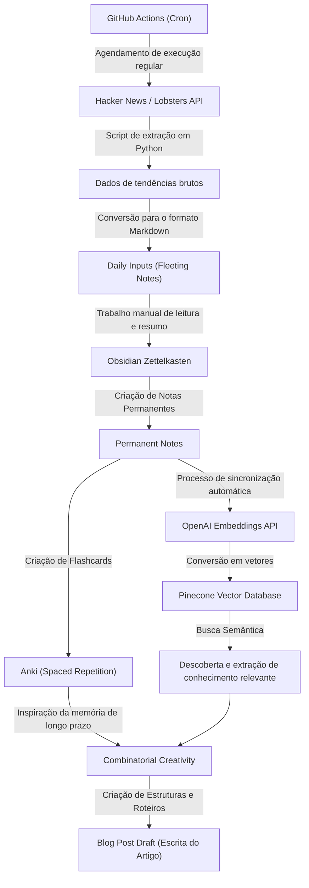

Ao gerenciar um blog técnico como engenheiro ou pesquisador, há uma barreira que você quase certamente enfrentará: a "falta de ideias". Mesmo que você consiga escrever os primeiros artigos sem problemas, não é incomum ser atormentado por dúvidas como "Não sei sobre o que escrever a seguir" ou "Falta uma quantidade esmagadora de 'inputs' para poder gerar 'outputs'" à medida que você continua. A escrita de blogs técnicos depende muito não apenas da habilidade de escrever, mas também do design de um sistema de coleta de conhecimentos diários, sua organização e a combinação deles para criar novos valores.

Neste artigo, explicarei detalhadamente e de forma bastante técnica sobre um **pipeline sistematizado de input e output** para gerar ideias para artigos técnicos de forma quase permanente. Começaremos com um mecanismo que extrai automaticamente tópicos de tendência usando APIs de fontes internacionais de alta qualidade, como Hacker News e Lobsters, sendo executados regularmente através do GitHub Actions. Em seguida, sistematizaremos as informações coletadas como conhecimento usando o método Zettelkasten com Obsidian e construiremos um sistema avançado de Gestão de Conhecimento Pessoal (PKM - Personal Knowledge Management) que possibilita buscas semânticas combinando a API Embeddings da OpenAI com o Pinecone (um banco de dados vetorial).

Além disso, para compensar as limitações da memória humana, nos aprofundaremos no processo de transformar o conhecimento retido em novas ideias através da "Criatividade Combinatória" (Combinatorial Creativity). Isso é feito aplicando a Repetição Espaçada (Spaced Repetition) com base na curva de esquecimento de Ebbinghaus usando o Anki, juntamente com modelos matemáticos concretos e exemplos de implementação em scripts Python.

## 1. A Entropia da Informação e o Mecanismo da "Falta de Ideias"

Por que sofremos com a "falta de ideias"? Do ponto de vista da teoria da informação, pode-se dizer que a "quantidade de informação" no sistema de conhecimento que possuímos está esgotada ou homogeneizada.

A entropia da informação $H(X)$, proposta por Claude Shannon, representa a incerteza (ou o grau de surpresa) da informação obtida de uma fonte.

$$ H(X) = - \sum_{i=1}^{n} P(x_i) \log_2 P(x_i) $$

Aqui, $X$ é a variável aleatória dos tópicos obtidos da fonte de informação e $P(x_i)$ é a probabilidade de encontrar o tópico $x_i$. Se você costuma visitar apenas sites semelhantes (por exemplo, apenas determinados sites de notícias locais ou documentação da mesma pilha de tecnologias), um $P(x_i)$ específico se torna extremamente alto, resultando em uma diminuição da entropia geral do sistema, $H(X)$. Um estado de baixa entropia significa que não há "novas descobertas (surpresas)", e essa é a causa raiz da "falta de ideias".

Para manter uma entropia alta, é necessário introduzir intencionalmente fontes de informação com as quais você não tem contato usual como ruído, para nivelar a distribuição de probabilidade de encontrar tópicos desconhecidos. Essa é a principal razão para automatizar os inputs de diversas fontes.

## 2. Construção de um Pipeline Automatizado de Coleta de Informações: Hacker News & Lobsters API

Para obter inputs de alta qualidade, é eficaz extrair informações sobre tendências de boas comunidades de engenharia, que têm pouco ruído. O Hacker News (operado pela Y Combinator) e o Lobsters são os lugares ideais por apresentarem discussões técnicas profundas. No entanto, visitar esses sites diariamente toma tempo e consome recursos cognitivos.

Portanto, criaremos um script usando Python para extrair automaticamente artigos com uma pontuação acima de um limite definido das APIs dessas plataformas.

### Script em Python para Extrair Artigos em Alta

O script abaixo busca artigos que atendem a certos critérios usando a API do Firebase do Hacker News e os feeds JSON do Lobsters, gerando arquivos Markdown.

```python
import requests
import json
from datetime import datetime
import os

# Configurações
HN_TOPSTORIES_URL = "https://hacker-news.firebaseio.com/v0/topstories.json"
HN_ITEM_URL = "https://hacker-news.firebaseio.com/v0/item/{}.json"
LOBSTERS_URL = "https://lobste.rs/hottest.json"
MIN_HN_SCORE = 100
MIN_LOBSTERS_SCORE = 10
OUTPUT_DIR = "./daily_inputs"

def get_hacker_news_trends():
    """Obtém as principais histórias com pontuação alta do Hacker News"""
    print("Fetching Hacker News top stories...")
    response = requests.get(HN_TOPSTORIES_URL)
    if response.status_code != 200:
        return []
    
    story_ids = response.json()[:30] # Limita ao top 30
    trending_stories = []
    
    for story_id in story_ids:
        item_resp = requests.get(HN_ITEM_URL.format(story_id))
        if item_resp.status_code == 200:
            item = item_resp.json()
            if item and item.get("score", 0) >= MIN_HN_SCORE:
                trending_stories.append({
                    "title": item.get("title"),
                    "url": item.get("url", f"https://news.ycombinator.com/item?id={story_id}"),
                    "score": item.get("score"),
                    "source": "Hacker News"
                })
    return trending_stories

def get_lobsters_trends():
    """Obtém as histórias mais populares do Lobsters"""
    print("Fetching Lobsters hottest stories...")
    response = requests.get(LOBSTERS_URL)
    if response.status_code != 200:
        return []
    
    items = response.json()
    trending_stories = []
    
    for item in items:
        if item.get("score", 0) >= MIN_LOBSTERS_SCORE:
            trending_stories.append({
                "title": item.get("title"),
                "url": item.get("url", item.get("comments_url")),
                "score": item.get("score"),
                "source": "Lobsters"
            })
    return trending_stories

def save_to_markdown(stories):
    """Salva as histórias obtidas em um arquivo Markdown"""
    if not os.path.exists(OUTPUT_DIR):
        os.makedirs(OUTPUT_DIR)
        
    today_str = datetime.now().strftime("%Y-%m-%d")
    filepath = os.path.join(OUTPUT_DIR, f"trends_{today_str}.md")
    
    with open(filepath, "w", encoding="utf-8") as f:
        f.write(f"# Daily Tech Trends: {today_str}\n\n")
        for story in stories:
            f.write(f"## [{story['title']}]({story['url']})\n")
            f.write(f"- **Source**: {story['source']}\n")
            f.write(f"- **Score**: {story['score']}\n")
            f.write(f"- **Notes**: (Adicione suas reflexões aqui)\n\n")
            
    print(f"Saved {len(stories)} stories to {filepath}")

if __name__ == "__main__":
    hn_stories = get_hacker_news_trends()
    lobsters_stories = get_lobsters_trends()
    all_stories = hn_stories + lobsters_stories
    
    # Ordena por pontuação de forma decrescente
    all_stories.sort(key=lambda x: x["score"], reverse=True)
    save_to_markdown(all_stories)
```

Este script oferece mais valor do que um simples leitor de RSS. Ao filtrar as pontuações, é possível extrair apenas os tópicos técnicos que realmente estão chamando a atenção da comunidade (sinal alto e pouco ruído).

## 3. Agendamento e Automação com GitHub Actions

Executar manualmente o script em Python todos os dias é tedioso. O princípio básico da automação é reduzir a intervenção humana ao máximo. Usando o recurso Cron do GitHub Actions, construiremos um mecanismo para executar o script em um horário especificado todos os dias, fazendo commit automaticamente dos resultados no repositório.

Crie o arquivo `.github/workflows/daily_trends.yml` na raiz do projeto e adicione o seguinte:

```yaml
name: Daily Tech Trends Scraper

on:
  schedule:
    - cron: '0 0 * * *' # Executa diariamente às 0:00 UTC
  workflow_dispatch: # Permite execução manual

jobs:
  scrape-and-commit:
    runs-on: ubuntu-latest
    steps:
      - name: Checkout Repository
        uses: actions/checkout@v3
        
      - name: Setup Python
        uses: actions/setup-python@v4
        with:
          python-version: '3.10'
          
      - name: Install Dependencies
        run: |
          python -m pip install --upgrade pip
          pip install requests
          
      - name: Run Scraper Script
        run: python scripts/fetch_trends.py
        
      - name: Commit and Push Changes
        run: |
          git config --local user.email "action@github.com"
          git config --local user.name "GitHub Action"
          git add daily_inputs/
          git commit -m "Auto-update daily tech trends [skip ci]" || echo "No changes to commit"
          git push
```

Com isso, ao abrir o Obsidian todas as manhãs, você terá um ambiente onde os tópicos importantes do dia são adicionados automaticamente como arquivos Markdown na sua caixa de entrada (`daily_inputs/`).

## 4. Rede de Conhecimento usando Zettelkasten e Obsidian

As informações coletadas automaticamente ainda são apenas "dados". Um processo é necessário para sublimá-los em "conhecimento". É aqui que entram o método Zettelkasten e o Obsidian.

O Zettelkasten é um método de anotações desenvolvido pelo sociólogo alemão Niklas Luhmann. Em vez de classificar as anotações em pastas hierárquicas, cada nota é mantida pequena (atômica) e interligada umas às outras através de links, formando uma rede de conhecimentos que se assemelha aos circuitos neurais do cérebro.

O Zettelkasten consiste principalmente em 3 tipos de anotações:
1. **Fleeting Notes (Notas Temporárias)**: Utilizadas para registrar ideias ou informações que surgem no momento. Os arquivos Markdown com informações de tendências gerados automaticamente pertencem a esta categoria.
2. **Literature Notes (Notas de Leitura)**: Resumos que você escreveu com suas próprias palavras após a leitura de artigos ou livros.
3. **Permanent Notes (Notas Permanentes)**: Reflexões completas sobre um único tópico. Essas notas são a semente direta para artigos de blogs.

Usando o recurso de backlinks (`[[Nome da Nota]]`) do Obsidian, por exemplo, ao linkar uma anotação sobre a "Ownership no Rust" com outra sobre a "História do Garbage Collection", é possível descobrir conexões de ideias completamente inesperadas.

## 5. Busca Semântica usando Banco de Dados Vetorial (Pinecone) e OpenAI Embeddings

Quando o número de anotações chega a centenas ou milhares, torna-se difícil encontrar a nota desejada apenas através de pesquisas por palavras-chave (pesquisa de texto completo). Se você pensar "Não consigo me lembrar da palavra-chave, mas quero buscar uma anotação conceitualmente semelhante", a busca semântica, que aproveita os Embeddings de um modelo de linguagem de grande escala (LLM), mostrará sua eficácia.

Usando os modelos `text-embedding-ada-002` ou `text-embedding-3-small` da OpenAI, cada anotação Markdown do Obsidian é convertida em vetores multidimensionais (conjuntos numéricos contendo de centenas a milhares de dimensões). Nesse espaço vetorial, sentenças com significados próximos também têm distâncias físicas reduzidas.

Para medir a similaridade entre os vetores, é amplamente utilizada a Similaridade de Cosseno (Cosine Similarity).

$$ \text{similarity} = \cos(\theta) = \frac{\mathbf{A} \cdot \mathbf{B}}{\|\mathbf{A}\| \|\mathbf{B}\|} = \frac{\sum_{i=1}^{n} A_i B_i}{\sqrt{\sum_{i=1}^{n} A_i^2} \sqrt{\sum_{i=1}^{n} B_i^2}} $$

$\mathbf{A}$ e $\mathbf{B}$ são o vetor da string de consulta e o vetor da anotação, respectivamente. Para calcular isso rapidamente, usamos bancos de dados vetoriais como Pinecone ou Qdrant.

### Exemplo de Implementação de Busca Semântica

Abaixo está um trecho de código em Python que varre o diretório de notas do Obsidian, usa a API da OpenAI para vetorizá-las e insere ou atualiza (upsert) essas informações no Pinecone.

```python
import os
import glob
from openai import OpenAI
from pinecone import Pinecone, ServerlessSpec

# Configuração das chaves de API (obtidas das variáveis de ambiente)
OPENAI_API_KEY = os.getenv("OPENAI_API_KEY")
PINECONE_API_KEY = os.getenv("PINECONE_API_KEY")

client = OpenAI(api_key=OPENAI_API_KEY)
pc = Pinecone(api_key=PINECONE_API_KEY)

INDEX_NAME = "obsidian-notes"
OBSIDIAN_DIR = "/path/to/obsidian/vault/PermanentNotes"

def init_pinecone():
    """Inicialização do índice Pinecone"""
    if INDEX_NAME not in pc.list_indexes().names():
        pc.create_index(
            name=INDEX_NAME,
            dimension=1536, # Número de dimensões do text-embedding-3-small / ada-002
            metric="cosine",
            spec=ServerlessSpec(cloud="aws", region="us-east-1")
        )
    return pc.Index(INDEX_NAME)

def get_embedding(text):
    """Vetoriza texto usando a API da OpenAI"""
    response = client.embeddings.create(
        input=text,
        model="text-embedding-3-small"
    )
    return response.data[0].embedding

def sync_notes_to_pinecone(index):
    """Lê os arquivos Markdown, os vetoriza e salva no Pinecone"""
    md_files = glob.glob(os.path.join(OBSIDIAN_DIR, "*.md"))
    
    vectors = []
    for filepath in md_files:
        filename = os.path.basename(filepath)
        with open(filepath, "r", encoding="utf-8") as f:
            content = f.read()
            
        # Processa apenas se o conteúdo da nota não estiver vazio
        if content.strip():
            print(f"Embedding note: {filename}")
            embedding = get_embedding(content)
            
            # Formato do Pinecone (id, vetor, metadados)
            vectors.append({
                "id": filename,
                "values": embedding,
                "metadata": {"text": content[:500]} # Texto parcial para exibição nos resultados de busca
            })
            
    # Faz o Upsert usando processamento em lote
    if vectors:
        index.upsert(vectors=vectors)
        print(f"Successfully upserted {len(vectors)} notes.")

def search_similar_ideas(index, query_text, top_k=3):
    """Pesquisa notas semelhantes à consulta para uso na geração de ideias"""
    query_embedding = get_embedding(query_text)
    
    results = index.query(
        vector=query_embedding,
        top_k=top_k,
        include_metadata=True
    )
    
    print(f"\n--- Search Results for: '{query_text}' ---")
    for match in results["matches"]:
        print(f"Score: {match['score']:.4f} | Note: {match['id']}")
        print(f"Preview: {match['metadata']['text'][:100]}...\n")

if __name__ == "__main__":
    idx = init_pinecone()
    # Na primeira execução, chame sync_notes_to_pinecone(idx) para construir o banco de dados
    sync_notes_to_pinecone(idx)
    
    # Busca de ideias para o blog
    search_similar_ideas(idx, "Aceleração de inferência de aprendizado de máquina no navegador usando WebAssembly")
```

Com este sistema, ao questionar "Quero escrever sobre 'WebAssembly', que estava em alta no Hacker News desta semana, mas será que já escrevi notas relacionadas no passado?", a IA pode extrair instantaneamente Notas Permanentes do passado que tenham relação semântica. Assim, é possível estruturar artigos de maneira profunda, aproveitando ao máximo todos os seus conhecimentos anteriores.

## 6. Curva de Esquecimento de Ebbinghaus e Repetição Espaçada com Anki

Não importa quão bom seja o conhecimento que você anote, se a informação não for fixada em seu próprio cérebro, será difícil conectar fluentemente vários conceitos enquanto você estiver escrevendo. Aqui, a "Curva de Esquecimento de Ebbinghaus", um modelo matemático do mecanismo da memória humana, entra em jogo.

A curva de esquecimento pode ser aproximada pela seguinte equação:

$$ R = e^{-\frac{t}{S}} $$

Onde,
- $R$ é a taxa de retenção da memória (Retrievability, num intervalo de 0 a 1)
- $t$ é o tempo decorrido desde a aprendizagem
- $S$ é a estabilidade ou a força da memória (Stability)

Logo após assimilar um novo conceito, $S$ é pequeno, e a medida que o tempo $t$ passa, $R$ cai rapidamente (esquecimento). No entanto, quando você revisa (Recall) exatamente no momento em que está prestes a esquecer, a velocidade da perda da informação até o próximo esquecimento diminui ($S$ aumenta) consolidando-se então na memória de longo prazo.

"Anki" é um software que usa algoritmos (como o SuperMemo 2) para calcular automaticamente este tempo ideal de revisão e o apresenta por meio de flashcards.

Uma abordagem poderosa para gerar conteúdo em um blog técnico é **transformar o conteúdo das Notas Permanentes do Obsidian em flashcards no Anki**.
Por exemplo, você pode adicionar perguntas fundamentais sobre engenharia ao Anki, como "Quais são os 3 elementos do Teorema CAP?" ou "Por que os índices B-Tree têm capacidade de pesquisa O(log N)?", e os revisar diariamente. Quando o conhecimento for indexado ao seu cérebro como memória de longo prazo, tomando banho ou andando, informações se juntam inconscientemente resultando em um momento de inspiração (momento eureka) em que pensará: "Ah, agora sou capaz de escrever um artigo sobre algoritmos de consenso para sistemas distribuídos".

## 7. Criatividade Combinatória (Combinatorial Creativity)

Com o pipeline utilizado até agora, alcançamos os objetivos de termos: "diversidade em obtenção de informações", "busca com inteligência artificial e sistematização usando o método Zettelkasten" e "fortalecimento da memória de longo prazo utilizando o aplicativo Anki". O último passo consiste na chamada "Criatividade Combinatória" (Combinatorial Creativity) para fundir esses recursos em ideias para artigos completamente novas.

Acredita-se que inovar e ser criativo não surge a partir do nada, mas sim, de novas combinações de informações preexistentes. A citação de Steve Jobs, "Creativity is just connecting things." (A criatividade consiste apenas em conectar as coisas.), é famosa.

Os padrões para formar matrizes com relação à produção de textos para blogs consistem geralmente nas seguintes ideias:

1. **[Tecnologia Antiga] × [Novo Paradigma]**: Ex. "Aprendendo sobre os antipadrões do design moderno de microsserviços com a arquitetura do COBOL"
2. **[Front-end] × [Conceitos do Back-end]**: Ex. "Compreendendo os algoritmos de atualização do DOM virtual do React sob a perspectiva dos níveis de isolamento de transação em bancos de dados"
3. **[Fórmulas Abstratas de Matemática / Teoria] × [Implementações Concretas]**: Ex. "Usando a Teoria dos Grafos para interpretar a otimização do escalonamento de Pods no Kubernetes"

Para gerar essas combinações intencionalmente, utilize o mecanismo de busca semântica Pinecone configurado anteriormente para extrair um conceito aleatório A e um conceito B e, em seguida, envie um prompt para uma IA (como o ChatGPT): "Proponha 5 títulos e estruturas para blogs técnicos combinando estes 2 conceitos". Dessa forma, você poderá gerar um número infinito de ideias de artigos inovadores, com perspectivas que você talvez nunca pensasse sozinho.

## 8. Arquitetura Geral do Sistema

O processo que exploramos até agora visando evitar a "falta de ideias" na criação de publicações técnicas foi detalhado no fluxograma Mermaid abaixo, abrangendo desde a "coleta de informações até a criação de ideias" em uma arquitetura completa:



A principal característica deste sistema é que **"As funções intelectuais que exigem esforço manual (resumir, interpretar e escrever)" e as "tarefas que devem ser deixadas para a máquina (buscas, coletas e agendamento de repetições espaçadas)" estão completamente separadas**. Esse fator possibilita ao escritor focar naquilo que agrega mais valor: "pensar" e "combinar".

## 9. Modelo de Transição de Estado: Da Ideia à Publicação

O ciclo de vida das ideias acumuladas no Zettelkasten, desde sua concepção até se tornarem artigos finais em um blog, pode ser representado no diagrama de transição de estado a seguir. Neste modelo, usaremos as ferramentas apropriadas de acordo com o estado em que nos encontramos:

```mermaid
stateDiagram-v2
    [*] --> Capture["Idea Capture (Captura de Ideias)"]
    
    Capture["Idea Capture (Captura de Ideias)"] --> Fleeting["Fleeting Notes (Notas Temporárias)"]
    Fleeting["Fleeting Notes (Notas Temporárias)"] --> Permanent["Permanent Notes (Notas Permanentes)"]
    
    Permanent["Permanent Notes (Notas Permanentes)"] --> Brainstorming["Brainstorming (Busca Semântica por IA)"]
    Permanent["Permanent Notes (Notas Permanentes)"] --> Memorization["Memorization (Revisão no Anki)"]
    Memorization["Memorization (Revisão no Anki)"] --> Brainstorming["Brainstorming (Busca Semântica por IA)"]
    
    Brainstorming["Brainstorming (Busca Semântica por IA)"] --> Outlining["Outlining (Criação de Índice e Estrutura)"]
    Outlining["Outlining (Criação de Índice e Estrutura)"] --> Drafting["Drafting (Redação de Rascunho)"]
    
    Drafting["Drafting (Redação de Rascunho)"] --> Review["Review & Edit (Revisão e Edição)"]
    Review["Review & Edit (Revisão e Edição)"] --> Published["Published (Publicação no Blog)"]
    
    Published["Published (Publicação no Blog)"] --> [*]
```



Estar ciente desse fluxo de trabalho o ajudará a descobrir claramente: "Em qual fase estou travado agora?". Se você não conseguir ter novas ideias, você pode sempre voltar para a fase "Capture" ou "Permanent" e verificar se o seu pipeline de input está funcionando perfeitamente.

## Conclusão: Escrever é um "Sistema"

A "falta de ideias para o blog técnico" não se deve à falta de habilidade individual ou perda de motivação, mas sim é o **resultado inevitável da falta da construção de um sistema de circulação do conhecimento**.

Conforme apresentado neste artigo:
1. Utilização de **APIs e automação** para assegurar um input de alta qualidade e com pouco ruído
2. Transformação do conhecimento em uma rede usando o método Zettelkasten no **Obsidian**
3. Busca semântica de nossos próprios ativos utilizando **OpenAI e Pinecone**
4. Fortalecimento da indexação mental explorando a curva de esquecimento de Ebbinghaus com o **Anki**
5. **Criatividade combinatória** para entrelaçar conceitos já existentes

Ao construir um pipeline abrangente que combina esses elementos, em vez de esgotar as ideias para o blog, você pode criar um estado onde, quanto mais você escreve, mais as novas ideias se multiplicam por si sementes.

Você não precisa construir tudo perfeitamente desde o início. Comece criando um script simples que consulta a API do Hacker News e adquirindo o hábito de fazer anotações em Markdown dos artigos que lhe interessam. Esperamos que seu blog técnico se torne uma excelente fonte de ideias inovadoras para a próxima geração.
