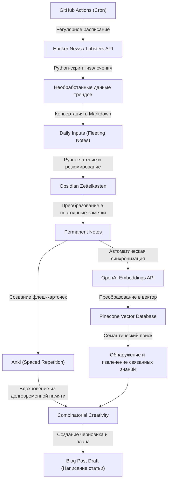

Если вы ведете технический блог в качестве инженера или исследователя, то почти наверняка сталкиваетесь с определенным препятствием. Это «нехватка идей» (или «исчерпание тем»). Даже если первые несколько статей написаны легко, со временем нередки переживания вроде «я не знаю, о чем писать дальше» или «мне катастрофически не хватает инпута для аутпута». Написание статей для технического блога сильно зависит не только от навыков письма, но и от проектирования целой системы ежедневного сбора знаний, их систематизации и создания новой ценности путем их комбинирования.

В этой статье я максимально подробно и с технической точки зрения расскажу о **систематизированном конвейере ввода и вывода**, который позволяет почти бесконечно генерировать идеи для технических статей. Мы начнем с механизма автоматического извлечения трендовых тем из высококачественных зарубежных источников, таких как Hacker News и Lobsters, с помощью API, и их регулярного запуска через GitHub Actions. Затем мы построим продвинутую систему управления личными знаниями (PKM: Personal Knowledge Management), в которой собранная информация будет систематизироваться в виде знаний с использованием метода Zettelkasten (Цеттелькастен) в Obsidian, а комбинация OpenAI Embeddings API и Pinecone (векторной базы данных) обеспечит возможность семантического поиска.

Более того, чтобы компенсировать ограничения человеческой памяти, мы применим интервальное повторение (Spaced Repetition) на основе кривой забывания Эббингауза с использованием программы Anki. Мы глубоко погрузимся в процесс сублимации закрепленных знаний в новые идеи с помощью «комбинаторной креативности» (Combinatorial Creativity), подкрепляя это конкретными математическими моделями и примерами реализации на Python-скриптах.

## 1. Информационная энтропия и механизм «нехватки идей»

Почему у нас возникает «нехватка идей»? С точки зрения теории информации можно сказать, что это состояние, когда «количество информации» в нашей системе знаний истощается или становится слишком однородным.

Информационная энтропия $H(X)$, предложенная Клодом Шенноном, представляет собой неопределенность (или степень удивления) информации, получаемой из источника.

$$ H(X) = - \sum_{i=1}^{n} P(x_i) \log_2 P(x_i) $$

Здесь $X$ — это случайная величина тем, получаемых из источника, а $P(x_i)$ — вероятность встречи с этой темой $x_i$. Если вы обычно просматриваете одни и те же веб-сайты (например, только определенные местные новостные порталы или документацию по одному и тому же техническому стеку), то вероятность конкретного $P(x_i)$ становится крайне высокой, в результате чего энтропия всей системы $H(X)$ снижается. Состояние с низкой энтропией означает состояние «без новых открытий (удивлений)», что и является фундаментальной причиной «нехватки идей».

Чтобы поддерживать энтропию на высоком уровне, необходимо намеренно включать источники информации, с которыми вы обычно не взаимодействуете, в качестве «шума», тем самым выравнивая распределение вероятностей соприкосновения с неизвестными темами. Это и есть главная причина для автоматизации получения информации из разнообразных источников.

## 2. Создание автоматизированного конвейера сбора информации: API Hacker News и Lobsters

Для получения качественного инпута эффективно извлекать трендовую информацию из хороших инженерных сообществ с низким уровнем шума. Такие платформы, как Hacker News (управляемая Y Combinator) и Lobsters, идеально подходят в качестве мест, где ведутся глубокие технические дискуссии. Однако ежедневный просмотр этих сайтов отнимает время и истощает когнитивные ресурсы.

Поэтому мы создадим скрипт на Python для автоматического извлечения статей с определенным рейтингом (score) из этих API.

### Python-скрипт для извлечения трендовых статей

Следующий скрипт получает статьи, соответствующие определенным критериям, из Firebase API Hacker News и JSON-ленты Lobsters, и сохраняет их в виде Markdown-файла.

```python
import requests
import json
from datetime import datetime
import os

# Настройки
HN_TOPSTORIES_URL = "https://hacker-news.firebaseio.com/v0/topstories.json"
HN_ITEM_URL = "https://hacker-news.firebaseio.com/v0/item/{}.json"
LOBSTERS_URL = "https://lobste.rs/hottest.json"
MIN_HN_SCORE = 100
MIN_LOBSTERS_SCORE = 10
OUTPUT_DIR = "./daily_inputs"

def get_hacker_news_trends():
    """Получить топовые статьи с высоким рейтингом из Hacker News"""
    print("Fetching Hacker News top stories...")
    response = requests.get(HN_TOPSTORIES_URL)
    if response.status_code != 200:
        return []
    
    story_ids = response.json()[:30] # Ограничить топ-30
    trending_stories = []
    
    for story_id in story_ids:
        item_resp = requests.get(HN_ITEM_URL.format(story_id))
        if item_resp.status_code == 200:
            item = item_resp.json()
            if item and item.get("score", 0) >= MIN_HN_SCORE:
                trending_stories.append({
                    "title": item.get("title"),
                    "url": item.get("url", f"https://news.ycombinator.com/item?id={story_id}"),
                    "score": item.get("score"),
                    "source": "Hacker News"
                })
    return trending_stories

def get_lobsters_trends():
    """Получить статьи с высоким рейтингом из Lobsters"""
    print("Fetching Lobsters hottest stories...")
    response = requests.get(LOBSTERS_URL)
    if response.status_code != 200:
        return []
    
    items = response.json()
    trending_stories = []
    
    for item in items:
        if item.get("score", 0) >= MIN_LOBSTERS_SCORE:
            trending_stories.append({
                "title": item.get("title"),
                "url": item.get("url", item.get("comments_url")),
                "score": item.get("score"),
                "source": "Lobsters"
            })
    return trending_stories

def save_to_markdown(stories):
    """Сохранить полученные статьи как Markdown-файл"""
    if not os.path.exists(OUTPUT_DIR):
        os.makedirs(OUTPUT_DIR)
        
    today_str = datetime.now().strftime("%Y-%m-%d")
    filepath = os.path.join(OUTPUT_DIR, f"trends_{today_str}.md")
    
    with open(filepath, "w", encoding="utf-8") as f:
        f.write(f"# Daily Tech Trends: {today_str}\n\n")
        for story in stories:
            f.write(f"## [{story['title']}]({story['url']})\n")
            f.write(f"- **Source**: {story['source']}\n")
            f.write(f"- **Score**: {story['score']}\n")
            f.write(f"- **Notes**: (добавьте свои заметки здесь)\n\n")
            
    print(f"Saved {len(stories)} stories to {filepath}")

if __name__ == "__main__":
    hn_stories = get_hacker_news_trends()
    lobsters_stories = get_lobsters_trends()
    all_stories = hn_stories + lobsters_stories
    
    # Сортировка по рейтингу по убыванию
    all_stories.sort(key=lambda x: x["score"], reverse=True)
    save_to_markdown(all_stories)
```

Этот скрипт предлагает нечто большее, чем просто обычный RSS-ридер. Благодаря фильтрации по рейтингу (score), вы можете извлекать только те технические темы, которые действительно привлекают внимание сообщества (высокий уровень полезного сигнала при малом количестве шума).

## 3. Планирование и автоматизация с помощью GitHub Actions

Запускать созданный Python-скрипт вручную каждый день утомительно. Основа автоматизации — максимальное сокращение вмешательства человека. С помощью функции Cron в GitHub Actions мы построим систему, которая ежедневно в заданное время будет выполнять скрипт и автоматически коммитить результаты в репозиторий.

Создайте файл `.github/workflows/daily_trends.yml` в корне вашего проекта и напишите следующее:

```yaml
name: Daily Tech Trends Scraper

on:
  schedule:
    - cron: '0 0 * * *' # Ежедневно в 0:00 UTC
  workflow_dispatch: # Для ручного запуска

jobs:
  scrape-and-commit:
    runs-on: ubuntu-latest
    steps:
      - name: Checkout Repository
        uses: actions/checkout@v3
        
      - name: Setup Python
        uses: actions/setup-python@v4
        with:
          python-version: '3.10'
          
      - name: Install Dependencies
        run: |
          python -m pip install --upgrade pip
          pip install requests
          
      - name: Run Scraper Script
        run: python scripts/fetch_trends.py
        
      - name: Commit and Push Changes
        run: |
          git config --local user.email "action@github.com"
          git config --local user.name "GitHub Action"
          git add daily_inputs/
          git commit -m "Auto-update daily tech trends [skip ci]" || echo "No changes to commit"
          git push
```

Благодаря этому каждое утро, открывая Obsidian, вы будете автоматически получать важные темы текущего дня, добавленные в ваш Inbox (`daily_inputs/`) в формате Markdown.

## 4. Создание сети знаний с помощью Zettelkasten и Obsidian

Автоматически собранная информация пока остается просто «данными». Необходим процесс, который сублимирует их в «знания». Здесь на помощь приходят метод Zettelkasten (Цеттелькастен) и Obsidian.

Zettelkasten — это метод ведения заметок, разработанный немецким социологом Никласом Луманом. Вместо того чтобы сортировать заметки по иерархическим папкам, отдельные заметки сохраняются небольшими (атомарными) и связываются друг с другом с помощью ссылок, образуя сеть знаний, подобную нейронным цепям мозга.

В Zettelkasten в основном существует 3 типа заметок:
1. **Fleeting Notes (Быстрые заметки)**: Временные записи пришедших в голову идей или собранной информации. Markdown-файлы с трендовой информацией, которые мы автоматически генерировали ранее, подпадают под эту категорию.
2. **Literature Notes (Литературные заметки)**: Заметки, написанные своими словами после прочтения статей или книг.
3. **Permanent Notes (Постоянные заметки)**: Завершенные рассуждения по одной конкретной теме. Именно они становятся непосредственными семенами для статей в блоге.

Используя функцию обратных ссылок Obsidian (`[[имя заметки]]`), можно, например, связать заметку «Владение в Rust» с заметкой «История сборки мусора», тем самым обнаруживая неожиданные связи между идеями.

## 5. Семантический поиск с использованием векторной базы данных (Pinecone) и OpenAI Embeddings

Когда количество заметок увеличивается до сотен или тысяч, найти нужную с помощью обычного поиска по ключевым словам (полнотекстового поиска) становится трудно. В ситуациях вроде «я не могу вспомнить ключевые слова, но хочу найти заметку с похожей концепцией» на помощь приходит семантический поиск, использующий Embeddings из больших языковых моделей (LLM).

Используя модель `text-embedding-ada-002` (или `text-embedding-3-small`) от OpenAI, мы преобразуем каждую Markdown-заметку в Obsidian в многомерный вектор (массив чисел с сотнями или тысячами измерений). В таком векторном пространстве тексты с близким смыслом будут иметь близкое физическое расстояние.

Для измерения сходства между векторами широко используется косинусное сходство (Cosine Similarity).

$$ \text{similarity} = \cos(\theta) = \frac{\mathbf{A} \cdot \mathbf{B}}{\|\mathbf{A}\| \|\mathbf{B}\|} = \frac{\sum_{i=1}^{n} A_i B_i}{\sqrt{\sum_{i=1}^{n} A_i^2} \sqrt{\sum_{i=1}^{n} B_i^2}} $$

Здесь $\mathbf{A}$ и $\mathbf{B}$ — векторы строки запроса и заметки соответственно. Для быстрого выполнения этих вычислений используются векторные базы данных, такие как Pinecone или Qdrant.

### Пример реализации семантического поиска

Ниже приведена часть Python-скрипта, который сканирует директорию с заметками Obsidian, векторизует их через OpenAI API и загружает/обновляет (upsert) их в Pinecone.

```python
import os
import glob
from openai import OpenAI
from pinecone import Pinecone, ServerlessSpec

# Настройка ключей API (получение из переменных окружения)
OPENAI_API_KEY = os.getenv("OPENAI_API_KEY")
PINECONE_API_KEY = os.getenv("PINECONE_API_KEY")

client = OpenAI(api_key=OPENAI_API_KEY)
pc = Pinecone(api_key=PINECONE_API_KEY)

INDEX_NAME = "obsidian-notes"
OBSIDIAN_DIR = "/path/to/obsidian/vault/PermanentNotes"

def init_pinecone():
    """Инициализация индекса Pinecone"""
    if INDEX_NAME not in pc.list_indexes().names():
        pc.create_index(
            name=INDEX_NAME,
            dimension=1536, # Размерность text-embedding-3-small / ada-002
            metric="cosine",
            spec=ServerlessSpec(cloud="aws", region="us-east-1")
        )
    return pc.Index(INDEX_NAME)

def get_embedding(text):
    """Векторизация текста с помощью OpenAI API"""
    response = client.embeddings.create(
        input=text,
        model="text-embedding-3-small"
    )
    return response.data[0].embedding

def sync_notes_to_pinecone(index):
    """Чтение Markdown-файлов, векторизация и сохранение в Pinecone"""
    md_files = glob.glob(os.path.join(OBSIDIAN_DIR, "*.md"))
    
    vectors = []
    for filepath in md_files:
        filename = os.path.basename(filepath)
        with open(filepath, "r", encoding="utf-8") as f:
            content = f.read()
            
        # Обрабатывать, только если содержимое заметки не пустое
        if content.strip():
            print(f"Embedding note: {filename}")
            embedding = get_embedding(content)
            
            # Формат Pinecone (id, vector, metadata)
            vectors.append({
                "id": filename,
                "values": embedding,
                "metadata": {"text": content[:500]} # Часть текста для отображения в результатах поиска
            })
            
    # Загрузка батчами (upsert)
    if vectors:
        index.upsert(vectors=vectors)
        print(f"Successfully upserted {len(vectors)} notes.")

def search_similar_ideas(index, query_text, top_k=3):
    """Поиск похожих заметок по запросу для генерации идей"""
    query_embedding = get_embedding(query_text)
    
    results = index.query(
        vector=query_embedding,
        top_k=top_k,
        include_metadata=True
    )
    
    print(f"\n--- Search Results for: '{query_text}' ---")
    for match in results["matches"]:
        print(f"Score: {match['score']:.4f} | Note: {match['id']}")
        print(f"Preview: {match['metadata']['text'][:100]}...\n")

if __name__ == "__main__":
    idx = init_pinecone()
    # При первом запуске вызовите sync_notes_to_pinecone(idx) для построения БД
    sync_notes_to_pinecone(idx)
    
    # Поиск для генерации идей для блога
    search_similar_ideas(idx, "Ускорение вывода машинного обучения в браузере с помощью WebAssembly")
```

Используя эту систему, на вопрос «Я хочу написать о WebAssembly, обсуждаемом на этой неделе на Hacker News, но писал ли я о чем-то подобном раньше?» ИИ мгновенно подберет семантически релевантные прошлые Permanent Notes. Это позволяет создавать глубокие статьи, максимально эффективно используя ваш накопленный багаж знаний.

## 6. Кривая забывания Эббингауза и интервальное повторение с Anki

Независимо от того, насколько отличные знания записаны в заметках, если эти знания не закрепились в голове автора, ему будет сложно свободно комбинировать различные концепции в процессе письма. Именно здесь на помощь приходит математическая модель механизма человеческой памяти — «кривая забывания Эббингауза».

Кривая забывания аппроксимируется следующей формулой:

$$ R = e^{-\frac{t}{S}} $$

Где:
- $R$ — коэффициент удержания в памяти (Retrievability, в диапазоне от 0 до 1)
- $t$ — время, прошедшее с момента обучения
- $S$ — стабильность (Stability) или сила памяти

Сразу после изучения новой концепции параметр $S$ мал, и с течением времени $t$ значение $R$ резко падает (забывание). Однако, если провести повторение (Recall) в тот самый момент, когда вы почти забыли информацию, скорость последующего забывания замедляется ($S$ увеличивается), и знания переходят в долговременную память.

Программное обеспечение «Anki» использует алгоритмы (такие как SuperMemo 2) для автоматического расчета этого оптимального времени повторения и предоставляет его в виде флеш-карточек.

В качестве мощного подхода к созданию тем для технического блога можно выделить **преобразование содержимого Permanent Notes из Obsidian во флеш-карточки Anki**.
Например, вы можете добавить в Anki фундаментальные технические вопросы, такие как: «Каковы 3 элемента CAP-теоремы?» или «Почему B-Tree индексы имеют производительность поиска O(log N)?», и сделать их повторение своей ежедневной рутиной. Когда знания индексируются в мозгу как долговременная память, во время принятия душа или прогулки информация на подсознательном уровне может соединиться, порождая озарение (эврика-момент): «О, я мог бы написать статью об алгоритмах консенсуса в распределенных системах».

## 7. Комбинаторная креативность (Combinatorial Creativity)

С помощью описанного конвейера мы реализовали «разнообразный ввод информации», «систематизацию через Zettelkasten и AI-поиск» и «закрепление в долговременной памяти с помощью Anki». Последний шаг — это объединение этих элементов для генерации совершенно новых идей для технических статей через «комбинаторную креативность» (Combinatorial Creativity).

Считается, что инновации и креативность возникают не из ничего, а из новых комбинаций существующих элементов. Широко известны слова Стива Джобса: «Креативность — это просто соединение вещей» (Creativity is just connecting things).

В контексте технического блога можно представить себе следующую матрицу паттернов комбинаций:

1. **[Старая технология] × [Новая парадигма]**: Например, «Антипаттерны проектирования современных микросервисов: уроки архитектуры COBOL».
2. **[Фронтенд] × [Концепции бэкенда]**: Например, «Объяснение алгоритма обновления Virtual DOM в React с точки зрения уровней изоляции транзакций в базах данных».
3. **[Абстрактная математика/теория] × [Конкретная реализация]**: Например, «Оптимизация планирования подов в Kubernetes через призму теории графов».

Чтобы намеренно генерировать такие комбинации, вы можете использовать ранее построенную систему семантического поиска Pinecone: извлеките случайные концепции A и B, и отправьте промпт ИИ (например, ChatGPT): «Предложи 5 вариантов заголовков и оглавлений для технического блога, объединяющих эти две концепции». Таким образом, вы можете бесконечно генерировать идеи с нестандартными углами зрения, о которых вы бы и не подумали сами.

## 8. Архитектура всей системы

Ниже на Mermaid-блок-схеме представлена общая архитектура от «сбора информации до генерации идей», о которой шла речь выше, призванная предотвратить нехватку идей для технических статей.



Отличительной чертой этой системы является то, что **«интеллектуальная работа, которая должна выполняться вручную (резюмирование, размышление, написание)», полностью отделена от «задач, которые следует делегировать машинам (сбор, поиск, планирование интервального повторения)»**. Благодаря этому авторы могут сосредоточиться на самом важном, что добавляет ценность — на «размышлении» и «комбинировании».

## 9. Модель переходов состояний: от идеи до публикации

Жизненный цикл идей, накопленных в Zettelkasten, вплоть до их окончательной публикации в качестве статьи блога, можно представить в виде следующей диаграммы переходов состояний. На каждом этапе используются подходящие инструменты и подходы.

```mermaid
stateDiagram-v2
    [*] --> Capture["Idea Capture (Сбор информации)"]
    
    Capture["Idea Capture (Сбор информации)"] --> Fleeting["Fleeting Notes (Временные заметки)"]
    Fleeting["Fleeting Notes (Временные заметки)"] --> Permanent["Permanent Notes (Постоянные заметки)"]
    
    Permanent["Permanent Notes (Постоянные заметки)"] --> Brainstorming["Brainstorming (AI семантический поиск)"]
    Permanent["Permanent Notes (Постоянные заметки)"] --> Memorization["Memorization (Повторение в Anki)"]
    Memorization["Memorization (Повторение в Anki)"] --> Brainstorming["Brainstorming (AI семантический поиск)"]
    
    Brainstorming["Brainstorming (AI семантический поиск)"] --> Outlining["Outlining (Создание структуры/оглавления)"]
    Outlining["Outlining (Создание структуры/оглавления)"] --> Drafting["Drafting (Написание черновика)"]
    
    Drafting["Drafting (Написание черновика)"] --> Review["Review & Edit (Редактирование и проверка)"]
    Review["Review & Edit (Редактирование и проверка)"] --> Published["Published (Публикация в блоге)"]
    
    Published["Published (Публикация в блоге)"] --> [*]
```



Осознание этого рабочего процесса проясняет, «на какой стадии вы застряли прямо сейчас». Если нет идей, достаточно вернуться к фазе «Capture» или «Permanent» и проверить, нормально ли функционирует ваш конвейер инпута.

## Заключение: написание статей — это «система»

«Нехватка идей для технического блога» вызвана не недостатком личных способностей или мотивации, а является **неизбежным результатом отсутствия системы циркуляции знаний**.

Как было показано в этой статье:
1. Обеспечение качественного инпута с низким уровнем шума с помощью **API и автоматизации**
2. Создание сети знаний с помощью Zettelkasten в **Obsidian**
3. Семантический поиск по вашим собственным активам через **OpenAI и Pinecone**
4. Укрепление индексации в мозге с помощью **Anki** и кривой забывания Эббингауза
5. **Комбинаторная креативность**, объединяющая существующие концепции

Построив комплексный конвейер, объединяющий все эти элементы, вы не только избежите нехватки идей для блога, но и создадите состояние, в котором чем больше вы пишете, тем больше новых идей воспроизводится самопроизвольно.

Нет необходимости с самого начала строить все идеально. Начните с создания простого скрипта для обращения к API Hacker News и выработайте привычку записывать в Markdown заметки по интересным вам статьям. Я надеюсь, что ваш технический блог станет источником выдающихся идей нового поколения.
