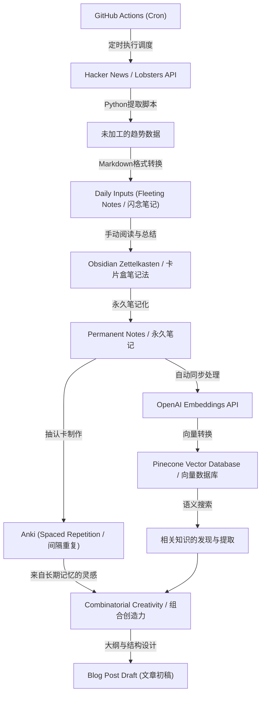

作为一名工程师或研究人员运营技术博客，几乎肯定会面临一个障碍。那就是“灵感枯竭”。即使前几篇文章写得很顺利，但在坚持写作的过程中，经常会被“接下来该写什么？”“用于输出的输入量严重不足”等烦恼所困扰。技术博客的撰写不仅依赖于写作技巧，在很大程度上更依赖于日常知识的收集、整理，以及将这些知识组合起来创造新价值的一整套系统设计。

在本文中，我将极其详细且从技术的角度，为你讲解一套能半永久性地持续产生技术文章创意的**系统化输入和输出管道**。我们将从利用 API 从 Hacker News 和 Lobsters 等海外高质量信息源中自动提取趋势话题，并通过 GitHub Actions 定期执行的机制开始。然后，利用 Obsidian 的卡片盒笔记法（Zettelkasten）将收集到的信息体系化为知识，并结合 OpenAI 的 Embeddings API 和 Pinecone（向量数据库）实现语义搜索，从而构建一个高级的个人知识管理（PKM: Personal Knowledge Management）系统。

此外，为了弥补人类记忆的局限性，我们将使用 Anki 实践基于艾宾浩斯遗忘曲线的间隔重复（Spaced Repetition），并将沉淀的知识通过“组合创造力（Combinatorial Creativity）”升华为新创意的这一系列过程，结合具体的数学模型和 Python 脚本实现示例进行深入探讨。

## 1. 信息熵与“灵感枯竭”的机制

为什么我们会遇到“灵感枯竭”？从信息论的角度来看，可以说是我们所拥有的知识体系的“信息量”已经枯竭，或者是处于同质化的状态。

克劳德·香农（Claude Shannon）提出的信息熵 $H(X)$，表示从信息源获取信息的不确定性（或惊讶程度）。

$$ H(X) = - \sum_{i=1}^{n} P(x_i) \log_2 P(x_i) $$

这里，$X$ 是从信息源获得的随机变量（话题），$P(x_i)$ 是遇到该话题 $x_i$ 的概率。如果平时总是浏览相似的网站（例如，特定的国内新闻网站或相同技术栈的文档），某个特定的 $P(x_i)$ 就会变得极高，结果导致整个系统的信息熵 $H(X)$ 下降。熵值低的状态意味着“没有新发现（惊讶）”，这就是“灵感枯竭”的根本原因。

为了保持高信息熵，我们需要有意地将平时接触不到的信息源作为噪音引入，并平滑化接触未知话题的概率分布。这也是我们需要将来自多样化信息源的输入实现自动化的最大原因。

## 2. 构建自动化的信息收集管道：Hacker News & Lobsters API

为了获得高质量的输入，从低噪音、高质量的工程师社区中提取趋势信息是非常有效的。Hacker News（由 Y Combinator 运营）和 Lobsters 是深入进行技术讨论的绝佳场所。然而，每天巡视这些网站需要花费大量时间，并且会消耗认知资源。

因此，我们将使用 Python 编写脚本，从这些 API 中自动提取达到特定分数以上的文章。

### 使用 Python 的趋势文章提取脚本

以下脚本从 Hacker News 的 Firebase API 和 Lobsters 的 JSON Feed 中获取满足特定标准的文章，并输出为 Markdown 文件。

```python
import requests
import json
from datetime import datetime
import os

# 配置
HN_TOPSTORIES_URL = "https://hacker-news.firebaseio.com/v0/topstories.json"
HN_ITEM_URL = "https://hacker-news.firebaseio.com/v0/item/{}.json"
LOBSTERS_URL = "https://lobste.rs/hottest.json"
MIN_HN_SCORE = 100
MIN_LOBSTERS_SCORE = 10
OUTPUT_DIR = "./daily_inputs"

def get_hacker_news_trends():
    """从 Hacker News 获取高分热门文章"""
    print("Fetching Hacker News top stories...")
    response = requests.get(HN_TOPSTORIES_URL)
    if response.status_code != 200:
        return []
    
    story_ids = response.json()[:30] # 限制为前 30 条
    trending_stories = []
    
    for story_id in story_ids:
        item_resp = requests.get(HN_ITEM_URL.format(story_id))
        if item_resp.status_code == 200:
            item = item_resp.json()
            if item and item.get("score", 0) >= MIN_HN_SCORE:
                trending_stories.append({
                    "title": item.get("title"),
                    "url": item.get("url", f"https://news.ycombinator.com/item?id={story_id}"),
                    "score": item.get("score"),
                    "source": "Hacker News"
                })
    return trending_stories

def get_lobsters_trends():
    """从 Lobsters 获取高分文章"""
    print("Fetching Lobsters hottest stories...")
    response = requests.get(LOBSTERS_URL)
    if response.status_code != 200:
        return []
    
    items = response.json()
    trending_stories = []
    
    for item in items:
        if item.get("score", 0) >= MIN_LOBSTERS_SCORE:
            trending_stories.append({
                "title": item.get("title"),
                "url": item.get("url", item.get("comments_url")),
                "score": item.get("score"),
                "source": "Lobsters"
            })
    return trending_stories

def save_to_markdown(stories):
    """将获取到的文章保存为 Markdown 文件"""
    if not os.path.exists(OUTPUT_DIR):
        os.makedirs(OUTPUT_DIR)
        
    today_str = datetime.now().strftime("%Y-%m-%d")
    filepath = os.path.join(OUTPUT_DIR, f"trends_{today_str}.md")
    
    with open(filepath, "w", encoding="utf-8") as f:
        f.write(f"# Daily Tech Trends: {today_str}\n\n")
        for story in stories:
            f.write(f"## [{story['title']}]({story['url']})\n")
            f.write(f"- **Source**: {story['source']}\n")
            f.write(f"- **Score**: {story['score']}\n")
            f.write(f"- **Notes**: (在这里添加考察和笔记)\n\n")
            
    print(f"Saved {len(stories)} stories to {filepath}")

if __name__ == "__main__":
    hn_stories = get_hacker_news_trends()
    lobsters_stories = get_lobsters_trends()
    all_stories = hn_stories + lobsters_stories
    
    # 按照分数降序排序
    all_stories.sort(key=lambda x: x["score"], reverse=True)
    save_to_markdown(all_stories)
```

这个脚本提供了比简单的 RSS 阅读器更高的价值。因为通过分数过滤，可以仅提取出社区中真正受到关注的技术话题（高信噪比）。

## 3. 使用 GitHub Actions 进行定时调度与自动化

每天手动运行编写的 Python 脚本非常麻烦。自动化的基本原则就是将人为干预降到最低。利用 GitHub Actions 的 Cron 功能，构建一个每天在指定时间运行脚本，并将结果自动提交到仓库的机制。

在项目根目录创建 `.github/workflows/daily_trends.yml`，并写入以下内容：

```yaml
name: Daily Tech Trends Scraper

on:
  schedule:
    - cron: '0 0 * * *' # 每天 UTC 0:00 运行（北京时间 8:00，日本时间 9:00）
  workflow_dispatch: # 用于手动执行

jobs:
  scrape-and-commit:
    runs-on: ubuntu-latest
    steps:
      - name: Checkout Repository
        uses: actions/checkout@v3
        
      - name: Setup Python
        uses: actions/setup-python@v4
        with:
          python-version: '3.10'
          
      - name: Install Dependencies
        run: |
          python -m pip install --upgrade pip
          pip install requests
          
      - name: Run Scraper Script
        run: python scripts/fetch_trends.py
        
      - name: Commit and Push Changes
        run: |
          git config --local user.email "action@github.com"
          git config --local user.name "GitHub Action"
          git add daily_inputs/
          git commit -m "Auto-update daily tech trends [skip ci]" || echo "No changes to commit"
          git push
```

这样一来，每天早上打开 Obsidian 时，当天的重要话题就已经作为 Markdown 自动添加到收件箱（`daily_inputs/`）中了。

## 4. 利用 Zettelkasten 和 Obsidian 将知识网络化

自动收集的信息目前还只是纯粹的“数据”。我们需要一个过程将其升华为“知识”。这时候就需要用到卡片盒笔记法（Zettelkasten）和 Obsidian。

Zettelkasten 是德国社会学家尼克拉斯·卢曼（Niklas Luhmann）发明的一种做笔记的方法。它不是将笔记分层分类到文件夹中，而是保持各个笔记的短小（原子化），并通过链接将笔记彼此相连，从而构建出一个像大脑神经网络一样的知识网络。

Zettelkasten 主要包含三种类型的笔记：
1. **Fleeting Notes（闪念笔记）**: 临时记录想到的创意或收集的信息。前面自动生成的趋势信息 Markdown 就属于此类。
2. **Literature Notes（文献笔记）**: 阅读文章或书籍后，用自己的话进行总结的笔记。
3. **Permanent Notes（永久笔记）**: 针对某个话题编写的完整思考。这些是博客文章最直接的种子。

通过使用 Obsidian 的反向链接功能（`[[笔记名称]]`），你可以例如将名为“Rust 的所有权”的笔记和“垃圾回收的历史”的笔记链接起来，从而发现意想不到的创意联系。

## 5. 利用向量数据库（Pinecone）和 OpenAI Embeddings 进行语义搜索

当笔记数量增加到成百上千条时，仅仅依靠关键词搜索（全文搜索）就很难找到目标笔记了。在“虽然想不起关键词，但想寻找概念上相似的笔记”的情况下，利用大语言模型（LLM）的 Embeddings 进行语义搜索能发挥巨大作用。

使用 OpenAI 的 `text-embedding-ada-002` 模型（或 `text-embedding-3-small`），将 Obsidian 的每一条 Markdown 笔记转换为多维向量（数百到数千维的数值数组）。在这些向量空间中，含义相近的句子，其向量的物理距离也会很近。

为了测量向量间的相似度，广泛使用的是余弦相似度（Cosine Similarity）。

$$ \text{similarity} = \cos(\theta) = \frac{\mathbf{A} \cdot \mathbf{B}}{\|\mathbf{A}\| \|\mathbf{B}\|} = \frac{\sum_{i=1}^{n} A_i B_i}{\sqrt{\sum_{i=1}^{n} A_i^2} \sqrt{\sum_{i=1}^{n} B_i^2}} $$

$\mathbf{A}$ 和 $\mathbf{B}$ 分别是查询字符串的向量和笔记的向量。为了快速进行这种计算，我们使用 Pinecone 或 Qdrant 等向量数据库。

### 语义搜索实现示例

以下是 Python 脚本的一部分，用于遍历 Obsidian 的笔记目录，使用 OpenAI API 进行向量化，并更新插入（Upsert）到 Pinecone 中。

```python
import os
import glob
from openai import OpenAI
from pinecone import Pinecone, ServerlessSpec

# API 密钥配置 (从环境变量获取)
OPENAI_API_KEY = os.getenv("OPENAI_API_KEY")
PINECONE_API_KEY = os.getenv("PINECONE_API_KEY")

client = OpenAI(api_key=OPENAI_API_KEY)
pc = Pinecone(api_key=PINECONE_API_KEY)

INDEX_NAME = "obsidian-notes"
OBSIDIAN_DIR = "/path/to/obsidian/vault/PermanentNotes"

def init_pinecone():
    """Pinecone 索引初始化"""
    if INDEX_NAME not in pc.list_indexes().names():
        pc.create_index(
            name=INDEX_NAME,
            dimension=1536, # text-embedding-3-small / ada-002 的维度
            metric="cosine",
            spec=ServerlessSpec(cloud="aws", region="us-east-1")
        )
    return pc.Index(INDEX_NAME)

def get_embedding(text):
    """利用 OpenAI API 将文本向量化"""
    response = client.embeddings.create(
        input=text,
        model="text-embedding-3-small"
    )
    return response.data[0].embedding

def sync_notes_to_pinecone(index):
    """读取 Markdown 文件，向量化后保存至 Pinecone"""
    md_files = glob.glob(os.path.join(OBSIDIAN_DIR, "*.md"))
    
    vectors = []
    for filepath in md_files:
        filename = os.path.basename(filepath)
        with open(filepath, "r", encoding="utf-8") as f:
            content = f.read()
            
        # 仅当笔记内容不为空时处理
        if content.strip():
            print(f"Embedding note: {filename}")
            embedding = get_embedding(content)
            
            # Pinecone 的格式 (id, vector, metadata)
            vectors.append({
                "id": filename,
                "values": embedding,
                "metadata": {"text": content[:500]} # 用于在搜索结果中显示部分文本
            })
            
    # 批量执行 Upsert
    if vectors:
        index.upsert(vectors=vectors)
        print(f"Successfully upserted {len(vectors)} notes.")

def search_similar_ideas(index, query_text, top_k=3):
    """搜索与查询相似的笔记，辅助激发灵感"""
    query_embedding = get_embedding(query_text)
    
    results = index.query(
        vector=query_embedding,
        top_k=top_k,
        include_metadata=True
    )
    
    print(f"\n--- Search Results for: '{query_text}' ---")
    for match in results["matches"]:
        print(f"Score: {match['score']:.4f} | Note: {match['id']}")
        print(f"Preview: {match['metadata']['text'][:100]}...\n")

if __name__ == "__main__":
    idx = init_pinecone()
    # 首次运行时调用 sync_notes_to_pinecone(idx) 来构建数据库
    sync_notes_to_pinecone(idx)
    
    # 为博客寻找灵感而进行搜索
    search_similar_ideas(idx, "利用 WebAssembly 加速浏览器上的机器学习推理")
```

有了这个系统，如果你有疑问：“我想写本周 Hacker News 上很火的‘WebAssembly’，但我以前写过相关的笔记吗？”，AI 会瞬间为你挑选出语义上相关的过去写的 Permanent Notes。这使你能够充分利用过去的知识资产，构建出一篇有深度的文章。

## 6. 结合艾宾浩斯遗忘曲线和 Anki 的间隔重复

无论在笔记中记录了多么优秀的知识，如果作者的大脑本身没有记住这些知识，在写作时就很难流畅地将多个概念拼接起来。此时，对人类记忆机制进行了数学建模的“艾宾浩斯遗忘曲线”就派上用场了。

遗忘曲线可以用以下公式近似表示：

$$ R = e^{-\frac{t}{S}} $$

其中：
- $R$ 是记忆的保持率 (Retrievability，范围 0 到 1)
- $t$ 是学习后经过的时间
- $S$ 是记忆的稳定性 (Stability) 或强度

在刚学习一个新概念后，$S$ 很小，随着时间 $t$ 的推移，$R$ 会急剧下降（遗忘）。但是，在即将遗忘的绝妙时机进行复习（Recall），下次遗忘的速度就会变缓（$S$ 变大），从而逐渐扎根为长期记忆。

自动计算出这个最佳的复习时机（通过 SuperMemo 2 等算法）并以抽认卡形式展示给你的软件就是“Anki”。

作为产生技术博客灵感的强大方法，**将 Obsidian 的 Permanent Notes 内容转换为 Anki 的抽认卡**是一个极好的选择。
例如，将“CAP 定理的三个要素是什么？”“B-Tree 索引具备 O(log N) 搜索性能的原因是什么？”这类涉及技术根基的问题录入 Anki，并作为日常习惯进行复习。当这些知识作为长期记忆在你的大脑中建立索引后，在洗澡或散步时，信息会在潜意识下相互碰撞，产生“啊，我好像可以写一篇关于分布式系统共识算法的文章”的灵感（尤里卡时刻）。

## 7. 组合创造力 (Combinatorial Creativity)

通过之前的管道，我们实现了“多样化信息的输入”、“通过 Zettelkasten 进行整理和 AI 搜索”、“通过 Anki 巩固长期记忆”。最后一步就是将这些要素结合起来，产生完全新的技术文章创意的“组合创造力（Combinatorial Creativity）”。

创新和创造力被认为并非凭空产生，而是通过对现有元素的全新组合而诞生的。史蒂夫·乔布斯（Steve Jobs）的一句名言十分经典：“Creativity is just connecting things.”（创造力仅仅是把事物联系起来）。

在技术博客中，组合的模式可以考虑如下矩阵：

1. **[旧技术] × [新范式]**: 例如“从 COBOL 架构中学习现代微服务设计的反模式”
2. **[前端] × [后端概念]**: 例如“从数据库事务隔离级别的视角解读 React 的虚拟 DOM 更新算法”
3. **[抽象数学与理论] × [具体实现]**: 例如“用图论解读 Kubernetes Pod 调度的优化”

为了有意识地诱发这种组合，我们可以利用之前构建的 Pinecone 语义搜索系统，随机提取概念 A 和概念 B，然后向 AI（如 ChatGPT 等）发出提示词：“请将这两个概念结合，提出 5 个技术博客的标题和目录大纲草案”，通过这种方式，你可以无限生成自己无法想到的新颖视角的文章灵感。

## 8. 整体系统架构

为了防止技术文章灵感枯竭，上文讲解了从“信息收集到灵感创出”的整体架构，将其整理为以下 Mermaid 流程图。



该系统的特点在于，**“必须手动进行的脑力劳动（总结、思考、写作）”与“应该交由机器处理的工作（收集、搜索、间隔重复的调度）”被完全分离开了**。得益于此，写作者可以专注于附加值最高的“思考”与“组合”。

## 9. 从灵感到发布的生命周期状态转换模型

累积在 Zettelkasten 中的想法，最终作为博客文章发布的过程，可以用以下状态转换图来表示。在各个状态下，应当适当地使用对应的工具和方法。

```mermaid
stateDiagram-v2
    [*] --> Capture["Idea Capture (灵感捕捉)"]
    
    Capture["Idea Capture (灵感捕捉)"] --> Fleeting["Fleeting Notes (临时笔记)"]
    Fleeting["Fleeting Notes (临时笔记)"] --> Permanent["Permanent Notes (永久笔记)"]
    
    Permanent["Permanent Notes (永久笔记)"] --> Brainstorming["Brainstorming (AI语义搜索)"]
    Permanent["Permanent Notes (永久笔记)"] --> Memorization["Memorization (Anki复习)"]
    Memorization["Memorization (Anki复习)"] --> Brainstorming["Brainstorming (AI语义搜索)"]
    
    Brainstorming["Brainstorming (AI语义搜索)"] --> Outlining["Outlining (大纲·目录制作)"]
    Outlining["Outlining (大纲·目录制作)"] --> Drafting["Drafting (初稿执笔)"]
    
    Drafting["Drafting (初稿执笔)"] --> Review["Review & Edit (推敲·校对)"]
    Review["Review & Edit (推敲·校对)"] --> Published["Published (博客发布)"]
    
    Published["Published (博客发布)"] --> [*]
```



通过有意识地运用这个工作流，就能明确“自己当前正卡在哪个阶段”。当缺乏灵感时，只需回到“Capture”或“Permanent”阶段，检查输入管道是否正常运转即可。

## 总结：写作是一个“系统”

“技术博客灵感枯竭”的原因，并非个人能力不足或动力下降，而是**因为没有构建起让知识循环流动的系统而导致的必然结果**。

正如本文所介绍的：
1. 通过 **API 和自动化**确保获取低噪音、高质量的输入
2. 使用 **Obsidian** 和 Zettelkasten 实现知识的网络化
3. 借助 **OpenAI 和 Pinecone** 对个人资产进行语义搜索
4. 利用 **Anki** 和艾宾浩斯遗忘曲线强化大脑内的索引
5. 将现有概念交叉融合的**组合创造力**

通过构建结合了上述元素的综合管道，不仅博客的灵感不会枯竭，而且会形成越写越能自我繁衍新灵感的状态。

没必要一开始就完美地构建所有内容。不妨先从编写一个调用 Hacker News API 的简单脚本开始，养成用 Markdown 记录感兴趣文章的习惯。希望你的技术博客能够成为下一代卓越创意的信息源泉。
