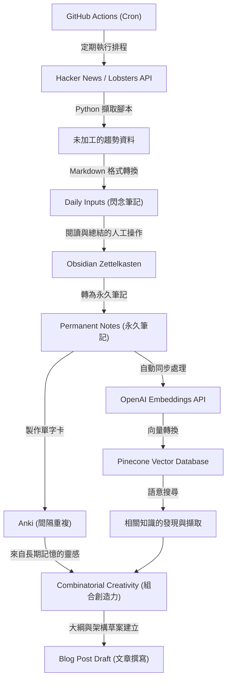

作為工程師或研究人員經營技術部落格時，幾乎無可避免會面臨到一道牆，那就是「靈感枯竭 (ネタ切れ)」。即使最初的幾篇文章能順利寫出，在持續更新的過程中，往往會陷入「不知道接下來該寫什麼」、「為了輸出的輸入量壓倒性不足」等煩惱之中。撰寫技術部落格不僅僅是寫作技巧，更大幅依賴於日常知識的收集、整理，以及將它們組合以創造新價值的一系列系統設計。

本文將極度詳細且具技術性地解說，如何建立一套**系統化的輸入與輸出管道 (Pipeline)**，以半永久地持續產生技術文章的點子。我們將從使用 API 自動從 Hacker News 與 Lobsters 等海外高品質資訊來源擷取趨勢話題，並透過 GitHub Actions 定期執行的機制開始。接著，利用 Obsidian 的卡片盒筆記法（Zettelkasten）將收集到的資訊體系化為知識，並結合 OpenAI 的 Embeddings API 與 Pinecone（向量資料庫）實現語意搜尋，建構出一套進階的個人知識管理（PKM: Personal Knowledge Management）系統。

此外，為了彌補人類記憶的極限，我們將使用 Anki 來實踐基於艾賓浩斯遺忘曲線的間隔重複（Spaced Repetition），並將鞏固的知識透過「組合的創造力（Combinatorial Creativity）」昇華為新點子。我們將搭配具體的數學模型與 Python 腳本實作範例，深入探討這一連串的過程。

## 1. 資訊熵與「靈感枯竭」的機制

為什麼我們會發生「靈感枯竭」呢？從資訊理論的觀點來看，可以說這是我們所擁有的知識體系中的「資訊量」枯竭，或者是變得同質化的一種狀態。

由克勞德·夏農 (Claude Shannon) 提出的資訊熵 $H(X)$，代表著從資訊來源獲得資訊的不確定性（或驚奇的程度）。

$$ H(X) = - \sum_{i=1}^{n} P(x_i) \log_2 P(x_i) $$

在這裡，$X$ 是從資訊來源獲得之話題的隨機變數，$P(x_i)$ 是遇到該話題 $x_i$ 的機率。如果平時只瀏覽類似的網站（例如特定的國內新聞網站或同一個技術堆疊的文件），特定的 $P(x_i)$ 會變得極高，結果導致整個系統的熵 $H(X)$ 下降。熵低的狀態就是「沒有新發現（驚奇）」的狀態，這正是「靈感枯竭」的根本原因。

為了保持較高的熵，我們需要刻意將平時不接觸的資訊來源作為雜訊引入，使接觸未知話題的機率分佈平滑化。這正是將來自多種資訊來源的輸入自動化的最大理由。

## 2. 建構自動化資訊收集管道：Hacker News & Lobsters API

為了獲得高品質的輸入，從雜訊少且優質的工程師社群中擷取趨勢資訊非常有效。Hacker News（由 Y Combinator 營運）與 Lobsters 由於會進行深入的技術討論，是絕佳的選擇。然而，每天巡視這些網站會花費時間，並消耗認知資源。

因此，我們將使用 Python 撰寫腳本，從這些 API 中自動擷取達到特定分數以上的文章。

### 使用 Python 的趨勢文章擷取腳本

以下的腳本將從 Hacker News 的 Firebase API 與 Lobsters 的 JSON 摘要 (Feed) 中，取得符合一定標準的文章，並輸出為 Markdown 檔案。

```python
import requests
import json
from datetime import datetime
import os

# 設定
HN_TOPSTORIES_URL = "https://hacker-news.firebaseio.com/v0/topstories.json"
HN_ITEM_URL = "https://hacker-news.firebaseio.com/v0/item/{}.json"
LOBSTERS_URL = "https://lobste.rs/hottest.json"
MIN_HN_SCORE = 100
MIN_LOBSTERS_SCORE = 10
OUTPUT_DIR = "./daily_inputs"

def get_hacker_news_trends():
    """從 Hacker News 取得高分熱門文章"""
    print("Fetching Hacker News top stories...")
    response = requests.get(HN_TOPSTORIES_URL)
    if response.status_code != 200:
        return []
    
    story_ids = response.json()[:30] # 限制為前 30 筆
    trending_stories = []
    
    for story_id in story_ids:
        item_resp = requests.get(HN_ITEM_URL.format(story_id))
        if item_resp.status_code == 200:
            item = item_resp.json()
            if item and item.get("score", 0) >= MIN_HN_SCORE:
                trending_stories.append({
                    "title": item.get("title"),
                    "url": item.get("url", f"https://news.ycombinator.com/item?id={story_id}"),
                    "score": item.get("score"),
                    "source": "Hacker News"
                })
    return trending_stories

def get_lobsters_trends():
    """從 Lobsters 取得高分文章"""
    print("Fetching Lobsters hottest stories...")
    response = requests.get(LOBSTERS_URL)
    if response.status_code != 200:
        return []
    
    items = response.json()
    trending_stories = []
    
    for item in items:
        if item.get("score", 0) >= MIN_LOBSTERS_SCORE:
            trending_stories.append({
                "title": item.get("title"),
                "url": item.get("url", item.get("comments_url")),
                "score": item.get("score"),
                "source": "Lobsters"
            })
    return trending_stories

def save_to_markdown(stories):
    """將取得的文章儲存為 Markdown 檔案"""
    if not os.path.exists(OUTPUT_DIR):
        os.makedirs(OUTPUT_DIR)
        
    today_str = datetime.now().strftime("%Y-%m-%d")
    filepath = os.path.join(OUTPUT_DIR, f"trends_{today_str}.md")
    
    with open(filepath, "w", encoding="utf-8") as f:
        f.write(f"# Daily Tech Trends: {today_str}\n\n")
        for story in stories:
            f.write(f"## [{story['title']}]({story['url']})\n")
            f.write(f"- **Source**: {story['source']}\n")
            f.write(f"- **Score**: {story['score']}\n")
            f.write(f"- **Notes**: (在此補充考察內容)\n\n")
            
    print(f"Saved {len(stories)} stories to {filepath}")

if __name__ == "__main__":
    hn_stories = get_hacker_news_trends()
    lobsters_stories = get_lobsters_trends()
    all_stories = hn_stories + lobsters_stories
    
    # 根據分數降冪排序
    all_stories.sort(key=lambda x: x["score"], reverse=True)
    save_to_markdown(all_stories)
```

這個腳本提供了超越單純 RSS 閱讀器的價值。因為透過分數進行過濾，我們只能擷取出社群真正關注的技術話題（低雜訊、高訊號）。

## 3. 透過 GitHub Actions 進行排程與自動化

每天手動執行撰寫好的 Python 腳本非常麻煩。自動化的基本原則就是盡可能減少人類的介入。我們將利用 GitHub Actions 的 Cron 功能，建立一個每天在指定時間執行腳本，並將結果自動提交 (commit) 到儲存庫的機制。

在專案根目錄建立 `.github/workflows/daily_trends.yml`，並寫入以下內容：

```yaml
name: Daily Tech Trends Scraper

on:
  schedule:
    - cron: '0 0 * * *' # 每天 UTC 0:00 執行（台灣時間 8:00）
  workflow_dispatch: # 手動執行用

jobs:
  scrape-and-commit:
    runs-on: ubuntu-latest
    steps:
      - name: Checkout Repository
        uses: actions/checkout@v3
        
      - name: Setup Python
        uses: actions/setup-python@v4
        with:
          python-version: '3.10'
          
      - name: Install Dependencies
        run: |
          python -m pip install --upgrade pip
          pip install requests
          
      - name: Run Scraper Script
        run: python scripts/fetch_trends.py
        
      - name: Commit and Push Changes
        run: |
          git config --local user.email "action@github.com"
          git config --local user.name "GitHub Action"
          git add daily_inputs/
          git commit -m "Auto-update daily tech trends [skip ci]" || echo "No changes to commit"
          git push
```

如此一來，每天早上打開 Obsidian 時，就會看到當天的重要話題自動以 Markdown 形式加入到收件匣（`daily_inputs/`）中的狀態。

## 4. 使用 Zettelkasten 與 Obsidian 將知識網路化

自動收集的資訊仍只是單純的「資料」。我們需要將其昇華為「知識」的過程。在這裡大顯身手的，就是卡片盒筆記法（Zettelkasten）與 Obsidian。

卡片盒筆記法是德國社會學家尼克拉斯·盧曼 (Niklas Luhmann) 發明的筆記法。與其將筆記分類到階層式資料夾中，不如保持每篇筆記短小（原子化），並透過連結將筆記互相串連，藉此建立宛如大腦神經迴路般的知識網路。

Zettelkasten 主要有三種筆記：
1. **Fleeting Notes（閃念筆記）**：暫時記錄想到的點子或收集到的資訊。剛剛自動生成的趨勢資訊 Markdown 就屬於此類。
2. **Literature Notes（文獻筆記）**：閱讀文章或書籍後，用自己的話語總結的內容。
3. **Permanent Notes（永久筆記）**：針對一個主題寫下完整考察的筆記。這些將直接成為部落格文章的種子。

透過使用 Obsidian 的反向連結功能（`[[筆記名稱]]`），例如可以將「Rust 的所有權」與「垃圾回收 (Garbage Collection) 的歷史」這兩篇筆記連結起來，進而發現出乎意料的點子關聯。

## 5. 利用向量資料庫（Pinecone）與 OpenAI Embeddings 進行語意搜尋

當筆記數量增加到數百、數千篇時，單純的關鍵字搜尋（全文檢索）就很難找到目標筆記。在「想不起關鍵字，但想尋找概念相似的筆記」時，活用大型語言模型（LLM）Embeddings 的語意搜尋就能發揮威力。

使用 OpenAI 的 `text-embedding-ada-002` 模型（或 `text-embedding-3-small`），將 Obsidian 的各篇 Markdown 筆記轉換為多維度的向量（數百至數千維度的數值陣列）。在這些向量空間中，意義相近的文章向量，在物理距離上也會比較接近。

為測量向量間的相似度，廣泛使用的是餘弦相似度（Cosine Similarity）。

$$ \text{similarity} = \cos(\theta) = \frac{\mathbf{A} \cdot \mathbf{B}}{\|\mathbf{A}\| \|\mathbf{B}\|} = \frac{\sum_{i=1}^{n} A_i B_i}{\sqrt{\sum_{i=1}^{n} A_i^2} \sqrt{\sum_{i=1}^{n} B_i^2}} $$

$\mathbf{A}$ 與 $\mathbf{B}$ 分別是查詢字串的向量與筆記的向量。為了高速進行此計算，我們使用 Pinecone 或 Qdrant 等向量資料庫。

### 語意搜尋實作範例

以下是一段 Python 腳本，用來掃描 Obsidian 的筆記目錄，透過 OpenAI API 將其向量化，並向上安插（Upsert，即插入/更新）至 Pinecone 中。

```python
import os
import glob
from openai import OpenAI
from pinecone import Pinecone, ServerlessSpec

# API 金鑰設定（從環境變數取得）
OPENAI_API_KEY = os.getenv("OPENAI_API_KEY")
PINECONE_API_KEY = os.getenv("PINECONE_API_KEY")

client = OpenAI(api_key=OPENAI_API_KEY)
pc = Pinecone(api_key=PINECONE_API_KEY)

INDEX_NAME = "obsidian-notes"
OBSIDIAN_DIR = "/path/to/obsidian/vault/PermanentNotes"

def init_pinecone():
    """Pinecone 索引初始化"""
    if INDEX_NAME not in pc.list_indexes().names():
        pc.create_index(
            name=INDEX_NAME,
            dimension=1536, # text-embedding-3-small / ada-002 的維度
            metric="cosine",
            spec=ServerlessSpec(cloud="aws", region="us-east-1")
        )
    return pc.Index(INDEX_NAME)

def get_embedding(text):
    """使用 OpenAI API 將文本向量化"""
    response = client.embeddings.create(
        input=text,
        model="text-embedding-3-small"
    )
    return response.data[0].embedding

def sync_notes_to_pinecone(index):
    """讀取 Markdown 檔案，將其向量化並儲存至 Pinecone"""
    md_files = glob.glob(os.path.join(OBSIDIAN_DIR, "*.md"))
    
    vectors = []
    for filepath in md_files:
        filename = os.path.basename(filepath)
        with open(filepath, "r", encoding="utf-8") as f:
            content = f.read()
            
        # 僅在筆記內容不為空時處理
        if content.strip():
            print(f"Embedding note: {filename}")
            embedding = get_embedding(content)
            
            # Pinecone 格式 (id, vector, metadata)
            vectors.append({
                "id": filename,
                "values": embedding,
                "metadata": {"text": content[:500]} # 搜尋結果顯示用的部分文本
            })
            
    # 批次處理向上安插 (Upsert)
    if vectors:
        index.upsert(vectors=vectors)
        print(f"Successfully upserted {len(vectors)} notes.")

def search_similar_ideas(index, query_text, top_k=3):
    """搜尋與查詢相似的筆記以用於發想點子"""
    query_embedding = get_embedding(query_text)
    
    results = index.query(
        vector=query_embedding,
        top_k=top_k,
        include_metadata=True
    )
    
    print(f"\n--- Search Results for: '{query_text}' ---")
    for match in results["matches"]:
        print(f"Score: {match['score']:.4f} | Note: {match['id']}")
        print(f"Preview: {match['metadata']['text'][:100]}...\n")

if __name__ == "__main__":
    idx = init_pinecone()
    # 首次執行時呼叫 sync_notes_to_pinecone(idx) 建立 DB
    sync_notes_to_pinecone(idx)
    
    # 為部落格發想點子進行搜尋
    search_similar_ideas(idx, "WebAssemblyを利用したブラウザ上での機械学習推論の高速化")
```

透過這個系統，當遇到「我想寫這週在 Hacker News 上引起話題的『WebAssembly』，但我過去有沒有寫過相關筆記？」的疑問時，AI 就會瞬間挑選出語意相關的過去永久筆記。如此一來，就能充分活用過去的自我知識資產，構築出具有深度的文章架構。

## 6. 活用艾賓浩斯遺忘曲線與 Anki 的間隔重複

無論在筆記中記錄了多麼優秀的知識，如果作者的大腦本身沒有記住這些知識，寫作時就很難流暢地將多個概念連結起來。這時，將人類記憶機制用數學模型化呈現的「艾賓浩斯遺忘曲線」就登場了。

遺忘曲線可以用以下公式近似：

$$ R = e^{-\frac{t}{S}} $$

其中：
- $R$ 是記憶的保留率 (Retrievability，範圍從 0 到 1)
- $t$ 是學習後經過的時間
- $S$ 是記憶的穩定度 (Stability) 或強度

剛學習新概念後 $S$ 較小，隨著時間 $t$ 增加，$R$ 會急遽下降（遺忘）。但是，如果在快要忘記的絕佳時機進行複習（Recall），直到下次遺忘的速度就會變緩（$S$ 變大），進而鞏固為長期記憶。

使用演算法（如 SuperMemo 2）自動計算這個最佳複習時機，並以單字卡形式呈現的軟體，就是「Anki」。

作為發想技術部落格點子的強力方法，可以**將 Obsidian 中的永久筆記內容轉換為 Anki 單字卡**。
例如，將「CAP 定理的三要素是什麼？」、「為什麼 B-Tree 索引具備 O(log N) 的搜尋效能？」這類涉及技術根本的問題登錄到 Anki 中，並作為每日例行公事進行複習。當知識作為長期記憶索引在腦海中時，在洗澡或散步的無意識狀態下，資訊就會互相結合，產生「啊，我似乎可以寫一篇關於分散式系統共識演算法的文章」的靈光一閃（尤里卡時刻）。

## 7. 組合的創造力 (Combinatorial Creativity)

在目前的管道中，我們已經實現了「多樣化資訊的輸入」、「透過 Zettelkasten 整理與 AI 搜尋」以及「透過 Anki 鞏固至長期記憶」。最後一步，就是將這些元素組合，產生全新技術文章點子的「組合的創造力（Combinatorial Creativity）」。

創新與創造力並非無中生有，而是透過現有元素的新組合而誕生。史蒂夫·賈伯斯 (Steve Jobs) 的名言「創造力不過是將事物連結起來 (Creativity is just connecting things.)」非常著名。

技術部落格的組合模式，可以考慮以下矩陣：

1. **[舊技術] × [新典範]**：例「從 COBOL 架構中學習現代微服務設計的反模式」
2. **[前端] × [後端概念]**：例「從資料庫交易隔離級別的視角，解說 React 虛擬 DOM 更新演算法」
3. **[抽象的數學與理論] × [具體實作]**：例「用圖論解讀 Kubernetes Pod 排程最佳化」

為了刻意產生這種組合，可以利用剛才建構的 Pinecone 語意搜尋系統，隨機擷取概念 A 與概念 B，並對 AI（如 ChatGPT）丟出提示詞 (Prompt)：「請提出 5 個結合這兩者的技術部落格標題與大綱草案」，藉此能無限產生出自己想不到的嶄新切入點文章點子。

## 8. 系統整體架構

到此為止所解說的，為防止技術文章靈感枯竭的「從資訊收集到點子創出」整體架構，統整為以下的 Mermaid 流程圖。



## 9. 從點子到公開的狀態轉換模型

儲存在 Zettelkasten 中的點子，直到最終作為部落格文章公開為止的生命週期，可以用以下的狀態轉換圖來表示。在每個狀態下，都會分別使用合適的工具與方法。

```mermaid
stateDiagram-v2
    [*] --> Capture["Idea Capture (資訊捕捉)"]
    
    Capture["Idea Capture (資訊捕捉)"] --> Fleeting["Fleeting Notes (暫時筆記)"]
    Fleeting["Fleeting Notes (暫時筆記)"] --> Permanent["Permanent Notes (永久筆記)"]
    
    Permanent["Permanent Notes (永久筆記)"] --> Brainstorming["Brainstorming (AI 語意搜尋)"]
    Permanent["Permanent Notes (永久筆記)"] --> Memorization["Memorization (Anki 複習)"]
    Memorization["Memorization (Anki 複習)"] --> Brainstorming["Brainstorming (AI 語意搜尋)"]
    
    Brainstorming["Brainstorming (AI 語意搜尋)"] --> Outlining["Outlining (架構與大綱建立)"]
    Outlining["Outlining (架構與大綱建立)"] --> Drafting["Drafting (初稿撰寫)"]
    
    Drafting["Drafting (初稿撰寫)"] --> Review["Review & Edit (推敲與校正)"]
    Review["Review & Edit (推敲與校正)"] --> Published["Published (部落格公開)"]
    
    Published["Published (部落格公開)"] --> [*]
```



透過意識到這個工作流程，就能明確知道「自己現在卡在哪個階段」。當想不出點子時，只要回到「Capture」或「Permanent」階段，確認輸入管道是否有正常運作即可。

## 總結：寫作是一個「系統」

「技術部落格靈感枯竭」，其原因並非個人能力不足或動機下降，而是**因為沒有建構出讓知識循環的系統，所導致的必然結果**。

如本文所介紹：
1. 透過 **API 與自動化**確保低雜訊的高品質輸入
2. 透過使用 **Obsidian** 的 Zettelkasten 將知識網路化
3. 透過 **OpenAI 與 Pinecone** 進行自我資產的語意搜尋
4. 活用 **Anki** 與艾賓浩斯遺忘曲線強化腦內索引
5. 將現有概念互相結合的**組合創造力**

藉由建構結合了以上各點的全面性管道，不僅能讓部落格點子不再枯竭，還能創造出越寫就有越多新點子自我繁殖的狀態。

一開始不需要將一切建構得完美無缺。請試著先從撰寫呼叫 Hacker News API 的簡單腳本，並用 Markdown 記下感興趣文章的習慣開始做起吧。希望你的技術部落格能成為次世代優秀點子的發源地。
