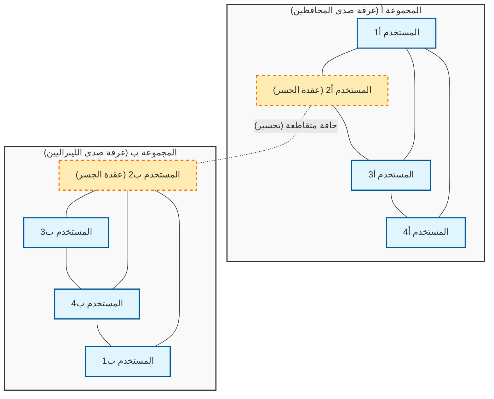
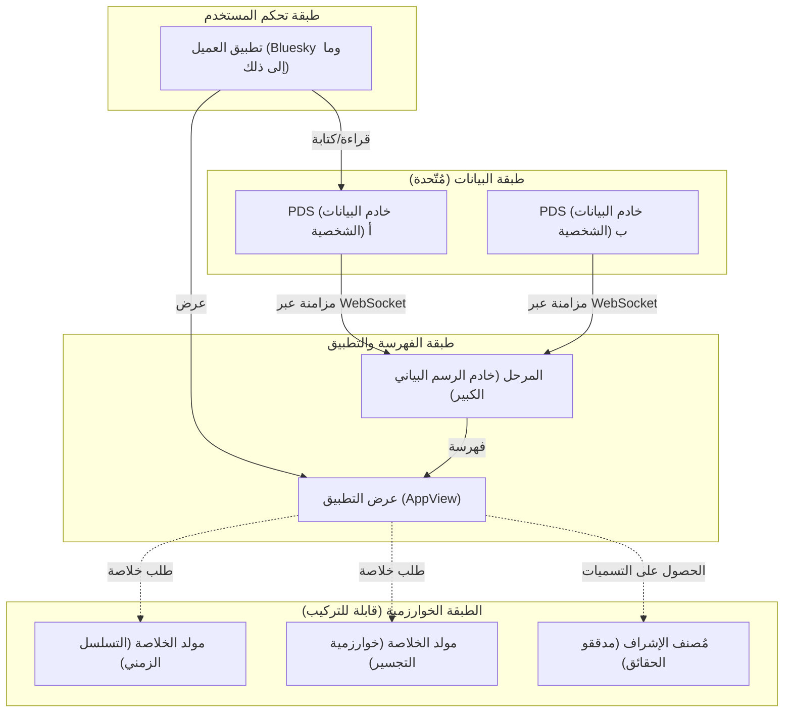

# مقدمة: بمناسبة المقال المئة التذكاري

مرت عدة سنوات منذ إطلاق هذه المدونة، وقد واصلت فيها مشاركة شروحات تقنية، ومذكرات تطوير يومية، وتأملات حول العلاقة بين التكنولوجيا والمجتمع. والآن، يمثل هذا المقال المنشور التذكاري "رقم 100". أود أن أعرب عن خالص شكري وامتناني لجميع القراء الذين واصلوا القراءة حتى هذه اللحظة.

وبمناسبة هذا الإنجاز المتمثل في المقال رقم 100، هناك موضوع أردت بشدة أن أكتب عنه. وهو: "هل يمكن للتكنولوجيا سد الفجوة الاجتماعية؟" وهو سؤال جوهري وهام للغاية في مجتمعنا المعاصر.

كان يُتحدث عن الإنترنت في مراحله الأولى (Web 1.0) كمدينة فاضلة (يوتوبيا) لـ "دمقرطة المعرفة"، حيث يمكن لأي شخص نشر المعلومات والوصول إليها بحرية. ثم جاء عصر وسائل التواصل الاجتماعي (Web 2.0)، والذي كان من المفترض أن يربط بين الناس في جميع أنحاء العالم ويحقق "عالمًا مسطحًا". ومع ذلك، اعتبارًا من عام 2026، ما هو الواقع الذي نواجهه؟ استقطاب سياسي، انتشار لنظريات المؤامرة، تفشي للأخبار المزيفة، وتشكيل لـ "غرف الصدى" (Echo Chambers) و"فقاعات الفلتر" التي ترفض الفهم المتبادل. يبدو أن التكنولوجيا، بدلاً من ربط الناس، أصبحت محركًا قويًا يسرع من الانقسام الاجتماعي (Social Divide).

نحن كمهندسين لسنا مجرد أشخاص يكتبون الأكواد ويبنون الأنظمة. فخلف البنى المعمارية (Architectures) التي نصممها، والخوارزميات التي نختارها، والدوال الهدفية (Objective Functions) التي نحسنها، تختبئ "قواعد" تحدد شكل المجتمع. في هذا المقال، ومن منظور مهندس، أود التعمق في كيفية نشوء الانقسامات الاجتماعية الحالية من الناحية التقنية، وذلك من خلال كشف الهيكل الرياضي ونظرية الشبكات، وفي الوقت نفسه مناقشة المقاربات التقنية الملموسة (خوارزميات التجسير، بروتوكولات الشبكات الاجتماعية اللامركزية) للتغلب عليها.

---

# الفصل الأول: البنية الرياضية لـ "غرفة الصدى" من منظور نظرية الشبكات

عند مناقشة الانقسام الاجتماعي، لا مفر من البدء بتحليل بنية المجتمع باستخدام "نظرية الشبكات" (Graph Theory). يمكن نمذجة العلاقات الإنسانية على وسائل التواصل الاجتماعي كـ "مخطط بياني" (Graph) ضخم، حيث يمثل المستخدمون "عقدًا" (Nodes)، وتمثل المتابعة والتفاعل بين المستخدمين "حواف" أو روابط (Edges).

أحد أهم المؤشرات التي تميز الانقسام هو "معامل التجميع" (Clustering Coefficient). يشير معامل التجميع $C_i$ للمستخدم $i$ إلى احتمالية أن يكون أصدقاء المستخدم $i$ أصدقاء لبعضهم البعض، ويُعرّف بالمعادلة التالية:

$$ C_i = \frac{2e_i}{k_i(k_i - 1)} $$

حيث $k_i$ هي درجة المستخدم $i$ (عدد الأصدقاء)، و $e_i$ هو عدد الحواف الفعلية الموجودة بين هؤلاء الأصدقاء البالغ عددهم $k_i$. في وسائل التواصل الاجتماعي، تشكل ظاهرة تكوين شبكات محلية (مخططات جزئية كثيفة) ذات معاملات تجميع عالية بشكل غير طبيعي الأساس لما يسمى بـ "غرفة الصدى".

وخلف تكوين غرفة الصدى، يكمن مبدأ "التجانس" (Homophily) كما يُعرف في علم الاجتماع. وكما يقول المثل "الطيور على أشكالها تقع"، يميل البشر إلى التواصل مع الآخرين الذين يشاركونهم نفس الصفات والأفكار. وإذا عبرنا عن ذلك كنموذج احتمالي، يمكننا افتراض أن احتمالية $P(u, v)$ لتكوين حافة بين المستخدم $u$ والمستخدم $v$ تتناسب عكسياً مع المسافة الأيديولوجية $d(u,v)$ بينهما.

$$ P(u, v) \propto e^{-\beta \cdot d(u,v)} $$

المعلمة $\beta > 0$ هي ثابت يوضح قوة التجانس. إذا استمرت خوارزميات التوصية في المنصة في تقديم "المحتوى والمستخدمين الذين يفضلهم المستخدم (أي المشابهين له)"، فسيتم دفع قيمة $\beta$ هذه للارتفاع بشكل مصطنع. ونتيجة لذلك، تقل بشكل حاد الحواف (الروابط الضعيفة: Weak Ties) بين المجموعات ذات الأيديولوجيات المختلفة، وتنقسم الشبكة بأكملها إلى مجموعات متعددة معزولة عن بعضها البعض.

يوضح مخطط Mermaid أدناه بشكل مرئي مفهوم الشبكة المنقسمة وكيفية ربطها (التجسير).

وبهذه الطريقة، طالما أن الخوارزمية تتبنى دالة هدف $J(\theta) = \sum \log P(\text{engage} | \text{user}, \text{content})$ تعمل فقط على تحسين التفاعل (نسبة النقر، وقت البقاء)، فإن النظام سيقع في حلول محلية (تعزيز غرف الصدى) ويبتعد عن التحسين الشامل (تشكيل فضاء عام صحي).

---

# الفصل الثاني: تسريع الاستقطاب بواسطة الخوارزميات ونماذج انتشار المعلومات

لفهم كيف تنتشر المعلومات داخل غرفة الصدى، دعونا نطبق "نموذج SIR"، وهو نموذج رياضي للأمراض المعدية، على انتشار المعلومات.
- $S$ (Susceptible) : المستخدمون الذين لم يتعرضوا للمعلومات بعد
- $I$ (Infected) : المستخدمون الذين يصدقون المعلومات وينشرونها
- $R$ (Recovered/Removed) : المستخدمون الذين فقدوا الاهتمام بالمعلومات، أو أدركوا أنها مزيفة فتوقفوا عن نشرها

يُعبر عن المعادلات التفاضلية لانتشار المعلومات على النحو التالي:

$$ \frac{dS}{dt} = -\alpha S I $$
$$ \frac{dI}{dt} = \alpha S I - \gamma I $$
$$ \frac{dR}{dt} = \gamma I $$

هنا، يمثل $\alpha$ "معدل العدوى (سهولة انتشار المعلومات)"، ويمثل $\gamma$ "معدل التعافي (تشبع المعلومات والنسيان)".
المثير للاهتمام هو أن الدراسات التجريبية تظهر أن المحتوى المتطرف الذي يثير الغضب أو الخوف (Polarizing Content) يمتلك قيمة $\alpha$ أعلى بكثير مقارنة بالمعلومات العادية. علاوة على ذلك، داخل غرف الصدى، تكون فرص التعرض لمعلومات داحضة قليلة، مما يجعل قيمة $\gamma$ منخفضة للغاية. بعبارة أخرى، عندما تحاول الخوارزمية تعظيم التفاعل، فإنها ستتعلم بالضرورة إعطاء الأولوية لتوزيع المحتوى الذي يتميز بـ $\alpha$ مرتفع و $\gamma$ منخفض، أي "الآراء المتطرفة والأخبار المزيفة". هذه هي الآلية التي من خلالها يسرع الذكاء الاصطناعي من الانقسام الاجتماعي عن غير قصد.

---

# الفصل الثالث: الحلول التقنية (1) خوارزميات التجسير وملاحظات المجتمع

إذًا، كيف يجب أن نواجه هذا الخلل الهيكلي؟ المقاربة الأولى هي تقديم "خوارزمية التجسير" (Bridging Algorithm).

إذا كانت خوارزميات التوصية القائمة على التفاعل تكافئ "التجانس"، فإن خوارزميات التجسير تكافئ "مد جسور التواصل بين الاختلافات". ومن أبرز الأمثلة الناجحة على ذلك خوارزمية "ملاحظات المجتمع" (Community Notes) التي تم تقديمها في منصة X (تويتر سابقًا).

لا تعتبر ميزة Community Notes مجرد تصويت للأغلبية. فلو كانت كذلك، لكانت الآراء الصادرة عن غرف الصدى ذات العدد الأكبر من الأشخاص هي الفائزة دائمًا. الميزة الثورية لـ Community Notes هي أنها تكافئ "الملاحظات التي قيمها أشخاص لا يتفقون عادةً (ينتمون إلى مجموعات مختلفة) وصادف أن اتفقوا على أنها مفيدة".

ولتحقيق ذلك، يتم استخدام تقنية تعلم الآلة تُسمى "تحليل المصفوفات" (Matrix Factorization). يتم نمذجة درجة التنبؤ $\hat{r}_{u,n}$ لتقييم المستخدم $u$ للملاحظة $n$ (مفيدة أم لا) على النحو التالي:

$$ \hat{r}_{u,n} = \mu + i_u + i_n + \mathbf{f}_u \cdot \mathbf{f}_n $$

- $\mu$ : خط الأساس الإجمالي (متوسط اتجاه التقييم)
- $i_u$ : انحياز التقييم للمستخدم $u$ (مثل الشخص الذي يعطي تقييمات عالية دائمًا)
- $i_n$ : الجودة العامة للملاحظة $n$ (هل هي واضحة للجميع)
- $\mathbf{f}_u$ : متجه السمات الكامنة للمستخدم $u$ (الموقف الأيديولوجي، إلخ)
- $\mathbf{f}_n$ : متجه السمات الكامنة للملاحظة $n$

تقوم الخوارزمية بتعلم كل معلمة بحيث تقلل الخطأ بين بيانات التقييم الفعلية والدرجات المتوقعة.
المهم هنا هو أن ما يُستخدم في القرار النهائي لعرض الملاحظة ليس متوسط التقييم، بل "المعلمة $i_n$ التي تشير إلى الجودة العامة للملاحظة".

إذا حصلت ملاحظة ما على عدد كبير من التقييمات العالية من مجموعة منحازة معينة (على سبيل المثال، اليمين فقط أو اليسار فقط)، فسيتم استيعاب هذه التقييمات العالية في حد المتجه الكامن $\mathbf{f}_u \cdot \mathbf{f}_n$، ولن ترتفع قيمة $i_n$. ومع ذلك، إذا حصلت على تقييمات عالية من كل من اليمين ($\mathbf{f}_u > 0$) واليسار ($\mathbf{f}_u < 0$)، فلن يكون الجداء النقطي للمتجهات الكامنة كافياً للتفسير، ونتيجة لذلك، ستتعلم الخوارزمية أن "هذه الملاحظة نفسها ممتازة بشكل عالمي (قيمة $i_n$ عالية)".

من خلال مثل هذا النهج الرياضي، يصبح من الممكن اكتشاف وتقييم "بناء التوافق وتجاوز غرف الصدى" بشكل خوارزمي. هذا اختراق تقني قوي للغاية لسد الانقسام الاجتماعي.

---

# الفصل الرابع: الحلول التقنية (2) بروتوكولات الشبكات الاجتماعية اللامركزية (AT Protocol / ActivityPub)

على الرغم من قوة خوارزميات التجسير، يظل التحدي الهيكلي المتمثل في احتكار شركة عملاقة واحدة (منصة مركزية) للخوارزمية قائمًا. بقرار إداري واحد من المنصة، يمكن تغيير الخوارزمية في أي وقت.

المقاربة الثانية لمواجهة ذلك هي حدوث تحول نموذجي على مستوى البنية من خلال "بروتوكولات الشبكات الاجتماعية اللامركزية" (Decentralized Social Protocols). حاليًا، تحظى بروتوكولات مثل ActivityPub (التي تتبناها منصات مثل Mastodon) و AT Protocol (التي تتبناها Bluesky) باهتمام كبير.

يتمتع AT Protocol (بروتوكول النقل المصادق عليه) بشكل خاص بفلسفة تصميم جميلة جدًا تتمثل في "فصل البيانات عن الخوارزميات".

أعظم إنجاز لبروتوكول AT Protocol هو أنه فصل "إنشاء الخلاصات (الخوارزميات)" و "الإشراف (التصنيف)" عن المنصة الأساسية، مما سمح للمستخدمين باختيارها ودمجها بحرية (خلاصات مخصصة / إشراف قابل للتكديس).

حتى الآن، كان بإمكاننا اختيار "أي شبكة اجتماعية نستخدم"، لكن لم نتمكن من اختيار "أي خوارزمية نستخدم لتلقي المعلومات". في عالم AT Protocol، يمكن لشخص ما اختيار خلاصة "ترتيب زمني"، ويمكن لشخص آخر تثبيت "خلاصة أكاديمية تقدم حججاً مضادة لآرائه"، ويمكن لشخص ثالث الاشتراك في "تسميات الإشراف من جهة خارجية تخفي الكلمات غير اللائقة".

هذا البروتوكول، المدعوم بتقنيات التشفير (DID: المعرفات اللامركزية) وهياكل البيانات (Merkle Search Trees: MST)، يعيد للمستخدمين "حق تقرير المصير في المعلومات". من خلال تحويل الخوارزميات من صناديق سوداء إلى شيء يتنافس ويُختار في سوق مفتوحة، يمتلك هذا البروتوكول القدرة على تغيير بنية الحوافز من خوارزميات تسعى فقط لتعظيم التفاعل إلى خوارزميات تقدر الصحة النفسية للمستخدمين وصحة المجتمع.

---

# الفصل الخامس: فلسفة المصادر المفتوحة والمسؤولية الاجتماعية للمهندسين

حتى الآن، ناقشنا التحليل القائم على نظرية الشبكات والتقنيات المحددة للتغلب عليه (تحليل المصفوفات في Community Notes، والبنية اللامركزية لـ AT Protocol). ولكن في النهاية، ما سيسد الفجوة والانقسام الاجتماعي ليس مجرد أكواد أو معادلات رياضية. بل هي "إرادة وفلسفة الإنسان" الذي يصنعها.

في عالم هندسة البرمجيات، هناك ثقافة عظيمة تُعرف بـ "المصادر المفتوحة" (Open Source). بدءًا من Linux، تم بناء معظم التقنيات الأساسية التي يقوم عليها الإنترنت من قبل أشخاص غرباء من جميع أنحاء العالم، تعاونوا وناقشوا ودمجوا الأكواد متجاوزين الأيديولوجيات والحدود. لا يستبعد مجتمع المصادر المفتوحة النزاعات (التعارضات)، بل يمتلك آليات لترقيتها إلى بناء توافق بناء من خلال "طلبات السحب" (Pull Requests) و"مراجعة الأكواد" (Code Review).

أعتقد أن فلسفة المصادر المفتوحة هذه بحد ذاتها تقدم دليلاً لإصلاح مجتمعنا الحديث المنقسم. جعل الأنظمة شفافة، وترك حرية اختيار الخوارزميات للمستخدمين، وتصميم فضاء عام لامركزي (Public Square) يمكن أن تتعايش فيه قيم متنوعة. هذه مسؤولية اجتماعية بالغة الأهمية تقع على عاتق المهندسين في العصر الحديث.

البرمجيات هي القانون، والبنية هي السياسة. سطر الكود الذي نكتبه، ونقطة نهاية واجهة برمجة التطبيقات (API Endpoint) التي نحددها، ومخطط قاعدة البيانات الذي نصممه، كل ذلك يشكل الإدراك المعرفي لملايين بل لمليارات المستخدمين، ويمكن أن يسرع الانقسام الاجتماعي، أو قد يبني جسورًا تشجع على الحوار.

---

# الخاتمة: بعد الانتهاء من المقال رقم 100

"هل يمكن للتكنولوجيا سد الفجوة الاجتماعية؟"

إجابتي على هذا السؤال هي: "لا يمكن للتكنولوجيا وحدها أن تسد الفجوة، ولكن التكنولوجيا المصممة بشكل صحيح يمكن أن تصبح 'سقالات' للبشر للتغلب على هذا الانقسام".

من المستحيل القضاء تمامًا على التحيزات البشرية الأساسية (مثل التجانس والانحياز التأكيدي). ومع ذلك، من الممكن إيقاف خروج الخوارزميات التي تسعى فقط وراء التفاعل عن السيطرة، وتقديم نماذج رياضية تكافئ "التجسير" مثل Community Notes، وإعادة حق الاختيار للمستخدمين من خلال بنيات لا مركزية مستقلة مثل AT Protocol.

وصلت هذه المدونة الآن إلى العدد 100. في المقالات السابقة، ركزنا على الجانب العملي أو ما يُعرف بـ "كيف" (How)، مثل مواصفات اللغات وطريقة استخدام أطر العمل. ومع ذلك، في العصر القادم حيث سيقوم الذكاء الاصطناعي بإنشاء الأكواد تلقائيًا وتصبح جميع التقنيات سلعًا استهلاكية، فإن الأهم بالنسبة لنا كمهندسين هو الأسئلة الأخلاقية والفلسفية: "ماذا نصنع" (What) و "لماذا نصنعه" (Why).

التكنولوجيا ليست سحرًا. إنها مرآة تعكس البشر. إذا كان المجتمع منقسمًا، فذلك لأن الأنظمة التي صنعناها تعكس وتضخم هذا الانقسام. ولهذا السبب تحديدًا، أعتقد أنه من خلال إعادة كتابة الأنظمة، يمكننا تغيير شكل المجتمع شيئًا فشيئًا، ولكن بخطى ثابتة نحو الأفضل.

وابتداءً من المقال رقم 101 وما بعده، سأستمر كمهندس في الوقوف على تقاطع الأكواد والمجتمع لتعميق أفكاري. شكرًا جزيلاً لكم على مرافقتي وقراءة هذا المقال الطويل حتى النهاية. على أمل أن تصبح شبكات المستقبل جسورًا لفهم بعضنا البعض، بدلاً من أن تكون جدرانًا تفصل بيننا.

(النهاية)

