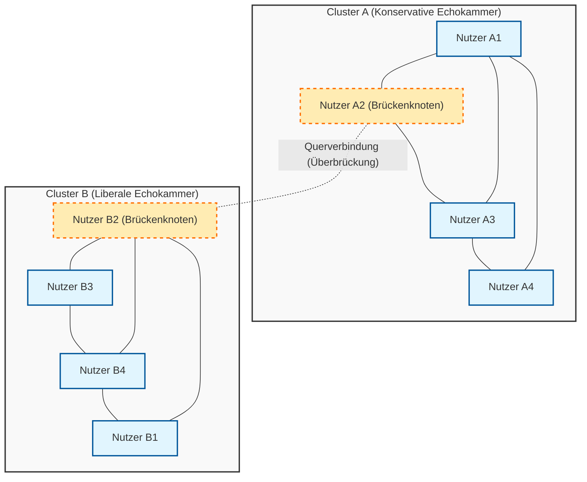
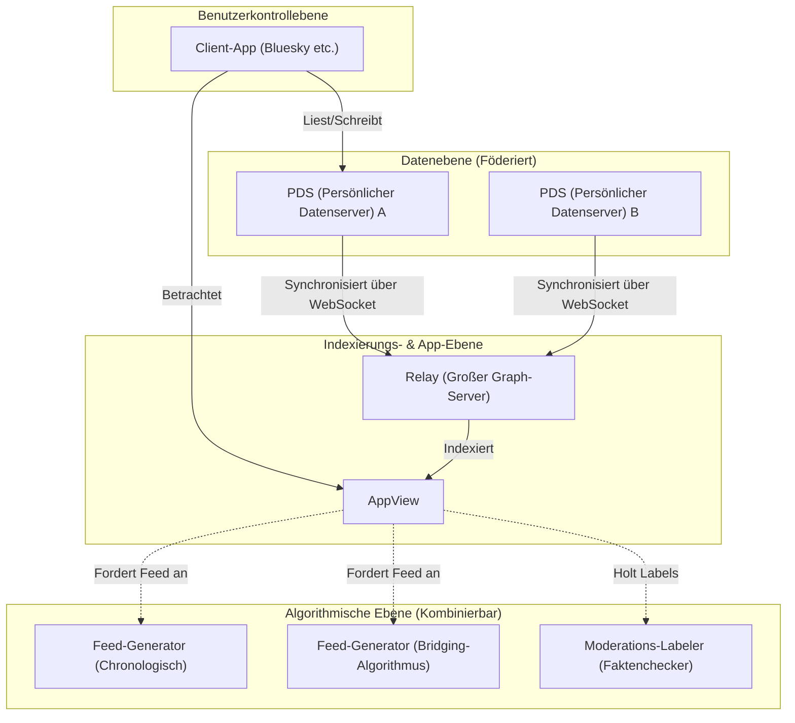

# Einleitung: Zum denkwürdigen 100. Artikel

Einige Jahre sind vergangen, seit ich diesen Blog gestartet habe. In dieser Zeit habe ich technische Erklärungen, Notizen zur täglichen Entwicklung und gelegentlich Überlegungen zur Beziehung zwischen Technologie und Gesellschaft geteilt. Dieser Artikel markiert nun meinen denkwürdigen "100." Beitrag. Ich möchte allen Lesern, die mich bis hierher begleitet haben, meinen tiefsten Dank aussprechen.

Zu diesem 100. Meilenstein gibt es ein Thema, das ich unbedingt festhalten wollte. Es ist die äußerst wichtige und grundlegende Frage in der modernen Gesellschaft: "Kann Technologie die gesellschaftliche Spaltung überwinden?"

Das frühe Internet (Web 1.0) wurde als Utopie der "Demokratisierung des Wissens" gepriesen, in der jeder frei Informationen verbreiten und darauf zugreifen konnte. Die darauffolgende Ära der sozialen Medien (Web 2.0) sollte Menschen weltweit verbinden und eine "flache Welt" verwirklichen. Doch wie sieht die Realität aus, der wir uns heute im Jahr 2026 gegenübersehen? Politische Polarisierung, die Verbreitung von Verschwörungstheorien, die Verbreitung von Fake News sowie die Bildung von "Echokammern" und "Filterblasen", die ein gegenseitiges Verständnis verhindern. Anstatt die Menschen zu verbinden, scheint die Technologie zu einem mächtigen Motor geworden zu sein, der die gesellschaftliche Spaltung (Social Divide) eher noch beschleunigt.

Wir Ingenieure sind nicht nur dazu da, Code zu schreiben und Systeme zu bauen. Hinter der von uns entworfenen Architektur, den ausgewählten Algorithmen und der optimierten Zielfunktion (Objective Function) verbergen sich "Regeln", die die Form der Gesellschaft bestimmen. In diesem Artikel möchte ich aus der Perspektive eines Ingenieurs mathematisch und netzwerktheoretisch aufschlüsseln, wie die aktuelle gesellschaftliche Spaltung technologisch erzeugt wird. Gleichzeitig möchte ich konkrete technologische Ansätze (Bridging-Algorithmen, dezentrale SNS-Protokolle) zur Überwindung dieser Spaltung tiefgehend diskutieren.

---

# Kapitel 1: Die mathematische Struktur der "Echokammer" aus Sicht der Netzwerktheorie

Wenn man über gesellschaftliche Spaltung diskutiert, kommt man um die Strukturanalyse von Gemeinschaften mithilfe der "Netzwerktheorie" (Graph Theory) nicht herum. Menschliche Beziehungen in sozialen Medien lassen sich als riesiger Graph modellieren, bei dem die Nutzer als "Knoten" (Nodes) und die Verbindungen oder Interaktionen zwischen ihnen als "Kanten" (Edges) fungieren.

Einer der wichtigsten Indikatoren, der die Spaltung charakterisiert, ist der "Clusterkoeffizient" (Clustering Coefficient). Der Clusterkoeffizient $C_i$ eines Nutzers $i$ gibt die Wahrscheinlichkeit an, dass die Freunde von Nutzer $i$ auch untereinander befreundet sind, und wird durch die folgende Formel definiert:

$$ C_i = \frac{2e_i}{k_i(k_i - 1)} $$

Hierbei ist $k_i$ der Grad (die Anzahl der Freunde) von Nutzer $i$, und $e_i$ ist die tatsächliche Anzahl von Kanten, die zwischen diesen $k_i$ Freunden existieren. Das Phänomen in sozialen Medien, bei dem lokale Netzwerke (dichte Teilgraphen) mit einem ungewöhnlich hohen Clusterkoeffizienten entstehen, bildet die Grundlage der sogenannten "Echokammer".

Hinter der Bildung von Echokammern steht das Prinzip der "Homophilie" (Gleich zu Gleich gesellt sich gern) aus der Soziologie. Wie das Sprichwort sagt, neigen Menschen dazu, sich mit anderen zu verbinden, die ähnliche Eigenschaften oder Ansichten haben. Wenn man dies als Wahrscheinlichkeitsmodell ausdrückt, kann man annehmen, dass die Wahrscheinlichkeit $P(u, v)$ für die Bildung einer Kante zwischen Nutzer $u$ und Nutzer $v$ umgekehrt proportional zu ihrer ideologischen Distanz $d(u,v)$ ist.

$$ P(u, v) \propto e^{-\beta \cdot d(u,v)} $$

Der Parameter $\beta > 0$ ist eine Konstante, die die Stärke der Homophilie angibt. Wenn der Empfehlungsalgorithmus der Plattform kontinuierlich "Inhalte und Nutzer, die der Nutzer mag (= die ihm ähnlich sind)" präsentiert, wird dieser $\beta$-Wert künstlich in die Höhe getrieben. Infolgedessen nehmen die Kanten zwischen Gruppen mit unterschiedlichen Ideologien (schwache Verbindungen: Weak Ties) extrem ab, und das gesamte Netzwerk spaltet sich in mehrere voneinander isolierte Cluster auf.

Das folgende Mermaid-Diagramm veranschaulicht das Konzept eines gespaltenen Netzwerks und das Bridging (Überbrücken), das diese verbindet.

Solange der Algorithmus weiterhin eine Zielfunktion $J(\theta) = \sum \log P(\text{engage} | \text{user}, \text{content})$ verwendet, die ausschließlich das Engagement (Klickraten, Verweildauer) optimiert, wird das System in ein lokales Optimum (die Verstärkung von Echokammern) geraten und sich von einem globalen Optimum (der Schaffung eines gesunden öffentlichen Raums) entfernen.

---

# Kapitel 2: Beschleunigung der Polarisierung durch Algorithmen und Informationsdiffusionsmodelle

Um zu verstehen, wie sich Informationen innerhalb einer Echokammer verbreiten, wenden wir das "SIR-Modell", ein mathematisches Modell für Infektionskrankheiten, auf die Informationsdiffusion an.
- $S$ (Susceptible) : Nutzer, die noch nicht mit der Information in Berührung gekommen sind
- $I$ (Infected) : Nutzer, die an die Information glauben und sie verbreiten
- $R$ (Recovered/Removed) : Nutzer, die das Interesse an der Information verloren haben oder erkannt haben, dass sie falsch ist, und die Verbreitung gestoppt haben

Die Differentialgleichungen der Informationsausbreitung lassen sich wie folgt ausdrücken:

$$ \frac{dS}{dt} = -\alpha S I $$
$$ \frac{dI}{dt} = \alpha S I - \gamma I $$
$$ \frac{dR}{dt} = \gamma I $$

Hierbei steht $\alpha$ für die "Infektionsrate (wie leicht sich die Information verbreitet)" und $\gamma$ für die "Erholungsrate (Sättigung/Vergessen der Information)".
Interessant ist, dass empirische Studien zeigen, dass extreme Inhalte (Polarizing Content), die Wut oder Angst schüren, ein signifikant höheres $\alpha$ aufweisen als gewöhnliche Informationen. Zudem ist in einer Echokammer die Wahrscheinlichkeit, auf Gegenbeweise zu stoßen, gering, weshalb $\gamma$ extrem niedrig ist. Wenn der Algorithmus also versucht, das Engagement zu maximieren, lernt er zwangsläufig, Inhalte mit hohem $\alpha$ und niedrigem $\gamma$, nämlich "extreme Ansichten und Fake News", bevorzugt auszuliefern. Dies ist der Mechanismus, durch den KI unabsichtlich die gesellschaftliche Spaltung beschleunigt.

---

# Kapitel 3: Technologische Lösungsansätze (1) Bridging-Algorithmen und Community Notes

Wie sollen wir also diesem strukturellen Defekt begegnen? Der erste Ansatz ist die Einführung von "Bridging-Algorithmen" (Überbrückungsalgorithmen).

Wenn auf Engagement basierende Empfehlungsalgorithmen "Homogenität" belohnen, dann Bridging-Algorithmen die "Überbrückung von Heterogenität". Ein repräsentatives und erfolgreiches Beispiel dafür ist der Algorithmus für "Community Notes", der auf X (ehemals Twitter) eingeführt wurde.

Community Notes sind nicht einfach nur eine Mehrheitsentscheidung. Wäre dies der Fall, würde die Meinung der bevölkerungsreicheren Echokammer immer gewinnen. Das Revolutionäre an Community Notes ist, dass sie "Notizen, die von Menschen als 'hilfreich' bewertet werden, welche normalerweise unterschiedlicher Meinung sind (also zu verschiedenen Clustern gehören) und zufällig übereinstimmen", hoch bewerten.

Um dies zu realisieren, wird eine Methode des maschinellen Lernens namens "Matrixfaktorisierung" (Matrix Factorization) eingesetzt. Die vorhergesagte Bewertung $\hat{r}_{u,n}$ (ob sie hilfreich war oder nicht), die Nutzer $u$ der Notiz $n$ gibt, wird wie folgt modelliert:

$$ \hat{r}_{u,n} = \mu + i_u + i_n + \mathbf{f}_u \cdot \mathbf{f}_n $$

- $\mu$ : Gesamte Baseline (durchschnittliche Bewertungstendenz)
- $i_u$ : Bewertungsbias von Nutzer $u$ (z. B. jemand, der immer gute Bewertungen abgibt)
- $i_n$ : Allgemeine Qualität der Notiz $n$ (ob sie für jedermann verständlich ist)
- $\mathbf{f}_u$ : Latenter Merkmalsvektor des Nutzers $u$ (z. B. ideologische Position)
- $\mathbf{f}_n$ : Latenter Merkmalsvektor der Notiz $n$

Der Algorithmus lernt die jeweiligen Parameter so, dass der Fehler zwischen den tatsächlichen Bewertungsdaten und den vorhergesagten Werten minimiert wird.
Entscheidend hierbei ist, dass für die endgültige Entscheidung über die Anzeige der Notiz nicht die einfache Durchschnittsbewertung herangezogen wird, sondern "der Parameter $i_n$, der die allgemeine Qualität der Notiz angibt".

Wenn eine bestimmte Notiz eine große Anzahl von positiven Bewertungen aus einer spezifischen, voreingenommenen Gruppe (z. B. nur Rechte oder nur Linke) erhält, wird diese hohe Bewertung durch den Term des latenten Vektors $\mathbf{f}_u \cdot \mathbf{f}_n$ absorbiert, und $i_n$ wird nicht steigen. Wenn sie jedoch sowohl von Rechten ($\mathbf{f}_u > 0$) als auch von Linken ($\mathbf{f}_u < 0$) hoch bewertet wird, lässt sich dies nicht mehr allein durch das Skalarprodukt der latenten Vektoren erklären. Folglich lernt das System, dass "diese Notiz an sich universell gut ist (hohes $i_n$)".

Durch solch einen mathematischen Ansatz wird es möglich, "Konsensbildung jenseits von Echokammern" algorithmisch zu entdecken und zu bewerten. Dies ist ein extrem leistungsfähiger technologischer Durchbruch zur Überwindung der gesellschaftlichen Spaltung.

---

# Kapitel 4: Technologische Lösungsansätze (2) Dezentrale SNS-Protokolle (AT Protocol / ActivityPub)

Bridging-Algorithmen sind mächtig, doch das strukturelle Problem bleibt bestehen, dass ein einziges großes Unternehmen (eine zentralisierte Plattform) ein Monopol auf den Algorithmus hat. Mit einer einzigen Änderung in der Unternehmensstrategie der Plattform kann der Algorithmus jederzeit geändert werden.

Der zweite Ansatz hierfür ist ein Paradigmenwechsel auf Architekturebene durch "dezentrale SNS-Protokolle" (Decentralized Social Protocols). Derzeit erregen ActivityPub (u. a. von Mastodon verwendet) und das AT Protocol (von Bluesky verwendet) große Aufmerksamkeit.

Insbesondere das AT Protocol (Authenticated Transfer Protocol) besitzt die sehr elegante Designphilosophie der "Trennung von Daten und Algorithmus".

Die größte Errungenschaft des AT Protocols ist, dass es die "Feed-Generierung (Algorithmus)" und die "Moderation (Labeling)" von der Plattform selbst entkoppelt hat, sodass Nutzer sie frei auswählen und kombinieren können (Composable) (Custom Feeds / Stackable Moderation).

Bisher konnten wir zwar wählen, "welches SNS wir nutzen", aber nicht, "welchem Algorithmus wir uns bei der Informationsaufnahme aussetzen". In der Welt des AT Protocols kann eine Person einen "chronologischen" Feed wählen, eine andere einen "akademischen Feed, der Gegenargumente zur eigenen Meinung liefert" installieren und wieder eine andere "Moderations-Labels von Drittorganisationen abonnieren, die unangemessene Sprache ausblenden".

Dieses Protokoll, das durch Kryptografie (DID: Decentralized Identifiers) und Datenstrukturen (Merkle Search Trees: MST) gestützt wird, gibt den Nutzern das Recht auf "informationelle Selbstbestimmung" zurück. Da Algorithmen keine Blackbox mehr sind, sondern auf einem offenen Markt konkurrieren und ausgewählt werden, birgt dies das Potenzial, die Anreizstruktur von einem den Engagement-Maximen folgenden Algorithmus hin zu einem Algorithmus zu verlagern, der die psychische Gesundheit der Nutzer und die Gesundheit der Gesellschaft in den Vordergrund stellt.

---

# Kapitel 5: Die Philosophie von Open Source und die soziale Verantwortung von Ingenieuren

Bisher habe ich die Analyse durch die Netzwerktheorie und die konkreten Technologien zur Überwindung der Spaltung (die Matrixfaktorisierung von Community Notes, die dezentrale Architektur des AT Protocols) diskutiert. Letztendlich sind es jedoch nicht nur Code oder mathematische Formeln, die die gesellschaftliche Spaltung überwinden. Es sind der "Wille und die Philosophie des Menschen", der sie erschafft.

In der Welt des Software-Engineerings gibt es die großartige Kultur von "Open Source". Angefangen bei Linux wurden die meisten Basistechnologien, die das Internet bilden, von Fremden auf der ganzen Welt erschaffen, die über Ideologien und nationale Grenzen hinweg zusammengearbeitet, diskutiert und Code zusammengeführt (gemerged) haben. Die Open-Source-Community hat einen Mechanismus, um Konflikte nicht auszuschließen, sondern sie in Form von "Pull Requests" und "Code Reviews" zu einer konstruktiven Konsensbildung zu erheben.

Ich glaube, dass genau diese Philosophie von Open Source der Schlüssel zur Heilung unserer gespaltenen modernen Gesellschaft ist. Systeme transparent zu machen, den Nutzern die Wahl der Algorithmen zu überlassen und einen dezentralen öffentlichen Raum (Public Square) zu entwerfen, in dem vielfältige Werte koexistieren können. Das ist eine extrem wichtige soziale Verantwortung, die den heutigen Ingenieuren auferlegt wurde.

Code ist Gesetz, und Architektur ist Politik. Eine Zeile Code, die wir schreiben, ein API-Endpunkt, den wir definieren, ein Datenbankschema, das wir entwerfen – all das prägt die Wahrnehmung von Millionen oder gar Milliarden von Nutzern. Es kann die gesellschaftliche Spaltung beschleunigen, aber auch Brücken bauen, die den Dialog fördern.

---

# Schlusswort: Nach meinem 100. Artikel

"Kann Technologie die gesellschaftliche Spaltung überwinden?"

Meine Antwort auf diese Frage lautet: "Technologie allein kann sie nicht überwinden, aber richtig konzipierte Technologie dient als 'Gerüst' für die Menschen, um die Spaltung zu überwinden."

Es ist unmöglich, die fundamentalen kognitiven Verzerrungen des Menschen (wie Homophilie und Bestätigungsfehler) vollständig auszulöschen. Es ist jedoch möglich, das Außer-Kontrolle-Geraten von Algorithmen, die nur das Engagement verfolgen, zu stoppen, mathematische Modelle wie Community Notes einzuführen, die "Überbrückung" bewerten, und durch autonom dezentralisierte Architekturen wie das AT Protocol den Nutzern das Recht auf Wahlfreiheit zurückzugeben.

Dieser Blog hat nun seinen 100. Beitrag erreicht. In meinen bisherigen Artikeln habe ich mich hauptsächlich auf das sogenannte "Wie" (How) konzentriert, z. B. auf Sprachspezifikationen und die Nutzung von Frameworks. In der kommenden Ära, in der KI automatisch Code generiert und alle Technologien zur Ware (Commodity) werden, sind jedoch die Fragen nach Ethik und Philosophie für uns Ingenieure am wichtigsten: das "Was" (Was wir bauen) und das "Warum" (Warum wir es bauen).

Technologie ist keine Magie. Sie ist ein Spiegel der Menschheit. Wenn die Gesellschaft gespalten ist, dann deshalb, weil die von uns geschaffenen Systeme diese Spaltung widerspiegeln und verstärken. Genau deshalb glaube ich, dass wir durch das Umschreiben von Systemen die Art und Weise, wie die Gesellschaft funktioniert, nach und nach, aber sicher zum Besseren verändern können.

Auch ab dem 101. Artikel möchte ich als einzelner Ingenieur weiterhin an der Schnittstelle von Code und Gesellschaft stehen und meine Gedanken vertiefen. Vielen Dank, dass Sie diesen langen Text bis zum Ende gelesen haben. In der Hoffnung, dass das Netzwerk der Zukunft keine Mauer sein wird, die uns spaltet, sondern eine Brücke, um einander zu verstehen.

(Ende)

