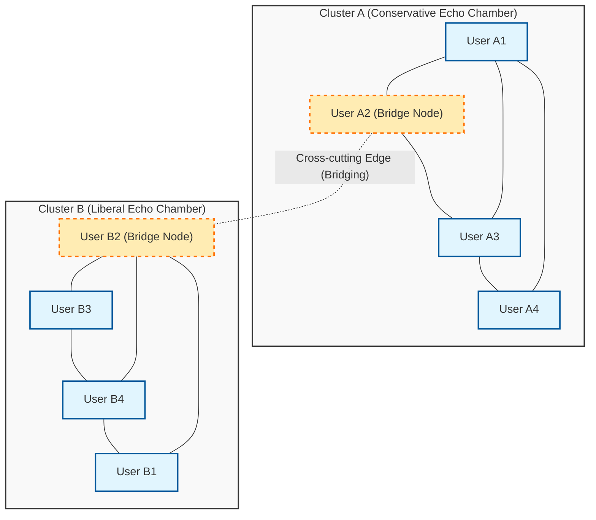
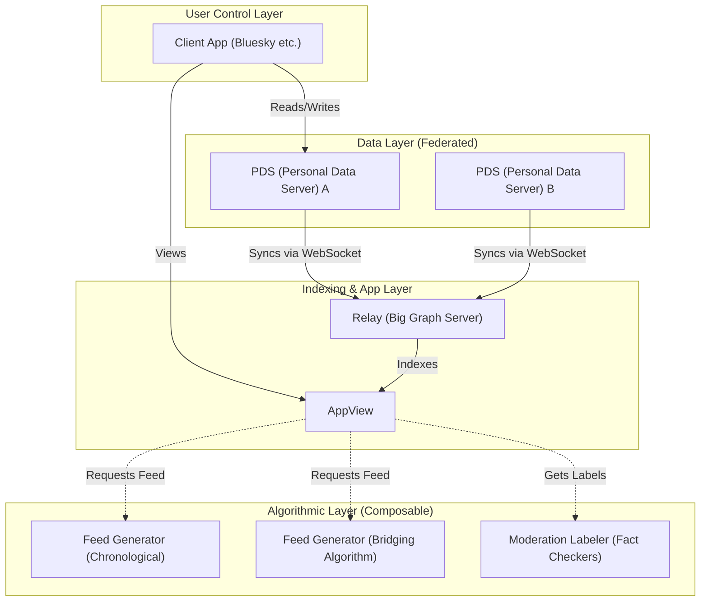

# Introduction: On the Occasion of My Memorable 100th Post

It has been several years since I started this blog, during which I have repeatedly shared technical explanations, daily development memos, and occasionally reflections on the relationship between technology and society. And now, this article marks the memorable "100th" post. I would like to express my deepest gratitude to all the readers who have continued to read up to this point.

On this milestone of the 100th post, there is a theme I desperately wanted to write down. That is the extremely significant and fundamental question in modern society: "Can technology bridge the social divide?"

The early internet (Web 1.0) was spoken of as a utopia of "democratization of knowledge," where anyone could freely broadcast and access information. The subsequent era of social media (Web 2.0) was supposed to connect people around the world and realize a "flat world." However, as of 2026, what is the reality we face? Political polarization, the spread of conspiracy theories, the proliferation of fake news, and the formation of "echo chambers" and "filter bubbles" that reject mutual understanding. Rather than connecting people, technology seems to have become a powerful engine accelerating Social Divide.

We engineers are not just entities who write code and build systems. Behind the architectures we design, the algorithms we select, and the objective functions we optimize, lie the "rules" that govern how society should be. In this article, from the perspective of an engineer, I would like to deeply explore and discuss how the current social divide is technically generated using mathematics and network theory, and simultaneously, the concrete technical approaches (bridging algorithms, decentralized SNS protocols) to overcome it.

---

# Chapter 1: The Mathematical Structure of "Echo Chambers" through the Lens of Network Theory

When discussing the social divide, the structural analysis of communities using "Network Theory ([Graph Theory](https://kenji.blog/en/p/graph-theory-dijkstra-a-star/))" is an unavoidable starting point. Human relationships on social media can be modeled as a giant graph where users are "nodes (vertices)" and follows or interactions between users are "edges."

One of the most important metrics characterizing division is the "Clustering Coefficient." The clustering coefficient $C_i$ of a certain user $i$ represents the probability that the friends of user $i$ are also friends with each other, and is defined by the following formula:

$$ C_i = \frac{2e_i}{k_i(k_i - 1)} $$

Here, $k_i$ is the degree (number of friends) of user $i$, and $e_i$ is the actual number of edges existing among those $k_i$ friends. On social media, the phenomenon where local networks (dense subgraphs) with abnormally high clustering coefficients are formed becomes the foundation of so-called "echo chambers."

Behind the formation of echo chambers works the principle of "Homophily" in sociology. As the saying "birds of a feather flock together" goes, humans have a tendency to easily connect with others who have similar attributes or ideologies. Expressing this as a probabilistic model, the probability $P(u, v)$ that an edge is formed between user $u$ and user $v$ can be assumed to be inversely proportional to their ideological distance $d(u,v)$.

$$ P(u, v) \propto e^{-\beta \cdot d(u,v)} $$

The parameter $\beta > 0$ is a constant indicating the strength of homophily. When a platform's recommendation algorithm continuously presents "content and users that the user likes (= similar to themselves)," the value of this $\beta$ is artificially pushed up. As a result, edges (Weak Ties) between groups with different ideologies drastically decrease, and the entire network splits into multiple mutually isolated clusters.

The following Mermaid diagram visualizes the concept of a divided network and the bridging that connects it.

In this way, as long as the algorithm continues to adopt the objective function $J(\theta) = \sum \log P(\text{engage} | \text{user}, \text{content})$ that only optimizes for engagement (click-through rate, dwell time), the system will fall into a local optimum (strengthening of echo chambers) and move further away from the global optimum (formation of a healthy public square).

---

# Chapter 2: Acceleration of Polarization by Algorithms and the Information Diffusion Model

To think about how information spreads within an echo chamber, let's apply the "SIR model," a mathematical model for infectious diseases, to information diffusion.
- $S$ (Susceptible) : Users who have not yet been exposed to the information
- $I$ (Infected) : Users who believe the information and are spreading it
- $R$ (Recovered/Removed) : Users who have lost interest in the information or realized it's fake and stopped spreading it

The differential equations for information propagation are expressed as follows:

$$ \frac{dS}{dt} = -\alpha S I $$
$$ \frac{dI}{dt} = \alpha S I - \gamma I $$
$$ \frac{dR}{dt} = \gamma I $$

Here, $\alpha$ is the "infection rate (ease of information spread)," and $\gamma$ is the "recovery rate (information saturation/forgetting)."
What's interesting is that empirical studies show polarizing content that incites anger or fear has a significantly higher $\alpha$ compared to general information. Furthermore, since there are fewer opportunities to encounter contradictory information within an echo chamber, $\gamma$ becomes extremely low. In other words, when an algorithm tries to maximize engagement, it inevitably learns to preferentially distribute content with high $\alpha$ and low $\gamma$—namely, "extreme views and fake news." This is the mechanism by which AI unintentionally accelerates social division.

---

# Chapter 3: Technical Solution (1) Bridging Algorithms and Community Notes

So, how should we confront this structural flaw? The first approach is the introduction of a "Bridging Algorithm."

If engagement-based recommendation algorithms reward "homogeneity," bridging algorithms reward "bridging heterogeneity." A prime successful example of this is the "Community Notes" algorithm introduced on X (formerly Twitter).

Community Notes is not a simple majority vote. In a majority vote, the opinion of the echo chamber with the most people would always win. The revolutionary aspect of Community Notes is that it highly evaluates "notes that people who usually disagree (belonging to different clusters) happen to uniformly rate as 'helpful'."

To realize this, a machine learning technique called Matrix Factorization is used. The predicted score $\hat{r}_{u,n}$ of the rating (helpful or not) that user $u$ gives to note $n$ is modeled as follows:

$$ \hat{r}_{u,n} = \mu + i_u + i_n + \mathbf{f}_u \cdot \mathbf{f}_n $$

- $\mu$ : Overall baseline (average rating tendency)
- $i_u$ : Rating bias of user $u$ (e.g., a person who always gives high ratings)
- $i_n$ : General quality of note $n$ (whether it's easy for anyone to understand)
- $\mathbf{f}_u$ : Latent feature vector of user $u$ (e.g., ideological stance)
- $\mathbf{f}_n$ : Latent feature vector of note $n$

The algorithm learns each parameter to minimize the error between the actual rating data and the predicted scores.
What is crucial here is that the final decision to display a note is not based on a simple average rating, but on "the parameter $i_n$ indicating the general quality of the note."

If a certain note receives a massive number of high ratings from a specific biased group (e.g., only right-wing or only left-wing), those high ratings are absorbed by the latent vector term $\mathbf{f}_u \cdot \mathbf{f}_n$, and $i_n$ does not become high. However, if it receives high ratings from both the right ($\mathbf{f}_u > 0$) and the left ($\mathbf{f}_u < 0$), it can no longer be explained solely by the dot product of the latent vectors, and as a result, the algorithm learns that "this note itself is universally excellent ($i_n$ is high)."

Through this mathematical approach, it becomes possible to algorithmically discover and evaluate "consensus formation across echo chambers." This is a highly powerful technical breakthrough for bridging social divisions.

---

# Chapter 4: Technical Solution (2) Decentralized SNS Protocols (AT Protocol / ActivityPub)

While bridging algorithms are powerful, the structural issue remains that a single giant corporation (centralized platform) monopolizes the algorithm. The algorithm can be changed at any time by a single management policy of the platform.

The second approach to this is a paradigm shift at the architecture level via "Decentralized Social Protocols." Currently, ActivityPub (adopted by Mastodon, etc.) and AT Protocol (adopted by Bluesky) are attracting significant attention.

AT Protocol (Authenticated Transfer Protocol), in particular, has an extremely beautiful design philosophy of "separating data and algorithms."

The greatest achievement of the AT Protocol is that it has decoupled "feed generation (algorithms)" and "moderation (labeling)" from the main platform, making them freely selectable and composable by the users themselves (Custom Feeds / Stackable Moderation).

Until now, we could choose "which SNS to use," but we could not choose "which algorithm will bathe us in information." In the world of AT Protocol, one person can choose a "chronological" feed, another can install an "academic feed that provides counterarguments to their opinions," and yet another can subscribe to "moderation labels from a third-party organization that hides inappropriate words."

Backed by cryptographic technology (DID: Decentralized Identifiers) and data structures (Merkle Search Trees: MST), this protocol restores "informational self-determination" to users. As algorithms are no longer black boxes but compete and are selected in an open market, it holds the potential to transform the incentive structure from engagement-supremacy algorithms to ones that prioritize the mental health of users and the soundness of society.

---

# Chapter 5: The Philosophy of Open Source and the Social Responsibility of Engineers

Thus far, I have described the analysis using network theory and the concrete technologies to overcome it (Matrix Factorization in Community Notes, decentralized architecture of AT Protocol). However, ultimately, what bridges social divisions is not mere code or mathematical formulas. It is the "human will and philosophy" that creates them.

In the world of software engineering, there is a great culture called "Open Source." Starting with Linux, most of the foundational technologies that build the internet have been created by strangers around the world cooperating, debating, and merging code across ideologies and borders. The open-source community possesses a mechanism not to eliminate conflicts, but to elevate them into constructive consensus building through "pull requests" and "code reviews."

I believe that this open-source philosophy itself will serve as a hint to repair our divided modern society. Making systems transparent, entrusting the choice of algorithms to users, and designing a decentralized public space (Public Square) where diverse values can coexist. That is a critically important social responsibility imposed on modern engineers.

Code is law, and architecture is politics. A single line of code we write, a single API endpoint we define, or a database schema we design shapes the cognition of millions or hundreds of millions of users; it can accelerate social division, or it can build bridges that encourage dialogue.

---

# Conclusion: Finishing the 100th Article

"Can technology bridge the social divide?"

My answer to this question is: "Technology alone cannot bridge it, but properly designed technology can become a 'scaffolding' for humans to overcome the divide."

It is impossible to completely erase fundamental human biases (homophily and confirmation bias). However, it is possible to stop the rampage of algorithms that solely pursue engagement, introduce mathematical models like Community Notes that evaluate "bridging," and return choices to users through autonomous decentralized architectures like the AT Protocol.

This blog marks its 100th post with this entry. In previous articles, I have focused on the so-called "How," such as language specifications and how to use frameworks. However, in the coming era where AI automatically generates code and all technologies become commoditized, what is most important for us engineers are the ethical and philosophical questions of "What (what to make)" and "Why (why make it)."

Technology is not magic. It is a mirror of humanity. If society is divided, it is because the systems we built are reflecting and amplifying that division. That is precisely why I believe that by rewriting the systems, we can slightly, but surely, change the state of society for the better.

From the 101st post onward, as an engineer, I would like to continue standing at the intersection of code and society, deepening my thoughts. Thank you very much for reading this long piece to the end. I hope that the networks of the future will not be walls that divide us, but bridges for us to understand each other.

(End)

