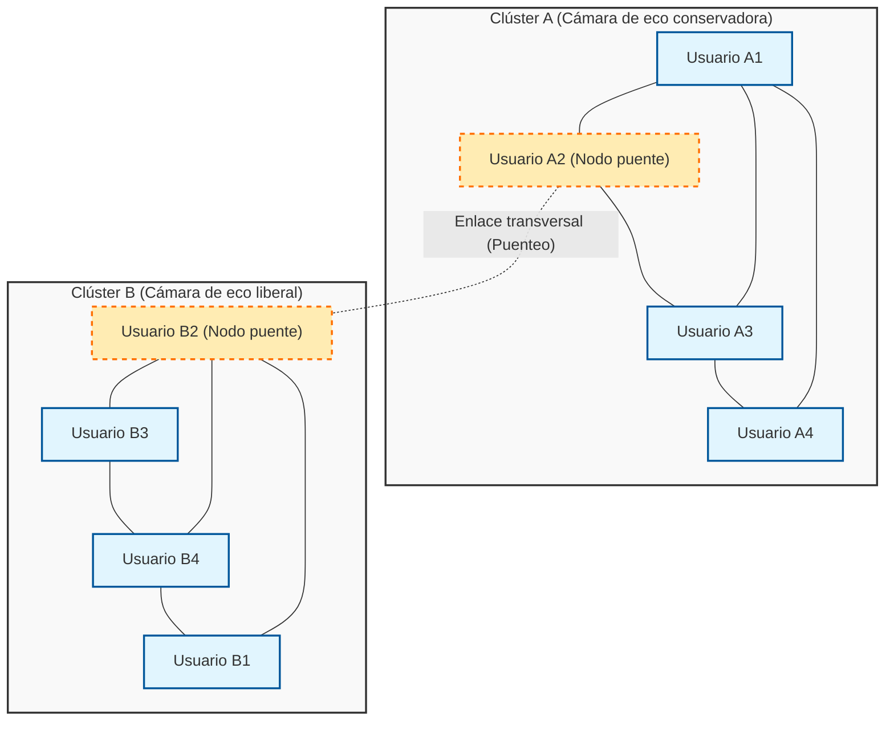
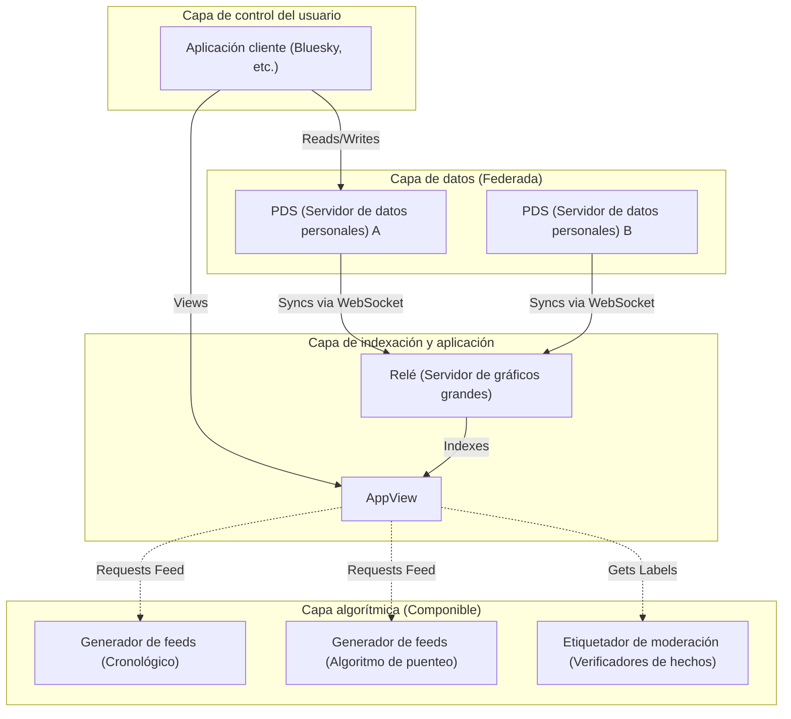

# Introducción: En conmemoración del artículo número 100

Han pasado varios años desde que lancé este blog, y he estado acumulando explicaciones técnicas, notas diarias de desarrollo y, a veces, reflexiones sobre la relación entre la tecnología y la sociedad. Y esta vez, este artículo marca la memorable publicación "número 100". Quiero expresar mi más sincero agradecimiento a todos los lectores que han seguido leyendo hasta aquí.

En este hito del número 100, hay un tema que absolutamente quería dejar por escrito. Es la pregunta extremadamente importante y fundamental en la sociedad moderna: "¿Puede la tecnología cerrar la brecha social?".

La Internet temprana (Web 1.0) se describía como una utopía de la "democratización del conocimiento" donde cualquiera podía publicar y acceder a la información libremente. La era de las redes sociales que siguió (Web 2.0) suponía conectar a personas de todo el mundo y hacer realidad un "mundo plano". Sin embargo, a partir de 2026, ¿cuál es la realidad a la que nos enfrentamos? Polarización política, la propagación de teorías de conspiración, la difusión de noticias falsas y la formación de "cámaras de eco" y "burbujas de filtros" que rechazan el entendimiento mutuo. Lejos de conectar a las personas, la tecnología parece haberse convertido en un poderoso motor que acelera la brecha social (Social Divide).

Nosotros, los ingenieros, no somos solo entidades que escriben código y construyen sistemas. Detrás de las arquitecturas que diseñamos, los algoritmos que seleccionamos y las funciones objetivo (Objective Function) que optimizamos, se esconden "reglas" que definen cómo debería ser la sociedad. En este artículo, desde la perspectiva de un ingeniero, quiero desentrañar matemática y teóricamente (teoría de redes) cómo se genera técnicamente la división social actual, y al mismo tiempo profundizar en enfoques técnicos específicos (algoritmos de puenteo o Bridging Algorithms, protocolos de redes sociales descentralizadas) para superarla.

---

# Capítulo 1: La estructura matemática de la "Cámara de eco" desde la teoría de redes

Al discutir la brecha social, lo primero que no podemos evitar es el análisis estructural de la comunidad utilizando la "teoría de redes (Graph Theory)". Las relaciones humanas en las redes sociales se pueden modelar como un gráfico gigante donde los usuarios son "nodos (vértices)" y los seguimientos o interacciones entre usuarios son "aristas (bordes)".

Uno de los indicadores más importantes que caracterizan la división es el "coeficiente de agrupamiento (Clustering Coefficient)". El coeficiente de agrupamiento $C_i$ de un usuario $i$ indica la probabilidad de que los amigos del usuario $i$ sean amigos entre sí, y se define por la siguiente fórmula.

$$ C_i = \frac{2e_i}{k_i(k_i - 1)} $$

Aquí, $k_i$ es el grado (número de amigos) del usuario $i$, y $e_i$ es el número de aristas reales que existen entre esos $k_i$ amigos. En las redes sociales, el fenómeno donde se forman redes locales (subgrafos densos) con un coeficiente de agrupamiento anormalmente alto es la base de las llamadas "cámaras de eco".

Detrás de la formación de cámaras de eco opera el principio sociológico de la "homofilia (Homophily: tendencia a unirse a los iguales)". Como dice el refrán "Dios los cría y ellos se juntan", los seres humanos tienden a conectarse más fácilmente con otras personas que tienen atributos o ideologías similares a las suyas. Expresando esto como un modelo de probabilidad, podemos asumir que la probabilidad $P(u, v)$ de que se forme una arista entre el usuario $u$ y el usuario $v$ es inversamente proporcional a su distancia ideológica $d(u,v)$.

$$ P(u, v) \propto e^{-\beta \cdot d(u,v)} $$

El parámetro $\beta > 0$ es una constante que indica la fuerza de la homofilia. Cuando el algoritmo de recomendación de la plataforma continúa presentando "contenido o usuarios que al usuario le gustan (es decir, similares a sí mismo)", el valor de este $\beta$ se eleva artificialmente. Como resultado, las aristas (vínculos débiles: Weak Ties) entre grupos con ideologías diferentes disminuyen drásticamente, y toda la red se divide en múltiples clústeres aislados entre sí.

El siguiente diagrama de Mermaid visualiza el concepto de una red dividida y el puenteo (bridging) que los conecta.

De esta manera, mientras el algoritmo continúe adoptando una función objetivo $J(\theta) = \sum \log P(\text{engage} | \text{user}, \text{content})$ que optimiza solo el compromiso (tasa de clics, tiempo de permanencia), el sistema caerá en un óptimo local (refuerzo de la cámara de eco) y se alejará de la optimización global (formación de un espacio público saludable).

---

# Capítulo 2: Aceleración de la polarización mediante algoritmos y modelos de difusión de información

Para pensar en cómo se difunde la información dentro de una cámara de eco, apliquemos el "modelo SIR", un modelo matemático de enfermedades infecciosas, a la difusión de información.
- $S$ (Susceptible) : Usuarios que aún no han sido expuestos a la información.
- $I$ (Infected) : Usuarios que creen en la información y la están difundiendo.
- $R$ (Recovered/Removed) : Usuarios que han perdido interés en la información, o se han dado cuenta de que es falsa y han dejado de difundirla.

Las ecuaciones diferenciales para la propagación de la información se expresan de la siguiente manera:

$$ \frac{dS}{dt} = -\alpha S I $$
$$ \frac{dI}{dt} = \alpha S I - \gamma I $$
$$ \frac{dR}{dt} = \gamma I $$

Aquí, $\alpha$ es la "tasa de infección (facilidad de difusión de la información)", y $\gamma$ es la "tasa de recuperación (saturación/olvido de la información)".
Lo interesante es que hay investigaciones empíricas que muestran que el contenido extremo que incita a la ira o al miedo (Polarizing Content) tiene una $\alpha$ significativamente más alta en comparación con la información general. Además, debido a que hay pocas oportunidades de encontrar información refutatoria dentro de una cámara de eco, $\gamma$ se vuelve extremadamente baja. Es decir, cuando un algoritmo intenta maximizar el compromiso, inevitablemente aprende a entregar de manera prioritaria contenido con un $\alpha$ alto y un $\gamma$ bajo, o sea, "opiniones extremas y noticias falsas". Este es el mecanismo por el cual la IA está acelerando involuntariamente la brecha social.

---

# Capítulo 3: Soluciones técnicas (1) Algoritmos de puenteo y Community Notes

Entonces, ¿cómo deberíamos enfrentarnos a este defecto estructural? El primer enfoque es la introducción de un "Algoritmo de puenteo (Bridging Algorithm)".

Si los algoritmos de recomendación basados en el compromiso recompensan la "homogeneidad", los algoritmos de puenteo recompensan el "puenteo de la heterogeneidad". Un ejemplo representativo y exitoso de esto es el algoritmo de las "Notas de la comunidad (Community Notes)" introducido en X (anteriormente Twitter).

Las Notas de la comunidad no son una simple regla de la mayoría. Si fuera una regla de la mayoría, la opinión de la cámara de eco con más personas siempre ganaría. El aspecto revolucionario de las Notas de la comunidad radica en que valoran altamente aquellas "notas en las que personas que normalmente no están de acuerdo (que pertenecen a diferentes clústeres) coinciden accidentalmente en evaluarlas como 'útiles'".

Para lograr esto, se utiliza una técnica de aprendizaje automático llamada Factorización de matrices (Matrix Factorization). La puntuación predictiva $\hat{r}_{u,n}$ de la evaluación que el usuario $u$ le da a la nota $n$ (si fue útil o no) se modela de la siguiente manera:

$$ \hat{r}_{u,n} = \mu + i_u + i_n + \mathbf{f}_u \cdot \mathbf{f}_n $$

- $\mu$ : Línea base global (tendencia de evaluación promedio)
- $i_u$ : Sesgo de evaluación del usuario $u$ (por ejemplo, personas que siempre dan altas calificaciones)
- $i_n$ : Calidad general de la nota $n$ (si es fácil de entender para cualquiera)
- $\mathbf{f}_u$ : Vector de características latentes del usuario $u$ (como su posición ideológica)
- $\mathbf{f}_n$ : Vector de características latentes de la nota $n$

El algoritmo aprende cada parámetro para minimizar el error entre los datos de evaluación reales y las puntuaciones predictivas.
Lo importante aquí es que lo que se utiliza para el juicio final de mostrar la nota no es simplemente la calificación promedio, sino el "parámetro $i_n$ que indica la calidad general de la nota".

Si una nota recibe una gran cantidad de calificaciones altas de un grupo sesgado específico (por ejemplo, solo de la derecha, o solo de la izquierda), esas altas calificaciones son absorbidas por el término del vector latente $\mathbf{f}_u \cdot \mathbf{f}_n$, y $i_n$ no aumentará. Sin embargo, si recibe calificaciones altas tanto de la derecha ($\mathbf{f}_u > 0$) como de la izquierda ($\mathbf{f}_u < 0$), no se puede explicar solo por el producto punto de los vectores latentes, y como resultado se aprende que "esta nota en sí misma es universalmente excelente (alta $i_n$)".

A través de este enfoque matemático, se hace posible descubrir algorítmicamente y evaluar la "formación de consensos más allá de las cámaras de eco". Este es un avance tecnológico muy poderoso para cerrar la brecha social.

---

# Capítulo 4: Soluciones técnicas (2) Protocolos de redes sociales descentralizadas (AT Protocol / ActivityPub)

Aunque el algoritmo de puenteo es poderoso, persiste el problema estructural de que una sola empresa gigante (plataforma centralizada) monopoliza el algoritmo. Con un solo cambio en la política de gestión de la plataforma, el algoritmo puede ser alterado en cualquier momento.

El segundo enfoque para esto es un cambio de paradigma a nivel de arquitectura mediante "Protocolos de redes sociales descentralizadas (Decentralized Social Protocols)". Actualmente, ActivityPub (adoptado por Mastodon, etc.) y AT Protocol (adoptado por Bluesky) están atrayendo mucha atención.

En particular, el AT Protocol (Authenticated Transfer Protocol) tiene una filosofía de diseño muy hermosa de "separación de datos y algoritmos".

El mayor logro del AT Protocol es haber separado la "generación de feeds (algoritmo)" y la "moderación (etiquetado)" de la plataforma principal, permitiendo a los propios usuarios seleccionarlas y combinarlas libremente (Composable) (Custom Feeds / Stackable Moderation).

Hasta ahora, podíamos elegir "qué red social usar", pero no podíamos elegir "con qué algoritmo consumir información". En el mundo del AT Protocol, una persona puede elegir un feed en "orden cronológico", otra puede instalar un "feed académico que proporciona contraargumentos a sus propias opiniones", y otra puede suscribirse a una "etiqueta de moderación de una organización externa que oculta palabras inapropiadas".

Respaldado por tecnología criptográfica (DID: Decentralized Identifiers) y estructuras de datos (Merkle Search Trees: MST), este protocolo devuelve a los usuarios el "derecho a la autodeterminación de la información". Al permitir que los algoritmos no sean cajas negras, sino que compitan y se elijan en un mercado abierto, tiene el potencial de cambiar la estructura de incentivos de algoritmos que priorizan el compromiso supremo a algoritmos que valoran la salud mental de los usuarios y la salud de la sociedad.

---

# Capítulo 5: La filosofía de código abierto y la responsabilidad social del ingeniero

Hasta ahora, hemos expuesto el análisis basado en la teoría de redes y las tecnologías específicas (Factorización de matrices de Community Notes, arquitectura descentralizada de AT Protocol) para superarlo. Sin embargo, en última instancia, lo que cerrará la brecha en la sociedad no son simples códigos o fórmulas matemáticas. Es la "voluntad y filosofía humana" que las crea.

En el mundo de la ingeniería de software, existe una gran cultura llamada "Código abierto (Open Source)". Comenzando con Linux, la mayoría de las tecnologías fundamentales que construyen Internet han sido creadas por personas desconocidas de todo el mundo que colaboran, debaten y fusionan códigos superando ideologías y fronteras nacionales. La comunidad de código abierto tiene un mecanismo que no elimina los conflictos, sino que los eleva a la formación de consensos constructivos en forma de "pull requests" y "revisiones de código".

Creo que esta misma filosofía del código abierto es la clave para reparar nuestra sociedad moderna dividida. Hacer que el sistema sea transparente, devolver el derecho de elección de algoritmos a los usuarios y diseñar un espacio público descentralizado (Public Square) donde puedan coexistir diversos valores. Esa es una responsabilidad social extremadamente importante impuesta a los ingenieros modernos.

El código es ley, y la arquitectura es política. Una línea de código que escribimos, un endpoint de API que definimos o un esquema de base de datos que diseñamos pueden moldear la cognición de millones o miles de millones de usuarios, y a veces acelerar la división social, o a veces construir puentes que fomentan el diálogo.

---

# Conclusión: Al finalizar el artículo número 100

"¿Puede la tecnología cerrar la brecha social?"

Mi respuesta a esta pregunta es: "La tecnología por sí sola no puede cerrarla, pero una tecnología diseñada correctamente puede servir de 'andamio' para que los humanos superen la división".

Es imposible borrar completamente los sesgos fundamentales de los humanos (como la homofilia y el sesgo de confirmación). Sin embargo, es posible detener el desenfreno de los algoritmos que solo persiguen el compromiso, introducir modelos matemáticos que evalúen el "puenteo" como las Notas de la comunidad, y devolver el derecho de elección a los usuarios a través de arquitecturas autónomas y descentralizadas como el AT Protocol.

Este blog llega hoy a su edición número 100. En los artículos anteriores, nos hemos centrado en el "Cómo (How)", es decir, las especificaciones del lenguaje y cómo usar los frameworks. Sin embargo, en la era que viene, donde la IA generará código automáticamente y todas las tecnologías se convertirán en comodidades, lo más importante para nosotros los ingenieros son las preguntas éticas y filosóficas del "Qué (What: qué hacer)" y el "Por qué (Why: por qué hacerlo)".

La tecnología no es magia. Es un espejo de la humanidad. Si la sociedad está dividida, es porque los sistemas que hemos construido reflejan y amplifican esa división. Por eso mismo, creo que al reescribir los sistemas podemos cambiar el rumbo de la sociedad poco a poco, pero con seguridad, en una dirección mejor.

A partir de la publicación 101, como ingeniero, me gustaría seguir de pie en la intersección del código y la sociedad para profundizar en mis reflexiones. Muchas gracias por acompañarme hasta el final de este largo texto. Con la esperanza de que las redes del futuro no sean muros que nos dividan, sino puentes para entendernos mutuamente.

(Fin)

