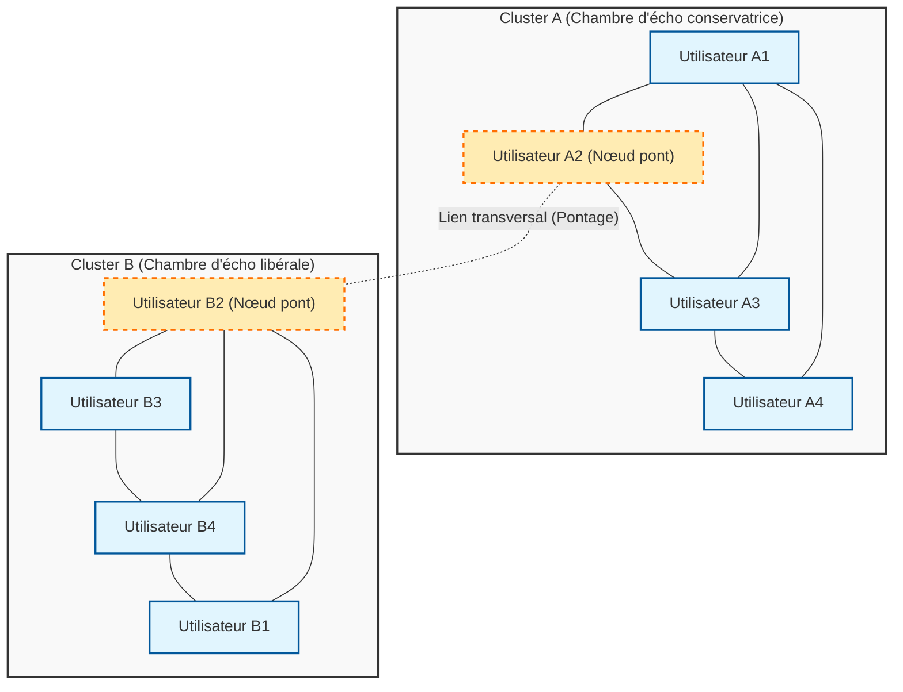
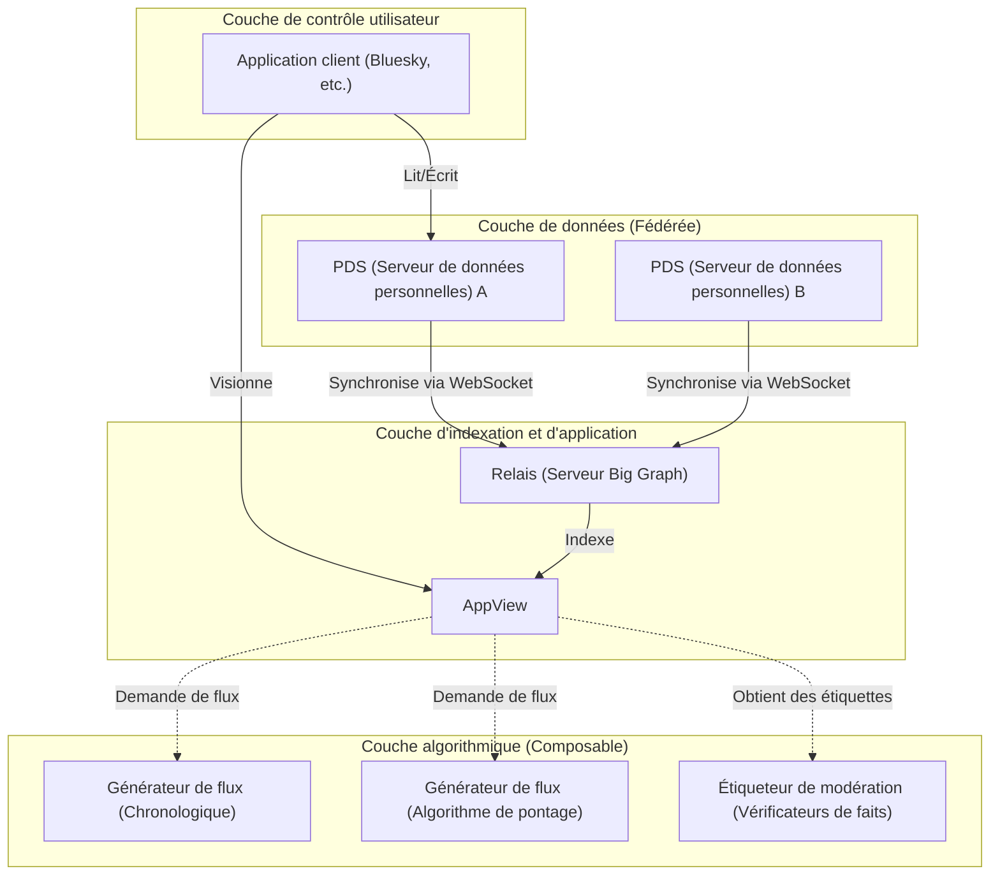

# Introduction : À l'occasion du 100e article mémorable

Depuis le lancement de ce blog il y a quelques années, j'ai accumulé des explications techniques, des mémos de développement quotidien et parfois des réflexions sur la relation entre la technologie et la société. Et cette fois, cet article marque la "100e" publication mémorable. Je tiens à exprimer ma profonde gratitude à vous tous, lecteurs, qui m'avez lu jusqu'ici.

À l'occasion de cette étape importante qu'est la 100e publication, il y a un thème que je tenais absolument à aborder. Il s'agit d'une question fondamentale et extrêmement cruciale dans la société moderne : "La technologie peut-elle combler la fracture sociale ?"

L'Internet de la première heure (Web 1.0) a été décrit comme l'utopie de la "démocratisation du savoir", où chacun pouvait librement diffuser et accéder à l'information. L'ère des médias sociaux qui a suivi (Web 2.0) devait connecter les gens du monde entier et réaliser un "monde plat". Cependant, en 2026, quelle est la réalité à laquelle nous sommes confrontés ? Polarisation politique, prolifération de théories du complot, diffusion de fausses nouvelles, et formation de "chambres d'écho" et de "bulles de filtres" qui refusent la compréhension mutuelle. Au lieu de connecter les gens, la technologie semble plutôt être devenue un puissant moteur qui accélère la fracture sociale (Social Divide).

Nous, ingénieurs, ne sommes pas simplement là pour écrire du code et construire des systèmes. Derrière les architectures que nous concevons, les algorithmes que nous choisissons et les fonctions objectifs (Objective Function) que nous optimisons, se cachent des "règles" qui définissent la façon dont la société devrait être. Dans cet article, du point de vue d'un ingénieur, je souhaite analyser mathématiquement et par la théorie des réseaux comment la fracture sociale actuelle est générée techniquement, et en même temps, explorer en profondeur les approches techniques spécifiques (algorithmes de pontage, protocoles de réseaux sociaux décentralisés) pour la surmonter.

---

# Chapitre 1 : La structure mathématique des "chambres d'écho" vue par la théorie des réseaux

Pour discuter de la fracture sociale, on ne peut éviter l'analyse de la structure des communautés à l'aide de la "théorie des réseaux" (Graph Theory). Les relations humaines sur les médias sociaux peuvent être modélisées comme un graphe géant où les utilisateurs sont des "nœuds" (sommets) et les abonnements ou interactions entre utilisateurs sont des "arêtes" (liens).

L'un des indicateurs les plus importants caractérisant la fracture est le "coefficient de clustering" (Clustering Coefficient). Le coefficient de clustering $C_i$ d'un utilisateur $i$ indique la probabilité que les amis de l'utilisateur $i$ soient également amis entre eux, et est défini par la formule suivante :

$$ C_i = \frac{2e_i}{k_i(k_i - 1)} $$

Ici, $k_i$ est le degré (nombre d'amis) de l'utilisateur $i$, et $e_i$ est le nombre d'arêtes réelles existant parmi ces $k_i$ amis. Sur les médias sociaux, le phénomène de formation de réseaux locaux (sous-graphes denses) où ce coefficient de clustering est anormalement élevé constitue la base de ce que l'on appelle les "chambres d'écho".

Derrière la formation des chambres d'écho, le principe d'"homophilie" (Homophily : similitude), utilisé en sociologie, est à l'œuvre. Comme le dit le proverbe "qui se ressemble s'assemble", les humains ont tendance à se connecter facilement avec d'autres personnes partageant des attributs ou des idéologies similaires. Si nous exprimons cela comme un modèle probabiliste, nous pouvons supposer que la probabilité $P(u, v)$ de formation d'une arête entre l'utilisateur $u$ et l'utilisateur $v$ est inversement proportionnelle à la distance idéologique $d(u,v)$ entre eux deux.

$$ P(u, v) \propto e^{-\beta \cdot d(u,v)} $$

Le paramètre $\beta > 0$ est une constante indiquant la force de l'homophilie. Si l'algorithme de recommandation de la plateforme continue de présenter "les contenus et utilisateurs que l'utilisateur aime (= qui lui ressemblent)", la valeur de ce $\beta$ est artificiellement augmentée. En conséquence, les arêtes entre des groupes d'idéologies différentes (liens faibles : Weak Ties) diminuent drastiquement, et le réseau tout entier se fragmente en plusieurs clusters isolés les uns des autres.

Le diagramme Mermaid suivant visualise le concept d'un réseau fracturé et du pontage (bridging) qui le relie.

Ainsi, tant que l'algorithme continue d'adopter la fonction objectif $J(\theta) = \sum \log P(\text{engage} | \text{user}, \text{content})$ qui optimise uniquement l'engagement (taux de clics, temps de présence), le système tombera dans un optimum local (renforcement des chambres d'écho) et s'éloignera de l'optimum global (formation d'un espace public sain).

---

# Chapitre 2 : Accélération de la polarisation par les algorithmes et modèles de diffusion de l'information

Pour comprendre comment l'information se diffuse au sein d'une chambre d'écho, appliquons le "modèle SIR", un modèle mathématique des maladies infectieuses, à la diffusion de l'information.
- $S$ (Susceptible) : Utilisateurs qui n'ont pas encore été exposés à l'information
- $I$ (Infected) : Utilisateurs qui croient à l'information et la diffusent
- $R$ (Recovered/Removed) : Utilisateurs qui ont perdu tout intérêt pour l'information ou qui ont arrêté de la diffuser après avoir réalisé qu'elle était fausse

Les équations différentielles de la propagation de l'information s'expriment comme suit :

$$ \frac{dS}{dt} = -\alpha S I $$
$$ \frac{dI}{dt} = \alpha S I - \gamma I $$
$$ \frac{dR}{dt} = \gamma I $$

Ici, $\alpha$ est le "taux d'infection (facilité de diffusion de l'information)", et $\gamma$ est le "taux de guérison (saturation / oubli de l'information)".
Ce qui est intéressant, c'est qu'il existe des études empiriques montrant que le contenu extrême (Polarizing Content), qui attise la colère ou la peur, a un $\alpha$ significativement plus élevé que l'information générale. De plus, comme les opportunités d'être exposé à des informations contradictoires sont rares au sein d'une chambre d'écho, $\gamma$ devient extrêmement faible. Autrement dit, lorsque l'algorithme cherche à maximiser l'engagement, il apprend inévitablement à prioriser les contenus avec un $\alpha$ élevé et un $\gamma$ faible, c'est-à-dire "les opinions extrêmes et les fausses nouvelles". C'est le mécanisme par lequel l'IA accélère involontairement la fracture sociale.

---

# Chapitre 3 : Solution technique (1) Algorithmes de pontage et Community Notes

Alors, comment devons-nous faire face à ce défaut structurel ? La première approche est l'introduction d'"algorithmes de pontage" (Bridging Algorithm).

Si un algorithme de recommandation basé sur l'engagement récompense "l'homogénéité", un algorithme de pontage récompense "la liaison de l'hétérogénéité". L'un des exemples de réussite les plus représentatifs est l'algorithme des "Community Notes" (Notes de la communauté) introduit sur X (anciennement Twitter).

Les Community Notes ne sont pas qu'un simple vote à la majorité. Dans un vote à la majorité, l'opinion de la chambre d'écho avec le plus grand nombre de personnes gagnerait toujours. L'aspect révolutionnaire des Community Notes réside dans le fait qu'elles valorisent grandement "les notes évaluées comme 'utiles' par une coïncidence de personnes qui sont généralement en désaccord (appartenant à des clusters différents)".

Pour réaliser cela, une méthode d'apprentissage automatique appelée factorisation de matrices (Matrix Factorization) est utilisée. Le score prédictif $\hat{r}_{u,n}$ de l'évaluation (utile ou non) qu'un utilisateur $u$ donne à une note $n$ est modélisé comme suit :

$$ \hat{r}_{u,n} = \mu + i_u + i_n + \mathbf{f}_u \cdot \mathbf{f}_n $$

- $\mu$ : Ligne de base globale (tendance moyenne d'évaluation)
- $i_u$ : Biais d'évaluation de l'utilisateur $u$ (par exemple, quelqu'un qui donne toujours de bonnes notes)
- $i_n$ : Qualité générale de la note $n$ (est-elle facile à comprendre pour tout le monde ?)
- $\mathbf{f}_u$ : Vecteur de caractéristiques latentes de l'utilisateur $u$ (position idéologique, etc.)
- $\mathbf{f}_n$ : Vecteur de caractéristiques latentes de la note $n$

L'algorithme apprend chaque paramètre pour minimiser l'erreur entre les données d'évaluation réelles et le score prédictif.
Le point important ici est que ce n'est pas la simple évaluation moyenne qui est utilisée pour déterminer l'affichage final de la note, mais "le paramètre $i_n$ indiquant la qualité générale de la note".

Si une certaine note obtient une grande quantité d'évaluations positives d'un groupe spécifique et biaisé (par exemple, uniquement de droite ou uniquement de gauche), ces évaluations positives seront absorbées par le terme du vecteur latent $\mathbf{f}_u \cdot \mathbf{f}_n$, et $i_n$ ne sera pas élevé. Cependant, si elle obtient de bonnes évaluations à la fois de la droite ($\mathbf{f}_u > 0$) et de la gauche ($\mathbf{f}_u < 0$), cela ne peut plus être expliqué uniquement par le produit scalaire des vecteurs latents. En conséquence, l'algorithme apprend que "cette note elle-même est universellement excellente ($i_n$ est élevé)".

Grâce à une telle approche mathématique, il devient possible de découvrir et d'évaluer algorithmiquement la "formation de consensus au-delà des chambres d'écho". C'est une percée technologique très puissante pour combler la fracture sociale.

---

# Chapitre 4 : Solution technique (2) Protocoles de réseaux sociaux décentralisés (AT Protocol / ActivityPub)

Bien que les algorithmes de pontage soient puissants, le problème structurel résidant dans le fait qu'une seule entreprise géante (une plateforme centralisée) monopolise l'algorithme demeure. L'algorithme peut être modifié à tout moment par une simple décision de gestion de la plateforme.

La deuxième approche pour résoudre ce problème est un changement de paradigme au niveau de l'architecture via les "protocoles de réseaux sociaux décentralisés" (Decentralized Social Protocols). Actuellement, ActivityPub (adopté par Mastodon, etc.) et AT Protocol (adopté par Bluesky) suscitent beaucoup d'attention.

En particulier, l'AT Protocol (Authenticated Transfer Protocol) possède une philosophie de conception très élégante de "séparation des données et des algorithmes".

La plus grande réussite de l'AT Protocol est d'avoir séparé "la génération de flux (algorithme)" et "la modération (étiquetage)" de la plateforme elle-même, rendant possible pour les utilisateurs de choisir et de combiner (Composable) librement ce qu'ils souhaitent (Custom Feeds / Stackable Moderation).

Jusqu'à présent, nous pouvions choisir "quel réseau social utiliser", mais nous ne pouvions pas choisir "par quel algorithme être inondé d'informations". Dans le monde de l'AT Protocol, une personne peut choisir un flux "chronologique", une autre peut installer un "flux académique qui fournit des contre-arguments à ses propres opinions", et une autre encore peut s'abonner à une "étiquette de modération d'une organisation tierce qui masque les mots inappropriés".

Ce protocole, soutenu par des technologies cryptographiques (DID : Decentralized Identifiers) et des structures de données (Merkle Search Trees : MST), permet aux utilisateurs de reprendre leur "droit à l'autodétermination de l'information". En transformant l'algorithme d'une boîte noire à une entité en concurrence et sélectionnée sur un marché ouvert, cela a le potentiel de changer la structure des incitations, passant d'un algorithme prônant la suprématie de l'engagement à un algorithme qui valorise la santé mentale des utilisateurs et la santé de la société.

---

# Chapitre 5 : La philosophie de l'open source et la responsabilité sociale des ingénieurs

Jusqu'ici, j'ai évoqué l'analyse par la théorie des réseaux et les technologies spécifiques pour la surmonter (la factorisation de matrices pour les Community Notes, l'architecture décentralisée de l'AT Protocol). Cependant, en fin de compte, ce qui comblera la fracture sociale ne se résume pas à de simples lignes de code ou formules mathématiques. C'est "la volonté et la philosophie humaines" qui les créent.

Dans le monde de l'ingénierie logicielle, il existe la grande culture de "l'Open Source". À commencer par Linux, la plupart des technologies fondamentales qui construisent Internet ont été créées par des inconnus du monde entier collaborant, débattant et fusionnant du code au-delà des idéologies et des frontières. La communauté open source possède un mécanisme permettant, non pas d'éliminer les conflits, mais de les sublimer en une formation de consensus constructive sous la forme de "pull requests" et de "code reviews".

Je crois que cette philosophie open source sera la clé pour réparer notre société moderne divisée. Rendre les systèmes transparents, laisser le choix des algorithmes aux utilisateurs, et concevoir un espace public décentralisé (Public Square) où des valeurs diverses peuvent coexister. C'est une responsabilité sociale extrêmement importante imposée aux ingénieurs modernes.

Le code est la loi, et l'architecture est la politique. Une seule ligne de code que nous écrivons, un seul point de terminaison d'API que nous définissons, ou le schéma de base de données que nous concevons, façonne la perception de millions, voire de centaines de millions d'utilisateurs, et peut parfois accélérer la fracture sociale ou, à l'inverse, jeter des ponts favorisant le dialogue.

---

# Conclusion : Après le 100e article

"La technologie peut-elle combler la fracture sociale ?"

Ma réponse à cette question est la suivante : "La technologie seule ne peut pas la combler, mais une technologie correctement conçue servira d'« échafaudage » aux humains pour surmonter cette fracture."

Il est impossible d'effacer complètement les biais fondamentaux de l'humain (homophilie ou biais de confirmation). Cependant, il est possible d'arrêter la dérive d'algorithmes cherchant uniquement l'engagement, d'introduire des modèles mathématiques valorisant le "pontage" comme les Community Notes, et de rendre le droit de choix aux utilisateurs grâce à des architectures autonomes et décentralisées comme l'AT Protocol.

Ce blog atteint aujourd'hui sa 100e publication. Dans les articles précédents, je me suis concentré sur ce que l'on appelle le "Comment" (How), comme les spécifications des langages ou l'utilisation des frameworks. Cependant, à l'ère où l'IA générera automatiquement du code et où toutes les technologies deviendront des commodités, ce qui sera le plus important pour nous, ingénieurs, ce sont les questions éthiques et philosophiques du "Quoi" (What - ce que nous créons) et du "Pourquoi" (Why - pourquoi nous le créons).

La technologie n'est pas magique. Elle est le miroir de l'humanité. Si la société est divisée, c'est parce que les systèmes que nous avons créés reflètent et amplifient cette division. C'est précisément pour cela que je crois qu'en réécrivant ces systèmes, nous pourrons changer la façon dont la société fonctionne petit à petit, mais sûrement, dans la bonne direction.

À partir de la 101e publication, en tant qu'ingénieur, je souhaite continuer à me tenir au carrefour du code et de la société, et à approfondir mes réflexions. Merci infiniment de m'avoir accompagné jusqu'à la fin de ce long texte. En espérant que les réseaux de demain ne soient pas des murs qui nous divisent, mais des ponts pour nous comprendre mutuellement.

(Fin)
